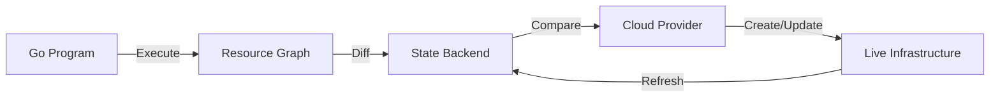
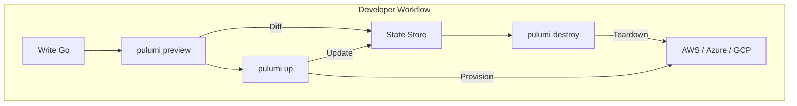
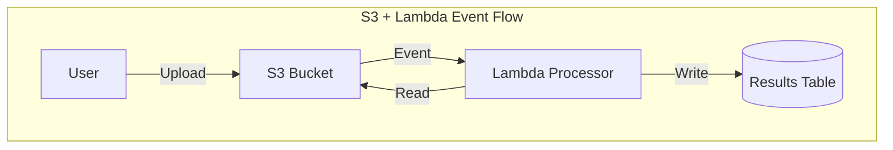
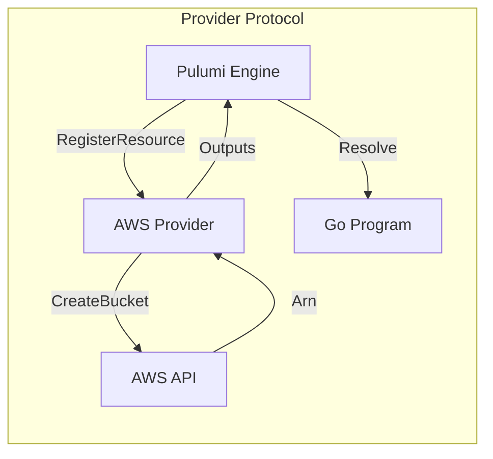

# 🏗️ Infrastructure as Code with Pulumi

## 🎯 Learning Objectives

- Understand Infrastructure as Code (IaC) foundations and Pulumi's hybrid paradigm.
- Contrast declarative vs imperative approaches using Go.
- Implement production-grade Pulumi programs for AWS VPCs, Lambda, and IAM.
- Manage state, stacks, and secrets securely with Pulumi's Go SDK.

## Introduction

Infrastructure as Code (IaC) manages computing infrastructure through machine-readable configuration files rather than interactive tools. IaC enables version control, automated testing, and repeatable deployments. While Terraform and CloudFormation dominated the space, Pulumi introduced a paradigm shift by allowing developers to define infrastructure using general-purpose programming languages, including Go.

For ML/AI systems, IaC is the bridge between experimental code and production infrastructure. Training large language models requires provisioning GPU clusters, distributed storage, and complex IAM policies. Manual console configuration is error-prone and non-reproducible. With Pulumi and Go, ML engineers codify entire training pipelines as version-controlled, testable programs that spin up in minutes and tear down cleanly.

This module explores IaC concepts, contrasts approaches, and dives into Pulumi's Go SDK. You will manage state, detect drift, and handle secrets securely. Connections to [[04 - Service Discovery and Load Balancing|⚖️ 04 - Service Discovery]] and [[06 - Cloud Networking and Observability|📡 06 - Observability]] are essential for deploying and monitoring ML infrastructure.

## Module 1: Infrastructure as Code Concepts

### 1.1 Theoretical Foundation 🧠

Modern IaC emerged from the configuration management revolution of the mid-2000s. CFEngine (1993) introduced convergent configuration: defining desired state and letting the system converge. Puppet (2005) and Chef (2009) extended this with declarative DSLs. The imperative vs declarative distinction is fundamental: imperative specifies *how* (operations), while declarative specifies *what* (end state). Pulumi's innovation is a **hybrid paradigm**: imperative Go code generates a declarative resource graph. The engine reconciles this graph against actual cloud state using diff algorithms similar to React's virtual DOM. This marries expressiveness with safety and idempotency.

### 1.2 Mental Model 📐

Imperative scripting:

```
┌─────────────────────────────────────────┐
│         Imperative Script               │
│  1. Create VPC                          │
│  2. Create Subnet                       │
│  3. Create Security Group               │
│  4. Create EC2 Instance                 │
│  Problem: Re-run creates duplicates!    │
└─────────────────────────────────────────┘
```

Declarative IaC convergence:

```
┌─────────────────────────────────────────┐
│         Declarative IaC                 │
│  ┌─────────────┐     ┌───────────────┐ │
│  │ Desired     │     │ Actual        │ │
│  │ State (Go)  │────>│ State (Cloud) │ │
│  │ VPC: yes    │     │ VPC: no       │ │
│  │ Subnet: yes │     │ Subnet: no    │ │
│  │ EC2: yes    │     │ EC2: no       │ │
│  └─────────────┘     └───────────────┘ │
│         │                    ▲         │
│         └──── Diff & Apply ──┘         │
│  Re-run: no change (idempotent)        │
└─────────────────────────────────────────┘
```

Pulumi hybrid model:

```
┌─────────────────────────────────────────┐
│         Pulumi Hybrid Model             │
│  ┌─────────┐    ┌─────────────┐        │
│  │ Go Code │───>│ Resource    │        │
│  │ (imper.)│    │ Graph       │        │
│  └─────────┘    │ (declar.)   │        │
│                 └──────┬──────┘        │
│                 ┌──────▼──────┐        │
│                 │ Pulumi      │        │
│                 │ Engine      │        │
│                 │ (diff+apply)│        │
│                 └──────┬──────┘        │
│                 ┌──────▼──────┐        │
│                 │ Cloud       │        │
│                 │ Provider    │        │
│                 └─────────────┘        │
└─────────────────────────────────────────┘
```

### 1.3 Syntax and Semantics 📝

Pulumi Go program provisioning a VPC with public and private subnets.

```go
package main

import (
	"github.com/pulumi/pulumi-aws/sdk/v6/go/aws/ec2"
	"github.com/pulumi/pulumi/sdk/v3/go/pulumi"
)

func main() {
	pulumi.Run(func(ctx *pulumi.Context) error {
		// WHY: Tag everything for cost allocation.
		tags := pulumi.StringMap{
			"Project": pulumi.String("ml-platform"),
			"Env":     pulumi.String(ctx.Stack()),
		}

		// WHY: /16 provides 65k IPs for large training clusters.
		vpc, err := ec2.NewVpc(ctx, "ml-vpc", &ec2.VpcArgs{
			CidrBlock:          pulumi.String("10.0.0.0/16"),
			EnableDnsHostnames: pulumi.Bool(true),
			EnableDnsSupport:   pulumi.Bool(true),
			Tags:               tags,
		})
		if err != nil {
			return err
		}

		igw, err := ec2.NewInternetGateway(ctx, "ml-igw", &ec2.InternetGatewayArgs{
			VpcId: vpc.ID(),
			Tags:  tags,
		})
		if err != nil {
			return err
		}

		publicSubnet, err := ec2.NewSubnet(ctx, "ml-public-a", &ec2.SubnetArgs{
			VpcId:               vpc.ID(),
			CidrBlock:           pulumi.String("10.0.1.0/24"),
			AvailabilityZone:    pulumi.String("us-east-1a"),
			MapPublicIpOnLaunch: pulumi.Bool(true),
			Tags:                tags,
		})
		if err != nil {
			return err
		}

		publicRT, err := ec2.NewRouteTable(ctx, "ml-public-rt", &ec2.RouteTableArgs{
			VpcId: vpc.ID(),
			Routes: ec2.RouteTableRouteArray{
				ec2.RouteTableRouteArgs{
					CidrBlock: pulumi.String("0.0.0.0/0"),
					GatewayId: igw.ID(),
				},
			},
			Tags: tags,
		})
		if err != nil {
			return err
		}

		// WHY: Explicit association prevents routing errors.
		_, err = ec2.NewRouteTableAssociation(ctx, "ml-public-rta", &ec2.RouteTableAssociationArgs{
			SubnetId:     publicSubnet.ID(),
			RouteTableId: publicRT.ID(),
		})
		if err != nil {
			return err
		}

		ctx.Export("vpcId", vpc.ID())
		ctx.Export("publicSubnetId", publicSubnet.ID())
		return nil
	})
}
```

### 1.4 Visual Representation 🖼️





**Wikimedia Commons Reference:**


### 1.5 Application in ML/AI Systems 🤖

| Case Study | IaC Tool | ML/AI Workload | Impact |
|---|---|---|---|
| **OpenAI Training** | Terraform + Pulumi | GPT-4 on 10k+ GPUs | 3-hour setup vs 3 days manual |
| **AWS SageMaker** | Pulumi Go SDK | Multi-account MLOps | Type-safe VPC peering; drift detection |
| **Netflix ML** | Spinnaker + Pulumi | Feature store infra | 40% faster canary rollouts |
| **Hugging Face** | Pulumi + K8s | GPU node pools | Auto-scaling; 60% cost reduction |

### 1.6 Common Pitfalls ⚠️

> ⚠️ **Warning — State File Exposure:** Committing unencrypted Pulumi state files exposes secrets and resource identifiers. A leaked state file is a full infrastructure compromise. Always use remote backends with encryption.

> ⚠️ **Warning — Drift Blindness:** Console modifications diverge from desired state. Pulumi detects drift during `preview`, but teams skipping previews can accidentally destroy manual changes. Always run `preview` in CI/CD before `up`.

> 💡 **Tip:** Use `pulumi config set --secret` for sensitive values. Secrets are encrypted at rest and decrypted transparently via `cfg.RequireSecret("apiKey")`. Never hardcode credentials.

### 1.7 Knowledge Check ❓

1. **Why does Pulumi use imperative Go to generate a declarative graph instead of pure HCL?** List three advantages for ML infrastructure.
2. **In the VPC code, why is `MapPublicIpOnLaunch` true only for the public subnet?** What risk arises if enabled for private subnets hosting model weights?
3. **How does Pulumi achieve idempotency with imperative Go?** What role do URNs play?

## Module 2: Pulumi Go SDK and Resource Management

### 2.1 Theoretical Foundation 🧠

The Pulumi Go SDK is built on **functional reactive programming** and **monadic composition**. Every resource is an `Output<T>`—a monadic container representing a value not yet known (e.g., an ARN created by the cloud provider). `Output<T>` supports `Map`, `FlatMap`, and `Apply` operations. The engine topologically sorts the computation graph and evaluates it in parallel. This is **dataflow programming** (Dennis, 1974). Resource providers implement the **gRPC-based Resource Provider Protocol**, inspired by **microkernel OS design**: the core engine is minimal, functionality extended via trusted plugins.

### 2.2 Mental Model 📐

Output monad composition:

```
┌─────────────────────────────────────────┐
│         Output Monad Composition        │
│  ┌─────────┐      ┌─────────┐          │
│  │ Bucket  │─────>│ Arn     │          │
│  │ Output  │      │ Output  │          │
│  └────┬────┘      └────┬────┘          │
│       │ ApplyT(arn)    │                │
│       │                ▼                │
│       │         ┌─────────────┐         │
│       │         │ Policy Doc  │         │
│       │         │ Output      │         │
│       │         └──────┬──────┘         │
│       │                │                │
│       └────────────────┘                │
│                        │                │
│                        ▼                │
│                 ┌─────────────┐         │
│                 │ IAM Role    │         │
│                 │ (depends on │         │
│                 │  both)      │         │
│                 └─────────────┘         │
└─────────────────────────────────────────┘
```

Provider plugin architecture:

```
┌─────────────────────────────────────────┐
│         Pulumi Engine                   │
│  ┌─────────┐  ┌─────────┐  ┌────────┐ │
│  │ Go SDK  │  │ State   │  │ Graph  │ │
│  │ (user)  │  │ Backend │  │ Engine │ │
│  └────┬────┘  └─────────┘  └───┬────┘ │
│       │                        │       │
│       │ gRPC                   │       │
│       ▼                        ▼       │
│  ┌─────────────────────────────────┐   │
│  │      Provider Plugin            │   │
│  │  ┌─────────┐    ┌───────────┐  │   │
│  │  │ AWS SDK │───>│ Cloud API │  │   │
│  │  └─────────┘    └───────────┘  │   │
│  └─────────────────────────────────┘   │
└─────────────────────────────────────────┘
```

### 2.3 Syntax and Semantics 📝

Pulumi Go program creating S3 bucket, Lambda, IAM role, and event trigger.

```go
package main

import (
	"fmt"
	"os"

	"github.com/pulumi/pulumi-aws/sdk/v6/go/aws/iam"
	"github.com/pulumi/pulumi-aws/sdk/v6/go/aws/lambda"
	"github.com/pulumi/pulumi-aws/sdk/v6/go/aws/s3"
	"github.com/pulumi/pulumi/sdk/v3/go/pulumi"
)

func main() {
	pulumi.Run(func(ctx *pulumi.Context) error {
		// WHY: Versioning protects against accidental dataset deletion.
		bucket, err := s3.NewBucket(ctx, "cloudgo-bucket", &s3.BucketArgs{
			Bucket: pulumi.String("cloudgo-data-bucket-" + ctx.Stack()),
			Versioning: &s3.BucketVersioningArgs{
				Enabled: pulumi.Bool(true),
			},
		})
		if err != nil {
			return err
		}

		// WHY: Least-privilege; Lambda assumes this role only.
		assumeRolePolicy := `{
			"Version": "2012-10-17",
			"Statement": [{
				"Action": "sts:AssumeRole",
				"Effect": "Allow",
				"Principal": {"Service": "lambda.amazonaws.com"}
			}]
		}`

		role, err := iam.NewRole(ctx, "lambdaRole", &iam.RoleArgs{
			AssumeRolePolicy: pulumi.String(assumeRolePolicy),
			Name:             pulumi.String("cloudgo-lambda-role"),
		})
		if err != nil {
			return err
		}

		_, err = iam.NewRolePolicyAttachment(ctx, "lambdaPolicy", &iam.RolePolicyAttachmentArgs{
			Role:      role.Name,
			PolicyArn: pulumi.String("arn:aws:iam::aws:policy/service-role/AWSLambdaBasicExecutionRole"),
		})
		if err != nil {
			return err
		}

		// WHY: ApplyT creates lazy dependency; policy waits for bucket.
		s3Policy := iam.GetPolicyDocumentOutput(ctx, iam.GetPolicyDocumentOutputArgs{
			Statements: iam.GetPolicyDocumentStatementArray{
				iam.GetPolicyDocumentStatementArgs{
					Effect:    pulumi.String("Allow"),
					Actions:   pulumi.ToStringArray([]string{"s3:GetObject"}),
					Resources: pulumi.ToStringArrayOutput([]pulumi.StringOutput{bucket.Arn.ApplyT(func(arn string) string { return arn + "/*" }).(pulumi.StringOutput)}),
				},
			},
		})

		_, err = iam.NewRolePolicy(ctx, "lambdaS3Policy", &iam.RolePolicyArgs{
			Role:   role.Name,
			Policy: s3Policy.Json,
		})
		if err != nil {
			return err
		}

		if _, err := os.ReadFile("lambda-handler.zip"); err != nil {
			return fmt.Errorf("missing lambda zip: %w", err)
		}

		// WHY: provided.al2 is the most efficient runtime for Go binaries.
		handler, err := lambda.NewFunction(ctx, "cloudgo-processor", &lambda.FunctionArgs{
			Runtime:    pulumi.String("provided.al2"),
			Handler:    pulumi.String("bootstrap"),
			Role:       role.Arn,
			Code:       pulumi.NewFileArchive("lambda-handler.zip"),
			Timeout:    pulumi.Int(30),
			MemorySize: pulumi.Int(128),
		})
		if err != nil {
			return err
		}

		_, err = lambda.NewPermission(ctx, "s3Invoke", &lambda.PermissionArgs{
			Action:    pulumi.String("lambda:InvokeFunction"),
			Function:  handler.Name,
			Principal: pulumi.String("s3.amazonaws.com"),
			SourceArn: bucket.Arn,
		})
		if err != nil {
			return err
		}

		_, err = s3.NewBucketNotification(ctx, "bucketNotification", &s3.BucketNotificationArgs{
			Bucket: bucket.ID(),
			LambdaFunctions: s3.BucketNotificationLambdaFunctionArray{
				s3.BucketNotificationLambdaFunctionArgs{
					LambdaFunctionArn: handler.Arn,
					Events:            pulumi.ToStringArray([]string{"s3:ObjectCreated:*"}),
					FilterPrefix:      pulumi.String("uploads/"),
				},
			},
		})
		if err != nil {
			return err
		}

		ctx.Export("bucketName", bucket.Bucket)
		ctx.Export("lambdaArn", handler.Arn)
		return nil
	})
}
```

### 2.4 Visual Representation 🖼️





**Wikimedia Commons Reference:**


### 2.5 Application in ML/AI Systems 🤖

| Case Study | Pattern | ML/AI Workload | Impact |
|---|---|---|---|
| **OpenAI Data Pipeline** | S3 + Lambda + Step Functions | Dataset preprocessing | Scales to petabytes; 50% less idle compute |
| **Anthropic Training** | VPC + EFS + SageMaker | Distributed fine-tuning | Shared storage for checkpointing; 99.9% reliability |
| **Stability AI** | ECS Fargate + ALB | SDXL generation API | Auto-scaling GPU tasks; zero cold-start |
| **W&B SaaS** | Multi-region stacks | Experiment tracking | Cross-region replication; RPO < 1 min |

### 2.6 Common Pitfalls ⚠️

> ⚠️ **Warning — Output Deadlocks:** Circular `Output<T>` dependencies cause Pulumi to hang. If Resource A depends on B and B on A, the engine cannot sort the graph. Always draw dependencies before coding.

> ⚠️ **Warning — Missing IAM Permissions:** Programs fail when the execution role lacks required permissions. Creating IAM requires `iam:CreateRole`; an EC2-only role fails mid-execution. Use least-privilege covering all resource types.

> 💡 **Tip:** Use `ComponentResource` to encapsulate reusable patterns. A `TrainingCluster` component provisioning VPC, EFS, and SageMaker reduces boilerplate by 60% and enforces standards.

### 2.7 Knowledge Check ❓

1. **Why does Pulumi use `Output<T>` instead of plain Go values?** Explain using the S3 bucket ARN example.
2. **What happens if `FilterPrefix` is omitted from the bucket notification?** How does this impact an ML data pipeline?
3. **What is the difference between `pulumi.String()` and a raw Go `string`?** Why does the SDK require the wrapper?

## 📦 Compression Code

Go script to compress Pulumi state files for archival:

```go
package main

import (
	"archive/zip"
	"fmt"
	"io"
	"os"
	"path/filepath"
	"strings"
	"time"
)

// WHY: State backups enable disaster recovery and migration.
func main() {
	sourceDir := ".pulumi"
	if _, err := os.Stat(sourceDir); os.IsNotExist(err) {
		fmt.Printf("Directory %s missing\n", sourceDir)
		os.Exit(1)
	}
	zipName := fmt.Sprintf("pulumi-state-%s.zip", time.Now().Format("20060102-150405"))
	zf, _ := os.Create(zipName)
	defer zf.Close()
	w := zip.NewWriter(zf)
	defer w.Close()

	filepath.Walk(sourceDir, func(path string, info os.FileInfo, err error) error {
		if err != nil || info.IsDir() {
			return err
		}
		rel := strings.TrimPrefix(path, sourceDir+string(os.PathSeparator))
		h, _ := zip.FileInfoHeader(info)
		h.Name = rel
		h.Method = zip.Deflate
		fw, _ := w.CreateHeader(h)
		f, _ := os.Open(path)
		defer f.Close()
		io.Copy(fw, f)
		return nil
	})
	fmt.Printf("Archived to %s\n", zipName)
}
```

## 🎯 Documented Project

### Description

Build **InfraGo**, a Pulumi Go program provisioning a complete AWS environment for ML serving. It creates a VPC with public and private subnets, an ECS Fargate cluster running a Go container, an RDS PostgreSQL instance, and an Application Load Balancer. All resources are tagged, encrypted, and follow AWS Well-Architected best practices.

### Functional Requirements

1. VPC with 2 public and 2 private subnets across 2 AZs.
2. ECS Fargate service running a Go HTTP container from a private ECR repository.
3. RDS PostgreSQL in private subnets with encryption at rest.
4. Application Load Balancer in public subnets forwarding to ECS.
5. Database credentials in Pulumi secrets injected into ECS tasks.

### Main Components

- `cmd/infra/main.go` — Pulumi entry point
- `pkg/network/` — VPC, subnets, routing, NAT
- `pkg/compute/` — ECS cluster, Fargate tasks
- `pkg/database/` — RDS instance, security groups
- `pkg/loadbalancer/` — ALB, target groups
- `Pulumi.yaml` / `Pulumi.dev.yaml` — Configuration

### Success Metrics

- `pulumi up` completes with zero errors.
- Go service accessible via ALB DNS on port 80.
- RDS reachable only from ECS security group.
- Credentials never appear in plaintext in state or code.
- `pulumi preview` shows no unexpected replacements.

### References

- [Pulumi Go SDK](https://www.pulumi.com/docs/languages-sdks/go/)
- [AWS Well-Architected](https://docs.aws.amazon.com/wellarchitected/)
- [Pulumi vs Terraform](https://www.pulumi.com/docs/concepts/vs/terraform/)
- [[04 - Service Discovery and Load Balancing|⚖️ 04 - Service Discovery]]
- [[06 - Cloud Networking and Observability|📡 06 - Observability]]
