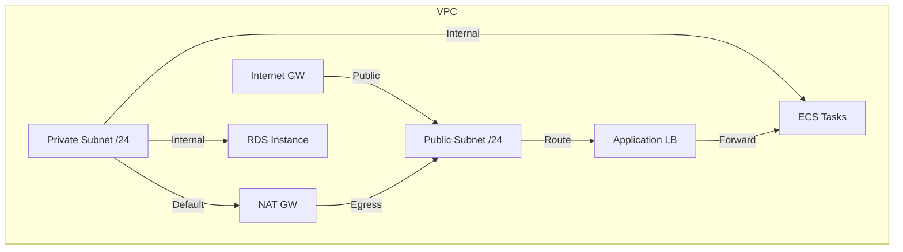
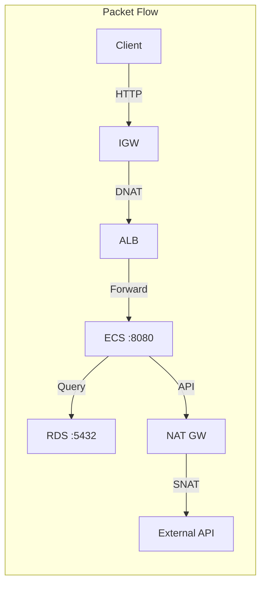
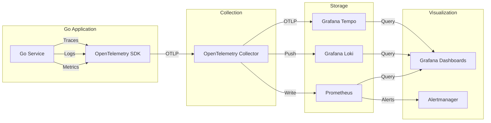
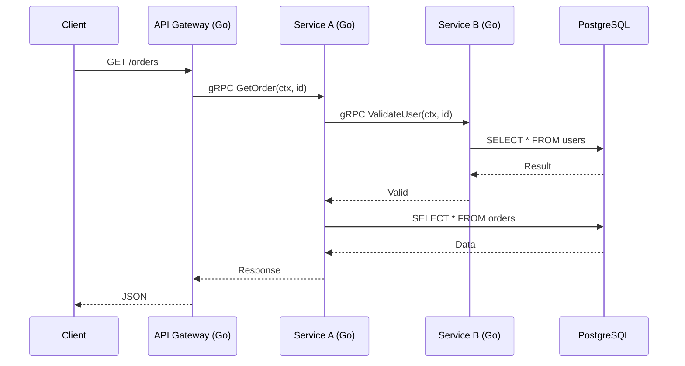

# 📡 Cloud Networking and Observability

## 🎯 Learning Objectives

- Understand cloud networking: VPCs, subnets, security groups, and NAT gateways.
- Master the three pillars of observability: metrics, logs, and traces.
- Instrument Go applications with OpenTelemetry and export to collectors.
- Build Grafana dashboards correlating metrics, logs, and traces for ML systems.

## Introduction

Cloud networking defines how services communicate within and across boundaries. VPCs, subnets, security groups, and NAT gateways create isolated, secure environments. As systems scale, observability, the ability to infer internal states from external outputs, becomes critical. It addresses this through metrics, logs, and traces. For Go developers, robust observability is essential for production reliability.

For ML/AI systems, networking and observability are mission-critical. Distributed training exchanges gigabytes of gradients per second; a misconfigured security group can stall a run costing thousands per hour. Model serving needs request-level observability to detect latency regressions from batch size changes or GPU pressure. Without tracing, debugging a failed inference across embedding, ranking, and generation services is impossible.

This module covers networking fundamentals and observability practices. You will instrument Go with OpenTelemetry, export telemetry, and build health dashboards. Connections to [[04 - Service Discovery and Load Balancing|⚖️ 04 - Service Discovery]] and [[05 - Infrastructure as Code with Pulumi|🏗️ 05 - IaC with Pulumi]] are essential for provisioning the networks and infrastructure we observe.

## Module 1: Cloud Networking

### 1.1 Theoretical Foundation 🧠

Cloud networking applies classical theory to virtualized environments. Foundations trace to the OSI model (1977) and TCP/IP (DARPA, 1970s). Physical switches become SDN controllers; firewalls become security groups. A **VPC** derives from VLANs and MPLS VPNs, using **network virtualization** (Anderson et al., Xen, 2002): the hypervisor interposes on traffic to enforce isolation. **CIDR** (1993) replaced classful networking; a /16 VPC provides 65,536 IPs, divided into /24 subnets. **Security Groups** implement **stateful packet filtering**, tracking connection state to allow return traffic automatically, unlike stateless ACLs.

### 1.2 Mental Model 📐

VPC with public and private subnets:

```
┌─────────────────────────────────────────────────────────┐
│                      AWS Cloud                          │
│  ┌─────────────────────────────────────────────────┐   │
│  │              VPC: 10.0.0.0/16                   │   │
│  │  ┌─────────────┐      ┌─────────────────────┐  │   │
│  │  │ Public      │      │ Private             │  │   │
│  │  │ Subnet      │      │ Subnet              │  │   │
│  │  │ 10.0.1.0/24 │      │ 10.0.2.0/24         │  │   │
│  │  │ ┌─────────┐ │      │ ┌─────────────────┐ │  │   │
│  │  │ │  ALB    │ │      │ │  ECS / EKS      │ │  │   │
│  │  │ └────┬────┘ │      │ └─────────────────┘ │  │   │
│  │  │ ┌────┴────┐ │      │    ┌──────────┐      │  │   │
│  │  │ │  IGW    │◄┘      │    │  NAT GW  │      │  │   │
│  │  │ │(internet│◄───────┘    └────┬─────┘      │  │   │
│  │  └─────────────┘                  │           │  │   │
│  │                                    ▼           │  │   │
│  │                              ┌──────────┐      │  │   │
│  │                              │ Internet │      │  │   │
│  │                              │ (egress) │      │  │   │
│  │                              └──────────┘      │  │   │
│  └─────────────────────────────────────────────────┘   │
└─────────────────────────────────────────────────────────┘
```

Security group stateful filtering:

```
┌─────────────────────────────────────────┐
│         Security Group (Stateful)       │
│  Inbound Rules:                         │
│  ┌─────────────────────────────────┐   │
│  │ Protocol │ Port │ Source        │   │
│  │ TCP      │ 8080 │ 10.0.0.0/16  │   │
│  │ TCP      │ 22   │ 10.0.1.0/24  │   │
│  └─────────────────────────────────┘   │
│  Connection Table (auto-managed):       │
│  ┌─────────────────────────────────┐   │
│  │ Src:10.0.1.5:45000              │   │
│  │ Dst:10.0.2.10:8080  ESTABLISHED│   │
│  │  --> ALLOW return traffic       │   │
│  └─────────────────────────────────┘   │
└─────────────────────────────────────────┘
```

NAT gateway translation:

```
┌─────────────────────────────────────────┐
│         NAT Gateway Translation         │
│  Private Instance         NAT Gateway   │
│  10.0.2.10:45678  ────>   203.0.113.5  │
│       │                        │        │
│       │   Source NAT (SNAT)    │        │
│       │   10.0.2.10 -> 203.0.113.5     │
│       │<──── 203.0.113.5 -> 10.0.2.10  │
│  Internal IP              Elastic IP    │
│  (not routable)           (routable)    │
└─────────────────────────────────────────┘
```

### 1.3 Syntax and Semantics 📝

Go program validating CIDRs and security group rules.

```go
package main

import (
	"fmt"
	"net"
	"os"
)

// WHY: Misconfigured CIDRs cause IP exhaustion or routing loops.
func ParseCIDR(cidr string) (*net.IPNet, error) {
	_, ipnet, err := net.ParseCIDR(cidr)
	if err != nil {
		return nil, fmt.Errorf("invalid CIDR %s: %w", cidr, err)
	}
	return ipnet, nil
}

type Rule struct {
	Protocol string
	FromPort int
	ToPort   int
	Cidr     string
}

// WHY: 0.0.0.0/0 on SSH/RDP is a top-10 cloud security risk.
func ValidateSG(rules []Rule) []string {
	var w []string
	for _, r := range rules {
		if r.Cidr == "0.0.0.0/0" && r.Protocol == "tcp" && (r.FromPort == 22 || r.FromPort == 3389) {
			w = append(w, fmt.Sprintf("CRITICAL: port %d open to world", r.FromPort))
		}
	}
	return w
}

// WHY: Uniform sizing simplifies route table management.
func SplitCIDR(vpc string, n int) ([]string, error) {
	_, ipnet, err := net.ParseCIDR(vpc)
	if err != nil {
		return nil, err
	}
	m, b := ipnet.Mask.Size()
	if m+n > b {
		return nil, fmt.Errorf("cannot split %s into %d subnets", vpc, n)
	}
	var out []string
	inc := 1 << (b - (m + n))
	ip := ipnet.IP.Mask(ipnet.Mask)
	for i := 0; i < (1 << n); i++ {
		_, sn, _ := net.ParseCIDR(fmt.Sprintf("%s/%d", ip.String(), m+n))
		out = append(out, sn.String())
		for j := len(ip) - 1; j >= 0; j-- {
			ip[j] += byte(inc >> (8 * (len(ip) - 1 - j)))
		}
	}
	return out, nil
}

func main() {
	vpc, _ := ParseCIDR("10.0.0.0/16")
	fmt.Println("VPC:", vpc)
	for _, w := range ValidateSG([]Rule{{Protocol: "tcp", FromPort: 22, Cidr: "0.0.0.0/0"}}) {
		fmt.Println("SG Warning:", w)
	}
	fmt.Println("Subnets:", SplitCIDR("10.0.0.0/16", 2))
	os.Exit(0)
}
```

### 1.4 Visual Representation 🖼️





**Wikimedia Commons Reference:**


### 1.5 Application in ML/AI Systems 🤖

| Case Study | Network Pattern | Why Chosen | Impact |
|---|---|---|---|
| **OpenAI GPT-4 Training** | VPC peering across regions | Multi-region data parallelism | 400 Gbps bandwidth; zero public exposure |
| **Google TPU Pods** | Custom VPC with IP aliasing | TPU needs thousands of IPs | /14 VPCs; 99.99% intra-pod connectivity |
| **AWS SageMaker** | Private subnets + VPC endpoints | Keep data in AWS backbone | HIPAA compliance; data never leaves VPC |
| **Azure OpenAI** | NSG + Service Endpoints | Lock down cognitive services | Zero public access to endpoints |

### 1.6 Common Pitfalls ⚠️

> ⚠️ **Warning — Misconfigured Security Groups:** Allowing 0.0.0.0/0 on port 22 exposes infrastructure to brute force. In ML, a compromised training node exfiltrates proprietary datasets. Always use least privilege and bastion hosts with MFA.

> ⚠️ **Warning — NAT Gateway Bottlenecks:** All private outbound traffic traverses NAT. Distributed training downloading checkpoints can saturate it, causing stalls. Use VPC endpoints for S3 and ECR.

> 💡 **Tip:** Cache EC2 metadata at startup; querying it per-request introduces latency and rate limits.

### 1.7 Knowledge Check ❓

1. **Why do security groups allow return traffic automatically while ACLs do not?** Explain using TCP handshake.
2. **What happens if `numSubnets` is 8 for a /16 VPC?** What is the resulting mask and usable IPs per subnet?
3. **Design a network for a multi-tenant ML platform where tenants are isolated.** Show VPC, subnets, and security groups.

## Module 2: Observability and OpenTelemetry

### 2.1 Theoretical Foundation 🧠

Observability originates from **control theory** (Kalman, 1960): a system is observable if its internal state can be determined from outputs. The **three pillars** (Sridharan, 2017) are: **Metrics** (time-series measurements, cheap to store, good for alerting); **Logs** (discrete event records, granular debugging); **Traces** (end-to-end request DAGs, from Google Dapper, 2010). Effectiveness is measured by **MTTR = Detection + Diagnosis + Resolution Time**. Reducing detection requires high-resolution metrics; reducing diagnosis requires structured logs with correlation IDs; reducing resolution requires automated remediation.

OpenTelemetry (CNCF, 2019) merged OpenTracing and OpenCensus. Its foundation is **distributed context propagation**, extending thread-local storage to distributed systems. The **W3C Trace Context** defines `traceparent` and `tracestate` headers. This applies **vector clocks**: each span carries a logical timestamp reconstructing happens-before relationships. In Go, `context.Context` (Go 1.7) propagates trace context via an immutable linked list. **OTLP** uses gRPC and Protobuf with a **batch-oriented, asynchronous export model** to minimize collection overhead.

### 2.2 Mental Model 📐

Three pillars and correlation:

```
┌─────────────────────────────────────────┐
│         Three Pillars                   │
│  ┌─────────┐ ┌─────────┐ ┌────────┐  │
│  │ Metrics │ │  Logs   │ │ Traces │  │
│  │ - CPU   │ │ - Error │ │ - Span │  │
│  │ - QPS   │ │ - Event │ │ - DAG  │  │
│  └────┬────┘ └────┬────┘ └───┬────┘  │
│       └────────────┼──────────┘       │
│                    │                  │
│                    ▼                  │
│           ┌─────────────────┐         │
│           │  Correlation ID │         │
│           │  (trace_id)     │         │
│           └─────────────────┘         │
└─────────────────────────────────────────┘
```

Telemetry pipeline:

```
┌─────────────────────────────────────────┐
│         Telemetry Pipeline              │
│  ┌─────────┐   ┌─────────────┐         │
│  │ Go App  │──>│ OpenTelemetry│        │
│  │ Metrics │   │ SDK          │        │
│  │ Logs    │   │ - Batching   │        │
│  │ Traces  │   │ - Sampling   │        │
│  └─────────┘   │ - Export     │        │
│                └──────┬──────┘        │
│                       │ OTLP           │
│                       ▼                │
│                ┌─────────────┐         │
│                │ Collector   │         │
│                └──────┬──────┘         │
│         ┌─────────────┼─────────────┐  │
│         ▼             ▼             ▼  │
│   ┌─────────┐  ┌──────────┐  ┌────────┐│
│   │Prometheus│  │ Loki    │  │ Tempo  ││
│   │(metrics) │  │ (logs)  │  │(traces)││
│   └────┬────┘  └────┬─────┘  └───┬────┘│
│        └────────────┴────────────┘     │
│                     │                  │
│                     ▼                  │
│               ┌───────────┐            │
│               │  Grafana  │            │
│               │ Dashboard │            │
│               └───────────┘            │
└─────────────────────────────────────────┘
```

### 2.3 Syntax and Semantics 📝

Go program with structured logging, trace correlation, and OpenTelemetry instrumentation.

```go
package main

import (
	"context"
	"fmt"
	"log/slog"
	"net/http"
	"os"
	"time"

	"go.opentelemetry.io/contrib/instrumentation/net/http/otelhttp"
	"go.opentelemetry.io/otel"
	"go.opentelemetry.io/otel/attribute"
	"go.opentelemetry.io/otel/exporters/otlp/otlptrace/otlptracegrpc"
	"go.opentelemetry.io/otel/propagation"
	"go.opentelemetry.io/otel/sdk/resource"
	sdktrace "go.opentelemetry.io/otel/sdk/trace"
	semconv "go.opentelemetry.io/otel/semconv/v1.21.0"
	"go.opentelemetry.io/otel/trace"
	"google.golang.org/grpc"
	"google.golang.org/grpc/credentials/insecure"
)

var tracer trace.Tracer

func initTracer() func() {
	ctx := context.Background()
	// WHY: insecure for local dev; use TLS in production.
	conn, err := grpc.DialContext(ctx, "otel-collector:4317",
		grpc.WithTransportCredentials(insecure.NewCredentials()),
		grpc.WithBlock(),
	)
	if err != nil {
		panic(err)
	}
	exporter, err := otlptracegrpc.New(ctx, otlptracegrpc.WithGRPCConn(conn))
	if err != nil {
		panic(err)
	}
	res, err := resource.New(ctx,
		resource.WithAttributes(
			semconv.ServiceName("cloudgo-api"),
			semconv.ServiceVersion("1.0.0"),
			attribute.String("environment", "production"),
		),
	)
	if err != nil {
		panic(err)
	}
	// WHY: BatchSpanProcessor amortizes export cost.
	tp := sdktrace.NewTracerProvider(
		sdktrace.WithBatcher(exporter),
		sdktrace.WithResource(res),
	)
	otel.SetTracerProvider(tp)
	otel.SetTextMapPropagator(propagation.TraceContext{})
	tracer = tp.Tracer("cloudgo-api")
	return func() {
		ctx, cancel := context.WithTimeout(ctx, 5*time.Second)
		defer cancel()
		_ = tp.Shutdown(ctx)
	}
}

// WHY: Correlating logs with traces enables drill-down debugging.
func LoggerWithTrace(ctx context.Context) *slog.Logger {
	logger := slog.New(slog.NewJSONHandler(os.Stdout, nil))
	span := trace.SpanFromContext(ctx)
	if span.SpanContext().IsValid() {
		logger = logger.With("trace_id", span.SpanContext().TraceID().String())
	}
	return logger
}

func handler(w http.ResponseWriter, r *http.Request) {
	ctx, span := tracer.Start(r.Context(), "http-request")
	defer span.End()

	logger := LoggerWithTrace(ctx)
	logger.Info("request", "path", r.URL.Path, "method", r.Method)
	span.SetAttributes(
		attribute.String("http.method", r.Method),
		attribute.String("http.path", r.URL.Path),
	)

	workSpan(ctx)
	logger.Info("completed", "status", 200)
	w.WriteHeader(http.StatusOK)
	fmt.Fprintln(w, "ok")
}

func workSpan(ctx context.Context) {
	_, span := tracer.Start(ctx, "work-unit")
	defer span.End()
	span.SetAttributes(attribute.Int("work.items", 42))
}

func main() {
	cleanup := initTracer()
	defer cleanup()
	http.Handle("/", otelhttp.NewHandler(http.HandlerFunc(handler), "http-server"))
	slog.Info("server", "port", 8080)
	http.ListenAndServe(":8080", nil)
}
```

### 2.4 Visual Representation 🖼️





**Wikimedia Commons Reference:**


### 2.5 Application in ML/AI Systems 🤖

| Case Study | Stack | Pillar Focus | Impact |
|---|---|---|---|
| **GitHub Copilot** | OTel + Prometheus + Tempo | Traces per LLM call | MTTD: 15 min to <2 min |
| **OpenAI API** | Custom metrics | Token rates, latency | Real-time quota enforcement |
| **DeepMind AlphaTensor** | Logs + BigQuery | Experiment configs | Full reproducibility; 1s config diff |
| **Uber Michelangelo** | OTel + Jaeger | Model serving traces | 99.9% trace coverage |

### 2.6 Common Pitfalls ⚠️

> ⚠️ **Warning — High-Cardinality Metrics:** Using `user_id` or `request_id` as Prometheus labels causes memory exhaustion. In ML serving, per-request metrics crash the stack. Use logs/traces for high-cardinality data.

> ⚠️ **Warning — Missing Context Propagation:** If span context is not propagated across goroutines or gRPC, traces fragment. Always pass `context.Context` and use `otelgrpc` interceptors.

> 💡 **Tip:** Export circuit breaker state as a Prometheus gauge. Alerting on open circuits triggers automatic canary rollback.

### 2.7 Knowledge Check ❓

1. **Why are metrics better than logs for alerting on high-frequency events?** Compare storage and query complexity.
2. **Why is `trace.SpanFromContext(ctx)` used instead of creating a new span per log line?**
3. **Design observability for a distributed training job with 1000 workers.** What to sample vs fully collect?

## 📦 Compression Code

Go script compressing OpenTelemetry span batches before export:

```go
package main

import (
	"bytes"
	"compress/gzip"
	"encoding/json"
	"fmt"
	"os"
	"time"
)

type Span struct {
	TraceID    string            `json:"trace_id"`
	SpanID     string            `json:"span_id"`
	ParentID   string            `json:"parent_id,omitempty"`
	Name       string            `json:"name"`
	StartTime  time.Time         `json:"start_time"`
	EndTime    time.Time         `json:"end_time"`
	Attributes map[string]string `json:"attributes,omitempty"`
}

type Batch struct {
	Resource string `json:"resource"`
	Spans    []Span `json:"spans"`
}

// WHY: Gzip reduces OTLP payload by 70-90%.
func main() {
	batch := Batch{
		Resource: "cloudgo-api-v1.0.0",
		Spans: []Span{
			{TraceID: "abc123", SpanID: "span001", Name: "handle-request",
				StartTime: time.Now().Add(-100 * time.Millisecond), EndTime: time.Now(),
				Attributes: map[string]string{"http.method": "GET", "http.path": "/api/orders"}},
			{TraceID: "abc123", SpanID: "span002", ParentID: "span001", Name: "database-query",
				StartTime: time.Now().Add(-50 * time.Millisecond), EndTime: time.Now().Add(-30 * time.Millisecond),
				Attributes: map[string]string{"db.system": "postgresql"}},
		},
	}
	data, _ := json.Marshal(batch)
	var buf bytes.Buffer
	gw := gzip.NewWriter(&buf)
	gw.Write(data)
	gw.Close()
	compressed := buf.Bytes()
	fmt.Printf("Original: %d bytes\n", len(data))
	fmt.Printf("Gzipped: %d bytes (%.1f%%)\n", len(compressed), float64(len(compressed))/float64(len(data))*100)
	os.WriteFile("spans.json.gz", compressed, 0644)
}
```

## 🎯 Documented Project

### Description

Develop **ObserveGo**, a Go microservice instrumented with OpenTelemetry, exposing Prometheus metrics and OTLP traces. It runs in Kubernetes with Prometheus, Loki, Tempo, and Grafana. Telemetry is correlated using shared trace IDs. The service performs mock ML inference and database queries.

### Functional Requirements

1. Instrument a Go HTTP API with OpenTelemetry tracing for all requests.
2. Emit custom Prometheus metrics (`request_duration_seconds`, `request_count_total`).
3. Structured JSON logging with `trace_id` from OpenTelemetry context.
4. Export traces via OTLP to an OpenTelemetry Collector.
5. Grafana dashboard overlaying request rate (Prometheus), error logs (Loki), and latency (Tempo) by `trace_id`.

### Main Components

- `cmd/api/main.go` — Instrumented HTTP server
- `internal/telemetry/` — OTel init and middleware
- `internal/metrics/` — Prometheus registry
- `internal/logger/` — Structured logging with trace correlation
- `manifests/` — K8s deployments for API, Collector, Prometheus, Loki, Tempo, Grafana

### Success Metrics

- 100% of HTTP requests generate a trace with >=2 spans.
- Prometheus metrics at `/metrics` with <10 ms response time.
- Logs contain valid `trace_id` matching active trace.
- Grafana dashboard displays correlated data within 5 seconds.
- P99 latency visible in Tempo and Prometheus with <5% discrepancy.

### References

- [OpenTelemetry Go](https://opentelemetry.io/docs/instrumentation/go/)
- [Prometheus Best Practices](https://prometheus.io/docs/practices/)
- [Grafana LGTM Stack](https://grafana.com/go/observabilitycon/2023/lgtm/)
- [[04 - Service Discovery and Load Balancing|⚖️ 04 - Service Discovery]]
- [[05 - Infrastructure as Code with Pulumi|🏗️ 05 - IaC with Pulumi]]
