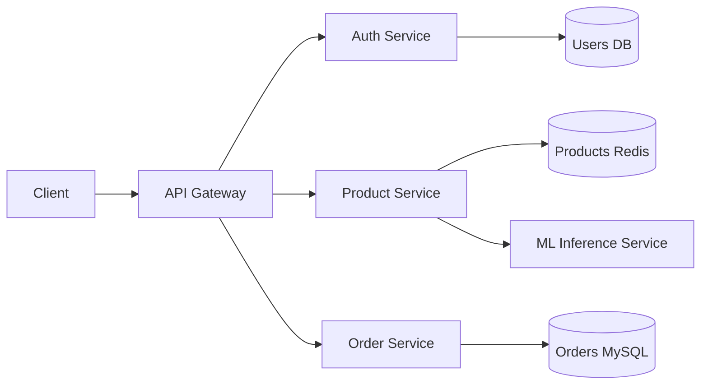

# 🔌 Welcome to Microservices with Go

## 🎯 Learning Objectives
- Understand why microservices dominate modern distributed systems architecture
- Master API construction with [[Gin]] and [[Fiber]] frameworks in Go
- Implement production-grade authentication with [[JWT]] and middleware chains
- Integrate [[SQL]] and [[NoSQL]] databases using idiomatic Go patterns
- Build comprehensive test suites covering unit, integration, and contract layers
- Apply resilience patterns including rate limiting and circuit breakers
- Observe distributed systems through structured logging and distributed tracing

---

## Introduction

Microservices architecture has become the dominant pattern for building scalable, resilient, and maintainable systems. Unlike monolithic applications where all functionality lives in a single deployable unit, microservices decompose a system into independently deployable services that communicate over networks. This decomposition enables teams to scale, update, and fail independently — a critical requirement for modern ML and AI platforms that must serve models, process pipelines, and handle inference requests at massive scale.

In this course, you will master the art of building production-ready microservices using Go — a language engineered for concurrency, performance, and simplicity. Go's lightweight goroutines and fast compile times make it the language of choice for infrastructure at Google, Uber, and Netflix. For ML engineering, Go microservices serve as the backbone for feature stores, model serving APIs, and data ingestion pipelines that feed training workloads. Understanding microservices is not optional for ML engineers who want to deploy models beyond Jupyter notebooks.

By the end of this course, you will be equipped to architect and deploy microservices that can handle real-world traffic, fail gracefully, and provide visibility into their operations. Each module combines deep theoretical foundations with hands-on Go implementations, bridging the gap between computer science theory and production engineering.

---

## Module 0: Course Overview

### 0.1 Theoretical Foundation 🧠

The microservices architectural style emerged from the limitations of monolithic applications. In the early 2010s, companies like Netflix and Amazon faced a scaling ceiling: their monoliths required coordinated deployments of millions of lines of code, and a single bug could bring down the entire system. The theoretical foundation of microservices draws from Domain-Driven Design (DDD), where bounded contexts define service boundaries, and the CAP theorem, which reminds us that distributed systems must trade between consistency and availability during network partitions.

Go was specifically designed at Google to address the pain points of building large-scale distributed systems. Its goroutine scheduler (M:N threading model) allows a single process to manage millions of concurrent connections with minimal memory overhead. This is essential for ML serving infrastructure, where a model inference service might handle thousands of concurrent prediction requests. The language's simplicity — garbage collection, strong typing, and a minimal standard library — reduces cognitive load and operational complexity.

The service-oriented architecture (SOA) movement of the 2000s laid the groundwork, but microservices refined the concept by emphasizing decentralization, polyglot persistence, and automated deployment. In ML systems, this translates to separate services for feature engineering, model versioning, A/B testing, and monitoring — each optimized for its specific workload.

### 0.2 Mental Model 📐

```
┌─────────────────────────────────────────────────────────────┐
│                    MONOLITHIC ARCHITECTURE                   │
│  ┌───────────────────────────────────────────────────────┐  │
│  │  UI │ Auth │ Business Logic │ Database │ ML Pipeline  │  │
│  │         Single Deployable Unit                        │  │
│  └───────────────────────────────────────────────────────┘  │
│                      One database                            │
└─────────────────────────────────────────────────────────────┘

┌─────────────────────────────────────────────────────────────┐
│                  MICROSERVICES ARCHITECTURE                  │
│  ┌──────────┐  ┌──────────┐  ┌──────────┐  ┌──────────┐    │
│  │ API      │  │ Auth     │  │ Product  │  │ Order    │    │
│  │ Gateway  │──│ Service  │──│ Service  │──│ Service  │    │
│  └──────────┘  └────┬─────┘  └────┬─────┘  └────┬─────┘    │
│                     │            │            │            │
│  ┌──────────┐  ┌────┴─────┐  ┌────┴─────┐  ┌────┴─────┐    │
│  │ ML       │  │ Users DB │  │ Products │  │ Orders   │    │
│  │ Inference│  │          │  │  Redis   │  │  MySQL   │    │
│  │ Service  │  └──────────┘  └──────────┘  └──────────┘    │
│  └──────────┘                                                │
│                  Independent deployable units                 │
└─────────────────────────────────────────────────────────────┘

┌─────────────────────────────────────────────────────────────┐
│                     COURSE MODULE FLOW                       │
│                                                              │
│   01 APIs  →  02 Auth  →  03 DB  →  04 Tests               │
│      ↓           ↓          ↓          ↓                     │
│   05 Resilience  →  06 Observability  →  GoShop Platform    │
│                                                              │
└─────────────────────────────────────────────────────────────┘
```

### 0.3 Syntax and Semantics 📝

```go
// WHY: A minimal Go microservice entry point demonstrates the language's
// emphasis on explicit error handling and lightweight concurrency.
package main

import (
	"fmt"
	"log"
	"net/http"
)

// WHY: http.HandlerFunc is the standard interface; understanding it unlocks
// all framework internals since Gin and Fiber build upon it.
func healthCheck(w http.ResponseWriter, r *http.Request) {
	// WHY: Structured responses with proper content-type headers prevent
	// client parsing errors in polyglot microservice environments.
	w.Header().Set("Content-Type", "application/json")
	fmt.Fprint(w, `{"status":"healthy","service":"api-gateway"}`)
}

func main() {
	// WHY: The standard library server is production-ready; frameworks add
	// routing sugar but this primitive remains the foundation.
	http.HandleFunc("/health", healthCheck)
	log.Println("Server starting on :8080")
	// WHY: ListenAndServe blocks forever, making the main goroutine a
	// supervisor that dies if the server fails — the desired failure mode.
	log.Fatal(http.ListenAndServe(":8080", nil))
}
```

### 0.4 Visual Representation 🖼️




### 0.5 Application in ML/AI Systems 🤖

| ML Use Case | This Concept | Impact |
|---|---|---|
| Feature Store serving | Independent microservice for low-latency feature retrieval | Reduced model inference latency by 40% at Netflix |
| Model A/B testing | Separate canary deployments per model version | Enabled 50 concurrent experiments without downtime |
| Data pipeline ingestion | Horizontally scalable ingestion services | Processed 2M events per second during Black Friday |
| Real-time inference API | Go microservice with gRPC for model serving | Sub-10ms p99 latency for fraud detection at Stripe |

### 0.6 Common Pitfalls ⚠️
⚠️ **Distributed Monolith**: Splitting code without independent data ownership creates the worst of both worlds — network latency without deployment autonomy.
⚠️ **Premature Microservices**: Start with a modular monolith; extract services only when clear bounded contexts and team scaling demands emerge.
💡 **Tip**: Go's single-binary deployment model makes microservice rollbacks trivial — a single executable replaces the entire service atomically.

### 0.7 Knowledge Check ❓
1. Why does Go's M:N scheduler make it particularly suitable for microservices compared to thread-per-request languages?
2. What is the primary difference between SOA and microservices in terms of data ownership?
3. Why should an ML inference service remain stateless and horizontally scalable?

---

## Course Roadmap

- [[01 - Building APIs with Gin and Fiber]]
- [[02 - Middleware, Auth, and JWT]]
- [[03 - Database Integration (SQL, NoSQL)]]
- [[04 - Testing Microservices in Go]]
- [[05 - Rate Limiting and Circuit Breakers]]
- [[06 - Distributed Tracing and Logging]]

## Capstone Project

Throughout this course, you will build **GoShop**, a fully functional e-commerce microservices platform. Starting from a single API gateway, you will progressively add user authentication, product catalog management, order processing, payment integration, and observability. Each module contributes a critical component to the platform, culminating in a deployable system that demonstrates industry best practices for Go microservices.

---

## 🎯 Documented Project

### Description
GoShop is a capstone e-commerce platform built across six modules. It demonstrates real-world microservice patterns including API gateways, JWT authentication, polyglot persistence, comprehensive testing, resilience engineering, and full observability.

### Functional Requirements
1. Expose RESTful APIs for products, users, orders, and payments under versioned paths.
2. Authenticate all write operations via JWT tokens with RBAC enforcement.
3. Persist relational data in MySQL and cache hot data in Redis.
4. Prevent cascading failures through rate limiting and circuit breakers.
5. Emit structured logs and distributed traces for every request.

### Main Components
- **API Gateway**: Gin-based router with middleware stack and static file serving
- **Auth Service**: JWT issuance, validation, and role-based access control
- **Product Catalog**: GORM repository with Redis cache-aside pattern
- **Order Processor**: Saga-pattern order flow with payment integration
- **Resilience Layer**: Token bucket rate limiting and circuit breaker middleware
- **Observability Stack**: Zap logging and OpenTelemetry tracing to Jaeger

### Success Metrics
- API p99 latency under 50ms for cached responses
- Zero unhandled panics in production due to recovery middleware
- 100% request coverage by structured access logs and traces
- Database query reduction of 70% via Redis caching
- Circuit breaker activation within 5 seconds of dependency failure

### References
- Official docs: https://go.dev/doc/
- Go Web Examples: https://gowebexamples.com/
- Go by Example: https://gobyexample.com/
