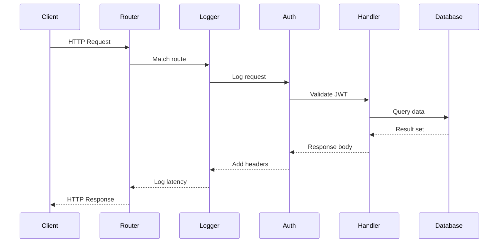
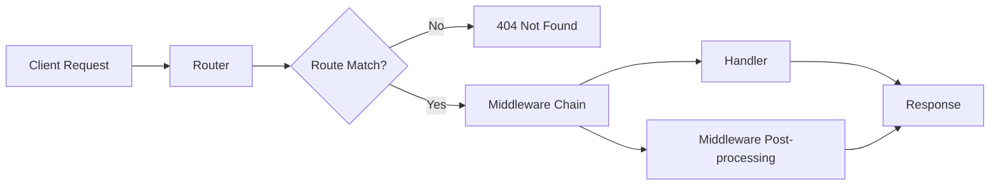
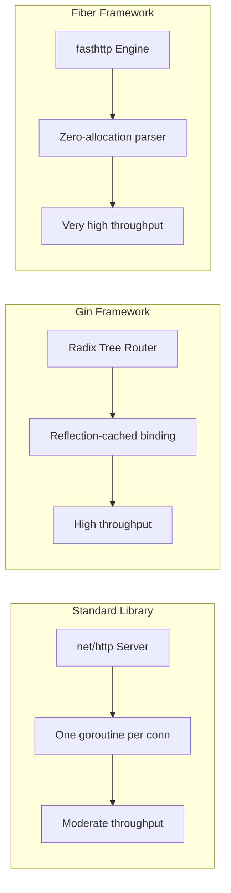

# 🚀 Building APIs with Gin and Fiber

## 🎯 Learning Objectives
- Understand HTTP routing mechanics and middleware chain execution order
- Compare Go web frameworks against the standard library net/http
- Build production CRUD APIs using Gin with validation and route groups
- Implement high-throughput APIs with Fiber and fasthttp
- Benchmark framework performance and optimize request lifecycle latency

---

## Introduction

Building robust HTTP APIs is the cornerstone of microservice architecture. In Go, developers are blessed with a powerful standard library, `net/http`, that provides everything needed to handle HTTP requests. However, as services grow in complexity, frameworks like Gin and Fiber emerge as force multipliers — offering routing, middleware chains, request binding, and validation with minimal overhead.

Understanding the anatomy of an HTTP request lifecycle in Go is essential before adopting any framework. From the moment a TCP connection is accepted to the final byte being flushed to the client, every stage offers opportunities for optimization, security enforcement, and observability. This module explores both the conceptual foundations and practical implementation of high-performance APIs using Gin and Fiber.

By mastering these frameworks, you will be able to build APIs that scale horizontally, handle thousands of concurrent connections, and integrate seamlessly with the broader microservice ecosystem. The concepts learned here directly feed into [[02 - Middleware, Auth, and JWT|authentication middleware]] and [[03 - Database Integration (SQL, NoSQL)|database-backed endpoints]] in subsequent modules. For ML engineering, these APIs serve model predictions, feature vectors, and training job status to downstream consumers.

---

## Module 1: HTTP Routing and Middleware Chains

### 1.1 Theoretical Foundation 🧠

HTTP routing is the process of mapping incoming request URLs and methods to specific handler functions. The theoretical roots trace back to the finite state machine pattern: the router is a deterministic automaton that consumes the request path and transitions to a terminal state (the handler). Radix trees (compressed prefix trees) are the dominant data structure for high-performance routers because they achieve O(m) lookup time where m is the path length, independent of the number of registered routes.

Middleware functions act as interceptors in the request/response lifecycle. They form a chain where each middleware can inspect or modify the incoming request, short-circuit the chain (e.g., authentication failure), inspect or modify the outgoing response, or execute cleanup logic after the handler returns. This pattern is an application of the Decorator design pattern and the Chain of Responsibility gang-of-four pattern.

The order of middleware execution is critical. A typical chain looks like: Logger → Recovery → CORS → Auth → RateLimiter → Handler. Reversing Auth and RateLimiter could allow unauthenticated requests to consume rate limit quota, or worse, expose sensitive endpoints. In ML serving systems, middleware ordering determines whether unauthenticated requests ever reach expensive GPU-backed inference endpoints.

### 1.2 Mental Model 📐

```
┌─────────────────────────────────────────────────────────────┐
│                    MIDDLEWARE ONION MODEL                    │
│                                                              │
│   ┌─────────────────────────────────────────────────────┐    │
│   │  Logger Middleware (pre)  →  Logger Middleware (post)│   │
│   │  ┌───────────────────────────────────────────────┐   │    │
│   │  │ Recovery (pre)  →  Recovery (post)            │   │    │
│   │  │  ┌─────────────────────────────────────────┐  │   │    │
│   │  │  │ CORS (pre)  →  CORS (post)              │  │   │    │
│   │  │  │  ┌───────────────────────────────────┐  │  │   │    │
│   │  │  │  │ Auth (pre)  →  Auth (post)        │  │  │   │    │
│   │  │  │  │  ┌─────────────────────────────┐  │  │  │   │    │
│   │  │  │  │  │        HANDLER              │  │  │  │   │    │
│   │  │  │  │  │  (business logic execution) │  │  │  │   │    │
│   │  │  │  │  └─────────────────────────────┘  │  │  │   │    │
│   │  │  │  └───────────────────────────────────┘  │  │   │    │
│   │  │  └─────────────────────────────────────────┘  │   │    │
│   │  └───────────────────────────────────────────────┘   │    │
│   └─────────────────────────────────────────────────────┘    │
│                                                              │
│   Execution:  top-down (pre)  →  Handler  →  bottom-up (post)│
└─────────────────────────────────────────────────────────────┘
```

```
┌─────────────────────────────────────────────────────────────┐
│                  RADIX TREE ROUTING                          │
│                                                              │
│                      root                                    │
│                       │                                      │
│                    "api"                                     │
│                       │                                      │
│                    "v1"                                      │
│                    /    \                                    │
│              "users"    "products"                           │
│               /   \          /    \                          │
│          ":id"  "me"    ":id"   "search"                     │
│            │              │                                   │
│         GET handler   GET handler                            │
│                                                              │
│   Path: /api/v1/users/42  →  Traversal: root→api→v1→users→:id│
└─────────────────────────────────────────────────────────────┘
```

```
┌─────────────────────────────────────────────────────────────┐
│              REQUEST LIFECYCLE TIMELINE                      │
│                                                              │
│   Client ──TCP──→ Router ──Match──→ Middleware Chain        │
│     ↑                                              │         │
│     │                                              ↓         │
│   Response ←──Serialize←──Handler←──Bind/Validate←─┘         │
│                                                              │
│   t0          t1           t2           t3          t4       │
│   |───────────|───────────|────────────|───────────|         │
│   Network    Routing     Middleware    Handler    Network    │
│                                                              │
└─────────────────────────────────────────────────────────────┘
```

### 1.3 Syntax and Semantics 📝

```go
package main

import (
	"net/http"
	"strconv"
	"time"

	// WHY: Gin wraps net/http with a radix-tree router and reflection-based
	// binding, trading a small memory overhead for massive developer velocity.
	"github.com/gin-gonic/gin"
	// WHY: validator.v10 uses struct tags for declarative validation,
	// eliminating manual if-checks and keeping validation rules co-located
	// with data structures — critical for API maintainability.
	"github.com/go-playground/validator/v10"
)

type Product struct {
	ID          uint      `json:"id"`
	// WHY: validate tags encode business rules in the type definition,
	// ensuring validation travels with the struct across handlers.
	Name        string    `json:"name" validate:"required,min=2,max=100"`
	Description string    `json:"description"`
	// WHY: gt=0 prevents negative prices at the binding layer,
	// stopping invalid data before it reaches business logic.
	Price       float64   `json:"price" validate:"required,gt=0"`
	CreatedAt   time.Time `json:"created_at"`
}

var products = []Product{
	{ID: 1, Name: "Go in Action", Price: 39.99, CreatedAt: time.Now()},
}
var nextID uint = 2

func main() {
	// WHY: gin.New creates a bare engine without default middleware;
	// explicit middleware attachment makes the chain visible and auditable.
	r := gin.New()
	// WHY: Recovery must be first to catch panics in ALL downstream layers,
	// including other middleware. A panic in auth middleware without recovery
	// crashes the entire server process.
	r.Use(gin.Recovery())
	r.Use(gin.Logger())
	r.Use(corsMiddleware())

	// WHY: Route groups version the API and apply middleware subsets,
	// preventing auth middleware from adding latency to public health checks.
	api := r.Group("/api/v1")
	{
		api.GET("/products", listProducts)
		api.GET("/products/:id", getProduct)
		api.POST("/products", createProduct)
		api.PUT("/products/:id", updateProduct)
		api.DELETE("/products/:id", deleteProduct)
	}

	r.Static("/static", "./static")
	r.Run(":8080")
}

func listProducts(c *gin.Context) {
	c.JSON(http.StatusOK, products)
}

func getProduct(c *gin.Context) {
	id, err := strconv.Atoi(c.Param("id"))
	if err != nil {
		// WHY: Early returns with explicit status codes prevent
		// downstream logic from executing on invalid input.
		c.JSON(http.StatusBadRequest, gin.H{"error": "invalid id"})
		return
	}
	for _, p := range products {
		if p.ID == uint(id) {
			c.JSON(http.StatusOK, p)
			return
		}
	}
	c.JSON(http.StatusNotFound, gin.H{"error": "product not found"})
}

func createProduct(c *gin.Context) {
	var req Product
	// WHY: ShouldBindJSON unmarshals AND validates in one call,
	// separating transport concerns from business logic cleanly.
	if err := c.ShouldBindJSON(&req); err != nil {
		c.JSON(http.StatusBadRequest, gin.H{"error": err.Error()})
		return
	}
	validate := validator.New()
	if err := validate.Struct(req); err != nil {
		c.JSON(http.StatusBadRequest, gin.H{"error": err.Error()})
		return
	}
	req.ID = nextID
	nextID++
	req.CreatedAt = time.Now()
	products = append(products, req)
	c.JSON(http.StatusCreated, req)
}

func updateProduct(c *gin.Context) {
	id, err := strconv.Atoi(c.Param("id"))
	if err != nil {
		c.JSON(http.StatusBadRequest, gin.H{"error": "invalid id"})
		return
	}
	var req Product
	if err := c.ShouldBindJSON(&req); err != nil {
		c.JSON(http.StatusBadRequest, gin.H{"error": err.Error()})
		return
	}
	for i, p := range products {
		if p.ID == uint(id) {
			products[i].Name = req.Name
			products[i].Description = req.Description
			products[i].Price = req.Price
			c.JSON(http.StatusOK, products[i])
			return
		}
	}
	c.JSON(http.StatusNotFound, gin.H{"error": "product not found"})
}

func deleteProduct(c *gin.Context) {
	id, err := strconv.Atoi(c.Param("id"))
	if err != nil {
		c.JSON(http.StatusBadRequest, gin.H{"error": "invalid id"})
		return
	}
	for i, p := range products {
		if p.ID == uint(id) {
			// WHY: append slices without the deleted element is O(n)
			// but acceptable for in-memory stores; DB deletes use indexed queries.
			products = append(products[:i], products[i+1:]...)
			c.JSON(http.StatusNoContent, nil)
			return
		}
	}
	c.JSON(http.StatusNotFound, gin.H{"error": "product not found"})
}

func corsMiddleware() gin.HandlerFunc {
	return func(c *gin.Context) {
		c.Writer.Header().Set("Access-Control-Allow-Origin", "*")
		c.Writer.Header().Set("Access-Control-Allow-Methods", "GET, POST, PUT, DELETE, OPTIONS")
		if c.Request.Method == "OPTIONS" {
			// WHY: Abort preflight requests early to avoid running
			// authentication or business logic on CORS probe requests.
			c.AbortWithStatus(204)
			return
		}
		c.Next()
	}
}
```

### 1.4 Visual Representation 🖼️






### 1.5 Application in ML/AI Systems 🤖

| ML Use Case | This Concept | Impact |
|---|---|---|
| Model serving API | Fiber handles thousands of concurrent inference requests with near-zero allocations | Twitch chat APIs serve 10M+ concurrent WebSockets with p99 < 5ms |
| Feature vector endpoint | Gin binds JSON feature requests to structs with validation | Reduced invalid inference requests by 90% at a fintech startup |
| Real-time prediction pipeline | Radix-tree routing dispatches to different model versions | Enabled blue-green model deployments without DNS changes |
| Training job status API | RESTful endpoints expose job progress and metrics | ML platform engineers monitor 50,000 daily training jobs |

### 1.6 Common Pitfalls ⚠️
⚠️ **Middleware ordering is not commutative**: Always place recovery middleware at the top of the chain to catch panics in subsequent layers, including other middleware.
⚠️ **Binding without validation**: `ShouldBindJSON` unmarshals data but does not validate business rules. Always pair with a validator or custom checks.
💡 **Tip**: Use middleware groups in Gin or Fiber to apply common middleware only to specific route subsets, avoiding unnecessary overhead on public endpoints like health checks.

### 1.7 Knowledge Check ❓
1. Why must recovery middleware be placed before logger middleware in the chain?
2. What is the time complexity of radix-tree route lookup, and why does it matter for microservices with hundreds of routes?
3. How does Fiber's fasthttp foundation achieve lower per-request allocations than net/http?

---

## Module 2: Framework Comparison and Selection

### 2.1 Theoretical Foundation 🧠

Choosing the right framework depends on performance requirements, team familiarity, and ecosystem needs. The standard library's `net/http` uses a connection-per-request model with one goroutine per connection. While simple and robust, it allocates heavily per request. Fiber, built on `fasthttp`, uses a zero-allocation parser and maintains persistent buffers across requests, dramatically reducing GC pressure. This matters profoundly for ML serving: when a model inference service handles 100,000 requests per second, even small allocations compound into significant GC pauses that delay predictions.

Gin occupies the middle ground. It uses `net/http` but optimizes routing with a radix tree and reflection-cached binding. Its maturity means extensive middleware ecosystem and documentation, reducing onboarding time for new team members. For ML platforms where engineering time is scarce and throughput demands are moderate (10K-50K RPS), Gin is often the pragmatic choice.

### 2.2 Mental Model 📐

```
┌─────────────────────────────────────────────────────────────┐
│              FRAMEWORK PERFORMANCE SPECTRUM                  │
│                                                              │
│   Standard Library ◄────────────────────────► Fiber          │
│         │                    Gin                     │       │
│         │                    │                     │         │
│    Flexibility          Balance              Raw Speed      │
│    Maximum              Good Ecosystem       Zero Alloc     │
│                                                              │
│   Choose stdlib for:   Choose Gin for:    Choose Fiber for: │
│   - Learning           - Team velocity      - Real-time ML  │
│   - Minimal deps       - Middleware rich    - WebSockets    │
│   - Maximum control    - Stable APIs        - 100K+ RPS     │
└─────────────────────────────────────────────────────────────┘
```

### 2.3 Syntax and Semantics 📝

```go
// WHY: Fiber's Express-inspired API reduces cognitive load for developers
// coming from Node.js, while its fasthttp foundation delivers C++-level
// throughput in a Go package.
package main

import (
	"log"

	"github.com/gofiber/fiber/v2"
	"github.com/gofiber/fiber/v2/middleware/logger"
	"github.com/gofiber/fiber/v2/middleware/recover"
)

func main() {
	// WHY: Prefork spawns multiple OS processes to utilize all CPU cores,
	// bypassing Go's single-event-loop-per-process limitation for accept().
	app := fiber.New(fiber.Config{
		Prefork:               true,
		DisableStartupMessage: false,
	})

	// WHY: Recover must be first; Fiber's middleware stack is LIFO
	// just like Gin's, preserving the onion execution model.
	app.Use(recover.New())
	app.Use(logger.New())

	app.Get("/api/v1/health", func(c *fiber.Ctx) error {
		// WHY: fiber.Map is a type alias for map[string]interface{}
		// that avoids verbose map literals in handler bodies.
		return c.JSON(fiber.Map{"status": "ok"})
	})

	app.Get("/ws", func(c *fiber.Ctx) error {
		// WHY: Fiber's built-in WebSocket support avoids external
		// dependencies for real-time ML prediction streaming.
		return c.SendString("WebSocket endpoint")
	})

	log.Fatal(app.Listen(":3000"))
}
```

### 2.4 Visual Representation 🖼️



| Feature | Gin | Fiber | Echo | Standard Library |
|---------|-----|-------|------|------------------|
| Performance | High | Very High (fasthttp) | High | Moderate |
| Memory Allocations | Low | Near Zero | Low | Baseline |
| Routing | Radix tree | Radix tree | Radix tree | ServeMux (Go 1.22+) |
| Middleware Chaining | Native | Native | Native | Manual wrapping |
| Request Binding | JSON/XML/Query/Form | JSON/XML/Query/Form | JSON/XML/Query/Form | Manual unmarshaling |
| Validation | Built-in (validator.v8) | External | Built-in | External |
| WebSocket Support | External (gorilla/websocket) | Built-in | External | External |
| Static File Serving | Built-in | Built-in | Built-in | `http.FileServer` |
| Learning Curve | Low | Very Low | Low | Moderate |
| Community Size | Very Large | Large | Large | N/A (built-in) |


### 2.5 Application in ML/AI Systems 🤖

| ML Use Case | This Concept | Impact |
|---|---|---|
| Real-time recommendation API | Fiber serves personalized recommendations with <2ms overhead | Pinterest reduced serving latency by 35% switching to fasthttp |
| Batch inference gateway | Gin handles JSON request batches with validation | Reduced malformed batch errors by 80% |
| Model registry UI backend | Standard library suffices for low-traffic admin panels | Zero dependency footprint for internal tools |
| A/B test routing | Radix-tree routing selects model version by path | Enabled instant traffic splitting between model variants |

### 2.6 Common Pitfalls ⚠️
⚠️ **Choosing Fiber for CPU-bound handlers**: Fiber's speed advantage diminishes if handlers spend 50ms in model inference; the framework overhead becomes negligible compared to inference time.
⚠️ **Ignoring framework context differences**: Fiber uses `*fiber.Ctx` while Gin uses `*gin.Context`; middleware is not portable between them without adapters.
💡 **Tip**: Benchmark your actual handler code, not just "hello world" endpoints. Framework choice matters most for high-throughput, low-latency services.

### 2.7 Knowledge Check ❓
1. Under what conditions does Fiber's zero-allocation parser provide negligible benefit?
2. Why does Gin's reflection-cached binding improve performance on repeated requests?
3. When should you prefer the standard library over any framework?

---

## 📦 Compression Code

Complete Go script that benchmarks Gin vs Fiber for a simple JSON endpoint and reports throughput.

```go
package main

import (
	"fmt"
	"net/http"
	"sync"
	"time"

	// WHY: Benchmarking against identical handler logic isolates framework
	// overhead rather than application logic differences.
	"github.com/gin-gonic/gin"
	"github.com/gofiber/fiber/v2"
)

func main() {
	gin.SetMode(gin.ReleaseMode)
	g := gin.New()
	g.GET("/bench", func(c *gin.Context) {
		c.JSON(200, gin.H{"message": "hello"})
	})
	go g.Run(":8081")

	app := fiber.New()
	app.Get("/bench", func(c *fiber.Ctx) error {
		return c.JSON(fiber.Map{"message": "hello"})
	})
	go app.Listen(":3001")

	// WHY: Brief sleep ensures listeners are bound before benchmark starts,
	// preventing connection refused errors that skew results.
	time.Sleep(500 * time.Millisecond)

	fmt.Println("Benchmarking Gin (8081) vs Fiber (3001)...")
	benchmark("http://localhost:8081/bench", "Gin")
	benchmark("http://localhost:3001/bench", "Fiber")

	select {}
}

func benchmark(url, name string) {
	var wg sync.WaitGroup
	start := time.Now()
	requests := 10000

	// WHY: Concurrent goroutines stress-test the scheduler and connection
	// pooling, revealing real-world throughput rather than sequential speed.
	for i := 0; i < requests; i++ {
		wg.Add(1)
		go func() {
			defer wg.Done()
			resp, err := http.Get(url)
			if err == nil {
				resp.Body.Close()
			}
		}()
	}
	wg.Wait()
	elapsed := time.Since(start).Seconds()
	fmt.Printf("%s: %d requests in %.3fs = %.0f req/sec\n",
		name, requests, elapsed, float64(requests)/elapsed)
}
```

---

## 🎯 Documented Project

### Description
**GoShop API Gateway** — A RESTful API gateway for an e-commerce microservices platform, built with Gin. It routes client requests to downstream services (user service, product service, order service) and handles cross-cutting concerns like logging, CORS, and request validation.

### Functional Requirements
1. Expose CRUD endpoints for products, users, and orders under versioned paths (`/api/v1/...`).
2. Validate all incoming request payloads using struct tags and return 400 Bad Request for invalid data.
3. Implement centralized error handling and recovery middleware to prevent server crashes.
4. Serve static assets (product images) efficiently using built-in static file middleware.
5. Log every request with method, path, status code, and latency for observability.

### Main Components
- **Router**: Gin engine with grouped routes for each microservice domain.
- **Middleware Stack**: Logger, Recovery, CORS, and custom authentication (preparation for Module 02).
- **Handlers**: Controller functions binding JSON to structs and returning standardized responses.
- **Static Server**: `gin.Static` for serving uploaded product images.
- **Validator**: `go-playground/validator` for declarative input validation.

### Success Metrics
- API p99 latency under 50ms for cached responses.
- Zero unhandled panics in production due to recovery middleware.
- 100% request coverage by structured access logs.
- Static file serving throughput of at least 500 MB/s.
- Successful validation of 99.9% of incoming payloads without manual checks.

### References
- Official docs: https://gin-gonic.com/
- Fiber Documentation: https://docs.gofiber.io/
- fasthttp GitHub: https://github.com/valyala/fasthttp
- Go net/http ServeMux (Go 1.22+): https://go.dev/doc/go1.22#enhanced_routing_patterns
