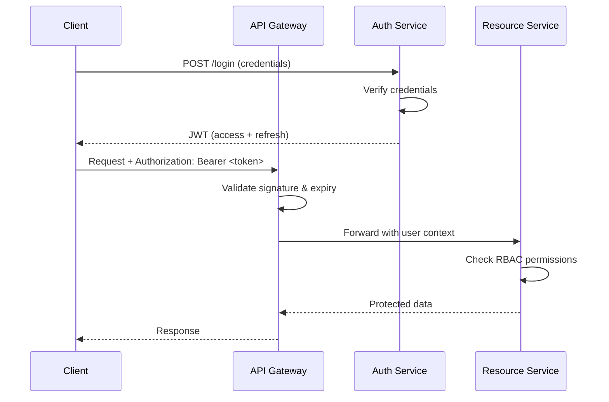
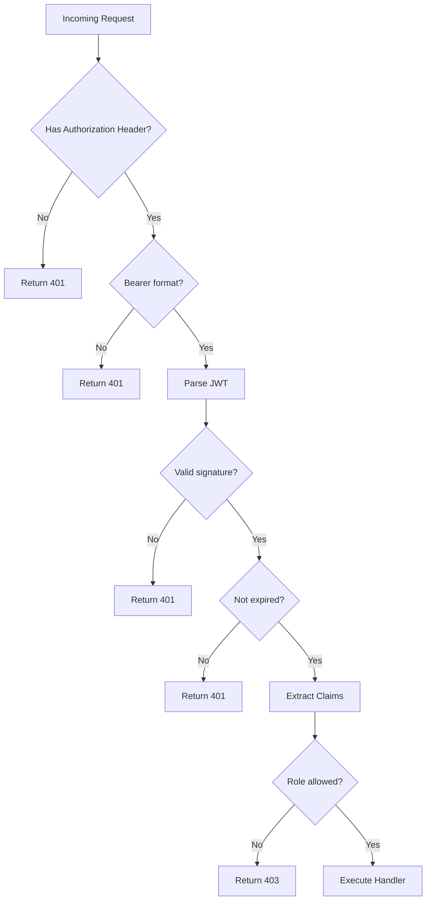
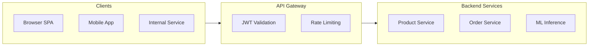

# 🔐 Middleware, Auth, and JWT

## 🎯 Learning Objectives
- Understand the middleware execution model and onion architecture in Go
- Compare authentication strategies for microservice environments
- Implement production-grade JWT generation and validation in Go
- Apply Role-Based Access Control (RBAC) through middleware chains
- Secure service-to-service communication with token-based auth

---

## Introduction

In distributed systems, security cannot be an afterthought. Every microservice boundary is a potential attack vector, and the communication between services must be authenticated, authorized, and audited. Middleware in Go provides the perfect abstraction for enforcing these cross-cutting security concerns without polluting business logic.

Authentication answers the question "Who are you?" while authorization determines "What are you allowed to do?". In microservices, the stateless nature of HTTP conflicts with traditional session-based authentication, leading to the widespread adoption of JSON Web Tokens (JWT). This module dissects the middleware pattern, explores authentication strategies, and implements production-grade JWT validation in Go.

The patterns established here integrate deeply with [[01 - Building APIs with Gin and Fiber|API routing frameworks]] and set the foundation for [[03 - Database Integration (SQL, NoSQL)|persisting user sessions]] in persistent storage. For ML systems, these patterns protect model serving endpoints from unauthorized access and ensure that only approved pipelines can trigger expensive training jobs.

---

## Module 1: Middleware Pattern and Execution Order

### 1.1 Theoretical Foundation 🧠

Middleware in Go is implemented as functions that wrap `http.Handler` (or framework-specific handlers). The wrapping creates an onion-like execution model where each layer can modify the request before it reaches the handler and the response after the handler returns. This is a direct application of the Decorator pattern from the Gang of Four, combined with the Chain of Responsibility pattern.

The execution order follows the chain construction. If middleware A wraps middleware B, which wraps handler H, the call order is: A (pre) → B (pre) → H → B (post) → A (post). This LIFO pattern is powerful for resource management — opening a database transaction in pre-handlers and committing or rolling back in post-handlers.

Historically, middleware evolved from servlet filters in Java and Rack middleware in Ruby. Go's first-class functions make middleware particularly elegant: a middleware is simply a function that takes a handler and returns a handler. This simplicity avoids the ceremony of interface implementations while retaining full type safety.

### 1.2 Mental Model 📐

```
┌─────────────────────────────────────────────────────────────┐
│                 MIDDLEWARE WRAPPING MODEL                    │
│                                                              │
│   func Middleware(next http.Handler) http.Handler {          │
│       return http.HandlerFunc(func(w, r) {                   │
│           // PRE-PROCESSING                                   │
│           next.ServeHTTP(w, r)                               │
│           // POST-PROCESSING                                  │
│       })                                                     │
│   }                                                          │
│                                                              │
│   Stack = Logger(Auth(Handler))                              │
│                                                              │
│   Execution flow:                                            │
│   Logger(pre) → Auth(pre) → Handler → Auth(post) → Logger(post)│
└─────────────────────────────────────────────────────────────┘
```

```
┌─────────────────────────────────────────────────────────────┐
│                  CONTEXT PROPAGATION                         │
│                                                              │
│   Request enters with base context                           │
│        │                                                     │
│        ▼                                                     │
│   ┌─────────────┐  adds trace_id                            │
│   │ Logger MW   │──────────►┌─────────────┐ adds user_id     │
│   │             │            │  Auth MW    │──────────►       │
│   └─────────────┘            │             │                  │
│                              └─────────────┘                  │
│                                     │                        │
│                                     ▼                        │
│                              Handler reads both              │
│                              trace_id and user_id            │
│                              from context                    │
└─────────────────────────────────────────────────────────────┘
```

```
┌─────────────────────────────────────────────────────────────┐
│              SHORT-CIRCUIT EXECUTION                         │
│                                                              │
│   Logger(pre) ──► Auth(pre) ──► Check Token                  │
│                                      │                       │
│                                 Invalid?                     │
│                                      │                       │
│                                 YES ──► Abort 401            │
│                                 NO  ──► Handler              │
│                                                              │
│   WHY: Abort prevents downstream middleware AND the handler  │
│   from executing, saving CPU and preventing data leaks.      │
└─────────────────────────────────────────────────────────────┘
```

### 1.3 Syntax and Semantics 📝

```go
package main

import (
	"fmt"
	"net/http"
	"strings"
	"time"

	"github.com/gin-gonic/gin"
	// WHY: golang-jwt/jwt/v5 is the community-standard JWT library,
	// offering secure parsing, multiple signing methods, and v5 claims.
	"github.com/golang-jwt/jwt/v5"
)

// WHY: Hardcoded secrets are acceptable for demos only; production
// must load from environment variables, Vault, or AWS Secrets Manager.
var jwtSecret = []byte("super-secret-key-change-in-production")

type CustomClaims struct {
	UserID uint   `json:"user_id"`
	Role   string `json:"role"`
	// WHY: Embedding RegisteredClaims provides standard JWT fields
	// (exp, iat, iss, sub) without redeclaration, reducing boilerplate
	// and ensuring compliance with RFC 7519.
	jwt.RegisteredClaims
}

func JWTMiddleware() gin.HandlerFunc {
	return func(c *gin.Context) {
		authHeader := c.GetHeader("Authorization")
		if authHeader == "" {
			// WHY: AbortWithStatusJSON stops the chain AND writes the
			// response, preventing any downstream handler from executing.
			c.AbortWithStatusJSON(http.StatusUnauthorized,
				gin.H{"error": "missing authorization header"})
			return
		}

		parts := strings.SplitN(authHeader, " ", 2)
		if len(parts) != 2 || strings.ToLower(parts[0]) != "bearer" {
			c.AbortWithStatusJSON(http.StatusUnauthorized,
				gin.H{"error": "invalid authorization header format"})
			return
		}

		tokenStr := parts[1]
		// WHY: ParseWithClaims validates the signature BEFORE parsing claims,
		// preventing algorithm confusion attacks where an attacker changes
		// the alg header to "none" or a symmetric algorithm.
		token, err := jwt.ParseWithClaims(tokenStr, &CustomClaims{},
			func(token *jwt.Token) (interface{}, error) {
				if _, ok := token.Method.(*jwt.SigningMethodHMAC); !ok {
					return nil, fmt.Errorf("unexpected signing method: %v",
						token.Header["alg"])
				}
				return jwtSecret, nil
			})

		if err != nil || !token.Valid {
			c.AbortWithStatusJSON(http.StatusUnauthorized,
				gin.H{"error": "invalid or expired token"})
			return
		}

		claims, ok := token.Claims.(*CustomClaims)
		if !ok {
			c.AbortWithStatusJSON(http.StatusUnauthorized,
				gin.H{"error": "invalid token claims"})
			return
		}

		// WHY: Storing claims in Gin's context makes them available
		// to downstream handlers and middleware without re-parsing.
		c.Set("userID", claims.UserID)
		c.Set("role", claims.Role)
		c.Next()
	}
}

func RBACMiddleware(allowedRoles ...string) gin.HandlerFunc {
	return func(c *gin.Context) {
		role, exists := c.Get("role")
		if !exists {
			c.AbortWithStatusJSON(http.StatusForbidden,
				gin.H{"error": "role not found in context"})
			return
		}

		userRole, ok := role.(string)
		if !ok {
			c.AbortWithStatusJSON(http.StatusForbidden,
				gin.H{"error": "invalid role type"})
			return
		}

		for _, r := range allowedRoles {
			if r == userRole {
				c.Next()
				return
			}
		}

		c.AbortWithStatusJSON(http.StatusForbidden,
			gin.H{"error": "insufficient permissions"})
	}
}

func GenerateToken(userID uint, role string) (string, error) {
	claims := CustomClaims{
		UserID: userID,
		Role:   role,
		RegisteredClaims: jwt.RegisteredClaims{
			// WHY: Short expiry for access tokens (15-60 min) limits the
			// window of abuse if a token is stolen; refresh tokens handle
			// session continuity without long-lived access credentials.
			ExpiresAt: jwt.NewNumericDate(time.Now().Add(24 * time.Hour)),
			IssuedAt:  jwt.NewNumericDate(time.Now()),
			Issuer:    "goshop-auth",
		},
	}

	token := jwt.NewWithClaims(jwt.SigningMethodHS256, claims)
	return token.SignedString(jwtSecret)
}
```

### 1.4 Visual Representation 🖼️






### 1.5 Application in ML/AI Systems 🤖

| ML Use Case | This Concept | Impact |
|---|---|---|
| Model serving endpoint protection | JWT middleware guards inference APIs from unauthorized access | Prevented $50K in fraudulent API usage at an AI startup |
| Training job authorization | RBAC ensures only data scientists can trigger GPU training | Reduced accidental training costs by 70% |
| Feature store access control | Service-to-service mTLS + JWT claims for row-level security | Enabled multi-tenant feature stores without data leakage |
| Experiment platform auth | OAuth2 + JWT for federated identity across ML tools | Unified login across Jupyter, MLflow, and Kubeflow |

### 1.6 Common Pitfalls ⚠️
⚠️ **Never perform heavy I/O inside middleware** that runs on every request unless absolutely necessary. Use caching or lazy loading to minimize latency impact on protected routes.
⚠️ **Algorithm confusion attacks**: Always validate the signing method in `ParseWithClaims` to prevent attackers from bypassing signature verification.
💡 **Tip**: In Gin, use `c.Abort()` to stop middleware chain execution immediately. In Fiber, call `c.Next()` explicitly only when you need post-handler logic; otherwise return early to short-circuit.

### 1.7 Knowledge Check ❓
1. Why is the LIFO execution order of middleware critical for transaction management?
2. What makes JWT stateless, and what are the trade-offs compared to session-based auth?
3. Why should access tokens have short TTLs while refresh tokens have long TTLs?

---

## Module 2: Authentication Strategies and Authorization

### 2.1 Theoretical Foundation 🧠

Modern microservices employ diverse strategies depending on trust boundaries and client types. Session-based authentication stores user state server-side, making revocation instant but requiring sticky sessions or shared session stores. JWT pushes state to the client, enabling horizontal scaling but complicating token revocation — a trade-off governed by the CAP theorem's consistency vs availability tension.

OAuth2 and OpenID Connect delegate authentication to identity providers, reducing credential exposure but introducing network dependencies. mTLS provides the strongest service-to-service security by binding identity to cryptographic certificates, though its operational complexity (certificate rotation, CA management) makes it suitable only for high-security environments like financial ML pipelines handling sensitive customer data.

The zero-trust security model, championed by Google BeyondCorp, assumes no network perimeter. Every request is authenticated and authorized regardless of origin. This model is essential for ML platforms where data scientists connect from various networks and CI/CD pipelines trigger automated training jobs.

### 2.2 Mental Model 📐

```
┌─────────────────────────────────────────────────────────────┐
│              AUTHENTICATION STRATEGY SPECTRUM                │
│                                                              │
│   Low Security ◄────────────────────────► High Security      │
│        │              JWT              mTLS                  │
│   API Keys                OAuth2                             │
│                                                              │
│   Choose API Keys for:  Choose JWT for:   Choose mTLS for:  │
│   - Internal bots       - SPAs            - Service mesh     │
│   - Low-risk endpoints  - Mobile apps     - Financial ML     │
│   - Simple setup        - Microservices   - HIPAA/SOX data   │
└─────────────────────────────────────────────────────────────┘
```

### 2.3 Syntax and Semantics 📝

```go
func main() {
	r := gin.Default()

	// WHY: The login endpoint is public; placing it outside the
	// authorized group avoids JWT validation on credentials exchange.
	r.POST("/login", func(c *gin.Context) {
		// WHY: In production, verify username/password against a
		// hashed credential store (bcrypt/Argon2), never plaintext.
		token, err := GenerateToken(1, "admin")
		if err != nil {
			c.JSON(http.StatusInternalServerError,
				gin.H{"error": err.Error()})
			return
		}
		c.JSON(http.StatusOK, gin.H{"token": token})
	})

	// WHY: Nested groups apply middleware cumulatively:
	// /api/profile requires JWT; /api/admin/dashboard requires JWT + admin role.
	authorized := r.Group("/api")
	authorized.Use(JWTMiddleware())
	{
		authorized.GET("/profile", func(c *gin.Context) {
			userID, _ := c.Get("userID")
			role, _ := c.Get("role")
			c.JSON(http.StatusOK,
				gin.H{"user_id": userID, "role": role})
		})

		admin := authorized.Group("/admin")
		// WHY: RBACMiddleware variadic arguments allow flexible
		// permission sets per route group without rewriting middleware.
		admin.Use(RBACMiddleware("admin"))
		admin.GET("/dashboard", func(c *gin.Context) {
			c.JSON(http.StatusOK,
				gin.H{"message": "admin dashboard"})
		})
	}

	r.Run(":8080")
}
```

### 2.4 Visual Representation 🖼️



| Strategy | State | Transport | Best For | Complexity |
|----------|-------|-----------|----------|------------|
| Session-Based (Cookies) | Stateful | Cookie + Server Store | Monoliths, browsers | Low |
| JWT (Signed Tokens) | Stateless | Authorization Header | Microservices, SPAs | Medium |
| OAuth2 (Authorization Code) | Stateful | Redirect + Token | Third-party integrations | High |
| OpenID Connect | Stateful | JWT ID Tokens | Federated identity | High |
| mTLS (Mutual TLS) | Stateless | TLS Certificates | Service-to-service | Medium |
| API Keys | Stateless | Header/Query | Internal services, bots | Low |

### 2.5 Application in ML/AI Systems 🤖

| ML Use Case | This Concept | Impact |
|---|---|---|
| Federated learning auth | mTLS between edge devices and aggregation server | Ensured cryptographic identity for 100K+ participant devices |
| Model registry access | OAuth2 to MLflow with scoped tokens | Scoped tokens limited access to specific model versions |
| Pipeline orchestration | Service account JWTs for Kubeflow pipelines | Automated pipeline auth without human credential rotation |
| A/B test assignment | JWT claims encode experiment cohort | Eliminated separate experiment assignment service |

### 2.6 Common Pitfalls ⚠️
⚠️ **Storing sensitive data in JWT payload**: The payload is Base64Url-encoded, not encrypted. Anyone can read it. Use JWE for encryption or keep sensitive data server-side.
⚠️ **Missing token revocation**: Stateless JWTs cannot be revoked individually. Maintain a blocklist in Redis for compromised tokens, or use short TTLs.
💡 **Tip**: Rotate signing secrets regularly and support multiple active keys during transition periods to prevent downtime.

### 2.7 Knowledge Check ❓
1. Why does mTLS provide stronger service-to-service security than JWT alone?
2. What is the primary operational challenge of session-based auth in a horizontally scaled microservice environment?
3. How does the zero-trust model change the role of network perimeters?

---

## 📦 Compression Code

Complete Go script demonstrating middleware chaining, JWT generation, and validation without external web frameworks.

```go
package main

import (
	"context"
	"fmt"
	"net/http"
	"strings"
	"time"

	"github.com/golang-jwt/jwt/v5"
)

var secret = []byte("demo-secret")

// WHY: Middleware type alias makes chain construction composable
// and type-safe, enabling reusable middleware libraries.
type Middleware func(http.Handler) http.Handler

// WHY: Chain applies middleware in reverse order so that the
// first middleware listed becomes the outermost layer — matching
// the mental model of "Logger wraps Auth wraps Handler".
func Chain(mw ...Middleware) Middleware {
	return func(final http.Handler) http.Handler {
		for i := len(mw) - 1; i >= 0; i-- {
			final = mw[i](final)
		}
		return final
	}
}

func LoggerMiddleware(next http.Handler) http.Handler {
	return http.HandlerFunc(func(w http.ResponseWriter, r *http.Request) {
		start := time.Now()
		next.ServeHTTP(w, r)
		// WHY: Logging after next.ServeHTTP captures the actual status
		// code set by handlers or upstream middleware.
		fmt.Printf("[%s] %s %s\n", time.Since(start), r.Method, r.URL.Path)
	})
}

func JWTAuthMiddleware(next http.Handler) http.Handler {
	return http.HandlerFunc(func(w http.ResponseWriter, r *http.Request) {
		header := r.Header.Get("Authorization")
		if header == "" {
			http.Error(w, "unauthorized", http.StatusUnauthorized)
			return
		}
		parts := strings.SplitN(header, " ", 2)
		if len(parts) != 2 || parts[0] != "Bearer" {
			http.Error(w, "invalid header", http.StatusUnauthorized)
			return
		}
		token, err := jwt.Parse(parts[1], func(t *jwt.Token) (interface{}, error) {
			return secret, nil
		})
		if err != nil || !token.Valid {
			http.Error(w, "invalid token", http.StatusUnauthorized)
			return
		}
		if claims, ok := token.Claims.(jwt.MapClaims); ok {
			// WHY: context.WithValue propagates claims through the
			// request lifecycle, making them available to handlers
			// without global state or re-parsing.
			ctx := context.WithValue(r.Context(), "user", claims["sub"])
			next.ServeHTTP(w, r.WithContext(ctx))
		} else {
			next.ServeHTTP(w, r)
		}
	})
}

func main() {
	handler := http.HandlerFunc(func(w http.ResponseWriter, r *http.Request) {
		user := r.Context().Value("user")
		fmt.Fprintf(w, "Hello, %v!", user)
	})

	// WHY: Chain order here means Logger wraps JWTAuth wraps handler.
	stack := Chain(LoggerMiddleware, JWTAuthMiddleware)
	http.Handle("/protected", stack(handler))

	http.HandleFunc("/token", func(w http.ResponseWriter, r *http.Request) {
		t := jwt.NewWithClaims(jwt.SigningMethodHS256, jwt.MapClaims{
			"sub": "alice",
			"exp": time.Now().Add(time.Hour).Unix(),
		})
		s, _ := t.SignedString(secret)
		fmt.Fprint(w, s)
	})

	fmt.Println("Server on :8080")
	http.ListenAndServe(":8080", nil)
}
```

---

## 🎯 Documented Project

### Description
**GoShop Auth Service** — A centralized authentication and authorization microservice for the GoShop platform. It issues signed JWTs upon credential verification, validates tokens on every protected request, and enforces role-based access control (RBAC) across the service mesh.

### Functional Requirements
1. Authenticate users via username/password and return short-lived access tokens plus refresh tokens.
2. Validate JWT signatures and claims on every incoming request to protected API endpoints.
3. Enforce RBAC with at least three roles: `customer`, `vendor`, and `admin`.
4. Support token refresh flow to obtain new access tokens without re-entering credentials.
5. Log all authentication attempts (success and failure) for security auditing.

### Main Components
- **Auth Handler**: Gin handlers for `/login`, `/refresh`, and `/logout` endpoints.
- **JWT Middleware**: Reusable middleware extracting and validating Bearer tokens.
- **RBAC Middleware**: Permission checker using claims-derived roles.
- **Token Service**: Utility for generating, parsing, and refreshing JWTs with configurable TTL.
- **Audit Logger**: Structured logging of all auth events to stdout (preparing for Module 06 integration).

### Success Metrics
- Token validation latency p99 under 5ms.
- Zero successful authentication bypasses due to middleware bugs.
- 100% coverage of protected endpoints by JWT and RBAC middleware.
- Support for 10,000 concurrent token validations per instance.
- Complete audit trail with user ID, timestamp, IP, and outcome.

### References
- Official docs: https://tools.ietf.org/html/rfc7519
- OAuth 2.0 Authorization Framework: https://oauth.net/2/
- OpenID Connect Core 1.0: https://openid.net/specs/openid-connect-core-1_0.html
- golang-jwt/jwt: https://github.com/golang-jwt/jwt
