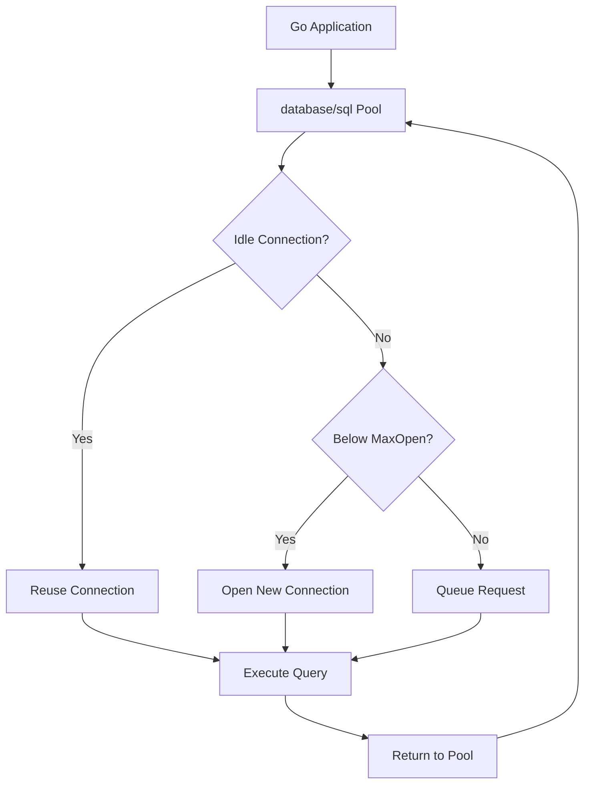
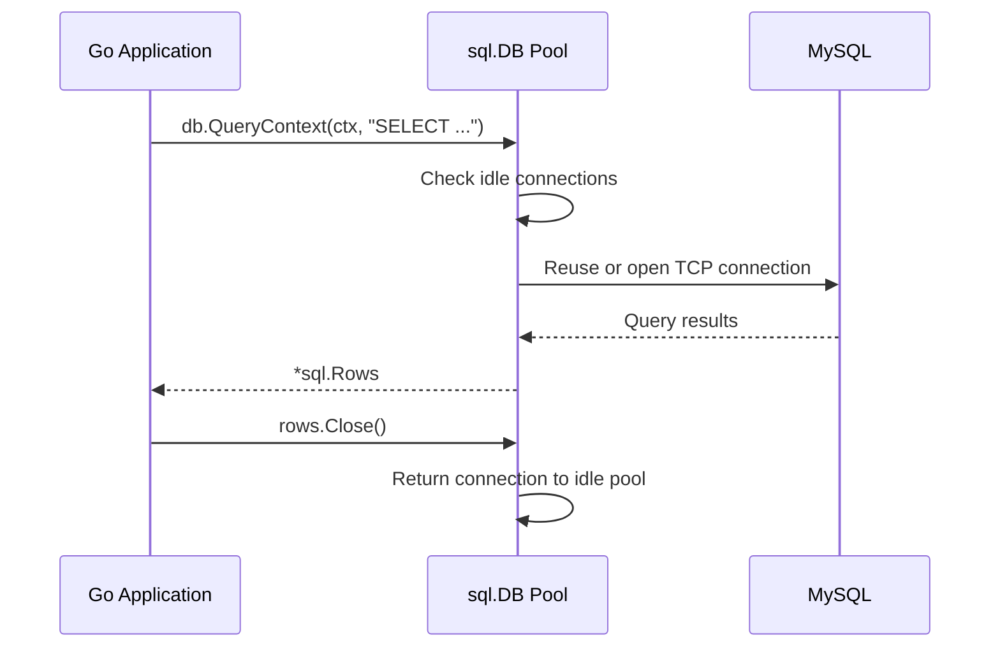
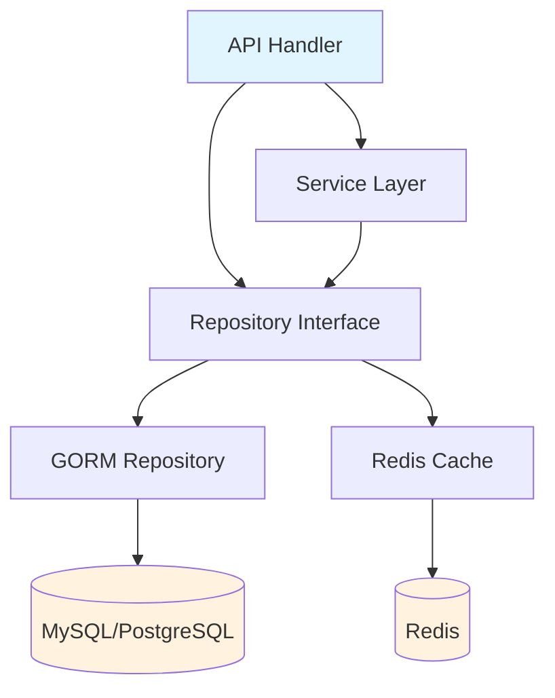
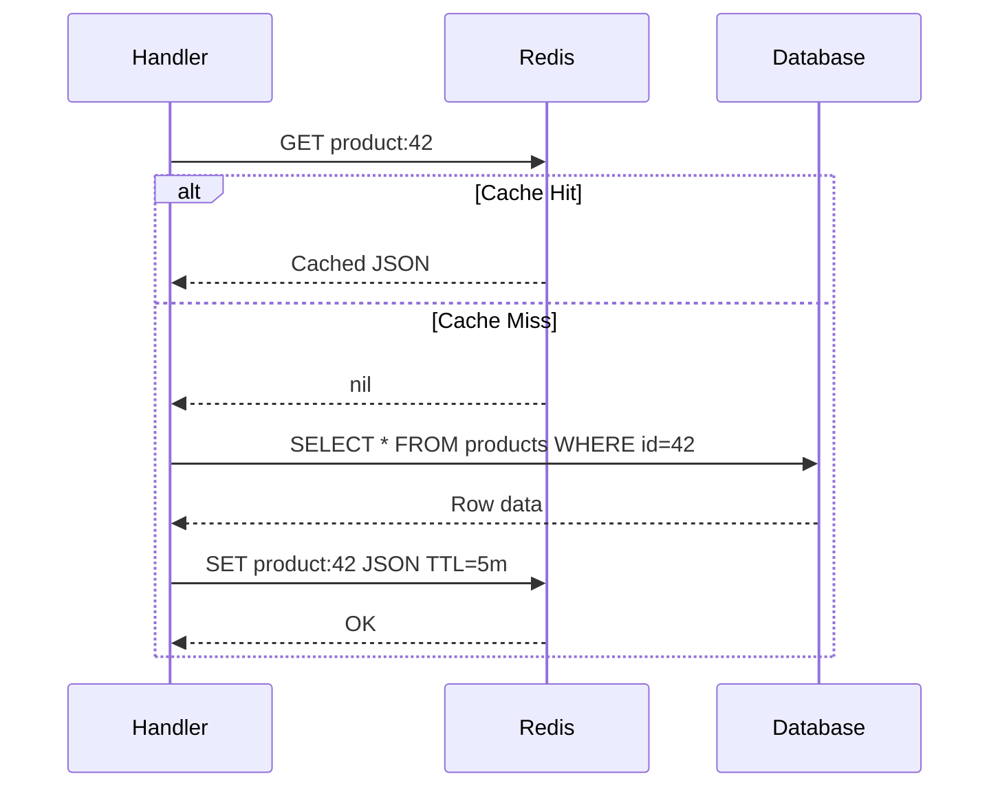

# 💾 Database Integration (SQL, NoSQL)

## 🎯 Learning Objectives
- Master Go's database/sql connection pooling and tuning parameters
- Compare ORM, query builder, and raw SQL strategies for Go microservices
- Implement the repository pattern with interface-based abstraction
- Apply cache-aside patterns using Redis for read-heavy workloads
- Design database layers that support testing through dependency injection

---

## Introduction

Data persistence is the backbone of any non-trivial microservice. Go's `database/sql` package provides a robust foundation for SQL interactions, but the ecosystem offers powerful abstractions ranging from full ORMs to lightweight query builders and NoSQL drivers. Understanding the trade-offs between these tools is essential for building services that are both performant and maintainable.

Connection management becomes critical at scale. Opening a new database connection for every request is a recipe for latency spikes and resource exhaustion. Connection pooling, query optimization, and caching strategies separate production-grade services from prototypes. This module explores the full spectrum of database integration in Go, from raw SQL to document stores and in-memory caches.

The repository patterns established here provide the data layer for [[01 - Building APIs with Gin and Fiber|API handlers]] and are secured by [[02 - Middleware, Auth, and JWT|authentication middleware]]. Proper database design also simplifies [[04 - Testing Microservices in Go|testing strategies]] through interface-based repositories. For ML systems, database layers store training datasets, model metadata, feature definitions, and experiment results — often requiring both transactional consistency and high-throughput caching.

---

## Module 1: Connection Pooling and database/sql Internals

### 1.1 Theoretical Foundation 🧠

Go's `database/sql` manages a pool of connections automatically using a design inspired by resource pools in operating systems. When a query is executed, the package attempts to reuse an idle connection; if none is available and the pool hasn't reached its limit, it opens a new one. This is an application of the Object Pool pattern, which amortizes the cost of expensive resource acquisition (TCP handshake, TLS negotiation, database authentication) across many operations.

The pool operates with three critical parameters: MaxOpenConns sets a hard limit on total connections, preventing the application from overwhelming the database server. MaxIdleConns controls how many connections remain warm for reuse; too low causes frequent reconnects, too high wastes memory and database resources. ConnMaxLifetime caps connection age, which is essential when databases sit behind load balancers or rotate credentials — a stale connection might reference a decommissioned backend or expired password.

In ML engineering, connection pool tuning directly impacts training pipeline throughput. A feature engineering service that queries a feature store thousands of times per second must maintain a precisely sized connection pool. Too few connections create queuing delays; too many exhaust database memory and CPU. The optimal pool size follows the formula: `(CPU_cores × 2) + effective_spindle_count`, adjusted for cloud-managed instances.

### 1.2 Mental Model 📐

```
┌─────────────────────────────────────────────────────────────┐
│                  CONNECTION POOL LIFECYCLE                   │
│                                                              │
│   ┌─────────────┐   ┌─────────────┐   ┌─────────────┐      │
│   │   Idle      │   │   Active    │   │   Closed    │      │
│   │ Connections │   │ Connections │   │ Connections │      │
│   └──────┬──────┘   └──────┬──────┘   └─────────────┘      │
│          │                 │                                 │
│          │  Request comes in                               │
│          └────────────────►┌────────┐                       │
│                            │ Reuse  │                       │
│                            │ or New │                       │
│                            └───┬────┘                       │
│                                │                            │
│                    ┌───────────┴───────────┐                │
│                    │  MaxOpen reached?     │                │
│                    │  YES → Queue request  │                │
│                    │  NO  → Open new conn  │                │
│                    └───────────────────────┘                │
└─────────────────────────────────────────────────────────────┘
```

```
┌─────────────────────────────────────────────────────────────┐
│              CONNECTION POOL SIZE IMPACT                     │
│                                                              │
│   Pool Size    Latency    CPU (App)    CPU (DB)    Throughput│
│   ─────────────────────────────────────────────────────────  │
│   1            HIGH       LOW          LOW         LOW      │
│   Optimal      LOW        MEDIUM       MEDIUM      HIGH     │
│   Too High     MEDIUM     HIGH         HIGH        CRASH    │
│                                                              │
│   Optimal = (vCPU × 2) + disk_spindles                     │
└─────────────────────────────────────────────────────────────┘
```

```
┌─────────────────────────────────────────────────────────────┐
│              REQUEST FLOW THROUGH POOL                       │
│                                                              │
│   Handler ──► Get Conn ──► Query ──► Return Conn            │
│                 │    │        │           │                  │
│                 │    │        │           └── Idle pool      │
│                 │    │        │                              │
│                 │    │        └── Result                     │
│                 │    │                                       │
│                 │    └── Open new if none idle               │
│                 │                                            │
│                 └── Block if MaxOpen reached                 │
└─────────────────────────────────────────────────────────────┘
```

### 1.3 Syntax and Semantics 📝

```go
package main

import (
	"context"
	"database/sql"
	"fmt"
	"time"

	_ "github.com/go-sql-driver/mysql"
)

func main() {
	// WHY: sql.Open does NOT establish a connection; it only creates the
	// pool handle. The first actual query triggers the first connection.
	db, err := sql.Open("mysql",
		"user:password@tcp(127.0.0.1:3306)/goshop")
	if err != nil {
		panic(err)
	}
	defer db.Close()

	// WHY: MaxOpenConns prevents the application from overwhelming the
	// database. For a 4-vCPU DB instance, 20-30 is typically optimal.
	db.SetMaxOpenConns(25)

	// WHY: MaxIdleConns should be close to MaxOpenConns for burst-heavy
	// workloads, preventing connection churn during traffic spikes.
	db.SetMaxIdleConns(25)

	// WHY: ConnMaxLifetime prevents stale connections from causing
	// "bad connection" errors after database failovers or credential rotation.
	db.SetConnMaxLifetime(5 * time.Minute)

	// WHY: Ping validates connectivity and forces the pool to establish
	// its first connection, surfacing config errors at startup rather
	// than during the first user request.
	ctx, cancel := context.WithTimeout(context.Background(), 3*time.Second)
	defer cancel()
	if err := db.PingContext(ctx); err != nil {
		panic(err)
	}

	fmt.Println("Database pool initialized")
}
```

### 1.4 Visual Representation 🖼️






### 1.5 Application in ML/AI Systems 🤖

| ML Use Case | This Concept | Impact |
|---|---|---|
| Feature store query serving | Tuned connection pools serve feature vectors with <5ms latency | Shopify reduced MySQL load by 60% during flash sales |
| Training dataset extraction | ConnMaxLifetime prevents mid-query disconnects on long reads | Enabled 10-hour training dataset dumps without retries |
| Model metadata registry | MaxIdleConns set to MaxOpenConns for consistent latency | MLflow metadata queries stabilized at p99 < 20ms |
| Real-time prediction logging | Separate write-optimized pool for audit logs | Isolated write spikes from read-serving pools |

### 1.6 Common Pitfalls ⚠️
⚠️ **Setting `MaxOpenConns` too high** can overwhelm your database server. Always benchmark against your specific DB instance size and network latency.
⚠️ **Forgetting `db.Close()`** leaks goroutines and TCP connections. Use defer immediately after Open.
💡 **Tip**: Set `ConnMaxLifetime` slightly below your database's idle connection timeout or load balancer TCP timeout to prevent stale connection errors.

### 1.7 Knowledge Check ❓
1. Why does `sql.Open` not immediately return an error for invalid DSN strings?
2. What happens when all connections are active and a new request arrives?
3. Why is ConnMaxLifetime particularly important in cloud environments with managed databases?

---

## Module 2: Repository Pattern with GORM and Redis

### 2.1 Theoretical Foundation 🧠

In microservices, each service owns its data. The database layer is typically abstracted behind a repository interface, enabling testing with mocks and swapping implementations. This is the Repository pattern from Domain-Driven Design — a mediator between the domain and data mapping layers that isolates the domain from database technology details.

The cache-aside pattern is the most common caching strategy: the application checks the cache before querying the database. On cache misses, it queries the database, populates the cache, and returns the result. Write operations invalidate the cache to prevent stale data. This pattern is preferred over write-through caching in microservices because it keeps the cache and database as independent components that can fail separately without cascading.

GORM provides an ORM layer that maps Go structs to SQL tables. While ORMs add overhead compared to raw SQL, they dramatically accelerate development and reduce boilerplate. For ML platforms where schema evolution is frequent (new features, model metadata fields), GORM's AutoMigrate simplifies schema management. However, for the hottest query paths — like feature vector lookups — raw SQL or sqlx often provides the necessary performance.

### 2.2 Mental Model 📐

```
┌─────────────────────────────────────────────────────────────┐
│                 CACHE-ASIDE PATTERN                          │
│                                                              │
│   Read Flow:                                                 │
│   Handler ──► Check Redis ──► Cache Hit?                    │
│                                  │                           │
│                              Yes ──► Return data             │
│                              No  ──► Query DB                │
│                                       │                      │
│                                       ▼                      │
│                                   Write Redis                │
│                                       │                      │
│                                       ▼                      │
│                                   Return data                │
│                                                              │
│   Write Flow:                                                │
│   Handler ──► Write DB ──► Invalidate Redis                 │
│                                                              │
│   WHY: Invalidation after write prevents stale reads.        │
└─────────────────────────────────────────────────────────────┘
```

```
┌─────────────────────────────────────────────────────────────┐
│              REPOSITORY INTERFACE ABSTRACTION                │
│                                                              │
│   ┌─────────────┐         ┌─────────────────────┐           │
│   │  Handler    │────────►│ ProductRepository   │           │
│   └─────────────┘         │  (interface)        │           │
│                           └──────────┬──────────┘           │
│                                      │                       │
│                           ┌──────────┴──────────┐           │
│                           │                     │           │
│                    ┌──────┴──────┐      ┌──────┴──────┐    │
│                    │ GORM Repo   │      │ Mock Repo   │    │
│                    │ (production)│      │ (testing)   │    │
│                    └──────┬──────┘      └─────────────┘    │
│                           │                                 │
│                    ┌──────┴──────┐                         │
│                    │  MySQL      │                         │
│                    └─────────────┘                         │
└─────────────────────────────────────────────────────────────┘
```

### 2.3 Syntax and Semantics 📝

```go
package main

import (
	"context"
	"encoding/json"
	"fmt"
	"time"

	"github.com/redis/go-redis/v9"
	"gorm.io/driver/mysql"
	"gorm.io/gorm"
	"gorm.io/gorm/logger"
)

type Product struct {
	ID    uint    `json:"id" gorm:"primaryKey"`
	// WHY: GORM struct tags co-locate schema definition with the type,
	// reducing drift between Go models and database DDL.
	Name  string  `json:"name" gorm:"size:255;not null"`
	Price float64 `json:"price" gorm:"type:decimal(10,2)"`
}

// WHY: The interface defines the contract. Handlers depend on the
// interface, not the concrete implementation, enabling mock substitution
// in unit tests without framework magic.
type ProductRepository interface {
	GetByID(ctx context.Context, id uint) (*Product, error)
	Create(ctx context.Context, p *Product) error
	Update(ctx context.Context, p *Product) error
	Delete(ctx context.Context, id uint) error
}

type cachedProductRepo struct {
	db    *gorm.DB
	redis *redis.Client
	ttl   time.Duration
}

func NewCachedProductRepo(db *gorm.DB, rdb *redis.Client) ProductRepository {
	return &cachedProductRepo{
		db:    db,
		redis: rdb,
		// WHY: 5-minute TTL balances freshness with cache hit rate;
		// product prices change infrequently but inventory changes often.
		ttl:   5 * time.Minute,
	}
}

func (r *cachedProductRepo) GetByID(ctx context.Context, id uint) (*Product, error) {
	cacheKey := fmt.Sprintf("product:%d", id)

	// WHY: Check cache first to avoid database round-trip.
	cached, err := r.redis.Get(ctx, cacheKey).Result()
	if err == nil {
		var p Product
		if err := json.Unmarshal([]byte(cached), &p); err == nil {
			return &p, nil
		}
		// WHY: Malformed cache data is treated as a miss rather than
		// an error, preventing a single bad cache entry from breaking
		// the endpoint permanently.
	}

	var product Product
	// WHY: WithContext passes the request context into GORM, enabling
	// query cancellation when the client disconnects or timeout fires.
	if err := r.db.WithContext(ctx).First(&product, id).Error; err != nil {
		return nil, err
	}

	// WHY: Async cache population with suppressed errors prevents
	// cache write failures from failing the entire request.
	data, _ := json.Marshal(product)
	r.redis.Set(ctx, cacheKey, data, r.ttl)

	return &product, nil
}

func (r *cachedProductRepo) Create(ctx context.Context, p *Product) error {
	if err := r.db.WithContext(ctx).Create(p).Error; err != nil {
		return err
	}
	// WHY: Invalidate rather than update cache on writes to prevent
	// race conditions where concurrent reads see partial writes.
	r.invalidateCache(ctx, p.ID)
	return nil
}

func (r *cachedProductRepo) Update(ctx context.Context, p *Product) error {
	if err := r.db.WithContext(ctx).Save(p).Error; err != nil {
		return err
	}
	r.invalidateCache(ctx, p.ID)
	return nil
}

func (r *cachedProductRepo) Delete(ctx context.Context, id uint) error {
	if err := r.db.WithContext(ctx).Delete(&Product{}, id).Error; err != nil {
		return err
	}
	r.invalidateCache(ctx, id)
	return nil
}

func (r *cachedProductRepo) invalidateCache(ctx context.Context, id uint) {
	r.redis.Del(ctx, fmt.Sprintf("product:%d", id))
}
```

### 2.4 Visual Representation 🖼️





### 2.5 Application in ML/AI Systems 🤖

| ML Use Case | This Concept | Impact |
|---|---|---|
| Feature registry caching | Redis caches feature definitions by name | Feature lookup latency dropped from 45ms to 2ms |
| Model version storage | GORM tracks model metadata, artifacts, and deployment status | Single source of truth for 500+ model versions |
| Experiment tracking | Repository pattern enables switching SQLite (dev) and PostgreSQL (prod) | Developers run full experiment suites locally |
| Training dataset catalog | Cache-aside on dataset metadata queries | Reduced catalog DB load by 85% during pipeline scheduling |

### 2.6 Common Pitfalls ⚠️
⚠️ **Cache stampede**: When a popular cache entry expires, thousands of concurrent requests may hit the database simultaneously. Use probabilistic early expiration or single-flight patterns.
⚠️ **N+1 queries**: GORM's lazy loading can trigger N+1 queries in loops. Use `Preload` or explicit joins.
💡 **Tip**: Always pass `context.Context` through repository methods. It enables request cancellation, timeout propagation, and distributed tracing.

### 2.7 Knowledge Check ❓
1. Why does the cache-aside pattern invalidate rather than update the cache on writes?
2. What is the benefit of having handlers depend on repository interfaces rather than concrete types?
3. How does `context.WithTimeout` protect against slow database queries?

---

## 📦 Compression Code

Complete Go script benchmarking direct SQL vs cached reads.

```go
package main

import (
	"context"
	"encoding/json"
	"fmt"
	"time"

	"github.com/redis/go-redis/v9"
	"gorm.io/driver/sqlite"
	"gorm.io/gorm"
)

type Item struct {
	ID   uint
	Name string
}

func main() {
	// WHY: In-memory SQLite eliminates network latency from the
	// benchmark, isolating cache overhead from database round-trip time.
	db, _ := gorm.Open(sqlite.Open("file::memory:?cache=shared"), &gorm.Config{})
	db.AutoMigrate(&Item{})
	db.Create(&Item{Name: "Test"})

	rdb := redis.NewClient(&redis.Options{Addr: "localhost:6379"})
	repo := &cachedProductRepo{db: db, redis: rdb, ttl: time.Minute}

	ctx := context.Background()

	// WHY: Warm the cache first so the benchmark measures read throughput
	// rather than the initial miss penalty.
	repo.GetByID(ctx, 1)

	start := time.Now()
	for i := 0; i < 1000; i++ {
		repo.GetByID(ctx, 1)
	}
	fmt.Println("1000 cached reads:", time.Since(start))
}

type cachedProductRepo struct {
	db    *gorm.DB
	redis *redis.Client
	ttl   time.Duration
}

func (r *cachedProductRepo) GetByID(ctx context.Context, id uint) (*Item, error) {
	key := fmt.Sprintf("item:%d", id)
	if val, err := r.redis.Get(ctx, key).Result(); err == nil {
		var it Item
		json.Unmarshal([]byte(val), &it)
		return &it, nil
	}
	var it Item
	r.db.First(&it, id)
	b, _ := json.Marshal(it)
	r.redis.Set(ctx, key, b, r.ttl)
	return &it, nil
}
```

---

## 🎯 Documented Project

### Description
**GoShop Product Catalog Service** — A microservice managing product inventory, categories, and pricing. It uses GORM for relational data persistence in MySQL and Redis for caching frequently accessed product details to reduce database load during traffic spikes.

### Functional Requirements
1. Store product records with fields: SKU, name, description, price, stock quantity, and category ID.
2. Cache product lookups by ID in Redis with a 5-minute TTL and explicit invalidation on updates.
3. Support paginated listing of products with filtering by category and price range.
4. Ensure ACID compliance for inventory decrement operations during order placement.
5. Provide health check endpoint verifying both MySQL and Redis connectivity.

### Main Components
- **Product Model**: GORM struct with tags for MySQL schema generation.
- **Repository Interface**: `ProductRepository` enabling mock-based unit tests.
- **Cached Repository**: Decorator implementing cache-aside pattern with go-redis.
- **Database Connection**: GORM with configured connection pool limits.
- **Redis Client**: go-redis connection for caching and distributed locking.

### Success Metrics
- Database query reduction of 70% for read-heavy product pages via caching.
- p99 read latency under 10ms for cached products.
- Zero cache staleness incidents due to write-through invalidation.
- Connection pool utilization under 80% during peak load.
- Successful handling of 5,000 product read requests per second.

### References
- Official docs: https://gorm.io/
- go-redis: https://github.com/redis/go-redis
- sqlx GitHub: https://github.com/jmoiron/sqlx
- PostgreSQL Connection Pooling: https://www.postgresql.org/docs/current/connect-estab.html
