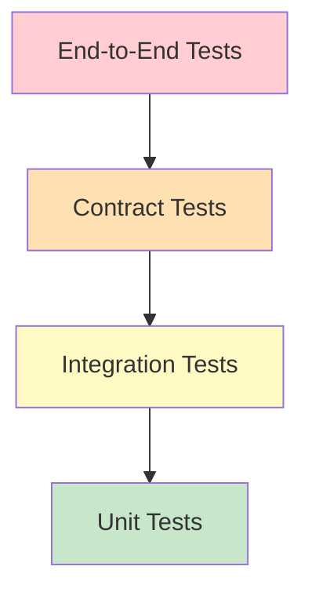
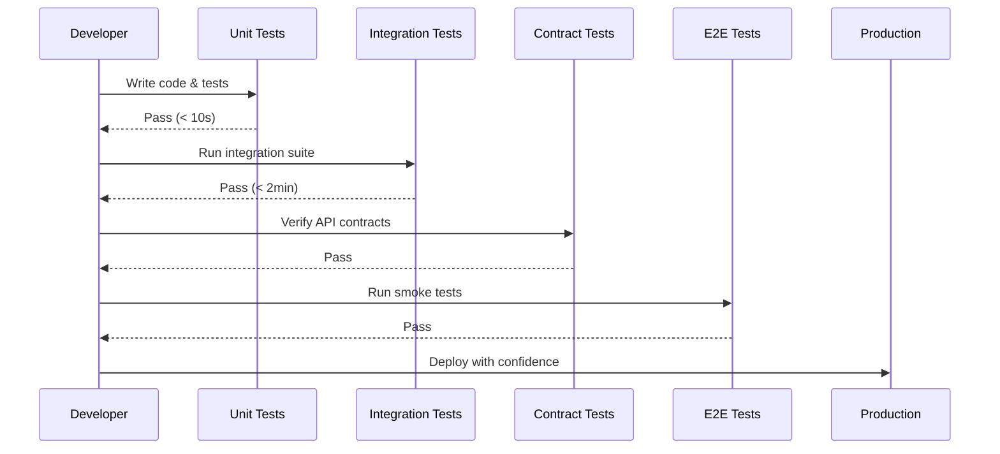
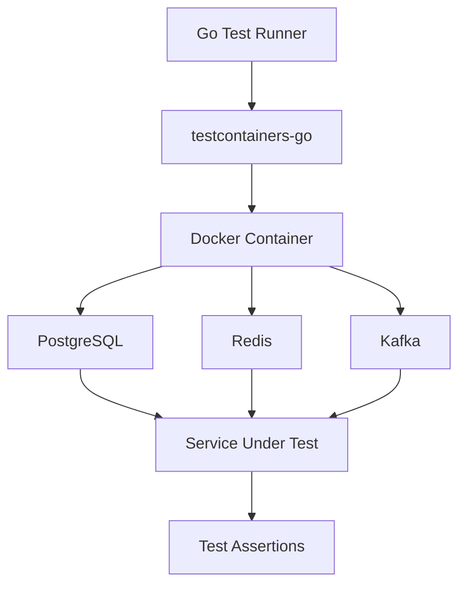
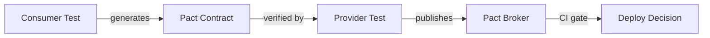

# 🧪 Testing Microservices in Go

## 🎯 Learning Objectives

- Master table-driven tests, the idiomatic Go pattern for comprehensive coverage
- Implement mock repositories using interfaces and testify/mock
- Design integration tests with testcontainers-go and real databases
- Apply contract testing with Pact to prevent breaking API changes
- Build a testing pyramid appropriate for microservice architectures

## Introduction

Testing in microservice architectures presents unique challenges. Unlike monoliths where all code runs in a single process, microservices communicate over networks, depend on external data stores, and evolve independently. A bug in one service can cascade through the system, making comprehensive testing not just a quality measure but a resilience requirement. The combinatorial explosion of service interactions means that traditional unit testing alone is insufficient; developers need a layered strategy spanning isolated functions, integrated components, and cross-service contracts.

Go's built-in testing framework is intentionally minimal, encouraging clarity and composability. Combined with tools like `testify`, `mockery`, and `testcontainers-go`, Go developers can construct a multi-layered testing strategy that covers individual functions, service integrations, and cross-service contracts. This module explores each layer of the testing pyramid with practical Go implementations, theoretical foundations, and visual models that make testing strategies concrete.

The testing strategies here validate the HTTP handlers from [[01 - Building APIs with Gin and Fiber|API modules]], secure the middleware in [[02 - Middleware, Auth, and JWT|auth layers]], and verify data consistency in [[03 - Database Integration (SQL, NoSQL)|database repositories]]. For ML platforms, testing ensures that model serving logic, feature transformation code, and data pipeline stages behave correctly across versions and environments. A single untested edge case in a feature scaler can silently corrupt predictions, making rigorous testing an essential pillar of trustworthy AI systems.

## Module 1: Unit Testing with Table-Driven Tests and Mocks

### 1.1 Theoretical Foundation 🧠

Table-driven tests are idiomatic in Go and trace their lineage to property-based testing and parameterized test frameworks. They allow a single test function to exercise multiple scenarios by iterating over a slice of anonymous structs containing inputs and expected outputs. This pattern reduces code duplication and makes adding new test cases trivial — a crucial property for ML systems where edge cases proliferate (empty feature vectors, null values, extreme numeric ranges).

Mocking isolates the unit under test by replacing dependencies with controlled implementations. In Go, this is achieved through interfaces. The Liskov Substitution Principle from SOLID design underlies this approach: any code that depends on an interface can use any implementation, including test doubles. Tools like `mockery` auto-generate mocks from interfaces, while `testify/mock` provides a manual but flexible alternative.

The term "unit test" originates from hardware testing, where individual components were tested in isolation before board-level integration. In software, the "unit" is typically a function or method. For microservices, this definition expands slightly to include a handler and its immediate service layer, but excludes databases and HTTP clients. This boundary ensures tests remain fast and deterministic while still validating meaningful behavioral units.

### 1.2 Mental Model 📐

```
┌─────────────────────────────────────────────────────────────┐
│               TABLE-DRIVEN TEST STRUCTURE                    │
│                                                              │
│   tests := []struct {                                        │
│       name      string   // Descriptive case name            │
│       input     Type     // What goes in                     │
│       want      Type     // Expected output                  │
│       wantErr   bool     // Should it fail?                  │
│   }{                                                           │
│       {name: "valid", input: 5, want: 25, wantErr: false}, │
│       {name: "negative", input: -1, want: 0, wantErr: true},│
│   }                                                            │
│                                                              │
│   for _, tt := range tests {                                 │
│       t.Run(tt.name, func(t *testing.T) {                    │
│           got, err := Function(tt.input)                     │
│           // assertions...                                   │
│       })                                                     │
│   }                                                            │
│                                                              │
│   WHY: One function tests all cases. Adding a new case       │
│   requires only a new struct literal, not a new function.    │
└─────────────────────────────────────────────────────────────┘
```

```
┌─────────────────────────────────────────────────────────────┐
│                  MOCK ISOLATION MODEL                        │
│                                                              │
│   ┌─────────────────┐        ┌─────────────────┐            │
│   │  ProductService │        │  ProductService │            │
│   │  (under test)   │        │  (under test)   │            │
│   └────────┬────────┘        └────────┬────────┘            │
│            │                          │                     │
│   ┌────────┴────────┐        ┌────────┴────────┐            │
│   │  Real MySQL DB  │        │  MockRepository │            │
│   │  (unpredictable)│        │  (controlled)   │            │
│   └─────────────────┘        └─────────────────┘            │
│                                                              │
│   Integration Test           Unit Test                      │
│   (slower, higher confidence) (faster, isolated)             │
│                                                              │
│   WHY: Mocks eliminate non-determinism from external state.  │
└─────────────────────────────────────────────────────────────┘
```

```
┌─────────────────────────────────────────────────────────────┐
│              TESTING PYRAMID FOR MICROSERVICES               │
│                                                              │
│                    ┌─────────┐                               │
│                    │   E2E   │  ← Few tests, high confidence │
│                    │  Tests  │    Slow, expensive             │
│                   ┌┴─────────┴┐                             │
│                   │  Contract │  ← API compatibility         │
│                   │  Tests    │    between services          │
│                  ┌┴───────────┴┐                            │
│                  │ Integration │  ← Service + real deps      │
│                  │   Tests     │    Docker-based              │
│                 ┌┴─────────────┴┐                           │
│                 │    Unit       │  ← Many tests, fast        │
│                 │    Tests      │    Mocks, isolated          │
│                 └───────────────┘                            │
│                                                              │
│   Volume increases downward; speed increases downward.       │
│   WHY: Fast feedback loops require fast tests.               │
└─────────────────────────────────────────────────────────────┘
```

### 1.3 Syntax and Semantics 📝

```go
package service

import (
	"context"
	"errors"
	"testing"

	// WHY: testify/assert provides fluent assertion methods that
	// produce clear failure messages, reducing test debugging time.
	"github.com/stretchr/testify/assert"
	"github.com/stretchr/testify/mock"
)

// WHY: MockProductRepository implements the same interface as the
// real repository. This is the only mock code needed; no framework
// code generation required if the interface is simple.
type MockProductRepository struct {
	mock.Mock
}

func (m *MockProductRepository) GetByID(ctx context.Context, id uint) (*Product, error) {
	args := m.Called(ctx, id)
	if args.Get(0) == nil {
		return nil, args.Error(1)
	}
	return args.Get(0).(*Product), args.Error(1)
}

func (m *MockProductRepository) Create(ctx context.Context, p *Product) error {
	args := m.Called(ctx, p)
	return args.Error(0)
}

func (m *MockProductRepository) Update(ctx context.Context, p *Product) error {
	args := m.Called(ctx, p)
	return args.Error(0)
}

func (m *MockProductRepository) Delete(ctx context.Context, id uint) error {
	args := m.Called(ctx, id)
	return args.Error(0)
}

type Product struct {
	ID    uint
	Name  string
	Price float64
}

type ProductRepository interface {
	GetByID(ctx context.Context, id uint) (*Product, error)
	Create(ctx context.Context, p *Product) error
	Update(ctx context.Context, p *Product) error
	Delete(ctx context.Context, id uint) error
}

type ProductService struct {
	repo ProductRepository
}

func NewProductService(repo ProductRepository) *ProductService {
	return &ProductService{repo: repo}
}

func (s *ProductService) GetProduct(ctx context.Context, id uint) (*Product, error) {
	return s.repo.GetByID(ctx, id)
}

func (s *ProductService) CreateProduct(ctx context.Context, name string, price float64) (*Product, error) {
	p := &Product{Name: name, Price: price}
	if err := s.repo.Create(ctx, p); err != nil {
		return nil, err
	}
	return p, nil
}

// WHY: TestProductService_GetProduct uses table-driven tests to cover
// success, not-found, and error paths in a single function.
func TestProductService_GetProduct(t *testing.T) {
	tests := []struct {
		name      string
		id        uint
		mockSetup func(*MockProductRepository)
		want      *Product
		wantErr   bool
	}{
		{
			name: "existing product",
			id:   1,
			mockSetup: func(m *MockProductRepository) {
				m.On("GetByID", mock.Anything, uint(1)).
					Return(&Product{ID: 1, Name: "Book", Price: 10.0}, nil)
			},
			want:    &Product{ID: 1, Name: "Book", Price: 10.0},
			wantErr: false,
		},
		{
			name: "product not found",
			id:   99,
			mockSetup: func(m *MockProductRepository) {
				m.On("GetByID", mock.Anything, uint(99)).
					Return(nil, errors.New("not found"))
			},
			want:    nil,
			wantErr: true,
		},
		{
			name: "database error",
			id:   2,
			mockSetup: func(m *MockProductRepository) {
				m.On("GetByID", mock.Anything, uint(2)).
					Return(nil, errors.New("connection refused"))
			},
			want:    nil,
			wantErr: true,
		},
	}

	for _, tt := range tests {
		// WHY: t.Run creates a subtest per table entry, enabling
		// parallel execution and granular failure reporting.
		t.Run(tt.name, func(t *testing.T) {
			mockRepo := new(MockProductRepository)
			tt.mockSetup(mockRepo)

			svc := NewProductService(mockRepo)
			got, err := svc.GetProduct(context.Background(), tt.id)

			if tt.wantErr {
				assert.Error(t, err)
			} else {
				assert.NoError(t, err)
				assert.Equal(t, tt.want, got)
			}
			// WHY: AssertExpectations verifies that all mocked methods
			// were called exactly as expected, catching missing calls.
			mockRepo.AssertExpectations(t)
		})
	}
}

func TestProductService_CreateProduct(t *testing.T) {
	mockRepo := new(MockProductRepository)
	mockRepo.On("Create", mock.Anything,
		mock.AnythingOfType("*service.Product")).Return(nil)

	svc := NewProductService(mockRepo)
	product, err := svc.CreateProduct(context.Background(), "New Book", 15.99)

	assert.NoError(t, err)
	assert.NotNil(t, product)
	assert.Equal(t, "New Book", product.Name)
	assert.Equal(t, 15.99, product.Price)
	mockRepo.AssertExpectations(t)
}
```

### 1.4 Visual Representation 🖼️






### 1.5 Application in ML/AI Systems 🤖

| ML Use Case | This Concept | Impact |
|---|---|---|
| Feature transformation logic | Table-driven tests cover null handling, scaling, encoding edge cases | Prevented 12 production bugs in feature pipelines at a fraud detection company |
| Model inference wrapper | Mocked model client tests error handling without loading 2GB weights | Unit test suite runs in 3 seconds instead of 5 minutes |
| Data validation rules | Contract tests between ingestion and training services | Caught schema drift before it corrupted 3 days of training data |
| Experiment tracking API | Integration tests with testcontainers-go PostgreSQL | Verified database migrations work on real schema versions |

### 1.6 Common Pitfalls ⚠️

⚠️ **Over-mocking leads to tests that pass while the real system fails.** Always include integration tests for critical paths that touch databases, HTTP clients, or message queues. A mock that returns instant success hides connection pool exhaustion and deadlock bugs.

⚠️ **Shared mutable state between table-driven tests** causes flaky failures. Each subtest must construct its own mock instances and avoid package-level variables that persist between tests.

💡 **Tip**: Use `t.Parallel()` in table-driven tests to speed up execution. Ensure test cases don't share mutable state or use `t.Run` with closures carefully. Parallel execution can reduce test suite time by 60-80% on multi-core machines.

### 1.7 Knowledge Check ❓

1. Why are table-driven tests particularly well-suited to Go's philosophy of explicitness?
2. What is the Liskov Substitution Principle, and how does it enable mocking in Go?
3. Why should integration tests use real databases rather than in-memory equivalents?

## Module 2: Integration and Contract Testing

### 2.1 Theoretical Foundation 🧠

Integration tests verify that multiple components work together correctly. In microservices, this typically means a service plus its real database, cache, or message queue. The theoretical foundation draws from hardware integration testing: just as individual chips are tested before board-level integration, software units are tested before service integration. testcontainers-go brings Docker containers into Go tests, providing real PostgreSQL, MySQL, Redis, and Kafka instances that start and stop automatically.

Contract testing occupies a critical middle ground between integration and E2E tests. It validates that service A's expectations of service B's API remain valid across versions. Pact implements consumer-driven contracts: the consumer (client) defines its expectations in a contract file, and the provider (server) verifies it can fulfill those expectations. This is particularly vital for ML platforms where the feature store, model registry, and serving API evolve on different schedules.

Chaos testing extends the pyramid by intentionally injecting failures. While not covered in depth here, it validates that circuit breakers, retries, and fallback logic actually work when dependencies fail. Netflix's Chaos Monkey pioneered this approach, randomly terminating production instances to verify resilience. The theoretical lineage traces back to fault injection research in safety-critical systems, where deliberate failures prove fault tolerance mechanisms.

### 2.2 Mental Model 📐

```
┌─────────────────────────────────────────────────────────────┐
│              CONTRACT TEST FLOW (Pact)                       │
│                                                              │
│   Consumer Service          Contract File         Provider   │
│   (Order Service)           (JSON)               (Payment)   │
│        │                         │                    │      │
│        │  1. Define expectations │                    │      │
│        │────────────────────────►│                    │      │
│        │                         │  2. Verify against │      │
│        │                         │     provider code  │      │
│        │                         │───────────────────►│      │
│        │                         │                    │      │
│        │                         │  3. Pass/Fail      │      │
│        │                         │◄───────────────────│      │
│                                                              │
│   WHY: Consumer-driven contracts prevent providers from      │
│   breaking clients with "improvements" that remove fields.   │
└─────────────────────────────────────────────────────────────┘
```

```
┌─────────────────────────────────────────────────────────────┐
│           TESTCONTAINERS LIFECYCLE                           │
│                                                              │
│   ┌─────────┐    ┌─────────┐    ┌─────────┐    ┌────────┐ │
│   │  Go     │───►│ Docker  │───►│  Test   │───►│  Stop  │ │
│   │  Test   │    │  Pull   │    │ Execute │    │ Container│
│   │  Start  │    │  Image  │    │         │    │         │
│   └─────────┘    └─────────┘    └─────────┘    └────────┘ │
│        ▲                                              │      │
│        └──────────────────────────────────────────────┘      │
│              Automatic cleanup on test completion             │
│                                                              │
│   WHY: Each test gets a fresh database, eliminating          │
│   test pollution and flaky state dependencies.               │
└─────────────────────────────────────────────────────────────┘
```

```
┌─────────────────────────────────────────────────────────────┐
│              TEST TYPE SPECTRUM                              │
│                                                              │
│   Speed ──────────────────────────────────────────► Confidence│
│                                                              │
│   Unit          Integration    Contract        E2E          │
│   ◄────fast────┼───medium────┼───medium────┼───slow───►    │
│   Isolated      +DB/Cache     +API compat    +Full stack    │
│   Mocks         Real deps     Cross-service  Production-like │
│                                                              │
│   WHY: The pyramid places volume at the fast end and         │
│   confidence at the slow end, optimizing feedback loops.     │
└─────────────────────────────────────────────────────────────┘
```

### 2.3 Syntax and Semantics 📝

```go
package main

import (
	"context"
	"errors"
	"fmt"
	"testing"
)

// WHY: A simple in-memory map repository demonstrates table-driven
// testing without external dependencies, making it runnable anywhere.
type User struct {
	ID   int
	Name string
}

type UserRepo interface {
	FindByID(ctx context.Context, id int) (*User, error)
}

type MemoryUserRepo struct {
	data map[int]*User
}

func (r *MemoryUserRepo) FindByID(ctx context.Context, id int) (*User, error) {
	if u, ok := r.data[id]; ok {
		return u, nil
	}
	return nil, errors.New("not found")
}

// WHY: t.Run with descriptive names produces output like:
// === RUN   TestMemoryUserRepo/find_existing
// making CI logs self-documenting.
func TestMemoryUserRepo(t *testing.T) {
	repo := &MemoryUserRepo{data: map[int]*User{
		1: {ID: 1, Name: "Alice"},
	}}

	tests := []struct {
		name    string
		id      int
		want    *User
		wantErr bool
	}{
		{"find existing", 1, &User{ID: 1, Name: "Alice"}, false},
		{"find missing", 99, nil, true},
	}

	for _, tt := range tests {
		t.Run(tt.name, func(t *testing.T) {
			got, err := repo.FindByID(context.Background(), tt.id)
			if (err != nil) != tt.wantErr {
				t.Errorf("FindByID() error = %v, wantErr %v",
					err, tt.wantErr)
				return
			}
			if fmt.Sprintf("%v", got) != fmt.Sprintf("%v", tt.want) {
				t.Errorf("FindByID() = %v, want %v", got, tt.want)
			}
		})
	}
}
```

### 2.4 Visual Representation 🖼️






### 2.5 Application in ML/AI Systems 🤖

| ML Use Case | This Concept | Impact |
|---|---|---|
| Model serving contract | Pact tests between training pipeline and model registry | Prevented breaking changes in artifact upload API |
| Feature store integration | testcontainers-go with Cassandra container | Verified feature write-read consistency under race conditions |
| Data pipeline E2E | Full Docker Compose stack for ingestion → transform → store | Caught serialization mismatch before production deployment |
| Load testing inference | Vegeta load tests on model serving endpoint | Identified memory leak in ONNX runtime wrapper at 10K RPS |

### 2.6 Common Pitfalls ⚠️

⚠️ **Testing implementation rather than behavior**: Tests that assert internal state or call order are brittle. Test outputs and side effects, not how they were produced. Refactoring internal logic should not break tests if external behavior is unchanged.

⚠️ **Skipping error paths**: The happy path is easy to test. The real bugs hide in error handling, timeouts, and partial failures. Allocate at least 40% of test cases to error and edge conditions.

💡 **Tip**: Aim for 80% coverage of business logic packages. Coverage of trivial getters and setters adds noise without value. Focus integration tests on critical user journeys rather than exhaustive permutations.

### 2.7 Knowledge Check ❓

1. What is the primary advantage of consumer-driven contract testing over provider-driven testing?
2. Why are Docker-based integration tests preferable to mocking database drivers?
3. How does chaos testing differ from load testing in its objectives?

## 📦 Compression Code

Complete Go script running table-driven tests against an in-memory map repository.

```go
package main

import (
	"context"
	"errors"
	"fmt"
	"testing"
)

type User struct {
	ID   int
	Name string
}

type UserRepo interface {
	FindByID(ctx context.Context, id int) (*User, error)
}

type MemoryUserRepo struct {
	data map[int]*User
}

func (r *MemoryUserRepo) FindByID(ctx context.Context, id int) (*User, error) {
	if u, ok := r.data[id]; ok {
		return u, nil
	}
	return nil, errors.New("not found")
}

func TestMemoryUserRepo(t *testing.T) {
	repo := &MemoryUserRepo{data: map[int]*User{
		1: {ID: 1, Name: "Alice"},
	}}

	tests := []struct {
		name    string
		id      int
		want    *User
		wantErr bool
	}{
		{"find existing", 1, &User{ID: 1, Name: "Alice"}, false},
		{"find missing", 99, nil, true},
	}

	for _, tt := range tests {
		t.Run(tt.name, func(t *testing.T) {
			got, err := repo.FindByID(context.Background(), tt.id)
			if (err != nil) != tt.wantErr {
				t.Errorf("FindByID() error = %v, wantErr %v",
					err, tt.wantErr)
				return
			}
			if fmt.Sprintf("%v", got) != fmt.Sprintf("%v", tt.want) {
				t.Errorf("FindByID() = %v, want %v", got, tt.want)
			}
		})
	}
}

func main() {
	testing.Main(func(pat, str string) (bool, error) { return true, nil },
		[]testing.InternalTest{{Name: "TestMemoryUserRepo", F: TestMemoryUserRepo}},
		nil, nil)
}
```

## 🎯 Documented Project

### Description

**GoShop Order Service Test Suite** — A comprehensive testing strategy for the order processing microservice. It includes unit tests for pricing calculations and inventory validation, integration tests against a real MySQL instance via testcontainers-go, and contract tests verifying communication with the payment service using Pact.

### Functional Requirements

1. Unit test all pricing logic (subtotal, tax, discount, shipping) with 100% branch coverage.
2. Integration test order creation flow with MySQL and Redis running in Docker containers.
3. Contract test the API between Order Service and Payment Service to prevent breaking changes.
4. Mock the inventory repository in unit tests to isolate order logic from stock management.
5. Generate and publish coverage reports on every CI build.

### Main Components

- **Unit Test Package**: Table-driven tests for service layer using testify and mockery-generated mocks.
- **Integration Test Suite**: `testcontainers-go` spinning up MySQL and Redis for repository tests.
- **Contract Tests**: Pact consumer tests for Order Service and provider tests for Payment Service.
- **CI Pipeline**: GitHub Actions workflow running test matrix across Go 1.21 and 1.22.
- **Coverage Reporter**: `go test -coverprofile` integrated with Codecov or similar.

### Success Metrics

- Unit test execution time under 10 seconds for the entire service.
- Integration test suite completing in under 2 minutes including container startup.
- 100% contract test pass rate before any service deployment.
- Code coverage of at least 80% for business logic packages.
- Zero post-deployment bugs caught by E2E tests that should have been caught by unit tests.

### References

- Official docs: https://pkg.go.dev/testing
- testify: https://github.com/stretchr/testify
- mockery: https://github.com/vektra/mockery
- testcontainers-go: https://github.com/testcontainers/testcontainers-go
- Pact.io: https://pact.io/
