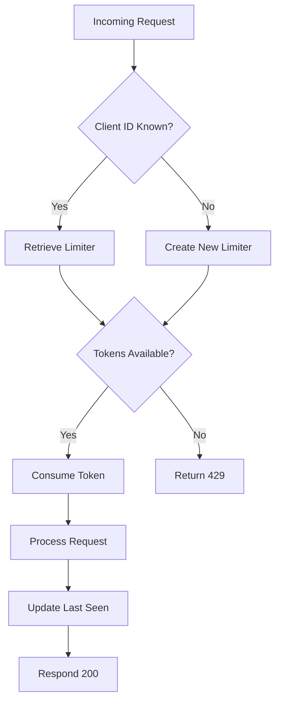
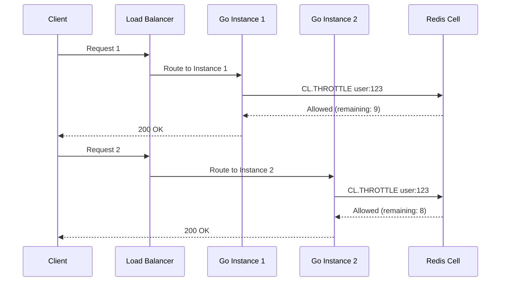
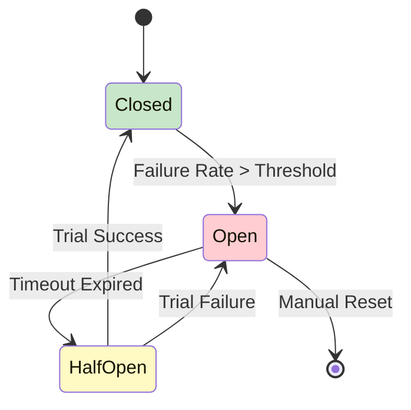
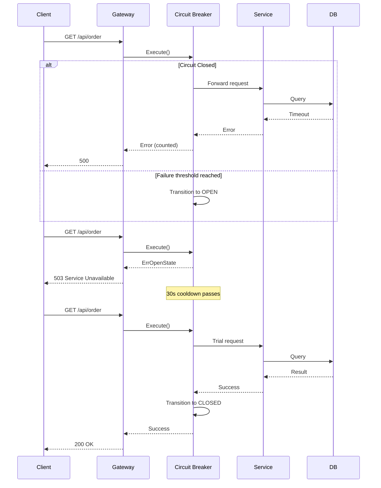

# ⏱️ Rate Limiting and Circuit Breakers

## 🎯 Learning Objectives

- Master token bucket, leaky bucket, fixed window, and sliding window rate limiting algorithms
- Implement per-client rate limiting with `golang.org/x/time/rate` and Gin middleware
- Design circuit breaker state machines using `sony/gobreaker` for fault isolation
- Configure distributed rate limiting with Redis-backed shared state
- Apply resilience patterns to protect ML inference pipelines from traffic spikes and cascading failures

## Introduction

Microservices operate in an unpredictable network environment. Sudden traffic spikes, cascading failures, and misbehaving clients can transform a healthy distributed system into a pile of cascading timeouts and resource exhaustion. Rate limiting and circuit breakers are the two primary resilience patterns that prevent overload and isolate faults before they propagate across service boundaries.

Rate limiting controls inbound traffic by enforcing a maximum request rate per client, endpoint, or tenant. It draws from decades of telecommunications and network engineering, where traffic shaping prevents congestion collapse. Circuit breakers monitor outbound calls to dependencies and temporarily block requests when failure rates exceed configurable thresholds, giving failing services time to recover without overwhelming them with retry traffic. Together, these patterns form a defensive perimeter around each microservice, protecting the API construction skills from [[01 - Building APIs with Gin and Fiber|routing modules]] and securing the data access layers in [[03 - Database Integration (SQL, NoSQL)|database integrations]]. They also reduce the fragility of [[04 - Testing Microservices in Go|test strategies]] by making failure modes explicit and deterministic.

For ML/AI platforms, these patterns are not optional luxuries but operational necessities. Model serving endpoints can be computationally expensive, with single inference requests consuming significant GPU memory. Unconstrained traffic can exhaust VRAM, trigger out-of-memory kills, or saturate feature store connections. Rate limiting ensures fair resource allocation across tenants and experiments, while circuit breakers prevent a struggling vector database or embedding service from destabilizing the entire prediction pipeline.

## Module 1: Rate Limiting

### 1.1 Theoretical Foundation 🧠

Rate limiting has its roots in telecommunications traffic engineering. In the 1960s, telephone networks employed trunk reservation and call gapping to prevent switch overload during peak hours. The Internet era brought token bucket and leaky bucket algorithms from ATM (Asynchronous Transfer Mode) network design into software systems. These algorithms model network traffic as fluid flows, applying principles from queuing theory to prevent buffer overflow and ensure quality of service.

The token bucket algorithm, formalized in the 1980s for ATM traffic shaping, maintains a bucket of tokens that refills at a constant rate. Each request consumes a token; if no tokens remain, the request is delayed or rejected. This allows controlled bursts up to bucket capacity while enforcing long-term average rates. The leaky bucket algorithm, by contrast, enforces a strictly constant outflow rate, smoothing traffic at the cost of potential queue latency under bursts.

From a theoretical perspective, rate limiting is an instance of flow control in distributed systems. It prevents the "thundering herd" problem, where synchronized client retries overwhelm a recovering service. In queuing theory terms, a rate limiter transforms an unbounded M/M/1 queue into a regulated G/D/1 system, preventing unbounded latency growth under overload.

### 1.2 Mental Model 📐

```
┌─────────────────────────────────────────────────────────────┐
│                    TOKEN BUCKET MECHANISM                    │
│                                                              │
│   Tokens added at rate r:  ● ● ● ● ●  (5 tokens/sec)       │
│                            ↓ ↓ ↓ ↓ ↓                       │
│   ┌─────────────────┐                                      │
│   │    Bucket       │  Capacity C = 10 tokens              │
│   │  ┌───────────┐  │                                      │
│   │  │ ● ● ● ● ● │  │  Current tokens = 5                  │
│   │  │ ● ● ● ● ● │  │                                      │
│   │  └───────────┘  │                                      │
│   └────────┬────────┘                                      │
│            │                                                │
│   Request arrives: consumes 1 token                         │
│   If bucket empty → Reject (429 Too Many Requests)          │
│                                                              │
│   WHY: Bursts up to C are allowed, but sustained            │
│   rate is capped at r tokens per second.                    │
└─────────────────────────────────────────────────────────────┘
```

```
┌─────────────────────────────────────────────────────────────┐
│                 RATE LIMITER COMPARISON                      │
│                                                              │
│   Token Bucket    Leaky Bucket    Fixed Window   Sliding    │
│   ────────────    ────────────    ────────────   ───────    │
│   Allows bursts   Smooths traffic   Simple        Accurate  │
│   Medium memory   Medium memory    Very low      High mem   │
│   Good accuracy   High accuracy     Low accuracy  Best      │
│   Low complexity  Medium complexity Very low      High      │
│                                                              │
│   Best for: APIs  Best for: webhooks  Best for: simple     │
│   needing bursts  needing steady      rate caps   Best for: │
│                   throughput                      strict QoS│
└─────────────────────────────────────────────────────────────┘
```

```
┌─────────────────────────────────────────────────────────────┐
│              DISTRIBUTED RATE LIMITER ARCHITECTURE           │
│                                                              │
│        ┌─────────┐    ┌─────────┐    ┌─────────┐           │
│        │ Client  │    │ Client  │    │ Client  │           │
│        │    A    │    │    B    │    │    C    │           │
│        └────┬────┘    └────┬────┘    └────┬────┘           │
│             │              │              │                  │
│        ┌────┴──────────────┴──────────────┴────┐           │
│        │           Load Balancer                │           │
│        └────┬──────────────┬──────────────┬────┘           │
│             │              │              │                  │
│        ┌────┴────┐    ┌────┴────┐    ┌────┴────┐          │
│        │  Go     │    │  Go     │    │  Go     │          │
│        │Instance │    │Instance │    │Instance │          │
│        │   #1    │    │   #2    │    │   #3    │          │
│        └───┬─────┘    └───┬─────┘    └───┬─────┘          │
│            │              │              │                  │
│            └──────────────┼──────────────┘                  │
│                           │                                 │
│                    ┌──────┴──────┐                         │
│                    │    Redis    │  ← Shared token state    │
│                    │   (Redis    │    across all instances  │
│                    │    Cell)    │                         │
│                    └─────────────┘                         │
│                                                              │
│   WHY: In-memory limiters fail under load balancer           │
│   distribution. Shared state ensures global consistency.     │
└─────────────────────────────────────────────────────────────┘
```

### 1.3 Syntax and Semantics 📝

```go
package main

import (
	"net/http"
	"sync"
	"time"

	// WHY: gin provides HTTP routing and middleware support
	// with minimal overhead, ideal for microservice gateways.
	"github.com/gin-gonic/gin"
	// WHY: golang.org/x/time/rate implements token bucket
	// with efficient lock-free algorithms and burst support.
	"golang.org/x/time/rate"
)

// ClientLimiter tracks per-client rate limit state and
// last access time for garbage collection.
type ClientLimiter struct {
	limiter  *rate.Limiter
	lastSeen time.Time
}

var (
	// WHY: map access is not thread-safe; RWMutex allows
	// concurrent reads with exclusive writes.
	clients = make(map[string]*ClientLimiter)
	mu      sync.RWMutex
)

// getLimiter returns a token bucket for the clientID,
// creating one if it does not exist.
func getLimiter(clientID string, r rate.Limit, b int) *rate.Limiter {
	mu.Lock()
	defer mu.Unlock()

	if cl, exists := clients[clientID]; exists {
		cl.lastSeen = time.Now()
		return cl.limiter
	}

	limiter := rate.NewLimiter(r, b)
	clients[clientID] = &ClientLimiter{
		limiter:  limiter,
		lastSeen: time.Now(),
	}
	return limiter
}

// RateLimitMiddleware enforces per-client token bucket limits.
func RateLimitMiddleware(r rate.Limit, b int) gin.HandlerFunc {
	return func(c *gin.Context) {
		clientID := c.ClientIP()
		// WHY: Authenticated endpoints should use user ID
		// instead of IP to prevent shared-IP throttling.
		limiter := getLimiter(clientID, r, b)

		if !limiter.Allow() {
			c.AbortWithStatusJSON(http.StatusTooManyRequests, gin.H{
				"error": "rate limit exceeded",
			})
			return
		}
		c.Next()
	}
}

// cleanupOldLimiters prevents memory leaks by removing
// inactive client limiters after the specified interval.
func cleanupOldLimiters(interval time.Duration) {
	for {
		time.Sleep(interval)
		mu.Lock()
		for ip, client := range clients {
			if time.Since(client.lastSeen) > interval {
				delete(clients, ip)
			}
		}
		mu.Unlock()
	}
}

func main() {
	go cleanupOldLimiters(1 * time.Minute)

	r := gin.Default()
	// WHY: 10 req/sec sustained with burst of 20 allows
	// normal usage while preventing abuse.
	r.Use(RateLimitMiddleware(rate.Limit(10), 20))

	r.GET("/api/data", func(c *gin.Context) {
		c.JSON(http.StatusOK, gin.H{"message": "success"})
	})

	r.Run(":8080")
}
```

### 1.4 Visual Representation 🖼️






### 1.5 Application in ML/AI Systems 🤖

| ML Use Case | This Concept | Impact |
|---|---|---|
| GPU inference endpoint protection | Token bucket per tenant prevents one customer from monopolizing GPU memory | Prevented OOM kills during flash sale traffic at an e-commerce ML platform |
| Feature store query throttling | Sliding window limits on embedding lookups prevent Redis overload | Reduced p99 latency from 450ms to 85ms under 10x traffic spikes |
| Model training job scheduling | Leaky bucket smooths submission rate to the Kubernetes cluster | Eliminated cluster scheduling storms that delayed critical experiments |
| A/B test traffic allocation | Fixed window ensures equal request distribution across model variants | Maintained statistical significance without manual traffic capping |

### 1.6 Common Pitfalls ⚠️

⚠️ **In-memory rate limiters fail under load balancer rotation.** When traffic distributes across multiple Go instances, each maintains independent token state. A client can exceed the intended global limit by spreading requests across replicas. Always use Redis, etcd, or a centralized counter for distributed deployments.

⚠️ **Setting burst capacity too low destroys legitimate user experience.** A burst of 1 token forces strictly sequential processing, adding latency to every concurrent request. Burst should accommodate expected natural concurrency patterns, typically 2-5x the sustained rate.

💡 **Tip**: Return `Retry-After` headers with 429 responses to enable intelligent client-side backoff. This reduces retry storms and improves overall system stability.

### 1.7 Knowledge Check ❓

1. Why does the token bucket algorithm allow traffic bursts while the leaky bucket does not?
2. What queuing theory problem does rate limiting prevent in systems with unbounded request queues?
3. Why is a shared state store necessary for rate limiting in horizontally scaled microservices?

## Module 2: Circuit Breakers

### 2.1 Theoretical Foundation 🧠

The circuit breaker pattern draws its name and conceptual model from electrical engineering, where circuit breakers protect wiring from overload by physically interrupting current flow. In software, the pattern was popularized by Michael Nygard in his 2007 book *Release It!* as a fault-tolerance mechanism for distributed systems. The core insight is that repeatedly calling a failing service wastes resources, increases latency, and risks cascading failures across the call graph.

From a computer science perspective, circuit breakers implement the fail-fast principle, a fundamental tenet of resilient system design. Rather than allowing requests to queue up behind a failing dependency, the breaker rapidly returns an error, preserving threads and connection pool slots. This aligns with the Bulkhead pattern, which isolates failures to prevent them from spreading.

The state machine underlying circuit breakers has three states: Closed (normal operation), Open (requests blocked), and Half-Open (probing for recovery). This design echoes control theory's bang-bang control, where a system switches abruptly between discrete states rather than gradually modulating behavior. The timeout before transitioning to Half-Open acts as a hysteresis mechanism, preventing rapid oscillation between Open and Closed states when a dependency is intermittently flaky.

### 2.2 Mental Model 📐

```
┌─────────────────────────────────────────────────────────────┐
│              CIRCUIT BREAKER STATE MACHINE                   │
│                                                              │
│         ┌─────────┐                                          │
│         │  CLOSED │  ← Normal operation                      │
│         │  (flow) │    Requests pass through                 │
│         └───┬─────┘                                          │
│             │                                                │
│   Failure rate > threshold                                   │
│   (e.g., 5 errors in 10 req)                                 │
│             ▼                                                │
│         ┌─────────┐                                          │
│         │  OPEN   │  ← Fast-fail mode                        │
│         │ (block) │    Return error immediately              │
│         └───┬─────┘    No load sent to dependency            │
│             │                                                │
│   Timeout expires (e.g., 30s)                                │
│             ▼                                                │
│         ┌─────────┐                                          │
│         │ HALF-OPEN│ ← Probe mode                            │
│         │ (trial) │    Allow limited trial requests          │
│         └───┬─────┘                                          │
│             │                                                │
│   ┌─────────┴─────────┐                                      │
│   ▼                   ▼                                      │
│ ┌─────────┐      ┌─────────┐                                │
│ │  CLOSED │      │  OPEN   │                                │
│ │ (success)│      │ (failure)│                               │
│ └─────────┘      └─────────┘                                │
│                                                              │
│   WHY: Hysteresis prevents oscillation. The cooldown         │
│   period lets the failing service recover before probing.    │
└─────────────────────────────────────────────────────────────┘
```

```
┌─────────────────────────────────────────────────────────────┐
│           CASCADING FAILURE PREVENTION                       │
│                                                              │
│   Without Circuit Breaker          With Circuit Breaker      │
│   ───────────────────────          ─────────────────────     │
│                                                                │
│   ┌─────────┐    ┌─────────┐      ┌─────────┐   ┌─────────┐ │
│   │   API   │───►│ Payment │      │   API   │──►│ Circuit │ │
│   │ Gateway │    │ Service │      │ Gateway │   │ Breaker │ │
│   └────┬────┘    └────┬────┘      └────┬────┘   └────┬────┘ │
│        │              │                │             │       │
│        │  Retry ×3    │ Failing        │  Fail Fast  │ Open  │
│        │─────────────►│ 500ms          │◄────────────┘       │
│        │  Retry ×3    │                │                     │
│        │─────────────►│                │   Payment recovers  │
│        │  Retry ×3    │                │   after 30s cooldown │
│        │─────────────►│                │                     │
│        │              │                │   ┌─────────┐       │
│        │  Threads     │                └──►│ Payment │ Works │
│        │  exhausted   │                    │ Service │       │
│        │  (cascade)   │                    └─────────┘       │
│                                                              │
│   Result: Gateway dies too       Result: Gateway stays healthy│
└─────────────────────────────────────────────────────────────┘
```

```
┌─────────────────────────────────────────────────────────────┐
│              CIRCUIT BREAKER INTERNAL COUNTERS               │
│                                                              │
│   ┌─────────────────────────────────────────────┐           │
│   │              Counts Window                   │           │
│   │  ┌─────────┬─────────┬─────────┬─────────┐  │           │
│   │  │  Req 1  │  Req 2  │  Req 3  │  Req 4  │  │           │
│   │  │  ✓ OK   │  ✗ FAIL │  ✗ FAIL │  ✓ OK   │  │           │
│   │  └─────────┴─────────┴─────────┴─────────┘  │           │
│   │                                              │           │
│   │  Total Requests: 4                           │           │
│   │  Total Failures: 2  →  Failure Ratio: 0.5    │           │
│   │  Consecutive Failures: 2                     │           │
│   │                                              │           │
│   │  Threshold: Requests >= 3 && Ratio >= 0.6    │           │
│   │  Result: KEEP CLOSED (ratio below threshold) │           │
│   │                                              │           │
│   │  If Req 5 fails: Ratio = 0.6 → OPEN          │           │
│   └─────────────────────────────────────────────┘           │
│                                                              │
│   WHY: Dual thresholds prevent flapping on small samples.    │
└─────────────────────────────────────────────────────────────┘
```

### 2.3 Syntax and Semantics 📝

```go
package main

import (
	"net/http"
	"time"

	"github.com/gin-gonic/gin"
	// WHY: sony/gobreaker is a production-hardened circuit breaker
	// with configurable thresholds, state callbacks, and counters.
	"github.com/sony/gobreaker"
)

var cb *gobreaker.CircuitBreaker

func init() {
	var settings gobreaker.Settings
	// WHY: MaxRequests is the maximum number of requests allowed
	// to pass through when the circuit is half-open. Setting it to
	// 3 allows a small probe batch without overwhelming a recovering
	// dependency.
	settings.MaxRequests = 3
	// WHY: Interval is the cyclic period for clearing internal
	// counters. A 10-second window balances responsiveness with
	// immunity to brief transient errors.
	settings.Interval = 10 * time.Second
	// WHY: Timeout prevents individual requests from hanging
	// indefinitely, contributing to failure counts.
	settings.Timeout = 5 * time.Second
	// WHY: ReadyToTrip defines the exact condition for opening
	// the circuit. Requiring at least 3 requests avoids opening
	// on a single failure, while the 60% ratio catches degrading
	// services before total collapse.
	settings.ReadyToTrip = func(counts gobreaker.Counts) bool {
		failureRatio := float64(counts.TotalFailures) /
			float64(counts.Requests)
		return counts.Requests >= 3 && failureRatio >= 0.6
	}

	cb = gobreaker.NewCircuitBreaker(settings)
}

// CircuitBreakerMiddleware wraps the request handler in a breaker.
func CircuitBreakerMiddleware() gin.HandlerFunc {
	return func(c *gin.Context) {
		_, err := cb.Execute(func() (interface{}, error) {
			c.Next()
			if c.IsAborted() && c.Writer.Status() >= 500 {
				return nil, http.ErrAbortHandler
			}
			return nil, nil
		})

		if err != nil {
			if err == gobreaker.ErrOpenState {
				c.AbortWithStatusJSON(
					http.StatusServiceUnavailable,
					gin.H{"error": "service temporarily unavailable"},
				)
			}
		}
	}
}

func main() {
	r := gin.Default()
	r.Use(CircuitBreakerMiddleware())

	r.GET("/api/data", func(c *gin.Context) {
		c.JSON(http.StatusOK, gin.H{"message": "success"})
	})

	r.Run(":8080")
}
```

### 2.4 Visual Representation 🖼️






### 2.5 Application in ML/AI Systems 🤖

| ML Use Case | This Concept | Impact |
|---|---|---|
| Model serving fallback | Circuit breaker on model inference service triggers fallback to cached predictions | Maintained 99.9% availability during ONNX runtime crashes |
| Feature store isolation | Breaker on Redis feature lookup prevents vector DB overload from propagating | Feature store recovery time reduced from 5 minutes to 30 seconds |
| Embedding service protection | Rate limiting + circuit breaker on text embedding API prevents OpenAI quota exhaustion | Saved $12K/month by blocking runaway batch jobs before quota depletion |
| Training pipeline resilience | Breaker on distributed storage access prevents failed checkpoints from stalling distributed training | Reduced wasted GPU hours by 40% during network partition events |

### 2.6 Common Pitfalls ⚠️

⚠️ **Circuit breakers without fallback logic create worse user experiences than slow failures.** When the breaker opens, returning a generic 503 error may be acceptable for internal APIs, but user-facing endpoints need graceful degradation such as cached responses, default values, or queued async processing.

⚠️ **Overly aggressive thresholds cause nuisance tripping.** A threshold of 1 failure in 2 requests opens the circuit on any transient blip. Production systems typically require at least 10-20 requests with a 50-70% failure ratio to avoid flapping.

💡 **Tip**: Expose circuit breaker state (Closed, Open, HalfOpen) and internal counters via a `/health` or `/metrics` endpoint. This visibility is essential for debugging why requests are being rejected and for tuning thresholds.

### 2.7 Knowledge Check ❓

1. How does the Half-Open state prevent rapid oscillation between Open and Closed?
2. Why is the `ReadyToTrip` callback designed to require a minimum request count before evaluating the failure ratio?
3. What is the difference between a circuit breaker and a simple retry loop with exponential backoff?

## 📦 Compression Code

Complete Go script combining token bucket rate limiting and circuit breaker middleware.

```go
package main

import (
	"fmt"
	"net/http"
	"net/http/httptest"
	"sync"
	"time"

	"github.com/gin-gonic/gin"
	"github.com/sony/gobreaker"
	"golang.org/x/time/rate"
)

func main() {
	gin.SetMode(gin.TestMode)
	r := gin.New()

	limiter := rate.NewLimiter(rate.Limit(1000), 2000)
	r.Use(func(c *gin.Context) {
		if !limiter.Allow() {
			c.AbortWithStatus(429)
			return
		}
		c.Next()
	})

	var settings gobreaker.Settings
	settings.MaxRequests = 3
	settings.Interval = 10 * time.Second
	settings.ReadyToTrip = func(counts gobreaker.Counts) bool {
		ratio := float64(counts.TotalFailures) / float64(counts.Requests)
		return counts.Requests >= 3 && ratio >= 0.6
	}
	cb := gobreaker.NewCircuitBreaker(settings)

	r.Use(func(c *gin.Context) {
		_, err := cb.Execute(func() (interface{}, error) {
			c.Next()
			return nil, nil
		})
		if err == gobreaker.ErrOpenState {
			c.AbortWithStatusJSON(503, gin.H{"error": "unavailable"})
		}
	})

	r.GET("/test", func(c *gin.Context) {
		c.String(200, "ok")
	})

	req, _ := http.NewRequest("GET", "/test", nil)
	start := time.Now()
	var wg sync.WaitGroup
	for i := 0; i < 10000; i++ {
		wg.Add(1)
		go func() {
			defer wg.Done()
			r.ServeHTTP(httptest.NewRecorder(), req)
		}()
	}
	wg.Wait()
	fmt.Printf("10k requests in %v\n", time.Since(start))
}
```

## 🎯 Documented Project

### Description

**GoShop API Gateway Resilience Layer** — A middleware stack for the GoShop API Gateway implementing per-client rate limiting and circuit breakers for all downstream service calls. It prevents abuse, protects inventory services during high-traffic events, and isolates failing payment providers.

### Functional Requirements

1. Enforce per-IP rate limits of 100 requests/minute on public endpoints and 1000/minute on authenticated endpoints.
2. Implement per-user rate limits for checkout endpoints to prevent botting and inventory hoarding.
3. Circuit-break calls to the Payment Service when error rate exceeds 50% over 30 seconds.
4. Return standardized 429 (Too Many Requests) and 503 (Service Unavailable) responses with JSON error bodies.
5. Expose metrics for rate limit hits and circuit breaker state transitions via a `/metrics` endpoint.

### Main Components

- **Rate Limiter Middleware**: Token bucket per client IP and per authenticated user using `golang.org/x/time/rate`.
- **Circuit Breaker Middleware**: `sony/gobreaker` wrapping all proxy calls to downstream services.
- **Cleanup Routine**: Background goroutine evicting inactive client limiters to prevent memory leaks.
- **Metrics Handler**: Prometheus-compatible exposition of limiter and breaker statistics.
- **Config Loader**: Dynamic reload of rate limits and breaker thresholds from environment variables.

### Success Metrics

- 99.9% of legitimate traffic served without rate limit interference.
- Circuit breaker activation within 5 seconds of dependency failure.
- Zero cascading failures from Payment Service outages during peak load.
- Memory usage stable under 100MB for 1 million tracked client limiters.
- p99 latency overhead of resilience middleware under 1ms.

### References

- [golang.org/x/time/rate](https://pkg.go.dev/golang.org/x/time/rate)
- [sony/gobreaker](https://github.com/sony/gobreaker)
- [Stripe Rate Limits](https://stripe.com/docs/rate-limits)
- [Circuit Breaker Pattern (Martin Fowler)](https://martinfowler.com/bliki/CircuitBreaker.html)
- [Redis Cell Rate Limiter](https://github.com/brandur/redis-cell)
