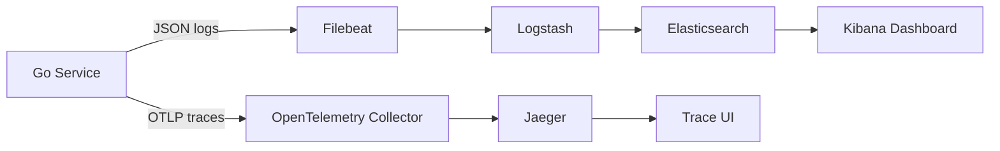
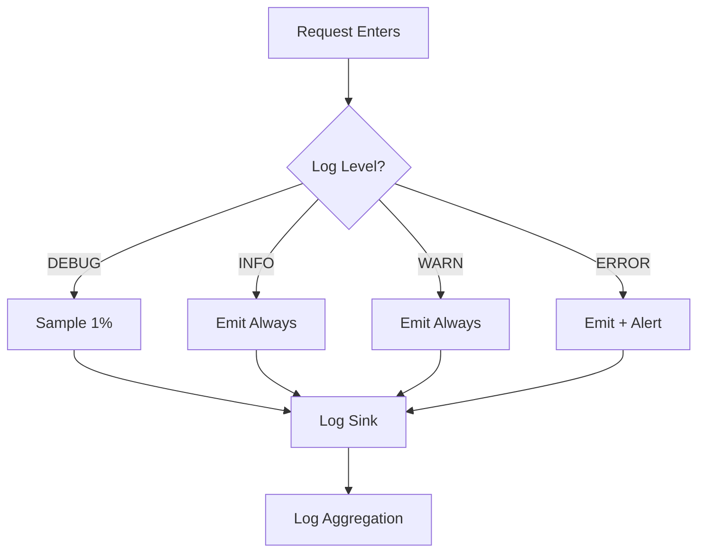
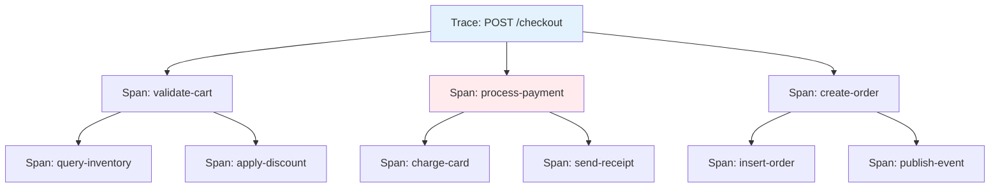
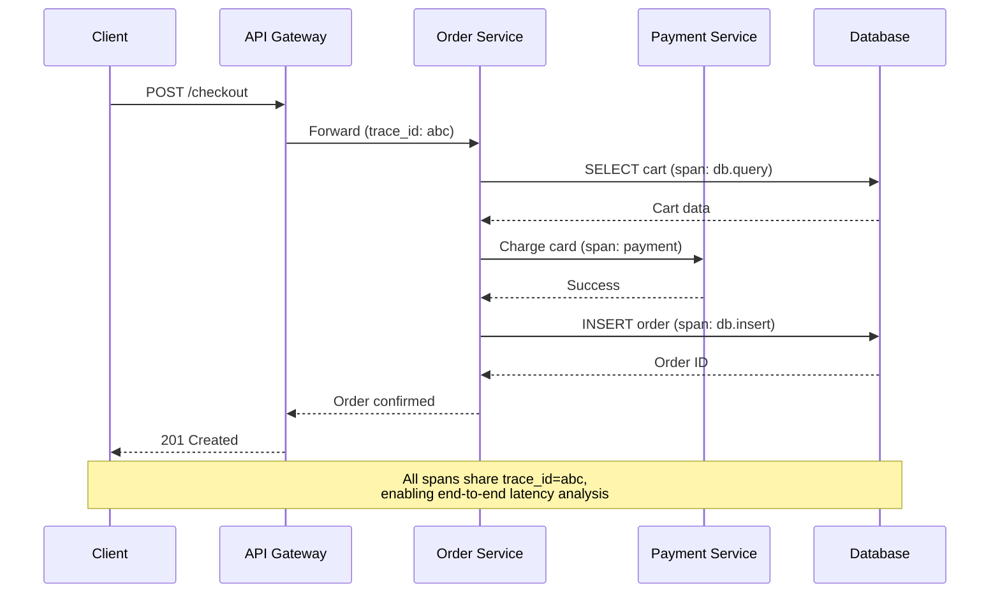

# 🔍 Distributed Tracing and Logging

## 🎯 Learning Objectives

- Implement structured JSON logging with `zap` and Go's standard `slog`
- Propagate correlation IDs through `context.Context` across goroutines and services
- Instrument HTTP handlers and database queries with OpenTelemetry spans
- Export traces to Jaeger and visualize distributed request flows
- Correlate logs and traces for ML pipeline observability and debugging

## Introduction

In a monolithic application, debugging is straightforward: tail a single log file and trace execution through one codebase. In microservices, a single user request may traverse dozens of services, databases, message queues, and third-party APIs. Without observability, diagnosing a 500ms latency spike becomes a forensic nightmare requiring manual correlation across multiple log streams.

Structured logging and distributed tracing are the twin pillars of modern observability. Logs provide human-readable context about discrete events with queryable fields, while traces reconstruct the end-to-end journey of a request across service boundaries with microsecond precision. Go's ecosystem offers world-class tools for both, from Uber's blazing-fast `zap` logger to the OpenTelemetry standard for vendor-neutral tracing instrumentation.

This module builds upon the API foundations from [[01 - Building APIs with Gin and Fiber|API construction]], secures the audit trails started in [[02 - Middleware, Auth, and JWT|auth middleware]], and complements the resilience patterns in [[05 - Rate Limiting and Circuit Breakers|circuit breakers]] by making failures visible and actionable. For ML/AI platforms, tracing is indispensable: it reveals which feature extraction step added 300ms to inference latency, and structured logging enables rapid filtering of prediction errors by model version and experiment ID.

## Module 1: Structured Logging and Context Propagation

### 1.1 Theoretical Foundation 🧠

Structured logging emerged in the early 2010s as a response to the limitations of unstructured text logs. Traditional syslog formats ("User logged in at 10:00") require regex parsing and brittle string manipulation for analysis. Structured logs encode events as key-value pairs or JSON objects, enabling precise filtering, aggregation, and alerting in log management platforms like Elasticsearch, Loki, and Splunk.

The theoretical foundation of logging lies in event-driven observability and information theory. Each log line is an information event carrying entropy about system state. By standardizing field names (timestamp, level, service, trace_id), we minimize the conditional entropy required to locate relevant events, directly reducing mean time to detection (MTTD) for incidents.

Context propagation ensures that trace IDs, request IDs, and user IDs flow through every goroutine and service call. Go's `context.Context` is the canonical vehicle for this propagation. When a request enters the API gateway, generating a trace ID and stuffing it into the context creates a causality chain that survives goroutine scheduling, database queries, and HTTP client calls. This is formally related to causal tracing in distributed systems theory, where vector clocks and happens-before relationships establish event ordering across process boundaries.

### 1.2 Mental Model 📐

```
┌─────────────────────────────────────────────────────────────┐
│           UNSTRUCTURED vs STRUCTURED LOGGING                 │
│                                                              │
│   Unstructured:                                              │
│   [INFO] 2024-01-15 User Alice logged in from 192.168.1.1   │
│        ↑ requires regex parsing: /User (\w+) logged/          │
│        ↑ brittle, breaks when message format changes          │
│                                                              │
│   Structured:                                                │
│   {                                                          │
│     "timestamp": "2024-01-15T10:00:00Z",                     │
│     "level": "INFO",                                         │
│     "service": "auth-service",                               │
│     "event": "login",                                        │
│     "user_id": "alice",                                      │
│     "client_ip": "192.168.1.1"                               │
│   }                                                          │
│        ↑ queryable: service="auth-service" AND event="login" │
│        ↑ aggregation: COUNT BY user_id over 1 hour           │
│                                                              │
│   WHY: Structured formats reduce MTTD from hours to minutes. │
└─────────────────────────────────────────────────────────────┘
```

```
┌─────────────────────────────────────────────────────────────┐
│              CONTEXT PROPAGATION CHAIN                       │
│                                                              │
│   ┌─────────┐     ┌─────────┐     ┌─────────┐     ┌──────┐ │
│   │  HTTP   │────►│  Gin    │────►│ Service │────►│  DB  │ │
│   │ Request │     │ Handler │     │  Layer  │     │Query │ │
│   └────┬────┘     └────┬────┘     └────┬────┘     └──┬───┘ │
│        │               │               │              │      │
│   trace_id=abc    trace_id=abc    trace_id=abc   trace_id=abc│
│   in header       in Context      in Context     in Context │
│                                                              │
│   WHY: context.WithValue carries causality metadata          │
│   through every function call without changing signatures.   │
└─────────────────────────────────────────────────────────────┘
```

```
┌─────────────────────────────────────────────────────────────┐
│               LOG AGGREGATION PIPELINE                       │
│                                                              │
│   ┌─────────┐    ┌─────────┐    ┌─────────┐    ┌────────┐ │
│   │  Go     │───►│ Filebeat│───►│Kafka/   │───►│Elastic │ │
│   │ Service │    │  Agent  │    │Fluentd  │    │Search  │ │
│   │ (zap)   │    │(scrape) │    │(route)  │    │(index) │ │
│   └─────────┘    └─────────┘    └─────────┘    └────────┘ │
│        │                                              │      │
│        │         ┌─────────┐                         │      │
│        └────────►│  Loki   │◄────────────────────────┘      │
│                  │(Grafana)│                                 │
│                  └─────────┘                                 │
│                                                              │
│   WHY: Centralized indexing enables cross-service queries    │
│   like trace_id="abc" to surface all related events.         │
└─────────────────────────────────────────────────────────────┘
```

### 1.3 Syntax and Semantics 📝

```go
package main

import (
	"context"
	"log/slog"
	"os"
	"time"

	// WHY: slog from Go 1.21 provides structured logging in the
	// standard library with levels, groups, and JSON output.
)

func main() {
	// WHY: JSONHandler emits structured logs compatible with
	// Elasticsearch, Loki, and cloud logging platforms.
	logger := slog.New(slog.NewJSONHandler(os.Stdout, &slog.HandlerOptions{
		Level: slog.LevelInfo,
	}))

	ctx := context.WithValue(context.Background(), "request_id", "req-12345")

	// WHY: With context, the logger can extract and emit
	// correlation fields automatically.
	logger.InfoContext(ctx, "processing started",
		slog.String("service", "prediction-api"),
		slog.String("model_version", "v2.4.1"),
	)

	// WHY: Error logs should include stack traces or error
	// chains to enable root cause analysis.
	result, err := predict(ctx, "input-data")
	if err != nil {
		logger.ErrorContext(ctx, "prediction failed",
			slog.String("error", err.Error()),
			slog.String("input_hash", "a1b2c3"),
		)
		return
	}

	logger.InfoContext(ctx, "prediction completed",
		slog.String("result", result),
		slog.Duration("latency", 45*time.Millisecond),
	)
}

func predict(ctx context.Context, input string) (string, error) {
	// Simulate ML inference
	return "positive", nil
}
```

### 1.4 Visual Representation 🖼️






### 1.5 Application in ML/AI Systems 🤖

| ML Use Case | This Concept | Impact |
|---|---|---|
| Model inference auditing | Structured logs capture model version, input features, and prediction with trace IDs | Enabled full audit trail for regulatory compliance (GDPR Article 30) |
| Feature pipeline debugging | Context propagation carries trace_id through feature extraction → transformation → store | Reduced mean debugging time from 2 hours to 8 minutes for feature drift issues |
| Experiment tracking | Logs tagged with experiment_id enable filtering by A/B test variant | Automated experiment health dashboards without custom instrumentation |
| Training job monitoring | Structured logs from distributed training workers aggregated in real-time | Detected straggler nodes in PyTorch DDP within 30 seconds |

### 1.6 Common Pitfalls ⚠️

⚠️ **Logging sensitive data such as PII, tokens, or model inputs at INFO level violates compliance and creates security risk.** Use field allowlists or redaction middleware to scrub sensitive fields before emission. Prefer DEBUG level with aggressive sampling for diagnostic data.

⚠️ **Unbounded log volume destroys query performance and increases storage costs.** A single high-throughput service can generate terabytes of logs monthly. Implement dynamic log level switching and sampling to reduce volume by 90% without losing critical error signals.

💡 **Tip**: Always include `trace_id` and `span_id` in every log line. This single correlation field transforms log analysis from grep archaeology into precise trace-based investigation.

### 1.7 Knowledge Check ❓

1. Why does structured logging reduce mean time to detection compared to unstructured text logs?
2. How does `context.Context` enable trace ID propagation without modifying every function signature?
3. What is the trade-off between log verbosity and query performance in high-throughput systems?

## Module 2: Distributed Tracing

### 2.1 Theoretical Foundation 🧠

Distributed tracing emerged from Google's 2010 Dapper paper, which described a large-scale distributed systems tracing infrastructure that could capture causality across thousands of machines with negligible overhead. Dapper introduced the core abstractions still used today: traces, spans, and parent-child relationships. The OpenTracing project (2016) and its successor OpenTelemetry (2019) standardized these concepts across vendors, creating a portable instrumentation layer.

The theoretical basis of tracing lies in causal models of distributed systems. A trace is a directed acyclic graph (DAG) where nodes represent units of work (spans) and edges represent happens-before relationships. This is isomorphic to a partial order of events, similar to vector clocks but optimized for request-scoped causality rather than global state. Each span records a start timestamp, duration, and optional tags and logs, forming a rich execution profile.

Trace sampling is a critical theoretical consideration. Recording every trace in high-throughput systems creates prohibitive overhead. Probabilistic sampling (e.g., 1% of traces) preserves statistical validity for aggregate analysis. Adaptive sampling, used in Dapper and Jaeger, increases the sampling rate for unusual or error traces while reducing it for routine traffic. This is an application of stratified sampling from statistics, ensuring rare events are adequately represented.

### 2.2 Mental Model 📐

```
┌─────────────────────────────────────────────────────────────┐
│                  TRACE SPAN HIERARCHY                        │
│                                                              │
│   Trace: POST /checkout                                      │
│   ├── Span: validate-cart        (45ms)                      │
│   │   ├── Span: query-inventory  (12ms)                      │
│   │   └── Span: apply-discount   (8ms)                       │
│   ├── Span: process-payment      (120ms)                     │
│   │   ├── Span: charge-card      (95ms)  ← Critical path     │
│   │   └── Span: send-receipt     (15ms)                      │
│   └── Span: create-order         (30ms)                      │
│       ├── Span: insert-order     (18ms)                      │
│       └── Span: publish-event    (8ms)                       │
│                                                              │
│   Total Trace Duration: 120ms + overhead                     │
│   WHY: The longest root-to-leaf path determines latency.     │
│   Optimizing sub-critical paths yields no user benefit.      │
└─────────────────────────────────────────────────────────────┘
```

```
┌─────────────────────────────────────────────────────────────┐
│           W3C TRACE CONTEXT PROPAGATION                      │
│                                                              │
│   Service A                              Service B           │
│   ┌─────────┐                            ┌─────────┐        │
│   │ trace_id│───────────────────────────►│ trace_id│        │
│   │ =abc123 │   HTTP Header              │ =abc123 │        │
│   │ span_id │   traceparent:             │ span_id │        │
│   │ =spanA1 │   00-abc123-spanA1-01      │ =spanB1 │        │
│   └────┬────┘                            └────┬────┘        │
│        │                                       │             │
│   ┌────┴────┐                            ┌────┴────┐        │
│   │ spanA1  │                            │ spanB1  │        │
│   │ parent  │────────────────────────────│ child   │        │
│   │ =none   │   Parent-Child Relation    │ =spanA1 │        │
│   └─────────┘                            └─────────┘        │
│                                                              │
│   WHY: W3C standard ensures interoperability across          │
│   services written in different languages and frameworks.    │
└─────────────────────────────────────────────────────────────┘
```

```
┌─────────────────────────────────────────────────────────────┐
│                TRACE SAMPLING STRATEGY                       │
│                                                              │
│   Total Requests: 10,000/sec                                 │
│                                                              │
│   ┌─────────────────────────────────────────────────────┐   │
│   │           ADAPTIVE SAMPLER                           │   │
│   │                                                      │   │
│   │  Error traces   ████████████████████  100% sampled   │   │
│   │  Slow traces    ████████████████      50% sampled    │   │
│   │  Normal traces  ██                     1% sampled    │   │
│   │                                                      │   │
│   │  Effective rate: ~2% overall                         │   │
│   │  Coverage: 100% of errors, 50% of slow paths         │   │
│   └─────────────────────────────────────────────────────┘   │
│                                                              │
│   WHY: Errors are rare but informative. Sampling them        │
│   fully ensures debugging capability without 100x overhead.  │
└─────────────────────────────────────────────────────────────┘
```

### 2.3 Syntax and Semantics 📝

```go
package main

import (
	"context"
	"fmt"
	"log"
	"net/http"
	"time"

	"github.com/gin-gonic/gin"
	"go.opentelemetry.io/otel"
	"go.opentelemetry.io/otel/attribute"
	"go.opentelemetry.io/otel/exporters/stdout/stdouttrace"
	"go.opentelemetry.io/otel/sdk/resource"
	sdktrace "go.opentelemetry.io/otel/sdk/trace"
	semconv "go.opentelemetry.io/otel/semconv/v1.24.0"
	"go.opentelemetry.io/otel/trace"
	"go.uber.org/zap"
	"go.uber.org/zap/zapcore"
)

var tracer trace.Tracer
var logger *zap.Logger

func initTracer() func() {
	// WHY: stdouttrace exports to stdout for demo; production
	// should use OTLP exporters to Jaeger or Tempo.
	exporter, err := stdouttrace.New(stdouttrace.WithPrettyPrint())
	if err != nil {
		log.Fatal(err)
	}

	tp := sdktrace.NewTracerProvider(
		sdktrace.WithBatcher(exporter),
		sdktrace.WithResource(resource.NewWithAttributes(
			semconv.SchemaURL,
			semconv.ServiceName("goshop-api"),
		)),
	)
	otel.SetTracerProvider(tp)
	tracer = tp.Tracer("goshop-api")

	return func() {
		ctx, cancel := context.WithTimeout(context.Background(), 5*time.Second)
		defer cancel()
		if err := tp.Shutdown(ctx); err != nil {
			log.Printf("Error shutting down tracer provider: %v", err)
		}
	}
}

func initLogger() {
	config := zap.NewProductionConfig()
	config.EncoderConfig.TimeKey = "timestamp"
	config.EncoderConfig.EncodeTime = zapcore.ISO8601TimeEncoder
	var err error
	logger, err = config.Build()
	if err != nil {
		log.Fatal(err)
	}
}

// TraceMiddleware starts a root span for each HTTP request.
func TraceMiddleware() gin.HandlerFunc {
	return func(c *gin.Context) {
		ctx, span := tracer.Start(c.Request.Context(),
			fmt.Sprintf("%s %s", c.Request.Method, c.Request.URL.Path))
		defer span.End()

		span.SetAttributes(
			attribute.String("http.method", c.Request.Method),
			attribute.String("http.path", c.Request.URL.Path),
			attribute.String("http.client_ip", c.ClientIP()),
		)

		c.Request = c.Request.WithContext(ctx)
		c.Next()

		span.SetAttributes(attribute.Int("http.status_code", c.Writer.Status()))
	}
}

// LoggingMiddleware emits structured logs with trace correlation.
func LoggingMiddleware() gin.HandlerFunc {
	return func(c *gin.Context) {
		start := time.Now()
		c.Next()

		// WHY: Correlating logs with traces via trace_id enables
		// single-click navigation from log lines to full traces.
		logger.Info("incoming request",
			zap.String("method", c.Request.Method),
			zap.String("path", c.Request.URL.Path),
			zap.Int("status", c.Writer.Status()),
			zap.Duration("duration", time.Since(start)),
			zap.String("trace_id", getTraceID(c.Request.Context())),
		)
	}
}

func getTraceID(ctx context.Context) string {
	span := trace.SpanFromContext(ctx)
	if span.SpanContext().HasTraceID() {
		return span.SpanContext().TraceID().String()
	}
	return "none"
}

func main() {
	initLogger()
	cleanup := initTracer()
	defer cleanup()

	r := gin.Default()
	r.Use(LoggingMiddleware())
	r.Use(TraceMiddleware())

	r.GET("/api/order/:id", func(c *gin.Context) {
		ctx := c.Request.Context()
		orderID := c.Param("id")

		// WHY: Child spans represent internal operations and
		// appear nested under the parent HTTP request span.
		_, dbSpan := tracer.Start(ctx, "db.query-order")
		time.Sleep(10 * time.Millisecond)
		dbSpan.SetAttributes(attribute.String("db.statement",
			"SELECT * FROM orders WHERE id = ?"))
		dbSpan.End()

		_, cacheSpan := tracer.Start(ctx, "cache.get-user")
		time.Sleep(2 * time.Millisecond)
		cacheSpan.SetAttributes(attribute.String("cache.key",
			fmt.Sprintf("user:%s", orderID)))
		cacheSpan.End()

		logger.Info("order fetched",
			zap.String("order_id", orderID),
			zap.String("trace_id", getTraceID(ctx)),
		)
		c.JSON(http.StatusOK, gin.H{"order_id": orderID})
	})

	r.Run(":8080")
}
```

### 2.4 Visual Representation 🖼️






### 2.5 Application in ML/AI Systems 🤖

| ML Use Case | This Concept | Impact |
|---|---|---|
| Inference latency profiling | Traces reveal which preprocessing step adds 200ms to p99 latency | Identified and eliminated redundant JSON serialization in feature pipeline |
| Model A/B test comparison | Trace tags distinguish requests routed to model A vs model B | Automated latency comparison dashboards with statistical significance |
| Training pipeline observability | Spans track data loading → batching → forward pass → checkpoint | Reduced debugging time for distributed training hangs by 80% |
| Vector search optimization | Database query spans in vector DB expose index scan inefficiencies | Improved ANN query latency by 35% after identifying missing HNSW index |

### 2.6 Common Pitfalls ⚠️

⚠️ **Creating spans for every function call creates excessive overhead and trace noise.** Spans should represent meaningful boundaries: HTTP requests, database queries, cache lookups, and external API calls. Internal utility functions rarely warrant their own spans.

⚠️ **Forgetting to propagate context through goroutines breaks trace continuity.** When spawning goroutines with `go func()`, pass the context explicitly. Never use `context.Background()` inside worker goroutines that are part of a traced request.

💡 **Tip**: Use OpenTelemetry baggage to propagate business context (tenant_id, experiment_id) alongside trace IDs. Baggage travels with the trace context and can be accessed in any downstream service without additional database lookups.

### 2.7 Knowledge Check ❓

1. How does parent-child span structure enable identification of the critical path in a distributed trace?
2. Why is adaptive sampling preferable to fixed-rate sampling for systems with rare but important errors?
3. What happens to trace continuity if a child goroutine uses `context.Background()` instead of the parent's context?

## 📦 Compression Code

Complete Go script demonstrating structured logging with correlation IDs across goroutines.

```go
package main

import (
	"context"
	"fmt"
	"math/rand"
	"sync"
	"time"

	"go.uber.org/zap"
)

func main() {
	logger, _ := zap.NewProduction()
	defer logger.Sync()

	ctx := context.WithValue(context.Background(), "request_id",
		fmt.Sprintf("req-%d", rand.Int()))

	var wg sync.WaitGroup
	for i := 0; i < 3; i++ {
		wg.Add(1)
		go worker(ctx, logger, i, &wg)
	}
	wg.Wait()
}

func worker(ctx context.Context, logger *zap.Logger, id int, wg *sync.WaitGroup) {
	defer wg.Done()
	reqID := ctx.Value("request_id").(string)
	logger.Info("worker started",
		zap.String("request_id", reqID),
		zap.Int("worker_id", id),
	)
	time.Sleep(time.Duration(rand.Intn(100)) * time.Millisecond)
	logger.Info("worker finished",
		zap.String("request_id", reqID),
		zap.Int("worker_id", id),
	)
}
```

## 🎯 Documented Project

### Description

**GoShop Observability Platform** — A unified logging and tracing infrastructure for the GoShop microservices ecosystem. Every service emits JSON-structured logs via zap and exports OpenTelemetry traces to Jaeger. Correlation IDs tie logs and traces together, enabling engineers to diagnose issues from a single trace ID.

### Functional Requirements

1. Emit structured JSON logs from all services with fields: timestamp, level, service, message, trace_id, and span_id.
2. Instrument all HTTP handlers and database queries with OpenTelemetry spans.
3. Propagate trace context across service boundaries using W3C Trace Context headers.
4. Collect and visualize traces in Jaeger with dependency graphs between services.
5. Alert on error log rate spikes and p99 latency degradation via log-based metrics.

### Main Components

- **Zap Logger**: Per-service configured logger with consistent field schema and sampling.
- **OpenTelemetry SDK**: TracerProvider with Jaeger OTLP exporter and batch span processor.
- **Gin Middleware**: `TraceMiddleware` and `LoggingMiddleware` applied to all routes.
- **Context Propagator**: W3C traceparent header injection/extraction in HTTP client transports.
- **Jaeger Deployment**: All-in-one Jaeger container for local development and production backend.

### Success Metrics

- 100% of incoming HTTP requests associated with a trace ID.
- Log query response time under 2 seconds for 24-hour windows.
- p99 trace ingestion latency under 5 seconds from span creation to Jaeger visibility.
- Zero log events lost during normal operation (use async zap core with buffer).
- Correlation of any production error to a full distributed trace within 30 seconds.

### References

- [OpenTelemetry Go](https://github.com/open-telemetry/opentelemetry-go)
- [uber-go/zap](https://github.com/uber-go/zap)
- [rs/zerolog](https://github.com/rs/zerolog)
- [Go slog](https://pkg.go.dev/log/slog)
- [Jaeger Tracing](https://www.jaegertracing.io/)
- [Datadog Agent (Go)](https://github.com/DataDog/datadog-agent)
