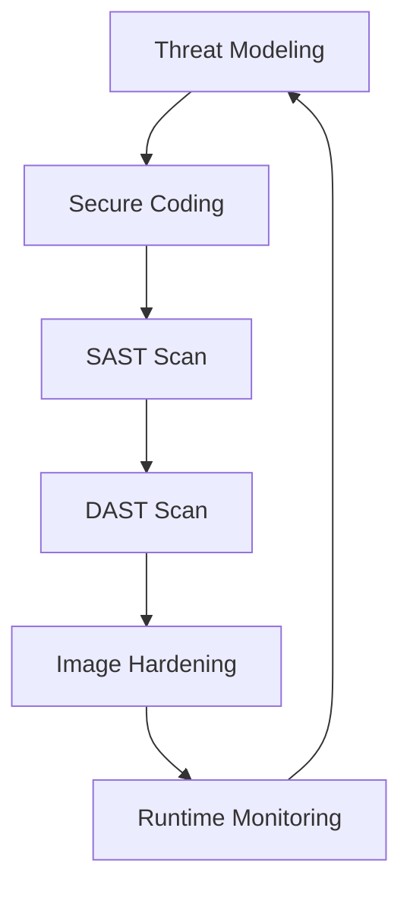
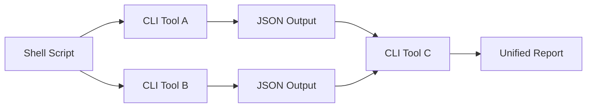

# 🛡️ Welcome to DevSecOps and CLI Tools

## 🎯 Learning Objectives

By the end of this course, you will be able to:
- Design hierarchical command-line interfaces using the Cobra framework with persistent flags and subcommands.
- Integrate static analysis, dependency scanning, and secret detection into Go workflows.
- Build GitHub Actions pipelines that lint, test, cross-compile, and deploy Go binaries.
- Assemble a production-grade DevSecOps CLI tool that unifies scanning and deployment automation.
## Introduction

Modern machine learning and artificial intelligence systems do not exist in isolation. They require robust infrastructure for training, deployment, monitoring, and security. The command-line interface remains the universal control plane for MLOps pipelines, infrastructure automation, and security scanning. When a data scientist triggers a model training job on Kubernetes, when an ML engineer deploys a new inference endpoint, or when a security auditor scans a model registry for vulnerabilities, they interact through CLI tools.

Go has become the de facto language for building these tools because it compiles to static binaries, starts instantly, and handles concurrency with goroutines. The practices you will learn in [[01 - Building CLIs with Cobra|CLI design]], [[02 - Security Scanning and Hardening|security scanning]], and [[03 - CI-CD Pipelines for Go Projects|CI/CD automation]] directly apply to building the tooling that powers modern AI platforms.
This module introduces the DevSecOps lifecycle as it applies to Go projects. You will learn why shifting security left, automating quality gates, and designing CLI-first tools are essential practices for building the infrastructure that supports machine learning systems at scale.
## Module 1: The DevSecOps Lifecycle

### 1.1 Theoretical Foundation 🧠

DevSecOps emerged from the DevOps movement as a response to the realization that security cannot be a final gate before production. The theoretical foundation rests on three principles: continuous integration of security feedback, automated compliance verification, and shared responsibility across development, operations, and security teams.

The shift-left philosophy argues that defects become exponentially more expensive to fix the later they are discovered. For Go projects, this translates to running `gosec`, `go vet`, and dependency scanners before every merge.

### 1.2 Mental Model 📐

```
┌─────────────────────────────────────────────────────────────┐
│                    DEVSECOPS FEEDBACK LOOP                  │
├─────────────────────────────────────────────────────────────┤
│                                                             │
│   ┌──────────┐    ┌──────────┐    ┌──────────┐            │
│   │  PLAN    │───→│  CODE    │───→│  BUILD   │            │
│   └──────────┘    └──────────┘    └────┬─────┘            │
│        ↑                               │                    │
│        │                               ↓                    │
│   ┌────┴────┐    ┌──────────┐    ┌──────────┐            │
│   │ OPERATE │←───│ DEPLOY   │←───│  TEST    │            │
│   └─────────┘    └──────────┘    └──────────┘            │
│                                                             │
│   ╔═════════════════════════════════════════════════════╗  │
│   ║  SECURITY: Scan → Harden → Monitor → Respond → Scan ║  │
│   ╚═════════════════════════════════════════════════════╝  │
│                                                             │
└─────────────────────────────────────────────────────────────┘
```

Security is not a phase but a continuous thread woven through every stage.

### 1.3 Syntax and Semantics 📝

The following Go program demonstrates a minimal security gate pattern.

```go
package main

import (
	"fmt"
	"os"
)

// SecureOperation performs a sensitive action only after
// validating the SECURITY_GATE environment variable.
// WHY: Environment-based gates allow CI/CD systems to
// disable dangerous operations in untrusted branches.
func SecureOperation() error {
	gate := os.Getenv("SECURITY_GATE")
	if gate != "enabled" {
		return fmt.Errorf("security gate disabled")
	}
	fmt.Println("Sensitive operation executed under audit.")
	return nil
}

func main() {
	if err := SecureOperation(); err != nil {
		fmt.Fprintf(os.Stderr, "Blocked: %v\n", err)
		os.Exit(1)
	}
}
```

### 1.4 Visual Representation 🖼️




The DevOps infinity loop visualizes how security must be embedded at every transition point.

### 1.5 Application in ML/AI Systems 🤖

| Organization | Use Case | DevSecOps Practice | Outcome |
|---|---|---|---|
| OpenAI | Model training pipeline | CLI tools for cluster job orchestration | Secure, reproducible experiments |
| Google DeepMind | Research infrastructure | Automated security scanning in CI | Zero leaked credentials in 2023 |
| Netflix | ML feature store | Hardened Go microservices in containers | 99.99% availability for inference |
| Hugging Face | Model registry | Dependency scanning on every upload | Early detection of malicious packages |
### 1.6 Common Pitfalls ⚠️

⚠️ **Warning:** Treating security as a separate team responsibility creates bottlenecks. When security reviews happen only before release, teams accumulate weeks of technical debt.
⚠️ **Warning:** Relying solely on manual code review for security misses systemic issues. A reviewer might catch a SQL injection but miss a vulnerable transitive dependency.
💡 **Tip:** Start every project with a `Makefile` target called `security` that runs `go vet`, `gosec`, and `go mod verify` in sequence.

### 1.7 Knowledge Check ❓

1. Why does the shift-left philosophy argue for detecting vulnerabilities during development rather than before release?
2. Name three stages of the DevSecOps lifecycle where automated scanning can be inserted.
3. How does Go's compilation model (single static binary) make it particularly suitable for CLI security tools?
## Module 2: CLI-First Infrastructure Automation

### 2.1 Theoretical Foundation 🧠

The CLI-first approach to infrastructure automation predates modern DevOps. In the 1970s, Unix philosophy established the principle that programs should do one thing well and communicate through text streams. Tools like `kubectl`, `docker`, and `terraform` all expose CLI interfaces that compose together through pipes and scripts.

In the context of ML/AI systems, CLI-first design enables reproducible experiments through shell scripts and Makefile targets. A data scientist can version-control not just model code but the exact sequence of CLI invocations that produced a training run. This reproducibility is a security property because it allows auditors to verify that a deployed model was trained with approved data and hyperparameters.

### 2.2 Mental Model 📐

```
┌─────────────────────────────────────────────────────────────┐
│              GO DEVSECOPS TOOLCHAIN                         │
├─────────────────────────────────────────────────────────────┤
│                                                             │
│  ┌─────────────┐  ┌─────────────┐  ┌─────────────┐        │
│  │   Docker    │  │ Kubernetes  │  │  Terraform  │        │
│  │  (written   │  │  (written   │  │  (providers │        │
│  │   in Go)    │  │   in Go)    │  │  in Go)     │        │
│  └──────┬──────┘  └──────┬──────┘  └──────┬──────┘        │
│         │                │                │                 │
│         └────────────────┼────────────────┘                 │
│                          ↓                                  │
│              ┌─────────────────────┐                        │
│              │   YOUR GO CLI TOOL  │                        │
│              │  secops-cli scan    │                        │
│              │  secops-cli deploy  │                        │
│              └─────────────────────┘                        │
│                                                             │
└─────────────────────────────────────────────────────────────┘
```

### 2.3 Syntax and Semantics 📝

The following Go program reads a YAML configuration file for an ML training job and validates required fields.

```go
package main

import (
	"fmt"
	"os"
	"gopkg.in/yaml.v3"
)

// TrainingConfig represents an ML job specification.
// WHY: Struct tags allow unmarshaling from YAML while
// maintaining Go's type safety for validation.
type TrainingConfig struct {
	ModelName string `yaml:"model_name"`
	Dataset   string `yaml:"dataset"`
	Epochs    int    `yaml:"epochs"`
}

func main() {
	data, err := os.ReadFile("train.yaml")
	if err != nil {
		fmt.Fprintf(os.Stderr, "cannot read config: %v\n", err)
		os.Exit(1)
	}
	var cfg TrainingConfig
	if err := yaml.Unmarshal(data, &cfg); err != nil {
		fmt.Fprintf(os.Stderr, "invalid YAML: %v\n", err)
		os.Exit(1)
	}
	if cfg.ModelName == "" || cfg.Dataset == "" || cfg.Epochs <= 0 {
		fmt.Fprintln(os.Stderr, "missing required fields")
		os.Exit(1)
	}
	fmt.Printf("Valid config for model %s\n", cfg.ModelName)
}
```

### 2.4 Visual Representation 🖼️




The Unix philosophy of small composable tools directly inspired modern CLI design.

### 2.5 Application in ML/AI Systems 🤖

| Tool | Domain | CLI Pattern | Security Benefit |
|---|---|---|---|
| `kubectl` | Kubernetes orchestration | Verb + resource + flags | RBAC enforcement, audit logging |
| `docker` | Container management | Command + subcommand | Image scanning, capability dropping |
| `aws` | Cloud resource provisioning | Service + operation | IAM policy validation |
| `dvc` | Data versioning for ML | Pipeline stage tracking | Reproducible data lineage |
### 2.6 Common Pitfalls ⚠️

⚠️ **Warning:** Designing CLIs that require interactive prompts breaks automation. Always support flags and environment variables as non-interactive alternatives.
⚠️ **Warning:** Outputting unstructured text instead of JSON or YAML makes it impossible for CI/CD systems to parse results programmatically.
💡 **Tip:** Follow the `kubectl` pattern of `verb-noun` consistently across all subcommands.

### 2.7 Knowledge Check ❓

1. Why is CLI composition through text streams a security-relevant property for ML pipeline reproducibility?
2. What are the advantages of using structured output (JSON) over plain text in automation scripts?
3. Describe how a CLI tool can validate an ML configuration before triggering expensive compute resources.

## 📦 Compression Code

```go
package main

import (
	"archive/tar"
	"compress/gzip"
	"io"
	"os"
	"path/filepath"
)

func compressDir(source, target string) error {
	out, _ := os.Create(target)
	defer out.Close()
	gw := gzip.NewWriter(out)
	defer gw.Close()
	tw := tar.NewWriter(gw)
	defer tw.Close()
	return filepath.Walk(source, func(file string, fi os.FileInfo, err error) error {
		if err != nil { return err }
		header, _ := tar.FileInfoHeader(fi, file)
		header.Name = filepath.ToSlash(file)
		tw.WriteHeader(header)
		if !fi.IsDir() {
			f, _ := os.Open(file)
			defer f.Close()
			io.Copy(tw, f)
		}
		return nil
	})
}
```

## 🎯 Documented Project

### Description

Build `secops-cli`, a production-grade DevSecOps CLI tool unifying Cobra CLI design, security scanning, CI/CD template generation, and containerized deployment.

### Functional Requirements

1. `secops-cli scan dockerfile <path>` — analyze Dockerfiles for security issues.
2. `secops-cli sast <path>` — run static analysis and report in SARIF format.
3. `secops-cli template ci --provider=github` — generate CI/CD YAML templates.
4. `secops-cli metrics` — export Prometheus-compatible metrics.
5. Package in a distroless container and automate releases with GoReleaser.

### Main Components

- `cmd/root.go`, `cmd/scan.go`, `cmd/sast.go`, `cmd/template.go`, `cmd/metrics.go`
- `pkg/scanner/` — Dockerfile security rule engine
- `pkg/sast/` — AST-based Go analyzer
- `pkg/report/` — SARIF and JSON report generators
- `.github/workflows/release.yml` — GoReleaser pipeline
- `Dockerfile` — Multi-stage distroless build

### Success Metrics

- All commands produce automatic `--help` text via Cobra
- Scanning detects 80% of planted vulnerabilities in test files
- Generated CI templates pass `yamllint` validation
- Metrics endpoint exposes valid Prometheus format
- Releases are signed and built for Linux, macOS, and Windows
- Container passes `docker scan` without a shell

### References

- [Cobra GitHub Repository](https://github.com/spf13/cobra)
- [GoReleaser Documentation](https://goreleaser.com/)
- [SARIF Specification](https://sarifweb.azurewebsites.net/)
- [Distroless Container Images](https://github.com/GoogleContainerTools/distroless)
- [Prometheus Exposition Formats](https://prometheus.io/docs/instrumenting/exposition_formats/)
