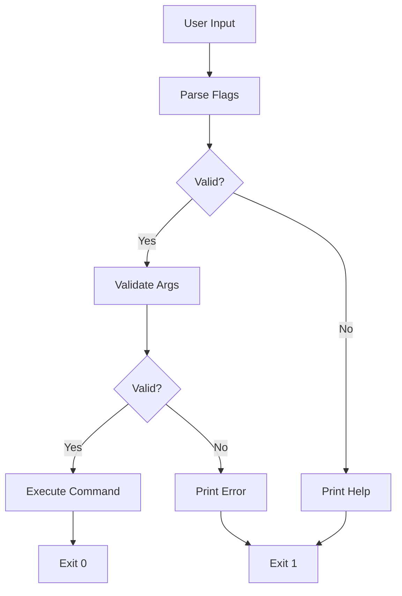
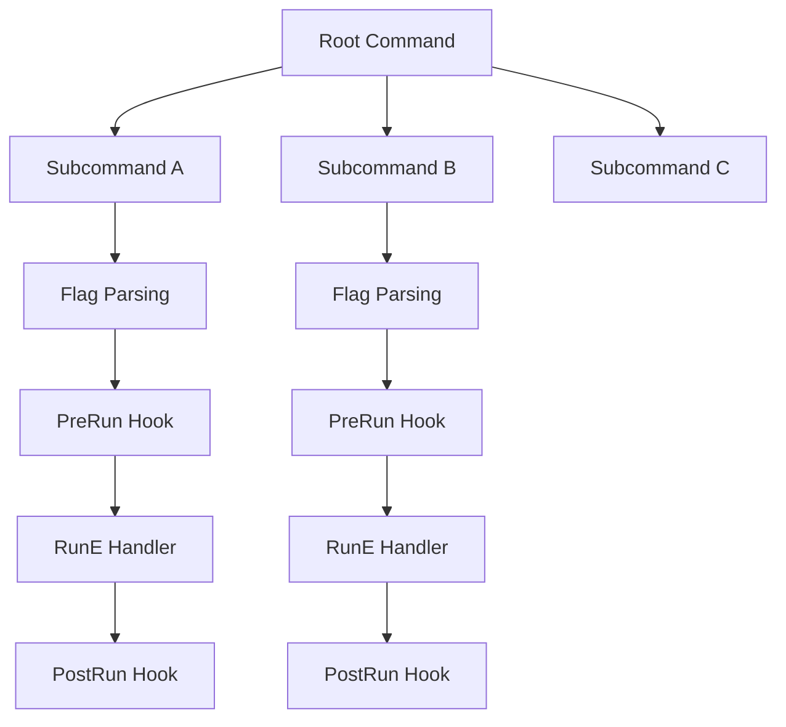
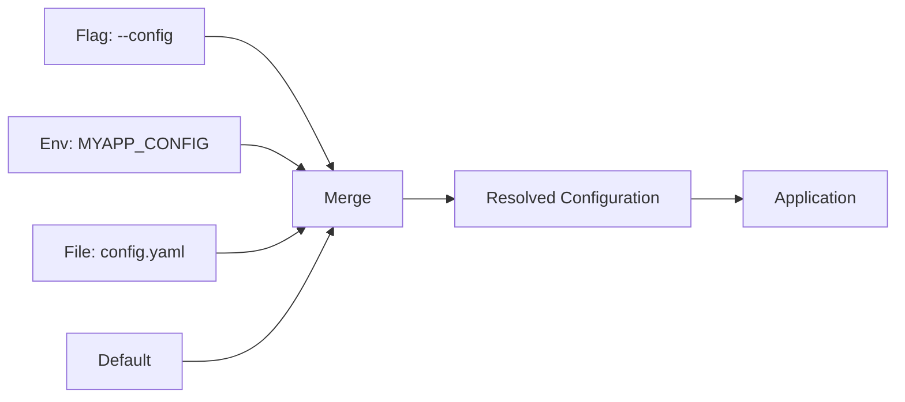

# ⌨️ Building CLIs with Cobra

## 🎯 Learning Objectives

By the end of this module, you will be able to:
- Design hierarchical CLI structures using commands, subcommands, flags, and arguments.
- Implement CLI tools with the Cobra framework including persistent flags and pre/post-run hooks.
- Integrate Viper for configuration management across environment variables, config files, and flags.
- Generate shell completion scripts and auto-generated help text.
- Build a complete Go CLI project with multiple subcommands and shared configuration.

## Introduction

Command-line interfaces are the primary control plane for machine learning operations. When a data scientist schedules a distributed training job, when an ML engineer deploys a model to production, or when a platform administrator audits resource usage, they use CLI tools. The design quality of these tools directly impacts the velocity and safety of ML/AI systems.

In the Go ecosystem, CLI design is not merely about parsing flags. It is about creating intuitive command hierarchies, discoverable help systems, and composable subcommands that scale from simple scripts to complex platforms like [[00 - Welcome|Kubernetes]] and Docker. This module explores CLI design patterns and the Cobra framework, the de facto standard for building professional CLIs in Go. Understanding these patterns is essential before moving into [[02 - Security Scanning and Hardening|security automation]] and [[03 - CI-CD Pipelines for Go Projects|CI/CD tooling]], where the tools you build will be invoked from automated pipelines that require structured output and predictable exit codes.

The skills you develop here apply directly to MLOps. Tools like `kubectl`, `docker`, and `dvc` all follow the patterns you will learn. By mastering CLI design in Go, you gain the ability to build the custom tooling that bridges the gap between research environments and production ML platforms.

## Module 1: CLI Design Patterns and User Experience

### 1.1 Theoretical Foundation 🧠

The study of command-line interfaces dates back to the 1960s with the development of CTSS and Multics at MIT. The Unix shell, created by Ken Thompson in 1971, established the foundational grammar of modern CLIs: commands, flags, and arguments. This grammar was formalized in the POSIX utility conventions, which specify that options begin with a hyphen, arguments follow options, and `--` terminates option processing.

CLI usability research has shown that developers prefer tools with consistent naming, progressive disclosure of complexity, and clear error messages. The cognitive load of a CLI can be modeled as the product of its structural complexity: commands, flags, and configuration sources. As this number grows, the need for structured help generation, configuration management, and validation increases exponentially. Cobra addresses this by enforcing conventions that make complex tools feel simple.

### 1.2 Mental Model 📐

```
┌─────────────────────────────────────────────────────────────┐
│                 CLI COMMAND HIERARCHY                       │
├─────────────────────────────────────────────────────────────┤
│                                                             │
│                        mycli                                │
│                         │                                   │
│         ┌───────────────┼───────────────┐                  │
│         │               │               │                   │
│      create           delete            get                  │
│         │               │               │                   │
│    ┌────┴────┐          │          ┌────┴────┐            │
│    │         │          │          │         │             │
│  user     project    user      user      logs             │
│                                                             │
│  mycli create user --name=alice                             │
│  mycli delete user alice                                    │
│  mycli get logs --tail=100                                  │
│                                                             │
└─────────────────────────────────────────────────────────────┘
```

This tree structure shows how a well-designed CLI organizes functionality. Users navigate from the root tool to a verb and then to a noun.

### 1.3 Syntax and Semantics 📝

The following Go program demonstrates a minimal CLI using the standard `flag` package.

```go
package main

import (
	"flag"
	"fmt"
	"os"
)

// WHY: Using flag package demonstrates the primitives
// that higher-level frameworks like Cobra encapsulate.
func main() {
	// WHY: Define flags with types to prevent parsing errors.
	name := flag.String("name", "", "Name of the resource")
	verbose := flag.Bool("verbose", false, "Enable verbose output")
	flag.Parse()

	// WHY: Validate required flags explicitly because the
	// standard flag package does not support required flags.
	if *name == "" {
		fmt.Fprintln(os.Stderr, "Error: --name is required")
		flag.Usage()
		os.Exit(1)
	}

	if *verbose {
		fmt.Printf("Creating resource: %s\n", *name)
	}
	fmt.Println("Done.")
}
```

### 1.4 Visual Representation 🖼️




The CLI execution flow demonstrates how parsing, validation, and execution form a decision tree.

### 1.5 Application in ML/AI Systems 🤖

| Tool | Command Pattern | ML/AI Use Case | Design Strength |
|---|---|---|---|
| `kubectl apply -f` | Verb + resource + file | Deploy training pods | Consistent across all resources |
| `docker run` | Verb + image + flags | Launch inference containers | Extensive flag ecosystem |
| `dvc push` | Verb + remote | Upload model artifacts | Simple, pipeline-oriented |
| `mlflow run` | Verb + experiment | Execute training script | URI-based project specification |
| `aws s3 cp` | Service + verb + args | Move datasets to S3 | Mirrors Unix cp semantics |

### 1.6 Common Pitfalls ⚠️

⚠️ **Warning:** Avoid creating subcommand hierarchies deeper than three levels. Usability studies show that developers struggle to remember paths like `tool service config set --key=x`.
⚠️ **Warning:** Using positional arguments for optional values leads to ambiguity. Prefer flags for optional parameters and positional arguments only for required, ordered inputs.
💡 **Tip:** Use `kubectl` as your mental model. Its pattern of `kubectl <action> <resource> <name>` is one of the most studied CLI designs in production systems.

### 1.7 Knowledge Check ❓

1. Why does the POSIX standard recommend `--` to terminate option processing?
2. What is the difference between a flag and an argument in CLI grammar?
3. Explain why deep subcommand hierarchies reduce usability in automation scripts.

## Module 2: The Cobra Framework Architecture

### 2.1 Theoretical Foundation 🧠

Cobra was created by Steve Francia in 2013 as a reaction to the proliferation of ad-hoc CLI tools in the Go ecosystem. It was designed to provide a structured, object-oriented approach to CLI construction. The framework is built around the `Command` struct, which encapsulates all metadata and behavior for a single CLI operation. This design mirrors the Command pattern from the Gang of Four design patterns, where operations are represented as objects that can be parameterized, queued, and logged.

Cobra's theoretical contribution is the unification of command hierarchies, flag parsing, and help generation into a single declarative API. Before Cobra, Go developers typically combined the `flag` package with custom routing logic, resulting in inconsistent behavior across projects. Cobra enforces conventions such as automatic help generation, consistent flag parsing, and shell completion, which reduce the cognitive load for both developers and users.

### 2.2 Mental Model 📐

```
┌─────────────────────────────────────────────────────────────┐
│                  COBRA COMMAND STRUCT                       │
├─────────────────────────────────────────────────────────────┤
│                                                             │
│   ┌─────────────────────────────────────────────┐          │
│   │            cobra.Command                     │          │
│   │  ┌─────────────────────────────────────┐    │          │
│   │  │ Use:        "get"                   │    │          │
│   │  │ Short:      "Get a resource"        │    │          │
│   │  │ Long:       "Detailed description"  │    │          │
│   │  │ RunE:       func(cmd, args) error   │    │          │
│   │  │ PreRunE:    validation hook         │    │          │
│   │  │ PostRunE:   cleanup hook            │    │          │
│   │  │ PersistentFlags: --config, --verbose│    │          │
│   │  │ LocalFlags:      --output, --format │    │          │
│   │  └─────────────────────────────────────┘    │          │
│   └─────────────────────────────────────────────┘          │
│                                                             │
│   Parent Command ──→ Child Commands (subcommands)           │
│   Persistent Flags ──→ Inherited by all descendants         │
│   Local Flags ──→ Only visible to this command              │
│                                                             │
└─────────────────────────────────────────────────────────────┘
```

### 2.3 Syntax and Semantics 📝

The following Go code demonstrates a complete Cobra CLI with root command and subcommands.

```go
package main

import (
	"fmt"
	"os"

	"github.com/spf13/cobra"
)

// WHY: Root command defines the CLI identity and persistent
// flags that propagate to all subcommands.
var rootCmd = &cobra.Command{
	Use:   "gitops-cli",
	Short: "A GitOps deployment manager",
	Long: `gitops-cli generates Kubernetes manifests and
validates deployment configurations for ML pipelines.`,
}

// WHY: Subcommands encapsulate discrete operations. This
// separation allows independent testing and documentation.
var createCmd = &cobra.Command{
	Use:   "create deployment",
	Short: "Generate a Deployment manifest",
	Args:  cobra.MinimumNArgs(1),
	RunE: func(cmd *cobra.Command, args []string) error {
		image, _ := cmd.Flags().GetString("image")
		// WHY: Return errors instead of calling log.Fatal to
		// allow Cobra to print clean error messages and set
		// non-zero exit codes automatically.
		fmt.Printf("Creating deployment for %s with image %s\n", args[0], image)
		return nil
	},
}

func init() {
	// WHY: Persistent flags are available to this command
	// and all its children, ideal for global settings.
	rootCmd.PersistentFlags().String("config", "", "Config file")
	// WHY: Local flags are scoped to a single command,
	// preventing namespace pollution in large CLIs.
	createCmd.Flags().String("image", "nginx:latest", "Container image")
	rootCmd.AddCommand(createCmd)
}

func main() {
	if err := rootCmd.Execute(); err != nil {
		fmt.Println(err)
		os.Exit(1)
	}
}
```

### 2.4 Visual Representation 🖼️




The Cobra execution model shows how each command follows a lifecycle: parse flags, run pre-hooks, execute the handler, and run post-hooks.

### 2.5 Application in ML/AI Systems 🤖

| Organization | CLI Tool | Cobra Feature Used | ML/AI Application |
|---|---|---|---|
| Kubernetes | `kubectl` | 50+ subcommands, persistent flags | Orchestrates ML training clusters |
| Docker | `docker` | Nested subcommands, custom help | Packages model inference containers |
| Hugging Face | `huggingface-cli` | Auth commands, download subcommands | Manages model repository access |
| Weights & Biases | `wandb` | Login, init, sync subcommands | Tracks experiment metrics |
| DVC | `dvc` | Pipeline stage commands | Versions datasets and models |

### 2.6 Common Pitfalls ⚠️

⚠️ **Warning:** Using `Run` instead of `RunE` prevents Cobra from handling errors consistently. Always use `RunE` to return errors and let Cobra manage exit codes.
⚠️ **Warning:** Registering subcommands in `init()` functions without an explicit initialization order can lead to race conditions. Use `cobra.OnInitialize` for shared setup logic.
💡 **Tip:** Generate shell completion scripts with `cmd.GenBashCompletion` or `cmd.GenZshCompletion`. This dramatically improves user experience for complex tools.

### 2.7 Knowledge Check ❓

1. What is the difference between a `PersistentFlag` and a `LocalFlag` in Cobra?
2. Why should you prefer `RunE` over `Run` when implementing Cobra commands?
3. Describe how the Command pattern from the Gang of Four relates to Cobra's design.

## Module 3: Configuration Management with Viper

### 3.1 Theoretical Foundation 🧠

Configuration management is a subfield of software engineering that studies how programs adapt their behavior without code changes. The theoretical foundation includes the principle of configuration precedence, where multiple sources of configuration are merged according to a strict hierarchy. This principle was formalized in the Twelve-Factor App methodology, which mandates that configuration should be stored in environment variables and kept separate from code.

Viper, created by Steve Francia alongside Cobra, implements this theory for Go. It supports JSON, YAML, TOML, HCL, environment variables, and remote configuration stores. The precedence order is: explicit flag > environment variable > config file > default value. This hierarchy ensures that local development settings can be overridden for testing or production without modifying source code.

### 3.2 Mental Model 📐

```
┌─────────────────────────────────────────────────────────────┐
│              VIPER CONFIGURATION PRECEDENCE                 │
├─────────────────────────────────────────────────────────────┤
│                                                             │
│   ┌─────────────────────────────────────────────────────┐  │
│   │  1. EXPLICIT FLAG (highest priority)                │  │
│   │     --learning-rate=0.001                           │  │
│   ├─────────────────────────────────────────────────────┤  │
│   │  2. ENVIRONMENT VARIABLE                            │  │
│   │     MYAPP_LEARNING_RATE=0.001                       │  │
│   ├─────────────────────────────────────────────────────┤  │
│   │  3. CONFIGURATION FILE                              │  │
│   │     config.yaml: learning_rate: 0.001               │  │
│   ├─────────────────────────────────────────────────────┤  │
│   │  4. DEFAULT VALUE (lowest priority)                 │  │
│   │     viper.SetDefault("learning_rate", 0.01)         │  │
│   └─────────────────────────────────────────────────────┘  │
│                                                             │
│   viper.GetString("learning_rate") → "0.001"               │
│                                                             │
└─────────────────────────────────────────────────────────────┘
```

### 3.3 Syntax and Semantics 📝

The following Go program demonstrates Cobra integration with Viper for configuration management.

```go
package main

import (
	"fmt"
	"os"

	"github.com/spf13/cobra"
	"github.com/spf13/viper"
)

var cfgFile string

var rootCmd = &cobra.Command{
	Use:   "mlops-cli",
	Short: "ML pipeline orchestrator",
}

func init() {
	cobra.OnInitialize(initConfig)

	// WHY: Persistent flags defined on root are inherited
	// by all subcommands, providing a global override mechanism.
	rootCmd.PersistentFlags().StringVar(&cfgFile, "config", "", "config file")
	rootCmd.PersistentFlags().String("learning-rate", "0.01", "Training learning rate")
	rootCmd.PersistentFlags().Int("epochs", 10, "Number of training epochs")

	// WHY: Bind flags to Viper keys so that explicit flags
	// override environment variables and config files.
	_ = viper.BindPFlag("learning_rate", rootCmd.PersistentFlags().Lookup("learning-rate"))
	_ = viper.BindPFlag("epochs", rootCmd.PersistentFlags().Lookup("epochs"))

	viper.SetEnvPrefix("MLOPS")
	viper.AutomaticEnv()
}

func initConfig() {
	if cfgFile != "" {
		viper.SetConfigFile(cfgFile)
	} else {
		viper.AddConfigPath(".")
		viper.SetConfigName("mlops")
	}
	// WHY: Ignore errors from ReadInConfig because Viper
	// can fall back to defaults and environment variables.
	_ = viper.ReadInConfig()
}

var trainCmd = &cobra.Command{
	Use:   "train",
	Short: "Run a training job",
	Run: func(cmd *cobra.Command, args []string) {
		lr := viper.GetFloat64("learning_rate")
		epochs := viper.GetInt("epochs")
		fmt.Printf("Training with lr=%.4f for %d epochs\n", lr, epochs)
	},
}

func init() {
	rootCmd.AddCommand(trainCmd)
}

func main() {
	if err := rootCmd.Execute(); err != nil {
		fmt.Println(err)
		os.Exit(1)
	}
}
```

### 3.4 Visual Representation 🖼️




The configuration merge process demonstrates how Viper resolves conflicting values.

### 3.5 Application in ML/AI Systems 🤖

| Platform | Configuration Source | Viper Feature | ML/AI Context |
|---|---|---|---|
| Kubeflow | YAML pipeline definitions | `viper.SetConfigFile` | Training pipeline parameters |
| MLflow | Environment variables | `viper.AutomaticEnv` | Tracking server URI |
| Ray | JSON cluster config | `viper.SetConfigType` | Resource allocation per worker |
| Airflow | INI config files | `viper.SupportedExts` | DAG scheduling parameters |
| SageMaker | Hyperparameters | `viper.BindPFlag` | CLI overrides for training jobs |

### 3.6 Common Pitfalls ⚠️

⚠️ **Warning:** Forgetting to call `viper.BindPFlag` means that explicit CLI flags will not override config file values, leading to confusing behavior.
⚠️ **Warning:** Using `viper.GetString` for numeric values that may contain underscores causes parsing failures because Viper's string getter does not interpret numeric formats.
💡 **Tip:** Always set explicit defaults with `viper.SetDefault` before reading configuration. This ensures that required values have sensible fallbacks and documents the expected types.

### 3.7 Knowledge Check ❓

1. List the four configuration sources in Viper's precedence hierarchy from highest to lowest priority.
2. Why is it important to call `viper.BindPFlag` after defining a Cobra flag?
3. How does the Twelve-Factor App methodology influence Viper's design for environment variable support?

## 📦 Compression Code

```go
package main

import (
	"archive/tar"
	"compress/gzip"
	"fmt"
	"io"
	"os"
	"path/filepath"
)

func compressDir(source, target string) error {
	out, err := os.Create(target)
	if err != nil {
		return err
	}
	defer out.Close()
	gw := gzip.NewWriter(out)
	defer gw.Close()
	tw := tar.NewWriter(gw)
	defer tw.Close()
	return filepath.Walk(source, func(file string, fi os.FileInfo, err error) error {
		if err != nil {
			return err
		}
		header, err := tar.FileInfoHeader(fi, file)
		if err != nil {
			return err
		}
		header.Name = filepath.ToSlash(file)
		if err := tw.WriteHeader(header); err != nil {
			return err
		}
		if !fi.IsDir() {
			f, err := os.Open(file)
			if err != nil {
				return err
			}
			defer f.Close()
			_, err = io.Copy(tw, f)
			return err
		}
		return nil
	})
}

func main() {
	if err := compressDir("./dist", "./release.tar.gz"); err != nil {
		fmt.Println("Error:", err)
	} else {
		fmt.Println("Compressed successfully.")
	}
}
```

## 🎯 Documented Project

### Description

Build `gitops-cli`, a command-line tool for managing GitOps-style deployments. The tool supports creating deployment manifests, validating Kubernetes YAML, and syncing cluster state through subcommands.

### Functional Requirements

1. Implement `gitops-cli create deployment --image= --replicas=<n>` to generate valid Kubernetes Deployment YAML.
2. Implement `gitops-cli validate <file>` to check YAML syntax and required fields using a PreRun hook.
3. Implement `gitops-cli sync --context=<ctx>` to output a simulated sync command for the given Kubernetes context.
4. Support a persistent `--config` flag to load default values from a YAML file using Viper.
5. Auto-generate shell completion scripts via `gitops-cli completion bash`.

### Main Components

- `cmd/root.go` — Root command with persistent flags and Viper initialization
- `cmd/create.go` — Subcommand for manifest generation with local flags
- `cmd/validate.go` — Subcommand with PreRun validation hook
- `cmd/sync.go` — Subcommand with argument parsing for context selection
- `pkg/manifest/` — Library for Kubernetes YAML construction

### Success Metrics

- All commands produce `--help` text automatically without manual maintenance
- Flags work consistently across subcommands via persistent flag inheritance
- Configuration file overrides default values, and environment variables override files
- CLI passes `cobra.Command` validation for required args and flags
- Completion script works in Bash and Zsh without errors

### References

- [Cobra GitHub Repository](https://github.com/spf13/cobra)
- [Viper GitHub Repository](https://github.com/spf13/viper)
- [Kubernetes kubectl Command Reference](https://kubernetes.io/docs/reference/kubectl/)
- [CLI Guidelines by Axiom](https://clig.dev/)
