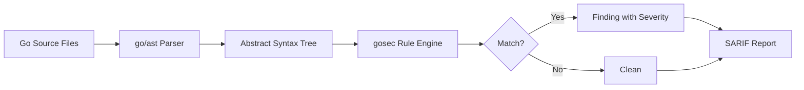
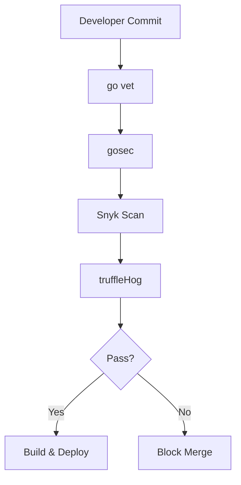
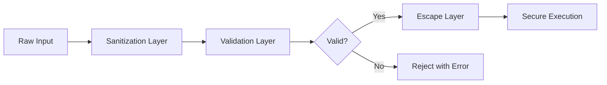

# 🔒 Security Scanning and Hardening

## 🎯 Learning Objectives

By the end of this module, you will be able to:
- Run static application security testing (SAST) on Go code using industry-standard tools.
- Identify and mitigate dependency vulnerabilities through automated scanning.
- Detect leaked secrets and credentials in source code and commit history.
- Apply secure coding patterns in Go to prevent common vulnerability classes.
- Integrate security scans into Makefile targets and CI/CD pipelines.

## Introduction

Security in software engineering is no longer a final gate before release. It is a continuous practice embedded in every commit, build, and deployment. For machine learning and artificial intelligence systems, this principle is even more critical. ML models often process sensitive personal data, proprietary research, and high-value intellectual property. A vulnerable dependency in a data preprocessing pipeline or a leaked API key in a training script can lead to model theft, data poisoning, or adversarial attacks.

For Go applications, security means combining static analysis, dependency auditing, secret detection, and secure coding patterns into a unified workflow. This module explores how to harden Go codebases from the inside out. The practices covered here directly support [[03 - CI-CD Pipelines for Go Projects|CI/CD integration]] and container hardening. Without scanning and hardening, even a well-architected Go binary can leak secrets, ship vulnerable dependencies, or expose unsafe system calls. Understanding these layers allows you to quantify and reduce risk systematically in the infrastructure that powers AI platforms.

## Module 1: Static Application Security Testing

### 1.1 Theoretical Foundation 🧠

Static Application Security Testing (SAST) has its roots in compiler research and formal program analysis. The theoretical foundation is data-flow analysis, a technique for tracking how values propagate through a program. Early work by Frances Allen and John Cocke at IBM in the 1970s established the mathematical basis for control-flow and data-flow graphs. Modern SAST tools build abstract syntax trees (ASTs) from source code and traverse them to identify patterns that correlate with vulnerabilities.

In Go, SAST is particularly effective because the language's type system and explicit error handling reduce false positives compared to dynamically typed languages. Tools like `gosec` parse the Go AST using the standard library's `go/ast` package, then apply a rule engine to detect issues such as hardcoded credentials, SQL injection risks, unsafe pointer usage, and weak cryptography.

### 1.2 Mental Model 📐

```
┌─────────────────────────────────────────────────────────────┐
│              SAST ANALYSIS PIPELINE                         │
├─────────────────────────────────────────────────────────────┤
│                                                             │
│   ┌──────────┐    ┌──────────┐    ┌──────────┐            │
│   │  Source  │───→│    AST   │───→│   Rules  │            │
│   │   Code   │    │  Parser  │    │  Engine  │            │
│   └──────────┘    └────┬─────┘    └────┬─────┘            │
│                        │                │                    │
│                        ↓                ↓                    │
│              ┌─────────────────────────────────┐             │
│              │      Control Flow Graph         │             │
│              │  ┌─────┐    ┌─────┐    ┌─────┐ │             │
│              │  │ A   │───→│ B   │───→│ C   │ │             │
│              │  └─────┘    └─────┘    └─────┘ │             │
│              └─────────────────────────────────┘             │
│                        │                                    │
│                        ↓                                    │
│              ┌─────────────────────────────────┐             │
│              │      Findings Report            │             │
│              │  G101: Hardcoded credentials    │             │
│              │  G201: SQL injection risk       │             │
│              └─────────────────────────────────┘             │
│                                                             │
└─────────────────────────────────────────────────────────────┘
```

### 1.3 Syntax and Semantics 📝

The following Go program contains intentional vulnerabilities that `gosec` would flag.

```go
package insecure

import (
	"crypto/md5"
	"database/sql"
	"fmt"
	"os/exec"
)

// UnsafeQuery demonstrates SQL injection risk.
// WHY: String concatenation in SQL queries allows attackers
// to inject malicious SQL. gosec flags this as G201.
func UnsafeQuery(db *sql.DB, userInput string) {
	query := "SELECT name FROM users WHERE id = " + userInput
	_ = query
}

// WeakHash demonstrates weak cryptography.
// WHY: MD5 is cryptographically broken and should never
// be used for security-sensitive operations. gosec flags G401.
func WeakHash(data string) string {
	h := md5.Sum([]byte(data))
	return fmt.Sprintf("%x", h)
}

// UnsafeExec demonstrates command injection.
// WHY: Passing user input directly to exec.Command creates
// a command injection vulnerability. gosec flags G204.
func UnsafeExec(userInput string) {
	_ = exec.Command("sh", "-c", userInput)
}

// HardcodedToken demonstrates credential leakage.
// WHY: Embedding secrets in source code exposes them in
// version control. gosec flags G101 for high-entropy strings.
func HardcodedToken() string {
	return "sk-1234567890abcdef1234567890abcdef"
}
```

### 1.4 Visual Representation 🖼️




The SAST workflow transforms human-readable source code into a structured tree that a rule engine can inspect programmatically.

### 1.5 Application in ML/AI Systems 🤖

| Organization | Tool | Finding | ML/AI Impact |
|---|---|---|---|
| Cloudflare | gosec | Unsafe deserialization | Model serving API compromise |
| OpenAI | semgrep | Hardcoded API keys | Training infrastructure breach |
| Google | go vet | Incorrect error handling | Data pipeline silent failures |
| Netflix | custom SAST | Weak random number generation | Reproducibility attacks on models |
| Hugging Face | dependency scan | Vulnerable PyTorch/TensorFlow | Model poisoning via supply chain |

### 1.6 Common Pitfalls ⚠️

⚠️ **Warning:** SAST tools produce false positives. A flagged `G204` (command injection) might be a legitimate use of `exec.Command` with validated input. Always review findings manually before suppressing rules.
⚠️ **Warning:** Running SAST only on the main branch misses vulnerabilities introduced in feature branches. Integrate scanning into pull request checks to catch issues before merge.
💡 **Tip:** Run `gosec` with `-fmt sarif` to generate reports compatible with GitHub Advanced Security and other SARIF consumers.

### 1.7 Knowledge Check ❓

1. Why is Go's static type system advantageous for SAST compared to dynamically typed languages?
2. What is the difference between a false positive and a false negative in the context of security scanning?
3. Name three vulnerability classes that `gosec` can detect through AST pattern matching.

## Module 2: Dependency and Secret Scanning

### 2.1 Theoretical Foundation 🧠

Dependency scanning is rooted in graph theory. A Go module's dependency graph is a directed acyclic graph (DAG) where nodes represent modules and edges represent version constraints. The theoretical challenge is the "diamond dependency problem": if module A depends on B and C, and both B and C depend on D but at different versions, the dependency resolver must choose a single version of D that satisfies all constraints. Go uses minimal version selection (MVS), an algorithm designed by Russ Cox, which selects the minimum version that satisfies all requirements.

Secret scanning is based on information theory and pattern matching. High-entropy strings—sequences with high Shannon entropy—are statistical indicators of randomly generated secrets like API keys and passwords. Tools like `truffleHog` calculate the entropy of substrings and flag those that exceed a threshold.

### 2.2 Mental Model 📐

```
┌─────────────────────────────────────────────────────────────┐
│           DEPENDENCY GRAPH AND SCANNING                     │
├─────────────────────────────────────────────────────────────┤
│                                                             │
│                    myapp v1.0.0                             │
│                     /        \                              │
│                    /          \                             │
│              lib-a v1.2     lib-b v2.0                      │
│                    \          /                             │
│                     \        /                              │
│                    common v1.5                              │
│                      │                                      │
│                      ↓                                      │
│              ┌───────────────┐                              │
│              │  VULNERABLE   │                              │
│              │    CVE-2024   │                              │
│              └───────────────┘                              │
│                                                             │
│   gosec:     AST pattern matching on source code            │
│   Snyk:      CVE database lookup on go.mod                  │
│   truffleHog: Entropy analysis on commit history            │
│                                                             │
└─────────────────────────────────────────────────────────────┘
```

### 2.3 Syntax and Semantics 📝

The following Go program demonstrates how to audit a `go.mod` file for modules with known vulnerabilities.

```go
package main

import (
	"bufio"
	"fmt"
	"os"
	"regexp"
	"strings"
)

// VulnDB is a mock vulnerability database.
// WHY: Real scanners use APIs like OSV or NVD, but the
// pattern of parsing go.mod and cross-referencing versions
// remains identical.
var VulnDB = map[string]string{
	"github.com/old/lib": "CVE-2024-1234: buffer overflow",
}

// ScanGoMod reads a go.mod file and reports known vulnerabilities.
// WHY: Dependency scanning starts with parsing the module
// graph to identify exact versions that may be affected.
func ScanGoMod(path string) error {
	f, err := os.Open(path)
	if err != nil {
		return err
	}
	defer f.Close()

	re := regexp.MustCompile(`^\s*([^/][^\s]+)\s+v?([\d\.]+)`)
	scanner := bufio.NewScanner(f)
	for scanner.Scan() {
		line := scanner.Text()
		if strings.HasPrefix(line, "require") || strings.HasPrefix(line, "\t") {
			matches := re.FindStringSubmatch(line)
			if len(matches) == 3 {
				mod, ver := matches[1], matches[2]
				if vuln, ok := VulnDB[mod]; ok {
					fmt.Printf("⚠️  %s@%s: %s\n", mod, ver, vuln)
				}
			}
		}
	}
	return scanner.Err()
}

func main() {
	if err := ScanGoMod("go.mod"); err != nil {
		fmt.Println("Error:", err)
	}
}
```

### 2.4 Visual Representation 🖼️




The security scanning pipeline shows how multiple tools form a defense-in-depth strategy.

### 2.5 Application in ML/AI Systems 🤖

| Scanning Type | Tool | Detects | ML/AI Relevance |
|---|---|---|---|
| Dependency Vulnerabilities | Snyk | Known CVEs in go.mod | Vulnerable ML serving libraries |
| Dependency Vulnerabilities | Dependabot | GitHub advisory DB matches | Automated fixes for model code |
| Secret Leaks | git-secrets | AWS keys, passwords in commits | Cloud training credentials |
| Secret Leaks | truffleHog | High-entropy strings | API keys for model registries |
| Secret Leaks | GitHub Secret Scanning | Partner token patterns | Inference endpoint tokens |

### 2.6 Common Pitfalls ⚠️

⚠️ **Warning:** Ignoring transitive dependencies is dangerous. A vulnerability in a dependency-of-a-dependency is still a vulnerability in your attack surface. Use `go mod graph` to visualize the full tree.
⚠️ **Warning:** Secret scanners cannot detect secrets that were committed before the scanner was enabled. Run historical scans with `truffleHog --since-commit` when onboarding a new repository.
💡 **Tip:** Add `go mod verify` to your CI pipeline. It checks that the content of downloaded modules matches the cryptographic hashes in `go.sum`, preventing supply-chain substitution attacks.

### 2.7 Knowledge Check ❓

1. How does Go's Minimal Version Selection algorithm improve reproducibility and security compared to traditional dependency resolution?
2. Why is high Shannon entropy a useful heuristic for detecting randomly generated secrets?
3. What is the difference between a direct dependency and a transitive dependency in a `go.mod` file?

## Module 3: Secure Coding Patterns in Go

### 3.1 Theoretical Foundation 🧠

Secure coding patterns are defensive programming techniques validated by decades of vulnerability research. The theoretical basis includes the principle of least privilege, which states that a program should operate with the minimum permissions necessary to complete its task. In Go, this translates to dropping capabilities in containers, validating all inputs against allowlists, and avoiding unsafe packages unless absolutely necessary.

Another theoretical pillar is fail-safe defaults. Every access decision should default to denial, and explicit permission should be required for access. In Go, this means checking errors immediately, validating configuration before use, and using secure defaults for cryptographic parameters. The language's explicit error handling (`if err != nil`) is actually a security feature because it forces developers to consider failure modes rather than silently swallowing exceptions.

### 3.2 Mental Model 📐

```
┌─────────────────────────────────────────────────────────────┐
│           SECURE INPUT VALIDATION FLOW                      │
├─────────────────────────────────────────────────────────────┤
│                                                             │
│   User Input                                                │
│        │                                                    │
│        ↓                                                    │
│   ┌─────────────┐                                           │
│   │  Sanitize   │───→ Remove null bytes, control chars     │
│   └──────┬──────┘                                           │
│          ↓                                                  │
│   ┌─────────────┐                                           │
│   │  Validate   │───→ Length check, charset allowlist       │
│   └──────┬──────┘                                           │
│          ↓                                                  │
│   ┌─────────────┐                                           │
│   │   Escape    │───→ Parameterize queries, encode output   │
│   └──────┬──────┘                                           │
│          ↓                                                  │
│   ┌─────────────┐                                           │
│   │   Execute   │───→ Perform operation with safe data      │
│   └─────────────┘                                           │
│                                                             │
└─────────────────────────────────────────────────────────────┘
```

### 3.3 Syntax and Semantics 📝

The following Go program demonstrates secure patterns for token generation, database queries, and file operations.

```go
package secure

import (
	"crypto/rand"
	"crypto/subtle"
	"database/sql"
	"encoding/hex"
	"fmt"
	"os"
	"path/filepath"
	"strings"
)

// GenerateSecureToken creates a cryptographically secure random token.
// WHY: crypto/rand uses the operating system's entropy pool,
// which is suitable for session tokens and API keys. math/rand
// is predictable and must never be used for security.
func GenerateSecureToken(length int) (string, error) {
	b := make([]byte, length)
	if _, err := rand.Read(b); err != nil {
		return "", err
	}
	return hex.EncodeToString(b), nil
}

// SafeQuery uses parameterized queries to prevent SQL injection.
// WHY: The database driver handles escaping automatically,
// eliminating the risk of injection regardless of input content.
func SafeQuery(db *sql.DB, userID string) (*sql.Rows, error) {
	return db.Query("SELECT name FROM users WHERE id = ?", userID)
}

// SafeCompare performs constant-time string comparison.
// WHY: Standard string comparison short-circuits on mismatch,
// leaking timing information. subtle.ConstantTimeCompare
// prevents timing attacks on password or token verification.
func SafeCompare(a, b string) bool {
	return subtle.ConstantTimeCompare([]byte(a), []byte(b)) == 1
}

// SafeOpenFile validates a path before opening.
// WHY: Path traversal attacks exploit unsanitized file paths.
// This function rejects paths containing directory traversal.
func SafeOpenFile(baseDir, filename string) (*os.File, error) {
	clean := filepath.Clean(filename)
	if strings.Contains(clean, "..") {
		return nil, fmt.Errorf("invalid path")
	}
	return os.Open(filepath.Join(baseDir, clean))
}
```

### 3.4 Visual Representation 🖼️




The defense-in-depth model for input handling shows how multiple layers of protection are required.

### 3.5 Application in ML/AI Systems 🤖

| Vulnerability | Secure Pattern | ML/AI Application | Tool |
|---|---|---|---|
| SQL Injection | Parameterized queries | Model metadata databases | `database/sql` |
| Weak cryptography | `crypto/rand`, `x/crypto` | API key generation | `gosec G401` |
| Timing attacks | `subtle.ConstantTimeCompare` | Token verification in inference APIs | Custom audit |
| Path traversal | `filepath.Clean` + validation | Model artifact storage | `gosec G304` |
| Command injection | Allowlist validation | External script execution | `gosec G204` |

### 3.6 Common Pitfalls ⚠️

⚠️ **Warning:** Using `math/rand` instead of `crypto/rand` for security-sensitive operations is a critical vulnerability. `math/rand` is deterministic and predictable.
⚠️ **Warning:** Ignoring error return values with the blank identifier `_` can mask security failures. If a permission check errors but is ignored, the operation may proceed insecurely.
💡 **Tip:** Use `golangci-lint` with the `gosec` linter enabled to automatically catch unsafe patterns during development. Add it to your `Makefile` so it runs before every commit.

### 3.7 Knowledge Check ❓

1. Why is `crypto/rand` secure while `math/rand` is not suitable for generating tokens?
2. How does parameterized query execution prevent SQL injection even when user input contains SQL keywords?
3. What is a timing attack, and how does `subtle.ConstantTimeCompare` defend against it?

## 📦 Compression Code

```go
package main

import (
	"bufio"
	"fmt"
	"os"
	"strings"
)

// ScanFileForSecrets reads a file and reports lines matching common secret patterns.
// WHY: A lightweight secret scanner demonstrates the pattern matching
// approach used by tools like git-secrets and truffleHog.
func ScanFileForSecrets(path string) ([]string, error) {
	f, err := os.Open(path)
	if err != nil {
		return nil, err
	}
	defer f.Close()

	var findings []string
	scanner := bufio.NewScanner(f)
	lineNum := 1
	for scanner.Scan() {
		line := strings.ToLower(scanner.Text())
		if strings.Contains(line, "password=") ||
			strings.Contains(line, "api_key=") ||
			strings.Contains(line, "secret=") {
			findings = append(findings, fmt.Sprintf("%s:%d: potential secret", path, lineNum))
		}
		lineNum++
	}
	return findings, scanner.Err()
}

func main() {
	findings, err := ScanFileForSecrets("main.go")
	if err != nil {
		fmt.Println("Error:", err)
		return
	}
	for _, f := range findings {
		fmt.Println(f)
	}
}
```

## 🎯 Documented Project

### Description

Build `go-sentry`, a Go CLI tool that scans a project directory for security issues. It runs `gosec`-style pattern checks, detects high-entropy strings that may be secrets, and produces a JSON report of all findings.

### Functional Requirements

1. Recursively scan `.go` files for dangerous patterns (`exec.Command` with variables, hardcoded credentials, weak crypto imports).
2. Detect potential secrets using entropy calculation on long alphanumeric strings.
3. Output findings as SARIF-compatible JSON for CI ingestion.
4. Support a `--severity` filter to show only high/medium/low issues.
5. Return a non-zero exit code if any high-severity finding is present.

### Main Components

- `cmd/scan.go` — CLI entry point using Cobra with `--path` and `--severity` flags
- `pkg/sast/` — Pattern matching engine for Go AST nodes
- `pkg/secrets/` — Entropy-based secret detector
- `pkg/report/` — SARIF JSON report generator

### Success Metrics

- Detects at least 80% of intentionally planted vulnerable patterns in test files
- Entropy scanner flags strings above 4.5 Shannon entropy
- CI pipeline fails on high-severity findings without manual intervention
- Report is accepted by GitHub Advanced Security SARIF upload

### References

- [gosec GitHub Repository](https://github.com/securego/gosec)
- [OWASP Top 10 for 2021](https://owasp.org/Top10/)
- [SARIF Specification](https://sarifweb.azurewebsites.net/)
- [Cloudflare Blog: Go Security](https://blog.cloudflare.com/tag/go/)
- [semgrep Rules for Go](https://semgrep.dev/explore?language=go)
