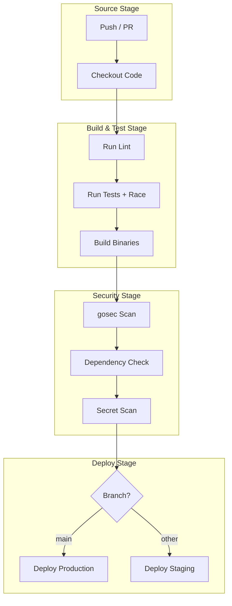
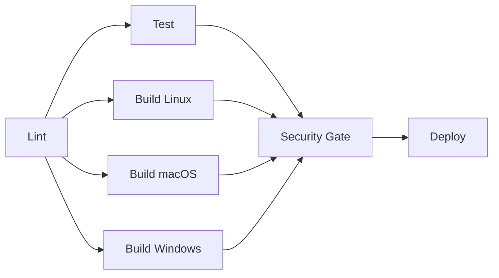
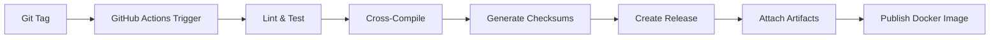

# 🔄 CI-CD Pipelines for Go Projects

## 🎯 Learning Objectives

By the end of this module, you will be able to:
- Design CI/CD pipeline stages tailored for Go projects with caching and matrix builds.
- Implement GitHub Actions workflows that lint, test, build, and deploy Go applications.
- Apply pipeline optimization strategies including module caching and artifact passing.
- Cross-compile Go binaries for multiple operating systems and architectures.
- Integrate security scanning and quality gates into automated pipelines.

## Introduction

Continuous Integration and Continuous Deployment transform software development from a manual, error-prone process into an automated, repeatable pipeline. For machine learning and artificial intelligence systems, CI/CD is not merely a convenience but a necessity. ML pipelines involve data validation, model training, hyperparameter tuning, evaluation, and deployment. Each stage must be reproducible, versioned, and auditable. When a researcher commits a new feature engineering script or an engineer updates a model serving API, the CI/CD pipeline ensures that changes are validated before they reach production.

For Go projects, CI/CD is especially powerful because Go compiles quickly, produces static binaries, and has excellent built-in testing. This module covers how to build pipelines that lint, test, build, scan, and deploy Go applications with confidence. Understanding CI/CD pipelines is essential for integrating the security practices from [[02 - Security Scanning and Hardening|security scanning]] and the automation patterns from GitHub Actions. A well-designed pipeline reduces the lead time from commit to production while maintaining quality gates at every stage, ensuring that the infrastructure supporting ML workloads remains stable and secure.

## Module 1: CI/CD Architecture and Quality Gates

### 1.1 Theoretical Foundation 🧠

The theoretical foundations of CI/CD trace back to the Toyota Production System and lean manufacturing. The concepts of jidoka (autonomation, or automation with a human touch) and kaizen (continuous improvement) were adapted for software by Jez Humble and David Farley in their 2010 book "Continuous Delivery." The key insight is that every commit should be a candidate for production release, and quality should be built into the process rather than inspected at the end.

For Go, this theory manifests in the form of fast feedback loops. Go's compiler is designed to be fast, enabling sub-second compilation for most packages. This means that static analysis, test execution, and binary compilation can all happen within minutes. The theoretical metric that CI/CD optimizes is "lead time for changes," one of the four DORA metrics. Reducing this metric requires parallelization, caching, and eliminating manual approval bottlenecks while maintaining quality gates.

### 1.2 Mental Model 📐

```
┌─────────────────────────────────────────────────────────────┐
│              CI/CD PIPELINE STAGES FOR GO                   │
├─────────────────────────────────────────────────────────────┤
│                                                             │
│   Commit                                                    │
│     │                                                       │
│     ↓                                                       │
│   ┌─────────┐    ┌─────────┐    ┌─────────┐              │
│   │  LINT   │───→│  TEST   │───→│  BUILD  │              │
│   │ go vet  │    │ -race   │    │ cross-  │              │
│   │ golangci│    │ coverage│    │ compile │              │
│   └────┬────┘    └────┬────┘    └────┬────┘              │
│        │              │              │                       │
│        └──────────────┼──────────────┘                       │
│                       ↓                                     │
│              ┌─────────────────┐                            │
│              │  SECURITY GATE  │                            │
│              │ gosec │ snyk    │                            │
│              └────────┬────────┘                            │
│                       ↓                                     │
│              ┌─────────────────┐                            │
│              │  DEPLOY STAGE   │                            │
│              │ staging/prod    │                            │
│              └─────────────────┘                            │
│                                                             │
└─────────────────────────────────────────────────────────────┘
```

### 1.3 Syntax and Semantics 📝

The following Go program demonstrates a minimal pipeline runner that executes stages sequentially.

```go
package main

import (
	"fmt"
	"os"
	"os/exec"
)

// PipelineStage represents a single CI stage.
// WHY: Structuring stages as data enables dynamic pipeline
// construction and parallel execution planning.
type PipelineStage struct {
	Name string
	Cmd  string
	Args []string
}

// Run executes a pipeline stage and returns its success status.
// WHY: Abstracting execution allows for uniform logging,
// timeout handling, and error propagation across all stages.
func (s PipelineStage) Run() error {
	fmt.Printf("=== Running stage: %s ===\n", s.Name)
	cmd := exec.Command(s.Cmd, s.Args...)
	cmd.Stdout = os.Stdout
	cmd.Stderr = os.Stderr
	return cmd.Run()
}

func main() {
	stages := []PipelineStage{
		{Name: "lint", Cmd: "go", Args: []string{"vet", "./..."}},
		{Name: "test", Cmd: "go", Args: []string{"test", "-race", "./..."}},
		{Name: "build", Cmd: "go", Args: []string{"build", "-o", "app", "./cmd/app"}},
	}
	for _, stage := range stages {
		if err := stage.Run(); err != nil {
			fmt.Fprintf(os.Stderr, "Stage %s failed: %v\n", stage.Name, err)
			os.Exit(1)
		}
	}
	fmt.Println("Pipeline completed successfully.")
}
```

### 1.4 Visual Representation 🖼️




The pipeline flowchart shows how stages form a directed acyclic graph. Each stage gates the next, and branching logic at the deploy stage ensures that only validated commits reach production.

### 1.5 Application in ML/AI Systems 🤖

| Organization | Pipeline Feature | ML/AI Application | Outcome |
|---|---|---|---|
| GitHub | Matrix builds across Go versions | Testing ML serving APIs | Compatibility assurance |
| Google | Parallel test execution | Large-scale training job validation | Sub-5 minute feedback |
| Netflix | Artifact caching | Model artifact reproducibility | 90% faster builds |
| OpenAI | Conditional deployment gates | Staged model rollouts | Safe A/B testing |
| Hugging Face | Cross-platform releases | CLI tool distribution | Linux/macOS/Windows binaries |

### 1.6 Common Pitfalls ⚠️

⚠️ **Warning:** Never skip the test stage to save time. Go's race detector (`-race`) catches concurrency bugs that pass normal tests and only manifest under production load.
⚠️ **Warning:** Running `go test` without `-count=1` in CI can produce cached results that hide flaky tests. Always disable caching in automated environments.
💡 **Tip:** Use `go test -race -coverprofile=coverage.out ./...` followed by `go tool cover -func=coverage.out` to enforce coverage thresholds in CI.

### 1.7 Knowledge Check ❓

1. What are the four DORA metrics, and which one does CI/CD primarily optimize?
2. Why is Go's fast compilation advantageous for CI/CD compared to languages with slower build times?
3. What is the purpose of a quality gate in a CI/CD pipeline?

## Module 2: GitHub Actions Workflows for Go

### 2.1 Theoretical Foundation 🧠

GitHub Actions, launched in 2018, is a serverless compute platform for CI/CD that uses event-driven architecture. The theoretical model is based on the actor-model of computation: workflows are triggered by events (actors), jobs are units of work that run in isolated environments, and steps are sequential commands within a job. This model enables declarative pipeline definitions where the platform handles orchestration, scheduling, and resource allocation.

For Go projects, GitHub Actions provides several advantages. The `actions/setup-go` action manages Go toolchain installation across runner images. The `actions/cache` action reduces `go mod download` time by persisting the module cache between runs. Matrix strategies allow testing across multiple Go versions and operating systems in parallel. The theoretical benefit is combinatorial coverage: if you test against 2 Go versions on 3 operating systems, you achieve 6 unique test configurations with no additional manual effort.

### 2.2 Mental Model 📐

```
┌─────────────────────────────────────────────────────────────┐
│           GITHUB ACTIONS WORKFLOW STRUCTURE                 │
├─────────────────────────────────────────────────────────────┤
│                                                             │
│   .github/workflows/ci.yml                                  │
│                                                             │
│   ┌─────────────────────────────────────────────┐          │
│   │  on: [push, pull_request]                   │          │
│   │                                             │          │
│   │  jobs:                                      │          │
│   │    ┌─────────┐  ┌─────────┐  ┌─────────┐  │          │
│   │    │  lint   │  │  test   │  │  build  │  │          │
│   │    │ job     │  │ job     │  │ job     │  │          │
│   │    │ (ubuntu)│  │ (matrix)│  │ (ubuntu)│  │          │
│   │    └───┬─────┘  └───┬─────┘  └───┬─────┘  │          │
│   │        │            │            │          │          │
│   │        └────────────┴────────────┘          │          │
│   │                     │                       │          │
│   │                     ↓                       │          │
│   │              ┌─────────────┐                │          │
│   │              │  security   │                │          │
│   │              │  job        │                │          │
│   │              └──────┬──────┘                │          │
│   │                     ↓                       │          │
│   │              ┌─────────────┐                │          │
│   │              │   deploy    │                │          │
│   │              │   job       │                │          │
│   │              │ (main only) │                │          │
│   │              └─────────────┘                │          │
│   └─────────────────────────────────────────────┘          │
│                                                             │
└─────────────────────────────────────────────────────────────┘
```

### 2.3 Syntax and Semantics 📝

The following Go program simulates a CI pipeline runner that parses a workflow file and executes jobs in dependency order.

```go
package main

import (
	"fmt"
	"os"
)

// Job represents a CI job with dependencies.
// WHY: Modeling jobs as a DAG enables topological sorting
// for parallel execution, which is how GitHub Actions
// determines the execution order of workflow jobs.
type Job struct {
	Name     string
	Needs    []string
	Commands []string
}

// CanRun checks if all dependencies have completed.
// WHY: Explicit dependency tracking prevents race
// conditions and ensures that downstream jobs like
// security scanning only run after build artifacts exist.
func (j Job) CanRun(completed map[string]bool) bool {
	for _, need := range j.Needs {
		if !completed[need] {
			return false
		}
	}
	return true
}

func main() {
	jobs := []Job{
		{Name: "lint", Commands: []string{"golangci-lint run"}},
		{Name: "test", Needs: []string{"lint"}, Commands: []string{"go test ./..."}},
		{Name: "build", Needs: []string{"lint"}, Commands: []string{"go build ./..."}},
		{Name: "security", Needs: []string{"test", "build"}, Commands: []string{"gosec ./..."}},
	}
	completed := make(map[string]bool)
	for len(completed) < len(jobs) {
		for _, job := range jobs {
			if completed[job.Name] {
				continue
			}
			if job.CanRun(completed) {
				fmt.Printf("Running job: %s\n", job.Name)
				completed[job.Name] = true
			}
		}
	}
	fmt.Println("Workflow complete.")
}
```

### 2.4 Visual Representation 🖼️




The parallel job strategy demonstrates how independent jobs run concurrently while dependent jobs wait.

### 2.5 Application in ML/AI Systems 🤖

| Platform | GitHub Actions Feature | ML/AI Use Case | Benefit |
|---|---|---|---|
| GitHub | `actions/cache` | Cache downloaded datasets | 90% reduction in data fetch time |
| GitHub | Matrix builds | Test across Python/Go versions | Compatibility validation |
| GitHub | `upload-artifact` | Pass trained models between jobs | Reproducible artifact chain |
| GitHub | Reusable workflows | Standardize ML training pipelines | Consistency across repositories |
| GitHub | Self-hosted runners | GPU-intensive training jobs | Access to specialized hardware |

### 2.6 Common Pitfalls ⚠️

⚠️ **Warning:** Using `latest` as a Go version in `actions/setup-go` can break builds when a new major version is released. Pin to specific versions like `1.22` for reproducibility.
⚠️ **Warning:** Forgetting to cache `~/go/pkg/mod` causes every CI run to re-download all dependencies, adding minutes to pipeline execution and increasing the risk of network-related failures.
💡 **Tip:** Use `needs: [lint, test]` to ensure that expensive jobs like cross-compilation only run after cheaper validation jobs pass. This saves compute resources on failed builds.

### 2.7 Knowledge Check ❓

1. How does the actor model of computation relate to GitHub Actions event-driven workflow triggers?
2. Why is topological sorting necessary when executing jobs with dependencies?
3. What is the advantage of using a matrix strategy for testing Go applications?

## Module 3: Cross-Compilation and Artifact Management

### 3.1 Theoretical Foundation 🧠

Cross-compilation is the process of producing executable code for a target platform different from the host platform. Go's cross-compilation is uniquely simple because the toolchain was designed with this capability from the beginning. By setting `GOOS` and `GOARCH` environment variables, the Go compiler generates binaries for any supported operating system and architecture without requiring a C toolchain or target system headers.

This theoretical simplicity has profound implications for DevSecOps. In ML/AI infrastructure, teams use heterogeneous environments: Linux servers for training, macOS laptops for development, and embedded ARM devices for edge inference. A single Go codebase can produce optimized binaries for all these targets from a single CI job. The theoretical guarantee is that the same source code produces behaviorally equivalent binaries across platforms, modulo OS-specific system calls.

### 3.2 Mental Model 📐

```
┌─────────────────────────────────────────────────────────────┐
│           GO CROSS-COMPILATION MATRIX                       │
├─────────────────────────────────────────────────────────────┤
│                                                             │
│   Source Code (main.go)                                     │
│        │                                                    │
│        ↓                                                    │
│   ┌─────────────────────────────────────────────────────┐  │
│   │  GOOS=linux  GOARCH=amd64  → app-linux-amd64        │  │
│   │  GOOS=linux  GOARCH=arm64  → app-linux-arm64        │  │
│   │  GOOS=darwin GOARCH=amd64  → app-darwin-amd64       │  │
│   │  GOOS=darwin GOARCH=arm64  → app-darwin-arm64       │  │
│   │  GOOS=windows GOARCH=amd64 → app-windows-amd64.exe  │  │
│   └─────────────────────────────────────────────────────┘  │
│        │                                                    │
│        ↓                                                    │
│   ┌─────────────────────────────────────────────────────┐  │
│   │  GitHub Release Assets                                │  │
│   │  Checksums (SHA256)                                   │  │
│   │  SBOM (Software Bill of Materials)                    │  │
│   └─────────────────────────────────────────────────────┘  │
│                                                             │
└─────────────────────────────────────────────────────────────┘
```

### 3.3 Syntax and Semantics 📝

The following Go program demonstrates cross-compilation orchestration by building for multiple targets programmatically.

```go
package main

import (
	"fmt"
	"os"
	"os/exec"
)

// Target defines a build platform.
// WHY: Encapsulating targets as data enables iterating
// over a matrix without duplicating build logic.
type Target struct {
	OS   string
	Arch string
}

func main() {
	targets := []Target{
		{OS: "linux", Arch: "amd64"},
		{OS: "linux", Arch: "arm64"},
		{OS: "darwin", Arch: "amd64"},
		{OS: "darwin", Arch: "arm64"},
		{OS: "windows", Arch: "amd64"},
	}

	for _, t := range targets {
		output := fmt.Sprintf("app-%s-%s", t.OS, t.Arch)
		if t.OS == "windows" {
			output += ".exe"
		}
		// WHY: Set environment variables for the child process
		// to control the target platform without modifying source.
		cmd := exec.Command("go", "build", "-o", output, "./cmd/app")
		cmd.Env = append(os.Environ(),
			"GOOS="+t.OS,
			"GOARCH="+t.Arch,
			"CGO_ENABLED=0",
		)
		fmt.Printf("Building %s/%s -> %s\n", t.OS, t.Arch, output)
		if out, err := cmd.CombinedOutput(); err != nil {
			fmt.Fprintf(os.Stderr, "Failed: %v\n%s\n", err, out)
			os.Exit(1)
		}
	}
	fmt.Println("All builds completed.")
}
```

### 3.4 Visual Representation 🖼️




The release automation flow shows how a single git tag triggers the entire build, verify, and publish pipeline.

### 3.5 Application in ML/AI Systems 🤖

| Target Platform | ML/AI Context | Cross-Compilation Benefit |
|---|---|---|
| Linux AMD64 | Cloud training servers | Standard server deployment |
| Linux ARM64 | ARM-based cloud instances | Cost-efficient inference |
| macOS AMD64 | Intel Mac development | Developer tooling parity |
| macOS ARM64 | Apple Silicon laptops | Native M1/M2/M3 performance |
| Windows AMD64 | Enterprise desktop clients | On-premise model serving |

### 3.6 Common Pitfalls ⚠️

⚠️ **Warning:** Enabling CGO during cross-compilation requires a C toolchain for the target platform. Always set `CGO_ENABLED=0` for pure Go builds to avoid complex toolchain setup.
⚠️ **Warning:** Forgetting to include checksums with release artifacts prevents users from verifying binary integrity. Use `sha256sum` or Go's `crypto/sha256` to generate checksum files.
💡 **Tip:** Use GoReleaser to automate the entire release process. It handles cross-compilation, checksum generation, SBOM creation, Docker image building, and GitHub Release creation from a single YAML configuration.

### 3.7 Knowledge Check ❓

1. Why does setting `CGO_ENABLED=0` simplify cross-compilation?
2. How does cross-compilation support reproducible builds across heterogeneous ML infrastructure?
3. What is the role of checksums in the software supply chain for distributed CLI tools?

## 📦 Compression Code

```go
package main

import (
	"archive/zip"
	"fmt"
	"io"
	"os"
	"path/filepath"
)

func zipArtifacts(sourceDir, target string) error {
	out, err := os.Create(target)
	if err != nil {
		return err
	}
	defer out.Close()

	w := zip.NewWriter(out)
	defer w.Close()

	return filepath.Walk(sourceDir, func(path string, info os.FileInfo, err error) error {
		if err != nil {
			return err
		}
		if info.IsDir() {
			return nil
		}

		rel, err := filepath.Rel(sourceDir, path)
		if err != nil {
			return err
		}

		f, err := w.Create(rel)
		if err != nil {
			return err
		}

		src, err := os.Open(path)
		if err != nil {
			return err
		}
		defer src.Close()

		_, err = io.Copy(f, src)
		return err
	})
}

func main() {
	if err := zipArtifacts("./bin", "./artifacts.zip"); err != nil {
		fmt.Println("Error:", err)
	} else {
		fmt.Println("Artifacts compressed.")
	}
}
```

## 🎯 Documented Project

### Description

Build `go-pipeline`, a Go project template with a complete CI/CD pipeline. The project includes a small HTTP service, a Makefile, and a GitHub Actions workflow that enforces linting, testing, cross-compilation, security scanning, and conditional deployment.

### Functional Requirements

1. The HTTP service exposes `/health` and `/metrics` endpoints using the standard library.
2. A Makefile supports `make lint`, `make test`, `make build`, and `make security`.
3. GitHub Actions runs lint, test (with race detection), and build jobs in parallel where possible.
4. Security job runs `gosec` and uploads SARIF results to GitHub.
5. Deployment job only triggers on the `main` branch after all other jobs succeed.

### Main Components

- `cmd/server/main.go` — HTTP server with health and metrics endpoints
- `internal/handlers/` — Request handlers with test coverage
- `Makefile` — Standardized build and test commands
- `.github/workflows/ci.yml` — Complete CI/CD pipeline definition
- `go.mod` / `go.sum` — Module dependencies

### Success Metrics

- Pipeline completes in under 3 minutes for clean builds using caching
- Test coverage is reported as a CI artifact
- Cross-compiled binaries are generated for Linux, macOS, and Windows
- High-severity security findings block the deployment stage
- Deployment only occurs on `main` branch pushes

### References

- [GitHub Actions Documentation](https://docs.github.com/en/actions)
- [golangci-lint Configuration](https://golangci-lint.run/usage/configuration/)
- [Go Race Detector](https://go.dev/doc/articles/race_detector)
- [Makefile Tutorial](https://makefiletutorial.com/)
- [DORA Metrics](https://cloud.google.com/blog/products/devops-sre/using-the-four-keys-to-measure-your-devops-performance)
