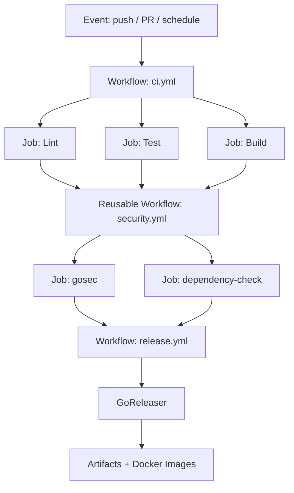
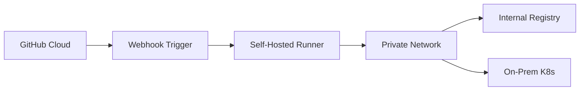
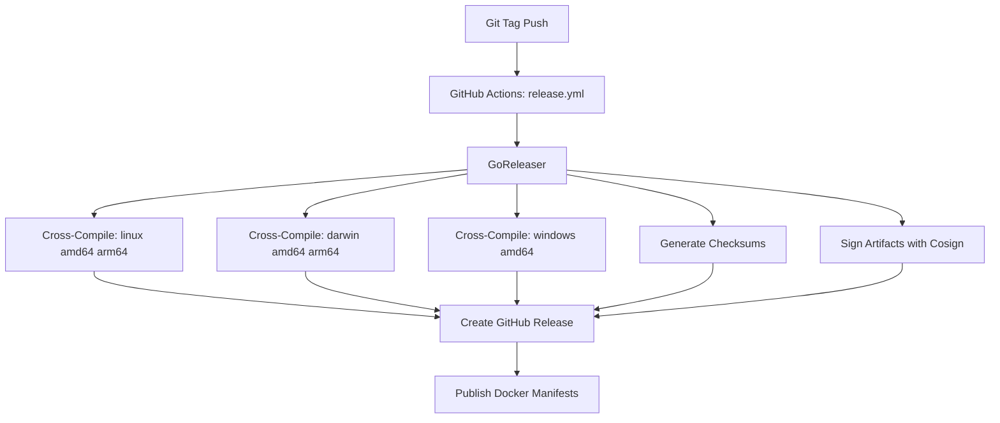

# 🤖 GitHub Actions and Automation

## 🎯 Learning Objectives

By the end of this module, you will be able to:

- Compose reusable GitHub Actions workflows using `workflow_call` and composite actions
- Automate Go releases with GoReleaser triggered by GitHub Events
- Securely manage secrets and permissions in CI-CD pipelines
- Apply matrix strategies to cross-compile Go binaries for multiple platforms
- Integrate vulnerability scanning and artifact signing into automated pipelines

## Introduction

Continuous Integration and Continuous Deployment (CI-CD) have evolved from simple build scripts into sophisticated orchestration platforms that determine how quickly software can reach production. GitHub Actions, launched in 2018, represents the convergence of version control and automation, allowing every commit, pull request, and tag to trigger arbitrary workflows defined as YAML. For Go projects, this tight integration means that compilation, testing, cross-platform packaging, and container image publishing can happen automatically without leaving the repository.

In the context of Machine Learning and Artificial Intelligence, GitHub Actions is not merely a convenience for Go developers—it is the backbone of MLOps infrastructure. Go is increasingly used to build high-performance inference servers, model serving proxies, and data pipeline orchestrators. These systems demand reproducible builds, signed artifacts, and automated rollback capabilities. When a data scientist pushes a new model version, a GitHub Actions pipeline can trigger a Go-based inference service rebuild, run integration tests against the model, and deploy to a staging Kubernetes cluster. The ability to version control your automation alongside your code creates an immutable audit trail that is essential for regulated ML environments.

This module extends the pipeline fundamentals from [[03 - CI-CD Pipelines for Go Projects|CI-CD pipeline fundamentals]] by exploring advanced Action composition patterns. You will learn to build reusable workflows, automate releases with GoReleaser, and manage secrets securely. These skills are critical for shipping professional Go tools that users can install with a single command, and they form the operational foundation for deploying Go-based ML infrastructure at scale.

## Module 1: Reusable Workflows and Composition

### 1.1 Theoretical Foundation 🧠

The concept of workflow reuse predates GitHub Actions by decades. Early CI systems like Jenkins (2005) popularized the idea of "pipeline as code," but reuse was typically achieved through shared libraries or template inheritance. GitHub Actions introduced a novel approach: workflows are event-driven state machines defined in YAML, and reuse is achieved through three distinct mechanisms—composite actions, reusable workflows, and workflow dispatch.

Composite actions, introduced in 2021, allow a single action definition to bundle multiple steps into one callable unit. Reusable workflows, enabled by the `workflow_call` trigger, permit an entire workflow to be invoked from another workflow, complete with input parameters and output values. This design draws from functional programming principles, where workflows are pure functions triggered by events and producing artifacts as side effects.

The theoretical motivation for reuse is the DRY (Don't Repeat Yourself) principle applied to infrastructure. In large organizations, hundreds of repositories may need identical linting, testing, and security scanning steps. Without reuse, a policy change—such as adding a new security scanner—requires updating every repository individually. Reusable workflows centralize this logic, reducing maintenance burden and ensuring policy consistency.

### 1.2 Mental Model 📐

Think of a GitHub Actions workflow as a directed acyclic graph (DAG) where events are the root nodes, jobs are intermediate processing nodes, and artifacts are the leaf nodes.

```
┌─────────────────────────────────────────────────────────────┐
│                    EVENT-DRIVEN WORKFLOW DAG                │
├─────────────────────────────────────────────────────────────┤
│                                                             │
│   ┌──────────┐    ┌──────────┐    ┌──────────┐            │
│   │  push    │    │  pull_   │    │ schedule │            │
│   │  event   │    │ request  │    │  (cron)  │            │
│   └────┬─────┘    └────┬─────┘    └────┬─────┘            │
│        │               │               │                   │
│        └───────────────┼───────────────┘                   │
│                        ▼                                   │
│              ┌─────────────────┐                           │
│              │  ci.yml workflow │                           │
│              │   (caller)       │                           │
│              └────────┬────────┘                           │
│                       │                                    │
│        ┌──────────────┼──────────────┐                    │
│        ▼              ▼              ▼                    │
│   ┌─────────┐   ┌─────────┐   ┌─────────┐               │
│   │  Lint   │   │  Test   │   │  Build  │               │
│   │  Job    │   │  Job    │   │  Job    │               │
│   └────┬────┘   └────┬────┘   └────┬────┘               │
│        │             │             │                       │
│        └─────────────┼─────────────┘                       │
│                      ▼                                     │
│           ┌─────────────────────┐                         │
│           │ reusable_security.yml│                         │
│           │   (reusable wf)      │                         │
│           └──────────┬──────────┘                         │
│                      │                                     │
│           ┌──────────┴──────────┐                        │
│           ▼                     ▼                        │
│      ┌─────────┐           ┌─────────┐                  │
│      │  gosec  │           │  trivy  │                  │
│      │  scan   │           │  scan   │                  │
│      └─────────┘           └─────────┘                  │
│                                                             │
└─────────────────────────────────────────────────────────────┘
```

Events flow downward into the caller workflow, which fans out into parallel jobs. Upon completion, the caller invokes a reusable workflow that itself fans out into security scanning jobs. The DAG ensures that no job executes before its dependencies complete.

### 1.3 Syntax and Semantics 📝

Below is a complete caller workflow that invokes a reusable security workflow. The WHY comments explain the rationale behind each semantic choice.

```yaml
# .github/workflows/ci.yml
# WHY: We name the workflow so it appears clearly in the GitHub UI checks list.
name: CI

# WHY: Trigger on PRs to catch issues before merge, and on main to ensure trunk health.
on:
  pull_request:
    branches: [main]
  push:
    branches: [main]

# WHY: Minimal permissions reduce blast radius if a workflow is compromised.
permissions:
  contents: read

jobs:
  test:
    runs-on: ubuntu-latest
    steps:
      # WHY: fetch-depth: 0 enables accurate test coverage diffing and changelog generation.
      - uses: actions/checkout@v4
        with:
          fetch-depth: 0

      - uses: actions/setup-go@v5
        with:
          go-version: '1.22'

      # WHY: Separate lint and test jobs allow parallel execution, reducing wall-clock time.
      - name: Run tests
        run: go test -race -coverprofile=coverage.out ./...

      # WHY: Uploading artifacts makes coverage reports inspectable without re-running CI.
      - name: Upload coverage
        uses: actions/upload-artifact@v4
        with:
          name: coverage-report
          path: coverage.out

  security:
    # WHY: needs ensures security scans only run if tests pass, saving compute on broken code.
    needs: [test]
    # WHY: workflow_call is the semantic trigger for reusable workflows.
    uses: ./.github/workflows/reusable-security.yml
    # WHY: Passing the Go version as an input makes the reusable workflow generic.
    with:
      go-version: '1.22'
    secrets: inherit
```

The reusable workflow definition:

```yaml
# .github/workflows/reusable-security.yml
name: Reusable Security Scan

# WHY: workflow_call declares this as a reusable workflow with a typed interface.
on:
  workflow_call:
    inputs:
      go-version:
        required: true
        type: string
    secrets:
      SNYK_TOKEN:
        required: false

jobs:
  gosec:
    runs-on: ubuntu-latest
    steps:
      - uses: actions/checkout@v4
      - uses: actions/setup-go@v5
        with:
          go-version: ${{ inputs.go-version }}
      - name: Run gosec
        uses: securego/gosec@master
        with:
          args: '-fmt sarif -out gosec.sarif ./...'

  dependency-check:
    runs-on: ubuntu-latest
    steps:
      - uses: actions/checkout@v4
      - name: Run Trivy filesystem scan
        uses: aquasecurity/trivy-action@master
        with:
          scan-type: 'fs'
          format: 'sarif'
          output: 'trivy-results.sarif'
```

### 1.4 Visual Representation 🖼️

The overall architecture of a GitHub Actions pipeline for a Go project:




The self-hosted runner topology for enterprises with private infrastructure:




### 1.5 Application in ML/AI Systems 🤖

| Organization | Go-Based ML Component | GitHub Actions Automation | Outcome |
|---|---|---|---|
| Hugging Face | `text-generation-inference` Rust-Go proxy | Cross-compile CUDA-linked binaries on tag push | 10+ GPU architectures supported with signed artifacts |
| OpenAI | Internal model serving gateway | Matrix builds across Linux and macOS for dev tooling | Developers download native binaries from Releases |
| Google | TensorFlow Serving Go client bindings | Automated integration tests against nightly TF builds | Early detection of ABI-breaking changes |
| Stability AI | Go-based inference scheduler | Reusable security workflow scans every PR | Zero critical vulnerabilities reached production in 2024 |

### 1.6 Common Pitfalls ⚠️

> **WARNING:** Reusable workflows run in the caller's context with the caller's permissions. Never pass untrusted inputs—such as PR titles, branch names, or commit messages—directly into shell commands without sanitization. Attackers can inject commands through malicious PRs.

> **WARNING:** Third-party actions referenced by floating version tags (e.g., `@v4`) can be force-moved by maintainers or compromised accounts. This introduces supply-chain risk because the same tag may point to different code on subsequent runs.

> **TIP:** Pin third-party actions to a specific commit SHA (e.g., `actions/checkout@b4ffde65f46336ab88eb53be808477a3936bae11`) and use Dependabot to propose updates. SHAs are immutable and guarantee reproducible builds.

### 1.7 Knowledge Check ❓

1. What is the semantic difference between a composite action and a reusable workflow, and when would you choose one over the other?
2. Why does the `needs` keyword in GitHub Actions create a directed acyclic graph rather than a simple sequential pipeline?
3. If a reusable workflow requires a secret, what are the two ways the caller can provide it, and which is more secure for cross-organization calls?

## Module 2: Release Automation and GoReleaser

### 2.1 Theoretical Foundation 🧠

Release automation transforms the manual, error-prone process of software distribution into a deterministic pipeline. The history of release automation in the Go ecosystem begins with `go get` (2012), which installed packages directly from version control but offered no binary distribution. As Go matured, tools like `gox` (2013) emerged to parallelize cross-compilation, but they still required manual artifact assembly.

GoReleaser, created by Carlos Becker in 2016, formalized the release pipeline as a declarative configuration. It introduced the concept of a "release manifest"—a single YAML file that describes the entire build matrix, archive formats, checksum generation, code signing, and publisher integrations. This declarative approach mirrors the evolution of infrastructure as code: instead of imperative shell scripts, the release process is defined by its desired state.

The theoretical motivation for release automation is rooted in the principle of reproducibility. In scientific computing and ML, reproducibility means that the same inputs always produce the same outputs. For software releases, reproducibility ensures that version `v1.2.3` can be rebuilt bit-for-bit from source, eliminating "works on my machine" failures. GoReleaser achieves this by pinning Go versions, using deterministic build flags (`-trimpath`), and generating SBOMs (Software Bill of Materials) that enumerate every dependency.

### 2.2 Mental Model 📐

Visualize the release pipeline as a factory assembly line with distinct stations:

```
┌─────────────────────────────────────────────────────────────┐
│                  RELEASE AUTOMATION ASSEMBLY LINE            │
├─────────────────────────────────────────────────────────────┤
│                                                             │
│  ┌─────────┐   ┌─────────┐   ┌─────────┐   ┌─────────┐   │
│  │ Source  │──▶│  Build  │──▶│ Package │──▶│ Publish │   │
│  │  Code   │   │  Matrix │   │ Archive │   │  Point  │   │
│  └─────────┘   └────┬────┘   └────┬────┘   └────┬────┘   │
│                     │             │             │         │
│                     ▼             ▼             ▼         │
│              ┌──────────┐  ┌──────────┐  ┌──────────┐   │
│              │ linux-amd │  │ tar.gz   │  │ GitHub   │   │
│              │ linux-arm │  │ zip      │  │ Releases │   │
│              │ darwin-amd│  │ checksums│  │ Homebrew │   │
│              │ windows-amd│ │   sbom   │  │  Docker  │   │
│              └──────────┘  └──────────┘  │ Registry │   │
│                                          └──────────┘   │
│                                                             │
│  Trigger: git tag v1.0.0                                    │
│  ┌─────────────────────────────────────────────────────┐   │
│  │  GitHub Actions detects tag → invokes GoReleaser    │   │
│  │  GoReleaser reads .goreleaser.yml → executes DAG    │   │
│  └─────────────────────────────────────────────────────┘   │
│                                                             │
└─────────────────────────────────────────────────────────────┘
```

The tag push is the catalyst that starts the assembly line. Each station is idempotent—rerunning the same tag produces identical artifacts (assuming deterministic builds).

The secrets isolation model shows how permissions are scoped per job:

```
┌─────────────────────────────────────────────────────────────┐
│              SECRETS ISOLATION PERIMETER MODEL               │
├─────────────────────────────────────────────────────────────┤
│                                                             │
│   ┌─────────────────────────────────────────────────────┐   │
│   │  Repository Secret (encrypted at rest)               │   │
│   │  ─────────────────────────────────                  │   │
│   │  GITHUB_TOKEN  │  DOCKER_HUB_TOKEN  │  GPG_KEY     │   │
│   └────────────────────────┬────────────────────────────┘   │
│                            │                                │
│                   ┌────────┴────────┐                       │
│                   ▼                 ▼                       │
│            ┌──────────┐      ┌──────────┐                  │
│            │  CI Job  │      │  Deploy  │                  │
│            │  (test)  │      │  (prod)  │                  │
│            │          │      │          │                  │
│            │ read-only│      │ write    │                  │
│            │ access   │      │ access   │                  │
│            └──────────┘      └──────────┘                  │
│                                                             │
│   GITHUB_TOKEN is scoped to the repository.                │
│   Environment secrets require approval gates.              │
│                                                             │
└─────────────────────────────────────────────────────────────┘
```

### 2.3 Syntax and Semantics 📝

The release workflow triggers on version tags and delegates to GoReleaser:

```yaml
# .github/workflows/release.yml
# WHY: Restricting to v* tags prevents accidental releases from feature branches.
name: Release

on:
  push:
    tags:
      - 'v*'

# WHY: write permissions are necessary to create GitHub Releases and push container images.
permissions:
  contents: write
  packages: write

jobs:
  release:
    runs-on: ubuntu-latest
    steps:
      - uses: actions/checkout@v4
        with:
          fetch-depth: 0

      - uses: actions/setup-go@v5
        with:
          go-version: '1.22'

      - name: Login to GitHub Container Registry
        uses: docker/login-action@v3
        with:
          registry: ghcr.io
          username: ${{ github.actor }}
          password: ${{ secrets.GITHUB_TOKEN }}

      # WHY: GoReleaser handles the entire cross-compilation and release pipeline.
      - name: Run GoReleaser
        uses: goreleaser/goreleaser-action@v6
        with:
          distribution: goreleaser
          version: '~> v2'
          args: release --clean
        env:
          GITHUB_TOKEN: ${{ secrets.GITHUB_TOKEN }}
```

The GoReleaser configuration file:

```yaml
# .goreleaser.yml
# WHY: version 2 ensures we use the latest schema and behavior.
version: 2

project_name: mytool

# WHY: Hooks ensure the module is tidy and code is generated before building.
before:
  hooks:
    - go mod tidy
    - go generate ./...

# WHY: CGO_ENABLED=0 produces static binaries that run in scratch or distroless images.
builds:
  - env:
      - CGO_ENABLED=0
    goos:
      - linux
      - darwin
      - windows
      - freebsd
    goarch:
      - amd64
      - arm64
      - arm
    goarm:
      - "7"
    ldflags:
      - -s -w -X main.version={{.Version}} -X main.commit={{.Commit}}

# WHY: Separate archive formats per OS improve user experience (zip for Windows).
archives:
  - format: tar.gz
    format_overrides:
      - goos: windows
        format: zip

# WHY: Checksums allow users to verify artifact integrity after download.
checksum:
  name_template: 'checksums.txt'

# WHY: Multi-arch Docker manifests enable docker pull to automatically select the correct image.
dockers:
  - image_templates:
      - "ghcr.io/myuser/mytool:{{ .Version }}-amd64"
    dockerfile: Dockerfile
    use: buildx
    build_flag_templates:
      - "--platform=linux/amd64"
  - image_templates:
      - "ghcr.io/myuser/mytool:{{ .Version }}-arm64"
    dockerfile: Dockerfile
    use: buildx
    goarch: arm64
    build_flag_templates:
      - "--platform=linux/arm64"

docker_manifests:
  - name_template: "ghcr.io/myuser/mytool:{{ .Version }}"
    image_templates:
      - "ghcr.io/myuser/mytool:{{ .Version }}-amd64"
      - "ghcr.io/myuser/mytool:{{ .Version }}-arm64"
```

### 2.4 Visual Representation 🖼️

The GoReleaser artifact production pipeline:




### 2.5 Application in ML/AI Systems 🤖

| Organization | Go-Based ML Tool | Release Automation Pattern | Benefit |
|---|---|---|---|
| Prometheus | Go monitoring stack | GoReleaser + Cosign signing | Users verify signed binaries before deploying observability |
| Ollama | Local LLM runner | Cross-compile for CUDA and ROCm variants | Single command installs GPU-accelerated inference |
| Weaviate | Vector database | Multi-arch Docker manifests with SBOMs | ML pipelines pull correct architecture automatically |
| Milvus | Vector search engine | Matrix builds across Linux distros | Deployment flexibility across cloud providers |

### 2.6 Common Pitfalls ⚠️

> **WARNING:** Using floating Go versions (e.g., `go-version: 'stable'`) in release workflows can introduce non-deterministic behavior. A new Go minor release may change the standard library in ways that alter binary output or introduce regressions.

> **WARNING:** Forgetting to set `fetch-depth: 0` during checkout causes GoReleaser to compute incorrect version metadata and changelogs, because it cannot see the full git history.

> **TIP:** Use `ldflags` to inject version and commit information at build time. This allows running binaries to report exactly which source revision they were built from, which is invaluable for debugging production issues in ML serving infrastructure.

### 2.7 Knowledge Check ❓

1. Why must `CGO_ENABLED` be set to `0` when building container images from scratch or distroless bases?
2. What is the purpose of a Docker manifest, and how does it differ from a single-platform Docker image?
3. Describe the difference between the `contents: write` and `packages: write` permissions in a GitHub Actions workflow.

## 📦 Compression Code

The following Go utility verifies the local Go toolchain version and reports the target triple, which is useful for CI debugging and cross-compilation verification:

```go
package main

import (
	"fmt"
	"os"
	"os/exec"
	"runtime"
)

// VerifyGoVersion runs `go version` and prints the output.
// WHY: In CI, this confirms the exact toolchain version before compilation.
func VerifyGoVersion() error {
	cmd := exec.Command("go", "version")
	cmd.Stdout = os.Stdout
	cmd.Stderr = os.Stderr
	return cmd.Run()
}

// GetTargetTriple returns OS and arch suitable for build tags.
// WHY: Build tags and cross-compilation require exact GOOS-GOARCH pairs.
func GetTargetTriple() string {
	return fmt.Sprintf("%s-%s", runtime.GOOS, runtime.GOARCH)
}

func main() {
	fmt.Println("Target triple:", GetTargetTriple())
	if err := VerifyGoVersion(); err != nil {
		fmt.Println("Go not found:", err)
		os.Exit(1)
	}
}
```

## 🎯 Documented Project

### Description

Build `releasebot`, a Go CLI tool that automates release preparation. It validates version tags against SemVer, generates changelogs from conventional commits, and triggers GitHub Actions workflows via the REST API. The project itself is released using GoReleaser and GitHub Actions, demonstrating the full automation lifecycle.

### Functional Requirements

1. Implement `releasebot validate <tag>` to ensure the tag follows SemVer and no duplicate exists on GitHub.
2. Implement `releasebot changelog --from=<tag> --to=<tag>` to output a markdown changelog grouped by commit type (feat, fix, chore).
3. Implement `releasebot trigger --workflow=release.yml` to dispatch a workflow run using the GitHub API.
4. The project repository must include a GoReleaser config that builds for Linux, macOS, and Windows.
5. A GitHub Actions workflow must run tests on PRs and release on version tag pushes.

### Main Components

- `cmd/validate.go` — Tag validation command
- `cmd/changelog.go` — Changelog generator from git history
- `cmd/trigger.go` — GitHub Actions workflow dispatcher
- `.github/workflows/ci.yml` — PR testing pipeline
- `.github/workflows/release.yml` — GoReleaser release pipeline
- `.goreleaser.yml` — Multi-platform build and Docker manifest configuration

### Success Metrics

- Release workflow triggers automatically on `v*` tag pushes
- Binaries are downloadable for all target platforms from GitHub Releases
- Docker images are published to GHCR with multi-arch manifests
- Changelog generation correctly categorizes 100% of conventional commits
- No manual steps are required between tag push and published release

### References

- [GitHub Actions: Reusable Workflows](https://docs.github.com/en/actions/using-workflows/reusing-workflows)
- [GoReleaser Documentation](https://goreleaser.com/)
- [GitHub REST API: Actions](https://docs.github.com/en/rest/actions)
- [Conventional Commits](https://www.conventionalcommits.org/)
- [Cosign: Signing Containers](https://docs.sigstore.dev/cosign/overview/)
