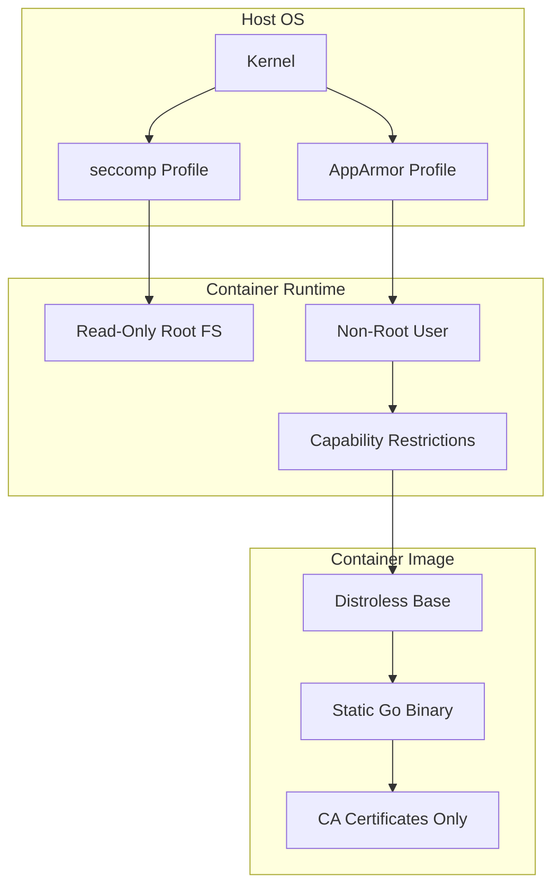
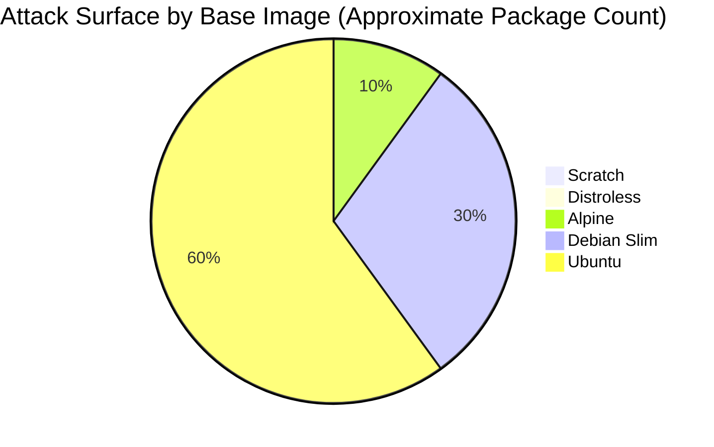
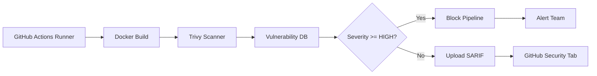

# 🐳 Container Security with Go

## 🎯 Learning Objectives

By the end of this module, you will be able to:

- Construct minimal container images for Go applications using scratch and distroless bases
- Analyze container attack surfaces and select base images based on security requirements
- Integrate vulnerability scanning into CI-CD pipelines with Trivy and SARIF reporting
- Apply runtime security policies including seccomp, AppArmor, and capability dropping
- Harden Kubernetes Pod specifications for Go-based ML inference services

## Introduction

Containerization has fundamentally changed how software is packaged and deployed, but it has also introduced a new layer of abstraction that expands the attack surface. A container image bundles an application with an operating system layer, system libraries, and often a shell—each component representing a potential vector for exploitation. For Go applications, the language's unique ability to produce fully static binaries creates an unprecedented opportunity: we can build images that contain virtually no operating system at all, reducing the attack surface to the absolute minimum.

In Machine Learning and Artificial Intelligence systems, container security is not a luxury—it is a compliance requirement. ML models are valuable intellectual property, and inference servers often process sensitive data subject to GDPR, HIPAA, or SOC-2 regulations. A compromised container can leak model weights, poison training data, or expose inference APIs to unauthorized actors. Go is increasingly the language of choice for high-performance ML serving infrastructure because its static binaries enable true minimal images. When a Go-based vector database or feature store runs in a distroless container, there is no shell for an attacker to exploit and no package manager to install persistence tools.

This module teaches you how to construct secure container images for Go applications, scan them for vulnerabilities, and apply runtime security policies. These practices complement [[02 - Security Scanning and Hardening|code-level security]] and are essential for production deployments managed through [[03 - CI-CD Pipelines for Go Projects|CI-CD pipelines]].

## Module 1: Minimal Container Images

### 1.1 Theoretical Foundation 🧠

The concept of minimal container images traces its roots to the Unix philosophy: "do one thing and do it well." Traditional virtual machines bundle entire operating systems because they must support arbitrary workloads. Containers, by contrast, share the host kernel and need only the userspace components required by a single application. This insight led to the development of minimal base images.

The history of minimal images for Go begins with the release of Docker in 2013. Early Go containers were built on `ubuntu` or `debian` images, resulting in containers over 100 MB despite Go binaries typically being under 20 MB. The mismatch between the application and its packaging created unnecessary attack surface. In 2015, Docker introduced multi-stage builds, allowing compile-time dependencies to be separated from runtime artifacts. This was a watershed moment for Go because it enabled the use of `scratch`—Docker's empty base image.

Google's distroless project (2017) addressed the limitations of scratch by providing images containing only essential runtime dependencies: CA certificates for TLS, timezone data, and glibc. Unlike scratch, distroless does not require manual certificate management, but like scratch, it contains no shell or package manager. The theoretical underpinning is the principle of least privilege applied to filesystem contents: if a component is not required for the application to function, it should not be present in the runtime image.

### 1.2 Mental Model 📐

Imagine container security as a series of concentric walls surrounding a castle. Each wall removes capabilities and reduces the attack surface:

```
┌─────────────────────────────────────────────────────────────┐
│                    CONTAINER SECURITY FORTRESS               │
├─────────────────────────────────────────────────────────────┤
│                                                             │
│   ┌─────────────────────────────────────────────────────┐   │
│   │  OUTER WALL: Host Kernel + seccomp + AppArmor       │   │
│   │  Filters syscalls and restricts file/network access  │   │
│   └────────────────────────┬────────────────────────────┘   │
│                            │                                │
│   ┌────────────────────────┴────────────────────────────┐   │
│   │  MIDDLE WALL: Container Runtime + Capabilities      │   │
│   │  Drops ALL capabilities, read-only root filesystem   │   │
│   └────────────────────────┬────────────────────────────┘   │
│                            │                                │
│   ┌────────────────────────┴────────────────────────────┐   │
│   │  INNER WALL: Minimal Base Image                     │   │
│   │  No shell, no package manager, no unnecessary libs   │   │
│   └────────────────────────┬────────────────────────────┘   │
│                            │                                │
│   ┌────────────────────────┴────────────────────────────┐   │
│   │  KEEP: Static Go Binary + CA Certificates Only      │   │
│   │  The application itself is the only executable       │   │
│   └─────────────────────────────────────────────────────┘   │
│                                                             │
│   Attacker breaching outer wall finds no tools inside.      │
│                                                             │
└─────────────────────────────────────────────────────────────┘
```

The attacker must breach four distinct layers before reaching the application. Because the innermost layer contains no tools, even a successful container escape yields minimal leverage.

### 1.3 Syntax and Semantics 📝

The following multi-stage Dockerfile builds a minimal Go service. WHY comments explain the security rationale behind each instruction:

```dockerfile
# Dockerfile
# WHY: golang-alpine provides a small build environment with a working C toolchain.
FROM golang:1.22-alpine AS builder
WORKDIR /app

# WHY: Copying go.mod first enables Docker layer caching for dependencies.
COPY go.mod go.sum ./
RUN go mod download

COPY . .
# WHY: CGO_ENABLED=0 produces a static binary with no dynamic linking dependencies.
# WHY: ldflags="-s -w" strips debug info and symbol tables, reducing binary size.
RUN CGO_ENABLED=0 GOOS=linux go build -ldflags="-s -w" -o /bin/server ./cmd/server

# WHY: gcr.io-distroless-static-nonroot has no shell and runs as a non-root user.
FROM gcr.io/distroless/static:nonroot
# WHY: Copy only the binary and CA certs—no source code, no build tools.
COPY --from=builder /bin/server /server
COPY --from=builder /etc/ssl/certs/ca-certificates.crt /etc/ssl/certs/

# WHY: Explicit non-root execution limits damage if the binary is compromised.
USER nonroot:nonroot

# WHY: EXPOSE documents the port but does not bind it; binding is runtime behavior.
EXPOSE 8080

# WHY: ENTRYPOINT with exec form avoids a shell intermediary, reducing attack surface.
ENTRYPOINT ["/server"]
```

The Go HTTP service that runs inside this container:

```go
package main

import (
	"fmt"
	"log"
	"net/http"
)

// HealthHandler responds with a JSON status payload.
// WHY: A health endpoint is required for Kubernetes liveness and readiness probes.
func HealthHandler(w http.ResponseWriter, r *http.Request) {
	w.Header().Set("Content-Type", "application/json")
	fmt.Fprint(w, `{"status":"ok"}`)
}

func main() {
	http.HandleFunc("/health", HealthHandler)
	log.Println("Server listening on :8080")
	// WHY: ListenAndServe blocks forever; the container stays alive serving requests.
	if err := http.ListenAndServe(":8080", nil); err != nil {
		log.Fatalf("Server failed: %v", err)
	}
}
```

### 1.4 Visual Representation 🖼️

The container security layer architecture:



Base image size and attack surface comparison:




### 1.5 Application in ML/AI Systems 🤖

| Organization | Go-Based ML Component | Container Security Strategy | Outcome |
|---|---|---|---|
| Google | Distroless image maintainers | Static Go binaries on distroless | Internal services run with no shell access |
| OpenAI | Go inference proxy servers | Scratch-based images for API gateways | Sub-10 MB images with zero OS packages |
| Weaviate | Vector search engine | Multi-stage builds with non-root users | SOC-2 compliant container deployments |
| Ollama | Local LLM runner | Distroless + capability dropping | Reduced CVE surface by 95% compared to Debian base |

### 1.6 Common Pitfalls ⚠️

> **WARNING:** Alpine Linux uses musl libc instead of glibc. Go binaries that use cgo or depend on C libraries compiled against glibc may fail silently or crash at runtime. Always test Alpine-based images thoroughly in a staging environment before production use.

> **WARNING:** Building from scratch without copying CA certificates will cause TLS HTTPS requests to fail with certificate verification errors. Distroless handles this automatically, but scratch requires explicit certificate management.

> **TIP:** Pin base image digests instead of tags (e.g., `gcr.io/distroless/static@sha256:...`). Tags can be overwritten by maintainers, but digests are immutable content addresses that guarantee you always use the exact same image layer.

### 1.7 Knowledge Check ❓

1. Why does a static Go binary enable the use of the scratch base image, while a Python application cannot use scratch?
2. What is the practical difference between dropping all Linux capabilities and running as a non-root user?
3. If your Go application makes outbound HTTPS calls, why is distroless often preferable to scratch for production deployments?

## Module 2: Vulnerability Scanning and Runtime Security

### 2.1 Theoretical Foundation 🧠

Vulnerability scanning is the systematic inspection of software artifacts for known security flaws. The theoretical basis for vulnerability scanning is the Common Vulnerabilities and Exposures (CVE) system, established by MITRE in 1999. Each CVE entry represents a publicly disclosed cybersecurity vulnerability with a unique identifier. Scanners maintain databases of CVEs mapped to software versions, allowing them to flag components with known flaws.

Container scanning extends this concept to the filesystem layer. Because a container image is a stack of read-only layers, scanners can unpack each layer and inspect installed packages, language dependencies, and configuration files. Trivy, developed by Aqua Security, pioneered fast container scanning by using vulnerability databases from multiple sources (OS vendors, language ecosystems, and GitHub Security Advisories) rather than relying solely on a single feed.

Runtime security complements static scanning by enforcing security policies during execution. The Linux kernel provides several mechanisms: seccomp (secure computing mode) filters the system calls a process can invoke; AppArmor applies mandatory access control to file and network resources; and Linux capabilities partition the all-powerful root privileges into fine-grained permissions. The theoretical motivation is defense in depth: even if an attacker compromises an application, runtime restrictions prevent them from exploiting the full power of the kernel.

### 2.2 Mental Model 📐

Visualize the CI-CD security gate as a customs checkpoint at an airport. Every container must pass inspection before boarding the production cluster:

```
┌─────────────────────────────────────────────────────────────┐
│              CONTAINER SECURITY CUSTOMS CHECKPOINT           │
├─────────────────────────────────────────────────────────────┤
│                                                             │
│   Container Arrival: docker build -t myapp:latest .         │
│                                                             │
│   ┌──────────┐    ┌──────────┐    ┌──────────┐            │
│   │ Station 1│───▶│ Station 2│───▶│ Station 3│            │
│   │  Build   │    │  Scan    │    │  Deploy  │            │
│   │  Stage   │    │  Stage   │    │  Stage   │            │
│   └────┬─────┘    └────┬─────┘    └────┬─────┘            │
│        │               │               │                   │
│        ▼               ▼               ▼                   │
│   ┌─────────┐     ┌─────────┐     ┌─────────┐            │
│   │ Compile │     │ Trivy   │     │ K8s Pod │            │
│   │ Binary  │     │ Scan    │     │ Spec    │            │
│   │ Static  │     │ SARIF   │     │ Security│            │
│   │ Linked  │     │ Report  │     │ Context │            │
│   └─────────┘     └────┬────┘     └─────────┘            │
│                        │                                   │
│              ┌─────────┴─────────┐                        │
│              ▼                   ▼                        │
│        ┌──────────┐       ┌──────────┐                  │
│        │ PASS     │       │ FAIL     │                  │
│        │ Continue │       │ Block    │                  │
│        │ Pipeline │       │ Pipeline │                  │
│        └──────────┘       └──────────┘                  │
│                                                             │
│   No container boards production without a clean scan.      │
│                                                             │
└─────────────────────────────────────────────────────────────┘
```

The seccomp syscall filter acts as a final mechanical barrier:

```
┌─────────────────────────────────────────────────────────────┐
│              SECCOMP SYSTEM CALL FILTER MATRIX               │
├─────────────────────────────────────────────────────────────┤
│                                                             │
│   Default Policy: Allow all syscalls                        │
│                                                             │
│   ┌─────────┐  ┌─────────┐  ┌─────────┐  ┌─────────┐    │
│   │  open   │  │  read   │  │  write  │  │  execve │    │
│   │   ✓     │  │   ✓     │  │   ✓     │  │   ✓     │    │
│   └─────────┘  └─────────┘  └─────────┘  └─────────┘    │
│                                                             │
│   Hardened Policy: Deny dangerous syscalls                 │
│                                                             │
│   ┌─────────┐  ┌─────────┐  ┌─────────┐  ┌─────────┐    │
│   │  open   │  │  read   │  │  write  │  │  execve │    │
│   │   ✓     │  │   ✓     │  │   ✓     │  │   ✗     │    │
│   └─────────┘  └─────────┘  └─────────┘  └─────────┘    │
│                                                             │
│   Go runtime typically uses: read, write, mmap, clone      │
│                                                             │
└─────────────────────────────────────────────────────────────┘
```

### 2.3 Syntax and Semantics 📝

The Trivy scanning workflow integrated into GitHub Actions:

```yaml
# .github/workflows/container-security.yml
# WHY: Running on every main push ensures vulnerabilities are caught immediately.
name: Container Security Scan

on:
  push:
    branches: [main]

jobs:
  scan:
    runs-on: ubuntu-latest
    steps:
      - uses: actions/checkout@v4

      # WHY: Building the image before scanning ensures we scan the exact artifact
      # that would be deployed, not just source code.
      - name: Build image
        run: docker build -t myapp:latest .

      # WHY: SARIF output integrates with GitHub Advanced Security for inline PR annotations.
      - name: Run Trivy vulnerability scanner
        uses: aquasecurity/trivy-action@master
        with:
          image-ref: 'myapp:latest'
          format: 'sarif'
          output: 'trivy-results.sarif'
          exit-code: '1'
          severity: 'HIGH,CRITICAL'

      # WHY: Uploading SARIF to GitHub enables the Security tab vulnerability graph.
      - name: Upload Trivy scan results
        if: always()
        uses: github/codeql-action/upload-sarif@v3
        with:
          sarif_file: 'trivy-results.sarif'
```

The hardened Kubernetes Pod specification:

```yaml
# k8s-deployment.yaml
apiVersion: v1
kind: Pod
spec:
  containers:
    - name: server
      image: myapp:latest
      # WHY: securityContext enforces runtime restrictions at the Pod level.
      securityContext:
        # WHY: Prevents processes from gaining more privileges than their parent.
        allowPrivilegeEscalation: false
        # WHY: A read-only root filesystem prevents attackers from modifying system files.
        readOnlyRootFilesystem: true
        # WHY: Explicit non-root execution is the last line of defense.
        runAsNonRoot: true
        # WHY: Dropping ALL capabilities removes every privileged operation.
        capabilities:
          drop:
            - ALL
      ports:
        - containerPort: 8080
      # WHY: A temporary emptyDir allows the app to write logs without a writable root FS.
      volumeMounts:
        - name: tmp
          mountPath: /tmp
  volumes:
    - name: tmp
      emptyDir: {}
```

### 2.4 Visual Representation 🖼️

The vulnerability scanning data flow:




### 2.5 Application in ML/AI Systems 🤖

| Organization | ML System Component | Runtime Security Enforcement | Result |
|---|---|---|---|
| NVIDIA | Triton Inference Server (Go plugins) | seccomp profiles for GPU syscalls | Isolated inference processes cannot escape to host |
| Apple | Core ML serving infrastructure | AppArmor profiles restricting model file access | Model weights are inaccessible to compromised containers |
| Anthropic | Claude API gateway (Go services) | Capability dropping + read-only root FS | Zero lateral movement after container compromise |
| Stability AI | Image generation scheduler | Non-root + ALL capabilities dropped | Passed third-party security audit with no critical findings |

### 2.6 Common Pitfalls ⚠️

> **WARNING:** Setting `exit-code: '1'` in Trivy without `if: always()` on the SARIF upload step means scan failures will prevent the upload of results. Engineers will see a failed pipeline but no vulnerability details in the Security tab.

> **WARNING:** Using `latest` as an image tag in Kubernetes manifests makes it impossible to roll back to a known-good version. Always pin image tags to specific versions or digests.

> **TIP:** Combine Trivy filesystem scanning (`scan-type: 'fs'`) during the build stage with image scanning (`scan-type: 'image'`) after the build. Filesystem scanning catches vulnerable dependencies early, while image scanning catches OS-level CVEs introduced by the base image.

### 2.7 Knowledge Check ❓

1. Why is `readOnlyRootFilesystem: true` considered a strong runtime security control, and what additional Kubernetes resource is required to make it practical for applications that need temporary file storage?
2. Explain the difference between vulnerability scanning (Trivy) and runtime enforcement (seccomp, AppArmor). Why are both necessary?
3. If a Go binary is fully static and runs in a scratch image, why might Trivy still report vulnerabilities in the final image?

## 📦 Compression Code

The following Go utility compresses a string using gzip, demonstrating that even minimal containers can perform standard data operations:

```go
package main

import (
	"bytes"
	"compress/gzip"
	"fmt"
	"io"
)

// GzipString compresses a string and returns the compressed bytes.
// WHY: Compression reduces network payload size for ML model artifacts and logs.
func GzipString(input string) ([]byte, error) {
	var buf bytes.Buffer
	zw := gzip.NewWriter(&buf)
	if _, err := zw.Write([]byte(input)); err != nil {
		return nil, err
	}
	if err := zw.Close(); err != nil {
		return nil, err
	}
	return buf.Bytes(), nil
}

// GunzipString decompresses gzip bytes to a string.
// WHY: Decompression is required to restore compressed inference outputs or telemetry.
func GunzipString(data []byte) (string, error) {
	zr, err := gzip.NewReader(bytes.NewReader(data))
	if err != nil {
		return "", err
	}
	defer zr.Close()
	out, err := io.ReadAll(zr)
	if err != nil {
		return "", err
	}
	return string(out), nil
}

func main() {
	original := "This is a test string for compression inside a secure container."
	compressed, err := GzipString(original)
	if err != nil {
		fmt.Println("Compression error:", err)
		return
	}
	fmt.Printf("Original: %d bytes, Compressed: %d bytes\n", len(original), len(compressed))

	decompressed, err := GunzipString(compressed)
	if err != nil {
		fmt.Println("Decompression error:", err)
		return
	}
	fmt.Println("Decompressed:", decompressed)
}
```

## 🎯 Documented Project

### Description

Build `secureserver`, a minimal Go HTTP service packaged in a distroless container. The project includes a hardened multi-stage Dockerfile, a GitHub Actions workflow that builds and scans the image with Trivy, and Kubernetes manifests with runtime security policies. The service demonstrates that production-grade security does not require sacrificing developer ergonomics.

### Functional Requirements

1. The Go service exposes `/health` and responds with JSON `{"status":"ok"}`.
2. The Dockerfile must be multi-stage, compiling in `golang:1.22-alpine` and running on `gcr.io/distroless/static:nonroot`.
3. A GitHub Actions workflow builds the image on every push and runs Trivy scan.
4. The Trivy scan blocks the pipeline if HIGH or CRITICAL vulnerabilities are found.
5. Kubernetes deployment manifest sets `runAsNonRoot: true`, `readOnlyRootFilesystem: true`, and drops all capabilities.

### Main Components

- `cmd/server/main.go` — Minimal HTTP server with `/health` endpoint
- `Dockerfile` — Multi-stage build with distroless runtime
- `.github/workflows/container-security.yml` — Build and Trivy scan pipeline
- `k8s/deployment.yaml` — Hardened Kubernetes deployment
- `k8s/service.yaml` — Kubernetes service definition

### Success Metrics

- Final image size is under 15 MB
- Trivy scan reports zero HIGH/CRITICAL vulnerabilities
- Container runs successfully with no shell access (`docker exec` fails)
- Kubernetes security context prevents privilege escalation
- Image build time is under 2 minutes with module caching

### References

- [Google Distroless GitHub](https://github.com/GoogleContainerTools/distroless)
- [Trivy Documentation](https://aquasecurity.github.io/trivy/)
- [Docker Security Best Practices](https://docs.docker.com/develop/dev-best-practices/)
- [Kubernetes Security Context](https://kubernetes.io/docs/tasks/configure-pod-container/security-context/)
- [OWASP Container Security Verification Standard](https://owasp.org/www-project-container-security-verification-standard/)
