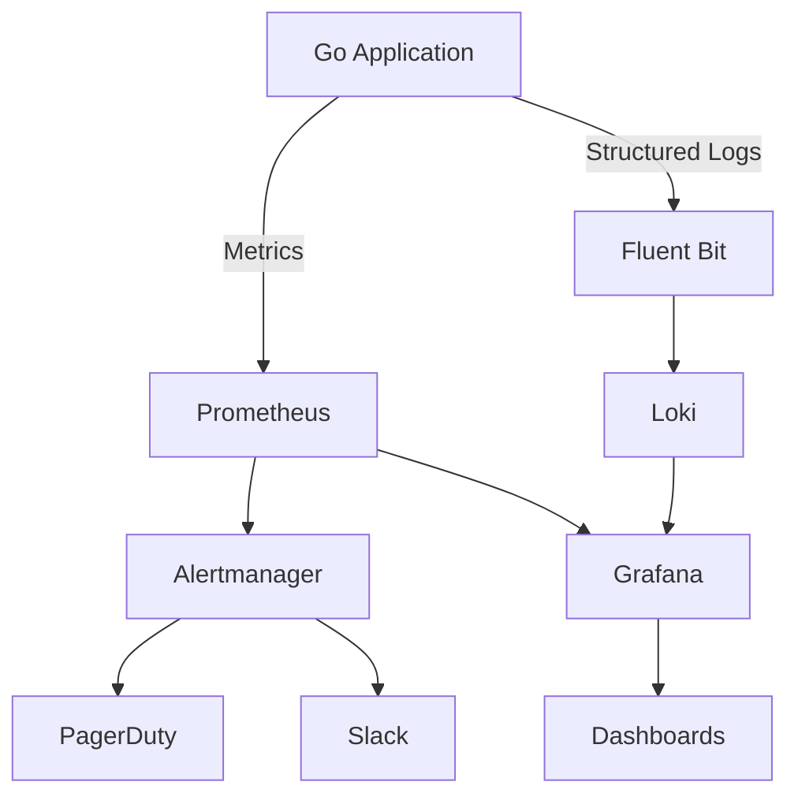
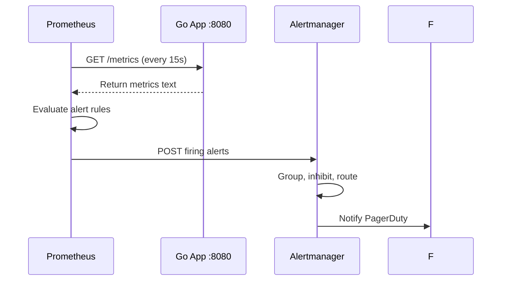
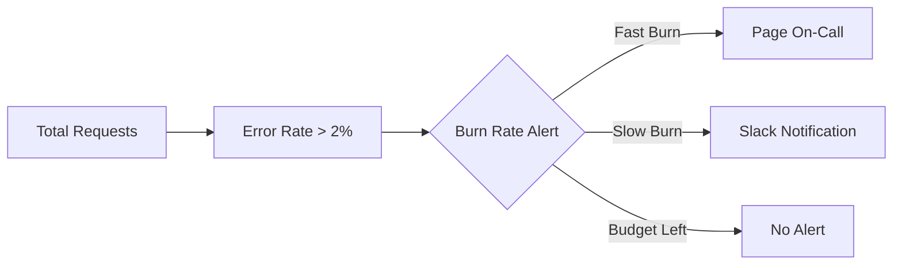

# 🧰 Building a DevOps Toolkit

## 🎯 Learning Objectives

By the end of this module, you will be able to:

- Instrument Go applications with Prometheus metrics following best practices
- Design structured logging pipelines compatible with modern aggregation systems
- Configure alerting rules and routing policies with Alertmanager
- Build RED-method dashboards in Grafana for Go services
- Apply Service Level Objectives (SLOs) to ML inference infrastructure

## Introduction

Observability is the ability to infer a system's internal state by examining its external outputs—logs, metrics, and traces. The term originates from control theory, where observability determines whether the internal states of a linear dynamical system can be reconstructed from its outputs. In software engineering, observability has evolved from passive monitoring (checking if a server is up) to active interrogation (understanding why a request failed and which downstream service caused the latency). For Go applications, observability is particularly critical because Go's concurrency model (goroutines and channels) creates execution paths that are invisible to traditional process-level monitoring.

In Machine Learning and Artificial Intelligence systems, observability transcends traditional DevOps. An ML inference server is not merely a web service—it is a system whose performance depends on model size, batch dimensions, GPU memory utilization, and input data distributions. When a model's prediction latency spikes, the cause could be a code regression, a CUDA driver update, a data drift event, or a batching configuration change. A DevOps toolkit for ML must capture not only request rate and error count, but also model-specific telemetry such as inference batch size, GPU utilization percentage, and feature cache hit rates. Go is increasingly used to build the control planes and data planes of ML serving systems, making Go observability expertise essential for MLOps engineers.

This module brings together the CLI skills from [[01 - Building CLIs with Cobra|Cobra]] and the deployment patterns from [[04 - GitHub Actions and Automation|GitHub Actions]] to construct a complete monitoring and alerting stack. You will build a custom Prometheus exporter in Go, wire it to Grafana dashboards, and configure Alertmanager to route notifications to PagerDuty.

## Module 1: Metrics and Prometheus Instrumentation

### 1.1 Theoretical Foundation 🧠

Metrics-based monitoring traces its lineage to the Hewlett-Packard Network Node Manager (1992) and the Multi Router Traffic Grapher (MRTG, 1995), which popularized the idea of polling remote systems for time-series data. The theoretical foundation of metrics is the time-series database (TSDB), a specialized data structure optimized for storing sequences of timestamped values. The key insight of a TSDB is that writes are append-only and queries are almost always range-based, allowing aggressive compression and indexing strategies.

Prometheus, created at SoundCloud in 2012 and donated to the Cloud Native Computing Foundation in 2016, introduced the pull-based scraping model. Instead of applications pushing metrics to a central collector (the Graphite model), Prometheus periodically scrapes HTTP endpoints exposed by applications. This design has profound implications for reliability: the monitoring system does not depend on the application's ability to connect to it. If the application crashes, Prometheus notices the missing scrape and fires an alert.

The four core Prometheus metric types are grounded in mathematical set theory:

- **Counters** map to monotonically increasing functions over time (total requests processed)
- **Gauges** map to continuous functions that can increase or decrease (current memory allocation)
- **Histograms** partition observations into buckets, creating a cumulative distribution function
- **Summaries** compute sliding-window quantiles using streaming algorithms

Go's `prometheus/client_golang` library implements these types with lock-free data structures that are safe for concurrent access from thousands of goroutines.

### 1.2 Mental Model 📐

Think of a Prometheus metric as a labeled thermometer placed at a specific point in your code:

```
┌─────────────────────────────────────────────────────────────┐
│              PROMETHEUS METRIC THERMOMETER BANK              │
├─────────────────────────────────────────────────────────────┤
│                                                             │
│   Application: Go ML Inference Server                       │
│                                                             │
│   ┌──────────────┐  ┌──────────────┐  ┌──────────────┐   │
│   │  Counter     │  │  Gauge       │  │  Histogram   │   │
│   │  Thermometer │  │  Thermometer │  │  Thermometer │   │
│   │              │  │              │  │              │   │
│   │  requests_   │  │  active_     │  │  request_    │   │
│   │  total       │  │  connections │  │  duration_   │   │
│   │  method=GET  │  │              │  │  seconds     │   │
│   │  status=200  │  │  42          │  │              │   │
│   │              │  │              │  │  [0.005] 12  │   │
│   │  1,234,567   │  │              │  │  [0.01]  45  │   │
│   │              │  │              │  │  [0.025] 89  │   │
│   │  (always     │  │  (goes up    │  │  [0.05]  120 │   │
│   │   increases) │  │   and down)  │  │  (buckets)   │   │
│   └──────────────┘  └──────────────┘  └──────────────┘   │
│                                                             │
│   Prometheus scrapes these every 15 seconds via HTTP.       │
│                                                             │
└─────────────────────────────────────────────────────────────┘
```

Each thermometer has a unique name and a set of labels. The scrape interval determines the resolution of the time series. Labels must have bounded cardinality to prevent memory explosion.

### 1.3 Syntax and Semantics 📝

The following Go program instruments an HTTP server with Prometheus metrics. WHY comments explain the instrumentation strategy:

```go
package main

import (
	"fmt"
	"net/http"
	"time"

	"github.com/prometheus/client_golang/prometheus"
	"github.com/prometheus/client_golang/prometheus/promauto"
	"github.com/prometheus/client_golang/prometheus/promhttp"
)

// WHY: CounterVec allows us to track requests per method and status code,
// following the RED methodology (Rate, Errors, Duration).
var httpRequestsTotal = promauto.NewCounterVec(
	prometheus.CounterOpts{
		Name: "http_requests_total",
		Help: "Total number of HTTP requests",
	},
	[]string{"method", "status"},
)

// WHY: Histogram buckets must be chosen based on the expected latency
// distribution of your service. Default buckets work for sub-second APIs.
var httpRequestDuration = promauto.NewHistogramVec(
	prometheus.HistogramOpts{
		Name:    "http_request_duration_seconds",
		Help:    "HTTP request latency",
		Buckets: prometheus.DefBuckets,
	},
	[]string{"method"},
)

// WHY: Gauge tracks a point-in-time value that increases and decreases.
var activeConnections = promauto.NewGauge(
	prometheus.GaugeOpts{
		Name: "active_connections",
		Help: "Number of active connections",
	},
)

func helloHandler(w http.ResponseWriter, r *http.Request) {
	start := time.Now()
	activeConnections.Inc()
	defer activeConnections.Dec()

	fmt.Fprintf(w, "Hello, DevOps!")

	// WHY: Recording duration after request completion captures the true wall-clock time.
	duration := time.Since(start).Seconds()
	httpRequestDuration.WithLabelValues(r.Method).Observe(duration)
	httpRequestsTotal.WithLabelValues(r.Method, "200").Inc()
}

func main() {
	// WHY: promhttp.Handler includes Go runtime metrics automatically.
	http.Handle("/metrics", promhttp.Handler())
	http.HandleFunc("/", helloHandler)

	fmt.Println("Server listening on :8080")
	if err := http.ListenAndServe(":8080", nil); err != nil {
		fmt.Println("Server error:", err)
	}
}
```

### 1.4 Visual Representation 🖼️

The DevOps observability stack data flow:



Prometheus scrape configuration:




### 1.5 Application in ML/AI Systems 🤖

| Organization | Go-Based ML Tool | Metrics Instrumentation Strategy | Outcome |
|---|---|---|---|
| Grafana Labs | Loki and Tempo | RED metrics per ingestion path | Sub-millisecond scrape latency at millions of series |
| Hugging Face | Text Generation Inference | Custom GPU utilization gauges | Correlated model batch size with GPU memory pressure |
| Google | Kubernetes (Go control plane) | API server request latency histograms | Detected etcd latency regression before SLO breach |
| NVIDIA | Triton Inference Server | Per-model inference counters | Real-time model performance degradation alerts |

### 1.6 Common Pitfalls ⚠️

> **WARNING:** High-cardinality labels destroy Prometheus performance. Never use unbounded values like user IDs, request paths, or session tokens as label values. Each unique label combination creates a new time series in memory. A single misused label can cause Prometheus to consume gigabytes of RAM.

> **WARNING:** Calling `Inc()` on a counter from a goroutine without understanding the concurrency model is safe (counters are atomic), but calling `Observe()` on a histogram from millions of goroutines can create lock contention. Use `promauto` metrics which are pre-registered and optimized.

> **TIP:** Use `promhttp.Handler()` to expose the `/metrics` endpoint. It includes Go runtime metrics (GC duration, goroutine count, memory statistics) automatically, giving you system-level visibility for free without writing a single line of additional instrumentation code.

### 1.7 Knowledge Check ❓

1. Why does Prometheus use a pull-based scraping model instead of a push-based model, and what advantage does this provide when monitoring ephemeral ML batch jobs?
2. What is the mathematical difference between a Counter and a Gauge, and why can you not decrease a Counter?
3. Explain why unbounded label cardinality causes memory issues in Prometheus, using the concept of time series cardinality.

## Module 2: Logging, Alerting, and SLOs

### 2.1 Theoretical Foundation 🧠

Logging is the oldest form of software observability, dating back to the system logs of Multics (1965) and Unix syslog (1980). The theoretical evolution of logging has moved from unstructured free-text to structured machine-readable formats. Structured logging encodes log entries as key-value pairs or JSON objects, enabling automatic parsing, indexing, and querying. The Go standard library introduced `slog` in Go 1.21, formalizing structured logging as a first-class citizen.

Alerting is the feedback loop that closes the observability circuit. Without alerting, metrics and logs are merely historical records. The theoretical basis for effective alerting is the Service Level Objective (SLO), popularized by Google's Site Reliability Engineering book (2016). An SLO is a target reliability percentage (e.g., 99.9%) derived from Service Level Indicators (SLIs) such as request latency or error rate. The error budget—the complement of the SLO—represents the acceptable rate of failure over a window.

The mathematics of SLOs are elegant:

```
Error Budget = 1 - SLO
```

If SLO = 99.9%, the error budget is 0.1%. For a service handling 1 million requests per day, 1,000 requests may fail without violating the SLO. Alerts should fire when the burn rate indicates the error budget will be exhausted before the end of the window, not after it is already gone. This "burn rate alerting" approach prevents alert fatigue by only notifying engineers when corrective action is urgently needed.

### 2.2 Mental Model 📐

Visualize the alerting pipeline as a hospital emergency room triage system:

```
┌─────────────────────────────────────────────────────────────┐
│                 ALERTING EMERGENCY ROOM TRIAGE               │
├─────────────────────────────────────────────────────────────┤
│                                                             │
│   Incoming Patients: Prometheus Alert Rules                 │
│                                                             │
│   ┌────────────┐   ┌────────────┐   ┌────────────┐       │
│   │  Green     │   │  Yellow    │   │  Red       │       │
│   │  (Info)    │   │  (Warning) │   │  (Critical)│       │
│   │            │   │            │   │            │       │
│   │  CPU > 60% │   │  CPU > 80% │   │  CPU > 95% │       │
│   │  latency   │   │  latency   │   │  latency   │       │
│   │  p99 > 50ms│   │  p99 > 100ms│  │  p99 > 200ms│      │
│   └─────┬──────┘   └─────┬──────┘   └─────┬──────┘       │
│         │                │                │                │
│         └────────────────┼────────────────┘                │
│                          ▼                                 │
│              ┌─────────────────────┐                       │
│              │   Alertmanager      │                       │
│              │   Triage Nurse      │                       │
│              │                     │                       │
│              │  Group by: alertname│                       │
│              │  Inhibit: Red silences Yellow               │
│              │  Route: Red -> PagerDuty                    │
│              │         Yellow -> Slack                     │
│              │         Green -> Email (batched)            │
│              └─────────────────────┘                       │
│                          │                                 │
│          ┌───────────────┼───────────────┐                │
│          ▼               ▼               ▼                │
│     ┌─────────┐    ┌─────────┐    ┌─────────┐           │
│     │PagerDuty│    │  Slack  │    │  Email  │           │
│     │ (On-Call)│   │ (Team)  │    │ (Daily) │           │
│     └─────────┘    └─────────┘    └─────────┘           │
│                                                             │
│   Red alerts wake engineers. Yellow alerts inform teams.    │
│   Green alerts are batched into daily digests.              │
│                                                             │
└─────────────────────────────────────────────────────────────┘
```

Alertmanager acts as the triage nurse, grouping related alerts, suppressing noisy notifications, and routing by severity. Without this triage, every alert would wake the on-call engineer, leading to burnout.

The structured log aggregation pipeline:

```
┌─────────────────────────────────────────────────────────────┐
│              STRUCTURED LOG AGGREGATION PIPELINE             │
├─────────────────────────────────────────────────────────────┤
│                                                             │
│   Go Application stdout                                     │
│        │                                                    │
│        ▼                                                    │
│   ┌──────────┐    ┌──────────┐    ┌──────────┐          │
│   │  JSON    │───▶│  Fluent  │───▶│   Loki   │          │
│   │  Log     │    │  Bit     │    │  Store   │          │
│   │  Line    │    │  Agent   │    │          │          │
│   └──────────┘    └──────────┘    └────┬─────┘          │
│                                        │                  │
│                                        ▼                  │
│                                  ┌──────────┐            │
│                                  │  Grafana │            │
│                                  │  Explore │            │
│                                  └──────────┘            │
│                                                             │
│   Each stage transforms but preserves the original keys.    │
│                                                             │
└─────────────────────────────────────────────────────────────┘
```

### 2.3 Syntax and Semantics 📝

Structured logging with `slog` in Go:

```go
package main

import (
	"log/slog"
	"os"
	"time"
)

func main() {
	// WHY: JSONHandler produces machine-parseable logs compatible with Loki and Elasticsearch.
	logger := slog.New(slog.NewJSONHandler(os.Stdout, &slog.HandlerOptions{
		Level: slog.LevelInfo,
	}))

	// WHY: Contextual attributes allow log aggregation systems to filter by key.
	logger.Info("inference_request_completed",
		slog.String("model", "resnet50"),
		slog.Int("batch_size", 32),
		slog.Duration("latency", 45*time.Millisecond),
		slog.String("status", "success"),
	)

	// WHY: Error logs should include the error object and request context for debugging.
	logger.Error("inference_request_failed",
		slog.String("model", "bert-base"),
		slog.String("error", "cuda_out_of_memory"),
		slog.Int("gpu_id", 0),
	)
}
```

Alertmanager configuration for burn-rate alerting:

```yaml
# alertmanager.yml
global:
  smtp_smarthost: 'localhost:587'
  smtp_from: 'alerts@example.com'

# WHY: group_by prevents alert storms by grouping related alerts into single notifications.
route:
  receiver: 'pagerduty'
  group_by: ['alertname', 'severity']
  group_wait: 10s
  group_interval: 5m
  repeat_interval: 12h

receivers:
  - name: 'pagerduty'
    pagerduty_configs:
      - service_key: '<integration-key>'
        description: '{{ .GroupLabels.alertname }}'

# WHY: inhibit_rules suppress warning alerts when a critical alert for the same condition is firing.
inhibit_rules:
  - source_match:
      severity: 'critical'
    target_match:
      severity: 'warning'
    equal: ['alertname']
```

Prometheus alert rules for error budget burn:

```yaml
# alert_rules.yml
groups:
  - name: slo
    rules:
      # WHY: A 2% burn rate over 1 hour indicates the monthly error budget
      # will be exhausted in 2 days if uncorrected.
      - alert: HighErrorRate
        expr: |
          (
            sum(rate(http_requests_total{status=~"5.."}[1h]))
            /
            sum(rate(http_requests_total[1h]))
          ) > 0.02
        for: 5m
        labels:
          severity: critical
        annotations:
          summary: "Error budget is burning too fast"
```

### 2.4 Visual Representation 🖼️

The SLO burn rate alerting concept:




### 2.5 Application in ML/AI Systems 🤖

| Organization | ML System | Observability Stack | SLO Practice |
|---|---|---|---|
| Google | Search ranking inference | Prometheus + Borgmon | 99.99% SLO with multi-window burn rates |
| Netflix | Recommendation API | Atlas + custom Go exporters | Error budget drives deployment gates |
| Uber | Michelangelo ML platform | Custom metrics + PagerDuty | Model drift alerts correlated with latency SLO |
| Spotify | Audio feature extraction | Prometheus + Grafana | Batch job SLIs trigger retraining pipelines |

### 2.6 Common Pitfalls ⚠️

> **WARNING:** Alerting on symptoms (e.g., "CPU is high") instead of Service Level Indicators (e.g., "p99 latency exceeds 200ms") creates alert fatigue. CPU can spike during batch processing without affecting user experience. Always alert on user-visible outcomes.

> **WARNING:** Using `repeat_interval: 1h` without `group_by` causes alert storms where a single issue generates hundreds of notifications. Every alert rule must have a grouping strategy.

> **TIP:** Include `runbook_url` annotations in every alert rule. When an engineer is paged at 3 AM, a direct link to the troubleshooting runbook saves precious cognitive load and reduces mean time to resolution (MTTR).

### 2.7 Knowledge Check ❓

1. What is the difference between an SLI, an SLO, and an SLA, and why do SRE teams prefer SLOs over SLAs for internal alerting?
2. Why does Alertmanager use inhibition rules, and what problem do they solve when a critical alert and a warning alert fire for the same underlying issue?
3. If an ML inference service has a 99.9% SLO and serves 10 million requests per day, how many requests may fail without violating the SLO, and why is this number called the "error budget"?

## 📦 Compression Code

The following Go utility reads a JSON-structured log file and counts occurrences of each severity level, demonstrating log processing patterns essential for observability:

```go
package main

import (
	"bufio"
	"fmt"
	"os"
	"strings"
)

// CountLogLevel reads a log file and counts occurrences of each level.
// WHY: Aggregating log levels is the first step in building log-based metrics
// and identifying error rate trends without a full metrics pipeline.
func CountLogLevel(path string) (map[string]int, error) {
	f, err := os.Open(path)
	if err != nil {
		return nil, err
	}
	defer f.Close()

	counts := make(map[string]int)
	scanner := bufio.NewScanner(f)
	for scanner.Scan() {
		line := scanner.Text()
		// WHY: Searching for structured JSON keys is robust against log format changes.
		if strings.Contains(line, `"level":"ERROR"`) {
			counts["ERROR"]++
		} else if strings.Contains(line, `"level":"WARN"`) {
			counts["WARN"]++
		} else if strings.Contains(line, `"level":"INFO"`) {
			counts["INFO"]++
		}
	}
	return counts, scanner.Err()
}

func main() {
	counts, err := CountLogLevel("app.log")
	if err != nil {
		fmt.Println("Error:", err)
		return
	}
	for level, count := range counts {
		fmt.Printf("%s: %d\n", level, count)
	}
}
```

## 🎯 Documented Project

### Description

Build `observability-agent`, a Go daemon that collects system metrics and exposes them via a Prometheus `/metrics` endpoint. It also writes structured logs to stdout for Fluent Bit aggregation. The project includes a Grafana dashboard JSON model and an Alertmanager configuration that routes critical alerts to PagerDuty.

### Functional Requirements

1. Expose Prometheus metrics for CPU usage, memory usage, disk usage, and network I/O using `prometheus/client_golang`.
2. Implement a `/health` endpoint that returns HTTP 200 with JSON status.
3. Emit structured JSON logs on every scrape request using `slog`.
4. Provide a Grafana dashboard JSON that visualizes all four system metrics.
5. Include an Alertmanager config that sends PagerDuty alerts when memory usage exceeds 90%.

### Main Components

- `cmd/agent/main.go` — Daemon with HTTP server, metrics collection, and logging
- `pkg/collector` — System metric collectors for CPU, memory, disk, and network
- `grafana/dashboard.json` — Pre-configured Grafana dashboard
- `alertmanager/alertmanager.yml` — Alert routing and PagerDuty integration
- `prometheus/prometheus.yml` — Scrape configuration for the agent

### Success Metrics

- Prometheus successfully scrapes all metrics every 15 seconds
- Grafana dashboard displays real-time graphs without manual data source configuration
- Alertmanager triggers a test alert within 1 minute of threshold breach
- Log output is valid JSON and parseable by Fluent Bit and Loki
- Binary runs with less than 20 MB RAM usage under normal load

### References

- [Prometheus Go Client](https://github.com/prometheus/client_golang)
- [Grafana Documentation](https://grafana.com/docs/)
- [Alertmanager Configuration](https://prometheus.io/docs/alerting/latest/configuration/)
- [Go slog Package](https://pkg.go.dev/log/slog)
- [PagerDuty Integration Guide](https://developer.pagerduty.com/docs/events-api-v2-overview)
- [Google SRE Book: Monitoring](https://sre.google/sre-book/monitoring-distributed-systems/)
