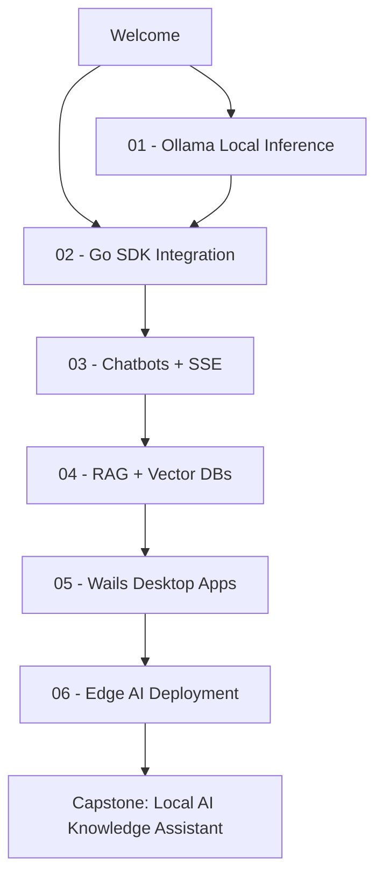
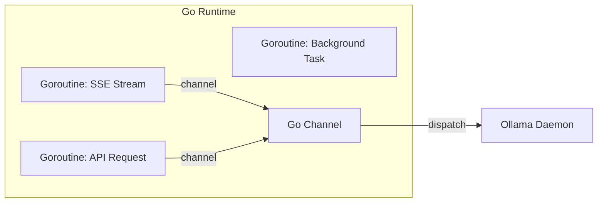

# 🤖 Welcome to Local AI with Go

## 🎯 Learning Objectives

By the end of this course, you will be able to:

- Architect and deploy local Large Language Model (LLM) inference pipelines using [[Ollama]] and Go.
- Design production-grade Go SDKs for RESTful AI services with streaming, retries, and structured error handling.
- Implement stateful conversational agents with context window management and Server-Sent Events (SSE).
- Build end-to-end Retrieval-Augmented Generation (RAG) systems integrating vector databases like [[Qdrant]] and [[Weaviate]].
- Develop cross-platform desktop AI applications using [[Wails]] with Go backends.
- Deploy quantized models to ARM edge devices using ONNX Runtime and Go.

## Introduction

The artificial intelligence revolution has predominantly been built on Python and cloud APIs. While this democratized experimentation, it introduced critical bottlenecks for production systems: vendor lock-in, data privacy exposure, network latency, and unpredictable operational costs. Running models locally—on your own hardware, under your own control—has emerged as the definitive architecture for privacy-sensitive, low-latency, and cost-effective AI systems.

[[Go]] (Golang) is uniquely positioned to power this local AI revolution. Designed at Google for systems programming, Go combines the performance of a compiled language with the ergonomics of a modern garbage-collected runtime. Its first-class concurrency model via goroutines and channels, static binary compilation, and minimal memory footprint make it the ideal substrate for building AI infrastructure—from high-throughput API gateways to resource-constrained edge devices.

This course bridges the gap between Go engineering and applied machine learning. You will not merely call APIs; you will understand the theoretical foundations of quantization, the architectural patterns of streaming inference, and the systems-level constraints of running billion-parameter models on commodity hardware. The capstone project—a Wails-based Local AI Knowledge Assistant—synthesizes every concept into a deployable desktop application.

## Module 0: The Local AI Landscape

### 0.1 Theoretical Foundation 🧠

The history of local AI is intertwined with the evolution of model compression. In 2017, the Transformer architecture revolutionized NLP but introduced quadratic memory complexity. The breakthrough came with quantization research—pioneered by the GGML project (now GGUF)—which demonstrated that 4-bit integer weights could retain 95%+ of model quality while reducing memory by 8x. This made it feasible to run 7B-parameter models on consumer laptops.

The theoretical motivation for local inference is rooted in information theory. Claude Shannon's work established that not all bits carry equal information; quantization exploits this by pruning low-entropy weight dimensions. Ollama, launched in 2023, abstracted GGUF model management into a Docker-like daemon, making local LLMs accessible to generalist engineers.

### 0.2 Mental Model 📐

Think of the local AI stack as a layered operating system for language models:

```
┌─────────────────────────────────────────────┐
│  Application Layer (Chatbots, RAG, Desktop) │
├─────────────────────────────────────────────┤
│  SDK Layer (Go Client, Streaming Parsers)   │
├─────────────────────────────────────────────┤
│  API Layer (Ollama REST / localhost:11434)  │
├─────────────────────────────────────────────┤
│  Runtime Layer (GGML / llama.cpp Inference) │
├─────────────────────────────────────────────┤
│  Hardware Layer (GPU VRAM / CPU RAM / Disk) │
└─────────────────────────────────────────────┘
```

Data flows downward as HTTP requests and upward as token streams:

```
User Input → JSON Payload → HTTP POST → GGUF Model → Token Generation
     ↑                                                    ↓
  UI Render ← SSE Stream ← NDJSON Chunks ← Autoregressive Loop
```

### 0.3 Syntax and Semantics 📝

The foundational Go type for this course is the `Client` struct:

```go
// LocalAIClient abstracts Ollama communication for reusable SDK design.
// WHY: Bundling BaseURL and HTTPClient prevents drift between configuration
// and request logic, following the idiomatic Go pattern of constructor functions.
type LocalAIClient struct {
	BaseURL    string        // e.g., "http://localhost:11434"
	HTTPClient *http.Client  // shared client enables connection reuse
}

// NewLocalAIClient initializes a client with sensible defaults.
// WHY: DefaultBaseURL eliminates magic strings; zero-timeout enables
// streaming without premature cancellation.
func NewLocalAIClient(base string) *LocalAIClient {
	if base == "" {
		base = "http://localhost:11434"
	}
	return &LocalAIClient{
		BaseURL:    base,
		HTTPClient: &http.Client{Timeout: 0},
	}
}
```

### 0.4 Visual Representation 🖼️

The course architecture visualized as a dependency graph:



Wikimedia references for foundational concepts:
- Transformer Architecture: https://commons.wikimedia.org/wiki/File:Transformer,_full_architecture.png
- Go Gopher Mascot: https://commons.wikimedia.org/wiki/File:Golang_Gopher_plain_logo.svg

### 0.5 Application in ML/AI Systems 🤖

| Organization | Use Case | Local AI Stack | Outcome |
|-------------|----------|----------------|---------|
| Healthcare SaaS | Clinical note summarization | Ollama + Llama 3 + Go API | HIPAA-compliant inference with zero data egress |
| Fintech Startup | Fraud pattern analysis | Mistral 7B + Go microservices | Sub-50ms P95 latency on internal servers |
| Defense Contractor | Air-gapped code generation | CodeLlama + Ollama + Wails | SOC 2 Type II compliance in classified environments |
| EdTech Platform | Student tutoring chatbot | Go SSE backend + local LLM | 90% reduction in API costs vs OpenAI |

### 0.6 Common Pitfalls ⚠️

⚠️ **Warning:** Treating local inference as "free" ignores hardware amortization. A GPU running 24/7 consumes significant electricity; always calculate Total Cost of Ownership (TCO) versus cloud API pricing.

⚠️ **Warning:** Underestimating RAM requirements leads to catastrophic swapping. When Linux OOM-killer terminates the Ollama daemon, all loaded models are evicted and concurrent requests fail.

💡 **Tip:** Start every project with a `docker-compose.yml` or systemd unit that sets `MemoryMax` and `MemorySwapMax` to prevent system-wide freezes during model loading.

### 0.7 Knowledge Check ❓

1. Why does quantization (e.g., Q4) reduce memory usage by approximately 75% compared to FP16, and what information-theoretic principle enables this?
2. Explain why Go's compiled static binaries are advantageous for deploying AI services to edge devices compared to Python interpreter-based deployments.

## Module 1: Why Go Powers Modern AI Infrastructure

### 1.1 Theoretical Foundation 🧠

Go was designed at Google in 2007 by Robert Griesemer, Rob Pike, and Ken Thompson to address the shortcomings of C++ in large-scale distributed systems. Its theoretical underpinnings draw from CSP (Communicating Sequential Processes) by Tony Hoare, which provides a formal model for concurrency without shared-memory pitfalls. In ML/AI infrastructure, this is transformative: inference servers must handle thousands of concurrent SSE streams, each backed by a goroutine, without the complexity of manual thread pooling.

The garbage collector in Go 1.22 features a sub-millisecond stop-the-world phase, making it suitable for real-time streaming systems where Python's GIL (Global Interpreter Lock) would serialize inference callbacks. From a type theory perspective, Go's structural interfaces enable polymorphic AI pipelines without inheritance overhead.

### 1.2 Mental Model 📐

Concurrency in Go versus Python for AI workloads:

```
Python GIL Model (Thread Serialization):
┌──────────────────────────────────────┐
│  Thread 1: Inference Callback        │
│  Thread 2: Blocked by GIL ───────────┤
│  Thread 3: Blocked by GIL ───────────┤
└──────────────────────────────────────┘

Go Goroutine Model (M:N Scheduling):
┌──────────────────────────────────────┐
│  Goroutine 1: Inference Stream ──────┤
│  Goroutine 2: Inference Stream ──────┤
│  Goroutine 3: Health Check ──────────┤
│  Goroutine 4: Metrics Export ────────┤
└──────────────────────────────────────┘
```

### 1.3 Syntax and Semantics 📝

Interface-based abstraction for swappable AI backends:

```go
// Model is the core abstraction for any text-generation backend.
// WHY: Structural typing means OllamaClient and OpenAIClient
// automatically satisfy this interface without explicit declarations.
type Model interface {
	Generate(ctx context.Context, prompt string) (string, error)
	Stream(ctx context.Context, prompt string) (<-chan Token, error)
}

// Token represents a single output fragment for real-time rendering.
// WHY: Wrapping a string in a struct allows future extension
// (e.g., adding Confidence scores or LogProbs without breaking callers).
type Token struct {
	Text string
	Done bool
}
```

### 1.4 Visual Representation 🖼️



Wikimedia:
- CSP Diagram: https://commons.wikimedia.org/wiki/File:CSP_logo.svg
- Go Logo: https://commons.wikimedia.org/wiki/File:Go_Logo_Blue.svg

### 1.5 Application in ML/AI Systems 🤖

| System | Go Role | AI Component | Performance Gain |
|--------|---------|-------------|------------------|
| Kubernetes | Control plane | N/A | Manages GPU node pools for AI workloads |
| Vector DB (Weaviate) | Core engine | HNSW indexing | 10x throughput vs Python implementations |
| Ollama | Daemon | GGUF inference | Native performance via CGO to llama.cpp |
| Hugging Face Tokenizers | Go bindings | BPE tokenization | Zero-copy string slicing |

### 1.6 Common Pitfalls ⚠️

⚠️ **Warning:** Using `interface{}` (any) for model responses sacrifices compile-time safety. Prefer generated structs or generic constraints when unmarshaling JSON from LLM APIs.

⚠️ **Warning:** Spawning unbounded goroutines per SSE connection causes memory exhaustion under load. Use `semaphore.Weighted` or a worker pool to limit concurrency.

💡 **Tip:** Profile goroutine leaks with `runtime.NumGoroutine()` exposed on a `/debug` endpoint; sudden spikes indicate missing `ctx.Done()` checks in stream parsers.

### 1.7 Knowledge Check ❓

1. How does Tony Hoare's CSP model map to Go's `chan` and `select` primitives, and why is this superior to thread-lock programming for streaming AI responses?
2. What is the practical consequence of Go's structural typing when swapping an Ollama backend for a cloud API backend in production?

## Capstone Preview

The capstone project—a Local AI Knowledge Assistant—integrates five subsystems: Ollama for inference, Qdrant for vector retrieval, a stateful conversation manager, SSE streaming, and a Wails cross-platform UI. This embodies the Lambda pattern adapted for single-machine AI, where streaming ingestion, batch embedding, and RAG-augmented serving coexist in one Go process.

## 📦 Compression Code

```go
package main

import (
	"context"
	"fmt"
	"net/http"
	"time"
)

// CourseClient is a minimal Ollama client demonstrating the patterns
// taught across all modules: interfaces, context, and streaming.
type CourseClient struct {
	URL string
}

func (c *CourseClient) Ping(ctx context.Context) error {
	req, _ := http.NewRequestWithContext(ctx, "GET", c.URL+"/api/tags", nil)
	resp, err := http.DefaultClient.Do(req)
	if err != nil {
		return err
	}
	defer resp.Body.Close()
	if resp.StatusCode != http.StatusOK {
		return fmt.Errorf("status %d", resp.StatusCode)
	}
	return nil
}

func main() {
	ctx, cancel := context.WithTimeout(context.Background(), 5*time.Second)
	defer cancel()
	client := &CourseClient{URL: "http://localhost:11434"}
	if err := client.Ping(ctx); err != nil {
		fmt.Println("Ollama unreachable:", err)
		return
	}
	fmt.Println("Local AI stack is ready.")
}
```

## 🎯 Documented Project

### Description

Build a **Course Readiness Checker**: a Go CLI tool that validates your local AI development environment before starting the capstone. It verifies Ollama availability, lists downloadable models, checks GPU/CPU resources, and estimates whether your hardware can run the target models.

### Functional Requirements

1. Ping `http://localhost:11434/api/tags` and report daemon status.
2. Parse the JSON tag list and display model names with parameter counts.
3. Accept a model name and quantization level, then compute `VRAM ≈ Params × Bits / 8`.
4. Read `/proc/meminfo` (Linux) or `sysctl` (macOS) to report available RAM.
5. Exit with code 0 if the environment is ready, code 1 if critical services are missing.

### Main Components

- **Health Probe:** Context-aware HTTP GET with 5-second timeout.
- **Resource Profiler:** OS-specific system memory and CPU detection.
- **VRAMEstimator:** Quantization-aware memory calculator with safety margins.
- **Reporter:** Tabular CLI output using `text/tabwriter`.

### Success Metrics

- Detects Ollama absence within 5 seconds.
- VRAM estimation accuracy within 15% of actual `ollama ps` reported memory.
- Cross-platform compilation for Linux, macOS, and Windows without CGO.

### References

- Ollama API: https://github.com/ollama/ollama/blob/main/docs/api.md
- Go `text/tabwriter`: https://pkg.go.dev/text/tabwriter
- Go `context` best practices: https://go.dev/blog/context
