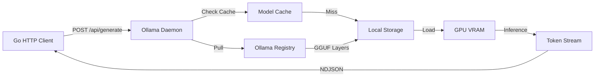
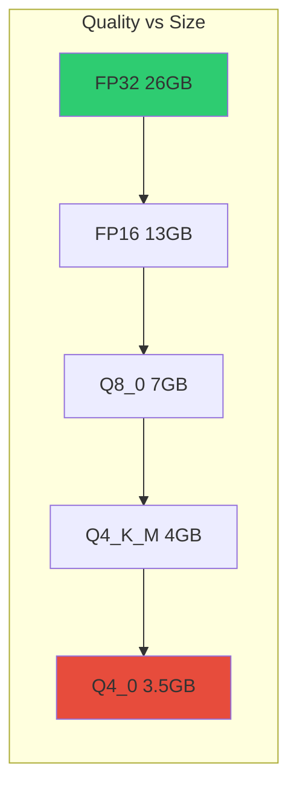
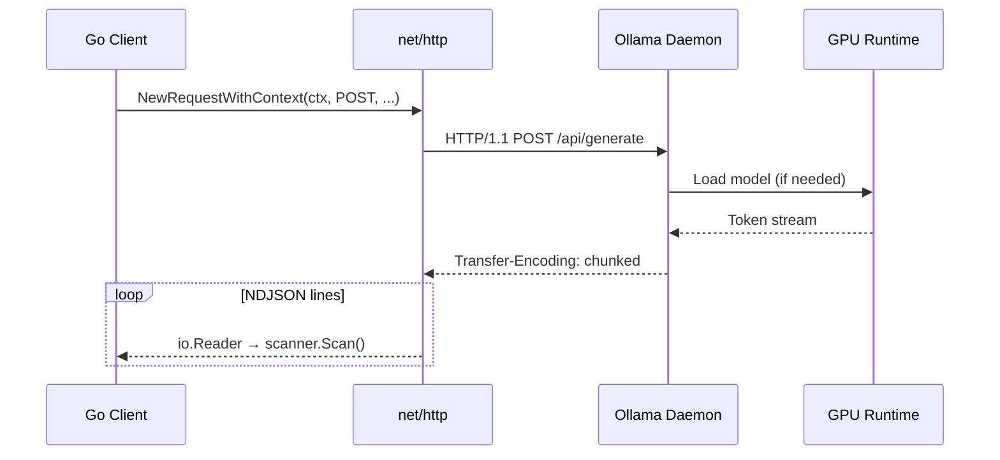

# 🦙 Running LLMs Locally with Ollama

## 🎯 Learning Objectives

By the end of this module, you will be able to:

- Explain the architectural layers of the Ollama daemon and how they abstract GGUF model management.
- Calculate VRAM requirements for quantized models using the `Params × Bits / 8` formula.
- Compare quantization formats (Q4_0, Q4_K_M, Q5_K_M, Q8_0, FP16) and select the optimal format for a given hardware constraint.
- Download, list, and delete models using the Ollama CLI and REST API.
- Implement a production-ready Go HTTP client that communicates with Ollama's `/api/generate` and `/api/tags` endpoints.
- Diagnose out-of-memory risks and hardware bottlenecks before loading models.

## Introduction

The modern software engineer faces a paradox: Large Language Models have become indispensable for tasks ranging from code generation to customer support, yet deploying them traditionally requires either expensive cloud API subscriptions or complex Python-based inference stacks. [[Ollama]] resolves this paradox by packaging model weights, tokenizers, and inference runtimes into a single daemon that behaves like a Docker engine for LLMs. It transforms the act of running a 7-billion-parameter model from a multi-day DevOps project into a single command: `ollama run llama3`.

From a machine learning systems perspective, Ollama represents a critical abstraction layer. It decouples the application developer from the intricacies of CUDA kernel selection, GGUF tensor layout, and autoregressive sampling loops. This separation of concerns is analogous to how relational databases abstract B-tree implementations behind SQL interfaces. For ML/AI practitioners, Ollama enables rapid experimentation with [[Llama 3]], [[Mistral]], and [[CodeLlama]] without requiring PyTorch, conda environments, or GPU driver debugging. The data never leaves the machine, making it the default architecture for privacy-sensitive AI.

In this module, we will deconstruct Ollama's architecture, master quantization theory, and build a Go HTTP client from scratch. These foundations are prerequisites for the SDK design, chatbot engineering, and RAG pipelines in subsequent modules.

## Module 1: Ollama Architecture and Core Concepts

### 1.1 Theoretical Foundation 🧠

Ollama's architecture is a deliberate synthesis of container orchestration principles and high-performance computing. The daemon model—borrowed from Docker—solves the cold-start problem inherent in LLM inference. Loading a 4GB quantized model into VRAM can take 5-30 seconds; by keeping a persistent daemon, Ollama amortizes this cost across requests. The theoretical basis for this is queuing theory: a single-server system with deterministic service times (once loaded) benefits significantly from keeping the server hot.

The Modelfile is Ollama's declarative configuration format, conceptually similar to a Dockerfile. It specifies a `FROM` directive (base model or local GGUF), `SYSTEM` prompts (persistent behavior instructions), and `PARAMETER` tunables such as `temperature` and `top_p`. From an information theory standpoint, temperature scales the logits before softmax application: `P(token) ∝ exp(logit / temperature)`. A temperature of 0 approaches argmax (deterministic), while 1.0 preserves the model's learned distribution.

### 1.2 Mental Model 📐

Ollama as a Docker-like engine for LLMs:

```
┌─────────────────────────────────────────────────────────────┐
│                        Developer CLI                         │
│  ollama run llama3    ollama pull mistral    ollama list    │
└─────────────────────────────────────────────────────────────┘
                              │
                              ▼
┌─────────────────────────────────────────────────────────────┐
│                    Ollama Daemon (:11434)                    │
│  ┌─────────────┐  ┌─────────────┐  ┌─────────────────────┐ │
│  │ HTTP Router │  │ Model Cache │  │  Modelfile Parser   │ │
│  └─────────────┘  └─────────────┘  └─────────────────────┘ │
└─────────────────────────────────────────────────────────────┘
                              │
              ┌───────────────┼───────────────┐
              ▼               ▼               ▼
        ┌──────────┐   ┌──────────┐   ┌──────────────┐
        │ Registry │   │  ~/.ollama/models/          │
        │ (GGUF)   │   │  (Layer Storage)            │
        └──────────┘   └──────────┘   └──────────────┘
                              │
                              ▼
        ┌──────────────────────────────────────────────────┐
        │              Inference Runtime (GGML)             │
        │     CUDA / ROCm / Metal / CPU (AVX2/NEON)       │
        └──────────────────────────────────────────────────┘
```

Request lifecycle through the daemon:

```
┌─────────┐   POST /api/generate   ┌──────────┐   Load/Check   ┌────────┐
│  Client │ ─────────────────────▶ │  Daemon  │ ─────────────▶ │ Cache  │
│  (Go)   │ ◀───────────────────── │  (11434) │ ◀───────────── │ (VRAM) │
└─────────┘   NDJSON Response      └──────────┘   Token Stream └────────┘
```

### 1.3 Syntax and Semantics 📝

A minimal Go client for the Ollama generate endpoint:

```go
package main

import (
	"bytes"
	"encoding/json"
	"fmt"
	"io"
	"net/http"
	"time"
)

// GenerateRequest mirrors Ollama's JSON schema for text generation.
// WHY: Explicit struct tags ensure zero-allocation unmarshaling
// and prevent field-name typos that silently drop parameters.
type GenerateRequest struct {
	Model  string `json:"model"`
	Prompt string `json:"prompt"`
	Stream bool   `json:"stream"`
}

// GenerateResponse captures the synchronous output fields.
// WHY: Embedding Done allows the same struct to service
// both sync and streaming modes in later refactoring.
type GenerateResponse struct {
	Response string `json:"response"`
	Done     bool   `json:"done"`
}

// generateWithOllama demonstrates synchronous local inference.
// WHY: A 120-second timeout accommodates first-token latency on CPU,
// while deferring resp.Body.Close() prevents connection leaks.
func generateWithOllama(prompt string) (string, error) {
	reqBody := GenerateRequest{
		Model:  "llama3",
		Prompt: prompt,
		Stream: false, // sync mode: wait for full response
	}
	jsonData, _ := json.Marshal(reqBody)

	client := &http.Client{Timeout: 120 * time.Second}
	resp, err := client.Post(
		"http://localhost:11434/api/generate",
		"application/json",
		bytes.NewBuffer(jsonData),
	)
	if err != nil {
		return "", fmt.Errorf("http post failed: %w", err)
	}
	defer resp.Body.Close()

	body, _ := io.ReadAll(resp.Body)
	var result GenerateResponse
	if err := json.Unmarshal(body, &result); err != nil {
		return "", fmt.Errorf("unmarshal failed: %w", err)
	}
	return result.Response, nil
}

func main() {
	response, err := generateWithOllama("Explain goroutines in one paragraph.")
	if err != nil {
		fmt.Println("Error:", err)
		return
	}
	fmt.Println(response)
}
```

### 1.4 Visual Representation 🖼️

Ollama component interaction:



Wikimedia references:
- Docker Architecture: https://commons.wikimedia.org/wiki/File:Docker_linux.svg
- Neural Network Inference: https://commons.wikimedia.org/wiki/File:Neural_network_example.svg

### 1.5 Application in ML/AI Systems 🤖

| Organization | Model | Quantization | Hardware | Use Case |
|-------------|-------|-------------|----------|----------|
| Private AI Startup | Llama 3 70B | Q4_K_M | 2x A100 40GB | Air-gapped contract analysis |
| Solo Developer | CodeLlama 7B | Q4_0 | RTX 3060 12GB | Local IDE autocomplete |
| Defense Agency | Mistral 7B | Q8_0 | Threadripper + 128GB RAM | Classified report generation |
| EdTech Nonprofit | Llama 3 8B | Q5_K_M | M2 MacBook Air | Offline student tutoring |

### 1.6 Common Pitfalls ⚠️

⚠️ **Warning:** Running multiple large models simultaneously can cause system OOM (Out Of Memory) crashes. Always monitor `nvidia-smi` or `htop` before loading a second model instance, as the OS may kill the Ollama daemon without warning.

⚠️ **Warning:** Using `ollama run` without first `ollama pull` triggers a blocking download during the first request. In production Go services, always pre-pull models via a startup health check or init container.

💡 **Tip:** You can create custom models by writing a `Modelfile` with a `FROM ./model.gguf` directive, allowing you to fine-tune behavior without re-quantizing weights. This is essential for domain-specific system prompts.

### 1.7 Knowledge Check ❓

1. Explain why Ollama's daemon architecture is superior to spawning a new inference process per request, using queuing theory or amortized cost analysis.
2. What is the mathematical relationship between temperature and the softmax probability distribution, and how does `top_p` nucleus sampling modify it?

## Module 2: Quantization and Hardware Requirements

### 2.1 Theoretical Foundation 🧠

Quantization is the process of mapping continuous values to a discrete set of levels. In deep learning, it refers to reducing the numerical precision of model weights and activations. The theoretical foundation dates to signal processing: Lloyd-Max quantization (1982) proved that optimal quantizers minimize mean-squared error by placing reproduction levels at centroids of probability density regions. Modern LLM quantization applies this to weight tensors, typically converting 32-bit floats (FP32) or 16-bit floats (FP16) to 4-bit integers.

The GGUF format (successor to GGML) implements several quantization schemes:
- **Q4_0:** Block-wise 4-bit with a single scale per block. Fast but lower accuracy.
- **Q4_K_M:** K-quants with mixed 4/6-bit importance matrices. Better preserves outlier weights.
- **Q5_K_M:** Higher precision for sensitive layers, trading 25% more memory for perceptible quality gains.
- **Q8_0:** Near-lossless for most practical purposes, doubling memory over Q4.

The VRAM estimation formula derives directly from information theory:
`VRAM = Parameters × Bits_per_Parameter / 8`
For a 7B model at Q4: `7×10^9 × 4 / 8 = 3.5×10^9 bytes ≈ 3.5 GB`

KV-cache memory (for attention keys and values during autoregressive generation) adds overhead proportional to `2 × num_layers × num_heads × head_dim × sequence_length × batch_size × bytes_per_param`. For long conversations, this can exceed the model weights themselves.

### 2.2 Mental Model 📐

Precision versus memory trade-off:

```
High Precision ──────────────────────────────────────▶ Low Precision

FP32 (32-bit)    FP16 (16-bit)    Q8_0 (8-bit)    Q4_K_M (4-bit)    Q4_0 (4-bit)
┌──────────┐     ┌──────────┐     ┌──────────┐     ┌──────────┐     ┌──────────┐
│██████████│     │████████  │     │██████    │     │████      │     │███       │
│  26GB    │     │  13GB    │     │  6.5GB   │     │  4GB     │     │  3.5GB   │
│ 100%     │     │  99%     │     │  98%     │     │  95%     │     │  90%     │
└──────────┘     └──────────┘     └──────────┘     └──────────┘     └──────────┘
```

Hardware capability spectrum:

```
Edge Device          Consumer GPU            Workstation              Data Center
┌────────────┐      ┌────────────┐          ┌────────────┐          ┌────────────┐
│ Raspberry  │      │ RTX 3060   │          │ RTX 4090   │          │ A100 80GB  │
│ Pi 5 8GB   │      │ 12GB VRAM  │          │ 24GB VRAM  │          │ 80GB VRAM  │
│ Q4 3B only │      │ Q4 7B-13B  │          │ Q4 70B     │          │ FP16 70B   │
└────────────┘      └────────────┘          └────────────┘          └────────────┘
```

### 2.3 Syntax and Semantics 📝

VRAM calculator in Go:

```go
package main

import (
	"fmt"
)

// Quantization maps human-readable names to bit widths.
// WHY: A map eliminates magic numbers and centralizes
// the supported formats for UI validation.
var Quantization = map[string]float64{
	"Q4_0":  4.0,
	"Q4_K_M": 4.5, // blended average due to mixed precision
	"Q5_K_M": 5.5,
	"Q8_0":  8.0,
	"FP16":  16.0,
}

// EstimateVRAM returns bytes required for a given model and quantization.
// WHY: Using float64 for bits allows fractional precision for blended
// quantizations, and the result is rounded up to the nearest MB.
func EstimateVRAM(paramsBillion float64, quant string) (int64, error) {
	bits, ok := Quantization[quant]
	if !ok {
		return 0, fmt.Errorf("unknown quantization: %s", quant)
	}
	bytesExact := paramsBillion * 1e9 * bits / 8.0
	// Add 10% overhead for KV-cache and activation buffers
	bytesWithOverhead := bytesExact * 1.1
	mb := int64(bytesWithOverhead / (1024 * 1024))
	return (mb + 1) * 1024 * 1024, nil // round up to next MB
}

func main() {
	vram, _ := EstimateVRAM(7.0, "Q4_K_M")
	fmt.Printf("Estimated VRAM: %.2f GB\n", float64(vram)/(1024*1024*1024))
}
```

### 2.4 Visual Representation 🖼️

Quantization impact on model quality:



Wikimedia:
- Quantization Diagram: https://commons.wikimedia.org/wiki/File:Quantized_signal.svg
- GPU Architecture: https://commons.wikimedia.org/wiki/File:Nvidia_A100_GPU.jpg

### 2.5 Application in ML/AI Systems 🤖

| Scenario | Model Size | Quantization | Hardware | Quality Metric |
|----------|-----------|-------------|----------|----------------|
| Real-time chat | 7B | Q4_K_M | RTX 3060 | Perplexity +5% vs FP16 |
| Code generation | 13B | Q5_K_M | RTX 3090 | HumanEval pass@1: 35% |
| Document summarization | 70B | Q4_K_M | 2x A100 | ROUGE-L: 0.42 |
| Edge translation | 3B | Q4_0 | Raspberry Pi 5 | BLEU: 28.5 |
| Research baseline | 7B | FP16 | RTX 4090 | Perplexity benchmark |

### 2.6 Common Pitfalls ⚠️

⚠️ **Warning:** Ignoring KV-cache overhead when estimating VRAM leads to runtime OOM during long conversations. The cache grows linearly with sequence length; add at least 15-20% headroom to static weight calculations.

⚠️ **Warning:** Q4_0 quantization on models smaller than 3B can cause catastrophic forgetting of factual knowledge due to aggressive rounding of outlier attention weights. Prefer Q4_K_M or Q5_K_M for models under 7B.

💡 **Tip:** Use `ollama ps` to inspect actual resident memory after loading a model; compare it to your estimator and calibrate your overhead constants empirically.

### 2.7 Knowledge Check ❓

1. Derive the VRAM formula from first principles: why do we divide by 8 when converting bits to bytes, and how does the KV-cache violate the static assumption of this formula?
2. Compare Q4_0 and Q4_K_M from an information-theoretic perspective. Why does K-quantization preserve more model quality despite using the same nominal bit width?

## Module 3: Go HTTP Client for Ollama

### 3.1 Theoretical Foundation 🧠

HTTP/1.1 and HTTP/2 form the transport layer for Ollama's API. From a networking perspective, local inference introduces an unusual latency profile: the request payload is tiny (a JSON string), but the response can be massive (thousands of tokens over 60-120 seconds). This violates the traditional assumption that response times are correlated with payload size. Go's `net/http` package handles this efficiently through `http.Transport`, which supports connection pooling, HTTP/2 multiplexing, and chunked transfer encoding.

The theoretical challenge in client design is backpressure: if the Go client cannot consume tokens as fast as Ollama generates them, TCP buffers fill and the daemon blocks. This is a classic producer-consumer problem. Go solves it naturally with goroutines and channels, allowing the HTTP reader to run concurrently with the application consumer. The `bufio.Scanner` with a custom split function is particularly effective for NDJSON (newline-delimited JSON) streams, as it yields one JSON object per line without buffering the entire response.

### 3.2 Mental Model 📐

Synchronous versus streaming client architecture:

```
Synchronous Client:
┌─────────┐  POST /api/generate  ┌─────────┐  Block 60s  ┌─────────┐
│   Go    │ ───────────────────▶ │ Ollama  │ ◀────────── │  Full   │
│  Client │ ◀─────────────────── │ Daemon  │  One JSON   │ Response│
└─────────┘                      └─────────┘             └─────────┘

Streaming Client:
┌─────────┐  POST /api/generate  ┌─────────┐  Token 1    ┌─────────┐
│   Go    │ ───────────────────▶ │ Ollama  │ ──────────▶ │  Go     │
│  Client │ ◀─────────────────── │ Daemon  │  Token 2    │ Channel │
│ (chan)  │  NDJSON Chunks       │         │ ──────────▶ │  ...    │
└─────────┘                      └─────────┘             └─────────┘
```

Connection pooling and reuse:

```
┌─────────────────────────────────────────────┐
│           http.Transport Pool               │
│  ┌─────┐  ┌─────┐  ┌─────┐  ┌─────┐       │
│  │Conn1│  │Conn2│  │Conn3│  │Conn4│       │
│  │idle │  │idle │  │busy │  │idle │       │
│  └─────┘  └─────┘  └─────┘  └─────┘       │
│  MaxIdleConns: 10  IdleConnTimeout: 90s    │
└─────────────────────────────────────────────┘
```

### 3.3 Syntax and Semantics 📝

Production-grade Ollama client with error handling:

```go
package main

import (
	"bytes"
	"context"
	"encoding/json"
	"fmt"
	"io"
	"net/http"
	"time"
)

// OllamaClient wraps configuration and provides typed methods.
// WHY: Struct encapsulation enables test-time mocking and
// runtime reconfiguration without global state.
type OllamaClient struct {
	BaseURL string
	Client  *http.Client
}

// NewOllamaClient constructs a client with production defaults.
// WHY: A timeout of 0 disables the global deadline, allowing
// streaming to continue indefinitely while context controls cancellation.
func NewOllamaClient(base string) *OllamaClient {
	if base == "" {
		base = "http://localhost:11434"
	}
	return &OllamaClient{
		BaseURL: base,
		Client:  &http.Client{Timeout: 0},
	}
}

// Generate performs a synchronous text completion.
// WHY: context.Context propagates cancellation from callers,
// preventing goroutine leaks when the user closes the connection.
func (o *OllamaClient) Generate(ctx context.Context, model, prompt string) (string, error) {
	payload := map[string]any{"model": model, "prompt": prompt, "stream": false}
	b, _ := json.Marshal(payload)

	req, _ := http.NewRequestWithContext(ctx, "POST", o.BaseURL+"/api/generate", bytes.NewReader(b))
	req.Header.Set("Content-Type", "application/json")

	resp, err := o.Client.Do(req)
	if err != nil {
		return "", fmt.Errorf("request failed: %w", err)
	}
	defer resp.Body.Close()

	if resp.StatusCode != http.StatusOK {
		body, _ := io.ReadAll(resp.Body)
		return "", fmt.Errorf("status %d: %s", resp.StatusCode, body)
	}

	var r struct{ Response string `json:"response"` }
	if err := json.NewDecoder(resp.Body).Decode(&r); err != nil {
		return "", fmt.Errorf("decode failed: %w", err)
	}
	return r.Response, nil
}

func main() {
	ctx, cancel := context.WithTimeout(context.Background(), 30*time.Second)
	defer cancel()

	client := NewOllamaClient("")
	response, err := client.Generate(ctx, "llama3", "Explain recursion.")
	if err != nil {
		fmt.Println("Error:", err)
		return
	}
	fmt.Println(response)
}
```

### 3.4 Visual Representation 🖼️

Client-Ollama request flow:



Wikimedia:
- HTTP Request Flow: https://commons.wikimedia.org/wiki/File:HTTP_request_flow.svg
- Client-Server Model: https://commons.wikimedia.org/wiki/File:Client-server-model.svg

### 3.5 Application in ML/AI Systems 🤖

| System | Client Pattern | Transport | Latency Target |
|--------|---------------|-----------|----------------|
| Internal CLI tool | Synchronous | HTTP/1.1 | < 5s per command |
| Chatbot backend | Streaming SSE | HTTP/1.1 chunked | < 500ms TTFB |
| Batch processor | Async + worker pool | HTTP/2 | Throughput > 10 req/s |
| Monitoring agent | Polling /api/ps | HTTP/1.1 | 1s intervals |
| Multi-model router | Connection pool | HTTP/2 multiplex | < 100ms routing |

### 3.6 Common Pitfalls ⚠️

⚠️ **Warning:** Forgetting to call `resp.Body.Close()` leaks TCP connections, eventually exhausting the ephemeral port range and causing `dial tcp: connect: cannot assign requested address`.

⚠️ **Warning:** Using a global `http.DefaultClient` for Ollama requests ignores the need for custom timeouts and transport tuning. Always instantiate a dedicated `http.Client` for inference workloads.

💡 **Tip:** Set `Transport.DisableCompression: true` when talking to localhost; gzip overhead is pure CPU waste for local loopback and adds latency without bandwidth savings.

### 3.7 Knowledge Check ❓

1. Why is backpressure a critical concern in LLM streaming clients, and how do Go channels naturally mitigate it compared to synchronous blocking I/O?
2. Explain why `http.Client{Timeout: 0}` is the correct configuration for streaming inference, and what mechanism should be used instead for deadline enforcement.

## 📦 Compression Code

```go
package main

import (
	"bufio"
	"bytes"
	"encoding/json"
	"fmt"
	"net/http"
	"os"
	"strings"
	"time"
)

// OllamaClient is a compressed, reusable client covering all module patterns.
type OllamaClient struct {
	BaseURL string
	Client  *http.Client
}

func NewOllamaClient(base string) *OllamaClient {
	if base == "" {
		base = "http://localhost:11434"
	}
	return &OllamaClient{
		BaseURL: base,
		Client:  &http.Client{Timeout: 120 * time.Second},
	}
}

func (o *OllamaClient) Generate(model, prompt string) (string, error) {
	payload := map[string]any{"model": model, "prompt": prompt, "stream": false}
	b, _ := json.Marshal(payload)
	resp, err := o.Client.Post(o.BaseURL+"/api/generate", "application/json", bytes.NewReader(b))
	if err != nil {
		return "", err
	}
	defer resp.Body.Close()
	var r struct{ Response string `json:"response"` }
	json.NewDecoder(resp.Body).Decode(&r)
	return r.Response, nil
}

func (o *OllamaClient) Chat(model string, messages []map[string]string) (string, error) {
	payload := map[string]any{"model": model, "messages": messages, "stream": false}
	b, _ := json.Marshal(payload)
	resp, err := o.Client.Post(o.BaseURL+"/api/chat", "application/json", bytes.NewReader(b))
	if err != nil {
		return "", err
	}
	defer resp.Body.Close()
	var r struct {
		Message struct{ Content string `json:"content"` } `json:"message"`
	}
	json.NewDecoder(resp.Body).Decode(&r)
	return r.Message.Content, nil
}

func main() {
	client := NewOllamaClient("http://localhost:11434")
	reader := bufio.NewReader(os.Stdin)
	fmt.Println("Ollama Go Client. Type 'exit' to quit.")
	for {
		fmt.Print("> ")
		input, _ := reader.ReadString('\n')
		input = strings.TrimSpace(input)
		if input == "exit" {
			break
		}
		res, err := client.Generate("llama3", input)
		if err != nil {
			fmt.Println("Error:", err)
			continue
		}
		fmt.Println(res)
	}
}
```

## 🎯 Documented Project

### Description

Build a command-line model manager that lists available Ollama models, estimates VRAM requirements for different quantization levels, and allows users to pull and delete models programmatically.

### Functional Requirements

1. Fetch and display all locally available models using Ollama's `/api/tags` endpoint.
2. Accept a model name and quantization level (Q4, Q5, Q8) as input and calculate estimated VRAM using `VRAM_needed ≈ Params × Bits / 8`.
3. Trigger model downloads via `/api/pull` and display progress.
4. Allow deletion of local models via `/api/delete`.
5. Validate hardware constraints before recommending a model to load.

### Main Components

- **Hardware Profiler:** Detects available RAM and GPU VRAM using OS-level calls.
- **Model Calculator:** Implements the quantization VRAM formula with safety buffers.
- **Ollama Controller:** Thin HTTP client wrapping the Ollama daemon API.
- **CLI Interface:** Uses `bufio` scanner for interactive model management.

### Success Metrics

- VRAM estimation is within 10% of actual Ollama memory usage.
- Model pull/delete operations complete without manual CLI intervention.
- Application prevents users from loading models that exceed available memory.

### References

- Ollama Documentation: https://github.com/ollama/ollama/blob/main/docs/api.md
- GGUF Quantization Formats: https://github.com/ggerganov/ggml/blob/master/docs/gguf.md
- Ollama Modelfile Reference: https://github.com/ollama/ollama/blob/main/docs/modelfile.md
