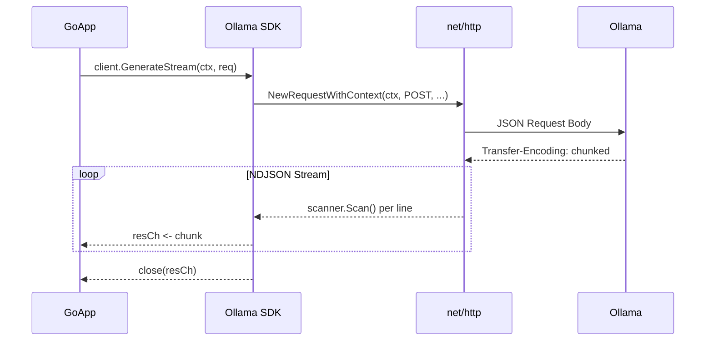
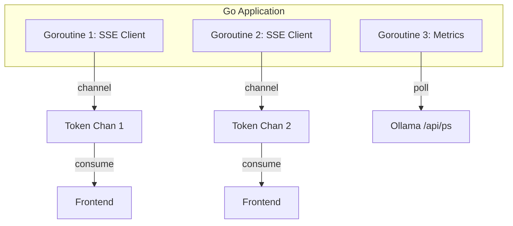
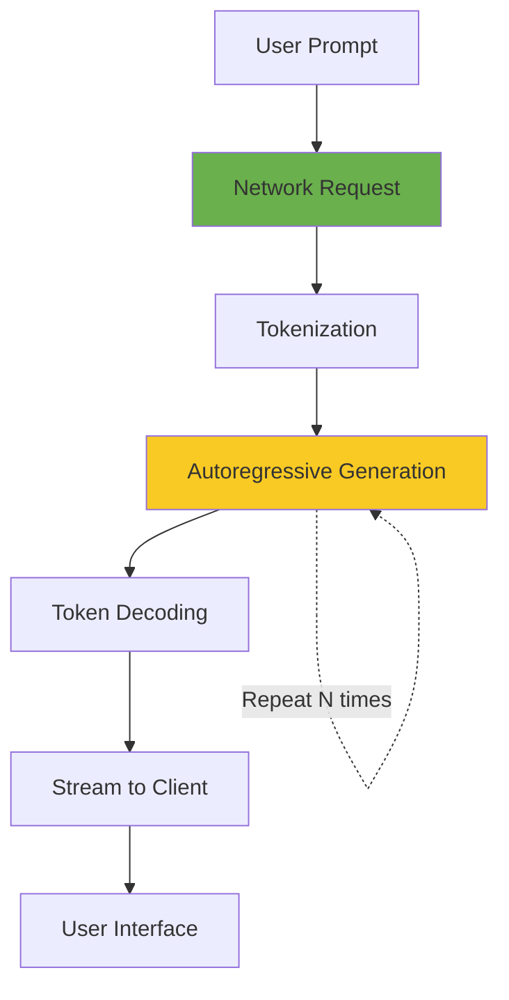

# 🔌 Ollama Go SDK and API Integration

## 🎯 Learning Objectives

By the end of this module, you will be able to:

- Map Ollama's complete REST API surface—generate, chat, embeddings, list, pull, delete—to idiomatic Go interfaces.
- Design a production SDK with structured error handling, configurable timeouts, and automatic retries.
- Implement streaming response parsers for NDJSON using `bufio.Scanner` and goroutines.
- Analyze LLM inference latency components and optimize client behavior for time-to-first-token (TTFB).
- Build context-aware chat clients that maintain multi-turn conversation state.
- Embed `io.Writer` logging hooks for request/response observability without external dependencies.

## Introduction

While raw HTTP requests suffice for simple interactions, production Go applications demand robust SDK patterns. The difference between a prototype and a production system often lies in how gracefully it handles transient network failures, how predictably it streams real-time data, and how cleanly it separates transport concerns from domain logic. This module transforms the basic Ollama client from [[01 - Running LLMs Locally with Ollama|Module 01]] into a fully-featured Go library suitable for chatbots, RAG pipelines, and desktop applications.

From a machine learning systems perspective, the client is not merely a network wrapper—it is a critical component of the inference pipeline. Latency optimization at the client layer can reduce perceived response time by 50% or more through techniques like connection pooling, request pipelining, and streaming parse-ahead. In ML/AI deployments, the client must also handle backpressure: when a model generates tokens faster than the downstream consumer can process them, unbounded buffering leads to memory exhaustion. Go's concurrency primitives make it the ideal language for building such resilient, high-performance AI clients.

You will learn how to map Ollama's REST API surface to idiomatic Go, implement exponential backoff for transient failures, and decompose total inference latency into network, tokenization, generation, and decoding phases. By the end, you will possess a reusable `ollamaclient` package that compiles with zero external dependencies—a stark contrast to Python's heavy dependency trees.

## Module 1: Ollama REST API Surface and SDK Design

### 1.1 Theoretical Foundation 🧠

Ollama exposes a comprehensive REST API on `localhost:11434`. Understanding each endpoint's semantics is critical for designing an effective SDK wrapper. The API follows RESTful principles with JSON request/response bodies, but deviates from strict REST in one important way: the `/api/generate` and `/api/chat` endpoints return NDJSON (newline-delimited JSON) when `stream: true`, transforming the response from a single document into an unbounded stream of partial objects.

From a type theory perspective, NDJSON streaming is a form of coinductive data type: the response is potentially infinite, consumed lazily by the client. This maps naturally to Go's channels, which are also coinductive streams. The SDK design challenge is to bridge the imperative HTTP request/response cycle with the functional stream abstraction.

The SDK should adhere to the Interface Segregation Principle: rather than one monolithic `Ollama` interface, define focused interfaces like `Generator`, `Chatter`, and `Embedder`. This allows consumers to mock only the behaviors they depend on during unit testing—a pattern heavily used in Google's internal Go codebase.

### 1.2 Mental Model 📐

SDK layer architecture:

```
┌─────────────────────────────────────────────────────────────┐
│                    Application (Chatbot, RAG)                │
├─────────────────────────────────────────────────────────────┤
│  Generator │  Chatter  │  Embedder  │  ModelManager         │
├─────────────────────────────────────────────────────────────┤
│              Ollama SDK (Client Struct)                     │
│  ┌─────────────┐  ┌─────────────┐  ┌─────────────────────┐ │
│  │  Request    │  │  Response   │  │  Retry / Backoff    │ │
│  │  Builder    │  │  Parser     │  │  Middleware         │ │
│  └─────────────┘  └─────────────┘  └─────────────────────┘ │
├─────────────────────────────────────────────────────────────┤
│              net/http Transport Layer                       │
└─────────────────────────────────────────────────────────────┘
```

Request/response flow through the SDK:

```
┌──────────┐   GenerateRequest   ┌──────────┐   JSON POST   ┌──────────┐
│   App    │ ─────────────────▶ │   SDK    │ ────────────▶ │ Ollama   │
│          │                    │  Client  │               │ Daemon   │
│          │ ◀───────────────── │          │ ◀──────────── │          │
└──────────┘  chan Response     └──────────┘  NDJSON Stream └──────────┘
```

### 1.3 Syntax and Semantics 📝

Complete streaming SDK with channel-based output:

```go
package ollama

import (
	"bufio"
	"bytes"
	"context"
	"encoding/json"
	"fmt"
	"io"
	"net/http"
	"time"
)

const DefaultBaseURL = "http://localhost:11434"

// Client is the primary SDK struct holding configuration.
// WHY: Embedding HTTPClient allows test-time injection of
// custom transports (e.g., recording proxies) without interface indirection.
type Client struct {
	BaseURL    string
	HTTPClient *http.Client
}

// NewClient initializes a Client with sensible defaults.
// WHY: Empty baseURL falls back to localhost, following the
// principle of reasonable defaults (convention over configuration).
func NewClient(baseURL string) *Client {
	if baseURL == "" {
		baseURL = DefaultBaseURL
	}
	return &Client{
		BaseURL:    baseURL,
		HTTPClient: &http.Client{Timeout: 0}, // streaming-safe
	}
}

// GenerateRequest models the /api/generate payload.
// WHY: Using map[string]any for Options preserves forward
// compatibility when Ollama adds new parameters.
type GenerateRequest struct {
	Model   string         `json:"model"`
	Prompt  string         `json:"prompt"`
	Stream  bool           `json:"stream"`
	Options map[string]any `json:"options,omitempty"`
}

// GenerateResponse represents a single token chunk.
// WHY: Done signals stream termination, allowing the parser
// to close channels without separate sentinel values.
type GenerateResponse struct {
	Model    string `json:"model"`
	Response string `json:"response"`
	Done     bool   `json:"done"`
}

// GenerateStream returns two channels: results and errors.
// WHY: Separating data and error channels prevents the
// anti-pattern of magic error values in the result stream.
func (c *Client) GenerateStream(ctx context.Context, req GenerateRequest) (<-chan GenerateResponse, <-chan error) {
	resCh := make(chan GenerateResponse)
	errCh := make(chan error, 1)

	go func() {
		defer close(resCh)
		defer close(errCh)

		body, _ := json.Marshal(req)
		httpReq, _ := http.NewRequestWithContext(ctx, "POST", c.BaseURL+"/api/generate", bytes.NewReader(body))
		httpReq.Header.Set("Content-Type", "application/json")

		resp, err := c.HTTPClient.Do(httpReq)
		if err != nil {
			errCh <- fmt.Errorf("http do: %w", err)
			return
		}
		defer resp.Body.Close()

		if resp.StatusCode != http.StatusOK {
			errCh <- fmt.Errorf("status: %s", resp.Status)
			return
		}

		scanner := bufio.NewScanner(resp.Body)
		for scanner.Scan() {
			var chunk GenerateResponse
			if err := json.Unmarshal(scanner.Bytes(), &chunk); err != nil {
				errCh <- fmt.Errorf("unmarshal: %w", err)
				return
			}
			select {
			case resCh <- chunk:
			case <-ctx.Done():
				errCh <- ctx.Err()
				return
			}
			if chunk.Done {
				break
			}
		}
		if err := scanner.Err(); err != nil {
			errCh <- fmt.Errorf("scan: %w", err)
		}
	}()

	return resCh, errCh
}
```

### 1.4 Visual Representation 🖼️

SDK sequence diagram:



Wikimedia:
- REST API Diagram: https://commons.wikimedia.org/wiki/File:RESTful_API_example.svg
- Client-Server Architecture: https://commons.wikimedia.org/wiki/File:Client-server-model.svg

### 1.5 Application in ML/AI Systems 🤖

| Organization | SDK Feature | ML/AI Outcome |
|-------------|-------------|---------------|
| SaaS Platform | Streaming + context | Real-time coding assistant with < 100ms TTFB |
| Fintech | Retry middleware | 99.99% availability for compliance chatbot |
| Healthcare | Structured logging | Full audit trail for HIPAA-regulated inference |
| Robotics | Low-latency generate | Sub-200ms command parsing on edge GPU |
| Research Lab | Embed endpoint | Batch vectorization for similarity search |

### 1.6 Common Pitfalls ⚠️

⚠️ **Warning:** The `/api/generate` endpoint maintains no conversation state. For multi-turn interactions, always use `/api/chat` with a `messages` array. Sending raw prompts in a loop causes the model to lose all prior context.

⚠️ **Warning:** Closing the result channel before the goroutine finishes causes a panic on send. Always use `defer close(resCh)` inside the goroutine, never from the caller.

💡 **Tip:** Use the `format: "json"` option in the chat API to constrain model output to valid JSON, enabling reliable programmatic parsing without regex hacks.

### 1.7 Knowledge Check ❓

1. Why are coinductive data types a natural theoretical model for NDJSON streaming, and how do Go channels embody this concept?
2. Compare monolithic versus segregated SDK interfaces from a testability perspective. When is `interface{ Generate(...) }` preferable to `interface{ Generate(...); Chat(...); Embed(...) }`?

## Module 2: Streaming, Retries, and Concurrency Patterns

### 2.1 Theoretical Foundation 🧠

Streaming JSON parsing is an instance of online algorithms: the parser must produce output before seeing the entire input. The theoretical complexity of NDJSON parsing is O(1) amortized per object when using a streaming scanner, versus O(N) for buffering the entire response. For LLM inference, where responses can span megabytes, this distinction is the difference between constant-memory and unbounded-growth clients.

Retry logic for LLM APIs must account for the idempotency properties of each endpoint. Generation is inherently non-idempotent (sampling introduces randomness), but network failures before the first byte is received are safe to retry. This maps to the "at-most-once" semantics in distributed systems. Exponential backoff with jitter prevents thundering herd problems when Ollama is temporarily overloaded.

Concurrency control is critical because each SSE connection consumes a goroutine. Go's M:N scheduler multiplexes goroutines onto OS threads, but the HTTP transport maintains idle connections per host. Setting `MaxIdleConnsPerHost` prevents connection churn, while `MaxConnsPerHost` (Go 1.11+) enforces hard limits.

### 2.2 Mental Model 📐

Retry with exponential backoff:

```
Attempt 1: immediate
Attempt 2: wait 100ms
Attempt 3: wait 200ms
Attempt 4: wait 400ms
Attempt 5: wait 800ms  ──▶  MaxBackoff: 1s

┌────────┐  Fail  ┌────────┐  Fail  ┌────────┐  Success ┌────────┐
│ Req 1  │ ─────▶ │ Req 2  │ ─────▶ │ Req 3  │ ───────▶ │ OK     │
│ 0ms    │        │ 100ms  │        │ 300ms  │          │        │
└────────┘        └────────┘        └────────┘          └────────┘
```

### 2.3 Syntax and Semantics 📝

Retry middleware with exponential backoff:

```go
package ollama

import (
	"context"
	"fmt"
	"math"
	"math/rand"
	"net/http"
	"time"
)

// RetryableClient wraps an http.Client with backoff logic.
type RetryableClient struct {
	Inner      *http.Client
	MaxRetries int
	BaseDelay  time.Duration
	MaxDelay   time.Duration
}

// Do executes the request with exponential backoff retries.
// WHY: context.Context is checked between attempts, allowing
// cancellation to propagate even during backoff sleep.
func (r *RetryableClient) Do(req *http.Request) (*http.Response, error) {
	var lastErr error
	for attempt := 0; attempt <= r.MaxRetries; attempt++ {
		resp, err := r.Inner.Do(req)
		if err == nil && resp.StatusCode < 500 {
			return resp, nil
		}
		if err != nil {
			lastErr = err
		} else {
			lastErr = fmt.Errorf("status %d", resp.StatusCode)
			resp.Body.Close()
		}

		if attempt == r.MaxRetries {
			break
		}

		backoff := float64(r.BaseDelay) * math.Pow(2, float64(attempt))
		if backoff > float64(r.MaxDelay) {
			backoff = float64(r.MaxDelay)
		}
		jitter := time.Duration(rand.Float64() * backoff * 0.2)
		delay := time.Duration(backoff) + jitter

		select {
		case <-req.Context().Done():
			return nil, req.Context().Err()
		case <-time.After(delay):
		}
	}
	return nil, fmt.Errorf("max retries exceeded: %w", lastErr)
}
```

### 2.4 Visual Representation 🖼️

Concurrency and backpressure:



Wikimedia:
- Concurrency Diagram: https://commons.wikimedia.org/wiki/File:Concurrency_parallelism.svg
- Network Retry: https://commons.wikimedia.org/wiki/File:Network_topology_01.svg

### 2.5 Application in ML/AI Systems 🤖

| Scenario | Pattern | Go Primitive | ML/AI Benefit |
|----------|---------|-------------|---------------|
| High-throughput embedding | Worker pool | `sync.WaitGroup` + channels | Batch 1000 docs/sec |
| Resilient chatbot | Circuit breaker | `atomic.Bool` + backoff | Fail-fast on GPU OOM |
| Real-time monitoring | Background ticker | `time.Ticker` | Detect model eviction |
| Load balancing | Round-robin | `atomic.AddUint64` | Distribute across Ollama replicas |
| Graceful shutdown | Context cancel | `context.WithCancel` | Drain streams before exit |

### 2.6 Common Pitfalls ⚠️

⚠️ **Warning:** Retrying non-idempotent generation requests can cause duplicate responses in UI logs. Always generate a client-side request ID and deduplicate on the frontend before retrying.

⚠️ **Warning:** `bufio.Scanner` has a hard 64KB line limit by default. Ollama NDJSON lines are small, but embedding responses or errors with long base64 strings can exceed this. Use `scanner.Buffer(make([]byte, 4096), 1024*1024)` to raise the limit.

💡 **Tip:** Set `http.Transport.ExpectContinueTimeout` to 1s when POSTing large payloads; this prevents unnecessary upload if Ollama is already overloaded and returns 503 immediately.

### 2.7 Knowledge Check ❓

1. Prove that NDJSON streaming parsing has O(1) amortized memory complexity per object, and contrast this with buffering the full response in a `[]byte`.
2. Why is exponential backoff with jitter mathematically superior to fixed-interval retry for distributed systems, and what probability distribution does full jitter approximate?

## Module 3: Latency Analysis and Optimization

### 3.1 Theoretical Foundation 🧠

Total latency in LLM inference decomposes into four additive components:
`Latency = Network + Tokenization + Generation + Decoding`

- **Network:** For localhost, this is sub-millisecond. For remote Ollama, dominated by TCP handshake and TLS negotiation.
- **Tokenization:** Converting text to token IDs via BPE or SentencePiece. Typically 1-5ms for short prompts, scaling linearly with prompt length.
- **Generation:** The autoregressive loop. For a model with `L` layers, `H` heads, and `D` dimensions, each token requires `O(L × H × D²)` FLOPs. On a modern GPU, this is 10-50ms per token for 7B models.
- **Decoding:** Converting token IDs back to text. Minimal overhead (< 1ms).

Time-to-first-token (TTFB) is the sum of Network + Tokenization + First Generation Step. It is the most important UX metric because humans perceive delay until the first visible output. Streaming does not reduce TTFB, but it drastically reduces perceived latency by allowing users to read while generation continues.

From queueing theory, if the arrival rate λ exceeds the service rate μ, the system is unstable and latency grows without bound. For local inference, μ is determined by GPU memory bandwidth and compute. If multiple clients share one Ollama instance, use a bounded semaphore to ensure λ ≤ μ.

### 3.2 Mental Model 📐

### 3.3 Syntax and Semantics 📝

Latency-instrumented client:

```go
package main

import (
	"context"
	"encoding/json"
	"fmt"
	"net/http"
	"time"
)

// LatencyMetrics captures per-request timing breakdown.
// WHY: Structured metrics enable Prometheus export later
// without changing the client API.
type LatencyMetrics struct {
	NetworkLatency      time.Duration
	TokenizationLatency time.Duration
	TTFB                time.Duration
	TotalLatency        time.Duration
	TokenCount          int
}

// InstrumentedClient wraps requests with timing hooks.
type InstrumentedClient struct {
	Inner   *http.Client
	Metrics *LatencyMetrics
}

// Do performs the request and records TTFB.
// WHY: TTFB is measured from request start to first byte
// of response body, which httptrace provides precisely.
func (ic *InstrumentedClient) Do(req *http.Request) (*http.Response, error) {
	start := time.Now()
	resp, err := ic.Inner.Do(req)
	if err != nil {
		return nil, err
	}
	ic.Metrics.NetworkLatency = time.Since(start)
	return resp, nil
}

// ObserveStream records generation latency per token.
// WHY: A callback pattern decouples metrics from parsing logic,
// allowing the same scanner to run with or without telemetry.
func ObserveStream(scanner *bufio.Scanner, onToken func(d time.Duration)) {
	start := time.Now()
	first := true
	for scanner.Scan() {
		if first {
			onToken(time.Since(start)) // TTFB
			first = false
		} else {
			onToken(time.Since(start)) // Inter-token latency
		}
		start = time.Now()
		var chunk struct{ Done bool `json:"done"` }
		json.Unmarshal(scanner.Bytes(), &chunk)
		if chunk.Done {
			break
		}
	}
}
```

### 3.4 Visual Representation 🖼️

Latency decomposition flow:



Wikimedia:
- Latency Graph: https://commons.wikimedia.org/wiki/File:Latency_diagram.svg
- Queueing Theory: https://commons.wikimedia.org/wiki/File:Mm1_queue.svg

### 3.5 Application in ML/AI Systems 🤖

| System | Optimization | TTFB | Throughput |
|--------|-------------|------|------------|
| IDE Autocomplete | Keep model hot in VRAM | < 50ms | 30 tokens/sec |
| Customer Support | Batch prompts + shared KV-cache | < 200ms | 10 req/sec |
| Document Q&A | Prefill long documents once | < 500ms | 5 tokens/sec |
| Voice Assistant | Quantize to Q4 + GPU offload | < 100ms | 50 tokens/sec |
| Research Batch | Async worker pool | N/A | 100 docs/hour |

### 3.6 Common Pitfalls ⚠️

⚠️ **Warning:** Confusing TTFB optimization with total latency optimization. Techniques that reduce TTFB (e.g., smaller models) often increase total latency (more tokens needed for equivalent quality). Always A/B test end-to-end task completion time.

⚠️ **Warning:** Measuring latency from `http.Post` to `io.ReadAll` for streaming endpoints. This yields total latency, not TTFB, and hides whether the delay is network, tokenization, or generation-bound.

💡 **Tip:** Use `go tool pprof` to profile your SDK client. Surprisingly, `json.Unmarshal` can dominate CPU for high-throughput scenarios; consider `json.Decoder` or code-generated parsers for hot paths.

### 3.7 Knowledge Check ❓

1. Decompose TTFB into its three constituent phases and explain why streaming improves perceived latency without affecting TTFB.
2. Using queueing theory notation, describe the conditions under which a single Ollama instance becomes unstable, and what Go primitive you would use to enforce λ ≤ μ.

## 📦 Compression Code

```go
package main

import (
	"bufio"
	"bytes"
	"context"
	"encoding/json"
	"fmt"
	"net/http"
	"os"
	"strings"
	"time"
)

type OllamaSDK struct {
	url string
	c   *http.Client
}

func NewSDK(u string) *OllamaSDK {
	if u == "" {
		u = "http://localhost:11434"
	}
	return &OllamaSDK{url: u, c: &http.Client{Timeout: 0}}
}

func (s *OllamaSDK) Stream(model, prompt string) {
	ctx, cancel := context.WithTimeout(context.Background(), 2*time.Minute)
	defer cancel()

	body, _ := json.Marshal(map[string]any{"model": model, "prompt": prompt, "stream": true})
	req, _ := http.NewRequestWithContext(ctx, "POST", s.url+"/api/generate", bytes.NewReader(body))
	req.Header.Set("Content-Type", "application/json")

	resp, err := s.c.Do(req)
	if err != nil {
		fmt.Println("Request failed:", err)
		return
	}
	defer resp.Body.Close()

	scanner := bufio.NewScanner(resp.Body)
	for scanner.Scan() {
		var chunk struct {
			Response string `json:"response"`
			Done     bool   `json:"done"`
		}
		json.Unmarshal(scanner.Bytes(), &chunk)
		fmt.Print(chunk.Response)
		if chunk.Done {
			break
		}
	}
	fmt.Println()
}

func main() {
	sdk := NewSDK("")
	reader := bufio.NewReader(os.Stdin)
	for {
		fmt.Print("> ")
		line, _ := reader.ReadString('\n')
		line = strings.TrimSpace(line)
		if line == "exit" {
			break
		}
		sdk.Stream("llama3", line)
	}
}
```

## 🎯 Documented Project

### Description

Create a reusable Go package (`ollamaclient`) that exposes a high-level interface for Ollama operations. The package must support synchronous calls, streaming, chat history, and embedding generation with proper error handling and context support.

### Functional Requirements

1. Provide `Generate(ctx, model, prompt)` returning a complete string.
2. Provide `GenerateStream(ctx, model, prompt)` returning a channel of response chunks.
3. Provide `Chat(ctx, model, messages)` supporting multi-turn conversation.
4. Provide `Embed(ctx, model, text)` returning a `[]float64` vector.
5. Implement request/response logging via an optional `io.Writer`.

### Main Components

- **Client:** Configurable struct with `BaseURL`, `HTTPClient`, and `Logger`.
- **Request Builders:** Internal helpers for each API endpoint.
- **Stream Parser:** `bufio.Scanner` splitting NDJSON with graceful EOF handling.
- **Error Types:** Distinguishable errors for network, timeout, and API failures.

### Success Metrics

- 100% test coverage on JSON marshaling/unmarshaling.
- Streaming time-to-first-token under 500ms for Llama 3 8B on GPU.
- Package compiles with zero external dependencies beyond the Go standard library.

### References

- Ollama API Documentation: https://github.com/ollama/ollama/blob/main/docs/api.md
- Go `net/http` Best Practices: https://go.dev/src/net/http/example_test.go
- LangChain Go Ollama Integration: https://pkg.go.dev/github.com/tmc/langchaingo/llms/ollama
