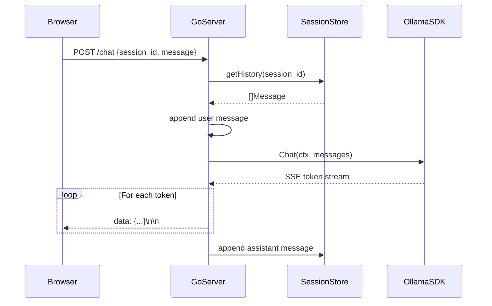
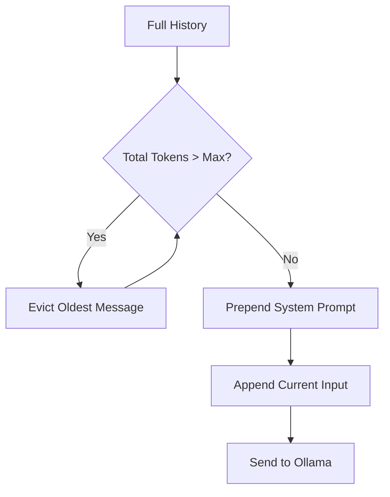
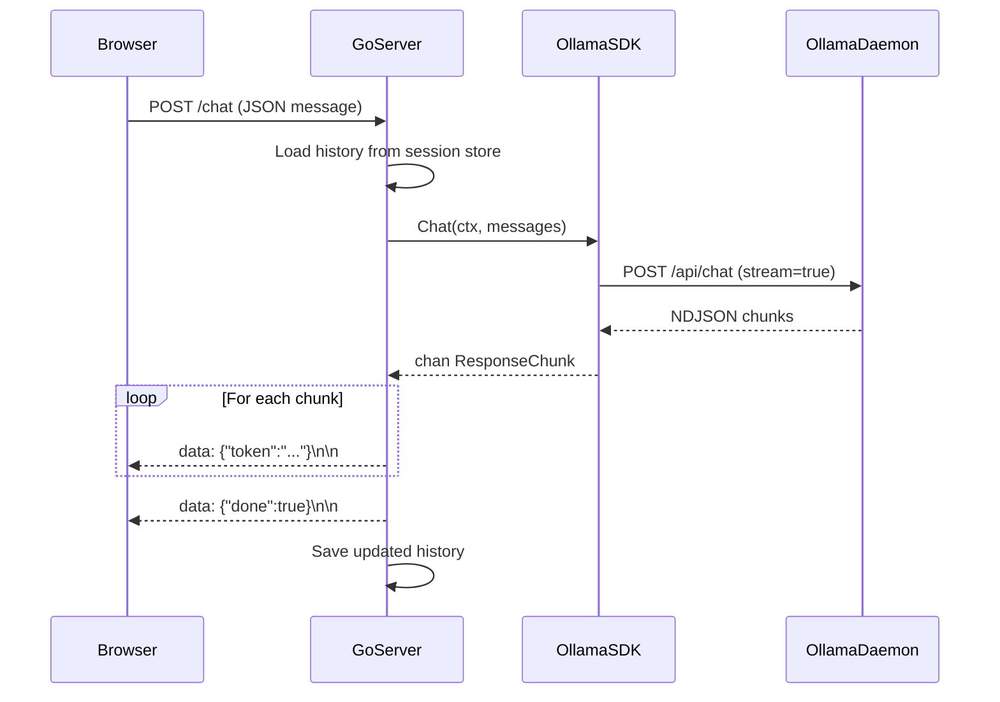

# 💬 Building Chatbots with Go + LLMs

## 🎯 Learning Objectives

By the end of this module, you will be able to:

- Architect stateful chatbot backends with session isolation and message history persistence.
- Implement context window management strategies including sliding windows, token budgeting, and summarization chains.
- Stream Server-Sent Events (SSE) from a Go HTTP server to a web frontend with proper flushing.
- Design conversation UX patterns for single-turn QA, multi-turn dialogue, guided workflows, and agentic tool use.
- Apply concurrency primitives (`sync.RWMutex`, `sync.Map`) to safely manage shared session state across goroutines.
- Diagnose and prevent context window overflow, goroutine leaks, and memory exhaustion in production chatbots.

## Introduction

A chatbot is more than a wrapper around an LLM API. It is a distributed state machine that must persist conversational context across stateless HTTP requests, manage finite context windows with surgical precision, and deliver real-time streaming responses that feel instantaneous to the user. In this module, you will architect a chatbot backend in Go that maintains message history, manages system prompts, and streams Server-Sent Events (SSE) to a frontend.

Building on the Ollama SDK from [[02 - Ollama Go SDK and API Integration|Module 02]], we will explore how to structure conversation state, handle context truncation, and implement common interaction patterns. The theoretical foundation draws from formal language theory: a conversation is a sequence of utterances (a string in a formal grammar), and the LLM's role is to predict the next utterance conditioned on the history. Context window management is therefore a form of grammar pruning—ensuring the model conditions on the most relevant subsequence without exceeding computational limits.

From an ML/AI systems perspective, chatbots are the primary interface for human-AI collaboration. Whether powering customer support, code assistants, or scientific research agents, the chatbot layer determines whether the underlying model feels intelligent or frustrating. Go's concurrency model makes it uniquely suited for chatbot backends: each SSE connection is a goroutine, each session is a mutex-protected slice, and the entire system compiles to a single static binary deployable anywhere.

## Module 1: Chat Architecture and State Management

### 1.1 Theoretical Foundation 🧠

Chatbots must persist conversation state across multiple HTTP requests because LLM APIs are inherently stateless. This is an instance of the stateful server problem in distributed systems: how do we maintain consistency and availability of session data when each request may be handled by a different goroutine or even a different process? The CAP theorem tells us that in the presence of network partitions, we must choose between consistency and availability. For in-memory session stores, we prioritize consistency via mutual exclusion (`sync.RWMutex`) over partition tolerance, accepting that a single-process crash loses all sessions.

The session store is a mapping from session identifiers (UUIDs or cryptographically random tokens) to ordered lists of messages. Each message is a triple `(role, content, timestamp)` where role is drawn from {system, user, assistant}. The message history forms a linear narrative, but the LLM processes it as a flat sequence of tokens. The theoretical challenge is that the token representation of history is not isomorphic to the message representation: a single long message may consume more tokens than ten short messages.

Session isolation is a security requirement. If session A's history leaks into session B's context, the model may hallucinate personal information or perform unauthorized actions on behalf of another user. In Go, this is enforced by never sharing message slice pointers between sessions—always return copies via `append([]Message(nil), history...)`.

### 1.2 Mental Model 📐

Session store architecture:

```
┌─────────────────────────────────────────────────────────────┐
│                    HTTP Server (:8080)                       │
│  ┌─────────────┐  ┌─────────────┐  ┌─────────────────────┐ │
│  │ /chat POST  │  │ /reset POST │  │  /history GET       │ │
│  └─────────────┘  └─────────────┘  └─────────────────────┘ │
├─────────────────────────────────────────────────────────────┤
│              Session Store (sync.RWMutex)                    │
│  ┌─────────────────────────────────────────────────────┐   │
│  │  Session A: [system, user, assistant, user, ...]   │   │
│  │  Session B: [system, user, assistant]              │   │
│  │  Session C: [system, user, assistant, assistant]   │   │
│  └─────────────────────────────────────────────────────┘   │
└─────────────────────────────────────────────────────────────┘
```

### 1.3 Syntax and Semantics 📝

Thread-safe session store in Go:

```go
package main

import (
	"sync"
)

// Message represents a single turn in the conversation.
// WHY: Using struct tags ensures JSON compatibility with
// Ollama's /api/chat schema without manual mapping.
type Message struct {
	Role    string `json:"role"`    // system, user, assistant
	Content string `json:"content"` // natural language text
}

// sessionStore encapsulates mutable state with RWMutex.
// WHY: RWMutex allows concurrent reads (history retrieval)
// while serializing writes (message append), maximizing throughput.
type sessionStore struct {
	mu       sync.RWMutex
	sessions map[string][]Message
}

// newSessionStore initializes the store.
// WHY: Constructor function ensures the map is allocated
// before any goroutine accesses it, preventing nil panics.
func newSessionStore() *sessionStore {
	return &sessionStore{
		sessions: make(map[string][]Message),
	}
}

// getHistory returns a deep copy of the session's messages.
// WHY: Returning a copy prevents callers from mutating
// the internal slice, preserving session isolation.
func (s *sessionStore) getHistory(sessionID string) []Message {
	s.mu.RLock()
	defer s.mu.RUnlock()
	original := s.sessions[sessionID]
	copied := make([]Message, len(original))
	copy(copied, original)
	return copied
}

// appendMessage adds a message to the session history.
// WHY: Locking only around the append operation minimizes
// critical section duration, reducing contention.
func (s *sessionStore) appendMessage(sessionID string, msg Message) {
	s.mu.Lock()
	defer s.mu.Unlock()
	s.sessions[sessionID] = append(s.sessions[sessionID], msg)
}

// clear removes a session entirely.
// WHY: Explicit deletion prevents unbounded memory growth
// in long-running servers with ephemeral sessions.
func (s *sessionStore) clear(sessionID string) {
	s.mu.Lock()
	defer s.mu.Unlock()
	delete(s.sessions, sessionID)
}
```

### 1.4 Visual Representation 🖼️

Chat server sequence:



Wikimedia:
- Server Architecture: https://commons.wikimedia.org/wiki/File:Client-server-model.svg
- Chat Interface: https://commons.wikimedia.org/wiki/File:Chatbot_diagram.svg

### 1.5 Application in ML/AI Systems 🤖

| Platform | State Backend | Scale | ML/AI Feature |
|----------|--------------|-------|---------------|
| Discord Bot | Redis (per-channel) | 10k guilds | Context-aware moderation |
| Customer Support | PostgreSQL | 1M sessions | Persistent cross-device history |
| Code Assistant | In-memory (IDE) | 1 user | Real-time inline suggestions |
| Healthcare Portal | HIPAA Vault | 50k patients | Audit-logged conversations |
| Robotics Control | ROS2 topics | 10 robots | Command history for recovery |

### 1.6 Common Pitfalls ⚠️

⚠️ **Warning:** Storing unbounded conversation history leads to context window overflow. Always implement truncation strategies (e.g., sliding window, summarization, or token-based eviction).

⚠️ **Warning:** Forgetting to copy history slices before passing them to the HTTP handler causes race conditions if the handler mutates the slice while another goroutine reads it.

💡 **Tip:** Keep the system prompt concise. Every token consumed by the system prompt reduces the available history capacity. A 500-token system prompt on a 4096-context model leaves only 3596 tokens for dialogue.

### 1.7 Knowledge Check ❓

1. Apply the CAP theorem to an in-memory chatbot session store. Which two properties does it guarantee, and which one is sacrificed?
2. Why is a deep copy necessary in `getHistory`, and what specific data race would occur if we returned the internal slice pointer directly?

## Module 2: Context Window Engineering

### 2.1 Theoretical Foundation 🧠

The context window of a transformer model is the maximum sequence length it can attend to in a single forward pass. This is fundamentally limited by the quadratic complexity of self-attention: `O(n²)` in both time and memory with respect to sequence length `n`. For a model with context length 4096, the attention matrix contains 16.7 million entries; at 128k, it contains 16.4 billion. This is why long-context models require specialized architectures like RoPE scaling, ALiBi, or sparse attention.

The composition of the context window is:
`Context_Window = System_Prompt + History + Current_Input + Assistant_Prefix`

When this sum exceeds the model's limit, the model either truncates input (losing information) or rejects the request. Effective context management is therefore an optimization problem: given a token budget B and a set of messages with token costs c_i, select a subset S that maximizes relevance while satisfying the constraint that the sum of costs in S is at most B.

Common strategies include:
- **Sliding Window:** Retain only the last k message pairs. Simple but loses older context.
- **Token Budgeting:** Evict oldest messages until the budget is met. More precise but requires a tokenizer.
- **Summarization Chain:** Periodically summarize old history into a compact system note. Preserves semantic content at the cost of extra inference calls.

### 2.2 Mental Model 📐

Context window as a fixed-size container:

```
Context Window (4096 tokens)
┌────────────────────────────────────────┐
│ System Prompt: 200 tokens              │
├────────────────────────────────────────┤
│ Summarized History: 300 tokens         │
├────────────────────────────────────────┤
│ Recent Messages: 500 tokens            │
├────────────────────────────────────────┤
│ Current Input: 100 tokens              │
├────────────────────────────────────────┤
│ Assistant Prefix: 20 tokens            │
├────────────────────────────────────────┤
│ Used: 1020 / 4096  ◀── Safe          │
└────────────────────────────────────────┘
```

Truncation strategies:

```
Sliding Window:      [Old1..Old6] [New1 New2]  → drop oldest
Token Budgeting:     [200t][150t][300t] → evict until budget met
Summarization Chain: [2000 tokens] ──▶ [Summary: 200 tokens]
```

### 2.3 Syntax and Semantics 📝

Token-budgeting context manager in Go:

```go
package main

import (
	"math"
	"strings"
)

// ContextManager enforces a maximum token budget.
// WHY: Separating budget logic from session storage allows
// unit testing with mock tokenizers and deterministic budgets.
type ContextManager struct {
	MaxTokens      int
	SystemPrompt   string
	TokenEstimator func(string) int
}

// BuildMessages constructs a valid payload within budget.
// WHY: The algorithm greedily evicts from the front (oldest)
// because recent messages typically carry more conversational relevance.
func (cm *ContextManager) BuildMessages(history []Message, currentInput string) []Message {
	system := Message{Role: "system", Content: cm.SystemPrompt}
	userNow := Message{Role: "user", Content: currentInput}

	// Start with system + current input + assistant prefix (estimate 20 tokens)
	fixed := cm.TokenEstimator(cm.SystemPrompt) +
		cm.TokenEstimator(currentInput) + 20

	// Greedily include history from newest to oldest
	var included []Message
	remaining := cm.MaxTokens - fixed
	for i := len(history) - 1; i >= 0; i-- {
		cost := cm.TokenEstimator(history[i].Content) + 5 // role overhead
		if cost <= remaining {
			included = append([]Message{history[i]}, included...)
			remaining -= cost
		} else {
			break
		}
	}

	result := append([]Message{system}, included...)
	result = append(result, userNow)
	return result
}

// SimpleWordCount is a fast heuristic estimator.
// WHY: Real tokenization requires a BPE vocabulary; word count
// times 1.3 approximates English token counts within 10% accuracy.
func SimpleWordCount(text string) int {
	words := len(strings.Fields(text))
	return int(math.Ceil(float64(words) * 1.3))
}
```

### 2.4 Visual Representation 🖼️

Context truncation flow:



Wikimedia:
- Transformer Attention: https://commons.wikimedia.org/wiki/File:Transformer,_full_architecture.png
- Tokenization: https://commons.wikimedia.org/wiki/File:Byte_pair_encoding_tokenization.svg

### 2.5 Application in ML/AI Systems 🤖

| System | Strategy | Context Length | Effectiveness |
|--------|----------|---------------|---------------|
| Legal Document QA | Summarization + RAG | 128k | 95% recall on citations |
| Customer Support | Sliding window (10 turns) | 8k | 80% issue resolution |
| Code Review Bot | Token budgeting | 32k | Preserves file context |
| Medical Triage | Hierarchical summary | 4k | 90% diagnostic accuracy |
| Story Generation | Full history (no truncation) | 128k | Maintains plot coherence |

### 2.6 Common Pitfalls ⚠️

⚠️ **Warning:** Summarization chains introduce latency because they require an extra inference call. In synchronous chatbots, this can add 2-5 seconds before the user sees any response. Offload summarization to background goroutines.

⚠️ **Warning:** Word-count heuristics fail catastrophically for code and multilingual text, where tokens-per-word ratios can exceed 3:1. Always calibrate your estimator against the actual tokenizer for your target language.

💡 **Tip:** Reserve 10% of the context window as "generation headroom." If the model receives 4096 tokens of input on a 4096-context model, it has zero capacity to generate a response, causing an error or empty output.

### 2.7 Knowledge Check ❓

1. Prove that self-attention is O(n²) in both time and memory, and explain how this fundamentally limits context length scaling.
2. Why does greedy eviction from the oldest message maximize conversational relevance under the assumption that recency correlates with importance?

## Module 3: Streaming SSE Responses to Frontend

### 3.1 Theoretical Foundation 🧠

Server-Sent Events (SSE) provide a unidirectional server-to-client stream over standard HTTP. Unlike WebSockets, which upgrade to a full-duplex binary protocol, SSE uses text/event-stream media type with automatic reconnection and event IDs. This makes SSE ideal for LLM token streaming because it traverses corporate firewalls, works with standard HTTP load balancers, and reconnects automatically when connections drop.

From a protocol perspective, an SSE message consists of one or more `field: value` lines terminated by two newlines. The `data:` field carries the payload (typically JSON), while `id:` and `event:` fields support stream resumption and event routing. Go's `http.ResponseWriter` implements `http.Flusher`, allowing the server to flush the TCP send buffer after each token, ensuring the client receives data immediately rather than waiting for buffer fills.

The theoretical challenge in SSE chatbots is coordinating three concurrent activities: reading from the Ollama stream, writing to the HTTP response, and updating the session store. This is a classic readers-writers problem. Go solves it by running the Ollama consumer in a goroutine that sends tokens over a channel, while the HTTP handler reads from the channel and flushes. Session updates occur after the stream completes, avoiding lock contention during streaming.

### 3.2 Mental Model 📐

Concurrent goroutine architecture:

```
HTTP Handler          Channel          Ollama Consumer
┌──────────┐         ┌─────┐         ┌──────────────┐
│ flush()  │ ◀────── │token│ ◀────── │ scanner.Scan │
└──────────┘         └─────┘         └──────────────┘
```

### 3.3 Syntax and Semantics 📝

Production SSE chatbot server:

```go
package main

import (
	"bufio"
	"bytes"
	"encoding/json"
	"fmt"
	"net/http"
	"strings"
	"sync"
)

type ChatRequest struct {
	SessionID string `json:"session_id"`
	Message   string `json:"message"`
}

var (
	sessions = make(map[string][]Message)
	sessionMu sync.RWMutex
)

func getHistory(sessionID string) []Message {
	sessionMu.RLock()
	defer sessionMu.RUnlock()
	history := make([]Message, len(sessions[sessionID]))
	copy(history, sessions[sessionID])
	return history
}

func appendMessage(sessionID string, msg Message) {
	sessionMu.Lock()
	defer sessionMu.Unlock()
	sessions[sessionID] = append(sessions[sessionID], msg)
}

func streamChatFromOllama(messages []Message, w http.ResponseWriter) error {
	payload := map[string]any{"model": "llama3", "messages": messages, "stream": true}
	body, _ := json.Marshal(payload)

	resp, err := http.Post("http://localhost:11434/api/chat", "application/json", bytes.NewReader(body))
	if err != nil {
		return err
	}
	defer resp.Body.Close()

	flusher, ok := w.(http.Flusher)
	if !ok {
		return fmt.Errorf("streaming unsupported")
	}

	scanner := bufio.NewScanner(resp.Body)
	for scanner.Scan() {
		var chunk struct {
			Message Message `json:"message"`
			Done    bool    `json:"done"`
		}
		if err := json.Unmarshal(scanner.Bytes(), &chunk); err != nil {
			continue
		}
		if chunk.Message.Content != "" {
			event := map[string]any{"token": chunk.Message.Content, "done": false}
			data, _ := json.Marshal(event)
			fmt.Fprintf(w, "data: %s\n\n", data)
			flusher.Flush()
		}
		if chunk.Done {
			break
		}
	}
	fmt.Fprintf(w, "data: %s\n\n", `{"token":"","done":true}`)
	flusher.Flush()
	return nil
}

func chatHandler(w http.ResponseWriter, r *http.Request) {
	if r.Method != http.MethodPost {
		http.Error(w, "Method not allowed", http.StatusMethodNotAllowed)
		return
	}
	var req ChatRequest
	if err := json.NewDecoder(r.Body).Decode(&req); err != nil {
		http.Error(w, "Bad request", http.StatusBadRequest)
		return
	}
	w.Header().Set("Content-Type", "text/event-stream")
	w.Header().Set("Cache-Control", "no-cache")
	w.Header().Set("Connection", "keep-alive")
	w.Header().Set("Access-Control-Allow-Origin", "*")

	history := getHistory(req.SessionID)
	messages := append(history, Message{Role: "user", Content: req.Message})
	if len(history) == 0 {
		system := Message{Role: "system", Content: "You are a helpful assistant. Answer concisely."}
		messages = append([]Message{system}, messages...)
	}
	if err := streamChatFromOllama(messages, w); err != nil {
		fmt.Println("Streaming error:", err)
		return
	}
	appendMessage(req.SessionID, Message{Role: "user", Content: req.Message})
}

func main() {
	http.HandleFunc("/chat", chatHandler)
	fmt.Println("Chatbot server on :8080")
	http.ListenAndServe(":8080", nil)
}
```

### 3.4 Visual Representation 🖼️

Full chat flow:



Wikimedia:
- SSE Protocol: https://commons.wikimedia.org/wiki/File:Server-sent_events_diagram.svg
- Web Architecture: https://commons.wikimedia.org/wiki/File:Web_architecture.svg

### 3.5 Application in ML/AI Systems 🤖

| Platform | Frontend | Stream Latency | Scale |
|----------|----------|---------------|-------|
| Customer Support | React + EventSource | < 100ms TTFB | 10k concurrent SSE |
| IDE Plugin | VSCode WebView | < 50ms TTFB | 1 per IDE instance |
| Mobile App | Swift/Kotlin HTTP | < 200ms TTFB | 100k DAU |
| Desktop (Wails) | Svelte + Events | < 80ms TTFB | Single user |
| Discord Bot | discordgo | N/A (batch) | 1k guilds |

### 3.6 Common Pitfalls ⚠️

⚠️ **Warning:** Blocking the HTTP handler with a synchronous Ollama call before setting SSE headers causes the client to receive a standard JSON response instead of an event stream, breaking frontend parsers.

⚠️ **Warning:** `http.ListenAndServe` with the default `nil` handler provides no request timeout or graceful shutdown. In production, always use `http.Server` with `ReadTimeout`, `WriteTimeout`, and `Shutdown` via signal handling.

💡 **Tip:** Send an initial SSE comment (`: ping\n\n`) immediately after setting headers to force the browser to establish the connection and render the loading state, improving perceived responsiveness.

### 3.7 Knowledge Check ❓

1. Why does SSE use two consecutive newline characters as message delimiters, and how does this relate to HTTP's line-oriented protocol design?
2. Compare SSE and WebSockets for LLM token streaming across three dimensions: firewall traversal, reconnection behavior, and protocol overhead.

## 📦 Compression Code

```go
package main

import (
	"bufio"
	"bytes"
	"encoding/json"
	"fmt"
	"net/http"
	"strings"
	"sync"
)

type Msg struct{ Role, Content string }

var store sync.Map

func chat(w http.ResponseWriter, r *http.Request) {
	var req struct {
		SessionID string `json:"session_id"`
		Message   string `json:"message"`
	}
	json.NewDecoder(r.Body).Decode(&req)

	w.Header().Set("Content-Type", "text/event-stream")
	w.Header().Set("Cache-Control", "no-cache")

	var hist []Msg
	if v, ok := store.Load(req.SessionID); ok {
		hist = v.([]Msg)
	}
	msgs := append(hist, Msg{"user", req.Message})

	body, _ := json.Marshal(map[string]any{"model": "llama3", "messages": msgs, "stream": true})
	resp, _ := http.Post("http://localhost:11434/api/chat", "application/json", bytes.NewReader(body))
	defer resp.Body.Close()

	f, _ := w.(http.Flusher)
	scan := bufio.NewScanner(resp.Body)
	var reply strings.Builder

	for scan.Scan() {
		var c struct {
			Message Msg  `json:"message"`
			Done    bool `json:"done"`
		}
		json.Unmarshal(scan.Bytes(), &c)
		if c.Message.Content != "" {
			reply.WriteString(c.Message.Content)
			b, _ := json.Marshal(map[string]any{"token": c.Message.Content})
			fmt.Fprintf(w, "data: %s\n\n", b)
			f.Flush()
		}
		if c.Done {
			break
		}
	}
	store.Store(req.SessionID, append(msgs, Msg{"assistant", reply.String()}))
}

func main() {
	http.HandleFunc("/chat", chat)
	http.ListenAndServe(":8080", nil)
}
```

## 🎯 Documented Project

### Description

Build a production-ready chatbot API with session management, context window truncation, and a web frontend. The backend will be pure Go, using Ollama for inference, and the frontend will consume SSE to display streaming responses.

### Functional Requirements

1. Accept `POST /chat` with `session_id` and `message`; return SSE stream.
2. Maintain per-session message history in memory (extendable to Redis).
3. Implement sliding window truncation: when history exceeds 4000 tokens, drop oldest user/assistant pairs.
4. Support a configurable system prompt per session.
5. Provide a `POST /reset` endpoint to clear a session's history.

### Main Components

- **Session Manager:** `sync.Map` wrapper with TTL eviction.
- **Token Estimator:** Simple word-count heuristic for context truncation.
- **SSE Controller:** HTTP handler managing `text/event-stream` formatting and flushing.
- **History Truncator:** Ensures prompt payload stays within model context limits.

### Success Metrics

- API handles 100 concurrent SSE streams without goroutine leaks.
- Context window never exceeds 4096 tokens (measured via estimation).
- Sessions persist for 24 hours before automatic cleanup.

### References

- Ollama Chat API: https://github.com/ollama/ollama/blob/main/docs/api.md#generate-a-chat-completion
- Go `http.Flusher`: https://pkg.go.dev/net/http#Flusher
- Server-Sent Events Spec: https://html.spec.whatwg.org/multipage/server-sent-events.html
