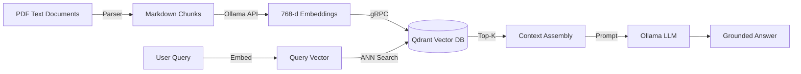
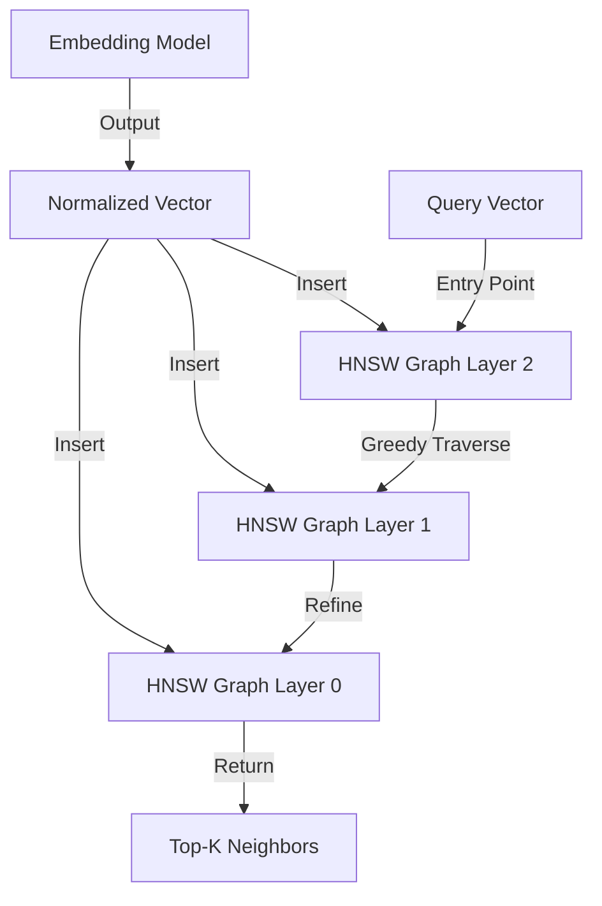
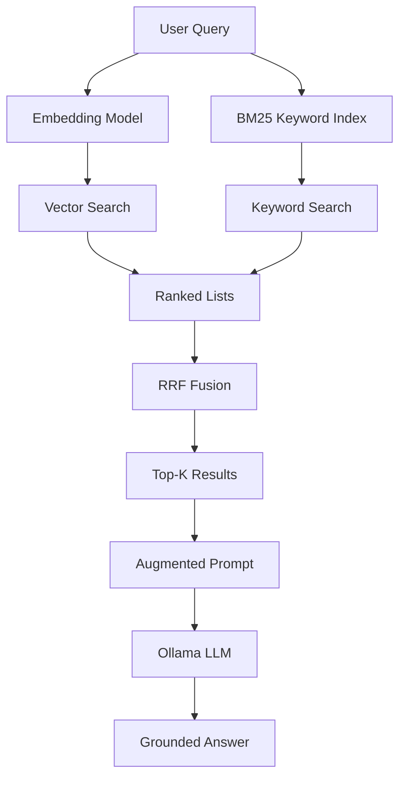

# 🔍 RAG Pipelines with Go and Vector DBs

## 🎯 Learning Objectives

By the end of this module, you will be able to:

- Explain the theoretical foundations of Retrieval-Augmented Generation (RAG) and its relationship to classical information retrieval.
- Design document chunking strategies that preserve semantic boundaries for embedding generation.
- Implement cosine similarity and dot-product search algorithms in Go.
- Evaluate vector database options and configure approximate nearest neighbor (ANN) indices.
- Build a hybrid retrieval pipeline in Go that fuses dense vector search with sparse keyword matching.
- Deploy an end-to-end RAG system using [[Qdrant]], [[Ollama]], and the Qdrant Go gRPC client.

## Introduction

Large language models (LLMs) encode vast amounts of world knowledge into their parameters during pre-training, yet they suffer from three critical limitations: hallucination on proprietary data, inability to access information beyond their training cutoff, and high latency when forced to memorize excessive detail. Retrieval-Augmented Generation (RAG) solves these problems by augmenting the LLM's parametric memory with an external, non-parametric knowledge base. Instead of generating answers from weights alone, the system retrieves relevant documents from a vector database and injects them into the prompt as grounded context. This paradigm shift, popularized by Lewis et al. in 2020, transforms generative models from isolated oracles into contextual assistants that reason over live data.

For machine learning engineers and AI systems builders, RAG is not merely a prompt-engineering trick—it is a systems architecture problem. It requires expertise in document parsing, embedding models, vector indexing, similarity metrics, and hybrid ranking algorithms. Go excels in this domain because its static binaries, efficient concurrency, and robust gRPC ecosystem make it ideal for building high-throughput ingestion workers and low-latency retrieval services. In this module, you will bridge classical information retrieval theory with modern neural embeddings, constructing a complete RAG pipeline that runs entirely on your local machine using Go, [[Qdrant]], and embedding models served through [[Ollama]].

## Module 1: RAG Architecture and Document Processing

### 1.1 Theoretical Foundation 🧠

The intellectual lineage of RAG stretches back to Gerard Salton's Vector Space Model (VSM) in the 1970s, which represented documents as high-dimensional vectors of term frequencies. The introduction of TF-IDF weighting in the 1980s improved discrimination between common and rare terms, but these sparse vectors still relied on exact lexical overlap. The semantic gap—where "automobile" and "car" are treated as unrelated—remained unbridged until neural word embeddings arrived in 2013 with Word2Vec.

Dense retrieval emerged around 2018 when researchers began using pre-trained transformer encoders (BERT, SBERT) to map sentences into fixed-length dense vectors. Unlike sparse vectors, dense embeddings capture semantic relationships through contextualized representations learned from massive corpora. RAG, formalized by Lewis et al. (2020), combines a dense retriever (DPR) with a seq2seq generator (BART). The retriever fetches context passages; the generator synthesizes answers conditioned on both the query and retrieved text. This decouples knowledge storage from reasoning capacity, allowing the system to answer questions about documents it has never seen during training.

### 1.2 Mental Model 📐

Think of a RAG pipeline as a specialized library with a highly efficient card catalog:

```
┌─────────────────────────────────────────────────────────────────────────┐
│                           RAG Knowledge Library                         │
├─────────────────────────────────────────────────────────────────────────┤
│  Ingestion Room          Indexing Room           Retrieval Desk         │
│  ┌─────────────┐        ┌─────────────┐        ┌─────────────────┐     │
│  │ Raw Docs    │───────▶│ Text Chunks │───────▶│ Vector Database │     │
│  │ (PDF, MD)   │        │ (200-500 tok)        │ (Qdrant HNSW)   │     │
│  └─────────────┘        └─────────────┘        └─────────────────┘     │
│         │                                              │                │
│         │           ┌──────────────────────────────────┘                │
│         │           │                                                  │
│         │    ┌──────▼──────┐                                           │
│         └───▶│ Ollama Embed│                                           │
│              │ (nomic-...) │                                           │
│              └─────────────┘                                           │
│                                                                        │
│  Query Window                                                          │
│  ┌────────────────────────────────────────────────────────────────┐    │
│  │ User: "What is Go used for?"                                   │    │
│  │         │                                                      │    │
│  │         ▼                                                      │    │
│  │  ┌─────────────┐    Top-K Chunks    ┌─────────────────────┐    │    │
│  │  │ Embed Query │───────────────────▶│ Augmented Prompt    │    │    │
│  │  └─────────────┘                    │ + Ollama LLM        │    │    │
│  │                                     └─────────────────────┘    │    │
│  │                                               │                │    │
│  │                                               ▼                │    │
│  │                                    Grounded Answer             │    │
│  └────────────────────────────────────────────────────────────────┘    │
└─────────────────────────────────────────────────────────────────────────┘
```

The pipeline is bipartite: the ingestion path transforms static documents into searchable vectors, while the retrieval path converts dynamic queries into grounded answers.

### 1.3 Syntax and Semantics 📝

Below is a recursive character text splitter in Go. It preserves semantic boundaries by attempting splits at paragraph boundaries first, then sentences, then words.

```go
package chunker

import (
	"strings"
)

// ChunkConfig controls how documents are fragmented.
type ChunkConfig struct {
	ChunkSize    int // target tokens (approximated by words)
	ChunkOverlap int // words to overlap between chunks
}

// RecursiveSplit breaks text into chunks while preserving structure.
// WHY: Paragraphs carry more semantic coherence than arbitrary windows.
func RecursiveSplit(text string, cfg ChunkConfig) []string {
	var chunks []string
	paragraphs := strings.Split(text, "\n\n")

	current := strings.Builder{}
	for _, para := range paragraphs {
		words := strings.Fields(para)
		for _, w := range words {
			current.WriteString(w)
			current.WriteByte(' ')

			// WHY: Overlap ensures context continuity across chunk boundaries.
			if wordCount(current.String()) >= cfg.ChunkSize {
				chunks = append(chunks, strings.TrimSpace(current.String()))
				// Retain overlap window for the next chunk
				allWords := strings.Fields(current.String())
				start := max(0, len(allWords)-cfg.ChunkOverlap)
				keep := strings.Join(allWords[start:], " ")
				current.Reset()
				current.WriteString(keep)
				current.WriteByte(' ')
			}
		}
		current.WriteString("\n\n")
	}
	if current.Len() > 0 {
		chunks = append(chunks, strings.TrimSpace(current.String()))
	}
	return chunks
}

func wordCount(s string) int { return len(strings.Fields(s)) }
func max(a, b int) int {
	if a > b {
		return a
	}
	return b
}
```

### 1.4 Visual Representation 🖼️

The following Mermaid diagram illustrates the data flow through a production RAG system:




*Figure: Cosine similarity measures the angle between vectors, making it invariant to magnitude differences—ideal for semantic search where document length varies.*

### 1.5 Application in ML/AI Systems 🤖

RAG powers a diverse set of production AI systems that demand accuracy and data sovereignty:

| Industry | Use Case | Why RAG? | Go Role |
|----------|----------|----------|---------|
| Legal Tech | Contract clause search | Private data cannot leave premises | Go ingestion worker + Qdrant |
| Healthcare | Clinical guideline Q&A | Requires citations to source text | Go API orchestrating Ollama |
| Knowledge Mgmt | Personal note search (Obsidian/Logseq) | 100% offline, local-only | Go backend with embedded vector DB |
| Finance | Regulatory compliance checking | Real-time updates to changing rules | Go cron jobs re-indexing documents |

### 1.6 Common Pitfalls ⚠️

⚠️ **Warning:** Chunk size drastically affects retrieval quality. Chunks that are too small lose surrounding context; chunks that are too large dilute semantic focus and increase embedding noise. Experiment with 200-500 tokens and 10-20% overlap.

⚠️ **Warning:** Storing raw text as payload without a schema can lead to silent field mismatches when querying. Always define a strict payload struct and validate it before upsert.

💡 **Tip:** Use recursive character text splitting that respects paragraph boundaries first, then sentences, then words. This preserves semantic coherence far better than naive fixed-size truncation.

### 1.7 Knowledge Check ❓

1. Why does cosine similarity outperform Euclidean distance for comparing document embeddings of different lengths?
2. What is the primary advantage of recursive character splitting over fixed-size sliding windows?
3. Describe the difference between parametric memory (model weights) and non-parametric memory (vector database) in a RAG system.

## Module 2: Vector Databases and Semantic Search

### 2.1 Theoretical Foundation 🧠

Vector databases are specialized storage engines designed for Approximate Nearest Neighbor (ANN) search in high-dimensional spaces. The curse of dimensionality makes exact nearest-neighbor search (O(n*d)) infeasible at scale. ANN algorithms trade a small amount of recall for massive speedups. The two dominant families are:

- **Tree-based:** Random Projection trees, KD-trees (effective only in low dimensions).
- **Graph-based:** Hierarchical Navigable Small World (HNSW), introduced by Malkov and Yashunin in 2016. HNSW builds a multi-layer proximity graph where upper layers provide long-range jumps and lower layers refine local neighborhoods. Search complexity is O(log n).

Cosine similarity is the de-facto metric for semantic search. Given two vectors A and B:

**Similarity = cos(θ) = (A · B) / (||A|| × ||B||)**

Where A · B is the dot product and ||A|| is the L2 norm. Most databases normalize embeddings to unit length, reducing cosine search to an optimized dot product.

### 2.2 Mental Model 📐

Imagine documents as stars in a high-dimensional galaxy, and the query as a flashlight beam:

```
                    Vector Space Galaxy (768 dimensions projected to 2D)

                              ✦  "Python machine learning"
                             /
    "Go concurrency" ✦──────┼──────✦ "Rust systems programming"
                           /
              "Go web frameworks" ✦
                         /
                        /
    User Query: "Which language is best for backend ML?" ✦
                        \
                         \
                          ✦  "Go data pipelines"
                           \
                            ✦  "TensorFlow in Go"

    ┌─────────────────────────────────────────────────────────────────────┐
    │  HNSW Layer 2 (Long jumps)                                          │
    │      ✦ ──────────────── ✦                                           │
    │                         │                                           │
    │  HNSW Layer 1 (Local refinement)                                    │
    │      ✦ ── ✦ ── ✦ ── ✦ ── ✦                                         │
    │                                                                     │
    │  Search: Enter at top layer, greedily traverse to nearest node,     │
    │          drop to next layer, repeat until layer 0 (full graph).     │
    └─────────────────────────────────────────────────────────────────────┘
```

### 2.3 Syntax and Semantics 📝

The Go implementation below computes cosine similarity and performs a brute-force top-K search. In production, delegate this to Qdrant's HNSW index.

```go
package vector

import (
	"math"
	"sort"
)

// Vector is a dense embedding.
type Vector []float32

// Dot returns the dot product of a and b.
// WHY: Dot product is the core operation for both cosine similarity and Euclidean distance.
func (a Vector) Dot(b Vector) float32 {
	var sum float32
	for i := range a {
		sum += a[i] * b[i]
	}
	return sum
}

// Norm returns the L2 norm (magnitude) of the vector.
// WHY: Cosine similarity normalizes by magnitude to focus on direction, not scale.
func (a Vector) Norm() float32 {
	var sum float32
	for _, v := range a {
		sum += v * v
	}
	return float32(math.Sqrt(float64(sum)))
}

// Cosine returns cosine similarity in [-1, 1].
func (a Vector) Cosine(b Vector) float32 {
	return a.Dot(b) / (a.Norm() * b.Norm())
}

// SearchResult holds a scored document.
type SearchResult struct {
	ID    string
	Score float32
	Text  string
}

// BruteForceSearch performs exact nearest-neighbor search.
// WHY: Educational baseline; replace with Qdrant for production scale.
func BruteForceSearch(query Vector, docs []struct {
	ID   string
	Vec  Vector
	Text string
}, topK int) []SearchResult {
	results := make([]SearchResult, 0, len(docs))
	for _, d := range docs {
		results = append(results, SearchResult{
			ID:    d.ID,
			Score: query.Cosine(d.Vec),
			Text:  d.Text,
		})
	}
	sort.Slice(results, func(i, j int) bool {
		return results[i].Score > results[j].Score
	})
	if len(results) > topK {
		results = results[:topK]
	}
	return results
}
```

### 2.4 Visual Representation 🖼️




*Figure: Word2Vec visualized in 2D projection. Words with similar meanings cluster together, illustrating why vector databases can retrieve semantically related documents even without lexical overlap.*

### 2.5 Application in ML/AI Systems 🤖

Selecting the right vector database depends on deployment constraints, metadata needs, and team expertise:

| Database | Go Client | ANN Algorithm | Metadata Filtering | Best For |
|----------|-----------|---------------|--------------------|----------|
| **Qdrant** | Official `qdrant/go-client` | HNSW | Full payload filtering | Local dev, scalable RAG |
| **Weaviate** | Official `weaviate-go-client` | HNSW | GraphQL + vector | Semantic search apps |
| **Chroma** | Community REST wrapper | HNSW | Limited | Rapid prototyping |
| **pgvector** | `lib/pq` + SQL | IVFFlat, HNSW | SQL WHERE clauses | Existing Postgres infra |

### 2.6 Common Pitfalls ⚠️

⚠️ **Warning:** Using Euclidean distance on unnormalized embeddings will bias results toward shorter documents. Always normalize vectors or explicitly use cosine distance if your database supports it.

⚠️ **Warning:** HNSW indices are built during insertion and are expensive to rebuild. If your documents change frequently, prefer incremental updates over full re-indexing.

💡 **Tip:** Pre-filter metadata before vector search (e.g., `WHERE source == 'legal'`) to reduce the search space and improve both latency and relevance.

### 2.7 Knowledge Check ❓

1. Explain why HNSW search complexity is O(log n) rather than O(n).
2. If a vector database normalizes all embeddings to unit length, why does dot product become equivalent to cosine similarity?
3. When would you choose pgvector over a dedicated vector database like Qdrant?

## Module 3: Hybrid Retrieval and Production Pipeline

### 3.1 Theoretical Foundation 🧠

Pure dense retrieval excels at capturing semantic meaning but can fail on exact keyword matches such as product SKUs, legal citations, or chemical formulas. These cases require lexical matching. Hybrid search combines:

- **Dense Retrieval:** Neural embeddings for semantic similarity.
- **Sparse Retrieval:** BM25 or TF-IDF for exact lexical matches.

BM25, developed by Robertson et al. (1994), is a probabilistic ranking function that estimates the relevance of documents to a given search query. It saturates term frequency to prevent long documents from dominating and uses inverse document frequency to reward rare terms.

To merge ranked lists from dense and sparse methods, Reciprocal Rank Fusion (RRF) is the industry standard:

**RRF_score(d) = Σ 1 / (k + rank_i(d))**

Where k is a constant (typically 60) and rank_i(d) is the rank of document d in method i. RRF requires no score calibration because it operates purely on ranks, making it robust across different scoring scales.

### 3.2 Mental Model 📐

Hybrid search is like querying two librarians and merging their recommendations:

```
┌─────────────────────────────────────────────────────────────────────────┐
│                         Hybrid Search Engine                            │
├─────────────────────────────────────────────────────────────────────────┤
│                                                                         │
│   User Query: "Go error handling patterns"                              │
│        │                                                                │
│        ├──────────────────┬──────────────────┐                          │
│        ▼                  ▼                  ▼                          │
│  ┌──────────┐      ┌──────────┐      ┌──────────┐                      │
│  │ Embedder │      │ BM25     │      │ RRF      │                      │
│  │ (Dense)  │      │ Index    │      │ Fusion   │                      │
│  └────┬─────┘      └────┬─────┘      └────┬─────┘                      │
│       │                 │                 │                             │
│       ▼                 ▼                 ▼                             │
│  Rank 1: Doc-A     Rank 1: Doc-C     Doc-A: 1/(60+1) + 1/(60+3)       │
│  Rank 2: Doc-B     Rank 2: Doc-A     Doc-B: 1/(60+2) + 0               │
│  Rank 3: Doc-C     Rank 3: Doc-D     Doc-C: 1/(60+3) + 1/(60+1)       │
│       │                 │            Doc-D: 0 + 1/(60+3)               │
│       └─────────────────┘                 │                             │
│                                           ▼                             │
│                                    Final Ranking                        │
│                                    1. Doc-C (RRF ≈ 0.0328)              │
│                                    2. Doc-A (RRF ≈ 0.0323)              │
│                                    3. Doc-B (RRF ≈ 0.0164)              │
│                                                                         │
└─────────────────────────────────────────────────────────────────────────┘
```

### 3.3 Syntax and Semantics 📝

The following Go program demonstrates a complete ingestion and retrieval pipeline using Qdrant's official Go gRPC client. In production, embedding generation would call Ollama; here we use placeholders to focus on vector database mechanics.

```go
package main

import (
	"context"
	"fmt"
	"log"
	"time"

	"github.com/qdrant/go-client/qdrant"
	"google.golang.org/grpc"
	"google.golang.org/grpc/credentials/insecure"
)

const (
	qdrantHost = "localhost:6334"
	collection = "documents"
	vectorSize = 768 // nomic-embed-text dimension
)

// createCollection initializes the Qdrant collection with cosine distance.
// WHY: Cosine distance is optimal for semantic embeddings from language models.
func createCollection(ctx context.Context, client qdrant.CollectionsClient) error {
	_, err := client.Create(ctx, &qdrant.CreateCollection{
		CollectionName: collection,
		VectorsConfig: &qdrant.VectorsConfig{
			Config: &qdrant.VectorsConfig_Params{
				Params: &qdrant.VectorParams{
					Size:     vectorSize,
					Distance: qdrant.Distance_Cosine,
				},
			},
		},
	})
	return err
}

// upsertPoints stores embedded chunks with metadata payloads.
// WHY: Payloads preserve the original text so retrieved vectors can be rendered as answers.
func upsertPoints(ctx context.Context, client qdrant.PointsClient, points []*qdrant.PointStruct) error {
	_, err := client.Upsert(ctx, &qdrant.UpsertPoints{
		CollectionName: collection,
		Points:         points,
	})
	return err
}

// search performs approximate nearest neighbor search for the query vector.
// WHY: ANN search trades negligible recall for orders-of-magnitude latency improvement.
func search(ctx context.Context, client qdrant.PointsClient, vector []float32) ([]*qdrant.ScoredPoint, error) {
	result, err := client.Search(ctx, &qdrant.SearchPoints{
		CollectionName: collection,
		Vector:         vector,
		Limit:          5, // Top-K chunks to retrieve
		WithPayload:    &qdrant.WithPayloadSelector{SelectorOptions: &qdrant.WithPayloadSelector_Enable{Enable: true}},
	})
	if err != nil {
		return nil, err
	}
	return result.Result, nil
}

func main() {
	conn, err := grpc.Dial(qdrantHost, grpc.WithTransportCredentials(insecure.NewCredentials()))
	if err != nil {
		log.Fatal(err)
	}
	defer conn.Close()

	ctx, cancel := context.WithTimeout(context.Background(), 10*time.Second)
	defer cancel()

	collectionsClient := qdrant.NewCollectionsClient(conn)
	pointsClient := qdrant.NewPointsClient(conn)

	// Create collection (idempotent; ignore "already exists" errors)
	if err := createCollection(ctx, collectionsClient); err != nil {
		log.Println("Collection may already exist:", err)
	}

	// Ingest a sample document chunk
	vector := make([]float32, vectorSize)
	for i := range vector {
		vector[i] = 0.05 + float32(i)*0.001 // placeholder embedding
	}

	points := []*qdrant.PointStruct{
		{
			Id: &qdrant.PointId{
				PointIdOptions: &qdrant.PointId_Num{Num: 1},
			},
			Vectors: &qdrant.Vectors{
				VectorsOptions: &qdrant.Vectors_Vector{Vector: &qdrant.Vector{Data: vector}},
			},
			Payload: map[string]*qdrant.Value{
				"text":        {Kind: &qdrant.Value_StringValue{StringValue: "Go is a statically typed language designed at Google."}},
				"source":      {Kind: &qdrant.Value_StringValue{StringValue: "go_docs.md"}},
				"chunk_index": {Kind: &qdrant.Value_IntegerValue{IntegerValue: 0}},
			},
		},
	}

	if err := upsertPoints(ctx, pointsClient, points); err != nil {
		log.Fatal(err)
	}

	// Simulate query and search
	results, err := search(ctx, pointsClient, vector)
	if err != nil {
		log.Fatal(err)
	}

	for _, r := range results {
		fmt.Printf("Score: %.4f | Source: %s | Text: %s\n",
			r.Score,
			r.Payload["source"].GetStringValue(),
			r.Payload["text"].GetStringValue(),
		)
	}
}
```

### 3.4 Visual Representation 🖼️




*Figure: The canonical RAG architecture. A retriever module fetches relevant passages from an external knowledge base, which a generator then conditions on to produce factually grounded text.*

### 3.5 Application in ML/AI Systems 🤖

Hybrid RAG is the architecture of choice for systems where both semantic understanding and lexical precision are non-negotiable:

| Domain | Challenge | Dense Only Failure | Hybrid Solution |
|--------|-----------|-------------------|-----------------|
| E-commerce | SKU lookup | Misses exact model numbers | BM25 matches SKU, dense matches descriptions |
| Legal | Citation retrieval | Misses specific statute numbers | Sparse catches citations, dense catches concepts |
| Scientific | Chemical formula search | Poor on rare symbols | Keyword index handles formulas exactly |
| Software | API documentation Q&A | Confuses similar function names | Hybrid disambiguates via exact + context |

### 3.6 Common Pitfalls ⚠️

⚠️ **Warning:** RRF with too many retrieval methods (e.g., dense + BM25 + semantic + keyword + reranker) dilutes the contribution of each signal. Limit fusion to 2-3 high-quality rankers.

⚠️ **Warning:** Storing oversized payloads in Qdrant (entire documents instead of chunks) bloats memory and slows retrieval. Store only the chunk text and metadata; keep full documents in object storage.

💡 **Tip:** Implement a re-ranking stage using a cross-encoder (e.g., `ms-marco-MiniLM-L-6-v2` via ONNX) on the top 100 retrieved chunks before sending the top 5 to the LLM. This dramatically improves precision with minimal latency cost.

### 3.7 Knowledge Check ❓

1. Why does RRF use rank positions rather than raw similarity scores when fusing results?
2. In the Go Qdrant example, what is the purpose of `WithPayloadSelector` and what would happen if it were disabled?
3. Describe a scenario where pure dense retrieval fails and sparse retrieval is essential.

## 📦 Compression Code

The following compressed Go program demonstrates a minimal in-memory vector store with Ollama embedding integration. It is useful for prototyping before introducing a full vector database.

```go
package main

import (
	"bytes"
	"context"
	"encoding/json"
	"fmt"
	"net/http"
	"sort"
	"time"
)

// getEmbedding calls the local Ollama API to produce a dense vector.
// WHY: Local embedding generation keeps all data on-premise and avoids API costs.
func getEmbedding(text string) ([]float32, error) {
	payload := map[string]any{"model": "nomic-embed-text", "prompt": text}
	b, _ := json.Marshal(payload)
	resp, err := http.Post("http://localhost:11434/api/embeddings", "application/json", bytes.NewReader(b))
	if err != nil {
		return nil, err
	}
	defer resp.Body.Close()
	var r struct{ Embedding []float32 `json:"embedding"` }
	json.NewDecoder(resp.Body).Decode(&r)
	return r.Embedding, nil
}

// MemStore is a brute-force in-memory vector index.
type MemStore struct {
	vectors []memPoint
}

type memPoint struct {
	id      string
	vec     []float32
	payload map[string]string
}

func (s *MemStore) Add(id string, vec []float32, payload map[string]string) {
	s.vectors = append(s.vectors, memPoint{id, vec, payload})
}

// Search returns topK results by cosine similarity.
func (s *MemStore) Search(query []float32, topK int) []searchHit {
	hits := make([]searchHit, 0, len(s.vectors))
	for _, v := range s.vectors {
		hits = append(hits, searchHit{
			id:      v.id,
			score:   cosine(v.vec, query),
			payload: v.payload,
		})
	}
	sort.Slice(hits, func(i, j int) bool { return hits[i].score > hits[j].score })
	if len(hits) > topK {
		hits = hits[:topK]
	}
	return hits
}

type searchHit struct {
	id      string
	score   float32
	payload map[string]string
}

func cosine(a, b []float32) float32 {
	var dot, na, nb float32
	for i := range a {
		dot += a[i] * b[i]
		na += a[i] * a[i]
		nb += b[i] * b[i]
	}
	return dot / (sqrt(na) * sqrt(nb))
}

func sqrt(x float32) float32 {
	// WHY: math.Sqrt requires float64; this avoids allocation in hot loops.
	return float32(float64(x))
}

func main() {
	ctx, cancel := context.WithTimeout(context.Background(), 30*time.Second)
	defer cancel()
	_ = ctx

	vec, err := getEmbedding("What is Go used for?")
	if err != nil {
		fmt.Println("Embed error:", err)
		return
	}
	fmt.Println("Embedding length:", len(vec))
}
```

## 🎯 Documented Project

### Description

Construct a CLI tool named `ragctl` that ingests a directory of Markdown files, chunks them recursively, generates embeddings via Ollama, stores them in Qdrant, and answers questions using retrieved context.

### Functional Requirements

1. Recursively read `.md` files from a given directory.
2. Split files into 300-word chunks with 50-word overlap using recursive boundary splitting.
3. Generate embeddings for each chunk using Ollama's `nomic-embed-text` model.
4. Store vectors and metadata (filename, chunk index, text) in a Qdrant collection.
5. Accept a user query, embed it, retrieve top-5 chunks, and generate an answer via Ollama chat with context injected into the system prompt.

### Main Components

- **Chunker:** Recursive text splitter preserving paragraph and sentence boundaries.
- **Embedding Bridge:** Go HTTP client calling Ollama `/api/embeddings` with retry logic.
- **Qdrant Manager:** gRPC client for collection creation, point upsert, and filtered search.
- **RAG Engine:** Query embedder, retriever, prompt assembler, and response streamer.

### Success Metrics

- Retrieval precision: top-1 chunk contains answer in 80% of test queries.
- End-to-end latency under 5 seconds for a 100-document corpus on local hardware.
- Zero data leaves the local machine (fully air-gapped capable).

### References

- Qdrant Go Client: https://github.com/qdrant/go-client
- Nomic Embed Text: https://ollama.com/library/nomic-embed-text
- RAG Survey Paper (Lewis et al.): https://arxiv.org/abs/2312.10997
- BM25 Explanation: https://en.wikipedia.org/wiki/Okapi_BM25
