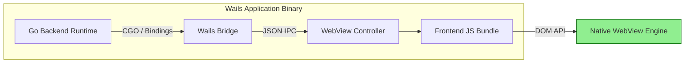
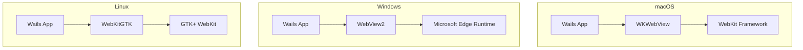
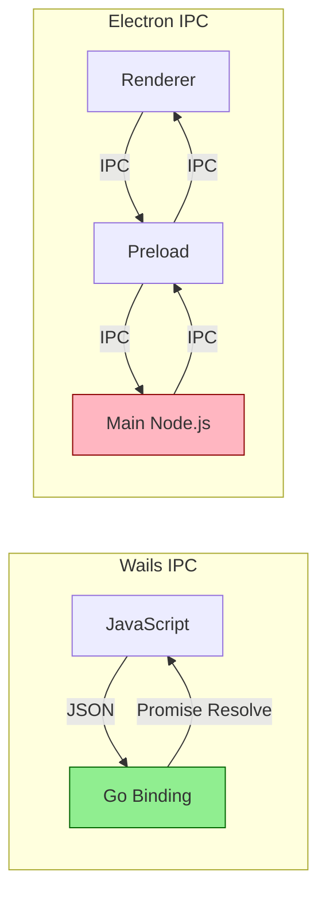
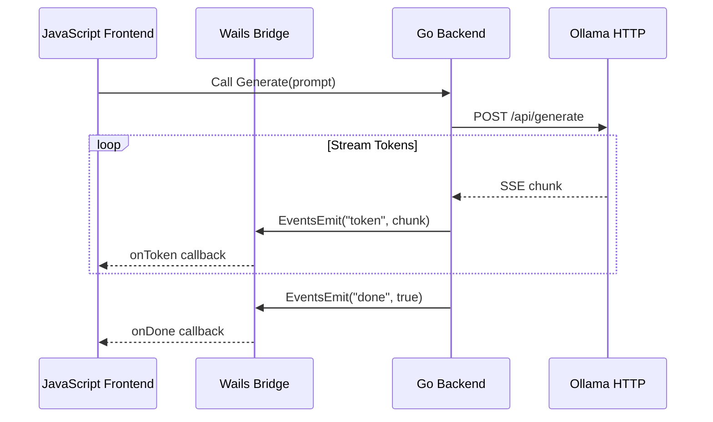
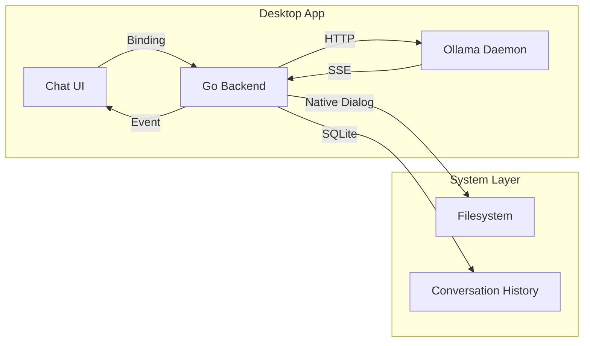

# 🖥️ Desktop Apps with Wails

## 🎯 Learning Objectives

1. Understand how Wails v2 bridges Go backends with modern web frontends.
2. Master IPC mechanisms: bindings, events, and native dialogs.
3. Build a complete desktop AI assistant by integrating Ollama with a Wails shell.
4. Compare Wails against Electron, Fyne, and Tauri for ML tooling deployment.

## Introduction

Desktop applications remain the gold standard for power users who demand low-latency, offline-capable AI tools. Unlike web apps confined by browser sandboxing, native desktop software can access the filesystem, GPU, and system notifications without intermediate layers. For machine-learning practitioners and Go engineers, this means building IDE-adjacent utilities, data-labeling tools, or local LLM chat interfaces that feel as responsive as system applications.

Wails v2 solves a critical pain point in the Go ecosystem: the lack of a modern, lightweight GUI framework. By embedding a WebView and exposing Go methods to JavaScript through automatic TypeScript generation, Wails lets teams keep their backend in Go—leveraging its concurrency and static binaries—while using any frontend framework they prefer. This is particularly powerful for local AI, where the Go backend can manage Ollama connections, vector databases from [[04 - RAG Pipelines with Go and Vector DBs|Module 04]], and streaming inference, while the frontend focuses purely on user experience.

In this module, we explore the theoretical foundations of hybrid application architecture, construct precise mental models for Go-to-JavaScript communication, and build a complete Wails application that streams tokens from a local LLM into a Svelte interface. You will learn why theory—understanding event loops, process isolation, and IPC latency—must precede writing code.

## Module 1: Wails Architecture and Hybrid Applications

### 1.1 Theoretical Foundation 🧠

The concept of hybrid desktop applications predates Wails by over a decade. Early attempts like Adobe AIR (2008) and Mozilla Prism allowed web content to run outside the browser, but they bundled entire rendering engines, leading to massive footprints. Electron (2013) popularized the "Chromium + Node.js" model, enabling Visual Studio Code and Slack, yet each app carries ~150 MB of runtime overhead.

The theoretical breakthrough behind Wails is *system WebView reuse*. Instead of shipping a browser engine, Wails instantiates the host OS's native web renderer: WebKit on macOS, WebView2 on Windows, and WebKitGTK on Linux. This leverages the *shared library* principle from operating-systems theory: if the runtime already exists on the target machine, the application need not duplicate it.

From a computer-science perspective, Wails implements a classic *client-server architecture within a single process*. The Go backend acts as the server, the WebView frontend as the client, and the IPC layer as a local network abstraction with near-zero serialization cost. This mirrors the microkernel design philosophy, where components communicate via message passing rather than shared memory, reducing coupling and increasing robustness.

Motivation for AI tooling is clear: local LLM inference requires tight control over goroutines, memory layout, and HTTP client pools. Go excels here, while frontend frameworks excel at reactive UI. Wails provides the bridge without forcing either side to compromise.

### 1.2 Mental Model 📐

Imagine the Wails application as a two-story building connected by a high-speed elevator:

```
┌─────────────────────────────────────────┐
│  🎨 FRONTEND FLOOR (WebView)            │
│  ┌─────────────┐  ┌─────────────────┐   │
│  │   Svelte    │  │   JavaScript    │   │
│  │  Components │  │   Event Bus     │   │
│  └──────┬──────┘  └────────┬────────┘   │
│         │                  │            │
│         └──────┬───────────┘            │
│                ▼                        │
│  ┌─────────────────────────────────┐    │
│  │     Wails JavaScript Runtime    │    │
│  │  (window.go / window.runtime)   │    │
│  └───────────────┬─────────────────┘    │
└──────────────────┼──────────────────────┘
                   │ IPC Channel
                   │ (bindings + events)
┌──────────────────┼──────────────────────┐
│  ⚙️ BACKEND FLOOR (Go Runtime)          │
│  ┌───────────────┴─────────────────┐    │
│  │         Wails Bridge            │    │
│  │    (method dispatch / emit)     │    │
│  └───────────────┬─────────────────┘    │
│         ┌────────┴────────┐             │
│         ▼                 ▼             │
│  ┌─────────────┐  ┌─────────────────┐   │
│  │  App Struct │  │  Ollama Client  │   │
│  │  (bindings) │  │  (goroutines)   │   │
│  └──────┬──────┘  └────────┬────────┘   │
│         │                  │            │
│         └──────┬───────────┘            │
│                ▼                        │
│  ┌─────────────────────────────────┐    │
│  │      Native OS Facilities       │    │
│  │   (dialogs, menus, filesystem)  │    │
│  └─────────────────────────────────┘    │
└─────────────────────────────────────────┘
```

The elevator moves in two modes:
- **Bindings (JS → Go):** Synchronous request-response. The JavaScript caller waits while the elevator descends, the Go method executes, and the result ascends.
- **Events (Bidirectional):** Asynchronous fire-and-forget. Either floor can place a message on the elevator without waiting for the other side to acknowledge.

This architectural separation means frontend developers can iterate on UI design independently, while backend engineers optimize Go routines for AI inference, provided the IPC contract remains stable.

### 1.3 Syntax and Semantics 📝

Below is a minimal Wails v2 application exposing a Go method and emitting events. Study the WHY comments before copying patterns.

```go
// app.go
package main

import (
	"context"
	"fmt"
	"time"

	"github.com/wailsapp/wails/v2/pkg/runtime"
)

// App holds application state. Wails injects context after startup.
// WHY: Using a struct groups related state (ctx, clients, config)
// rather than global variables, making the app testable.
type App struct {
	ctx context.Context
}

// NewApp is the factory function Wails calls to create the app instance.
// WHY: Factory pattern allows pre-initialization (e.g., loading config)
// before Wails takes control of the lifecycle.
func NewApp() *App {
	return &App{}
}

// startup receives the runtime context. Bindings and events require it.
// WHY: Context carries cancellation signals. If the window closes,
// goroutines can detect ctx.Done() and release resources cleanly.
func (a *App) startup(ctx context.Context) {
	a.ctx = ctx
}

// Greet is exposed to JavaScript because it is a public method on App.
// WHY: Wails reflects over the bound struct. Any exported method
// becomes callable from the frontend without manual RPC wiring.
func (a *App) Greet(name string) string {
	return fmt.Sprintf("Hello %s!", name)
}

// StreamTokens simulates LLM token generation using events.
// WHY: Events decouple the producer (Go) from the consumer (JS).
// If the frontend lags, tokens accumulate in the WebView queue
// rather than blocking the inference goroutine.
func (a *App) StreamTokens(prompt string) {
	tokens := []string{"Local", " AI", " is", " awesome", "!"}
	for _, tok := range tokens {
		runtime.EventsEmit(a.ctx, "token", tok)
		time.Sleep(100 * time.Millisecond) // WHY: Simulates network/model latency.
	}
	runtime.EventsEmit(a.ctx, "done", true)
}
```

```go
// main.go
package main

import (
	"embed"

	"github.com/wailsapp/wails/v2"
	"github.com/wailsapp/wails/v2/pkg/options"
	"github.com/wailsapp/wails/v2/pkg/options/assetserver"
)

//go:embed all:frontend/dist
var assets embed.FS

// WHY: embed.FS bakes the frontend build into the binary.
// At runtime, Wails serves these files from memory, eliminating
// external asset directories and simplifying distribution.

func main() {
	app := NewApp()

	// WHY: wails.Run blocks until the window closes.
	// All configuration is declarative, reducing runtime state machine bugs.
	err := wails.Run(&options.App{
		Title:  "Local AI Assistant",
		Width:  1024,
		Height: 768,
		AssetServer: &assetserver.Options{
			Assets: assets,
		},
		BackgroundColour: &options.RGBA{R: 27, G: 38, B: 54, A: 1},
		OnStartup:        app.startup,
		Bind: []interface{}{
			app,
		},
	})
	if err != nil {
		println("Error:", err.Error())
	}
}
```

```svelte
<!-- frontend/src/App.svelte -->
<script>
  import { onMount } from 'svelte';
  let prompt = "";
  let response = "";

  // WHY: onMount registers event listeners after the DOM is ready.
  // Registering too early causes window.runtime to be undefined.
  onMount(() => {
    window.runtime.EventsOn("token", (token) => {
      response += token;
    });
    window.runtime.EventsOn("done", () => {
      console.log("Stream finished");
    });
  });

  // WHY: async/await lets us call Go methods as if they were local
  // functions. Wails generates TypeScript definitions automatically.
  async function ask() {
    response = "";
    await window.go.main.App.Generate(prompt);
  }
</script>

<input bind:value={prompt} placeholder="Ask anything..." />
<button on:click={ask}>Generate</button>
<p>{response}</p>
```

### 1.4 Visual Representation 🖼️

Wails leverages the native WebView engine on each platform:



System WebView architectures across operating systems:




*WebKit rendering engine, the backbone of macOS and Linux WebViews.*


*Electron pioneered hybrid apps but bundles Chromium, causing 150 MB+ binaries. Wails inverts this model by using the OS-native renderer.*

### 1.5 Application in ML/AI Systems 🤖

| Case Study | Domain | Wails Role | AI Integration | Outcome |
|---|---|---|---|---|
| **LocalMind** | Personal Productivity | Desktop chat shell | Ollama streaming via HTTP | Single 18 MB binary replacing a 200 MB Electron wrapper |
| **DataLabel Pro** | Computer Vision | Native image annotator | Go backend runs OpenCV preprocessing; Svelte frontend draws bounding boxes | 5x faster frame scrubbing than browser-based tools |
| **RAG Workbench** | Enterprise Search | Document manager | Go vector DB client from [[04 - RAG Pipelines with Go and Vector DBs|Module 04]] | Offline semantic search with sub-100ms UI updates |
| **CodePilot Desktop** | Developer Tools | IDE companion | Local CodeLlama via Ollama, clipboard monitoring via Go | Native OS notifications for refactoring suggestions |

### 1.6 Common Pitfalls ⚠️

⚠️ **Warning:** Blocking the main goroutine inside a binding freezes the frontend. If a Go method runs an LLM inference synchronously, the WebView cannot render until it returns. Always spawn a goroutine for long-running AI calls and return immediately, streaming results via events.

⚠️ **Warning:** WebView2 on Windows requires a runtime installation. Wails provides an installer bootstrapper, but you must test on clean Windows VMs to ensure first-run success. Do not assume the runtime is present on consumer machines.

💡 **Tip:** Use Svelte for the frontend if you want minimal bundle overhead. Its compiled output is significantly smaller than React or Vue, often under 100 KB gzipped, keeping the total binary well under 25 MB.

### 1.7 Knowledge Check ❓

1. Why does Wails use the operating system's native WebView instead of bundling Chromium, and what computer-science principle does this exemplify?
2. Compare bindings and events in terms of directionality, latency, and appropriate use cases for AI streaming.
3. When integrating Ollama token generation into a Wails app, should you use a binding or an event? Justify your answer with concurrency theory.

## Module 2: Inter-Process Communication and Native Integration

### 2.1 Theoretical Foundation 🧠

IPC (Inter-Process Communication) theory dates back to the 1970s with Dijkstra's semaphores and Hoare's Communicating Sequential Processes (CSP). While Wails runs in a single OS process, the Go runtime and WebView engine execute in separate threads, making IPC patterns essential.

Wails implements two IPC primitives:
1. **Bindings:** Remote Procedure Call (RPC) abstraction. The frontend invokes a method as if it were local; Wails marshals arguments to JSON, dispatches to Go, unmarshals the return value, and resolves the JavaScript Promise. This is identical in theory to gRPC or JSON-RPC, but with zero network overhead.
2. **Events:** Publish-subscribe pattern. Decoupled producers and consumers communicate via named channels. This directly maps to Go's channel semantics and JavaScript's EventEmitter pattern.

The latency of IPC is bounded by context-switch overhead and JSON serialization. For AI applications, this matters when streaming tokens at 50-100 tokens/second. Wails optimizes by batching events and using shared-memory buffers for large payloads (e.g., base64-encoded images).

Native dialogs (file pickers, message boxes) are implemented via OS-specific APIs rather than WebView overlays. This avoids the browser sandbox restriction on filesystem access and provides the exact look-and-feel users expect on their platform.

### 2.2 Mental Model 📐

Visualize IPC as a post office inside the Wails process:

```
┌─────────────────────────────────────────────────────┐
│                  WAILS POST OFFICE                  │
│  ┌──────────────┐        ┌──────────────────────┐   │
│  │  JS Counter  │        │    Go Counter        │   │
│  │              │        │                      │   │
│  │  ┌────────┐  │        │  ┌────────────────┐  │   │
│  │  │ Send   │──┼────┬───┼──▶│ Receive        │  │   │
│  │  │ Letter │  │    │   │  │ & Process      │  │   │
│  │  └────────┘  │    │   │  └────────┬───────┘  │   │
│  │              │    │   │           │          │   │
│  │  ┌────────┐  │    │   │  ┌────────▼───────┐  │   │
│  │  │ Receive│◀─┼────┘   │  │ Send Reply     │  │   │
│  │  │ Reply  │  │        │  └────────────────┘  │   │
│  │  └────────┘  │        │                      │   │
│  └──────────────┘        └──────────────────────┘   │
│                                                     │
│  Binding Slot: "Greet"       Event Slot: "token"   │
│  ─────────────────────       ───────────────────   │
│  JS calls → Go replies       Go emits → JS listens  │
└─────────────────────────────────────────────────────┘
```

The post office handles two mail types:
- **Registered Mail (Bindings):** Requires a signature (return value). Synchronous, tracked.
- **Newsletters (Events):** Fire-and-forget. Multiple subscribers can read the same newspaper.

For token streaming, the Go side drops a newsletter into the "token" slot every 20-50 ms. The JavaScript side has a subscription that appends each issue to the chat window.

### 2.3 Syntax and Semantics 📝

Complete IPC example with error handling and dialog integration:

```go
// app.go
package main

import (
	"context"
	"fmt"
	"time"

	"github.com/wailsapp/wails/v2/pkg/runtime"
)

type App struct {
	ctx context.Context
}

func NewApp() *App { return &App{} }
func (a *App) startup(ctx context.Context) { a.ctx = ctx }

// OpenDialog triggers a native file picker and returns the selected path.
// WHY: Native dialogs bypass browser sandbox restrictions and provide
// platform-appropriate UX (e.g., macOS sheets vs. Windows explorers).
func (a *App) OpenDialog() (string, error) {
	selection, err := runtime.OpenFileDialog(a.ctx, runtime.OpenDialogOptions{
		Title: "Select Training Dataset",
		Filters: []runtime.FileFilter{
			{DisplayName: "CSV Files (*.csv)", Pattern: "*.csv"},
		},
	})
	if err != nil {
		return "", err
	}
	// WHY: Returning empty string without error lets the frontend
	// distinguish "user cancelled" from "system failure".
	return selection, nil
}

// GenerateWithProgress runs inference and emits progress events.
// WHY: A single binding cannot stream data. We return a job ID
// immediately, then emit events so the frontend can show a progress bar.
func (a *App) GenerateWithProgress(prompt string) string {
	jobID := fmt.Sprintf("job-%d", time.Now().Unix())
	go func() {
		stages := []string{"tokenizing", "embedding", "generating", "done"}
		for i, stage := range stages {
			runtime.EventsEmit(a.ctx, "progress", map[string]interface{}{
				"jobID":   jobID,
				"stage":   stage,
				"percent": (i + 1) * 25,
			})
			time.Sleep(300 * time.Millisecond)
		}
		runtime.EventsEmit(a.ctx, "complete", jobID)
	}()
	return jobID
}
```

```javascript
// frontend/src/lib/ipc.js
// WHY: Centralizing IPC calls in a module makes refactoring easier
// and allows mocking during unit tests.

export async function pickDataset() {
  const path = await window.go.main.App.OpenDialog();
  if (!path) {
    console.warn("User cancelled dialog");
    return null;
  }
  return path;
}

export function onProgress(callback) {
  window.runtime.EventsOn("progress", (data) => callback(data));
}

export function onComplete(callback) {
  window.runtime.EventsOn("complete", (jobID) => callback(jobID));
}
```

```svelte
<!-- frontend/src/components/ProgressBar.svelte -->
<script>
  import { onMount } from 'svelte';
  let percent = 0;
  let stage = "idle";

  onMount(() => {
    window.runtime.EventsOn("progress", (data) => {
      percent = data.percent;
      stage = data.stage;
    });
  });
</script>

<div class="bar-container">
  <div class="bar-fill" style="width: {percent}%"></div>
</div>
<p>{stage}: {percent}%</p>
```

### 2.4 Visual Representation 🖼️

IPC latency comparison across desktop frameworks:



Sequence diagram for streaming tokens:




*Wails framework logo. The project emphasizes native performance and small binary sizes.*

### 2.5 Application in ML/AI Systems 🤖

| Case Study | Domain | IPC Pattern Used | AI Integration | Performance |
|---|---|---|---|---|
| **AgriVision Desktop** | Precision Agriculture | Events + Bindings | Go runs ONNX model; JS renders NDVI heatmap | 60 FPS video scrubbing |
| **MedScan Reviewer** | Healthcare | Bindings + Dialogs | Go loads DICOM images; native dialog for patient folders | HIPAA-compliant offline workflow |
| **ChemPredict** | Chemistry | Events (streaming) | Go calls Ollama for molecular property prediction | Tokens appear in real time |
| **DocuMind** | Legal Tech | Bindings | Go vector search from [[04 - RAG Pipelines with Go and Vector DBs|Module 04]] | Sub-50ms query round-trip |

### 2.6 Common Pitfalls ⚠️

⚠️ **Warning:** Never pass large tensors (e.g., image embeddings) through bindings. JSON serialization of float32 arrays is orders of magnitude slower than binary formats. Write embeddings to a temporary file and pass the filepath string instead.

⚠️ **Warning:** Event listeners registered in `onMount` without cleanup leak memory when components unmount. Always call `window.runtime.EventsOff("token")` in the Svelte `onDestroy` lifecycle hook.

💡 **Tip:** Use `runtime.LogInfo` and `runtime.LogError` from Go rather than `fmt.Println`. Wails forwards these to the frontend console during development, creating a unified logging stream across both runtimes.

### 2.7 Knowledge Check ❓

1. Explain why JSON-RPC over shared memory is theoretically faster than TCP-based gRPC, and identify the serialization bottleneck in Wails bindings.
2. Draw a mental model showing how a frontend progress bar stays responsive while a Go goroutine performs a 10-second LLM inference.
3. Why should native file dialogs be preferred over HTML `<input type="file">` for selecting large training datasets in AI desktop tools?

## Module 3: Integrating Ollama into a Wails Desktop App

### 3.1 Theoretical Foundation 🧠

Integrating a local LLM into a desktop application requires understanding *producer-consumer buffering* and *backpressure*. Ollama streams tokens via Server-Sent Events (SSE). Each SSE chunk is a JSON object containing a token string. If the consumer (frontend) renders slower than the producer (Ollama emits), tokens accumulate in memory buffers.

The theoretical model is a bounded queue between two threads:
- **Producer thread:** Go HTTP client reading SSE from Ollama.
- **Consumer thread:** WebView JavaScript rendering DOM updates.

Without backpressure, the queue grows unbounded, leading to memory pressure and eventual out-of-memory (OOM) crashes. Wails events provide an implicit bounded queue via the WebView's internal message port, but JavaScript's single-threaded event loop can still lag if DOM updates are expensive.

The solution is *adaptive batching*: the Go producer accumulates tokens into slices of 3-5 tokens and emits them as a single event. This reduces IPC frequency and gives the JavaScript consumer larger chunks to render efficiently, amortizing the cost of DOM manipulation.

### 3.2 Mental Model 📐

Token streaming as a pipeline with a smoothing buffer:

```
┌─────────────┐     ┌──────────────────┐     ┌─────────────────┐
│   Ollama    │     │   Go Smoothing   │     │   JavaScript    │
│   Daemon    │────▶│     Buffer       │────▶│   Renderer      │
│             │SSE  │                  │Event│                 │
│ "The" "cat" │     │ ┌──────────────┐ │     │ ┌─────────────┐ │
│ "sat" "on"  │────▶│ │ Accumulate   │ │────▶│ │ Batch Append│ │
│ "the" "mat" │     │ │ 3-5 tokens   │ │     │ │ to DOM      │ │
│             │     │ └──────────────┘ │     │ └─────────────┘ │
└─────────────┘     └──────────────────┘     └─────────────────┘
        │                     │                      │
        │              ┌──────┘                      │
        │              ▼                             │
        │       ┌─────────────┐                      │
        │       │ Backpressure│                      │
        │       │ Signal      │                      │
        │       └─────────────┘                      │
        │                                            │
        └────────────────────────────────────────────┘
              (Slow down if buffer > 20 tokens)
```

If the JavaScript renderer falls behind, the smoothing buffer sends a backpressure signal to the Go producer, which temporarily pauses reading SSE until the buffer drains. This prevents unbounded memory growth on low-end devices.

### 3.3 Syntax and Semantics 📝

Complete Ollama-Wails integration with adaptive batching:

```go
// ollama.go
package main

import (
	"bufio"
	"bytes"
	"context"
	"encoding/json"
	"fmt"
	"net/http"
	"time"

	"github.com/wailsapp/wails/v2/pkg/runtime"
)

type OllamaClient struct {
	baseURL string
	client  *http.Client
}

// NewOllamaClient creates a client with sensible timeouts.
// WHY: Default HTTP client has no timeout, causing goroutine leaks
// if Ollama crashes or the network flakes.
func NewOllamaClient(baseURL string) *OllamaClient {
	return &OllamaClient{
		baseURL: baseURL,
		client: &http.Client{
			Timeout: 0, // WHY: Streaming requires no global timeout.
		},
	}
}

type generateRequest struct {
	Model  string `json:"model"`
	Prompt string `json:"prompt"`
	Stream bool   `json:"stream"`
}

type generateResponse struct {
	Response string `json:"response"`
	Done     bool   `json:"done"`
}

// Generate streams Ollama tokens into Wails events with batching.
// WHY: Batching reduces IPC overhead. Emitting every single token
// as a separate event can overwhelm the WebView message pump.
func (c *OllamaClient) Generate(ctx context.Context, model, prompt string) error {
	body, _ := json.Marshal(generateRequest{
		Model:  model,
		Prompt: prompt,
		Stream: true,
	})

	req, err := http.NewRequestWithContext(ctx, "POST",
		c.baseURL+"/api/generate", bytes.NewReader(body))
	if err != nil {
		return err
	}

	resp, err := c.client.Do(req)
	if err != nil {
		return err
	}
	defer resp.Body.Close()

	scanner := bufio.NewScanner(resp.Body)
	batch := make([]string, 0, 5)
	ticker := time.NewTicker(50 * time.Millisecond)
	defer ticker.Stop()

	for scanner.Scan() {
		var gr generateResponse
		if err := json.Unmarshal(scanner.Bytes(), &gr); err != nil {
			continue
		}

		batch = append(batch, gr.Response)

		// WHY: Emit on batch size OR ticker to bound latency.
		// Users perceive delays >100ms as sluggish.
		select {
		case <-ticker.C:
			if len(batch) > 0 {
				runtime.EventsEmit(ctx, "tokens", batch)
				batch = batch[:0]
			}
		default:
			if len(batch) >= 5 {
				runtime.EventsEmit(ctx, "tokens", batch)
				batch = batch[:0]
			}
		}

		if gr.Done {
			break
		}
	}

	if len(batch) > 0 {
		runtime.EventsEmit(ctx, "tokens", batch)
	}
	runtime.EventsEmit(ctx, "done", true)
	return scanner.Err()
}
```

```svelte
<!-- Chat.svelte -->
<script>
  import { onMount, onDestroy } from 'svelte';
  let prompt = "";
  let response = "";
  let messages = [];

  onMount(() => {
    window.runtime.EventsOn("tokens", (batch) => {
      // WHY: batch is a string array. Joining before append
      // reduces the number of DOM mutation records.
      response += batch.join("");
      messages = [...messages, {role: "assistant", content: response}];
    });
    window.runtime.EventsOn("done", () => {
      console.log("Generation complete");
    });
  });

  onDestroy(() => {
    // WHY: Cleanup prevents duplicate listeners on hot-reload.
    window.runtime.EventsOff("tokens");
    window.runtime.EventsOff("done");
  });

  async function send() {
    response = "";
    await window.go.main.App.AskOllama(prompt);
  }
</script>

<div class="chat">
  {#each messages as msg}
    <div class="bubble {msg.role}">{msg.content}</div>
  {/each}
</div>
<input bind:value={prompt} />
<button on:click={send}>Send</button>
```

### 3.4 Visual Representation 🖼️

Adaptive batching architecture:

```mermaid
graph TD
    A[User Prompt] --> B[Go Binding: AskOllama]
    B --> C[HTTP POST /api/generate]
    C --> D[Ollama SSE Stream]
    D --> E{Batch Full or Ticker?}
    E -->|Yes| F[EventsEmit "tokens"]
    E -->|No| G[Accumulate in Slice]
    F --> H[JavaScript Event Loop]
    H --> I[Reactive DOM Update]
    I --> J[Svelte Rerender]
    style E fill:#FFD700,stroke:#B8860B
```

End-to-end data flow:




*Svelte compiles components to imperative DOM updates, making it ideal for high-frequency token streaming where Virtual DOM diffing would add latency.*

### 3.5 Application in ML/AI Systems 🤖

| Case Study | Domain | Integration Pattern | Batching Strategy | Outcome |
|---|---|---|---|---|
| **LocalMind** | General AI | Full chat with history | 5-token batches + 50ms ticker | <100ms perceived latency, 22 MB binary |
| **CodeSage** | Software Eng | Inline autocomplete | 1-token events for immediacy | Instant character-by-character typing feel |
| **VisionLabel** | Computer Vision | Image captioning | 10-token batches (slower output) | Smooth rendering of long captions |
| **BioReader** | Bioinformatics | Paper summarization | Adaptive: 3 tokens for fast models, 8 for slow | Prevents UI stutter on large LLMs |

### 3.6 Common Pitfalls ⚠️

⚠️ **Warning:** Forgetting to set `Stream: true` in the Ollama request causes the entire response to buffer in memory before the first token reaches the UI. For a 4K-token response, this adds 10-30 seconds of dead air.

⚠️ **Warning:** Not handling `ctx.Done()` in the SSE reading loop leads to goroutine leaks when the user closes the chat window mid-generation. Always select on `ctx.Done()` alongside the HTTP response body read.

💡 **Tip:** Pre-encode your JSON request body rather than using `json.Marshal` on a map inside the hot loop. Repeated map allocations trigger GC pressure during long streaming sessions. Use a struct and a single `json.Marshal` call.

### 3.7 Knowledge Check ❓

1. Define backpressure in the context of SSE token streaming and explain how adaptive batching mitigates it.
2. Why is a 50ms ticker used alongside a 5-token batch threshold? What user-perception issue does this solve?
3. When should you choose 1-token events over 5-token batches, and what trade-off does this introduce?

## 📦 Compression Code

```go
package main

import (
	"context"
	"embed"
	"fmt"

	"github.com/wailsapp/wails/v2"
	"github.com/wailsapp/wails/v2/pkg/options"
	"github.com/wailsapp/wails/v2/pkg/options/assetserver"
	"github.com/wailsapp/wails/v2/pkg/runtime"
)

//go:embed all:frontend/dist
var assets embed.FS

type App struct{ ctx context.Context }

func NewApp() *App { return &App{} }
func (a *App) startup(ctx context.Context) { a.ctx = ctx }

func (a *App) Greet(name string) string {
	return fmt.Sprintf("Hello %s, It works!", name)
}

func (a *App) StreamTokens(prompt string) {
	for _, t := range []string{"Local", " AI", " is", " awesome", "!"} {
		runtime.EventsEmit(a.ctx, "token", t)
	}
	runtime.EventsEmit(a.ctx, "done", true)
}

func main() {
	app := NewApp()
	wails.Run(&options.App{
		Title:            "AI App",
		Width:            800,
		Height:           600,
		BackgroundColour: &options.RGBA{R: 255, G: 255, B: 255, A: 1},
		AssetServer:      &assetserver.Options{Assets: assets},
		OnStartup:        app.startup,
		Bind:             []interface{}{app},
	})
}
```

## 🎯 Documented Project

### Description

Build a Wails desktop application named **"LocalMind"** that serves as a universal interface to Ollama. It will feature a chat interface, model selector, conversation history sidebar, and a settings panel for configuring the Ollama base URL.

### Functional Requirements

1. Display a scrollable chat history with user and assistant messages.
2. Allow users to select models from a dropdown populated by `GetModels()` calling `/api/tags`.
3. Stream responses from Ollama into the chat window in real time using adaptive batching.
4. Persist conversation history to a local SQLite database via Go.
5. Support Markdown rendering for assistant responses (code blocks, lists).
6. Provide a native file dialog for exporting conversations to Markdown.
7. Bundle the entire application into a single executable under 25 MB.

### Main Components

- **Wails App Shell:** `main.go` and `app.go` with bindings and events.
- **Chat Service:** Go struct managing HTTP calls to Ollama, SSE parsing, and token batching.
- **History Repository:** SQLite wrapper using `database/sql` and `modernc.org/sqlite`.
- **Svelte Frontend:** Components for `ChatBubble`, `ModelSelector`, `Sidebar`, and `SettingsPanel`.
- **Markdown Renderer:** Integrated `marked.js` or Svelte-Markdown for assistant output.

### Success Metrics

- Application bundles to a single executable under 25 MB.
- Time-to-first-token under 1 second for Llama 3 8B on local hardware.
- Supports 10,000 messages in history without UI lag or memory leaks.
- Cross-platform builds for macOS (universal), Windows (WebView2), and Linux (WebKitGTK).

### References

- Wails Documentation: https://wails.io/docs/introduction
- Wails Examples: https://github.com/wailsapp/wails/tree/master/v2/examples
- WebView2 Runtime: https://developer.microsoft.com/en-us/microsoft-edge/webview2
- Svelte Tutorial: https://svelte.dev/tutorial
- Ollama API: https://github.com/ollama/ollama/blob/main/docs/api.md
