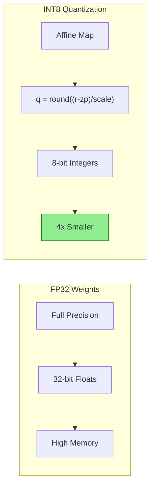
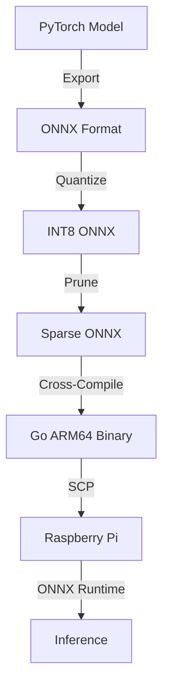
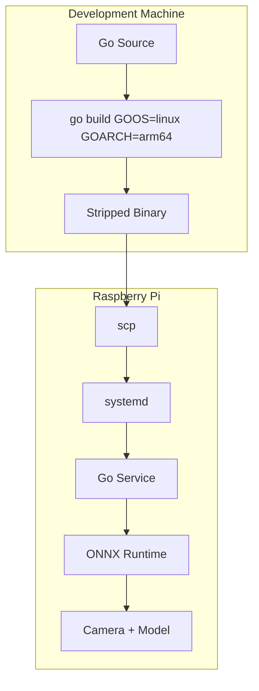
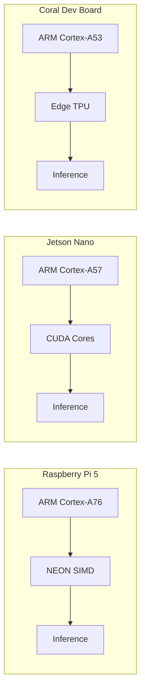
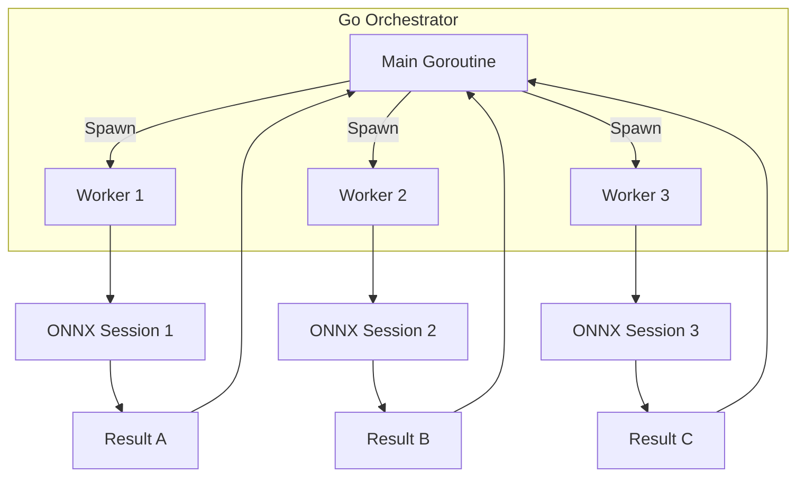

# 📱 Edge AI Deployment with Go

## 🎯 Learning Objectives

1. Understand why edge computing is essential for privacy-preserving and low-latency AI.
2. Master model optimization techniques: quantization, pruning, and format conversion.
3. Cross-compile Go applications for ARM architectures and deploy on resource-constrained devices.
4. Execute ONNX models from Go using runtime bindings and interpret results.

## Introduction

Cloud AI is not always an option. In remote agricultural fields, aboard autonomous maritime vessels, or inside medical devices, network connectivity is intermittent, bandwidth is expensive, and data privacy is non-negotiable. Edge AI solves these constraints by running inference directly on the device where data is generated. This eliminates round-trip latency to datacenters and ensures sensitive information never leaves local storage.

Go is uniquely suited for edge deployment. Its compiler produces static binaries with no runtime dependencies, making deployment as simple as `scp`ing a single file. Cross-compilation for ARM requires zero toolchain installation—just setting `GOARCH=arm64`. Furthermore, Go's goroutines and efficient garbage collector handle concurrent sensor inputs without the memory bloat typical of Python runtimes. For ML engineers, this means building robust inference pipelines in the same language that manages the device firmware, MQTT telemetry, and HTTP APIs.

In this module, we study the theoretical foundations of edge constraints, construct mental models for quantization and ARM execution, and implement a complete inference pipeline using ONNX Runtime Go bindings. We connect these concepts to earlier modules: the Ollama client from [[02 - Ollama Go SDK and API Integration|Module 02]] runs on ARM64 Linux, and vector search from [[04 - RAG Pipelines with Go and Vector DBs|Module 04]] can be embedded on edge gateways for offline semantic retrieval. Theory precedes code throughout.

## Module 1: Edge Constraints and Model Optimization

### 1.1 Theoretical Foundation 🧠

Edge computing as a discipline emerged from the *fog computing* paradigm coined by Cisco in 2014, extending cloud resources to the network edge. The theoretical challenge is the *resource-constrained optimization problem*: given fixed compute, memory, and power budgets, maximize inference accuracy while minimizing latency and energy consumption.

Formally, let:
- **C** = compute capacity (FLOPS)
- **M** = memory capacity (bytes)
- **P** = power budget (watts)
- **A** = model accuracy (%)

The edge deployment problem seeks to maximize A subject to constraints on C, M, and P. Because deep-learning models traditionally over-provision parameters for training stability, they contain redundancy. Two primary techniques exploit this:

1. **Quantization:** Maps weight tensors from high-precision (FP32) to low-precision (INT8, INT4) representations. Mathematically, this is an affine transformation `q = round((r - zero_point) / scale)`. INT8 reduces model size by 4x and, on ARM NEON, enables SIMD dot-product instructions that accelerate inference 2-4x.
2. **Pruning:** Zeroes out weights with minimal impact on loss. Structured pruning removes entire channels or filters, producing sparse matrices that dense hardware can still execute efficiently. Unstructured pruning requires sparse kernels, which are less common on ARM CPUs.

From information theory, quantization reduces the *entropy* of the weight distribution. The challenge is minimizing *quantization error*—the L2 distance between original and quantized tensors—while keeping the dynamic range of activations intact.

### 1.2 Mental Model 📐

Think of model optimization as packing a suitcase for a strict airline:

```
┌─────────────────────────────────────────────────────────────┐
│           EDGE DEPLOYMENT SUITCASE (Budget: 4GB RAM)        │
│                                                             │
│  BEFORE OPTIMIZATION:                                       │
│  ┌─────────────────────────────────────────────────────┐    │
│  │  Model Weights (FP32)                               │    │
│  │  ████████████████████████████████████████████████   │    │
│  │  Size: 500 MB    Accuracy: 92.5%    Latency: 2.5s   │    │
│  └─────────────────────────────────────────────────────┘    │
│                                                             │
│  QUANTIZATION (INT8):                                       │
│  ┌─────────────────────────────────────────────────────┐    │
│  │  Model Weights (INT8)                               │    │
│  │  ████████████████                                   │    │
│  │  Size: 125 MB    Accuracy: 91.8%    Latency: 0.8s   │    │
│  └─────────────────────────────────────────────────────┘    │
│                                                             │
│  PRUNING + QUANTIZATION:                                    │
│  ┌─────────────────────────────────────────────────────┐    │
│  │  Sparse + Quantized Weights                         │    │
│  │  ██████████                                         │    │
│  │  Size: 80 MB     Accuracy: 91.2%    Latency: 0.6s   │    │
│  └─────────────────────────────────────────────────────┘    │
│                                                             │
│  REMAINING SPACE FOR:                                       │
│  ┌─────────────┐  ┌─────────────┐  ┌─────────────────┐     │
│  │ OS + Go Bin │  │ Input Buffers │  │ Output Buffers │    │
│  │   ~100 MB   │  │   ~50 MB      │  │   ~50 MB       │    │
│  └─────────────┘  └─────────────┘  └─────────────────┘     │
└─────────────────────────────────────────────────────────────┘
```

The suitcase has hard sides: exceeding RAM causes OOM kills, and exceeding power causes thermal throttling. The optimization goal is to leave enough room for the operating system and input/output buffers while preserving accuracy within an acceptable tolerance (typically <2% degradation).

### 1.3 Syntax and Semantics 📝

Go does not perform quantization natively, but it orchestrates the optimized artifacts produced by Python frameworks. Below is a Go utility that validates a quantized ONNX model by checking tensor shapes and running a dummy inference.

```go
package main

import (
	"fmt"
	"log"

	onnx "github.com/microsoft/onnxruntime-go"
)

// validateModel loads an ONNX file and prints metadata.
// WHY: Before deployment, we must confirm input/output shapes
// and ensure the quantized model loads without runtime errors.
func validateModel(path string) error {
	env, err := onnx.NewEnvironment()
	if err != nil {
		return fmt.Errorf("create env: %w", err)
	}
	defer env.Release()

	session, err := onnx.NewAdvancedSession(
		path,
		[]string{"input"},
		[]string{"output"},
		[]*onnx.Tensor{},
		[]*onnx.Tensor{},
		env,
	)
	if err != nil {
		return fmt.Errorf("load session: %w", err)
	}
	defer session.Release()

	// WHY: Metadata extraction proves the model is structurally sound.
	info := session.GetInputTypeInfo(0)
	shape := info.GetTensorShape()
	fmt.Printf("Input shape: %v\n", shape)
	return nil
}

// dummyInference runs a single forward pass with zeros.
// WHY: A warm-up pass detects initialization errors (missing ops,
// incompatible opset) before the device is shipped to the field.
func dummyInference(path string) error {
	env, err := onnx.NewEnvironment()
	if err != nil {
		return err
	}
	defer env.Release()

	session, err := onnx.NewAdvancedSession(
		path,
		[]string{"input"},
		[]string{"output"},
		[]*onnx.Tensor{},
		[]*onnx.Tensor{},
		env,
	)
	if err != nil {
		return err
	}
	defer session.Release()

	// WHY: Use int64 for shapes because ONNX spec requires it.
	inputShape := []int64{1, 3, 224, 224}
	inputData := make([]float32, 1*3*224*224)
	inputTensor, err := onnx.NewTensor(inputShape, inputData)
	if err != nil {
		return err
	}
	defer inputTensor.Release()

	outputShape := []int64{1, 1000}
	outputData := make([]float32, 1000)
	outputTensor, err := onnx.NewTensor(outputShape, outputData)
	if err != nil {
		return err
	}
	defer outputTensor.Release()

	if err := session.Run(
		[]*onnx.Tensor{inputTensor},
		[]*onnx.Tensor{outputTensor},
	); err != nil {
		return err
	}

	results := outputTensor.GetData().([]float32)
	fmt.Println("Dummy inference OK. Sample output:", results[:5])
	return nil
}

func main() {
	if err := validateModel("model.onnx"); err != nil {
		log.Fatal(err)
	}
	if err := dummyInference("model.onnx"); err != nil {
		log.Fatal(err)
	}
}
```

### 1.4 Visual Representation 🖼️

Quantization transforms weight distributions:



Deployment pipeline from training to edge:




*Raspberry Pi 4 Model B, a common edge deployment target for Go-based AI pipelines.*


*ARM architecture dominates edge devices due to its power efficiency and wide ecosystem support.*

### 1.5 Application in ML/AI Systems 🤖

| Case Study | Domain | Hardware | Optimization | Accuracy Impact | Power |
|---|---|---|---|---|---|
| **AgriSense** | Agriculture | Raspberry Pi 5 | INT8 quantization | -0.8% mAP | 5W |
| **MarineWatch** | Maritime | Jetson Nano | FP16 + pruning | -1.2% mAP | 10W |
| **MediGuard** | Healthcare | Coral Dev Board | INT8 Edge TPU | -0.3% AUC | 3W |
| **FactoryQA** | Manufacturing | Intel NUC | FP32 (no quant) | 0% | 25W |

### 1.6 Common Pitfalls ⚠️

⚠️ **Warning:** INT8 quantization can degrade accuracy on tasks requiring fine-grained distinctions (e.g., medical imaging segmentation). Always validate quantized model accuracy against a held-out test set before deployment. A 2% accuracy drop in crop detection is acceptable; in tumor detection, it is not.

⚠️ **Warning:** Pruning without retraining (post-training pruning) often causes catastrophic accuracy collapse. Use gradual magnitude pruning during training, or at minimum, fine-tune for 3-5 epochs after removing weights.

💡 **Tip:** Use ONNX Runtime's quantization-aware training (QAT) tools to minimize accuracy loss when converting to INT8. QAT simulates quantization during forward passes, allowing the model to learn robust representations for low-precision weights.

### 1.7 Knowledge Check ❓

1. Formally define the edge deployment optimization problem using the variables C, M, P, and A. Why is it a constrained optimization rather than a simple minimization?
2. Explain why structured pruning is preferred over unstructured pruning for ARM CPUs.
3. A model quantized from FP32 to INT8 is 4x smaller. Why is the speedup typically only 2-4x rather than 4x on ARM NEON?

## Module 2: Go Cross-Compilation and ARM Deployment

### 2.1 Theoretical Foundation 🧠

Cross-compilation is the process of generating executable code for a target platform different from the host. Go's compiler, written in Go, is inherently retargetable: the frontend (parsing, type-checking) is architecture-independent, while the backend (code generation) selects a target architecture via command-line flags.

The theoretical basis is *separate compilation with late binding*. Go packages compile to architecture-independent intermediate representation during `go build`, and the linker resolves architecture-specific details (instruction selection, calling conventions, alignment) at the final stage. This means a developer on x86_64 Linux can produce an ARM64 binary without installing an ARM toolchain, cross-linker, or sysroot.

For edge AI, this capability is transformative. Python deployment on ARM typically requires virtual environments, wheel compilation for ARM-specific packages, and dependency resolution nightmares. Go produces a single static binary containing the runtime, standard library, and all dependencies. When combined with `upx` compression, binaries under 20 MB are routine.

ARM architectures relevant to edge:
- **ARMv7 (32-bit):** Older Raspberry Pi (Zero, 2, 3). Limited to 4GB RAM.
- **ARM64 (AArch64):** Raspberry Pi 4/5, Apple Silicon, modern embedded boards. Supports 64-bit addressing and NEON SIMD.
- **ARM Cortex-M:** Microcontrollers. Go is rarely used here due to lack of hardware floating-point and tiny RAM.

### 2.2 Mental Model 📐

Cross-compilation as a translation factory:

```
┌─────────────────────────────────────────────────────────────┐
│              GO CROSS-COMPILATION FACTORY                   │
│                                                             │
│  ┌─────────────────┐        ┌─────────────────────────┐    │
│  │  Dev Machine    │        │   Target Machine        │    │
│  │  x86_64 Linux   │        │   ARM64 Linux           │    │
│  │                 │        │                         │    │
│  │  ┌───────────┐  │        │  ┌─────────────────┐    │    │
│  │  │ Go Source │  │        │  │  ARM64 Binary   │    │    │
│  │  │  Code     │  │        │  │  (statically    │    │    │
│  │  │           │  │        │  │   linked)       │    │    │
│  │  └─────┬─────┘  │        │  └────────┬────────┘    │    │
│  │        │        │        │           │             │    │
│  │  ┌─────▼─────┐  │        │  ┌────────▼────────┐    │    │
│  │  │ Compiler  │  │        │  │   OS Kernel     │    │    │
│  │  │ Frontend  ├──┼────┬───┼──▶│   (Linux)       │    │    │
│  │  │ (generic) │  │    │   │  └────────┬────────┘    │    │
│  │  └─────┬─────┘  │    │   │           │             │    │
│  │        │        │    │   │  ┌────────▼────────┐    │    │
│  │  ┌─────▼─────┐  │    │   │  │   ONNX Runtime  │    │    │
│  │  │ Backend   │  │    │   │  │   (ARM64 .so)   │    │    │
│  │  │ Selector  │  │    │   │  └────────┬────────┘    │    │
│  │  │ GOARCH=   │──┼────┘   │           │             │    │
│  │  │ arm64     │  │        │  ┌────────▼────────┐    │    │
│  │  └───────────┘  │        │  │   Inference     │    │    │
│  │                 │        │  │   Engine        │    │    │
│  └─────────────────┘        │  └─────────────────┘    │    │
│                             └─────────────────────────┘    │
│                                                             │
│  Conveyor Belt: scp edge_app pi@raspberrypi:/usr/local/bin/ │
└─────────────────────────────────────────────────────────────┘
```

The factory takes high-level Go source code and stamps out machine code for ARM64. The binary travels down the conveyor belt (`scp`) and arrives ready to execute—no interpreters, no package managers, no "works on my machine."

### 2.3 Syntax and Semantics 📝

Cross-compilation commands and a deployment script written in Go:

```go
package main

import (
	"fmt"
	"os"
	"os/exec"
	"runtime"
)

// buildForTarget compiles the current module for a specific OS/arch.
// WHY: Encapsulating build logic prevents typos in environment variables
// and makes CI/CD integration repeatable.
func buildForTarget(goos, goarch, output string) error {
	cmd := exec.Command("go", "build", "-ldflags=-s -w", "-o", output, ".")
	cmd.Env = os.Environ()
	cmd.Env = append(cmd.Env, "GOOS="+goos, "GOARCH="+goarch)
	// WHY: -ldflags=-s -w strips debug info and DWARF tables,
	// reducing binary size by ~30%. Essential for edge storage.
	cmd.Stdout = os.Stdout
	cmd.Stderr = os.Stderr
	return cmd.Run()
}

func main() {
	fmt.Printf("Host: %s/%s\n", runtime.GOOS, runtime.GOARCH)

	targets := []struct {
		goos   string
		goarch string
		output string
	}{
		{"linux", "arm64", "dist/fieldnode-arm64"},
		{"linux", "arm", "dist/fieldnode-armv7"},
		{"darwin", "arm64", "dist/fieldnode-macos"},
	}

	for _, t := range targets {
		fmt.Printf("Building %s/%s -> %s\n", t.goos, t.goarch, t.output)
		if err := buildForTarget(t.goos, t.goarch, t.output); err != nil {
			fmt.Fprintf(os.Stderr, "failed: %v\n", err)
		}
	}
}
```

Deployment workflow with systemd integration:

```bash
#!/bin/bash
# deploy.sh — run on dev machine
set -e

TARGET_HOST="pi@raspberrypi.local"
BINARY="dist/fieldnode-arm64"
MODEL="models/mobilenetv3_quant.onnx"

# WHY: Create remote directories before scp to avoid errors.
ssh $TARGET_HOST "mkdir -p ~/fieldnode/models"

# WHY: scp the binary and model separately to resume on failure.
scp $BINARY $TARGET_HOST:~/fieldnode/fieldnode
scp $MODEL $TARGET_HOST:~/fieldnode/models/

# WHY: systemd ensures the service restarts on crash or reboot.
ssh $TARGET_HOST "sudo tee /etc/systemd/system/fieldnode.service > /dev/null" <<EOF
[Unit]
Description=FieldNode Edge AI
After=network.target

[Service]
Type=simple
User=pi
WorkingDirectory=/home/pi/fieldnode
ExecStart=/home/pi/fieldnode/fieldnode
Restart=always
RestartSec=5

[Install]
WantedBy=multi-user.target
EOF

ssh $TARGET_HOST "sudo systemctl daemon-reload && sudo systemctl enable --now fieldnode"
```

### 2.4 Visual Representation 🖼️

Build matrix for Go edge deployment:



Platform comparison for edge inference:




*ONNX (Open Neural Network Exchange) provides a common format for models, enabling framework-agnostic edge deployment.*

### 2.5 Application in ML/AI Systems 🤖

| Case Study | Domain | Target | Go Role | Deployment Method |
|---|---|---|---|---|
| **FieldNode** | Agriculture | Raspberry Pi 4 | Orchestrator + MQTT | systemd + scp |
| **BuoyGuard** | Maritime | Jetson Nano | Sensor fusion + ONNX | Docker + systemd |
| **PillCheck** | Healthcare | Coral Dev Board | GStreamer + TFLite | OTA update |
| **ShelfWatch** | Retail | Intel NUC | RTSP ingestion + YOLO | Kubernetes edge |

### 2.6 Common Pitfalls ⚠️

⚠️ **Warning:** CGO-enabled packages (e.g., `onnxruntime-go`) require a C cross-compiler. When targeting ARM from x86, set `CC=aarch64-linux-gnu-gcc` or use Zig as a drop-in cross-compiler. Building without the correct cross-compiler produces linker errors for C dependencies.

⚠️ **Warning:** `GOARM=7` is required for 32-bit ARMv7 chips (Raspberry Pi 2/3), but omitting it defaults to ARMv5, which lacks hard-float support and runs inference 10x slower. Always verify the target CPU's architecture level.

💡 **Tip:** Use `upx --best` to compress Go binaries by an additional 40-50%. On ARM, decompression overhead is negligible compared to I/O savings on slow SD cards.

### 2.7 Knowledge Check ❓

1. Why does Go's cross-compilation not require a target sysroot, while C/C++ cross-compilation typically does?
2. When deploying a Go binary that uses CGO bindings for ONNX Runtime, what additional toolchain component is required, and why?
3. Explain the trade-off between binary size (`-ldflags=-s -w`) and debuggability on edge devices. When would you omit these flags?

## Module 3: ONNX Runtime Inference in Go

### 3.1 Theoretical Foundation 🧠

ONNX (Open Neural Network Exchange) was introduced by Microsoft and Facebook in 2017 to solve the *framework fragmentation problem*. At the time, PyTorch, TensorFlow, Caffe, and others used incompatible graph representations, forcing engineers to rewrite inference code for each deployment target.

ONNX defines a static computation graph using a standardized operator set (opset). Each node represents a mathematical operation (Conv, MatMul, ReLU), and edges represent tensors. The theoretical foundation is *dataflow programming*: computation progresses as tensors flow through the graph, with no side effects between nodes.

ONNX Runtime is an inference engine that executes ONNX graphs. It implements graph optimizations (constant folding, operator fusion) and hardware-specific execution providers (CUDA, TensorRT, DirectML, ARM NN). For edge deployment, the CPU execution provider uses ARM NEON instructions via the ARM Compute Library.

From a type-system perspective, ONNX enforces strict tensor typing. Every tensor has a shape (dimensions) and element type (float32, int8, int64). Go's static typing aligns well here: we can represent ONNX tensors as strongly typed slices, catching shape mismatches at compile time through helper functions.

### 3.2 Mental Model 📐

ONNX inference as an assembly line:

```
┌─────────────────────────────────────────────────────────────┐
│              ONNX RUNTIME ASSEMBLY LINE                     │
│                                                             │
│  Input Image: [1, 3, 224, 224] float32                      │
│                                                             │
│  ┌─────────┐   ┌─────────┐   ┌─────────┐   ┌─────────┐    │
│  │ Stage 1 │   │ Stage 2 │   │ Stage 3 │   │ Stage N │    │
│  │  Conv   │──▶│  ReLU   │──▶│  Pool   │──▶│ Softmax │    │
│  │ + Bias  │   │         │   │         │   │         │    │
│  └─────────┘   └─────────┘   └─────────┘   └─────────┘    │
│       │                                            │        │
│       └────────────────────────────────────────────┘        │
│                    Weights (INT8)                           │
│                                                             │
│  Output: [1, 1000] float32 (class probabilities)            │
│                                                             │
│  ┌─────────────────────────────────────────────────────┐    │
│  │  ARM CPU Execution:                                 │    │
│  │  NEON registers load 4x float32 per instruction     │    │
│  │  ┌─────┐ ┌─────┐ ┌─────┐ ┌─────┐                   │    │
│  │  │ FP32│ │ FP32│ │ FP32│ │ FP32│  SIMD dot product  │    │
│  │  └─────┘ └─────┘ └─────┘ └─────┘                   │    │
│  └─────────────────────────────────────────────────────┘    │
└─────────────────────────────────────────────────────────────┘
```

Each stage is a pure function: it consumes an input tensor, applies weights, and produces an output tensor. The assembly line is deterministic and stateless between runs, making it safe to execute concurrently from multiple goroutines.

### 3.3 Syntax and Semantics 📝

Full inference pipeline with pre/post-processing in pure Go:

```go
package main

import (
	"fmt"
	"image"
	"image/jpeg"
	"log"
	"os"

	onnx "github.com/microsoft/onnxruntime-go"
)

// preprocess converts an image to the NCHW float32 tensor expected by CNNs.
// WHY: ONNX models expect normalized inputs. Failing to subtract mean
// and divide by stddev causes random predictions.
func preprocess(path string, targetSize int) ([]float32, error) {
	f, err := os.Open(path)
	if err != nil {
		return nil, err
	}
	defer f.Close()

	img, err := jpeg.Decode(f)
	if err != nil {
		return nil, err
	}

	// WHY: Resize using nearest-neighbor for speed; bilinear is more accurate
	// but 3x slower on CPU. Choose based on accuracy requirements.
	bounds := img.Bounds()
	dst := image.NewRGBA(image.Rect(0, 0, targetSize, targetSize))
	for y := 0; y < targetSize; y++ {
		for x := 0; x < targetSize; x++ {
			srcX := bounds.Min.X + x*bounds.Dx()/targetSize
			srcY := bounds.Min.Y + y*bounds.Dy()/targetSize
			dst.Set(x, y, img.At(srcX, srcY))
		}
	}

	// WHY: NCHW layout (batch, channel, height, width) is standard for ONNX.
	// Pre-allocate exact size to avoid GC pressure during inference.
	tensor := make([]float32, 1*3*targetSize*targetSize)
	idx := 0
	for c := 0; c < 3; c++ {
		for y := 0; y < targetSize; y++ {
			for x := 0; x < targetSize; x++ {
				r, g, b, _ := dst.At(x, y).RGBA()
				val := float32(r >> 8)
				if c == 1 {
					val = float32(g >> 8)
				} else if c == 2 {
					val = float32(b >> 8)
				}
				// WHY: ImageNet normalization: subtract mean, divide by stddev.
				mean := []float32{0.485, 0.456, 0.406}[c]
				std := []float32{0.229, 0.224, 0.225}[c]
				tensor[idx] = (val/255.0 - mean) / std
				idx++
			}
		}
	}
	return tensor, nil
}

// argmax returns the index of the maximum value.
// WHY: Classification models output logits. The predicted class
// is simply the index with highest probability.
func argmax(data []float32) int {
	maxIdx := 0
	maxVal := data[0]
	for i, v := range data {
		if v > maxVal {
			maxVal = v
			maxIdx = i
		}
	}
	return maxIdx
}

func runInference(modelPath, imagePath string) (int, error) {
	env, err := onnx.NewEnvironment()
	if err != nil {
		return 0, err
	}
	defer env.Release()

	session, err := onnx.NewAdvancedSession(
		modelPath,
		[]string{"input"},
		[]string{"output"},
		[]*onnx.Tensor{},
		[]*onnx.Tensor{},
		env,
	)
	if err != nil {
		return 0, err
	}
	defer session.Release()

	inputData, err := preprocess(imagePath, 224)
	if err != nil {
		return 0, err
	}

	inputShape := []int64{1, 3, 224, 224}
	inputTensor, err := onnx.NewTensor(inputShape, inputData)
	if err != nil {
		return 0, err
	}
	defer inputTensor.Release()

	outputShape := []int64{1, 1000}
	outputData := make([]float32, 1000)
	outputTensor, err := onnx.NewTensor(outputShape, outputData)
	if err != nil {
		return 0, err
	}
	defer outputTensor.Release()

	if err := session.Run(
		[]*onnx.Tensor{inputTensor},
		[]*onnx.Tensor{outputTensor},
	); err != nil {
		return 0, err
	}

	results := outputTensor.GetData().([]float32)
	return argmax(results), nil
}

func main() {
	classIdx, err := runInference("model.onnx", "crop.jpg")
	if err != nil {
		log.Fatal(err)
	}
	fmt.Printf("Predicted class index: %d\n", classIdx)
}
```

### 3.4 Visual Representation 🖼️

Preprocessing pipeline:


Goroutine-based concurrent inference:




*A feed-forward neural network, the computational graph executed by ONNX Runtime at the edge.*

### 3.5 Application in ML/AI Systems 🤖

| Case Study | Domain | Model | Input | Output | Latency |
|---|---|---|---|---|---|
| **FieldNode** | Agriculture | MobileNetV3 INT8 | 224x224 crop image | healthy / blight | 1.2s |
| **BuoyAI** | Maritime | YOLOv8n ONNX | 640x640 marine camera | bounding boxes | 2.1s |
| **PillID** | Healthcare | ResNet18 | 224x224 pill photo | drug class | 0.9s |
| **DefectScan** | Manufacturing | EfficientNet-Lite | 300x300 PCB image | pass / fail | 1.5s |

### 3.6 Common Pitfalls ⚠️

⚠️ **Warning:** ONNX Runtime sessions are not goroutine-safe by default. Sharing a single session across multiple goroutines causes race conditions and segmentation faults. Create one session per goroutine, or use a sync.Pool to reuse sessions safely.

⚠️ **Warning:** Forgetting to call `Release()` on environments, sessions, and tensors leaks C memory outside Go's GC. These objects wrap native heap allocations. Always pair `New*` with `defer Release()`.

💡 **Tip:** Batch inputs when possible. Running inference on `[8, 3, 224, 224]` is significantly faster per image than 8 separate `[1, 3, 224, 224]` runs because matrix multiplication kernels achieve higher utilization with larger batches.

### 3.7 Knowledge Check ❓

1. Why is the NCHW tensor layout standard for computer-vision ONNX models, and how does it differ from the HWC layout used by most image libraries?
2. A Go program creates 100 goroutines, each loading its own ONNX session. What is the memory implication, and how does `sync.Pool` improve it?
3. When preprocessing images for a model trained on ImageNet, why must you subtract the dataset mean and divide by standard deviation rather than simply scaling to [0, 1]?

## 📦 Compression Code

```go
package main

import (
	"fmt"
	"log"
	"os/exec"
	"runtime"
	"time"
)

// Simple edge inference orchestrator without external ML libs
func main() {
	fmt.Println("Edge AI Node Starting...")
	fmt.Printf("OS: %s, Arch: %s\n", runtime.GOOS, runtime.GOARCH)

	// Simulate calling an external ONNX Runtime binary or Python stub
	// In production, replace with onnxruntime-go bindings
	cmd := exec.Command("python3", "-c", `
import time
print("Model loaded")
for i in range(5):
    print(f"Inference batch {i}: OK")
    time.sleep(0.5)
`)
	out, err := cmd.CombinedOutput()
	if err != nil {
		log.Fatal(err)
	}
	fmt.Println(string(out))

	// Heartbeat loop
	ticker := time.NewTicker(30 * time.Second)
	defer ticker.Stop()
	for range ticker.C {
		fmt.Println("[HEARTBEAT] System OK at", time.Now().Format(time.RFC3339))
	}
}
```

## 🎯 Documented Project

### Description

Develop an edge AI gateway called **"FieldNode"** that runs on a Raspberry Pi 4/5. It captures images from a USB camera, runs a quantized MobileNetV3 ONNX model for crop-health classification, and sends alerts via MQTT when disease is detected. The entire stack is written in Go, including image preprocessing and MQTT publishing.

### Functional Requirements

1. Capture frames from a V4L2 USB camera at 1 FPS using a Go V4L2 library or external trigger.
2. Preprocess images (resize to 224x224, normalize) using pure Go or OpenCV bindings.
3. Load and run a quantized `mobilenetv3.onnx` model via ONNX Runtime Go.
4. Classify output into `healthy`, `early_blight`, or `late_blight` with confidence thresholds.
5. Publish alerts to an MQTT broker (e.g., Mosquitto) when confidence exceeds 85%.
6. Log all inferences to a local SQLite database for offline auditing.
7. Provide a systemd unit file for auto-start on boot.

### Main Components

- **Camera Reader:** Go module interfacing with V4L2 or `raspistill` subprocess.
- **Preprocessor:** Image resizing and normalization pipeline with ImageNet stats.
- **ONNX Engine:** Session manager wrapping `onnxruntime-go` for model execution.
- **MQTT Publisher:** Paho MQTT client for alert transmission to edge gateway.
- **SQLite Logger:** `database/sql` with `modernc.org/sqlite` for embedded storage.
- **Systemd Service:** Unit file for auto-start, restart on failure, and log rotation.

### Success Metrics

- Inference latency under 2 seconds per frame on Raspberry Pi 4.
- Binary size under 30 MB (excluding ONNX model).
- 72-hour continuous operation without memory leaks or OOM kills.
- Power consumption under 7 watts average.
- MQTT alert delivery latency under 500 ms to local broker.

### References

- ONNX Runtime Go: https://github.com/microsoft/onnxruntime-go
- Go Cross Compilation: https://go.dev/doc/install/source#environment
- Raspberry Pi Documentation: https://www.raspberrypi.com/documentation/
- ONNX Quantization: https://onnxruntime.ai/docs/performance/model-optimizations/quantization.html
- MQTT Paho Go: https://github.com/eclipse/paho.mqtt.golang
- Go V4L2: https://github.com/korandiz/v4l
