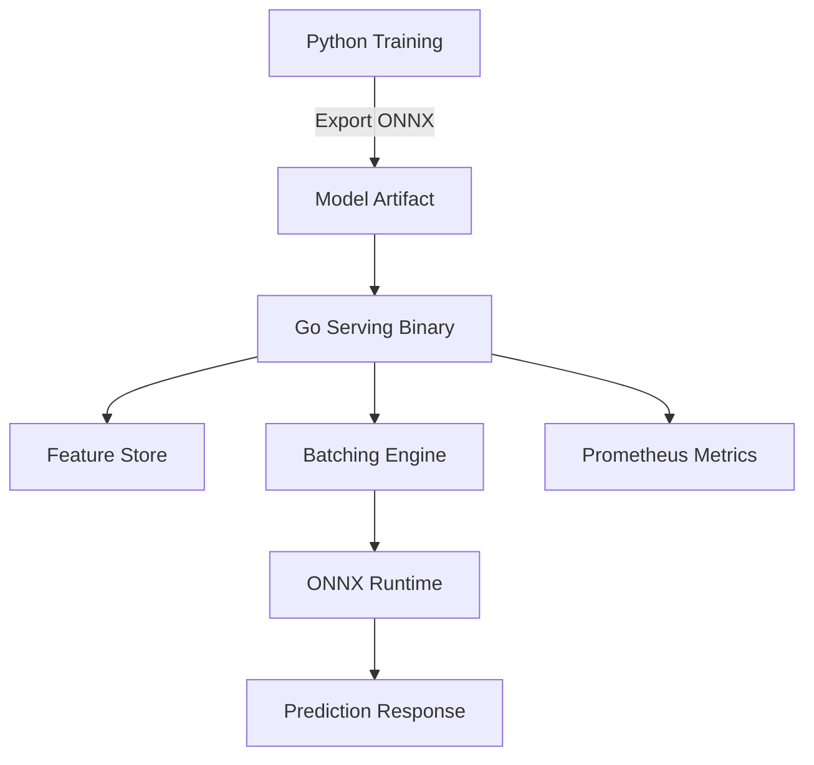
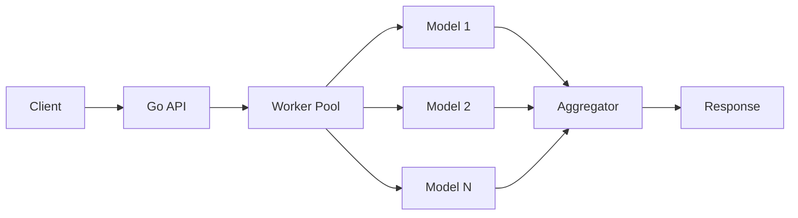
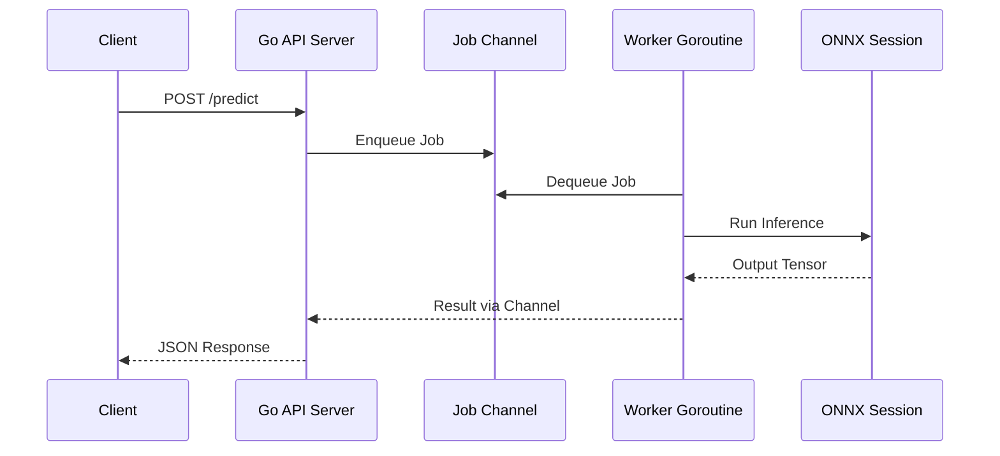
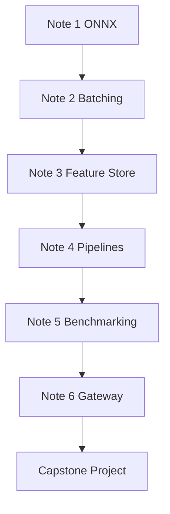

# ⚙️ Welcome to Go for ML Backend

## 🎯 Learning Objectives

By the end of this module, you will be able to:

- Explain why Go is uniquely suited for production ML serving infrastructure
- Map ONNX Runtime, batching workers, and feature stores into a unified backend architecture
- Evaluate trade-offs between Python research tooling and Go deployment runtimes
- Design a capstone project that combines inference, caching, and observability in a single Go service

## Introduction

Machine learning in production is no longer just about training accurate models. It is about serving those models at scale with millisecond latency, handling thousands of concurrent requests, and doing so without the memory bloat and GIL contention that plague traditional Python servers. Go enters this landscape as a systems language that offers goroutine-based concurrency, static binaries, and garbage collection tuned for low-pause serving workloads. The result is a backend runtime that can saturate CPU and GPU resources while maintaining predictable tail latency.

This course bridges the gap between Go engineering and machine learning deployment. You will learn how to productionize models using Go's superior concurrency primitives, memory efficiency, and deployment ergonomics. Each note builds upon the last, starting with single-model inference via ONNX Runtime, progressing through high-throughput batching architectures, and culminating in feature stores and real-time pipelines. By the end, you will be capable of designing end-to-end ML backend systems where Go handles serving, orchestration, and scaling, while Python remains in the research and training domain.

The modules ahead are designed to be read sequentially. [[01 - ONNX Runtime Go|🔢 ONNX Runtime Go]] establishes the inference foundation. [[02 - High-Throughput Model Serving|🚀 High-Throughput Model Serving]] adds concurrency patterns. [[03 - Feature Stores with Go|🏪 Feature Stores with Go]] introduces data retrieval optimization. Later modules cover pipelines, benchmarking, and gateway construction.

## Module 1: The ML Backend Landscape

### 1.1 Theoretical Foundation 🧠

The history of ML serving is a story of decoupling. In the 2010s, model training and serving were often co-located in monolithic Python notebooks or Flask applications. As models grew larger and request volumes increased, this coupling became untenable. The computation graph abstraction, pioneered by frameworks like TensorFlow and later standardized by ONNX, allowed models to be exported as serialized directed acyclic graphs independent of their training environment.

From a computer science perspective, model serving is an instance of the RPC server pattern combined with batch job scheduling. The server must handle stateful sessions (loaded models), execute compute-intensive kernels (inference), and manage I/O-bound request queues. This maps directly to classic operating system concepts: process pools for isolation, work stealing for load balancing, and backpressure for memory safety. Go's runtime, with its M:N scheduler mapping goroutines to OS threads, was designed precisely for this class of problem.

### 1.2 Mental Model 📐

The ML backend sits at the intersection of three responsibilities:

```
┌─────────────────────────────────────────────────────────────┐
│                    ML Backend System                        │
├──────────────┬──────────────────────────────┬───────────────┤
│   Training   │         Serving Layer        │   Feature     │
│   (Python)   │           (Go)               │   Store       │
├──────────────┼──────────────────────────────┼───────────────┤
│  PyTorch     │  HTTP/gRPC API  -->  Batch   │  Redis/Dynamo │
│  TensorFlow  │       |            Worker    │      |        │
│      |       │       v              |       │      v        │
│   ONNX export│   Request Queue  --> Model   │  Cache Layer  │
│      |       │       |              |       │      |        │
│      v       │       v              v       │      v        │
│  Model File  │  <--- Inference Response --- │  Feature Vec  │
└──────────────┴──────────────────────────────┴───────────────┘
```

Training happens in Python. The exported model artifact crosses into the Go serving layer. The serving layer retrieves features from an online store, batches requests, runs inference, and returns predictions. This separation allows each layer to optimize for its own constraints.

```
┌─────────────────────────────────────────────────────────────┐
│              Request Lifecycle in Go Backend                │
├─────────────────────────────────────────────────────────────┤
│  [Client] --> [Load Balancer] --> [Go API Gateway]          │
│       |              |                   |                  │
│       |              |                   v                  │
│       |              |         [Auth/Rate Limit]            │
│       |              |                   |                  │
│       |              |                   v                  │
│       |              |         [Feature Store Client]       │
│       |              |                   |                  │
│       |              |                   v                  │
│       |              |         [Batching Worker Pool]       │
│       |              |                   |                  │
│       |              |                   v                  │
│       |              |         [ONNX Runtime Session]       │
│       |              |                   |                  │
│       |              |                   v                  │
│       |              |         [Post-processing]            │
│       |              |                   |                  │
│       |              └───────── [Response]                  │
│       |                                                     │
│       └────────────── [Metrics / Logs] --> Prometheus       │
└─────────────────────────────────────────────────────────────┘
```

Every request flows through authentication, feature retrieval, batching, inference, and post-processing. Metrics are emitted asynchronously to avoid blocking the critical path.

### 1.3 Syntax and Semantics 📝

The foundation of any Go backend is a goroutine-per-request or goroutine-per-worker architecture. Below is a minimal pattern that you will see extended throughout this course.

```go
package main

import (
	"fmt"
	"net/http"
	"time"
)

// WHY: http.HandlerFunc spawns a goroutine per request automatically.
// This gives us concurrency without explicit thread management.
func helloHandler(w http.ResponseWriter, r *http.Request) {
	// WHY: Simulate feature retrieval or model inference latency.
	time.Sleep(10 * time.Millisecond)
	fmt.Fprintf(w, "OK")
}

func main() {
	// WHY: http.ListenAndServe is the simplest production-ready server.
	// Under the hood, it uses Go's netpoller (epoll/kqueue/IOCP)
	// to handle thousands of concurrent connections.
	http.HandleFunc("/predict", helloHandler)
	fmt.Println("Server on :8080")
	if err := http.ListenAndServe(":8080", nil); err != nil {
		panic(err)
	}
}
```

Go's `net/http` package is deceptively powerful. Its default server uses an efficient event-driven I/O layer while presenting a synchronous handler interface. This means your handler code can be simple and sequential while the runtime handles concurrency for you.

### 1.4 Visual Representation 🖼️




The diagram above illustrates the canonical separation of concerns. Python generates the model artifact. Go consumes it, orchestrates data retrieval, and serves predictions. Metrics flow out to an observability stack.




### 1.5 Application in ML/AI Systems 🤖

| Company | Use Case | Go's Role | Outcome |
|---------|----------|-----------|---------|
| Uber | Michelangelo platform | Go microservices for request routing and batching | Thousands of models served with sub-100ms P99 |
| Netflix | Real-time recommendation | Go feature store client | Sub-5ms feature retrieval at scale |
| Twitch | Stream classification | Go inference workers | 10x throughput vs Python baseline |
| Datadog | Anomaly detection | Go pipeline processors | Reduced memory footprint by 80% |

### 1.6 Common Pitfalls ⚠️

⚠️ **Warning:** Do not treat Go as a replacement for Python in the research phase. Go lacks the rich ecosystem of autograd frameworks and interactive notebooks. Use Go for serving, not experimentation.

⚠️ **Warning:** Avoid premature optimization. A simple `http.ListenAndServe` with a single goroutine handling ONNX inference is sufficient for prototypes. Add worker pools and batching only after benchmarking reveals a bottleneck.

💡 **Tip:** Start every project with `pprof` and Prometheus instrumentation in place. Observability is not an afterthought in ML serving; it is essential for detecting model drift, latency regression, and queue saturation.

### 1.7 Knowledge Check ❓

1. Why does Go's goroutine model outperform Python's thread or asyncio model for CPU-bound inference workloads?
2. Name three responsibilities of an ML backend that are distinct from model training.
3. In the request lifecycle diagram, why is the metrics emission path drawn as asynchronous rather than inline?

## Module 2: Go's Role in ML Serving

### 2.1 Theoretical Foundation 🧠

Go was designed at Google in 2007 to solve the problems of large-scale software engineering: slow builds, uncontrolled dependencies, and the complexity of concurrent programming. Its creators, Rob Pike, Ken Thompson, and Robert Griesemer, explicitly rejected the complexity of C++ and Java concurrency models in favor of CSP (Communicating Sequential Processes), a formal language for describing patterns of interaction in concurrent systems.

In ML serving, CSP maps beautifully to the problem domain. A request arrives (a message), is placed on a channel (a queue), and is processed by a worker goroutine (a sequential process). Channels provide both synchronization and communication, eliminating an entire class of race conditions that plague lock-based threading. The scheduler's work-stealing algorithm ensures that CPU cores remain saturated even when individual requests have variable latency.

### 2.2 Mental Model 📐

Think of Go's scheduler as a load balancer for goroutines:

```
┌─────────────────────────────────────────────────────────────┐
│                   Go Runtime Scheduler                      │
├─────────────────────────────────────────────────────────────┤
│  Goroutines ( lightweight, ~2KB stack )                     │
│       |     |     |     |     |     |                       │
│       v     v     v     v     v     v                       │
│  ┌─────────────────────────────────────────┐                │
│  │      Go Runtime (M:N Scheduler)         │                │
│  │  ┌─────────┐ ┌─────────┐ ┌─────────┐   │                │
│  │  │  RunQ 1 │ │  RunQ 2 │ │  RunQ N │   │                │
│  │  └────┬────┘ └────┬────┘ └────┬────┘   │                │
│  │       └────────────┴───────────┘        │                │
│  │              Work Stealing                │                │
│  └─────────────────────────────────────────┘                │
│       |     |     |                                         │
│       v     v     v                                         │
│  ┌─────────────────────────────────────────┐                │
│  │      OS Threads (M)                     │                │
│  │  ┌─────┐ ┌─────┐ ┌─────┐ ┌─────┐       │                │
│  │  │ CPU │ │ CPU │ │ CPU │ │ CPU │       │                │
│  │  └─────┘ └─────┘ └─────┘ └─────┘       │                │
│  └─────────────────────────────────────────┘                │
└─────────────────────────────────────────────────────────────┘
```

Thousands of goroutines are multiplexed onto a smaller number of OS threads. When one goroutine blocks on I/O (e.g., Redis or feature store lookup), the scheduler swaps it out and runs another. This is how a single Go process can handle tens of thousands of concurrent inference requests without explicit async/await syntax.

```
┌─────────────────────────────────────────────────────────────┐
│              Memory Layout: Go vs Python                    │
├──────────────────────┬──────────────────────────────────────┤
│        Go            │              Python                  │
├──────────────────────┼──────────────────────────────────────┤
│  Static binary       │  Interpreter + C extensions          │
│  ~20MB overhead      │  ~200MB+ overhead (PyTorch)          │
│  Copying GC          │  Reference counting + cycle GC       │
│  ~1ms pauses         │  Unpredictable, multi-second pauses  │
│  Goroutines ~2KB     │  Threads ~8MB, asyncio overhead      │
│  No GIL              │  GIL limits CPU parallelism          │
└──────────────────────┴──────────────────────────────────────┘
```

### 2.3 Syntax and Semantics 📝

Channels are the backbone of Go serving architectures. Here is a minimal worker pool pattern that you will extend in later modules.

```go
package main

import (
	"fmt"
	"sync"
	"time"
)

// WHY: Job represents a unit of work. Using a struct with a
// result channel allows the caller to wait asynchronously.
type Job struct {
	ID     int
	Input  float64
	Result chan float64
}

// WHY: Worker reads from a shared channel and processes jobs.
// The sync.WaitGroup ensures clean shutdown.
func worker(id int, jobs <-chan Job, wg *sync.WaitGroup) {
	defer wg.Done()
	for j := range jobs {
		// WHY: Simulate inference latency.
		time.Sleep(10 * time.Millisecond)
		j.Result <- j.Input * 2.0
		fmt.Printf("worker %d processed job %d\n", id, j.ID)
	}
}

func main() {
	jobs := make(chan Job, 100)
	var wg sync.WaitGroup

	// WHY: Start 3 workers. The exact number should match
	// CPU cores or GPU batch capacity in production.
	for w := 1; w <= 3; w++ {
		wg.Add(1)
		go worker(w, jobs, &wg)
	}

	// WHY: Submit 5 jobs and collect results via channels.
	for i := 1; i <= 5; i++ {
		j := Job{ID: i, Input: float64(i), Result: make(chan float64, 1)}
		jobs <- j
		fmt.Println("result:", <-j.Result)
	}

	close(jobs)
	wg.Wait()
}
```

### 2.4 Visual Representation 🖼️




### 2.5 Application in ML/AI Systems 🤖

| System | Pattern | Go Advantage |
|--------|---------|--------------|
| Triton Inference Server (client) | gRPC streaming | Low-latency request dispatch |
| Feast Feature Store | Redis pipelining | Sub-millisecond batch lookups |
| Kafka Stream Processor | Consumer groups | High-throughput event ingestion |
| Custom Gateway | Reverse proxy | 10x lower memory than Python |

### 2.6 Common Pitfalls ⚠️

⚠️ **Warning:** Closing a channel from the receiver side causes a panic. Only the sender should close a channel, and typically only after all sends are complete.

⚠️ **Warning:** Buffered channels can hide backpressure. A channel with capacity 1000 will accept 1000 jobs before blocking, potentially exhausting memory if the producer is faster than the consumer.

💡 **Tip:** Use `select` with `default` to implement non-blocking sends. If the channel is full, reject the request immediately rather than queuing it indefinitely.

### 2.7 Knowledge Check ❓

1. What is CSP, and how does it simplify concurrent ML serving code compared to mutex-based threading?
2. Why is a goroutine's stack size (~2KB) significant when designing a server that handles 10,000 concurrent requests?
3. In the worker pool code, what would happen if `Result` were an unbuffered channel and the caller did not receive from it immediately?

## Module 3: Course Architecture

### 3.1 Theoretical Foundation 🧠

Effective technical curricula follow a spiral model: introduce a concept in isolation, then revisit it in increasingly complex contexts. This course applies that model to ML backend engineering. The first loop introduces ONNX inference as a single synchronous call. The second loop wraps that call in a worker pool. The third loop adds feature retrieval and caching. The fourth loop integrates everything into a gateway with observability.

This pedagogical structure mirrors how production systems evolve. Engineers rarely build a full platform on day one. They start with a script that loads a model and answers HTTP requests. As traffic grows, they add batching. As features multiply, they add Redis. As teams multiply, they add routing and A/B testing. Each note in this course corresponds to one of these evolutionary stages.

### 3.2 Mental Model 📐

```
┌─────────────────────────────────────────────────────────────┐
│                   Course Spiral                             │
├─────────────────────────────────────────────────────────────┤
│                                                             │
│   Loop 1: ONNX Inference (single request, single model)     │
│        |                                                    │
│        v                                                    │
│   Loop 2: Batching + Worker Pools (throughput)              │
│        |                                                    │
│        v                                                    │
│   Loop 3: Feature Stores + Caching (latency)                │
│        |                                                    │
│        v                                                    │
│   Loop 4: Gateway + Observability (reliability)             │
│        |                                                    │
│        v                                                    │
│   Loop 5: Benchmarking + Optimization (data-driven)         │
│                                                             │
└─────────────────────────────────────────────────────────────┘
```

Each loop adds a new dimension without discarding the previous ones. By the end, you will have traversed the full stack.

```
┌─────────────────────────────────────────────────────────────┐
│              Capstone System Architecture                   │
├─────────────────────────────────────────────────────────────┤
│  ┌─────────┐   ┌─────────────┐   ┌─────────────────────┐   │
│  │  Client │-->| Go Gateway  |-->| Batching Worker Pool|   │
│  └─────────┘   └─────────────┘   └─────────────────────┘   │
│                                         |                   │
│                                         v                   │
│  ┌─────────┐   ┌─────────────┐   ┌─────────────────────┐   │
│  │Prometheus|<--| Feature Store|<--|  ONNX Runtime       |   │
│  └─────────┘   │  (Redis+LRU)│   └─────────────────────┘   │
│                └─────────────┘                               │
└─────────────────────────────────────────────────────────────┘
```

### 3.3 Syntax and Semantics 📝

The capstone project ties together patterns from every module. Here is a skeleton showing how the components wire together.

```go
package main

import (
	"context"
	"fmt"
	"log"
	"net/http"
	"time"
)

// WHY: Gateway is the composition root. It holds references to
// all subsystems, ensuring clean initialization order.
type Gateway struct {
	featureStore FeatureStore
	batchServer  *BatchingServer
	metrics      *MetricsCollector
}

func (g *Gateway) PredictHandler(w http.ResponseWriter, r *http.Request) {
	start := time.Now()
	ctx, cancel := context.WithTimeout(r.Context(), 5*time.Second)
	defer cancel()

	// WHY: Retrieve features before inference. Latency here
	// is often the dominant term in end-to-end latency.
	features, err := g.featureStore.GetFeatureVector(ctx, "user_123", []string{"age", "clicks"})
	if err != nil {
		http.Error(w, err.Error(), http.StatusInternalServerError)
		g.metrics.RecordError()
		return
	}

	// WHY: Pass features to the batching server. The server
	// will merge this request with others to amortize model cost.
	prediction, err := g.batchServer.Predict(ctx, features)
	if err != nil {
		http.Error(w, err.Error(), http.StatusInternalServerError)
		g.metrics.RecordError()
		return
	}

	g.metrics.RecordLatency(time.Since(start))
	fmt.Fprintf(w, "Prediction: %v\n", prediction)
}

func main() {
	gw := &Gateway{}
	// ... initialize subsystems ...
	http.HandleFunc("/predict", gw.PredictHandler)
	log.Println("Gateway on :8080")
	log.Fatal(http.ListenAndServe(":8080", nil))
}

// WHY: Placeholder types to show composition.
type FeatureStore struct{}

func (fs FeatureStore) GetFeatureVector(ctx context.Context, entity string, names []string) (map[string]float64, error) {
	return map[string]float64{"age": 30, "clicks": 42}, nil
}

type BatchingServer struct{}

func (bs *BatchingServer) Predict(ctx context.Context, features map[string]float64) ([]float64, error) {
	return []float64{0.9, 0.1}, nil
}

type MetricsCollector struct{}

func (m *MetricsCollector) RecordLatency(d time.Duration) {}
func (m *MetricsCollector) RecordError()                   {}
```

### 3.4 Visual Representation 🖼️




### 3.5 Application in ML/AI Systems 🤖

| Phase | Component | Technology | Success Metric |
|-------|-----------|------------|----------------|
| Prototype | Single inference | Go + ONNX Runtime | < 100ms P99 |
| Scale | Batching | Worker pool + channels | > 1,000 RPS |
| Optimize | Feature retrieval | Redis + LRU cache | < 5ms P99 |
| Production | Gateway | Routing + canary | 99.99% uptime |
| Evaluate | Benchmark | Prometheus + pprof | Data-driven decisions |

### 3.6 Common Pitfalls ⚠️

⚠️ **Warning:** Skipping ahead to the gateway module without understanding worker pools will result in an over-engineered system with hidden bottlenecks. Follow the spiral.

⚠️ **Warning:** Do not copy-paste code from notes directly into production. Each snippet is pedagogically simplified. Production requires error handling, graceful shutdown, and security hardening.

💡 **Tip:** Keep a personal "cheat sheet" as you progress. After each module, write down the three most important APIs or patterns. By the end, you will have a custom reference guide tailored to your learning style.

### 3.7 Knowledge Check ❓

1. How does the spiral curriculum model mirror the evolution of a real startup's ML infrastructure?
2. In the capstone architecture diagram, why is the metrics collector connected to both the gateway and the feature store?
3. What is the primary risk of building the gateway before understanding batching semantics?

## 📦 Compression Code

```go
package main

import (
	"fmt"
	"net/http"
	"time"
)

// CompressedOverview demonstrates the three pillars of Go ML serving:
// goroutines for concurrency, channels for coordination, and a simple
// HTTP interface for clients.
func main() {
	results := make(chan string, 10)

	// WHY: A worker goroutine represents any long-running task
	// such as ONNX inference or Redis lookup.
	go func() {
		time.Sleep(50 * time.Millisecond)
		results <- "inference complete"
	}()

	http.HandleFunc("/", func(w http.ResponseWriter, r *http.Request) {
		select {
		case msg := <-results:
			fmt.Fprintln(w, msg)
		case <-time.After(2 * time.Second):
			http.Error(w, "timeout", http.StatusGatewayTimeout)
		}
	})

	fmt.Println("Serving on :8080")
	http.ListenAndServe(":8080", nil)
}
```

## 🎯 Documented Project

### Description

Build a **Production ML Inference Platform** in Go that serves an ONNX image classification model. The system must include a feature store backed by Redis, a real-time Kafka pipeline for event-driven inference, an API gateway with canary routing, and Prometheus metrics. Benchmark the system against a Python FastAPI baseline and document the latency, throughput, and memory differences.

### Functional Requirements

1. Accept gRPC `ClassifyImage` requests containing raw JPEG/PNG bytes
2. Preprocess images to 224x224 RGB float32 tensors with ImageNet normalization
3. Load the ONNX model at startup and reuse the session across requests
4. Return the top-5 class indices and probabilities sorted by score
5. Expose a `/health` HTTP endpoint for Kubernetes liveness probes
6. Retrieve user features from Redis and inject them into the inference pipeline
7. Emit Prometheus metrics for request count, latency histogram, and error rate
8. Implement A/B routing to compare two model versions

### Main Components

- **Preprocessor:** Go `image` package decoding + resize + normalization pipeline
- **ONNX Session Manager:** Singleton wrapper around `onnxruntime_go` with connection pooling
- **gRPC Server:** Protocol Buffers API with unary RPC for synchronous inference
- **Health Server:** HTTP 1.1 endpoint for load balancer health checks
- **Feature Store Client:** Redis adapter with LRU caching and pipelined lookups
- **Telemetry:** Prometheus metrics for request count, latency histogram, and error rate
- **Gateway:** Reverse proxy with weighted routing for canary deployments

### Success Metrics

- P99 inference latency under 50ms on CPU (batch size = 1)
- Throughput greater than 100 requests per second per core
- Memory footprint under 512 MB at steady state
- Zero model loading errors after 7 days of continuous uptime
- Feature retrieval P99 under 10ms
- Cache hit ratio above 60%

### References

- [ONNX Runtime Documentation](https://onnxruntime.ai/docs/)
- [onnxruntime-go Bindings](https://github.com/yalue/onnxruntime_go)
- [Microsoft ONNX Runtime Blog](https://cloudblogs.microsoft.com/opensource/2020/01/21/onnx-runtime-machine-learning-inferencing/)
- [ONNX Model Zoo](https://github.com/onnx/models)
- [Effective Go](https://go.dev/doc/effective_go)
- [Go Blog on Concurrency](https://go.dev/blog/concurrency-is-not-parallelism)
