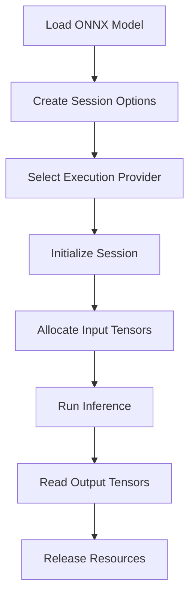
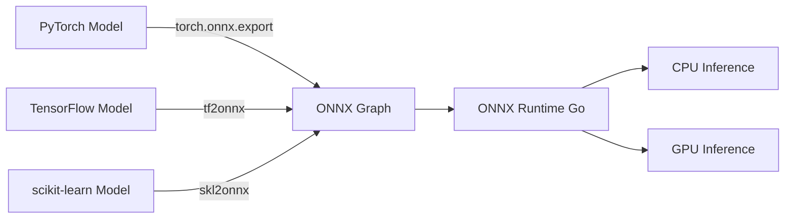
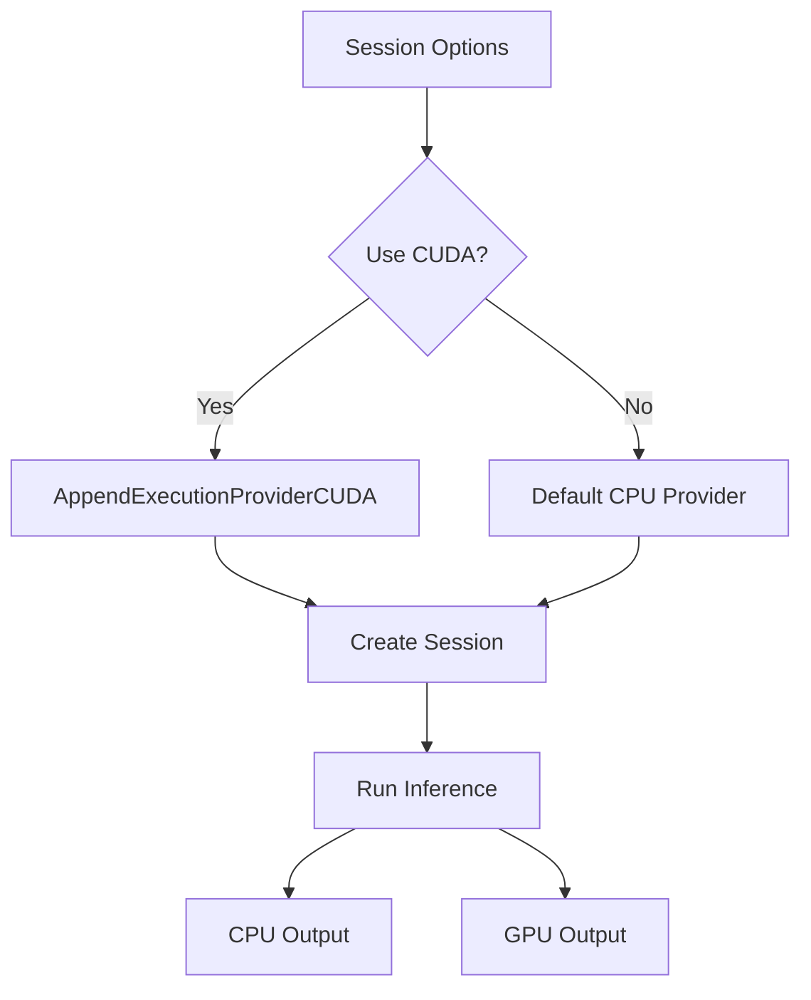
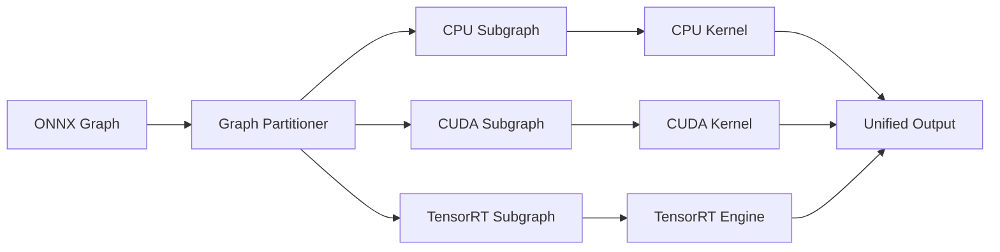
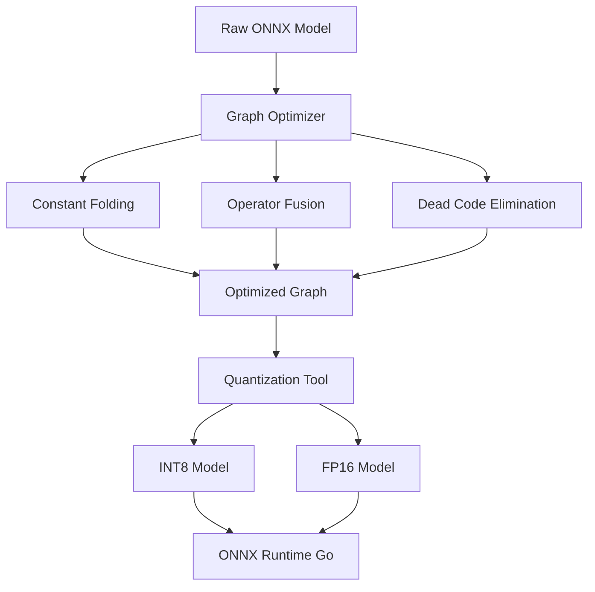
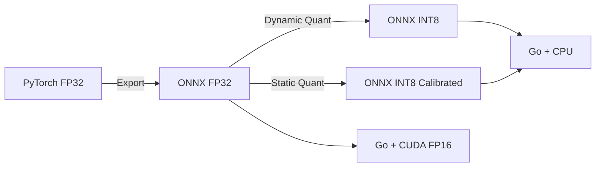

# 🔢 ONNX Runtime Go

## 🎯 Learning Objectives

By the end of this note, you will be able to:

- Explain the ONNX computational graph abstraction and its role in model interoperability
- Compare execution providers and select the optimal backend for a given hardware target
- Write production-ready Go code that initializes ONNX Runtime, manages tensor memory, and runs inference
- Diagnose common export failures when converting PyTorch and TensorFlow models to ONNX
- Apply graph optimizations and quantization to reduce model latency before deployment

## Introduction

The Open Neural Network Exchange (ONNX) format has emerged as the lingua franca of machine learning model serialization. It provides an open standard that enables models trained in PyTorch, TensorFlow, scikit-learn, or MATLAB to be exported into a single interoperable representation. For Go engineers, this interoperability is transformative: you can serve models without maintaining a Python runtime in production. This decoupling eliminates dependency hell, reduces container image sizes by hundreds of megabytes, and removes the Global Interpreter Lock (GIL) as a throughput bottleneck.

This note explores ONNX Runtime Go, the official C API bindings that allow Go programs to load, optimize, and execute ONNX models. You will learn the architecture of ONNX Runtime, how execution providers accelerate inference on different hardware, and how to write complete inference pipelines in pure Go. Understanding ONNX Runtime is foundational because it decouples model training from serving, enabling teams to deploy models in edge devices, cloud containers, and microservices with identical behavior. The patterns you learn here directly feed into [[02 - High-Throughput Model Serving|🚀 High-Throughput Model Serving]] and [[03 - Feature Stores with Go|🏪 Feature Stores with Go]], where inference calls are wrapped in worker pools and enriched with real-time features.

By the end of this note, you will understand how ONNX Runtime manages session state, tensor memory, and execution provider delegation, and you will have written a production-ready Go inference client.

## Module 1: ONNX Format and Runtime Architecture

### 1.1 Theoretical Foundation 🧠

ONNX was introduced by Microsoft and Facebook in 2017 to address a fragmentation problem. Every deep learning framework had its own serialization format: PyTorch used TorchScript and pickles, TensorFlow used Protocol Buffers and SavedModel directories, and Caffe used JSON and binary blobs. Moving a model from research to production required translation layers that were brittle and lossy. ONNX proposed a standardized computational graph specification based on Protocol Buffers, where every operation (node) has a typed signature and every tensor has a named shape.

From a theoretical perspective, an ONNX model is a directed acyclic graph (DAG) where vertices are operators (MatMul, Conv, ReLU) and edges are tensors. This DAG is isomorphic to the lambda calculus representation of a neural network: each operator is a pure function from input tensors to output tensors. ONNX Runtime parses this DAG, applies graph-level optimizations (constant folding, dead code elimination, operator fusion), and dispatches execution to hardware-specific backends. This separation of graph semantics from execution strategy is a classic compiler design pattern, analogous to LLVM's intermediate representation.

### 1.2 Mental Model 📐

Think of ONNX Runtime as a just-in-time compiler for neural networks:

```
┌─────────────────────────────────────────────────────────────┐
│                  ONNX Runtime Pipeline                      │
├─────────────────────────────────────────────────────────────┤
│                                                             │
│   [ONNX Model File]                                         │
│        |                                                    │
│        v                                                    │
│   ┌─────────────────────────────────────────────────────┐   │
│   │              Graph Optimizer                        │   │
│   │  - Constant folding (precompute static subgraphs)   │   │
│   │  - Operator fusion (Conv+ReLU -> FusedConv)         │   │
│   │  - Memory planning (reuse tensor buffers)           │   │
│   └─────────────────────────────────────────────────────┘   │
│        |                                                    │
│        v                                                    │
│   ┌─────────────────────────────────────────────────────┐   │
│   │            Execution Provider                       │   │
│   │  ┌─────────┐ ┌─────────┐ ┌─────────┐ ┌─────────┐   │   │
│   │  │  CPU    │ │  CUDA   │ │TensorRT │ │OpenVINO │   │   │
│   │  │ (MLAS)  │ │ (cuDNN) │ │ (FP16)  │ │ (Intel) │   │   │
│   │  └─────────┘ └─────────┘ └─────────┘ └─────────┘   │   │
│   └─────────────────────────────────────────────────────┘   │
│        |                                                    │
│        v                                                    │
│   [Output Tensors]                                          │
│                                                             │
└─────────────────────────────────────────────────────────────┘
```

The model file enters the optimizer, which rewrites the graph for efficiency. The optimized graph is then dispatched to an execution provider that translates generic ONNX operators into hardware-specific kernels.

```
┌─────────────────────────────────────────────────────────────┐
│              Tensor Memory Layout                           │
├─────────────────────────────────────────────────────────────┤
│                                                             │
│   Shape: [batch=2, channels=3, height=224, width=224]       │
│                                                             │
│   ┌─────────────────────────────────────────────────────┐   │
│   │  contiguous float32 buffer in memory                │   │
│   │  [pixel_0, pixel_1, pixel_2, ..., pixel_N]          │   │
│   └─────────────────────────────────────────────────────┘   │
│                                                             │
│   Stride: width * channels = 896                            │
│   Total bytes: 2 * 3 * 224 * 224 * 4 = 1,204,224 bytes      │
│                                                             │
│   WHY contiguous? Enables zero-copy transfer to GPU via     │
│   DMA and cache-friendly access patterns on CPU.            │
│                                                             │
└─────────────────────────────────────────────────────────────┘
```

```
┌─────────────────────────────────────────────────────────────┐
│              Session Lifecycle State Machine                │
├─────────────────────────────────────────────────────────────┤
│                                                             │
│   UNINITIALIZED --> INITIALIZING --> INITIALIZED --> RUNNING│
│        |                  |                |           |    │
│        |                  |                |           v    │
│        |                  |                |        RELEASED│
│        |                  |                |                │
│   Load model          Apply opts       Bind I/O       Cleanup│
│                                                             │
└─────────────────────────────────────────────────────────────┘
```

### 1.3 Syntax and Semantics 📝

The core pattern for ONNX Runtime in Go is: create an environment, create a session, prepare input tensors, run, and extract outputs. The total inference latency follows this formula:

$$
Latency = Session\_Init + Input\_Copy + Inference + Output\_Copy
$$

Session initialization is a one-time cost, while input/output copy and inference recur per request. GPU execution providers reduce inference time but may increase copy overhead due to PCI-e transfers.

```go
package main

import (
	"fmt"
	"log"

	onnx "github.com/yalue/onnxruntime_go"
)

func main() {
	// WHY: The shared library path must be set before any other call.
	// This links Go to the C API implementation (libonnxruntime.so).
	onnx.SetSharedLibraryPath("/path/to/onnxruntime.so")
	if err := onnx.InitializeEnvironment(); err != nil {
		log.Fatal("Failed to initialize ONNX Runtime:", err)
	}
	// WHY: DestroyEnvironment releases global C structures.
	// Defer ensures cleanup even if inference panics.
	defer onnx.DestroyEnvironment()

	// WHY: SessionOptions control graph optimization level,
	// thread count, and execution provider selection.
	sessionOptions, err := onnx.NewSessionOptions()
	if err != nil {
		log.Fatal(err)
	}
	defer sessionOptions.Destroy()

	// WHY: NewAdvancedSession binds input/output names at load time.
	// This avoids string lookups during the hot inference path.
	session, err := onnx.NewAdvancedSession(
		"model.onnx",
		[]string{"input"},    // Input tensor names from model graph
		[]string{"output"},  // Output tensor names from model graph
		[]onnx.Tensor{},     // Placeholder; set during RunInputOutput
		[]onnx.Tensor{},     // Placeholder; set during RunInputOutput
		sessionOptions,
	)
	if err != nil {
		log.Fatal("Failed to load model:", err)
	}
	defer session.Destroy()

	// WHY: Shape metadata tells ONNX Runtime how to stride through
	// the contiguous data buffer. Order matters: NCHW vs NHWC.
	inputShape := onnx.NewShape(1, 3, 224, 224)
	inputData := make([]float32, 1*3*224*224)
	// ... populate inputData with preprocessed image ...

	inputTensor, err := onnx.NewTensor(inputShape, inputData)
	if err != nil {
		log.Fatal(err)
	}
	defer inputTensor.Destroy()

	// WHY: Output tensors must be pre-allocated so ONNX Runtime
	// can write results directly into Go-managed memory.
	outputShape := onnx.NewShape(1, 1000) // 1000 classes
	outputData := make([]float32, 1*1000)
	outputTensor, err := onnx.NewTensor(outputShape, outputData)
	if err != nil {
		log.Fatal(err)
	}
	defer outputTensor.Destroy()

	// WHY: RunInputOutput is the synchronous hot path.
	// It blocks until the execution provider completes all kernels.
	if err := session.RunInputOutput(
		[]onnx.Tensor{inputTensor},
		[]onnx.Tensor{outputTensor},
	); err != nil {
		log.Fatal("Inference failed:", err)
	}

	fmt.Println("Output:", outputData)
}
```

### 1.4 Visual Representation 🖼️







### 1.5 Application in ML/AI Systems 🤖

| Company | Use Case | Execution Provider | Outcome |
|---------|----------|-------------------|---------|
| Microsoft | Office 365 intelligent features | DirectML | Cross-platform GPU acceleration on Windows, macOS, iOS, Android |
| LinkedIn | Feed ranking models | CPU (MLAS) | 2x latency reduction over naive Python serving |
| NVIDIA | Autonomous perception | TensorRT | Sub-10ms inference on Drive platforms |
| Intel | Edge IoT classification | OpenVINO | Optimized INT8 inference on Intel NUC |

### 1.6 Common Pitfalls ⚠️

⚠️ **Warning:** Not all PyTorch/TensorFlow operations have ONNX equivalents. Dynamic shapes, control flow (loops, conditionals), and custom operators may fail during export. Always validate the exported model with ONNX Runtime's correctness checker before deploying.

⚠️ **Warning:** Forgetting to call `Destroy()` on sessions, tensors, or options leaks native C memory. Go's garbage collector cannot track C heap allocations. Use `defer` immediately after successful creation.

💡 **Tip:** Use the ONNX Runtime profiling API (`EnableProfiling`) during development to identify which graph nodes consume the most time. This helps you decide whether to use a different execution provider or quantize specific operators.

### 1.7 Knowledge Check ❓

1. Why is an ONNX model described as a directed acyclic graph, and what optimizations can ONNX Runtime apply because of this structure?
2. In the latency formula, which term dominates for GPU execution providers, and why?
3. What is the consequence of omitting `defer tensor.Destroy()` in a long-running server?

## Module 2: Execution Providers and Hardware Acceleration

### 2.1 Theoretical Foundation 🧠

An execution provider is a hardware abstraction layer within ONNX Runtime. Each provider implements a common interface: given an ONNX operator node and input tensors, execute the computation and produce output tensors. Under the hood, providers delegate to highly optimized kernel libraries. The CPU provider uses MLAS (Microsoft Linear Algebra Subprograms), a hand-optimized BLAS implementation. The CUDA provider uses cuDNN and cuBLAS. TensorRT uses NVIDIA's fused kernel compiler. OpenVINO uses Intel's oneDNN and graph compiler.

The choice of provider is a classic systems trade-off. CPU providers have minimal setup complexity and deterministic latency but cannot exploit tensor cores or massive parallelism. GPU providers offer orders-of-magnitude throughput improvement for large matrices but introduce PCI-e transfer overhead and nondeterministic kernel scheduling. The theoretically optimal provider minimizes the sum of data transfer time and kernel execution time, which depends on batch size, tensor dimensions, and hardware topology.

### 2.2 Mental Model 📐

```
┌─────────────────────────────────────────────────────────────┐
│              Execution Provider Decision Tree               │
├─────────────────────────────────────────────────────────────┤
│                                                             │
│   Start                                                     │
│    |                                                        │
│    v                                                        │
│  Edge device? --YES--> Intel? --YES--> OpenVINO            │
│    | NO           | NO                                      │
│    v              v                                         │
│  Windows GPU? --YES--> DirectML                            │
│    | NO                                                     │
│    v                                                        │
│  NVIDIA GPU? --YES--> Max throughput? --YES--> TensorRT    │
│    | NO           | NO                                      │
│    v              v                                         │
│  Apple Silicon? --YES--> CoreML                            │
│    | NO                                                     │
│    v                                                        │
│  Default: CPU (MLAS)                                        │
│                                                             │
└─────────────────────────────────────────────────────────────┘
```

```
┌─────────────────────────────────────────────────────────────┐
│              Latency vs Throughput Trade-off                │
├─────────────────────────────────────────────────────────────┤
│                                                             │
│   Latency (single request)                                  │
│        ^                                                    │
│        |    GPU batch=1                                     │
│        |         *                                          │
│        |              CPU batch=1                           │
│        |                   *                                │
│        |                                                    │
│        +----------------------------> Throughput (batch=64) │
│                                    GPU *                    │
│                                    CPU   *                  │
│                                                             │
│   WHY: GPUs amortize kernel launch overhead over large      │
│   batches, so they excel at throughput but may add          │
│   latency for small batches due to PCI-e copies.            │
│                                                             │
└─────────────────────────────────────────────────────────────┘
```

```
┌─────────────────────────────────────────────────────────────┐
│              Provider Stack Abstraction                     │
├─────────────────────────────────────────────────────────────┤
│                                                             │
│   ONNX Operator (e.g., Conv)                                │
│        |                                                    │
│        v                                                    │
│   ┌─────────────────────────────────────────────────────┐   │
│   │            ONNX Runtime Core                        │   │
│   │   (graph partitioning, memory planning)             │   │
│   └─────────────────────────────────────────────────────┘   │
│        |                                                    │
│        v                                                    │
│   ┌─────────────────────────────────────────────────────┐   │
│   │          Execution Provider                         │   │
│   │   CUDA: cuDNNConvBackwardData + cuDNNActivation    │   │
│   │   CPU:  MLAS SGEMM + handwritten SIMD kernels       │   │
│   │   TRT:  Fused conv+relu+pool kernel (auto-tuned)    │   │
│   └─────────────────────────────────────────────────────┘   │
│        |                                                    │
│        v                                                    │
│   Hardware (SM cores, tensor cores, AVX-512)                │
│                                                             │
└─────────────────────────────────────────────────────────────┘
```

### 2.3 Syntax and Semantics 📝

Selecting an execution provider in Go is done via `SessionOptions`. The code below demonstrates CPU (default) and optional CUDA provider attachment.

```go
package main

import (
	"fmt"
	"log"
	"os"

	onnx "github.com/yalue/onnxruntime_go"
)

func runWithProvider(modelPath, libPath string, useCUDA bool) error {
	// WHY: Environment initialization is global and must happen once.
	onnx.SetSharedLibraryPath(libPath)
	if err := onnx.InitializeEnvironment(); err != nil {
		return fmt.Errorf("init env: %w", err)
	}
	defer onnx.DestroyEnvironment()

	opts, err := onnx.NewSessionOptions()
	if err != nil {
		return err
	}
	defer opts.Destroy()

	// WHY: CUDA provider reduces inference time for large matrices
	// but increases binary size and deployment complexity.
	if useCUDA {
		// WHY: Device ID 0 selects the first NVIDIA GPU.
		// Multi-GPU systems can distribute sessions across IDs.
		if err := opts.AppendExecutionProviderCUDA(0); err != nil {
			log.Println("CUDA unavailable, falling back to CPU:", err)
		}
	}

	// WHY: Graph optimization level 3 (all) applies aggressive
	// fusions that are safe for most models.
	if err := opts.SetGraphOptimizationLevel(3); err != nil {
		return err
	}

	session, err := onnx.NewAdvancedSession(
		modelPath,
		[]string{"input"},
		[]string{"output"},
		[]onnx.Tensor{},
		[]onnx.Tensor{},
		opts,
	)
	if err != nil {
		return fmt.Errorf("load model: %w", err)
	}
	defer session.Destroy()

	input := make([]float32, 1*3*224*224)
	inTensor, err := onnx.NewTensor(onnx.NewShape(1, 3, 224, 224), input)
	if err != nil {
		return err
	}
	defer inTensor.Destroy()

	output := make([]float32, 1*1000)
	outTensor, err := onnx.NewTensor(onnx.NewShape(1, 1000), output)
	if err != nil {
		return err
	}
	defer outTensor.Destroy()

	if err := session.RunInputOutput(
		[]onnx.Tensor{inTensor},
		[]onnx.Tensor{outTensor},
	); err != nil {
		return fmt.Errorf("inference: %w", err)
	}

	fmt.Printf("Top class score: %.4f\n", output[0])
	return nil
}

func main() {
	lib := os.Getenv("ONNX_RUNTIME_PATH")
	if lib == "" {
		lib = "/usr/local/lib/libonnxruntime.so"
	}
	if err := runWithProvider("model.onnx", lib, false); err != nil {
		log.Fatal(err)
	}
}
```

### 2.4 Visual Representation 🖼️







### 2.5 Application in ML/AI Systems 🤖

| Provider | Hardware | Best For | Latency | Setup Complexity |
|----------|----------|----------|---------|------------------|
| CPU (Default) | Any CPU | Portability, edge devices | Baseline | Minimal |
| CUDA | NVIDIA GPU | Large batch CNN/Transformer | Low | Requires CUDA toolkit |
| DirectML | Windows GPU/DirectX 12 | Cross-vendor GPU on Windows | Low | Windows-only |
| OpenVINO | Intel CPU/GPU/VPU | Intel edge devices | Low-Medium | Intel OpenVINO toolkit |
| TensorRT | NVIDIA GPU | Maximum throughput | Very Low | Requires TensorRT SDK |
| CoreML | Apple Neural Engine | iOS/macOS deployment | Low | macOS/iOS only |

### 2.6 Common Pitfalls ⚠️

⚠️ **Warning:** Quantized models may not be supported by all execution providers. CUDA and TensorRT often require FP16 or FP32 inputs. Always verify provider compatibility with your quantized opset before switching hardware targets.

⚠️ **Warning:** The CUDA provider binds to a specific device ID at session creation. If that GPU is removed or reset (e.g., in a container with NVIDIA MIG), the session will crash. Always validate GPU availability at startup and fail gracefully.

💡 **Tip:** Profile with CPU first to establish a latency baseline, then switch to GPU and measure the delta. If the delta is negative (GPU slower), your model is likely too small or your batch size too low to amortize PCI-e transfer overhead.

### 2.7 Knowledge Check ❓

1. Under what conditions will a GPU execution provider be slower than the CPU provider for ONNX inference?
2. Why does ONNX Runtime use a graph partitioner when multiple execution providers are registered?
3. What is the relationship between `SessionOptions` graph optimization level and the execution provider's kernel fusion capabilities?

## Module 3: Model Optimization and Quantization

### 3.1 Theoretical Foundation 🧠

Graph optimization and quantization are the two primary techniques for reducing model latency before deployment. Graph optimization operates at the graph level: it rewrites the DAG to eliminate redundant computation. Quantization operates at the tensor level: it reduces the numeric precision of weights and activations from 32-bit floating point to 8-bit integers (or 16-bit floats).

The theoretical basis for quantization comes from the observation that deep neural networks are robust to low-precision arithmetic. A 2015 paper by Gupta et al. demonstrated that networks trained with 16-bit fixed-point weights converge to comparable accuracy as 32-bit floating-point networks. INT8 quantization exploits this by mapping the dynamic range of FP32 tensors to 256 discrete levels. The challenge is calibrating the scale and zero-point for each tensor to minimize round-off error. Dynamic quantization computes these parameters at runtime, while static quantization computes them from a calibration dataset ahead of time.

### 3.2 Mental Model 📐

```
┌─────────────────────────────────────────────────────────────┐
│              Quantization Mapping                             │
├─────────────────────────────────────────────────────────────┤
│                                                             │
│   FP32 Range: [r_min, r_max]                                │
│        |                                                    │
│        v                                                    │
│   Scale = (r_max - r_min) / 255                             │
│   ZeroPoint = round(-r_min / scale)                         │
│        |                                                    │
│        v                                                    │
│   INT8 Value = round(FP32 Value / scale) + zero_point       │
│                                                             │
│   WHY: This linear mapping preserves relative distances     │
│   while using 4x fewer bits, reducing memory bandwidth      │
│   and enabling integer SIMD instructions.                   │
│                                                             │
└─────────────────────────────────────────────────────────────┘
```

```
┌─────────────────────────────────────────────────────────────┐
│              Optimization Passes                              │
├─────────────────────────────────────────────────────────────┤
│                                                             │
│   BEFORE:                    AFTER:                         │
│   ┌─────┐  ┌─────┐          ┌─────────────┐                │
│   │ Conv|-->| ReLU|          │ FusedConv   |                │
│   └─────┘  └─────┘          └─────────────┘                │
│                                                             │
│   WHY: FusedConv executes one kernel instead of two,        │
│   eliminating intermediate tensor allocation and reducing   │
│   memory bandwidth by ~50%.                                 │
│                                                             │
│   BEFORE:                    AFTER:                         │
│   ┌─────┐  ┌─────┐          (removed)                       │
│   │Const|-->| Add |                                         │
│   └─────┘  └─────┘                                          │
│                                                             │
│   WHY: Constant folding precomputes static subgraphs        │
│   at load time, saving compute per request.                 │
│                                                             │
└─────────────────────────────────────────────────────────────┘
```

```
┌─────────────────────────────────────────────────────────────┐
│              Memory Footprint Comparison                    │
├─────────────────────────────────────────────────────────────┤
│                                                             │
│   FP32 Model:  100 MB                                       │
│   FP16 Model:   50 MB  (2x smaller, GPU tensor cores)       │
│   INT8 Model:   25 MB  (4x smaller, CPU INT8 SIMD)          │
│                                                             │
│   WHY: Smaller models load faster, fit in cache, and        │
│   reduce memory pressure when serving thousands of          │
│   concurrent requests.                                      │
│                                                             │
└─────────────────────────────────────────────────────────────┘
```

### 3.3 Syntax and Semantics 📝

Optimization and quantization are typically performed with Python tools (`onnxruntime-tools`, `onnxoptimizer`) before the model reaches Go. However, you can configure ONNX Runtime to apply built-in graph optimizations at load time via `SessionOptions`.

```go
package main

import (
	"fmt"
	"log"

	onnx "github.com/yalue/onnxruntime_go"
)

func optimizedInference(modelPath, libPath string) error {
	onnx.SetSharedLibraryPath(libPath)
	if err := onnx.InitializeEnvironment(); err != nil {
		return fmt.Errorf("init env: %w", err)
	}
	defer onnx.DestroyEnvironment()

	opts, err := onnx.NewSessionOptions()
	if err != nil {
		return err
	}
	defer opts.Destroy()

	// WHY: Optimization level 3 enables all passes including
	// extended fusions that may change numerics slightly.
	// Level 2 is safer for models sensitive to precision.
	if err := opts.SetGraphOptimizationLevel(3); err != nil {
		return err
	}

	// WHY: Intra-op threads control parallelism within a single
	// operator (e.g., parallelizing a large MatMul across cores).
	// Set this to the number of physical CPU cores for batch=1.
	if err := opts.SetIntraOpNumThreads(4); err != nil {
		return err
	}

	// WHY: Inter-op threads control parallelism across independent
	// operators. Usually set to 1 unless executing multiple
	// subgraphs concurrently.
	if err := opts.SetInterOpNumThreads(1); err != nil {
		return err
	}

	session, err := onnx.NewAdvancedSession(
		modelPath,
		[]string{"input"},
		[]string{"output"},
		[]onnx.Tensor{},
		[]onnx.Tensor{},
		opts,
	)
	if err != nil {
		return fmt.Errorf("load model: %w", err)
	}
	defer session.Destroy()

	input := make([]float32, 1*3*224*224)
	inTensor, err := onnx.NewTensor(onnx.NewShape(1, 3, 224, 224), input)
	if err != nil {
		return err
	}
	defer inTensor.Destroy()

	output := make([]float32, 1*1000)
	outTensor, err := onnx.NewTensor(onnx.NewShape(1, 1000), output)
	if err != nil {
		return err
	}
	defer outTensor.Destroy()

	if err := session.RunInputOutput(
		[]onnx.Tensor{inTensor},
		[]onnx.Tensor{outTensor},
	); err != nil {
		return fmt.Errorf("inference: %w", err)
	}

	log.Println("Top score:", output[0])
	return nil
}

func main() {
	if err := optimizedInference("model.onnx", "/usr/local/lib/libonnxruntime.so"); err != nil {
		log.Fatal(err)
	}
}
```

### 3.4 Visual Representation 🖼️







### 3.5 Application in ML/AI Systems 🤖

| Technique | Benefit | Trade-off | Best For |
|-----------|---------|-----------|----------|
| Graph optimization (level 3) | 10-30% latency reduction | Slight numerical changes | All models |
| Dynamic quantization | 2-4x faster CPU inference | Minor accuracy loss | Transformer, LSTM |
| Static quantization | Best INT8 accuracy | Requires calibration data | CNN, vision models |
| FP16 TensorRT | 2x throughput on GPU | Needs NVIDIA GPU | Large batch serving |
| Operator fusion | Reduced memory bandwidth | Provider-specific | Conv+ReLU, MatMul+Add |

### 3.6 Common Pitfalls ⚠️

⚠️ **Warning:** Static quantization requires representative calibration data. If your calibration dataset does not cover the input distribution seen in production, quantized activations will clip and accuracy will degrade unpredictably.

⚠️ **Warning:** Enabling graph optimization level 3 can change the numerical behavior of certain floating-point operations (e.g., fusion changes rounding order). Always validate optimized model accuracy against a held-out test set before deploying.

💡 **Tip:** Start with dynamic quantization for rapid prototyping. It requires no calibration data and gives most of the latency benefit of INT8. Switch to static quantization only if accuracy regression exceeds your threshold.

### 3.7 Knowledge Check ❓

1. What is the difference between dynamic and static quantization, and why does static quantization generally yield higher accuracy?
2. Why does operator fusion reduce memory bandwidth rather than computation?
3. How do `SetIntraOpNumThreads` and `SetInterOpNumThreads` interact, and what happens if both are set to the total number of CPU cores?

## 📦 Compression Code

```go
package main

import (
	"fmt"
	"log"
	"os"

	onnx "github.com/yalue/onnxruntime_go"
)

// CompressedONNXInference demonstrates loading an ONNX model,
// preparing float32 tensors, and running inference with cleanup.
func CompressedONNXInference(modelPath string) ([]float32, error) {
	onnx.SetSharedLibraryPath(os.Getenv("ONNX_RUNTIME_PATH"))
	if err := onnx.InitializeEnvironment(); err != nil {
		return nil, fmt.Errorf("init env: %w", err)
	}
	defer onnx.DestroyEnvironment()

	opts, err := onnx.NewSessionOptions()
	if err != nil {
		return nil, err
	}
	defer opts.Destroy()

	// WHY: Enable all graph optimizations for best performance.
	opts.SetGraphOptimizationLevel(3)

	// WHY: Optional CUDA provider for GPU inference.
	// opts.AppendExecutionProviderCUDA(0)

	session, err := onnx.NewAdvancedSession(
		modelPath,
		[]string{"input"},
		[]string{"output"},
		[]onnx.Tensor{},
		[]onnx.Tensor{},
		opts,
	)
	if err != nil {
		return nil, fmt.Errorf("load model: %w", err)
	}
	defer session.Destroy()

	input := make([]float32, 1*3*224*224)
	inTensor, err := onnx.NewTensor(onnx.NewShape(1, 3, 224, 224), input)
	if err != nil {
		return nil, err
	}
	defer inTensor.Destroy()

	output := make([]float32, 1*1000)
	outTensor, err := onnx.NewTensor(onnx.NewShape(1, 1000), output)
	if err != nil {
		return nil, err
	}
	defer outTensor.Destroy()

	if err := session.RunInputOutput([]onnx.Tensor{inTensor}, []onnx.Tensor{outTensor}); err != nil {
		return nil, fmt.Errorf("inference: %w", err)
	}

	return output, nil
}

func main() {
	result, err := CompressedONNXInference("resnet50.onnx")
	if err != nil {
		log.Fatal(err)
	}
	fmt.Printf("Top class score: %.4f\n", result[0])
}
```

## 🎯 Documented Project

### Description

A **Go ONNX Microservice** that exposes a gRPC API for image classification using a ResNet-50 ONNX model. The service preprocesses incoming image bytes, runs inference via ONNX Runtime, and returns the top-5 predicted classes with confidence scores.

### Functional Requirements

1. Accept gRPC `ClassifyImage` requests containing raw JPEG/PNG bytes
2. Preprocess images to 224x224 RGB float32 tensors with ImageNet normalization
3. Load the ONNX model at startup and reuse the session across requests
4. Return the top-5 class indices and probabilities sorted by score
5. Expose a `/health` HTTP endpoint for Kubernetes liveness probes
6. Log inference latency and memory usage per request
7. Support hot-swapping the model file via SIGHUP without dropping connections

### Main Components

- **Preprocessor:** Go `image` package decoding + resize + normalization pipeline
- **ONNX Session Manager:** Singleton wrapper around `onnxruntime_go` with connection pooling
- **gRPC Server:** Protocol Buffers API with unary RPC for synchronous inference
- **Health Server:** HTTP 1.1 endpoint for load balancer health checks
- **Telemetry:** Prometheus metrics for request count, latency histogram, and error rate

### Success Metrics

- P99 inference latency under 50ms on CPU (batch size = 1)
- Throughput greater than 100 requests per second per core
- Memory footprint under 512 MB at steady state
- Zero model loading errors after 7 days of continuous uptime
- Top-1 classification accuracy within 0.5% of PyTorch baseline

### References

- [ONNX Runtime Documentation](https://onnxruntime.ai/docs/)
- [onnxruntime-go Bindings](https://github.com/yalue/onnxruntime_go)
- [Microsoft ONNX Runtime Blog](https://cloudblogs.microsoft.com/opensource/2020/01/21/onnx-runtime-machine-learning-inferencing/)
- [ONNX Model Zoo](https://github.com/onnx/models)
- [Gupta et al. Deep Learning with Limited Numerical Precision](https://arxiv.org/abs/1502.02551)
- [ONNX Runtime Execution Providers](https://onnxruntime.ai/docs/execution-providers/)
