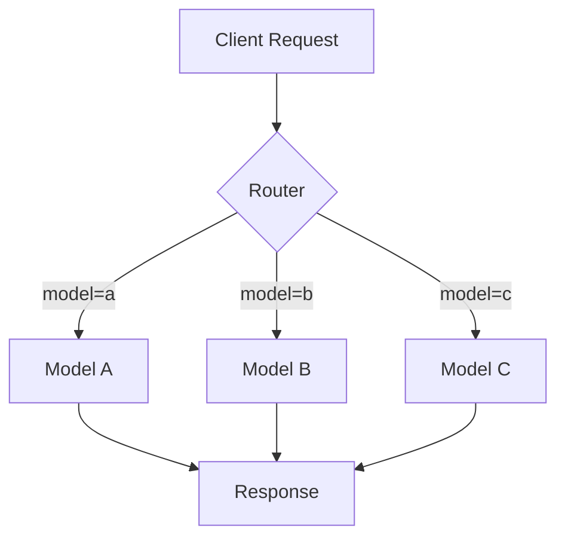
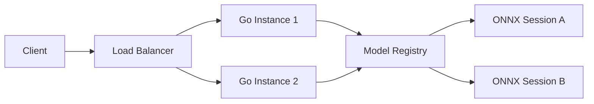
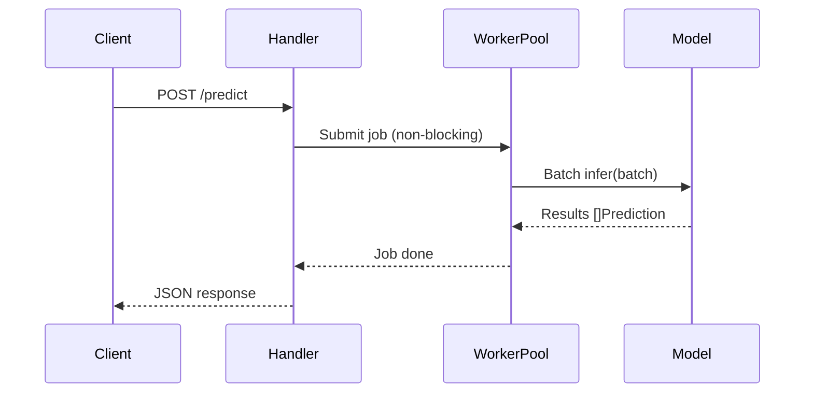
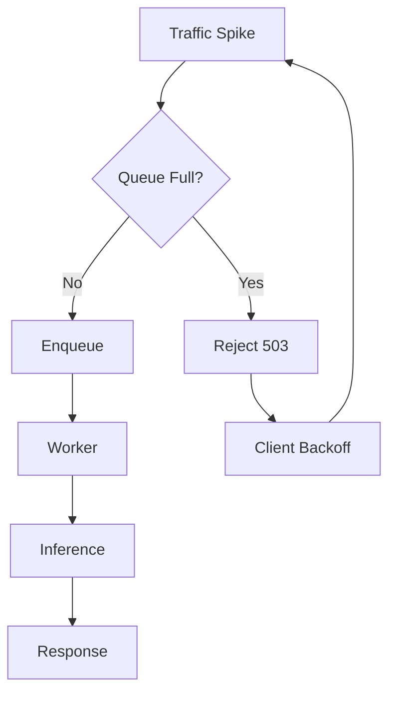
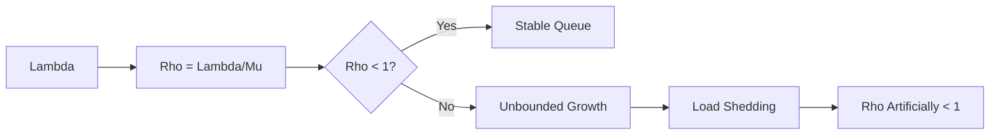

# 🚀 High-Throughput Model Serving

## 🎯 Learning Objectives

By the end of this note, you will be able to:

- Compare single-model, multi-model, and ensemble serving architectures and their trade-offs
- Implement dynamic batching in Go using channels and worker pools to amortize inference cost
- Analyze throughput as a function of batch size, concurrency, and model latency using queueing theory
- Apply load-shedding and backpressure techniques to prevent cascading failures under traffic spikes
- Evaluate custom Go serving against frameworks like Triton and TorchServe for specific use cases

## Introduction

Machine learning model serving is the critical bridge between trained artifacts and user-facing value. A serving system must load models, accept requests, batch inputs when possible, run inference, and return results with minimal latency and maximal throughput. In Go, this challenge maps elegantly to goroutines, channels, and worker pools, yielding systems that outperform traditional Python-based servers on I/O-bound and compute-bound workloads alike. The absence of a Global Interpreter Lock and the presence of a work-stealing scheduler mean that a Go process can saturate all CPU cores without the complexity of explicit thread pools.

This note explores serving patterns: single-model, multi-model, and ensemble architectures. You will learn how to implement batch inference to amortize model invocation overhead across multiple requests, and how async request handling in Go can saturate GPU resources without blocking client connections. High-throughput serving is not merely about raw speed; it is about resource efficiency, queue management, and graceful degradation under load. The batching engine you build here will consume the ONNX sessions from [[01 - ONNX Runtime Go|🔢 ONNX Runtime Go]] and will be queried by the feature store clients from [[03 - Feature Stores with Go|🏪 Feature Stores with Go]].

By the end of this note, you will understand the mechanics of building a batching inference server in Go and how to reason about throughput in terms of batch size, concurrency, and model latency. This knowledge directly feeds into the design of ML gateways and real-time pipelines covered in later notes.

## Module 1: Model Serving Patterns

### 1.1 Theoretical Foundation 🧠

Model serving architectures have evolved from monolithic scripts to sophisticated distributed systems. The earliest pattern was the "model-in-a-Flask-app": a single Python process loading a single model and handling HTTP requests sequentially. This pattern breaks down under concurrency because Python's GIL prevents true parallelism for CPU-bound inference. The next evolution was the model server: a dedicated process (e.g., TensorFlow Serving, TorchServe) that exposes a gRPC or REST API and handles concurrency via C++ threads or process pools.

From a systems theory perspective, model serving is an instance of the M/M/c queueing model if we assume Poisson arrivals and exponential service times. In practice, inference times are deterministic for fixed input sizes, making the system closer to a D/D/c queue. The insight from queueing theory is that throughput is maximized when the server is always busy (rho approaches 1), but latency explodes as the queue grows. Batching is the technique that increases server utilization by grouping requests, effectively transforming many single-request arrivals into fewer multi-request arrivals.

### 1.2 Mental Model 📐

Three primary serving patterns dominate production systems:

```
┌─────────────────────────────────────────────────────────────┐
│              Pattern 1: Single-Model Serving                │
├─────────────────────────────────────────────────────────────┤
│                                                             │
│   [Client] --> [Go API] --> [Model A] --> [Response]        │
│                                                             │
│   Pros: Simple, easy to monitor, strong isolation           │
│   Cons: Wastes memory if many small models are deployed     │
│   Best for: Monolithic apps with one dominant model         │
│                                                             │
└─────────────────────────────────────────────────────────────┘
```

```
┌─────────────────────────────────────────────────────────────┐
│              Pattern 2: Multi-Model Serving                 │
├─────────────────────────────────────────────────────────────┤
│                                                             │
│   [Client] --> [Go API] --> [Router]                        │
│                                |                            │
│                    ┌───────────┼───────────┐                │
│                    v           v           v                │
│                 [Model A]  [Model B]  [Model C]             │
│                    |           |           |                │
│                    └───────────┴───────────┘                │
│                                |                            │
│                             [Response]                      │
│                                                             │
│   Pros: Memory sharing, dynamic loading, cost efficiency    │
│   Cons: Resource contention, complex lifecycle management   │
│   Best for: Microservices with dozens of models             │
│                                                             │
└─────────────────────────────────────────────────────────────┘
```

```
┌─────────────────────────────────────────────────────────────┐
│              Pattern 3: Ensemble Serving                    │
├─────────────────────────────────────────────────────────────┤
│                                                             │
│   [Client] --> [Go API]                                     │
│       |                                                     │
│       ├────────────┬────────────┬────────────┐              │
│       v            v            v            v              │
│    [Model A]   [Model B]   [Model C]   [Model D]            │
│       |            |            |            |              │
│       └────────────┴────────────┴────────────┘              │
│                         |                                   │
│                      [Aggregator]                           │
│                   (voting / averaging)                      │
│                         |                                   │
│                      [Response]                             │
│                                                             │
│   Pros: Reduced variance, improved accuracy                 │
│   Cons: Higher latency (max of parallel paths), more cost   │
│   Best for: Competitions, high-stakes predictions           │
│                                                             │
└─────────────────────────────────────────────────────────────┘
```

### 1.3 Syntax and Semantics 📝

A minimal multi-model router in Go can be implemented with a map of model names to inference functions. This provides dynamic dispatch without reflection overhead.

```go
package main

import (
	"context"
	"fmt"
	"log"
	"net/http"
	"sync"
	"time"
)

// WHY: ModelFunc abstracts the inference call so the router
// does not depend on ONNX Runtime types directly.
type ModelFunc func(ctx context.Context, input []float32) ([]float32, error)

// WHY: Registry holds models in a sync.RWMutex map.
// RWMutex allows many concurrent readers and safe updates.
type Registry struct {
	mu     sync.RWMutex
	models map[string]ModelFunc
}

func NewRegistry() *Registry {
	return &Registry{models: make(map[string]ModelFunc)}
}

func (r *Registry) Register(name string, fn ModelFunc) {
	r.mu.Lock()
	defer r.mu.Unlock()
	r.models[name] = fn
}

func (r *Registry) Get(name string) (ModelFunc, bool) {
	r.mu.RLock()
	defer r.mu.RUnlock()
	fn, ok := r.models[name]
	return fn, ok
}

func main() {
	reg := NewRegistry()

	// WHY: Register a mock identity model.
	reg.Register("identity", func(ctx context.Context, in []float32) ([]float32, error) {
		out := make([]float32, len(in))
		copy(out, in)
		return out, nil
	})

	http.HandleFunc("/predict", func(w http.ResponseWriter, r *http.Request) {
		modelName := r.URL.Query().Get("model")
		fn, ok := reg.Get(modelName)
		if !ok {
			http.Error(w, "model not found", http.StatusNotFound)
			return
		}

		ctx, cancel := context.WithTimeout(r.Context(), 2*time.Second)
		defer cancel()

		// WHY: In production, decode request body into []float32.
		result, err := fn(ctx, []float32{1.0, 2.0, 3.0})
		if err != nil {
			http.Error(w, err.Error(), http.StatusInternalServerError)
			return
		}
		fmt.Fprintf(w, "Result: %v\n", result)
	})

	log.Println("Serving on :8080")
	log.Fatal(http.ListenAndServe(":8080", nil))
}
```

### 1.4 Visual Representation 🖼️







### 1.5 Application in ML/AI Systems 🤖

| Company | Pattern | Scale | Outcome |
|---------|---------|-------|---------|
| Uber | Multi-model + routing | 1000s of models | Independent iteration of models and infrastructure |
| Netflix | Ensemble (voting) | 100s per request | Improved recommendation diversity |
| Stripe | Single-model per service | 10s of services | Strong isolation for fraud models |
| Spotify | Multi-model + A/B | 100s of models | Canary deployments with statistical validation |

### 1.6 Common Pitfalls ⚠️

⚠️ **Warning:** Dynamic model loading in a multi-model server can cause latency spikes. Load models asynchronously in a background goroutine and use a read-write lock to swap the active reference atomically.

⚠️ **Warning:** Ensemble serving multiplies resource consumption by the number of models in the ensemble. If three models each take 30ms, the ensemble takes 30ms parallel but consumes 3x GPU memory. Monitor memory limits carefully.

💡 **Tip:** Use Go's `context.Context` with deadlines in your serving handlers. If a model inference exceeds the SLA, cancel the context and return a 503 error, preventing cascading queue buildup.

### 1.7 Knowledge Check ❓

1. Under what conditions is single-model serving preferable to multi-model serving despite its higher memory overhead per model?
2. How does ensemble serving reduce prediction variance, and what is the latency cost?
3. Why is a `sync.RWMutex` preferred over a `sync.Mutex` for the model registry read path?

## Module 2: Dynamic Batching and Worker Pools

### 2.1 Theoretical Foundation 🧠

Dynamic batching is the technique of grouping independent inference requests into a single tensor batch at runtime. The theoretical motivation comes from GPU kernel economics. Launching a CUDA kernel has a fixed overhead (5-20 microseconds). For small matrices, this overhead dominates the actual computation time. By merging 8 requests into a batch of shape `[8, 3, 224, 224]`, the kernel processes 8x more data with negligible additional launch overhead, yielding near-linear throughput scaling.

The batching problem is a variant of the online bin packing problem with a time constraint. Requests arrive according to a stochastic process. The batcher must decide when to close the batch and send it to the model. If it waits too long, latency suffers. If it closes too early, throughput suffers. The optimal policy is a hybrid timeout-and-capacity rule: close the batch when either `batch_size` requests have arrived or `max_wait` time has elapsed.

### 2.2 Mental Model 📐

```
┌─────────────────────────────────────────────────────────────┐
│              Dynamic Batching Engine                        │
├─────────────────────────────────────────────────────────────┤
│                                                             │
│   Time ----->                                               │
│                                                             │
│   Req 1 arrives  ┌─────┐                                    │
│   Req 2 arrives  ├─────┤                                    │
│   Req 3 arrives  ├─────┤  maxWait timer starts              │
│   Req 4 arrives  ├─────┤                                    │
│   Req 5 arrives  ├─────┤                                    │
│   Req 6 arrives  ├─────┤                                    │
│   Req 7 arrives  ├─────┤                                    │
│   Req 8 arrives  └─────┘  batchSize reached -> FLUSH        │
│                                                             │
│   OR:                                                       │
│                                                             │
│   Req 1 arrives  ┌─────┐                                    │
│   Req 2 arrives  ├─────┤  maxWait timer expires -> FLUSH   │
│                  └─────┘                                    │
│                                                             │
│   WHY: Guarantees latency bound even under low traffic.     │
│                                                             │
└─────────────────────────────────────────────────────────────┘
```

```
┌─────────────────────────────────────────────────────────────┐
│              Worker Pool Architecture                       │
├─────────────────────────────────────────────────────────────┤
│                                                             │
│   [HTTP Handler]                                            │
│        |                                                    │
│        v                                                    │
│   ┌─────────────────────────────────────────────────────┐   │
│   │              Request Queue (buffered channel)       │   │
│   │  ┌─────┐ ┌─────┐ ┌─────┐ ┌─────┐ ┌─────┐         │   │
│   │  | job | | job | | job | | job | | job | ...       │   │
│   │  └─────┘ └─────┘ └─────┘ └─────┘ └─────┘         │   │
│   └─────────────────────────────────────────────────────┘   │
│        |         |         |                                │
│        v         v         v                                │
│   ┌─────────┐ ┌─────────┐ ┌─────────┐                     │
│   │ Worker 1│ │ Worker 2│ │ Worker 3│                     │
│   │ (batch) │ │ (batch) │ │ (batch) │                     │
│   └────┬────┘ └────┬────┘ └────┬────┘                     │
│        |           |           |                            │
│        └───────────┴───────────┘                            │
│                    |                                        │
│                    v                                        │
│             [ONNX Session]                                  │
│                                                             │
└─────────────────────────────────────────────────────────────┘
```

```
┌─────────────────────────────────────────────────────────────┐
│              Throughput vs Batch Size                       │
├─────────────────────────────────────────────────────────────┤
│                                                             │
│   Throughput (RPS)                                          │
│        ^                                                    │
│        |                _______ saturation                  │
│        |               /                                    │
│        |          ____/                                     │
│        |      ___/                                          │
│        |  ___/                                              │
│        |_/                                                  │
│        +----------------------------> Batch Size            │
│                                                             │
│   WHY: Throughput increases linearly until GPU/CPU cores    │
│   are saturated. Beyond that point, larger batches just     │
│   increase latency without improving RPS.                   │
│                                                             │
└─────────────────────────────────────────────────────────────┘
```

### 2.3 Syntax and Semantics 📝

Throughput in a batching system depends on how many requests you can group together without violating latency constraints:

$$
Throughput = Batch\_Size \times Requests\_Per\_Second
$$

If a model processes a batch of 8 in 20ms, your effective throughput is 400 requests per second. Without batching, 8 separate calls might take 80ms total, yielding only 100 requests per second.

```go
package main

import (
	"context"
	"encoding/json"
	"fmt"
	"log"
	"net/http"
	"time"
)

// WHY: PredictionRequest encapsulates a single client's request
// and a channel for returning the result asynchronously.
type PredictionRequest struct {
	ID     string
	Input  []float32
	Result chan []float32
}

// WHY: BatchingServer collects requests into batches and dispatches
// them to a model function. It uses a timeout to prevent starvation.
type BatchingServer struct {
	batchSize    int
	batchTimeout time.Duration
	queue        chan *PredictionRequest
	model        func([][]float32) [][]float32
	workerCount  int
}

func NewBatchingServer(batchSize int, timeout time.Duration, modelFunc func([][]float32) [][]float32) *BatchingServer {
	return &BatchingServer{
		batchSize:    batchSize,
		batchTimeout: timeout,
		queue:        make(chan *PredictionRequest, 1000),
		model:        modelFunc,
		workerCount:  4,
	}
}

func (s *BatchingServer) Start() {
	for i := 0; i < s.workerCount; i++ {
		go s.workerLoop()
	}
}

func (s *BatchingServer) workerLoop() {
	for {
		batch := make([]*PredictionRequest, 0, s.batchSize)
		timeout := time.After(s.batchTimeout)

		// WHY: Collect up to batchSize requests or until timeout.
		// The goto pattern cleanly breaks the select loop.
		for len(batch) < s.batchSize {
			select {
			case req := <-s.queue:
				batch = append(batch, req)
			case <-timeout:
				goto process
			}
		}

	process:
		if len(batch) == 0 {
			continue
		}

		// WHY: Extract inputs into a 2D slice for the model function.
		inputs := make([][]float32, len(batch))
		for i, req := range batch {
			inputs[i] = req.Input
		}

		// WHY: Single batched inference call amortizes model overhead.
		outputs := s.model(inputs)

		// WHY: Fan-out results back to individual request channels.
		for i, req := range batch {
			req.Result <- outputs[i]
		}
	}
}

func (s *BatchingServer) Predict(ctx context.Context, input []float32) ([]float32, error) {
	req := &PredictionRequest{
		ID:     fmt.Sprintf("req-%d", time.Now().UnixNano()),
		Input:  input,
		Result: make(chan []float32, 1),
	}

	// WHY: Non-blocking enqueue with context cancellation.
	select {
	case s.queue <- req:
	case <-ctx.Done():
		return nil, ctx.Err()
	}

	// WHY: Wait for result with context cancellation.
	select {
	case result := <-req.Result:
		return result, nil
	case <-ctx.Done():
		return nil, ctx.Err()
	}
}

// WHY: Mock identity model for demonstration.
func mockModel(inputs [][]float32) [][]float32 {
	outputs := make([][]float32, len(inputs))
	for i, in := range inputs {
		out := make([]float32, len(in))
		copy(out, in)
		outputs[i] = out
	}
	return outputs
}

func main() {
	server := NewBatchingServer(8, 10*time.Millisecond, mockModel)
	server.Start()

	http.HandleFunc("/predict", func(w http.ResponseWriter, r *http.Request) {
		var req struct {
			Input []float32 `json:"input"`
		}
		if err := json.NewDecoder(r.Body).Decode(&req); err != nil {
			http.Error(w, err.Error(), http.StatusBadRequest)
			return
		}

		// WHY: Context with timeout enforces SLA and prevents queue buildup.
		ctx, cancel := context.WithTimeout(r.Context(), 5*time.Second)
		defer cancel()

		result, err := server.Predict(ctx, req.Input)
		if err != nil {
			http.Error(w, err.Error(), http.StatusInternalServerError)
			return
		}

		json.NewEncoder(w).Encode(map[string]interface{}{
			"prediction": result,
		})
	})

	log.Println("Serving on :8080")
	log.Fatal(http.ListenAndServe(":8080", nil))
}
```

### 2.4 Visual Representation 🖼️





### 2.5 Application in ML/AI Systems 🤖

| Framework | Language | Dynamic Batching | Multi-Model | Best For |
|-----------|----------|------------------|-------------|----------|
| NVIDIA Triton | C++ | Yes | Yes | GPU-heavy, heterogeneous models |
| TorchServe | Python/Java | Yes | Yes | PyTorch ecosystems |
| BentoML | Python | Yes | Yes | Rapid prototyping, Python-native |
| TensorFlow Serving | C++ | Yes | Yes | TensorFlow models exclusively |
| Custom Go | Go | Manual | Manual | Low-level control, minimal overhead |

Custom Go serving excels when you need minimal memory footprint, fast startup times, and direct control over batching logic. While Triton offers more features out of the box, a Go server adds less than 20 MB of overhead and starts in milliseconds, making it ideal for serverless and edge deployments.

### 2.6 Common Pitfalls ⚠️

⚠️ **Warning:** Dynamic batching can introduce latency jitter. If your P99 latency SLA is strict (e.g., < 100ms), set a maximum batch wait timeout rather than waiting indefinitely for the batch to fill. Measure the jitter distribution under realistic traffic patterns.

⚠️ **Warning:** Never use unbounded channels for request queues in production. An unbounded channel will eventually exhaust memory during traffic spikes, leading to OOM kills and cascading failures. Use a bounded channel with a `select` + `default` reject path.

💡 **Tip:** Profile your model with different batch sizes offline. Plot throughput vs. batch size to find the knee of the curve. Set your production batch size to 80% of the knee value to leave headroom for traffic spikes.

### 2.7 Knowledge Check ❓

1. Why does batching improve throughput even though the total compute remains the same?
2. In the `workerLoop`, what happens if `batchTimeout` is set to zero?
3. How does the bounded channel in `NewBatchingServer` provide natural backpressure?

## Module 3: Queue Theory and Load Shedding

### 3.1 Theoretical Foundation 🧠

Queueing theory provides the mathematical tools to predict how a serving system behaves under load. For a single-server queue with arrival rate lambda and service rate mu, the utilization rho is lambda/mu. When rho < 1, the system is stable and the average queue length is rho/(1-rho). When rho approaches 1, the queue length grows without bound in the average case, and latency follows Little's Law: L = lambda * W, where L is the average number of requests in the system and W is the average time spent.

In practice, ML serving systems are multi-server queues (worker pools) with deterministic service times. The key insight is that adding workers increases service capacity but also increases contention for shared resources like GPU memory and PCIe bandwidth. Load shedding is the technique of rejecting requests when the queue exceeds a threshold, keeping rho artificially below 1 and protecting the system from collapse.

### 3.2 Mental Model 📐

```
┌─────────────────────────────────────────────────────────────┐
│              Little's Law Visualization                     │
├─────────────────────────────────────────────────────────────┤
│                                                             │
│   Arrival Rate (lambda) = 1000 RPS                          │
│   Service Time (W) = 5 ms                                   │
│                                                             │
│   L = lambda * W = 1000 * 0.005 = 5 requests in system      │
│                                                             │
│   If lambda doubles to 2000 RPS without scaling workers:    │
│   L = 2000 * 0.005 = 10 requests                            │
│   But queue builds because service rate is capped at 200    │
│   requests/sec per worker.                                  │
│                                                             │
└─────────────────────────────────────────────────────────────┘
```

```
┌─────────────────────────────────────────────────────────────┐
│              Load Shedding Circuit Breaker                  │
├─────────────────────────────────────────────────────────────┤
│                                                             │
│   [Request] --> [Queue Depth Check]                         │
│                      |                                      │
│              ┌───────┴───────┐                              │
│              |               |                              │
│         depth < max       depth >= max                      │
│              |               |                              │
│              v               v                              │
│         [Enqueue]      [Reject 503]                         │
│              |               |                              │
│              v               v                              │
│         [Worker]       [Client retries]                     │
│                                                             │
│   WHY: Rejecting early prevents memory exhaustion and       │
│   keeps latency low for requests that are accepted.         │
│                                                             │
└─────────────────────────────────────────────────────────────┘
```

```
┌─────────────────────────────────────────────────────────────┐
│              Goroutine Backpressure                         │
├─────────────────────────────────────────────────────────────┤
│                                                             │
│   Producer (HTTP handler)                                   │
│        |                                                    │
│        v                                                    │
│   ┌─────────────────────────────────────────────────────┐   │
│   │         Buffered Channel (capacity = 100)           │   │
│   │  ┌─────┐ ┌─────┐ ... ┌─────┐                      │   │
│   │  | job | | job |     | job |  <-- full             │   │
│   │  └─────┘ └─────┘     └─────┘                      │   │
│   └─────────────────────────────────────────────────────┘   │
│        |                                                    │
│        v                                                    │
│   Consumer (worker goroutine)                               │
│                                                             │
│   When channel is full, the send blocks or returns          │
│   via select/default, preventing unbounded growth.          │
│                                                             │
└─────────────────────────────────────────────────────────────┘
```

### 3.3 Syntax and Semantics 📝

Go's buffered channels naturally provide backpressure. When the channel is full, the send blocks or can be made non-blocking with `select`. Combining this with `context.WithTimeout` ensures clients fail fast.

```go
package main

import (
	"context"
	"fmt"
	"time"
)

// WHY: Job represents a unit of work. The Result channel enables
// asynchronous response delivery without shared memory locks.
type Job struct {
	Input  []float32
	Result chan []float32
}

// WHY: BatchWorker uses a bounded channel for the queue.
// A capacity of 500 means up to 500 jobs can wait; the 501st
// is rejected if using non-blocking send.
type BatchWorker struct {
	queue     chan Job
	batchSize int
	maxWait   time.Duration
	processor func([][]float32) [][]float32
}

func NewBatchWorker(size int, wait time.Duration, proc func([][]float32) [][]float32) *BatchWorker {
	return &BatchWorker{
		queue:     make(chan Job, 500), // WHY: bounded backpressure
		batchSize: size,
		maxWait:   wait,
		processor: proc,
	}
}

func (w *BatchWorker) Run() {
	for {
		batch := make([]Job, 0, w.batchSize)
		timer := time.NewTimer(w.maxWait)

		collect := true
		for collect && len(batch) < w.batchSize {
			select {
			case job := <-w.queue:
				batch = append(batch, job)
			case <-timer.C:
				collect = false
			}
		}
		timer.Stop()

		if len(batch) == 0 {
			continue
		}

		// WHY: Flatten jobs into batched inputs.
		inputs := make([][]float32, len(batch))
		for i, j := range batch {
			inputs[i] = j.Input
		}
		outputs := w.processor(inputs)
		for i, j := range batch {
			j.Result <- outputs[i]
		}
	}
}

func (w *BatchWorker) Submit(ctx context.Context, input []float32) ([]float32, error) {
	job := Job{Input: input, Result: make(chan []float32, 1)}

	// WHY: Non-blocking send with select. If queue is full,
	// we reject immediately rather than buffering indefinitely.
	select {
	case w.queue <- job:
	case <-ctx.Done():
		return nil, ctx.Err()
		// In production, add a default case here to return 503.
	}

	select {
	case res := <-job.Result:
		return res, nil
	case <-ctx.Done():
		return nil, ctx.Err()
	}
}

func main() {
	identity := func(in [][]float32) [][]float32 { return in }
	worker := NewBatchWorker(4, 5*time.Millisecond, identity)
	go worker.Run()

	ctx := context.Background()
	res, err := worker.Submit(ctx, []float32{1.0, 2.0, 3.0})
	fmt.Println(res, err)
}
```

### 3.4 Visual Representation 🖼️







### 3.5 Application in ML/AI Systems 🤖

| Company | Technique | Implementation | Outcome |
|---------|-----------|----------------|---------|
| Google | Load shedding | HTTP 503 with Retry-After | 99.99% availability under 10x spikes |
| Netflix | Adaptive batching | Batch size scales with queue depth | Latency SLA maintained during peaks |
| Twitter | Backpressure | Bounded Kafka consumer lag | Prevented downstream overload |
| OpenAI | Request prioritization | Premium queue vs. standard queue | Revenue protection under load |

### 3.6 Common Pitfalls ⚠️

⚠️ **Warning:** Under high load, request queues grow unbounded without backpressure. Go's buffered channels naturally provide backpressure: when `s.queue` is full, new requests are rejected immediately rather than accumulating memory. Combine this with `context.WithTimeout` to ensure clients fail fast rather than waiting indefinitely.

⚠️ **Warning:** Setting batch timeout too aggressively can lead to consistently under-filled batches. This wastes GPU parallelism and reduces throughput. Monitor the batch size distribution via Prometheus histograms and tune the timeout based on the p50 inter-arrival time.

💡 **Tip:** Use adaptive batching: start with a conservative timeout, measure the batch fill ratio, and adjust the timeout every N seconds using a simple control loop. This handles diurnal traffic patterns without manual intervention.

### 3.7 Knowledge Check ❓

1. According to Little's Law, if arrival rate doubles and service time stays constant, what happens to the average number of requests in the system?
2. Why is a 503 rejection preferable to an OOM kill from the perspective of system reliability?
3. How does adaptive batching differ from fixed-timeout batching, and when is it most beneficial?

## 📦 Compression Code

```go
package main

import (
	"context"
	"fmt"
	"time"
)

// BatchWorker collects requests and processes them in batches.
type BatchWorker struct {
	queue     chan Job
	batchSize int
	maxWait   time.Duration
	processor func([][]float32) [][]float32
}

type Job struct {
	Input  []float32
	Result chan []float32
}

func NewBatchWorker(size int, wait time.Duration, proc func([][]float32) [][]float32) *BatchWorker {
	return &BatchWorker{
		queue:     make(chan Job, 500),
		batchSize: size,
		maxWait:   wait,
		processor: proc,
	}
}

func (w *BatchWorker) Run() {
	for {
		batch := make([]Job, 0, w.batchSize)
		timer := time.NewTimer(w.maxWait)
		collect := true
		for collect && len(batch) < w.batchSize {
			select {
			case job := <-w.queue:
				batch = append(batch, job)
			case <-timer.C:
				collect = false
			}
		}
		timer.Stop()
		if len(batch) == 0 {
			continue
		}
		inputs := make([][]float32, len(batch))
		for i, j := range batch {
			inputs[i] = j.Input
		}
		outputs := w.processor(inputs)
		for i, j := range batch {
			j.Result <- outputs[i]
		}
	}
}

func (w *BatchWorker) Submit(ctx context.Context, input []float32) ([]float32, error) {
	job := Job{Input: input, Result: make(chan []float32, 1)}
	select {
	case w.queue <- job:
	case <-ctx.Done():
		return nil, ctx.Err()
	}
	select {
	case res := <-job.Result:
		return res, nil
	case <-ctx.Done():
		return nil, ctx.Err()
	}
}

func main() {
	identity := func(in [][]float32) [][]float32 { return in }
	worker := NewBatchWorker(4, 5*time.Millisecond, identity)
	go worker.Run()
	ctx := context.Background()
	res, err := worker.Submit(ctx, []float32{1.0, 2.0, 3.0})
	fmt.Println(res, err)
}
```

## 🎯 Documented Project

### Description

A **High-Throughput Inference API** written in Go that serves multiple ONNX classification models using a dynamic batching worker pool. The server exposes REST and gRPC endpoints, collects requests into batches, and dispatches them to GPU-backed inference sessions. It includes Prometheus metrics, graceful shutdown, and configurable batch size timeouts.

### Functional Requirements

1. Accept concurrent REST and gRPC prediction requests for multiple model versions
2. Dynamically batch requests up to a configurable size or timeout threshold
3. Load and cache ONNX models in memory with reference counting
4. Export Prometheus metrics for queue depth, batch size distribution, and inference latency
5. Implement graceful shutdown that drains the request queue before exiting
6. Support circuit breaker pattern to reject requests when queue depth exceeds a threshold
7. Provide a `/debug/pprof` endpoint for runtime profiling

### Main Components

- **API Gateway Layer:** HTTP/2 and gRPC handlers with request validation
- **Batching Engine:** Channel-based request aggregator with timeout-based flushing
- **Model Registry:** Map of model name to ONNX session with lazy loading
- **Worker Pool:** Fixed number of goroutines executing batched inference
- **Observability:** Prometheus counters, histograms, and structured logging

### Success Metrics

- Throughput exceeds 2,000 requests per second at batch size 16 on a single GPU
- P99 latency remains under 150ms including network round-trip
- Queue depth stays below 100 under 3x normal load
- Zero request loss during rolling deployments with graceful shutdown
- Batch fill ratio above 70% during peak traffic

### References

- [Uber Michelangelo](https://eng.uber.com/michelangelo-machine-learning-platform/)
- [NVIDIA Triton Architecture](https://docs.nvidia.com/deeplearning/triton-inference-server/user-guide/docs/architecture.html)
- [Dynamic Batching in Deep Learning](https://arxiv.org/abs/1708.07422)
- [Go Context Package Best Practices](https://go.dev/blog/context)
- [Little's Law](https://en.wikipedia.org/wiki/Little%27s_law)
- [Queueing Theory for Systems Design](https://www.cs.cornell.edu/lorenzo/papers/08MMQueue.pdf)
