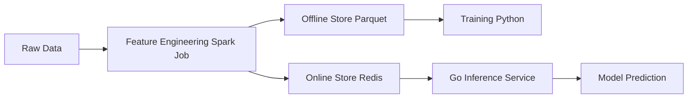
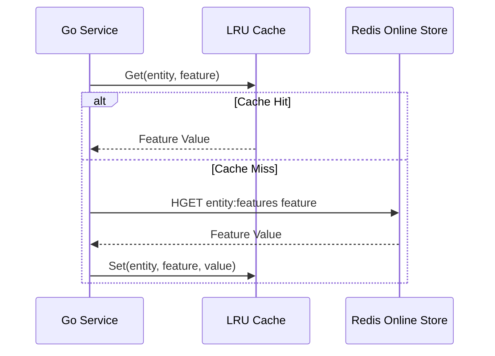

# 🏪 Feature Stores with Go

## Introduction

A feature store is a centralized repository for storing, versioning, and serving machine learning features. It solves the training-serving skew problem by ensuring that the features used during model training are identical to those retrieved during online inference. Feature stores typically consist of three components: an offline store for batch historical data, an online store for low-latency lookups, and a feature registry that manages metadata, lineage, and versioning.

In Go-based ML backends, the feature store client is a critical dependency. While Python dominates the feature engineering and offline storage layers, Go excels at building high-performance online serving clients. This note explains how to construct a lightweight feature store client in Go using Redis as the online store, with local caching to reduce network round-trips. You will learn about point-in-time correctness, feature versioning strategies, and the latency implications of different storage backends.

By the end of this note, you will understand how Airbnb's Bighead platform structures feature storage, how to implement a feature retrieval API in Go, and how to measure the success of your feature serving layer with P99 latency targets.

## 1. Feature Store Concepts

Machine learning features can be categorized by their computation cadence and retrieval pattern. Understanding this taxonomy is essential for designing a store that balances freshness, latency, and cost.

- **Offline Store:** Holds historical feature values in columnar formats (Parquet, Delta Lake). Used for training set generation and backtesting. Typically queried with SQL or dataframe APIs in Python
- **Online Store:** Holds the latest feature values in key-value or wide-column databases (Redis, DynamoDB, Cassandra). Designed for millisecond-scale point lookups during inference
- **Feature Registry:** A metadata catalog documenting feature definitions, owners, data types, and lineage. Prevents feature duplication and enables discovery across teams

Point-in-time correctness is the guarantee that when you request features for a specific entity at a specific timestamp, you receive the values that were known at that exact moment. This prevents data leakage, where future information contaminates training labels. In an online setting, point-in-time correctness simplifies to "return the most recent value before now."

Real case: **Airbnb**'s Bighead feature store powers all of Airbnb's ML applications. It separates offline computation (Spark jobs writing to Hive) from online serving (DynamoDB and Redis). When a model requests features for a listing, the Go serving client queries the online store with a compound key like `listing_id:feature_name`, ensuring sub-10ms retrieval for hundreds of features per request.

⚠️ **Warning:** Feature versioning is often overlooked. If you recompute a feature with a new algorithm, existing models may break or behave unexpectedly. Always version feature schemas and support multiple versions concurrently during model transitions.

💡 **Tip:** Cache hot feature vectors in the Go process using an LRU cache. If 20% of your entities generate 80% of requests, local caching can reduce online store load by 70% and cut P99 latency in half.

## 2. Feature Store Solutions Comparison

| Solution | Offline Store | Online Store | Language SDK | Best For |
|---|---|---|---|---|
| Feast | BigQuery/Snowflake | Redis/DynamoDB | Python/Go/Java | Open-source, cloud-agnostic |
| Tecton | Snowflake/Databricks | DynamoDB/Redis | Python/Go | Enterprise, managed |
| SageMaker Feature Store | S3 | DynamoDB | Python | AWS-native deployments |
| Custom (Go + Redis) | Parquet/S3 | Redis | Go | Minimal overhead, full control |
| Bighead (Airbnb) | Hive | DynamoDB | Go/Java | Internal scale (reference) |

A custom Go + Redis solution trades feature richness for raw performance and simplicity. It is ideal when you have fewer than 1,000 features, a small number of teams, and strict latency requirements.

## 3. Feature Store Architecture

### Online and Offline Separation



### Feature Retrieval Flow




## 4. Feature Store Client with Caching

The latency of feature retrieval is the dominant contributor to end-to-end inference time in many real-time systems:

$$
Feature\_Latency = P99(Lookup\_Time)
$$

To keep this under 5ms, combine Redis pipelining with an in-process LRU cache.

```go
package main

import (
	"context"
	"encoding/json"
	"fmt"
	"log"
	"time"

	"github.com/hashicorp/golang-lru/v2"
	"github.com/redis/go-redis/v9"
)

// FeatureValue wraps a stored feature with metadata
type FeatureValue struct {
	Value     float64   `json:"value"`
	Timestamp time.Time `json:"timestamp"`
	Version   string    `json:"version"`
}

// FeatureStore manages online feature retrieval with caching
type FeatureStore struct {
	redisClient *redis.Client
	cache       *lru.Cache[string, FeatureValue]
	defaultTTL  time.Duration
}

func NewFeatureStore(redisAddr string, cacheSize int, ttl time.Duration) (*FeatureStore, error) {
	client := redis.NewClient(&redis.Options{
		Addr: redisAddr,
	})

	cache, err := lru.New[string, FeatureValue](cacheSize)
	if err != nil {
		return nil, err
	}

	return &FeatureStore{
		redisClient: client,
		cache:       cache,
		defaultTTL:  ttl,
	}, nil
}

// GetFeature retrieves a single feature with fallback to Redis
func (fs *FeatureStore) GetFeature(ctx context.Context, entityID, featureName string) (FeatureValue, error) {
	cacheKey := fmt.Sprintf("%s:%s", entityID, featureName)

	// Check local cache
	if val, ok := fs.cache.Get(cacheKey); ok {
		return val, nil
	}

	// Query Redis hash
	redisKey := fmt.Sprintf("entity:%s:features", entityID)
	data, err := fs.redisClient.HGet(ctx, redisKey, featureName).Result()
	if err != nil {
		return FeatureValue{}, fmt.Errorf("redis hget: %w", err)
	}

	var fv FeatureValue
	if err := json.Unmarshal([]byte(data), &fv); err != nil {
		return FeatureValue{}, fmt.Errorf("unmarshal: %w", err)
	}

	// Populate cache
	fs.cache.Add(cacheKey, fv)
	return fv, nil
}

// GetFeatureVector retrieves multiple features in a single pipeline round-trip
func (fs *FeatureStore) GetFeatureVector(ctx context.Context, entityID string, featureNames []string) (map[string]FeatureValue, error) {
	result := make(map[string]FeatureValue, len(featureNames))
	missingFromCache := make([]string, 0)
	redisKey := fmt.Sprintf("entity:%s:features", entityID)

	// Check cache first
	for _, name := range featureNames {
		cacheKey := fmt.Sprintf("%s:%s", entityID, name)
		if val, ok := fs.cache.Get(cacheKey); ok {
			result[name] = val
		} else {
			missingFromCache = append(missingFromCache, name)
		}
	}

	if len(missingFromCache) == 0 {
		return result, nil
	}

	// Pipeline Redis HMGET
	pipe := fs.redisClient.Pipeline()
	cmders := make([]*redis.StringCmd, len(missingFromCache))
	for i, name := range missingFromCache {
		cmders[i] = pipe.HGet(ctx, redisKey, name)
	}
	_, err := pipe.Exec(ctx)
	if err != nil && err != redis.Nil {
		return nil, fmt.Errorf("redis pipeline: %w", err)
	}

	for i, name := range missingFromCache {
		data, err := cmders[i].Result()
		if err != nil {
			continue // Feature may not exist
		}
		var fv FeatureValue
		if err := json.Unmarshal([]byte(data), &fv); err != nil {
			continue
		}
		cacheKey := fmt.Sprintf("%s:%s", entityID, name)
		fs.cache.Add(cacheKey, fv)
		result[name] = fv
	}

	return result, nil
}

func main() {
	store, err := NewFeatureStore("localhost:6379", 10000, 5*time.Minute)
	if err != nil {
		log.Fatal(err)
	}

	ctx := context.Background()
	vector, err := store.GetFeatureVector(ctx, "user_123", []string{"age", "purchase_count", "avg_session_duration"})
	if err != nil {
		log.Fatal(err)
	}

	for name, val := range vector {
		fmt.Printf("%s = %.2f (v%s)\n", name, val.Value, val.Version)
	}
}
```

## 5. Point-in-Time Correctness and Versioning

Point-in-time lookups in an online store are straightforward because you almost always want the latest value. However, for training data generation, you must join historical labels with feature values as of the label timestamp. This is why offline stores use temporal joins and event time indexing.

In your Go client, implement feature versioning by embedding the version string in the Redis hash field name or as a JSON field. When deploying a new model that expects a different feature schema, the client can request `feature_name@v2` while the old model continues to request `feature_name@v1`.

⚠️ **Warning:** Never mutate a feature value in place after retrieving it from the store. Feature vectors may be shared across concurrent requests due to caching. Always copy values before transformation.

---

## 📦 Compression Code

```go
package main

import (
	"context"
	"encoding/json"
	"fmt"
	"time"

	"github.com/hashicorp/golang-lru/v2"
	"github.com/redis/go-redis/v9"
)

type Feature struct {
	Value float64 `json:"value"`
	Ver   string  `json:"ver"`
}

type Store struct {
	rdb   *redis.Client
	cache *lru.Cache[string, Feature]
}

func NewStore(addr string, cacheSize int) *Store {
	rdb := redis.NewClient(&redis.Options{Addr: addr})
	c, _ := lru.New[string, Feature](cacheSize)
	return &Store{rdb: rdb, cache: c}
}

func (s *Store) Get(ctx context.Context, entity, feat string) (Feature, error) {
	ck := entity + ":" + feat
	if v, ok := s.cache.Get(ck); ok {
		return v, nil
	}
	data, err := s.rdb.HGet(ctx, "e:"+entity, feat).Result()
	if err != nil {
		return Feature{}, err
	}
	var f Feature
	json.Unmarshal([]byte(data), &f)
	s.cache.Add(ck, f)
	return f, nil
}

func main() {
	s := NewStore("localhost:6379", 5000)
	f, _ := s.Get(context.Background(), "u42", "clicks")
	fmt.Println(f)
}
```

## 🎯 Documented Project

### Description

A **Go Feature Store Client** that provides sub-millisecond feature retrieval for real-time recommendation systems. The client connects to Redis as the online store, maintains an in-process LRU cache for hot entities, and exposes a gRPC API for batch feature vector lookups. It supports feature versioning, point-in-time filtering, and structured logging.

### Functional Requirements

1. Retrieve feature vectors for up to 100 entities in a single gRPC request
2. Cache frequently accessed features locally with TTL-based invalidation
3. Support multiple feature versions via namespaced Redis keys
4. Log every retrieval with entity ID, latency, cache hit/miss status, and feature version
5. Provide a `/health` endpoint that verifies Redis connectivity and cache statistics

### Main Components

- **Redis Adapter:** Connection pool with pipelined HMGET for batch lookups
- **LRU Cache:** Thread-safe local cache with configurable size and TTL
- **gRPC Server:** Unary and streaming RPCs for feature retrieval
- **Feature Validator:** Schema validation ensuring requested features match registered types
- **Metrics Exporter:** Prometheus gauge for cache hit ratio and Redis latency histogram

### Success Metrics

- P99 feature retrieval latency under 5ms for cached features and under 15ms for cache misses
- Cache hit ratio above 60% under production traffic patterns
- Redis online store availability above 99.99%
- Feature version mismatch errors below 0.01% of total requests

### References

- [Feast Documentation](https://docs.feast.dev/)
- [Airbnb Bighead](https://medium.com/airbnb-engineering/bighead-approaching-near-real-time-feature-serving-at-airbnb-72c37d52ea5b)
- [Redis Go Client](https://github.com/redis/go-redis)
- [Golang LRU Cache](https://github.com/hashicorp/golang-lru)
