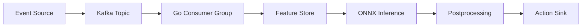
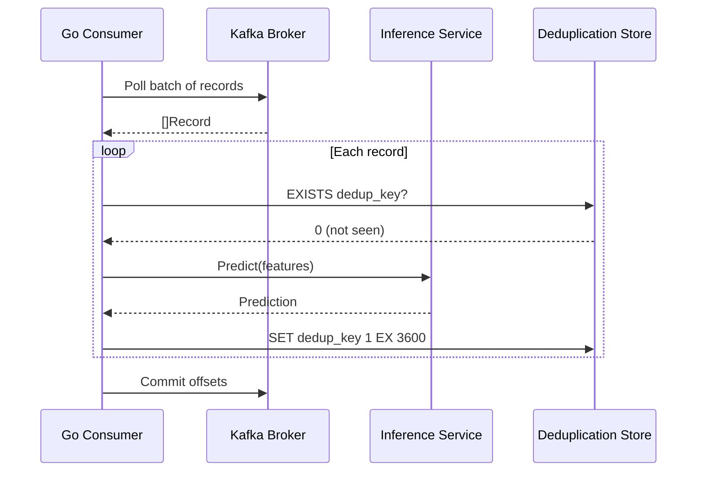
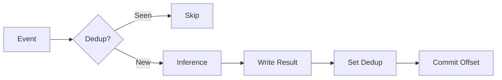
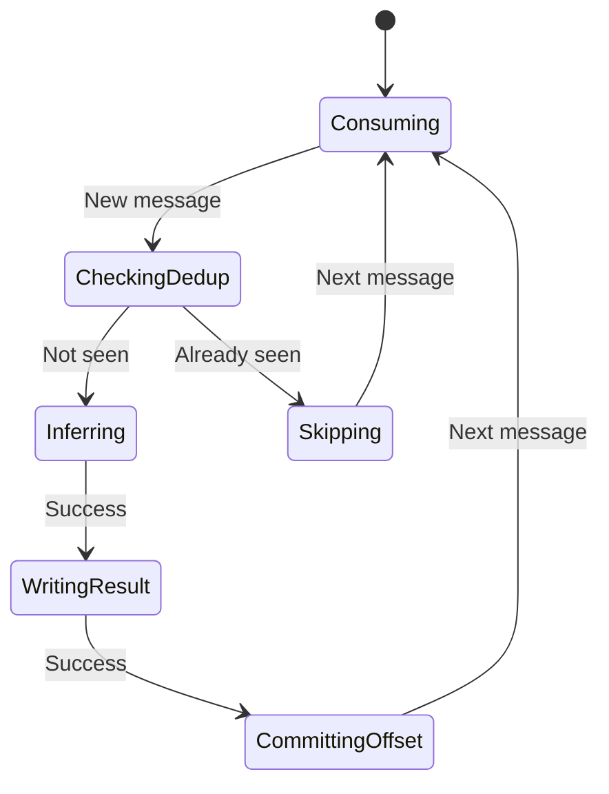

# ⚡ Real-time Inference Pipelines

## 🎯 Learning Objectives

By the end of this note, you will be able to:

1. Design event-driven inference pipelines using Go and Kafka
2. Implement idempotent consumers with deduplication semantics
3. Guarantee exactly-once processing for ML predictions in stream systems
4. Measure and optimize end-to-end latency from ingestion to action

## Introduction

Real-time inference pipelines process data streams as they arrive, applying machine learning models to events within milliseconds of generation. Unlike batch prediction, where data accumulates before processing, stream inference enables immediate action: fraud detection on payment events, content ranking on user clicks, or anomaly detection on IoT sensor readings. The architecture of such pipelines is fundamentally event-driven, requiring durable message brokers, idempotent consumers, and low-latency serving layers. Go's goroutines and channels make it an exceptional choice for building these reactive systems because they provide lightweight concurrency without the overhead of OS threads.

This note covers stream processing platforms (Kafka, NATS, Redis Streams) and their integration with Go inference services. You will learn how to structure a pipeline from ingestion through action, how to guarantee exactly-once semantics, and why idempotency is non-negotiable in distributed ML systems. Real-time pipelines are the backbone of modern reactive systems, and understanding their internals is critical for deploying production-grade AI infrastructure. For context on deploying models in production, see [[03 - Deploying Models in Production]], and for gRPC-based serving, refer to [[01 - gRPC for Model Serving]].

By mastering real-time inference pipelines, you transform static models into living systems that react to the world as it happens.

## Module 1: Event-Driven Inference Architecture

### 1.1 Theoretical Foundation 🧠

The concept of stream processing emerged from the database community in the early 2000s, driven by the need to query unbounded datasets. Researchers at Stanford (STREAM project, 2003) and Berkeley (TelegraphCQ, 2003) formalized the semantics of continuous queries over data streams. The theoretical model treats a stream as an append-only sequence of tuples with timestamps, and a stream processor as an operator that transforms input streams to output streams.

Event-driven architecture (EDA) extends this with the publish-subscribe pattern, first described in the GUIs of the 1980s and later scaled to distributed systems via message brokers. The critical insight for ML serving is that inference is just another stream operator: it consumes feature vectors (tuples), applies a function (the model), and emits predictions (tuples). This operator must be stateless or carefully stateful, and it must compose with other operators like windowing, joining, and aggregating.

The CAP theorem applies directly to streaming pipelines. A real-time inference system must choose between consistency (exactly-once processing) and availability (low latency) during network partitions. Modern systems like Kafka and Pulsar achieve both through idempotent producers and transactional offsets, but this requires careful client implementation.

### 1.2 Mental Model 📐

Think of a real-time inference pipeline as an assembly line in a factory:

```
┌─────────────┐    ┌─────────────┐    ┌─────────────┐    ┌─────────────┐
│   Event     │───>│  Feature    │───>│  Inference  │───>│   Action    │
│   Source    │    │   Store     │    │   Engine    │    │    Sink     │
└─────────────┘    └─────────────┘    └─────────────┘    └─────────────┘
       │                  │                  │                  │
       v                  v                  v                  v
   Raw Event        Enriched Tensor      Prediction        Alert/API Call
```

At a lower level, the Kafka consumer acts as a buffer between the broker and the inference engine:

```
┌─────────────────────────────────────────────────────────────┐
│                     Kafka Broker                             │
│  ┌───────────────────────────────────────────────────────┐  │
│  │ Topic: ml-events  │  Partition 0  │  Partition 1      │  │
│  └───────────────────────────────────────────────────────┘  │
└──────────────────────────┬────────────────┬─────────────────┘
                           │                │
              ┌────────────▼────┐  ┌───────▼────────┐
              │  Consumer 0     │  │  Consumer 1    │
              │  (Group: ml)    │  │  (Group: ml)   │
              └────────┬────────┘  └───────┬────────┘
                       │                   │
              ┌────────▼────────┐  ┌───────▼────────┐
              │  Inference      │  │  Inference     │
              │  Worker Pool    │  │  Worker Pool   │
              └─────────────────┘  └────────────────┘
```

The deduplication layer prevents duplicate events from corrupting state:

```
┌─────────────┐     ┌─────────────────┐     ┌─────────────┐
│   Event     │────>│  Deduplication  │────>│  Inference  │
│   Arrival   │     │     Layer       │     │   Engine    │
└─────────────┘     └─────────────────┘     └─────────────┘
                            │
                    ┌───────┴───────┐
                    │ Redis SETEX   │
                    │ dedup:<id>    │
                    │ TTL=24h       │
                    └───────────────┘
```

### 1.3 Syntax and Semantics 📝

```go
package main

import (
	"context"
	"encoding/json"
	"fmt"
	"log"
	"time"

	"github.com/IBM/sarama"
	"github.com/redis/go-redis/v9"
)

// Event represents an incoming stream event with a unique ID for idempotency.
// WHY: Unique IDs are the foundation of deduplication in distributed systems.
type Event struct {
	EventID   string                 `json:"event_id"`
	EntityID  string                 `json:"entity_id"`
	Payload   map[string]interface{} `json:"payload"`
	Timestamp time.Time              `json:"timestamp"`
}

// PredictionResult wraps model output with metadata for downstream consumers.
// WHY: Metadata enables tracing and auditability in production pipelines.
type PredictionResult struct {
	EventID    string    `json:"event_id"`
	Score      float64   `json:"score"`
	Label      string    `json:"label"`
	InferredAt time.Time `json:"inferred_at"`
}

// InferenceConsumer implements sarama.ConsumerGroupHandler.
// WHY: Consumer groups enable horizontal scaling and fault tolerance.
type InferenceConsumer struct {
	redisClient *redis.Client
	ready       chan bool
}

func NewInferenceConsumer(redisAddr string) *InferenceConsumer {
	return &InferenceConsumer{
		redisClient: redis.NewClient(&redis.Options{Addr: redisAddr}),
		ready:       make(chan bool),
	}
}

func (c *InferenceConsumer) Setup(sarama.ConsumerGroupSession) error {
	close(c.ready)
	return nil
}

func (c *InferenceConsumer) Cleanup(sarama.ConsumerGroupSession) error {
	return nil
}

func (c *InferenceConsumer) ConsumeClaim(session sarama.ConsumerGroupSession, claim sarama.ConsumerGroupClaim) error {
	ctx := context.Background()

	for msg := range claim.Messages() {
		var event Event
		if err := json.Unmarshal(msg.Value, &event); err != nil {
			log.Printf("unmarshal error: %v", err)
			session.MarkMessage(msg, "")
			continue
		}

		// Idempotency check: skip duplicate events.
		// WHY: Consumer group rebalances and broker failovers can redeliver messages.
		dedupKey := fmt.Sprintf("dedup:%s", event.EventID)
		exists, err := c.redisClient.Exists(ctx, dedupKey).Result()
		if err != nil {
			log.Printf("redis error: %v", err)
			continue
		}
		if exists > 0 {
			log.Printf("duplicate event skipped: %s", event.EventID)
			session.MarkMessage(msg, "")
			continue
		}

		// Preprocess: enrich with features from a feature store.
		// WHY: Raw events rarely contain the full feature vector needed by the model.
		features := preprocessEvent(event)

		// Inference: call the model (mocked here with computation).
		// WHY: The inference call is the core value-add of the pipeline.
		result := runInference(features)

		// Postprocess: apply business rules to the prediction.
		// WHY: Model scores are not decisions; business logic bridges the gap.
		if result.Score > 0.8 {
			triggerAlert(event.EntityID, result)
		}

		// Mark as processed with a TTL to bound memory growth.
		// WHY: Without TTL, the deduplication set grows unbounded over time.
		c.redisClient.Set(ctx, dedupKey, "1", 24*time.Hour)
		session.MarkMessage(msg, "")
	}
	return nil
}

func preprocessEvent(event Event) []float32 {
	// In production: query feature store, normalize, encode categorical variables.
	return []float32{float32(event.Timestamp.Unix()), 1.0, 0.5}
}

func runInference(features []float32) PredictionResult {
	// In production: call ONNX Runtime or TensorFlow Serving session.
	score := 0.0
	for _, f := range features {
		score += float64(f)
	}
	return PredictionResult{
		EventID:    fmt.Sprintf("evt-%d", time.Now().UnixNano()),
		Score:      score / float64(len(features)),
		Label:      "anomaly",
		InferredAt: time.Now().UTC(),
	}
}

func triggerAlert(entityID string, result PredictionResult) {
	log.Printf("ALERT: entity=%s score=%.2f", entityID, result.Score)
}

func main() {
	config := sarama.NewConfig()
	config.Version = sarama.V3_6_0_0
	config.Consumer.Group.Rebalance.Strategy = sarama.NewBalanceStrategyRoundRobin()
	config.Consumer.Offsets.Initial = sarama.OffsetOldest

	group, err := sarama.NewConsumerGroup([]string{"localhost:9092"}, "inference-group", config)
	if err != nil {
		log.Fatal(err)
	}
	defer group.Close()

	consumer := NewInferenceConsumer("localhost:6379")
	ctx := context.Background()

	for {
		err := group.Consume(ctx, []string{"events"}, consumer)
		if err != nil {
			log.Printf("consume error: %v", err)
		}
		if ctx.Err() != nil {
			return
		}
		consumer.ready = make(chan bool)
	}
}
```

### 1.4 Visual Representation 🖼️

End-to-end inference pipeline flow:



Consumer offset management with deduplication:




### 1.5 Application in ML/AI Systems 🤖

| System | Platform | Scale | Latency Target | ML Use Case |
|--------|----------|-------|----------------|-------------|
| LinkedIn Feed Ranking | Kafka + Samza | 1M+ events/sec | <200ms | Real-time content scoring |
| Uber ETA Prediction | Kafka + Flink | 10M+ events/sec | <100ms | Dynamic arrival time |
| Netflix Playback Analytics | Kafka + Spark Streaming | 100M+ events/day | <1min | Session quality prediction |
| Stripe Fraud Detection | Kafka + Go services | 1M+ payments/day | <50ms | Transaction risk scoring |

### 1.6 Common Pitfalls ⚠️

- **Warning:** Stream processing systems are susceptible to duplicate events during consumer group rebalances or broker failovers. Always design your inference consumer to be idempotent: the same event processed twice must produce the same outcome without corrupting state.

- **Warning:** Do not use external system clocks for ordering or deduplication in distributed pipelines. Clock skew between consumers can cause events to be processed out of order or deduplicated incorrectly. Use broker-assigned offsets or event timestamps with vector clocks.

- **Tip:** Use a deterministic deduplication key derived from the event content (e.g., hash of transaction ID + timestamp). Store processed keys in a TTL-backed Redis set to skip duplicates within a window without unbounded memory growth.

### 1.7 Knowledge Check ❓

1. Why is idempotency critical in Kafka consumer groups, and how does Redis help achieve it?
2. Explain the trade-off between at-least-once and exactly-once semantics in a real-time inference pipeline.
3. What is the primary risk of committing Kafka offsets before writing the deduplication key to Redis?

## Module 2: Exactly-Once Semantics in ML Inference

### 2.1 Theoretical Foundation 🧠

Exactly-once processing in a distributed streaming pipeline requires coordination between the message broker, the consumer, and any external state stores. In practice, this is implemented as idempotent writes, transactional outboxes, or two-phase commits.

For ML inference, idempotency is usually sufficient. Since model inference is deterministic (given the same inputs), processing the same event twice yields the same prediction. The critical step is ensuring that the action triggered by the prediction (e.g., blocking a payment) is also idempotent. The theoretical foundation is the idempotent consumer pattern from the saga pattern in distributed systems.

### 2.2 Mental Model 📐

The transaction boundary for exactly-once inference:

```
┌─────────────────────────────────────────────────────────────┐
│                     Transaction Boundary                     │
│  ┌─────────┐    ┌─────────┐    ┌─────────┐    ┌─────────┐ │
│  │ Consume │───>│ Infer   │───>│ Write   │───>│ Commit  │ │
│  │ Event   │    │ Model   │    │ Result  │    │ Offset  │ │
│  └─────────┘    └─────────┘    └─────────┘    └─────────┘ │
│         ↑                                          ↑        │
│         └────────────── Rollback on error ─────────┘        │
└─────────────────────────────────────────────────────────────┘
```

The deduplication state machine:

```
         ┌─────────────┐
         │   Event     │
         │   Arrives   │
         └──────┬──────┘
                v
        ┌───────────────┐
        │ Check Redis   │
        │ dedup:<id>    │
        └───────┬───────┘
                │
      ┌─────────┴─────────┐
      │                   │
      v                   v
┌──────────┐       ┌──────────┐
│ EXISTS=1 │       │ EXISTS=0 │
│ Skip     │       │ Process  │
└──────────┘       └────┬─────┘
                        v
                 ┌────────────┐
                 │ SETEX 24h  │
                 │ Commit     │
                 └────────────┘
```

### 2.3 Syntax and Semantics 📝

```go
// exactlyOnceInference demonstrates the atomic sequence.
// WHY: The order of side effects and offset commits determines correctness.
func exactlyOnceInference(
	ctx context.Context,
	event Event,
	rdb *redis.Client,
	session sarama.ConsumerGroupSession,
	msg *sarama.ConsumerMessage,
) error {
	dedupKey := fmt.Sprintf("dedup:%s", event.EventID)

	// 1. Check deduplication BEFORE any side effects.
	// WHY: If we crash after side effects but before dedup check, we might duplicate.
	exists, err := rdb.Exists(ctx, dedupKey).Result()
	if err != nil {
		return fmt.Errorf("dedup check failed: %w", err)
	}
	if exists > 0 {
		session.MarkMessage(msg, "")
		return nil
	}

	// 2. Run inference (deterministic, stateless).
	result := runInference(preprocessEvent(event))

	// 3. Write idempotent side effect (e.g., conditional update).
	// WHY: Database writes must use the event ID as a uniqueness constraint.
	if err := writeResultIdempotently(ctx, event.EventID, result); err != nil {
		return fmt.Errorf("write failed: %w", err)
	}

	// 4. Record deduplication key.
	// WHY: This must happen AFTER the side effect to handle crashes correctly.
	if err := rdb.Set(ctx, dedupKey, "1", 24*time.Hour).Err(); err != nil {
		return fmt.Errorf("dedup write failed: %w", err)
	}

	// 5. Commit offset only after all processing succeeds.
	// WHY: Committing early risks data loss on crash; committing late risks duplicates.
	session.MarkMessage(msg, "")
	return nil
}
```

### 2.4 Visual Representation 🖼️






### 2.5 Application in ML/AI Systems 🤖

| System | Exactly-Once Strategy | Deduplication Store | Latency Impact |
|--------|----------------------|---------------------|----------------|
| Stripe Fraud | Idempotent writes | PostgreSQL unique index | <5ms |
| Uber Eats ETA | Transactional outbox | Kafka transactions | <10ms |
| Netflix Playback | Deterministic key + Redis | Redis SETEX | <2ms |
| Shopify Checkout | Saga pattern | Redis + PostgreSQL | <15ms |

### 2.6 Common Pitfalls ⚠️

- **Warning:** Do not use external system clocks for ordering or deduplication in distributed pipelines. Clock skew between consumers can cause events to be processed out of order or deduplicated incorrectly.

- **Warning:** Never commit offsets before writing deduplication keys. If the consumer crashes between the offset commit and the dedup write, the next consumer will skip the event entirely, causing data loss.

- **Tip:** Use a deterministic deduplication key derived from the event content (e.g., hash of transaction ID + timestamp). Store processed keys in a TTL-backed Redis set to skip duplicates within a window without unbounded memory growth.

### 2.7 Knowledge Check ❓

1. Why is idempotency often sufficient for exactly-once ML inference, even without Kafka transactions?
2. What is the correct order of operations: dedup check, inference, result write, dedup write, offset commit?
3. How does the saga pattern apply to ML inference pipelines with multiple downstream actions?

## 📦 Compression Code

```go
package main

import (
	"context"
	"encoding/json"
	"fmt"
	"log"
	"time"

	"github.com/IBM/sarama"
	"github.com/redis/go-redis/v9"
)

type StreamEvent struct {
	ID   string  `json:"id"`
	Data float64 `json:"data"`
}

type StreamConsumer struct {
	rdb *redis.Client
}

func (c *StreamConsumer) Setup(sarama.ConsumerGroupSession) error   { return nil }
func (c *StreamConsumer) Cleanup(sarama.ConsumerGroupSession) error { return nil }

func (c *StreamConsumer) ConsumeClaim(sess sarama.ConsumerGroupSession, claim sarama.ConsumerGroupClaim) error {
	ctx := context.Background()
	for msg := range claim.Messages() {
		var e StreamEvent
		json.Unmarshal(msg.Value, &e)

		dk := "dedup:" + e.ID
		if c.rdb.Exists(ctx, dk).Val() > 0 {
			sess.MarkMessage(msg, "")
			continue
		}

		score := e.Data * 0.5 // mock inference
		fmt.Printf("inference: id=%s score=%.2f\n", e.ID, score)

		c.rdb.Set(ctx, dk, "1", time.Hour)
		sess.MarkMessage(msg, "")
	}
	return nil
}

func main() {
	cfg := sarama.NewConfig()
	cfg.Version = sarama.V3_6_0_0
	cfg.Consumer.Offsets.Initial = sarama.OffsetOldest

	g, err := sarama.NewConsumerGroup([]string{"localhost:9092"}, "ml-group", cfg)
	if err != nil {
		log.Fatal(err)
	}

	c := &StreamConsumer{rdb: redis.NewClient(&redis.Options{Addr: "localhost:6379"})}
	for {
		if err := g.Consume(context.Background(), []string{"ml-events"}, c); err != nil {
			log.Println(err)
		}
	}
}
```

## 🎯 Documented Project

### Description

A **Real-Time Fraud Detection Pipeline** built in Go that consumes payment events from Kafka, enriches them with customer features from Redis, runs inference through an ONNX fraud model, and publishes alerts to a downstream topic. The system guarantees idempotency via Redis deduplication and exposes consumer lag metrics.

### Functional Requirements

1. Consume events from a Kafka topic with at-least-once delivery semantics
2. Enrich each event with a precomputed feature vector from Redis in under 10ms
3. Run ONNX inference to produce a fraud probability score
4. Publish high-risk transactions (>0.9 score) to an `alerts` Kafka topic
5. Skip duplicate events using a Redis-backed deduplication cache with 24h TTL

### Main Components

- **Kafka Consumer Group:** Sarama-based consumer with manual offset management
- **Feature Enricher:** Pipelined Redis HMGET for batch feature retrieval
- **ONNX Inference Engine:** Session-per-worker goroutine with input tensor reuse
- **Alert Producer:** Async Kafka producer for downstream action systems
- **Deduplication Layer:** Redis SET with TTL for processed event IDs

### Success Metrics

- End-to-end latency from Kafka ingestion to alert publication under 100ms at P99
- Consumer lag stays below 1,000 messages during 10x traffic spikes
- Duplicate event processing rate below 0.001%
- Pipeline throughput exceeds 50,000 events per second per consumer instance

### References

- [LinkedIn Real-Time Feature Engineering](https://engineering.linkedin.com/blog/2019/feature-engineering-linkedin)
- [Apache Kafka Consumer API](https://kafka.apache.org/documentation/)
- [Sarama Go Client](https://github.com/IBM/sarama)
- [Exactly-Once Semantics in Kafka](https://www.confluent.io/blog/exactly-once-semantics-are-possible-heres-how-apache-kafka-does-it/)
