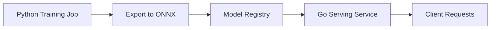
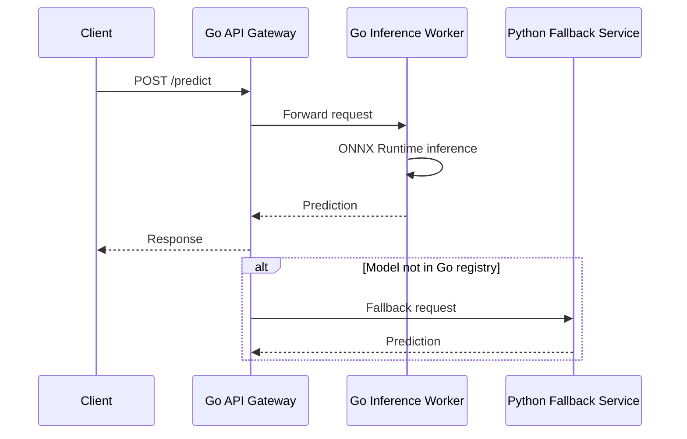
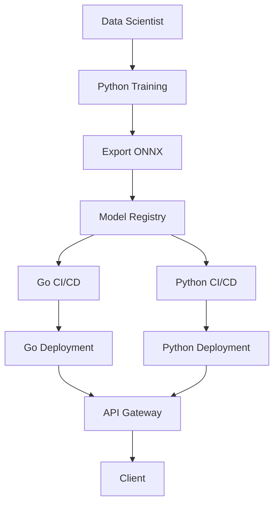
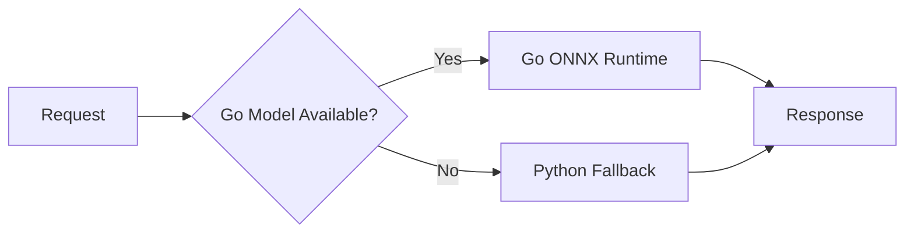

# 🥊 Go vs Python for ML Serving

## 🎯 Learning Objectives

By the end of this note, you will be able to:

1. Compare Go and Python across latency, throughput, memory, and ecosystem dimensions
2. Design hybrid Python/Go architectures for training and serving separation
3. Benchmark concurrent inference workloads and interpret the results
4. Decide when to use Go versus Python for ML production systems

## Introduction

Python has been the undisputed champion of machine learning research and model development. Its ecosystem of frameworks (PyTorch, TensorFlow, JAX, scikit-learn) and its interactive nature make it ideal for experimentation. However, when models move from notebooks to production serving systems, Python's limitations become apparent. The Global Interpreter Lock (GIL), high memory footprint, and slow startup times create bottlenecks that directly impact user experience and infrastructure cost. For teams building high-throughput ML backends, these constraints force a critical technology decision.

Go, by contrast, was designed for systems programming at scale. Its goroutines provide lightweight concurrency, its garbage collector is optimized for low latency, and its static binaries deploy in milliseconds. This note provides a rigorous, data-driven comparison of Go and Python for ML serving workloads. You will learn when to use each language, how to benchmark them side by side, and how to architect hybrid systems that leverage the strengths of both. For context on deploying models in Go, see [[02 - ONNX and TensorFlow Serving]], and for API design patterns, refer to [[01 - gRPC for Model Serving]].

By mastering the trade-offs between Go and Python, you can build polyglot ML platforms that combine Python's research agility with Go's operational excellence.

## Module 1: Performance Benchmarks and the GIL

### 1.1 Theoretical Foundation 🧠

The Global Interpreter Lock (GIL) is a mutual-exclusion lock held by the CPython interpreter that prevents multiple threads from executing Python bytecode simultaneously. Introduced in the early 1990s to simplify memory management in CPython, the GIL remains the dominant implementation today. While it protects reference-counted objects from race conditions, it serializes CPU-bound workloads, making true thread-level parallelism impossible in pure Python.

Go's concurrency model, introduced in 2009, was inspired by CSP (Communicating Sequential Processes) from Tony Hoare's 1978 paper. Goroutines are multiplexed onto OS threads by the Go scheduler (M:N scheduling), allowing hundreds of thousands of concurrent tasks with minimal overhead. The Go runtime handles preemption, garbage collection, and synchronization without a global lock, making it fundamentally better suited for I/O-bound and CPU-bound serving workloads.

The theoretical throughput of a serving system is bounded by Amdahl's Law: $Speedup = 1 / ((1 - P) + P/N)$, where $P$ is the parallelizable fraction and $N$ is the number of cores. In Python, the GIL effectively limits $N$ to 1 for CPU-bound bytecode, while Go can utilize all available cores.

### 1.2 Mental Model 📐

Python's concurrency under the GIL:

```
┌─────────────────────────────────────────┐
│           CPython Process                │
│  ┌─────────┐ ┌─────────┐ ┌─────────┐  │
│  │ Thread 1│ │ Thread 2│ │ Thread 3│  │
│  │ (waiting│ │(waiting │ │(waiting │  │
│  │  for GIL│ │  for GIL│ │  for GIL│  │
│  └────┬────┘ └────┬────┘ └────┬────┘  │
│       └───────────┼───────────┘        │
│                   v                    │
│            ┌─────────┐                 │
│            │   GIL   │                 │
│            │ (1 core)│                 │
│            └────┬────┘                 │
│                 v                      │
│            ┌─────────┐                 │
│            │  CPU    │                 │
│            └─────────┘                 │
└─────────────────────────────────────────┘
```

Go's concurrency with goroutines:

```
┌─────────────────────────────────────────┐
│           Go Runtime                     │
│  ┌─────────┐ ┌─────────┐ ┌─────────┐  │
│  │Goroutine│ │Goroutine│ │Goroutine│  │
│  │    1    │ │    2    │ │    3    │  │
│  └────┬────┘ └────┬────┘ └────┬────┘  │
│       └───────────┼───────────┘        │
│                   v                    │
│            ┌─────────┐                 │
│            │ Scheduler│                │
│            │ (M:N)   │                 │
│            └────┬────┘                 │
│       ┌─────────┼─────────┐            │
│       v         v         v            │
│  ┌────────┐ ┌────────┐ ┌────────┐     │
│  │ OS Thr │ │ OS Thr │ │ OS Thr │     │
│  │   1    │ │   2    │ │   3    │     │
│  └────┬───┘ └────┬───┘ └────┬───┘     │
│       └──────────┼──────────┘          │
│                  v                     │
│            ┌─────────┐                 │
│            │  CPU    │                 │
│            │ (multicore)               │
│            └─────────┘                 │
└─────────────────────────────────────────┘
```

Memory footprint comparison:

```
┌─────────────────┐      ┌─────────────────┐
│   Go Binary     │      │  Python Process │
│                 │      │                 │
│  Runtime: 5MB   │      │  CPython: 50MB  │
│  Binary: 15MB   │      │  PyTorch: 1.2GB │
│  Total: 20MB    │      │  NumPy: 200MB   │
│                 │      │  Total: ~1.5GB  │
└─────────────────┘      └─────────────────┘
```

### 1.3 Syntax and Semantics 📝

```go
package main

import (
	"encoding/json"
	"fmt"
	"net/http"
	"sync"
	"sync/atomic"
	"time"
)

var requestCount uint64

// mockInference simulates a lightweight model call.
// WHY: In production, this would invoke ONNX Runtime or a custom C++ binding.
func mockInference(input []float64) float64 {
	sum := 0.0
	for _, v := range input {
		sum += v * 0.5
	}
	time.Sleep(1 * time.Millisecond) // Simulate 1ms compute
	return sum
}

func predictHandler(w http.ResponseWriter, r *http.Request) {
	start := time.Now()
	var req struct {
		Input []float64 `json:"input"`
	}
	if err := json.NewDecoder(r.Body).Decode(&req); err != nil {
		http.Error(w, err.Error(), http.StatusBadRequest)
		return
	}

	// WHY: Atomic counter avoids lock contention under high concurrency.
	result := mockInference(req.Input)
	atomic.AddUint64(&requestCount, 1)

	latency := time.Since(start).Milliseconds()
	json.NewEncoder(w).Encode(map[string]interface{}{
		"result":  result,
		"latency": latency,
	})
}

// runBenchmark stresses the server with concurrent requests.
// WHY: Real-world serving handles thousands of simultaneous connections.
func runBenchmark(url string, concurrency, totalRequests int) {
	var wg sync.WaitGroup
	sem := make(chan struct{}, concurrency)
	start := time.Now()

	for i := 0; i < totalRequests; i++ {
		wg.Add(1)
		sem <- struct{}{}
		go func() {
			defer wg.Done()
			b, _ := json.Marshal(map[string]interface{}{"input": []float64{1.0, 2.0, 3.0}})
			resp, err := http.Post(url, "application/json", &byteReader{data: b, pos: 0})
			if err == nil {
				resp.Body.Close()
			}
			<-sem
		}()
	}
	wg.Wait()
	duration := time.Since(start).Seconds()
	fmt.Printf("Requests: %d, Concurrency: %d, Duration: %.2fs, RPS: %.2f\n",
		totalRequests, concurrency, duration, float64(totalRequests)/duration)
}

type byteReader struct {
	data []byte
	pos  int
}

func (r *byteReader) Read(p []byte) (n int, err error) {
	if r.pos >= len(r.data) {
		return 0, fmt.Errorf("EOF")
	}
	n = copy(p, r.data[r.pos:])
	r.pos += n
	return n, nil
}

func main() {
	http.HandleFunc("/predict", predictHandler)
	go http.ListenAndServe(":8080", nil)
	time.Sleep(100 * time.Millisecond) // Let server start

	fmt.Println("Benchmarking Go server...")
	runBenchmark("http://localhost:8080/predict", 100, 10000)
}
```

### 1.4 Visual Representation 🖼️

Hybrid training and serving architecture:



Request flow in a hybrid system:




### 1.5 Application in ML/AI Systems 🤖

| Dimension | Go | Python | Winner |
|-----------|----|--------|--------|
| **Latency (P99)** | < 1ms routing, < 50ms inference | 5-20ms routing overhead | Go |
| **Throughput (req/s)** | 100k+ concurrent per process | 1k-5k per process (asyncio) | Go |
| **Memory per instance** | 20-100 MB | 500 MB - 2 GB | Go |
| **Cold start time** | < 100 ms | 10-60 seconds | Go |
| **ML ecosystem** | Limited (onnxruntime-go, Gorgonia) | Extensive (PyTorch, TF, JAX) | Python |
| **Training & research** | Not suitable | Excellent interactive workflows | Python |
| **Concurrency model** | Goroutines (M:N scheduling) | GIL + asyncio/event loop | Go |
| **Deployment** | Static binary, single artifact | Container with heavy dependencies | Go |
| **Hiring & community** | Smaller ML community | Largest ML talent pool | Python |
| **Interop (C/CUDA)** | CGO (complex) | Cython, PyBind11 (mature) | Python |

### 1.6 Common Pitfalls ⚠️

- **Warning:** Benchmarks comparing raw matrix multiplication (NumPy vs Go) are misleading. NumPy calls optimized C/BLAS routines and will outperform naive Go loops. The relevant benchmark is end-to-end serving latency under concurrent load, where Go's networking and concurrency advantages dominate.

- **Warning:** Do not assume that rewriting a Python service in Go will automatically improve inference latency for heavy models. If the model itself is large (e.g., LLM inference on GPU), the language of the wrapper matters less than the runtime (ONNX, TensorRT, vLLM).

- **Tip:** Use Go for the serving layer and Python for training. Expose model artifacts in ONNX or TensorFlow SavedModel format so both languages can consume them. This boundary lets data scientists iterate in Python while platform engineers optimize serving in Go.

### 1.7 Knowledge Check ❓

1. Why does the GIL limit Python's throughput for CPU-bound serving workloads, and how does Go's scheduler avoid this?
2. Under what conditions would a Python FastAPI service outperform a Go service for ML inference?
3. Calculate the theoretical speedup for a workload that is 80% parallelizable on 8 cores using Amdahl's Law.

## Module 2: Hybrid Python/Go Architecture

### 2.1 Theoretical Foundation 🧠

The polyglot architecture pattern separates concerns by language strengths. This principle, known as "use the right tool for the job," has been practiced in systems engineering for decades (e.g., C for kernels, JavaScript for browsers). In ML platforms, the boundary is typically drawn between the training phase (research-heavy, Python-native) and the serving phase (operations-heavy, latency-critical).

The model artifact acts as the contract between the two worlds. Formats like ONNX, TensorFlow SavedModel, and TorchScript are designed to be framework-agnostic and runtime-agnostic. This decoupling allows data scientists to experiment in Python without blocking platform engineers from optimizing the serving layer in Go. The theoretical basis is the dependency inversion principle: both layers depend on an abstraction (the model artifact), not on each other.

### 2.2 Mental Model 📐

The polyglot pipeline as a factory:

```
┌─────────────────────────────────────────────────────────────┐
│                    Research Factory (Python)                 │
│  ┌─────────┐    ┌─────────┐    ┌─────────┐    ┌─────────┐ │
│  │  Data   │───>│  Train  │───>│ Validate│───>│ Export  │ │
│  │  Prep   │    │  Model  │    │  Model  │    │  ONNX   │ │
│  └─────────┘    └─────────┘    └─────────┘    └────┬────┘ │
└─────────────────────────────────────────────────────┼───────┘
                                                      │
                                                      v
                                              ┌─────────────┐
                                              │ Model Registry│
                                              │  (S3/MLflow) │
                                              └──────┬──────┘
                                                     │
┌────────────────────────────────────────────────────┼───────┐
│                 Serving Factory (Go)                │       │
│  ┌─────────┐    ┌─────────┐    ┌─────────┐        │       │
│  │  Load   │───>│  Infer  │───>│ Respond │<───────┘       │
│  │  Model  │    │  ONNX   │    │  JSON   │                │
│  └─────────┘    └─────────┘    └─────────┘                │
└─────────────────────────────────────────────────────────────┘
```

Fallback mechanism for missing models:

```
┌─────────────────────────────────────────────────────────────┐
│                         API Gateway                          │
│                                                              │
│  Client Request ──> ┌─────────────────┐                      │
│                     │ Model in Go?    │                      │
│                     └────────┬────────┘                      │
│                              │                              │
│                    ┌─────────┴─────────┐                    │
│                    v                   v                    │
│           ┌─────────────┐     ┌─────────────┐              │
│           │  Go ONNX     │     │ Python Fallback│           │
│           │  Inference   │     │  FastAPI       │           │
│           └──────┬──────┘     └──────┬──────┘              │
│                  │                   │                      │
│                  └─────────┬─────────┘                      │
│                            v                                │
│                     ┌─────────────┐                         │
│                     │   Client    │                         │
│                     └─────────────┘                         │
└─────────────────────────────────────────────────────────────┘
```

Request routing by model version:

```
┌─────────────────────────────────────────────────────────────┐
│                        Load Balancer                         │
│                                                              │
│  ┌─────────────┐  ┌─────────────┐  ┌─────────────┐         │
│  │  Go v1.0    │  │  Go v1.1    │  │  Python v2  │         │
│  │  (90% traffic)│ │  (10% canary)│ │  (fallback) │        │
│  └─────────────┘  └─────────────┘  └─────────────┘         │
└─────────────────────────────────────────────────────────────┘
```

### 2.3 Syntax and Semantics 📝

```go
package main

import (
	"log"
	"net/http"
	"net/http/httputil"
	"net/url"
	"sync"
)

// Gateway routes requests to Go or Python backends.
// WHY: Abstraction over heterogeneous runtimes enables gradual migration.
type Gateway struct {
	goProxy     *httputil.ReverseProxy
	pythonProxy *httputil.ReverseProxy
	fallbackOnce sync.Once
}

func NewGateway(goAddr, pyAddr string) *Gateway {
	goURL, _ := url.Parse(goAddr)
	pyURL, _ := url.Parse(pyAddr)
	return &Gateway{
		goProxy:     httputil.NewSingleHostReverseProxy(goURL),
		pythonProxy: httputil.NewSingleHostReverseProxy(pyURL),
	}
}

func (g *Gateway) ServeHTTP(w http.ResponseWriter, r *http.Request) {
	// WHY: Try Go first for latency; fallback to Python for coverage.
	rec := &responseRecorder{ResponseWriter: w, statusCode: 200}
	g.goProxy.ServeHTTP(rec, r)

	if rec.statusCode >= 500 {
		// WHY: Log fallback to monitor model coverage gaps.
		log.Println("Fallback to Python backend")
		g.pythonProxy.ServeHTTP(w, r)
		return
	}
}

type responseRecorder struct {
	http.ResponseWriter
	statusCode int
}

func (r *responseRecorder) WriteHeader(code int) {
	r.statusCode = code
	r.ResponseWriter.WriteHeader(code)
}

func main() {
	gw := NewGateway("http://localhost:9001", "http://localhost:9002")
	http.Handle("/", gw)
	log.Println("Hybrid gateway on :8080")
	log.Fatal(http.ListenAndServe(":8080", nil))
}
```

### 2.4 Visual Representation 🖼️






### 2.5 Application in ML/AI Systems 🤖

| Company | Training | Serving | Artifact Format | Key Benefit |
|---------|----------|---------|-----------------|-------------|
| Netflix | Python/PyTorch | Go/ONNX | ONNX | Edge sub-10ms latency |
| Uber | Python | Go/Java | Protobuf + TF | 10x throughput gain |
| Spotify | Python | Go | ONNX | 5x lower memory |
| Airbnb | Python | Python + Go | TorchScript | Gradual migration |

### 2.6 Common Pitfalls ⚠️

- **Warning:** Avoid rewriting your entire ML stack in Go. The ML ecosystem (transformers, AutoML, visualization) is Python-native. The optimal architecture is a polyglot system with clear boundaries: Python for research, Go for serving.

- **Warning:** Do not fallback to Python silently without metrics. If 50% of requests fallback because models are not exported to ONNX, you lose the performance benefits of Go without realizing it.

- **Tip:** Use consistent hashing on the user ID for A/B test assignment. This ensures the same user always hits the same model variant across requests, preventing jarring user experiences where behavior flips between API calls.

### 2.7 Knowledge Check ❓

1. Why is ONNX the preferred contract between Python training and Go serving?
2. What metrics should you monitor to detect when the Go serving layer is falling back to Python too frequently?
3. Describe a deployment strategy that migrates 10% of traffic from Python to Go without downtime.

## 📦 Compression Code

```go
package main

import (
	"encoding/json"
	"fmt"
	"net/http"
	"sync"
	"time"
)

func handler(w http.ResponseWriter, r *http.Request) {
	var req struct {
		Input []float64 `json:"input"`
	}
	json.NewDecoder(r.Body).Decode(&req)
	sum := 0.0
	for _, v := range req.Input {
		sum += v
	}
	json.NewEncoder(w).Encode(map[string]float64{"result": sum * 0.5})
}

func bench(url string, c, n int) {
	sem := make(chan struct{}, c)
	var wg sync.WaitGroup
	start := time.Now()
	for i := 0; i < n; i++ {
		wg.Add(1)
		sem <- struct{}{}
		go func() {
			defer wg.Done()
			b, _ := json.Marshal(map[string]interface{}{"input": []float64{1, 2, 3}})
			http.Post(url, "application/json", &byteReader{data: b, pos: 0})
			<-sem
		}()
	}
	wg.Wait()
	fmt.Printf("RPS: %.0f\n", float64(n)/time.Since(start).Seconds())
}

type byteReader struct {
	data []byte
	pos  int
}

func (r *byteReader) Read(p []byte) (n int, err error) {
	if r.pos >= len(r.data) {
		return 0, fmt.Errorf("EOF")
	}
	n = copy(p, r.data[r.pos:])
	r.pos += n
	return n, nil
}

func main() {
	http.HandleFunc("/predict", handler)
	go http.ListenAndServe(":8080", nil)
	time.Sleep(50 * time.Millisecond)
	bench("http://localhost:8080/predict", 100, 5000)
}
```

## 🎯 Documented Project

### Description

A **Polyglot ML Serving Benchmark** that deploys identical ONNX ResNet-50 models behind a Go service and a Python FastAPI service. A load generator written in Go sends identical traffic to both endpoints and records latency distributions, throughput, and memory usage. The results are exported to Prometheus and visualized in Grafana.

### Functional Requirements

1. Export a PyTorch ResNet-50 model to ONNX format
2. Build a Go HTTP server that loads the ONNX model and serves `/predict`
3. Build a Python FastAPI server that loads the same ONNX model via `onnxruntime` and serves `/predict`
4. Run a coordinated load test against both services with varying concurrency levels
5. Generate a comparison report with P50, P99 latency, throughput, and peak memory

### Main Components

- **Go Server:** `onnxruntime_go` with HTTP handlers and Prometheus metrics
- **Python Server:** FastAPI with `onnxruntime` and `uvicorn` worker processes
- **Load Generator:** Go program using `vegeta` or custom `sync.WaitGroup` patterns
- **Model Exporter:** Python script converting PyTorch to ONNX with dummy input
- **Dashboard:** Grafana JSON model comparing Go vs Python time series

### Success Metrics

- Go P99 latency under 20ms for batch size 1; Python P99 latency under 80ms
- Go memory footprint under 200 MB at steady state; Python under 1.5 GB
- Go cold start under 500ms; Python cold start under 30 seconds
- Throughput per CPU core: Go exceeds 500 req/s; Python exceeds 50 req/s

### References

- [Netflix Edge ML Platform](https://netflixtechblog.com/how-netflix-scales-its-ml-infrastructure-2f7f6f5c2a2b)
- [FastAPI Benchmarks](https://fastapi.tiangolo.com/benchmarks/)
- [Go HTTP Server Performance](https://go.dev/doc/articles/wiki/)
- [ONNX Runtime Python vs C API](https://onnxruntime.ai/docs/api/)
