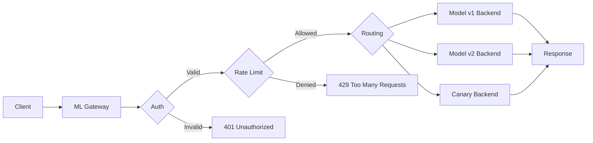
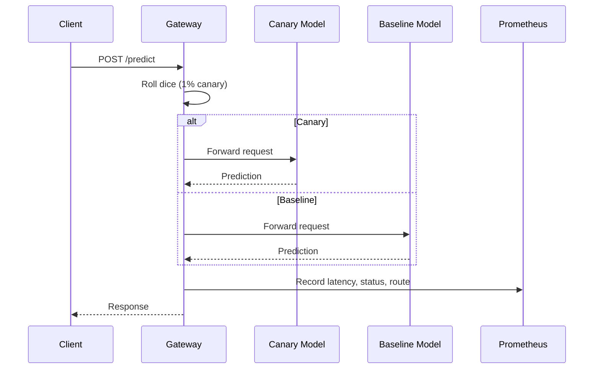
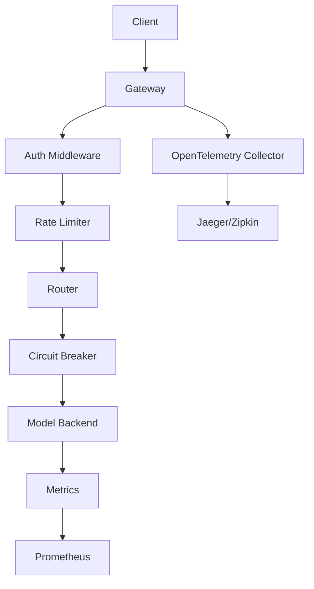
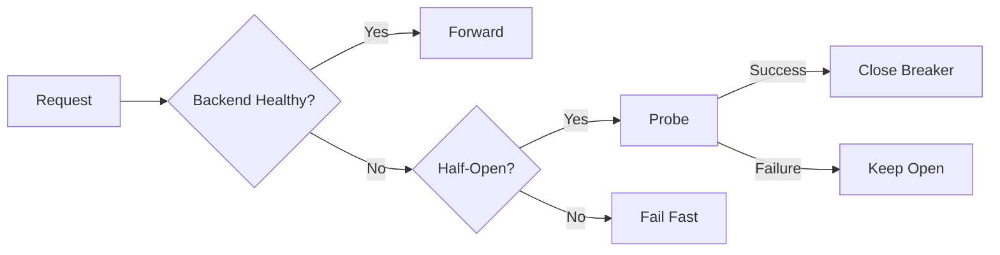

# 🚪 Building a Production ML Gateway

## 🎯 Learning Objectives

By the end of this note, you will be able to:

1. Design an ML gateway that handles routing, authentication, rate limiting, and observability
2. Implement weighted canary deployments and A/B testing for model versions in Go
3. Add Prometheus metrics and OpenTelemetry tracing to inference services
4. Build circuit breakers and fallback mechanisms for resilient ML serving

## Introduction

An ML gateway is the control plane for model serving infrastructure. It sits between clients and inference services, handling cross-cutting concerns that no single model server should manage alone: request routing, model versioning, A/B testing, canary deployments, authentication, rate limiting, and observability. Without a gateway, every inference service must independently implement these concerns, leading to inconsistent security policies, fragmented telemetry, and risky deployment practices. In production ML systems, the gateway is often the difference between a fragile collection of endpoints and a reliable platform.

This note covers the architectural patterns and Go implementation strategies for building a production-grade ML gateway. You will learn how to route requests to different model versions based on headers or user segments, how to implement token bucket rate limiting, and how to emit distributed traces and metrics for ML-specific observability. A well-designed gateway transforms a collection of model endpoints into a reliable, measurable, and secure platform. For related patterns, see [[05 - Go vs Python for ML Serving]] and [[04 - Real-time Inference Pipelines]].

By the end of this note, you will have a complete Go-based ML gateway implementation that can be deployed in front of ONNX, TensorFlow, or custom inference services.

## Module 1: Gateway Pattern for ML Serving

### 1.1 Theoretical Foundation 🧠

The API Gateway pattern, first popularized by microservices architects in the early 2010s, consolidates cross-cutting concerns into a single ingress layer. Inspired by the facade pattern in object-oriented design, the gateway provides a unified interface to a complex subsystem of backend services. In ML serving, this pattern is essential because the subsystem includes not just multiple model versions but also heterogeneous runtimes (ONNX, TensorFlow, Python fallback) and dynamic traffic rules.

The theoretical foundations of rate limiting derive from token bucket and leaky bucket algorithms, originally developed for network traffic shaping in the 1980s. The token bucket algorithm allows bursty traffic up to a maximum capacity while enforcing a long-term average rate, making it ideal for API gateways where users expect low latency for individual requests but must be constrained overall.

For A/B testing and canary deployments, the gateway implements a weighted random selection or consistent hashing algorithm. The multi-armed bandit problem from reinforcement learning provides a theoretical framework for dynamically adjusting traffic weights based on real-time performance metrics, though most production systems use fixed weights with manual oversight.

### 1.2 Mental Model 📐

The gateway as a traffic control tower:

```
┌─────────────────────────────────────────────────────────────┐
│                      ML Gateway                              │
│  ┌─────────┐ ┌─────────┐ ┌─────────┐ ┌─────────┐ ┌────────┐│
│  │  Auth   │ │ Rate    │ │ Route   │ │ Metrics │ │ Trace  ││
│  │  (JWT)  │ │ Limit   │ │ Request │ │ (Prom)  │ │ (OTel) ││
│  └────┬────┘ └────┬────┘ └────┬────┘ └────┬────┘ └───┬────┘│
│       └───────────┼───────────┼───────────┼──────────┘     │
│                   v           v           v                 │
│            ┌──────────────────────────────────┐             │
│            │      Reverse Proxy Layer          │             │
│            └──────────────┬───────────────────┘             │
│                           │                                 │
│         ┌─────────────────┼─────────────────┐               │
│         v                 v                 v               │
│  ┌─────────────┐  ┌─────────────┐  ┌─────────────┐         │
│  │  Model v1   │  │  Model v2   │  │  Canary v3  │         │
│  │  (90%)      │  │  (9%)       │  │  (1%)       │         │
│  └─────────────┘  └─────────────┘  └─────────────┘         │
└─────────────────────────────────────────────────────────────┘
```

Request lifecycle through the gateway:

```
┌─────────────┐
│   Client    │
└──────┬──────┘
       v
┌─────────────┐
│   Auth      │───(Invalid)──> 401 Unauthorized
│   Check     │
└──────┬──────┘
       v
┌─────────────┐
│  Rate Limit │───(Exceeded)──> 429 Too Many Requests
│   Check     │
└──────┬──────┘
       v
┌─────────────┐
│   Route     │───(Not Found)──> 503 Service Unavailable
│  Selection  │
└──────┬──────┘
       v
┌─────────────┐
│   Proxy     │
│   Request   │
└──────┬──────┘
       v
┌─────────────┐
│   Record    │
│   Metrics   │
└──────┬──────┘
       v
┌─────────────┐
│   Client    │
│   Response  │
└─────────────┘
```

Circuit breaker state machine:

```
         ┌──────────┐
         │  Closed  │<─────────────┐
         │ (Normal) │              │
         └────┬─────┘              │
              │ Failure threshold  │
              v exceeded           │
         ┌──────────┐              │
         │   Open   │              │
         │ (Block)  │              │
         └────┬─────┘              │
              │ Timeout expires    │
              v                    │
         ┌──────────┐              │
         │ Half-Open│───Success───┘
         │ (Test)   │
         └──────────┘
```

### 1.3 Syntax and Semantics 📝

```go
package main

import (
	"fmt"
	"log"
	"math/rand"
	"net/http"
	"net/http/httputil"
	"net/url"
	"sync"
	"time"

	"github.com/prometheus/client_golang/prometheus"
	"github.com/prometheus/client_golang/prometheus/promhttp"
)

var (
	requestDuration = prometheus.NewHistogramVec(prometheus.HistogramOpts{
		Name: "ml_gateway_request_duration_seconds",
		Help: "Request latency",
	}, []string{"route", "status"})
	requestCount = prometheus.NewCounterVec(prometheus.CounterOpts{
		Name: "ml_gateway_requests_total",
		Help: "Total requests",
	}, []string{"route", "status"})
)

func init() {
	prometheus.MustRegister(requestDuration)
	prometheus.MustRegister(requestCount)
}

type ModelBackend struct {
	Name   string
	Proxy  *httputil.ReverseProxy
	Weight float64
}

type Gateway struct {
	backends map[string]*ModelBackend
	mu       sync.RWMutex
}

func NewGateway() *Gateway {
	return &Gateway{backends: make(map[string]*ModelBackend)}
}

func (g *Gateway) AddBackend(name, targetURL string, weight float64) error {
	u, err := url.Parse(targetURL)
	if err != nil {
		return err
	}
	g.mu.Lock()
	defer g.mu.Unlock()
	g.backends[name] = &ModelBackend{
		Name: name, Proxy: httputil.NewSingleHostReverseProxy(u), Weight: weight,
	}
	return nil
}

func (g *Gateway) routeRequest(r *http.Request) *ModelBackend {
	g.mu.RLock()
	defer g.mu.RUnlock()
	if ver := r.Header.Get("X-Model-Version"); ver != "" {
		if b, ok := g.backends[ver]; ok {
			return b
		}
	}
	totalWeight := 0.0
	for _, b := range g.backends {
		totalWeight += b.Weight
	}
	pick := rand.Float64() * totalWeight
	cumulative := 0.0
	for _, b := range g.backends {
		cumulative += b.Weight
		if pick <= cumulative {
			return b
		}
	}
	return nil
}

func (g *Gateway) predictHandler(w http.ResponseWriter, r *http.Request) {
	start := time.Now()
	backend := g.routeRequest(r)
	if backend == nil {
		http.Error(w, "no backend available", http.StatusServiceUnavailable)
		requestCount.WithLabelValues("unknown", "503").Inc()
		return
	}
	recorder := &responseRecorder{ResponseWriter: w, statusCode: 200}
	backend.Proxy.ServeHTTP(recorder, r)
	duration := time.Since(start).Seconds()
	status := fmt.Sprintf("%d", recorder.statusCode)
	requestDuration.WithLabelValues(backend.Name, status).Observe(duration)
	requestCount.WithLabelValues(backend.Name, status).Inc()
}

type responseRecorder struct {
	http.ResponseWriter
	statusCode int
}

func (r *responseRecorder) WriteHeader(code int) {
	r.statusCode = code
	r.ResponseWriter.WriteHeader(code)
}

func main() {
	gw := NewGateway()
	gw.AddBackend("v1", "http://localhost:9001", 0.9)
	gw.AddBackend("v2", "http://localhost:9002", 0.1)
	mux := http.NewServeMux()
	mux.HandleFunc("/predict", gw.predictHandler)
	mux.Handle("/metrics", promhttp.Handler())
	log.Fatal(http.ListenAndServe(":8080", mux))
}
```

### 1.4 Visual Representation 🖼️

Request lifecycle through gateway:



Canary deployment flow:




### 1.5 Application in ML/AI Systems 🤖

| Feature | Description | Implementation in Go |
|---------|-------------|---------------------|
| **Request Routing** | Map requests to backends by path, header, or body field | `map[string]*httputil.ReverseProxy` with middleware |
| **A/B Testing** | Weighted traffic split between model versions | `rand.Float64()` or hash-based routing |
| **Canary** | Progressive traffic shift with automatic rollback | Configurable weights + error rate threshold watcher |
| **Authentication** | JWT/API key validation | `golang-jwt/jwt` middleware |
| **Rate Limiting** | Token bucket per client | `golang.org/x/time/rate` |
| **Request Validation** | JSON schema or Protobuf validation | `go-playground/validator` |
| **Metrics** | Request count, latency, error rate | Prometheus `client_golang` |
| **Tracing** | Distributed request tracing | OpenTelemetry Go SDK |
| **Circuit Breaker** | Fail fast on unhealthy backends | `sony/gobreaker` or custom implementation |
| **Caching** | Cache identical prediction requests | Redis or in-memory LRU |

### 1.6 Common Pitfalls ⚠️

- **Warning:** Canary deployments for ML models require monitoring prediction distribution shifts, not just system metrics. A new model may have low latency and zero errors but produce biased predictions. Always compare prediction histograms between canary and baseline.

- **Warning:** Never log raw feature vectors or predictions containing PII (personally identifiable information). If you must log for debugging, hash or tokenize sensitive fields first. GDPR and CCPA violations in ML logs are a common source of compliance incidents.

- **Tip:** Use consistent hashing on the user ID for A/B test assignment. This ensures the same user always hits the same model variant across requests, preventing jarring user experiences where behavior flips between API calls.

### 1.7 Knowledge Check ❓

1. Why is the token bucket algorithm preferred over a fixed window for API rate limiting in ML gateways?
2. What are the three states of a circuit breaker, and when should you transition between them?
3. How can you detect model bias during a canary deployment using only gateway-level metrics?

## Module 2: Observability and Resilience

### 2.1 Theoretical Foundation 🧠

Observability in control theory is the measure of how well the internal states of a system can be inferred from its external outputs. In software systems, this translates to logs, metrics, and traces. The three pillars of observability—metrics, logs, and traces—were formalized by the control systems community and later adopted by the Site Reliability Engineering (SRE) movement at Google.

For ML serving, standard HTTP metrics are necessary but not sufficient. You must also track prediction distributions, feature null rates, and business metrics correlated with model version. This is because ML systems are probabilistic: a model can return 200 OK for every request while silently degrading in quality. The concept of "model drift" extends observability from the infrastructure layer to the statistical layer.

Resilience patterns like circuit breakers and bulkheads come from Michael Nygard's 2007 book "Release It!" The circuit breaker prevents cascading failures by stopping requests to an unhealthy backend, while the bulkhead pattern isolates failures to a subset of resources. In an ML gateway, a circuit breaker is essential because model inference is resource-intensive and can easily exhaust connections or memory if a backend enters a bad state.

### 2.2 Mental Model 📐

The observability pyramid for ML systems:

```
                    ┌─────────┐
                    │  Business│
                    │  Metrics │
                    │(CTR, Fraud│
                    │ Catch Rate)│
                    └────┬────┘
                         │
                    ┌────┴────┐
                    │  Model   │
                    │  Metrics │
                    │(Prediction│
                    │  Drift)   │
                    └────┬────┘
                         │
                    ┌────┴────┐
                    │  System  │
                    │  Metrics │
                    │(Latency, │
                    │ Errors)   │
                    └────┬────┘
                         │
                    ┌────┴────┐
                    │  Logs    │
                    │  Traces  │
                    └─────────┘
```

Circuit breaker integration with gateway:

```
┌─────────────────────────────────────────────────────────────┐
│                        Gateway                               │
│                                                              │
│  Request ──> ┌─────────────┐ ──> ┌─────────────┐            │
│              │   Router    │     │   Backend   │            │
│              └──────┬──────┘     └──────┬──────┘            │
│                     │                   │                    │
│              ┌──────┴──────┐     ┌──────┴──────┐            │
│              │ Circuit     │     │  Health     │            │
│              │ Breaker     │     │  Check      │            │
│              │ (Closed)    │     │             │            │
│              └─────────────┘     └─────────────┘            │
│                                                              │
│  On failure:                                                 │
│  ┌─────────────────────────────────────────────────────┐    │
│  │ Circuit Breaker  │  Backend State  │  Action        │    │
│  │ Closed           │  Healthy        │  Allow request │    │
│  │ Open             │  Unhealthy      │  Reject fast   │    │
│  │ Half-Open        │  Testing        │  Allow probe   │    │
│  └─────────────────────────────────────────────────────┘    │
└─────────────────────────────────────────────────────────────┘
```

### 2.3 Syntax and Semantics 📝

```go
package main

import (
	"net/http"
	"time"

	"go.opentelemetry.io/otel"
	"go.opentelemetry.io/otel/attribute"
	"go.opentelemetry.io/otel/trace"
)

var tracer = otel.Tracer("ml-gateway")

func (g *Gateway) instrumentedProxy(backend *ModelBackend) http.HandlerFunc {
	return func(w http.ResponseWriter, r *http.Request) {
		ctx, span := tracer.Start(r.Context(), "proxy-request",
			trace.WithAttributes(attribute.String("backend", backend.Name)))
		defer span.End()
		start := time.Now()
		backend.Proxy.ServeHTTP(w, r.WithContext(ctx))
		span.SetAttributes(
			attribute.Float64("duration", time.Since(start).Seconds()),
			attribute.String("model_version", backend.Name),
		)
	}
}
```

### 2.4 Visual Representation 🖼️






### 2.5 Application in ML/AI Systems 🤖

| System | Gateway Feature | ML-Specific Observability | Resilience Pattern |
|--------|----------------|--------------------------|-------------------|
| Stripe Fraud | JWT + Rate Limit | Prediction histograms per merchant | Circuit breaker |
| Netflix Recommendations | Canary routing | Click-through rate by model version | Bulkhead (per user segment) |
| Uber ETA | A/B testing | Feature null rate alerts | Timeout + retry |
| Spotify Search | Header routing | Embedding drift detection | Fallback to default model |

### 2.6 Common Pitfalls ⚠️

- **Warning:** Never log raw feature vectors or predictions containing PII. GDPR and CCPA violations in ML logs are a common source of compliance incidents. Always hash or tokenize sensitive fields.

- **Warning:** Do not use the same timeout for all backends. A lightweight logistic regression model may respond in 5ms, while a transformer model needs 500ms. Use per-backend timeout configurations.

- **Tip:** Integrate OpenTelemetry into your Go gateway to propagate trace IDs from the client through the gateway to the backend model service. This enables end-to-end latency analysis and makes it easy to identify whether slowdowns originate in routing, feature retrieval, or inference.

### 2.7 Knowledge Check ❓

1. Why are standard HTTP metrics insufficient for monitoring ML serving systems?
2. Describe the difference between a circuit breaker and a bulkhead in the context of ML inference.
3. How does OpenTelemetry trace propagation help diagnose latency spikes in a multi-model gateway?

## 📦 Compression Code

```go
package main

import (
	"fmt"
	"net/http"
	"net/http/httputil"
	"net/url"
	"strings"

	"github.com/golang-jwt/jwt/v5"
	"github.com/prometheus/client_golang/prometheus/promhttp"
	"golang.org/x/time/rate"
)

type GW struct {
	proxies map[string]*httputil.ReverseProxy
	secret  []byte
	limits  map[string]*rate.Limiter
}

func NewGW(secret string) *GW {
	return &GW{
		proxies: make(map[string]*httputil.ReverseProxy),
		secret:  []byte(secret),
		limits:  make(map[string]*rate.Limiter),
	}
}

func (g *GW) Add(name, addr string) {
	u, _ := url.Parse(addr)
	g.proxies[name] = httputil.NewSingleHostReverseProxy(u)
}

func (g *GW) ServeHTTP(w http.ResponseWriter, r *http.Request) {
	tok := strings.TrimPrefix(r.Header.Get("Authorization"), "Bearer ")
	if _, err := jwt.Parse(tok, func(t *jwt.Token) (interface{}, error) { return g.secret, nil }); err != nil {
		http.Error(w, "unauthorized", http.StatusUnauthorized)
		return
	}
	cid := r.Header.Get("X-Client-ID")
	if cid == "" {
		cid = "anon"
	}
	if g.limits[cid] == nil {
		g.limits[cid] = rate.NewLimiter(10, 20)
	}
	if !g.limits[cid].Allow() {
		http.Error(w, "rate limited", http.StatusTooManyRequests)
		return
	}
	ver := r.Header.Get("X-Model-Version")
	if ver == "" {
		ver = "v1"
	}
	p, ok := g.proxies[ver]
	if !ok {
		http.Error(w, "unknown version", http.StatusNotFound)
		return
	}
	p.ServeHTTP(w, r)
}

func main() {
	gw := NewGW("secret")
	gw.Add("v1", "http://localhost:9001")
	gw.Add("v2", "http://localhost:9002")
	http.Handle("/", gw)
	http.Handle("/metrics", promhttp.Handler())
	fmt.Println("Gateway on :8080")
	http.ListenAndServe(":8080", nil)
}
```

## 🎯 Documented Project

### Description

A **Production ML Gateway** in Go that sits in front of multiple ONNX model serving instances. It provides JWT authentication, per-client rate limiting, canary routing based on configurable weights, Prometheus metrics, and OpenTelemetry distributed tracing. The gateway supports graceful backend health checks and automatic circuit breaker tripping when error rates exceed thresholds.

### Functional Requirements

1. Authenticate all requests via JWT Bearer tokens with RS256 signature validation
2. Enforce per-client rate limits using token bucket algorithm with configurable limits per API key
3. Route requests to model versions based on `X-Model-Version` header or weighted canary rules
4. Emit Prometheus histograms for latency and counters for requests/errors per route
5. Implement circuit breaker pattern: trip after 50% error rate over 30 seconds, half-open after 60 seconds

### Main Components

- **Auth Middleware:** JWT parsing and validation with JWKS endpoint support
- **Rate Limiter:** Per-client `golang.org/x/time/rate` limiters stored in a sync.Map
- **Router:** Weighted random selection with header override for deterministic testing
- **Reverse Proxy:** `httputil.ReverseProxy` with custom transport for connection pooling
- **Circuit Breaker:** `sony/gobreaker` wrapping each backend proxy
- **Telemetry:** OpenTelemetry HTTP instrumentation + Prometheus metrics endpoint

### Success Metrics

- Gateway P99 latency overhead under 2ms compared to direct backend access
- Authentication rejection rate below 0.1% of total traffic (indicates misconfigured clients)
- Rate limiting triggers below 1% of requests for paid-tier clients
- Canary deployments complete with zero manual intervention and rollback on error rate > 1%
- Gateway availability above 99.99% over a 30-day window

### References

- [Stripe ML Infrastructure](https://stripe.com/blog/machine-learning-infrastructure)
- [API Gateway Pattern](https://microservices.io/patterns/apigateway.html)
- [Prometheus Go Client](https://github.com/prometheus/client_golang)
- [OpenTelemetry Go](https://opentelemetry.io/docs/instrumentation/go/)
- [Circuit Breaker Pattern](https://martinfowler.com/bliki/CircuitBreaker.html)
