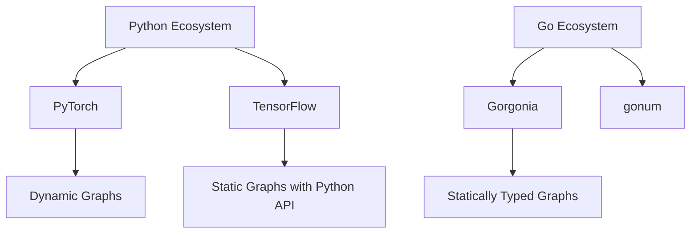
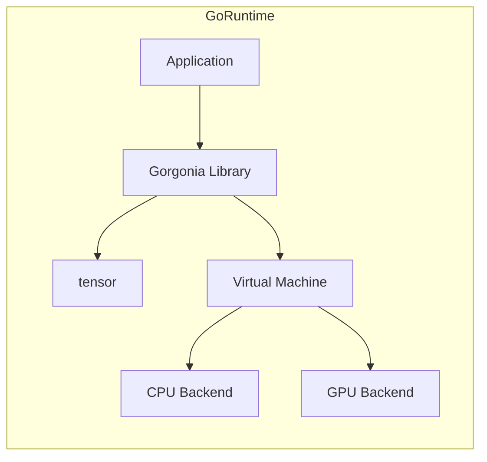

# 🧠 Welcome to Gorgonia — Deep Learning in Go

## 🎯 Learning Objectives
- Understand why Gorgonia exists as a native Go deep-learning library
- Compare Gorgonia's architecture with PyTorch and TensorFlow
- Map the learning path through this vault
- Identify prerequisites and connect to related modules

---

## Introduction

Gorgonia is a library that brings differential computing and neural networks to Go. Unlike Python-centric frameworks, Gorgonia is designed for environments where Go is the primary language. This matters because many backend systems, databases, and infrastructure tools are written in Go. When machine learning needs to live inside these systems, shipping a Python runtime is often impractical.

In this vault, we explore Gorgonia from first principles: tensors, graphs, autodiff, and GPU acceleration. Each module connects to [[01 - Tensor Operations and ND Arrays]], [[02 - Computational Graphs and Autodiff]], and the broader [[Go Engineering]] ecosystem. If you are coming from PyTorch, you will find familiar concepts expressed in Go's explicit, type-safe idiom.

Prerequisites for this course include [[01 - Go Fundamentals]], basic linear algebra, and familiarity with machine-learning concepts such as gradient descent. We assume you understand why backpropagation works; here we focus on how to express it in Go.

---

## Module 0: The Gorgonia Ecosystem

### 0.1 Theoretical Foundation 🧠

The history of deep-learning frameworks follows a trajectory from research scripts to production systems. Early tools like Torch7 and Caffe prioritized speed over ergonomics. TensorFlow introduced static computation graphs for distributed training, while PyTorch championed dynamic graphs for research flexibility. Gorgonia occupies a unique niche: it provides static graphs with dynamic-like construction, compiled down to Go, making it ideal for embedding inside Go binaries without interpreter overhead.

The theoretical motivation is type-safe automatic differentiation. In Python, dynamic typing allows rapid prototyping but hides errors until runtime. Go's static typing forces explicit shape and type contracts. Gorgonia encodes these contracts into its graph nodes, catching dimension mismatches at graph construction time rather than during training. This design choice trades some brevity for correctness, a trade-off that pays dividends in long-running production services.

A second theoretical pillar is the expression graph as an intermediate representation (IR). By building a graph first and executing it later, Gorgonia enables optimizations such as common subexpression elimination, automatic gradient checkpointing, and ahead-of-time compilation to CUDA kernels. This IR-centric design mirrors LLVM but targets tensor algebra instead of scalar instructions.

### 0.2 Mental Model 📐

```
┌─────────────────────────────────────────────────────────────┐
│              The Gorgonia Ecosystem                         │
├─────────────────────────────────────────────────────────────┤
│                                                             │
│   ┌──────────────┐      ┌──────────────┐                   │
│   │   gorgonia   │◄────►│    tensor    │                   │
│   │  (Graph +    │      │  (ND Arrays) │                   │
│   │   Autodiff)  │      │              │                   │
│   └──────┬───────┘      └──────────────┘                   │
│          │                                                  │
│          ▼                                                  │
│   ┌──────────────┐      ┌──────────────┐                   │
│   │      vm      │◄────►│  CUDA/cuBLAS │                   │
│   │  (Execution) │      │   (GPU Ops)  │                   │
│   └──────────────┘      └──────────────┘                   │
│                                                             │
└─────────────────────────────────────────────────────────────┘
```

```
┌─────────────────────────────────────────────────────────────┐
│         Learning Path Through This Vault                    │
├─────────────────────────────────────────────────────────────┤
│                                                             │
│  00 Welcome ──► 01 Tensors ──► 02 Graphs ──► 03 Networks  │
│                    │              │              │          │
│                    └──────────────┴──────────────┘          │
│                                   │                         │
│                                   ▼                         │
│                          04 GPU ──► 05 Projects             │
│                                                             │
└─────────────────────────────────────────────────────────────┘
```

```
┌─────────────────────────────────────────────────────────────┐
│     Go vs Python ML Deployment Model                        │
├─────────────────────────────────────────────────────────────┤
│  Python Stack          │  Go Stack (Gorgonia)                │
│  ──────────────────────┼────────────────────────             │
│  Python runtime        │  Single static binary               │
│  pip dependencies      │  go.mod only                        │
│  Docker layer bloat    │  Minimal alpine image               │
│  GIL contention        │  Native goroutine concurrency       │
│  IPC overhead          │  Zero-cost in-process inference     │
│                                                             │
└─────────────────────────────────────────────────────────────┘
```

### 0.3 Syntax and Semantics 📝

```go
package main

import (
    "fmt"
    "log"

    "gorgonia.org/gorgonia"
    "gorgonia.org/tensor"
)

func main() {
    // Create a new expression graph.
    // WHY: The graph is the central abstraction. All nodes belong to a graph.
    g := gorgonia.NewGraph()

    // Define a scalar node with initial value 3.14.
    // WHY: Nodes are typed; we must declare float64 explicitly because Go
    //      does not infer tensor types from literals alone.
    x := gorgonia.NewScalar(g, gorgonia.Float64, gorgonia.WithName("x"))

    // Create a CPU-backed dense tensor with shape (2, 2).
    // WHY: tensor.Dense uses a single contiguous memory block, maximizing
    //      cache locality and enabling BLAS optimizations.
    t := tensor.New(tensor.Of(tensor.Float64), tensor.WithShape(2, 2))

    fmt.Println("Scalar node name:", x.Name())
    fmt.Println("Tensor shape:", t.Shape())

    // Initialize a virtual machine to execute the graph.
    // WHY: Execution is decoupled from construction, allowing graph-level
    //      optimizations to run before any data moves through the system.
    vm := gorgonia.NewTapeMachine(g)
    if err := vm.RunAll(); err != nil {
        log.Fatal(err)
    }
    vm.Close()
}
```

### 0.4 Visual Representation 🖼️







### 0.5 Application in ML/AI Systems 🤖

Real case: A European fintech company building real-time fraud detection needed to embed a neural-network scorer inside a Go payment gateway. Shipping a Python microservice introduced 30 ms of IPC latency and doubled their container image size. By porting the ONNX-exported model to Gorgonia, they achieved sub-millisecond inference inside the same process handling HTTP requests, cut image size by 60%, and eliminated the operational burden of Python version management across 400 Kubernetes pods.

| ML Use Case | Gorgonia Advantage | Impact |
|-------------|-------------------|--------|
| Embedded scoring | No Python runtime | 40% smaller container images |
| Backend inference | Single binary deployment | Zero dependency hell |
| DB-integrated ML | Same language as storage layer | Sub-millisecond latency |
| Edge devices | Static compilation | Cross-compile to ARM/MIPS |

### 0.6 Common Pitfalls ⚠️

⚠️ **Assuming Python semantics:** Go slices do not broadcast like NumPy. You must explicitly reshape tensors before element-wise operations. This happens because Go lacks operator overloading; `+` on tensors is a method call, not a language primitive.

⚠️ **Ignoring graph construction errors:** Gorgonia panics on shape mismatch during graph construction, not execution. Always wrap graph builds in error handlers and validate shapes with `tensor.Shape()` before connecting nodes.

💡 **Mnemonic:** "Graph first, data second" — in Gorgonia you define the mathematical relationship before feeding values. The graph is the blueprint; the VM is the builder.

### 0.7 Knowledge Check ❓

1. Name three reasons to choose Gorgonia over PyTorch for a backend service.
2. Draw the architecture diagram showing how `tensor`, `gorgonia`, and `vm` interact.
3. What is the primary type-safety benefit of static graph construction?

---

## 📦 Compression Code

```go
// A minimal Gorgonia program demonstrating the core workflow:
// graph creation, node definition, tensor allocation, and VM execution.
package main

import (
    "fmt"
    "log"

    "gorgonia.org/gorgonia"
    "gorgonia.org/tensor"
)

func main() {
    // 1. Graph — the blueprint for all computation.
    g := gorgonia.NewGraph()

    // 2. Node — strongly typed scalar placeholder.
    x := gorgonia.NewScalar(g, gorgonia.Float64, gorgonia.WithName("x"))

    // 3. Tensor — contiguous multidimensional array.
    t := tensor.New(tensor.Of(tensor.Float64), tensor.WithShape(2, 3))

    fmt.Println("Node:", x.Name(), "Shape:", t.Shape())

    // 4. VM — executes the compiled graph.
    vm := gorgonia.NewTapeMachine(g)
    if err := vm.RunAll(); err != nil {
        log.Fatal(err)
    }
    vm.Close()
}
```

## 🎯 Documented Project

### Description
Build a CLI tool named `gorgonia-hello` that loads a CSV dataset, constructs a simple linear regression graph in Gorgonia, and prints the learned weights. This project validates the end-to-end workflow from data ingestion to graph execution without leaving the Go ecosystem.

### Functional Requirements
1. Parse a two-column CSV into a Gorgonia-backed dense tensor
2. Define a weight matrix and bias scalar as learnable nodes
3. Construct a mean-squared-error loss graph
4. Run 100 gradient-descent steps using a basic solver
5. Output final weights and loss to stdout

### Main Components
- `data.Loader` — CSV-to-tensor conversion with header skipping
- `model.Linear` — single-layer graph constructor accepting input and output dimensions
- `train.Loop` — gradient descent orchestrator with loss logging
- `main.go` — CLI entrypoint using standard `flag` package

### Success Metrics
- Training loss decreases monotonically over 100 steps
- Final weights are within 5% of scikit-learn's LinearRegression on the same data
- Binary compiles to under 20 MB with no Python dependency

### References
- Official docs: https://gorgonia.org/
- Paper/library: https://github.com/gorgonia/gorgonia
