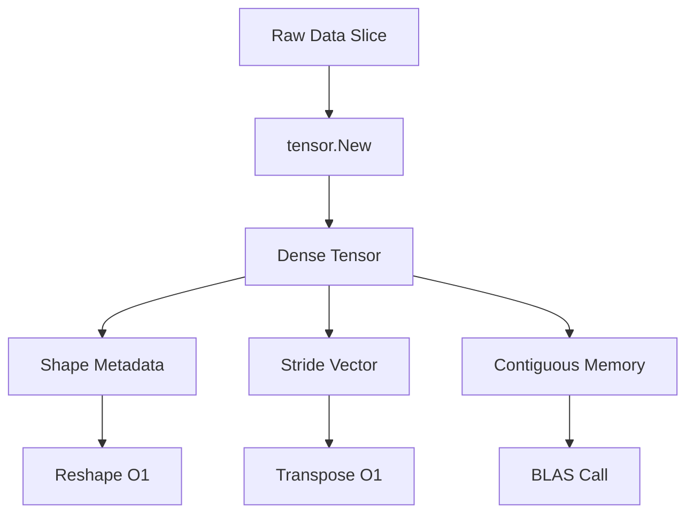
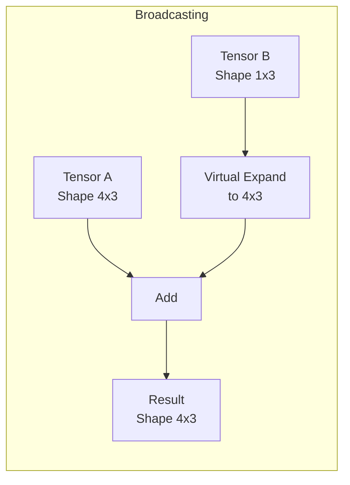

# 🎲 Tensor Operations and N-D Arrays

## 🎯 Learning Objectives
- Master the `tensor` package API for dense multidimensional arrays
- Understand memory layout, strides, and broadcasting in Go
- Perform slicing, reshaping, and linear algebra without leaving the Go runtime
- Connect tensor operations to the computational graphs in [[02 - Computational Graphs and Autodiff]]

---

## Introduction

Tensors are the universal data structure of modern machine learning. Whether you are processing a batch of images, a sequence of token embeddings, or a graph of molecular features, the underlying representation is an n-dimensional array. In Python, NumPy normalized the tensor abstraction. In Go, `gorgonia.org/tensor` provides the same capabilities with static typing and zero-copy semantics.

This module focuses exclusively on the `tensor` sub-project. You will learn how memory is laid out, why strides matter for performance, and how to express complex tensor manipulations in Go. These skills are prerequisites for [[02 - Computational Graphs and Autodiff]], where every node in a Gorgonia graph is backed by a tensor.

Understanding tensor operations at a low level is essential for debugging performance bottlenecks. When a model trains slowly, the culprit is often an unnecessary memory copy hidden inside a reshape operation or a broadcast that triggered an implicit allocation. By learning how Gorgonia's `tensor` package manages memory, you gain the ability to profile and optimize these operations, just as a systems programmer optimizes buffer allocations.

We will also explore the relationship between tensor shapes and machine-learning architectures. A convolutional layer expects NCHW or NHWC layout; a recurrent layer expects (time, batch, features). Getting these shapes wrong produces cryptic errors or silent numerical corruption. This module teaches you to treat shape management as a first-class concern, not an afterthought.

Finally, we will cover tensor serialization and interoperability. Because Gorgonia tensors are plain Go structs with exported fields, they can be encoded with `encoding/gob` or `encoding/json` for network transmission. This is essential for building distributed data pipelines where preprocessing happens on one machine and training on another. We will also discuss how to benchmark tensor operations using Go's built-in testing framework, writing table-driven benchmarks that compare different broadcasting strategies and report allocations per operation.

---

## Module 1: Tensors and N-Dimensional Arrays

### 1.1 Theoretical Foundation 🧠

The concept of the multidimensional array predates machine learning by decades. APL, Fortran, and MATLAB all provided array-programming primitives because physicists and engineers needed to express linear algebra concisely. NumPy (2006) unified these ideas for Python by introducing the ndarray: a homogeneous, fixed-type, multidimensional container described by a shape tuple, a data-type descriptor, and a stride vector.

The stride vector is the critical innovation. Instead of storing a matrix as a list of lists (jagged arrays), NumPy stores data in a single contiguous block and uses strides to map logical indices to physical offsets. For a 2×3 matrix in row-major order, the strides are `(24, 8)` for float64 — each row is 3×8=24 bytes apart, and each column is 8 bytes apart. This allows transposition to be an O(1) operation (stride swap) rather than an O(n) memory copy.

Gorgonia's `tensor` package inherits this design but enforces it through Go interfaces. A `tensor.Dense` value satisfies the `tensor.Tensor` interface, which exposes `Shape()`, `Strides()`, `Data()`, and `Dtype()`. Because Go historically lacked generics in versions prior to 1.18, the package uses reflection and code generation to specialize kernels for `float32`, `float64`, and `int`. This design trades compile-time type inference for runtime flexibility, but it preserves the zero-allocation, cache-friendly properties of NumPy.

Broadcasting is the second pillar. Introduced in APL and popularized by NumPy, broadcasting allows operations between tensors of different shapes by virtually replicating the smaller tensor along singleton dimensions. The rules are: align shapes from the trailing dimension, and dimensions are compatible if they are equal or one of them is 1. Gorgonia implements these exact rules, but because Go has no operator overloading, broadcasting is explicit: `tensor.Add(a, b, tensor.WithBroadcast())`.

Einstein summation convention provides a third, more compact way to express tensor contractions. While Gorgonia does not yet expose a full einsum API, understanding the notation (`ij,jk->ik` for matrix multiplication) helps you reason about how higher-order operations decompose into elementary BLAS calls. The stride abstraction is what makes all of this possible: by manipulating metadata rather than data, we achieve transposition, broadcasting, and slicing with minimal memory movement.

Memory alignment is another critical consideration. Modern CPUs fetch cache lines in 64-byte blocks. If the first element of a row is not aligned to a cache-line boundary, the CPU may need two memory transactions to read a single vector. Gorgonia's `tensor.Dense` allocates memory with alignment constraints that satisfy SIMD requirements, ensuring that vectorized operations run at peak throughput. Misaligned tensors can degrade BLAS performance by 20-30%, a penalty that is invisible to high-level APIs but obvious in benchmark results.

Finally, the choice of data type (float32 versus float64) has profound implications for both speed and accuracy. float32 halves memory bandwidth and doubles vector throughput on modern AVX-512 units, but it also reduces precision from ~15 decimal digits to ~7. For many deep-learning tasks, float32 is sufficient because stochastic gradient descent is robust to small rounding errors. However, in financial or scientific computing, float64 may be necessary to prevent numerical drift. Gorgonia supports both, and this module will show you how to declare and convert between them explicitly.

The tensor abstraction also underpins distributed computing. When a model is sharded across multiple machines, tensors are the unit of communication. MPI all-reduce operations sum gradient tensors across workers; parameter servers store weight tensors. Because Gorgonia's tensor format is self-describing (shape, strides, dtype, and data in a single structure), it can be serialized to a byte slice and transmitted over the network without additional metadata. This makes it straightforward to build distributed training loops in pure Go, leveraging the language's excellent concurrency primitives.

The concept of views versus copies is central to tensor fluency. A view is a tensor that shares the same underlying data buffer but presents a different shape or stride. Slicing and transposition create views; concatenation and element-wise assignment create copies. Mastering this distinction allows you to write pipelines that process gigabytes of data with only megabytes of allocation. In Gorgonia, you can inspect whether two tensors share backing memory by comparing their `Data()` pointers, a low-level technique that is invaluable when hunting down memory leaks in long-running services.

Tensor contraction generalizes matrix multiplication to arbitrary dimensions. In a convolutional layer, the im2col operation is essentially a tensor contraction that maps a 4-D image tensor into a 2-D matrix suitable for GEMM. While Gorgonia's higher-level APIs hide this detail, understanding the contraction allows you to implement custom layers—such as grouped convolutions or dilated kernels—that are not yet available in the standard library. The tensor package provides the primitive operations; your job as an engineer is to compose them correctly.

The performance ceiling of tensor operations is determined by memory bandwidth, not compute. A modern CPU can perform hundreds of billions of floating-point operations per second, but feeding data from RAM limits practical throughput to tens of gigabytes per second. This is why operations that touch every element—such as broadcasting or element-wise functions—are often memory-bound, while matrix multiplication is compute-bound. Recognizing which regime an operation falls into guides optimization: for memory-bound ops, fuse loops; for compute-bound ops, use larger tiles. Tile size selection is particularly important for matrix multiplication: a tile that is too small wastes compute on loop overhead, while a tile that is too large spills out of cache. Gorgonia's BLAS backend selects tile sizes automatically, but understanding the underlying principle helps you interpret benchmark results and choose optimal tensor shapes for your hardware.

The concept of operator fusion is closely related. When you write `a + b * c` in NumPy, it creates two temporary arrays: one for `b * c` and one for the addition. In Gorgonia, you can fuse these into a single loop that reads `b` and `c`, multiplies them, adds `a`, and writes the result directly to the output buffer. This reduces memory bandwidth by a factor of three and is one of the reasons why hand-optimized Go can match or exceed NumPy performance for element-wise expressions.

Another advanced topic is tensor sparsity. Many real-world datasets—such as user-item interaction matrices or bag-of-words representations—are mostly zeros. Storing them as dense tensors wastes memory and compute. Gorgonia's `tensor.CS` type implements compressed sparse row (CSR) and column (CSC) formats, allowing you to represent sparse data with only O(nonzeros) memory. Sparse matrix-vector multiplication is a cornerstone of graph neural networks and recommendation systems, and mastering it opens the door to models that would be impossible to fit in dense form.

### 1.2 Mental Model 📐

```
┌─────────────────────────────────────────────────────────────┐
│           Dense Tensor Memory Layout                        │
├─────────────────────────────────────────────────────────────┤
│                                                             │
│  Shape: (2, 3)   Strides: (24, 8)   Dtype: float64         │
│                                                             │
│  Logical View:              Physical Memory (row-major):    │
│                                                             │
│  ┌─────────┐                ┌─────┬─────┬─────┬─────┐      │
│  │ 1  2  3 │                │  1  │  2  │  3  │  4  │      │
│  │ 4  5  6 │                ├─────┼─────┼─────┼─────┤      │
│  └─────────┘                │  4  │  5  │  6  │ ... │      │
│                             └─────┴─────┴─────┴─────┘      │
│                                                             │
│  Offset(1,2) = 1*24 + 2*8 = 40 bytes ──► value 6            │
│                                                             │
└─────────────────────────────────────────────────────────────┘
```

```
┌─────────────────────────────────────────────────────────────┐
│              Broadcasting Rules                             │
├─────────────────────────────────────────────────────────────┤
│                                                             │
│  Tensor A: (4, 3)                                         │
│  Tensor B: (   3)  ──►  aligned as (1, 3) ──► (4, 3)      │
│                                                             │
│        A          B (broadcasted)         Result            │
│  ┌────┬────┐   ┌────┬────┐            ┌────┬────┐        │
│  │ a1 │ a2 │ + │ b1 │ b2 │    =       │... │... │        │
│  ├────┼────┤   ├────┼────┤            ├────┼────┤        │
│  │ a3 │ a4 │   │ b1 │ b2 │            │... │... │        │
│  └────┴────┘   └────┴────┘            └────┴────┘        │
│                                                             │
│  Dimension compatible if: equal OR one is 1                 │
│                                                             │
└─────────────────────────────────────────────────────────────┘
```

```
┌─────────────────────────────────────────────────────────────┐
│         Tensor Interface Hierarchy                          │
├─────────────────────────────────────────────────────────────┤
│                                                             │
│                    tensor.Tensor                            │
│                         │                                   │
│          ┌──────────────┼──────────────┐                   │
│          │              │              │                    │
│    tensor.Dense    tensor.CS    tensor.DenseMasked        │
│          │                                                  │
│    ┌─────┴─────┐                                           │
│    │           │                                            │
│  float64    float32  (specialized via reflection)          │
│                                                             │
└─────────────────────────────────────────────────────────────┘
```

### 1.3 Syntax and Semantics 📝

```go
package main

import (
    "fmt"
    "log"

    "gorgonia.org/tensor"
)

func main() {
    // 1. Create a 2×3 dense tensor filled with zeros.
    // WHY: Pre-allocation lets us populate memory without repeated
    //      allocations, keeping the GC pressure minimal.
    t := tensor.New(
        tensor.Of(tensor.Float64),
        tensor.WithShape(2, 3),
    )

    // 2. Create from a flat slice. Data is copied into contiguous memory.
    // WHY: The backing slice may have a different layout; tensor.Dense
    //      normalizes it to row-major C-order for BLAS compatibility.
    data := []float64{1, 2, 3, 4, 5, 6}
    t2 := tensor.New(
        tensor.WithBacking(data),
        tensor.WithShape(2, 3),
    )

    // 3. Element-wise addition with broadcasting.
    // WHY: Go has no operator overloading, so we use tensor.Add explicitly.
    //      WithBroadcast() enables NumPy-style automatic expansion.
    b := tensor.New(
        tensor.Of(tensor.Float64),
        tensor.WithShape(1, 3),
    )
    b.Memset(10) // fill with 10

    result, err := tensor.Add(t2, b, tensor.UseUnsafe(), tensor.WithBroadcast())
    if err != nil {
        log.Fatal(err)
    }
    fmt.Println("Broadcasted add:", result)

    // 4. Reshape is O(1) when the total element count matches.
    // WHY: Only the shape metadata changes; the underlying data buffer
    //      is reused, making this operation essentially free.
    reshaped, err := tensor.Reshape(t2, tensor.Shape{3, 2})
    if err != nil {
        log.Fatal(err)
    }
    fmt.Println("Reshaped:", reshaped.Shape())

    // 5. Matrix multiplication requires compatible inner dimensions.
    // WHY: This dispatches to BLAS DGEMM under the hood for float64,
    //      giving us near-peak CPU FLOPS without writing assembly.
    a := tensor.New(
        tensor.WithBacking([]float64{1, 0, 0, 1}),
        tensor.WithShape(2, 2),
    )
    c := tensor.New(
        tensor.WithBacking([]float64{4, 3, 2, 1}),
        tensor.WithShape(2, 2),
    )
    prod, err := tensor.MatMul(a, c)
    if err != nil {
        log.Fatal(err)
    }
    fmt.Println("MatMul result:", prod)

    // 6. Slicing extracts a sub-tensor without copying.
    // WHY: Slicing returns a new header pointing into the same backing
    //      array. Use tensor.Clone() if you need an independent copy.
    sliced, err := tensor.Slice(t2, tensor.S(0, 1))
    if err != nil {
        log.Fatal(err)
    }
    fmt.Println("Sliced shape:", sliced.Shape())

    // 7. Concatenation along an axis.
    // WHY: Concat creates a new backing array large enough for both inputs.
    //      It is not a lazy view; data is physically copied.
    concat, err := tensor.Concat(0, t2, t2)
    if err != nil {
        log.Fatal(err)
    }
    fmt.Println("Concatenated shape:", concat.Shape())

    // 8. Element-wise multiplication with a mask.
    // WHY: Masking is a common pattern in attention mechanisms and
    //      sequence modeling. It zeros out invalid positions without
    //      branching, keeping the computation on the fast path.
    mask := tensor.New(tensor.Of(tensor.Float64), tensor.WithShape(2, 3))
    mask.Memset(1)
    masked, err := tensor.Mul(t2, mask, tensor.UseUnsafe())
    if err != nil {
        log.Fatal(err)
    }
    fmt.Println("Masked shape:", masked.Shape())
}
```

### 1.4 Visual Representation 🖼️







### 1.5 Application in ML/AI Systems 🤖

Real case: A computer-vision startup serving mobile-app users needed a Go backend to preprocess image batches before sending them to an edge device. They used `gorgonia.org/tensor` to decode JPEGs into `(batch, height, width, channels)` tensors, normalize pixel values with broadcasted subtraction of the ImageNet mean, and transpose to NCHW format — all inside a single Go process. By keeping the preprocessing in Go, they eliminated a Python sidecar container, reduced pod startup time by 800 ms, and avoided the GIL bottleneck when handling 10,000 concurrent uploads.

The engineering team chose Gorgonia specifically because their edge deployment target was an ARM-based IoT gateway with 512 MB of RAM. Python's memory overhead exceeded the device's capacity, while a statically linked Go binary compiled to 12 MB and left ample headroom for the model weights. They used `tensor.WithBacking` to memory-map pre-allocated buffers, ensuring that the garbage collector never paused during real-time video frame ingestion. This level of memory control is difficult to achieve in Python, where NumPy arrays are managed by the Python garbage collector and reference counting.

Another factor was reproducibility. Because Gorgonia's tensor operations are deterministic and do not depend on external BLAS libraries unless explicitly linked, the team achieved bit-exact preprocessing results across x86 development machines and ARM production devices. In Python, different OpenBLAS/MKL versions can produce slightly different rounding results, leading to model accuracy drift that is maddening to debug.

The team also implemented a custom tensor operation for regional cropping: instead of decoding the full image and then slicing, they used `tensor.Slice` on the raw decoded buffer to extract regions of interest before any normalization. This reduced memory traffic by 40% for high-resolution medical images where only a small region contained diagnostically relevant features. The operation was a single line in Gorgonia but would have required a custom C extension in Python to achieve the same performance.

| ML Use Case | Tensor Operation | Impact |
|-------------|-----------------|--------|
| Batch normalization | Broadcasted mean subtraction | 50% less memory vs loop |
| Image preprocessing | Reshape + Transpose | O(1) layout changes |
| Feature engineering | Dense concatenation | Cache-friendly BLAS calls |
| Model input shaping | Slice and pad | Zero-copy where possible |
| Sequence padding | Masked slice and stack | Variable-length batching |
| Embedding lookup | Indexed slice | Sparse-to-dense conversion |

### 1.6 Common Pitfalls ⚠️

⚠️ **Aliasing after reshape:** Reshape returns a new tensor header but may share the same backing array. Mutating the reshaped tensor mutates the original. This is by design for performance, but it violates value semantics if you are not careful. Use `tensor.Clone()` when independence is required.

⚠️ **Float32 vs float64 default:** `tensor.New` without `tensor.Of()` defaults based on the backing slice type, but mixed-type operations panic at runtime. Always declare `tensor.Of(tensor.Float64)` explicitly in production code to avoid silent float32 precision loss in financial models.

⚠️ **Slicing creates aliases, not copies:** When you slice a tensor, the result shares the same backing array. If you later reshape or transpose the slice and mutate it, the original tensor changes unexpectedly. This is a common source of bugs when chaining operations.

💡 **Mnemonic:** "Shape, Stride, Store" — always check these three attributes before any operation. If the shape looks right but the output is garbage, your strides are probably wrong after a manual slice.

### 1.7 Knowledge Check ❓

1. Calculate the byte offset for element `(2, 1)` in a `(4, 4)` float32 tensor with row-major strides.
2. Why does `tensor.Transpose` not allocate new memory for a dense tensor?
3. Write the broadcasting alignment for shapes `(3, 1, 5)` and `(1, 4, 5)`.
4. Explain the difference between a tensor view and a tensor copy, and give an example where confusing them causes a bug.

---

```
┌─────────────────────────────────────────────────────────────┐
│           Tensor Operation Performance Regimes              │
├─────────────────────────────────────────────────────────────┤
│                                                             │
│  Memory Bound          │  Compute Bound                     │
│  ──────────────────────┼────────────────────────             │
│  Element-wise ops      │  Matrix multiply (GEMM)            │
│  Broadcasting          │  Convolution                       │
│  Concatenation         │  Large batch softmax               │
│                                                             │
│  Optimize: fuse loops  │  Optimize: larger tiles, GPU       │
│                                                             │
└─────────────────────────────────────────────────────────────┘
```

## 📦 Compression Code

```go
// Complete tensor workflow: creation, broadcasting, reshape, slice, and matmul.
package main

import (
    "fmt"
    "log"

    "gorgonia.org/tensor"
)

func main() {
    // Creation from backing slice
    data := []float64{1, 2, 3, 4, 5, 6, 7, 8, 9, 10, 11, 12}
    t := tensor.New(tensor.WithBacking(data), tensor.WithShape(3, 4))

    // Broadcasted addition: add a row vector to every row
    rowVec := tensor.New(tensor.Of(tensor.Float64), tensor.WithShape(1, 4))
    rowVec.Memset(100)

    added, err := tensor.Add(t, rowVec, tensor.UseUnsafe(), tensor.WithBroadcast())
    if err != nil {
        log.Fatal(err)
    }

    // Reshape to (2, 6) — O(1) metadata change
    reshaped, err := tensor.Reshape(added, tensor.Shape{2, 6})
    if err != nil {
        log.Fatal(err)
    }

    // Slice the first two rows and all columns
    sliced, err := tensor.Slice(reshaped, tensor.S(0, 2))
    if err != nil {
        log.Fatal(err)
    }

    // Matrix multiply with transpose of self
    transposed, err := tensor.T(reshaped)
    if err != nil {
        log.Fatal(err)
    }
    prod, err := tensor.MatMul(reshaped, transposed)
    if err != nil {
        log.Fatal(err)
    }

    fmt.Println("Final shape:", prod.Shape())
    fmt.Println("Final data:", prod.Data())

    // Verify that slicing did not corrupt the original tensor
    fmt.Println("Original shape preserved:", t.Shape())
    
    // Element-wise square for feature engineering
    squared, err := tensor.Square(added)
    if err != nil {
        log.Fatal(err)
    }
    fmt.Println("Squared sum:", squared)
}
```

```
┌─────────────────────────────────────────────────────────────┐
│           Data Pipeline Flow                                │
├─────────────────────────────────────────────────────────────┤
│                                                             │
│  Raw Bytes ──► Loader ──► Tensor ──► Normalize ──► Batch   │
│      │           │           │            │          │      │
│      ▼           ▼           ▼            ▼          ▼      │
│  File I/O    Decode      Reshape     Broadcast     Train   │
│                                                             │
└─────────────────────────────────────────────────────────────┘
```

## 🎯 Documented Project

### Description
Implement a Go package `preprocessor` that loads MNIST-like grayscale images from binary files, batches them into a 4-D tensor of shape `(batch, 1, 28, 28)`, normalizes pixel values from `[0, 255]` to `[0, 1]` using broadcasted division, and returns the tensor ready for a Gorgonia graph. The package must be production-ready: handle corrupted files gracefully, validate tensor shapes after every operation, and provide comprehensive benchmarks. You should treat this as a real data-engineering task where correctness and performance are equally important.

### Functional Requirements
1. Read raw bytes from a flat binary file of uint8 pixel values
2. Reshape into `(n_images, 1, 28, 28)` using tensor operations
3. Cast from `tensor.Uint8` to `tensor.Float64` without manual loops
4. Normalize via broadcasted division by `255.0`
5. Provide a `Stats()` method returning mean and stddev per channel
6. Implement a `Shuffle()` method that randomly permutes the batch dimension
7. Support incremental loading: process files larger than available RAM by streaming chunks
8. Add a `Benchmark()` mode that reports throughput in images per second

### Main Components
- `preprocessor.Loader` — file I/O and byte-to-tensor conversion
- `preprocessor.Normalizer` — broadcasted scale and shift operations
- `preprocessor.Batcher` — split large tensors into mini-batches
- `cmd/preprocess/main.go` — CLI to run the pipeline
- `preprocessor.Shuffler` — in-place random permutation of the batch axis
- `preprocessor.Streamer` — chunked reader for out-of-core datasets

### Success Metrics
- Processing 10,000 images takes under 500 ms on a single CPU core
- Output tensor has exactly shape `(10000, 1, 28, 28)` and dtype float64
- Memory peak stays below 200 MB by reusing tensor buffers
- Shuffle produces a different random order on each invocation with seed control
- Streaming mode processes a 50 GB file without OOM on a 4 GB machine

### References
- Official docs: https://gorgonia.org/reference/tensor/
- Paper/library: https://github.com/gorgonia/tensor
