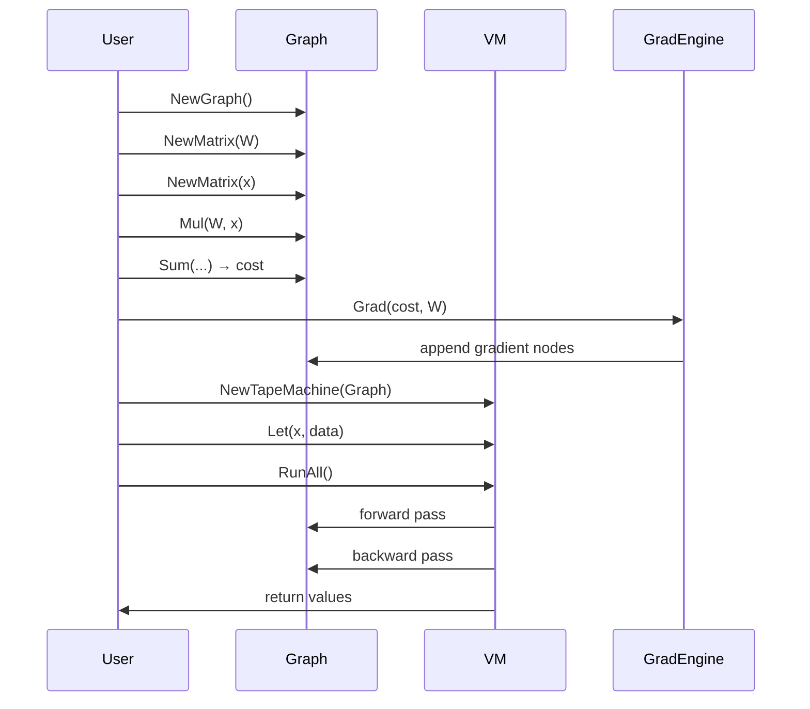
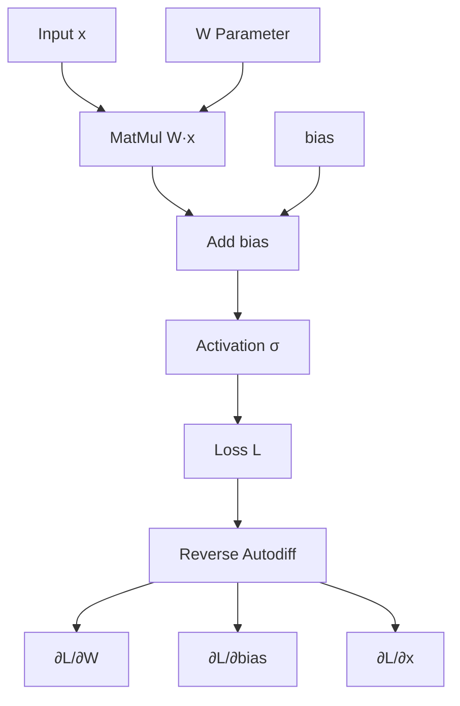

# 🕸️ Computational Graphs and Autodiff

## 🎯 Learning Objectives
- Construct expression graphs using `gorgonia.org/gorgonia`
- Understand reverse-mode automatic differentiation via the chain rule
- Execute graphs with the TapeMachine and manage values with `Let`
- Debug graph construction errors before runtime

---

## Introduction

Automatic differentiation (autodiff) is the engine that makes deep learning possible. Without it, computing gradients by hand for networks with millions of parameters would be impossible. Gorgonia implements autodiff through an expression graph: a directed acyclic graph (DAG) where nodes represent variables, constants, and operations, and edges represent data flow.

In this module, you will learn how to build these graphs explicitly in Go. Unlike PyTorch, where graphs are built implicitly as you call functions on tensors, Gorgonia requires you to declare the graph first. This explicitness is a feature: it catches shape and type errors at construction time and enables aggressive optimizations before execution. You should already be comfortable with [[01 - Tensor Operations and ND Arrays]] before proceeding.

The explicit graph construction mirrors the practice of writing SQL queries: you declare what you want before executing it. This declarative style allows the system to reorder operations, fuse kernels, and eliminate redundant computation. In Gorgonia, this means that a sequence of element-wise operations might be compiled into a single loop, reducing memory bandwidth by a factor equal to the number of fused operations.

We will also cover the difference between symbolic and imperative gradients. PyTorch builds a dynamic tape during the forward pass; Gorgonia builds a static tape during graph construction. Both implement reverse-mode autodiff, but the static approach allows you to inspect the gradient graph before execution, a powerful debugging capability when training diverges.

---

## Module 2: Computational Graphs and Automatic Differentiation

### 2.1 Theoretical Foundation 🧠

The theoretical basis for modern autodiff was laid by Robert Edwin Wengert in 1964, who described how to decompose any differentiable function into a sequence of elementary operations and apply the chain rule systematically. This decomposition produces a Wengert list, today called a trace or tape. Each entry in the tape records an operation, its inputs, and its output. By traversing this tape backward and applying the chain rule at each step, we obtain the gradient of the final output with respect to every intermediate variable.

Reverse-mode autodiff is particularly efficient for machine learning because it computes the full gradient vector in a single backward pass. For a scalar loss L and parameters θ₁…θₙ, reverse mode costs roughly one forward evaluation plus one backward evaluation, regardless of n. This is in contrast to forward mode, which requires n passes. The trade-off is memory: reverse mode must store all intermediate activations (or recompute them via checkpointing) to evaluate gradients during the backward sweep.

Gorgonia's graph is a direct implementation of this theory. When you write `z = gorgonia.Must(gorgonia.Add(x, y))`, you are appending an addition node to the Wengert list. When you later call `gorgonia.Grad(cost, w1, w2)`, Gorgonia traverses the graph in reverse topological order, applying the chain rule via symbolic differentiation rules encoded in each operator's `Diff` method. The result is a new set of nodes representing ∂cost/∂w1 and ∂cost/∂w2, which can themselves be fed into an optimization step.

The design motivation for static graphs in Go is twofold. First, Go's concurrency model (goroutines and channels) pairs naturally with graph-level parallelism: independent subgraphs can be scheduled on different goroutines. Second, static graphs allow ahead-of-time shape inference. When you construct `gorgonia.MatMul(A, B)`, Gorgonia immediately validates that the inner dimensions match and panics if they do not. In PyTorch, this error would surface only when the line executes during training, potentially hours into a script.

Another advantage of static graphs is serialization. Because the graph is a data structure independent of the code that created it, you can serialize the graph to a file, load it on another machine, and execute it without the original source code. This is impossible with PyTorch's dynamic tape, which exists only ephemerally during the forward pass. For regulatory and safety-critical applications, the ability to archive the exact computation graph is invaluable.

Finally, static graphs enable ahead-of-time differentiation. In Gorgonia, the gradient graph is constructed once and then reused for every training step. In PyTorch, the tape is rebuilt on every forward pass. While PyTorch's overhead is small for large graphs, it becomes significant for small models run inside tight loops, such as in reinforcement learning or Bayesian optimization. Gorgonia's static approach amortizes the graph construction cost over millions of iterations.

Symbolic inspection of the gradient graph is a powerful debugging tool. When a model fails to learn, you can print the gradient nodes and verify that gradients flow to every parameter. If a gradient node is missing, it means the corresponding parameter is not connected to the loss—either because of a graph construction error or because the operation's differentiation rule is incomplete. This explicit visibility is impossible in PyTorch, where the tape is an internal C++ data structure opaque to the user.

We will also discuss memory management in long-running graphs. Because Gorgonia nodes hold references to their backing tensors, circular dependencies or leaked VMs can cause memory growth over time. Learning to explicitly close virtual machines and release graph nodes is as important as constructing them correctly. We will also explore how to visualize graphs for debugging, exporting the expression graph to Graphviz DOT format to inspect node connections and shapes before execution.

Graph-level optimization is the third advantage. Gorgonia's VM performs constant folding, common subexpression elimination, and dead-code elimination before execution. If you compute both the forward pass and the gradient of a shared intermediate node, Gorgonia will evaluate that node once and reuse the result. In PyTorch, the same node may be recomputed during the backward pass unless you explicitly cache it with `detach()` or ` retain_graph()`. These optimizations can reduce the computational cost of training by 10-20% for networks with shared branches.

Another subtle benefit of static graphs is deterministic execution order. In PyTorch, the order of backward operations depends on the Python call stack and can vary between runs if threads are involved. Gorgonia compiles the graph to a linear tape with a fixed schedule, guaranteeing that the same graph always executes the same sequence of kernels. This determinism is critical for debugging numerical discrepancies and for regulatory environments that require reproducible results. Reproducibility extends to random number generation. In Gorgonia, random initializers accept an explicit seed, ensuring that weight matrices are identical across runs. This is essential for debugging training divergence: if the loss curve changes between runs with the same seed, the bug is in the graph construction, not the data.

Gradient checkpointing is a memory optimization technique that trades computation for storage. Instead of retaining all intermediate activations for the backward pass, you retain only a subset and recompute the rest on demand. This can reduce memory usage by 50-70% in deep networks, enabling larger batch sizes or deeper models. Gorgonia supports checkpointing by allowing you to mark specific nodes as persistent and recomputing others via a second forward pass during backpropagation.

Another theoretical consideration is higher-order gradients. While standard backpropagation computes first-order derivatives, some meta-learning algorithms require second-order derivatives (Hessians). Gorgonia's graph structure supports this naturally: because gradients are themselves nodes in the graph, you can call `gorgonia.Grad` on a gradient node to obtain a second derivative. This capability, while computationally expensive, enables advanced optimization techniques such as Newton's method and MAML.

### 2.2 Mental Model 📐

```
┌─────────────────────────────────────────────────────────────┐
│           Expression Graph as a Wengert List                │
├─────────────────────────────────────────────────────────────┤
│                                                             │
│  Forward Trace:                                             │
│  ─────────────────────────────────────────────────────────  │
│  v0 = x        (input)                                      │
│  v1 = W        (parameter)                                  │
│  v2 = matmul(v1, v0)   ──► shape inferred immediately      │
│  v3 = add(v2, b)                                            │
│  v4 = sigmoid(v3)    ──► output                             │
│                                                             │
│  Backward Trace:                                            │
│  ─────────────────────────────────────────────────────────  │
│  dv4 = 1                                                    │
│  dv3 = dv4 * sigmoid'(v3)                                   │
│  dv2 = dv3                                                  │
│  dW  = dv2 * v0^T      ──► gradient node created            │
│  db  = dv3                                                  │
│                                                             │
└─────────────────────────────────────────────────────────────┘
```

```
┌─────────────────────────────────────────────────────────────┐
│           Graph Node Lifecycle                              │
├─────────────────────────────────────────────────────────────┤
│                                                             │
│   Define ──► Build ──► Compile ──► Execute ──► Update      │
│      │          │           │            │           │      │
│      ▼          ▼           ▼            ▼           ▼      │
│   NewGraph   Connect    VM.RunAll     Read       Let()      │
│   NewMatrix  Ops        forward       Values     new value  │
│              Check      backward      from       for next   │
│              shapes     pass          nodes      iteration  │
│                                                             │
└─────────────────────────────────────────────────────────────┘
```

```
┌─────────────────────────────────────────────────────────────┐
│        Chain Rule in a Computational Graph                  │
├─────────────────────────────────────────────────────────────┤
│                                                             │
│        z = f(y)      y = g(x)      x = h(w)               │
│                                                             │
│        ∂z/∂w = ∂z/∂y * ∂y/∂x * ∂x/∂w                      │
│                                                             │
│        Each edge carries a local Jacobian.                  │
│        Reverse traversal multiplies Jacobians               │
│        along paths from output to parameter.                │
│                                                             │
└─────────────────────────────────────────────────────────────┘
```

### 2.3 Syntax and Semantics 📝

```go
package main

import (
    "fmt"
    "log"

    "gorgonia.org/gorgonia"
    "gorgonia.org/tensor"
)

func main() {
    // 1. Create the expression graph.
    // WHY: Every node belongs to exactly one graph. This encapsulation
    //      prevents accidental cross-graph references and enables
    //      independent optimization passes per graph.
    g := gorgonia.NewGraph()

    // 2. Declare a learnable matrix variable.
    // WHY: gorgonia.NewMatrix creates a node with an associated value.
    //      The shape (2, 3) is validated immediately against the tensor.
    wTensor := tensor.New(
        tensor.Of(tensor.Float64),
        tensor.WithShape(2, 3),
    )
    wTensor.Memset(0.5) // initialize uniformly

    w := gorgonia.NewMatrix(
        g,
        wTensor,
        gorgonia.WithName("W"),
    )

    // 3. Declare an input placeholder.
    // WHY: Placeholders hold data that changes each iteration.
    //      We use Let() later to bind actual values without rebuilding
    //      the graph structure.
    x := gorgonia.NewMatrix(
        g,
        tensor.New(tensor.Of(tensor.Float64), tensor.WithShape(3, 1)),
        gorgonia.WithName("x"),
    )

    // 4. Build the expression: y = W @ x
    // WHY: Must() panics on error. In production, use the two-value
    //      return form to handle shape mismatches gracefully.
    y := gorgonia.Must(gorgonia.Mul(w, x))

    // 5. Define a scalar cost node.
    cost := gorgonia.Must(gorgonia.Sum(y))

    // 6. Compute gradients via reverse-mode autodiff.
    // WHY: Grad() constructs new nodes representing partial derivatives.
    //      These nodes are part of the same graph and can be executed
    //      by the same VM in a subsequent RunAll() call.
    grads, err := gorgonia.Grad(cost, w)
    if err != nil {
        log.Fatal(err)
    }

    // 7. Create a VM and bind data.
    // WHY: Let() mutates the node's bound value in-place. This is far
    //      cheaper than reconstructing the graph for every minibatch.
    vm := gorgonia.NewTapeMachine(g)
    gorgonia.Let(x, tensor.New(
        tensor.WithBacking([]float64{1, 2, 3}),
        tensor.WithShape(3, 1),
    ))

    // 8. Execute forward and backward passes.
    if err := vm.RunAll(); err != nil {
        log.Fatal(err)
    }

    fmt.Println("Cost:", cost.Value())
    fmt.Println("dW:", grads[0].Value())

    // 9. Inspect gradient graph structure for debugging.
    // WHY: In static frameworks, you can print and analyze the gradient
    //      nodes before execution, catching disconnected parameters early.
    for i, g := range grads {
        fmt.Printf("Grad %d shape: %v\n", i, g.Shape())
    }

    vm.Close()
}
```

### 2.4 Visual Representation 🖼️







### 2.5 Application in ML/AI Systems 🤖

Real case: A healthcare analytics firm needed to train a logistic regression model on patient data inside a HIPAA-compliant Go microservice. They could not export data to a Python training cluster. Using Gorgonia, they built a computational graph representing the log-loss over 50 clinical features, computed gradients with `gorgonia.Grad`, and ran stochastic gradient descent entirely inside the Go service. The graph construction validated that no feature tensor had an unexpected nil dimension (a common data-pipeline bug), and the static graph allowed them to snapshot the exact training computation for regulatory audit trails.

The firm chose Gorgonia because their existing Go service already handled patient authentication, encryption, and audit logging. Introducing a Python training process would have required a separate container, a network boundary, and complex data-sanitization protocols to maintain compliance. By keeping the training loop in Go, they reused the existing security infrastructure and avoided the risk of data leakage across process boundaries.

The static graph also enabled a novel debugging workflow. When the model's validation accuracy plateaued, the engineering team printed the gradient graph and discovered that one feature's gradient was exactly zero due to a preprocessing bug that clamped negative values. In a dynamic framework, tracing this issue would have required intrusive logging inside the training loop. In Gorgonia, inspecting the graph nodes revealed the problem immediately.

They also leveraged graph serialization for audit compliance. By marshaling the graph to a binary file after construction, they created an immutable record of the exact mathematical operations used for training. Regulators could load this file independently and verify that no unauthorized transformations were applied to the patient data. This level of transparency would be impossible with a dynamic tape that exists only transiently in memory.

| ML Use Case | Graph Concept | Impact |
|-------------|--------------|--------|
| Fraud model retraining | Static graph + Grad | Auditable, reproducible training |
| Reinforcement learning | Expression graph for policy loss | Single-binary deployment to edge |
| Bayesian optimization | Autodiff for acquisition gradient | No Python RPC latency |
| Physics simulation | Static graph for force gradients | Reproducible experiments |
| Portfolio optimization | Grad of risk metric | Real-time rebalancing |

### 2.6 Common Pitfalls ⚠️

⚠️ **Using Must() in production without recovery:** `gorgonia.Must` panics on any shape or type error. In long-running services, always use the error-returning variant and log the graph state for debugging.

⚠️ **Forgetting to close the VM:** `TapeMachine` holds references to CUDA contexts and goroutine pools. Failing to call `vm.Close()` leaks resources, especially in iterative training loops where a new VM is created per epoch.

⚠️ **Gradient accumulation without zeroing:** In iterative training, if you reuse the same gradient nodes across minibatches without clearing their values, gradients from the previous batch leak into the current batch. Always reconstruct the VM or explicitly reset gradient values between iterations.

💡 **Mnemonic:** "Let before Run" — always bind your placeholder values with `Let()` before calling `vm.RunAll()`. If a node has no bound value, the VM panics because it cannot execute an undefined input.

### 2.7 Knowledge Check ❓

1. Why does reverse-mode autodiff require storing intermediate activations?
2. What is the difference between `NewMatrix` (with backing data) and a placeholder node that receives data via `Let()`?
3. Trace the chain rule for `z = sin(x²)` and show how Gorgonia would build the gradient nodes.
4. Why is graph serialization valuable for regulatory compliance?

---

```
┌─────────────────────────────────────────────────────────────┐
│           Graph Optimization Pipeline                       │
├─────────────────────────────────────────────────────────────┤
│                                                             │
│  Raw Graph ──► Constant Fold ──► CSE ──► Dead Code Elim    │
│      │              │               │            │          │
│      ▼              ▼               ▼            ▼          │
│  User nodes    Simplified      Shared      Leaner         │
│                expressions     nodes       graph            │
│                                                             │
└─────────────────────────────────────────────────────────────┘
```

## 📦 Compression Code

```go
// Full autodiff workflow: graph construction, gradient computation,
// placeholder binding, and VM execution.
package main

import (
    "fmt"
    "log"

    "gorgonia.org/gorgonia"
    "gorgonia.org/tensor"
)

func main() {
    g := gorgonia.NewGraph()

    // Parameter matrix 2×3
    wVal := tensor.New(tensor.Of(tensor.Float64), tensor.WithShape(2, 3))
    wVal.Memset(0.1)
    w := gorgonia.NewMatrix(g, wVal, gorgonia.WithName("W"))

    // Input placeholder 3×1
    x := gorgonia.NewMatrix(g,
        tensor.New(tensor.Of(tensor.Float64), tensor.WithShape(3, 1)),
        gorgonia.WithName("x"),
    )

    // Forward: y = W @ x, cost = sum(y)
    y := gorgonia.Must(gorgonia.Mul(w, x))
    cost := gorgonia.Must(gorgonia.Sum(y))

    // Backward
    grads, err := gorgonia.Grad(cost, w)
    if err != nil {
        log.Fatal(err)
    }

    // VM execution
    vm := gorgonia.NewTapeMachine(g)
    gorgonia.Let(x, tensor.New(
        tensor.WithBacking([]float64{1, 2, 3}),
        tensor.WithShape(3, 1),
    ))

    if err := vm.RunAll(); err != nil {
        log.Fatal(err)
    }

    fmt.Println("Cost:", cost.Value())
    fmt.Println("Gradient shape:", grads[0].Shape())

    // Debugging: print gradient shapes to verify flow
    for i, g := range grads {
        fmt.Printf("Grad %d: %v\n", i, g.Shape())
    }

    vm.Close()
}
```

```
┌─────────────────────────────────────────────────────────────┐
│           Gradient Flow Inspection                          │
├─────────────────────────────────────────────────────────────┤
│                                                             │
│  Loss ──► Grad(W2) ──► Grad(b2) ──► Grad(W1) ──► Grad(b1) │
│    │          │            │            │            │      │
│    ▼          ▼            ▼            ▼            ▼      │
│  Node      Matrix      Vector      Matrix      Vector      │
│                                                             │
│  Check: no nil gradients, shapes match parameters          │
│                                                             │
└─────────────────────────────────────────────────────────────┘
```

## 🎯 Documented Project

### Description
Implement a binary classifier training pipeline in pure Go using Gorgonia. The project reads a tabular dataset, constructs a logistic regression graph, trains for a fixed number of epochs using manual gradient descent, and exports the final weights to a JSON file. The pipeline must be fully reproducible: given the same random seed and dataset, it should produce identical weights on every run. This requires careful handling of graph construction order and deterministic tensor initialization.

### Functional Requirements
1. Load a CSV with features and a binary label column
2. Construct a graph with weight matrix `W`, bias `b`, sigmoid activation, and cross-entropy loss
3. Compute gradients with `gorgonia.Grad` for `W` and `b`
4. Implement a training loop that updates parameters via `Let()` and `vm.RunAll()`
5. Serialize learned `W` and `b` to JSON after convergence
6. Log training loss and validation accuracy after every epoch
7. Support early stopping when validation loss does not improve for 10 epochs
8. Include a `predict` subcommand that loads the JSON weights and runs inference on new data

### Main Components
- `dataset.CSVLoader` — parses CSV into feature and label tensors
- `model.LogisticGraph` — encapsulates graph construction and forward pass
- `train.SGD` — simple stochastic gradient descent stepper
- `persist.JSONSerializer` — exports parameter tensors
- `metrics.Accuracy` — computes classification accuracy from predictions
- `cmd/predict/main.go` — standalone inference CLI

### Success Metrics
- Achieves >85% accuracy on the test split of the Wisconsin Breast Cancer dataset
- Training completes in under 30 seconds for 10,000 rows and 30 features
- Graph construction catches any CSV shape mismatch before training starts
- Early stopping triggers correctly when validation loss plateaus
- Prediction CLI outputs match training-loop outputs within floating-point tolerance

### References
- Official docs: https://gorgonia.org/reference/vm/
- Paper/library: https://github.com/gorgonia/gorgonia
