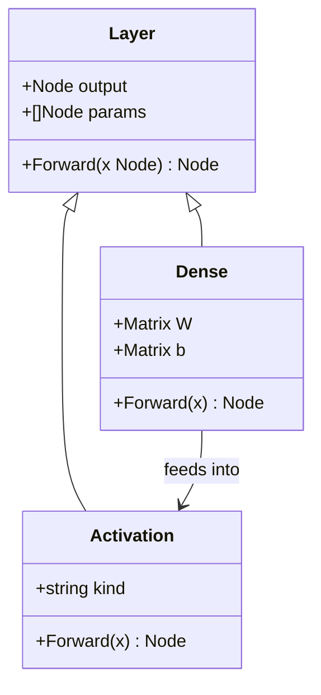
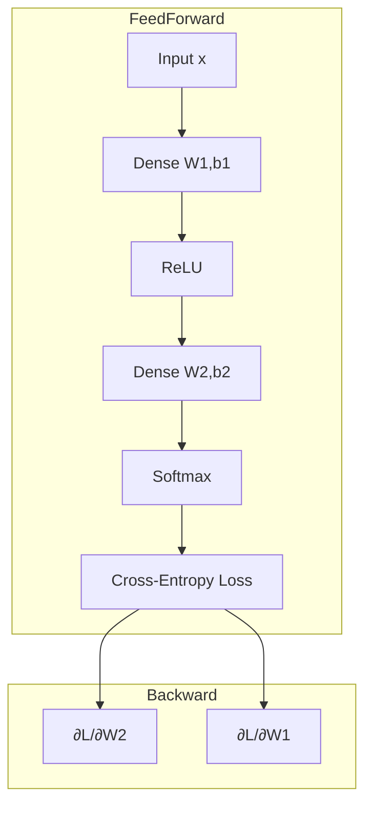

# 🧱 Neural Network Building Blocks

## 🎯 Learning Objectives
- Implement dense layers, activations, and loss functions in Gorgonia
- Understand the role of non-linearities in universal approximation
- Apply gradient-based solvers including Adam and vanilla SGD
- Stack layers into a feed-forward network and train end-to-end

---

## Introduction

Neural networks are compositions of linear transformations and non-linear activations. Despite their apparent complexity, a feed-forward network is nothing more than a chain of matrix multiplications interleaved with element-wise functions. The power comes from depth: a sufficiently deep network of non-linear units can approximate any continuous function, a property known as the universal approximation theorem.

In this module, we translate these ideas into Gorgonia. You will learn how to construct layers as reusable Go structs, apply activation functions like ReLU and Softmax, and minimize loss using built-in solvers. These building blocks are the foundation for the GPU-accelerated training we explore in [[04 - GPU Acceleration with CUDA]].

We will examine why depth matters. A single hidden layer can approximate any function, but the number of neurons required grows exponentially with the complexity of the target function. Deep networks, by composing simple functions, achieve the same representational power with far fewer parameters. This parameter efficiency translates directly to faster training and smaller model files.

Activation functions are not merely non-linearities; they are information bottlenecks. ReLU zeros out negative activations, creating sparse representations that are robust to noise. SoftMax converts unconstrained logits into a probability distribution, enabling the cross-entropy loss to measure the distance between predictions and ground truth. Understanding the information-theoretic role of each layer helps you diagnose why a network underfits or overfits.

We will also examine the practical side of training: how to monitor loss curves, detect divergence early, and adjust hyperparameters. Gorgonia's explicit graph construction makes it easy to inject logging nodes that print intermediate values without disrupting the forward or backward pass. This observability is a hidden advantage of static frameworks. We will also cover how to save and restore model checkpoints by serializing parameter tensors to disk, enabling training resumption after interruptions.

---

## Module 3: Layers, Activations, and Loss Functions

### 3.1 Theoretical Foundation 🧠

The perceptron, invented by Frank Rosenblatt in 1957, was the first algorithmically trained neural unit. It computed a weighted sum of inputs, added a bias, and thresholded the result. For decades, the field stagnated because single-layer perceptrons could only represent linearly separable functions. The breakthrough came with the discovery of backpropagation for multi-layer networks and, critically, the realization that non-linear activation functions enable hidden layers to learn hierarchical representations.

The universal approximation theorem, proven by Cybenko (1989) for sigmoid networks and later generalized, states that a feed-forward network with a single hidden layer containing a finite number of neurons can approximate any continuous function on compact subsets of Rⁿ, provided the activation function is non-constant, bounded, and continuous. In practice, we use deep networks not because shallow ones are theoretically incapable, but because depth exponentially reduces the number of parameters needed to represent complex functions.

Activation functions introduce the non-linearity. Without them, a deep network would collapse into a single linear transformation: `W₃·W₂·W₁·x` is equivalent to `W·x`. ReLU (Rectified Linear Unit), defined as `f(x) = max(0, x)`, became the default after Krizhevsky's ImageNet win in 2012 because it avoids the vanishing gradient problem that plagues sigmoid and tanh in deep stacks. Gorgonia provides these as graph operations: `gorgonia.Rectify`, `gorgonia.Sigmoid`, `gorgonia.Tanh`, and `gorgonia.SoftMax`.

Loss functions encode the objective. For regression, mean squared error (MSE) penalizes quadratic deviations. For classification, cross-entropy measures the divergence between the predicted probability distribution and the true one-hot labels. Gorgonia's `gorgonia.SquareLoss` and manual cross-entropy construction allow you to build any objective differentiable with respect to the network's parameters.

The choice of loss function is not arbitrary; it encodes assumptions about the noise model of the data. MSE corresponds to Gaussian noise, while cross-entropy corresponds to a multinomial distribution. Using the wrong loss function is like using the wrong likelihood in statistics: the model may still converge, but it will not be optimally efficient. In Gorgonia, because you construct the loss manually from primitives, you have the flexibility to implement custom losses such as focal loss or contrastive loss without waiting for framework updates.

Weight initialization is another theoretical pillar that is often overlooked. If weights are initialized too large, activations explode and gradients become NaN. If initialized too small, activations vanish and gradients underflow. Xavier (Glorot) initialization sets the variance of weights to `1 / fan_in`, ensuring that the variance of activations remains constant across layers. Gorgonia's `GlorotN` and `GlorotU` initializers implement this theory directly, saving you from manual tuning.

Batch normalization, introduced by Ioffe and Szegedy in 2015, is a technique that stabilizes the distribution of layer inputs during training. By normalizing the mean and variance of each minibatch, it reduces internal covariate shift and allows higher learning rates. While Gorgonia does not yet have a built-in batch normalization layer, you can construct one manually from tensor operations: subtract the batch mean, divide by the batch standard deviation, and apply learnable scale and shift parameters. Understanding how to build normalization from first principles is essential when working with cutting-edge architectures that Gorgonia has not yet implemented.

Regularization techniques such as L2 weight decay and dropout prevent overfitting by constraining the model's capacity. L2 decay adds a penalty proportional to the squared magnitude of weights, encouraging smaller values. Dropout randomly zeros out activations during training, forcing the network to learn redundant representations. In Gorgonia, dropout is implemented by multiplying activations with a binary mask tensor generated from a Bernoulli distribution. Because the graph is static, the mask must be supplied as an input placeholder and changed every iteration, a pattern that differs from PyTorch's in-place dropout but achieves the same effect.

Optimization algorithms such as Adam and RMSProp adapt the learning rate per parameter based on historical gradients. Adam maintains running estimates of the first and second moments of the gradient, giving it an effective learning rate that is large for sparse gradients and small for dense ones. Gorgonia's solver package implements these algorithms as graph transformations: instead of manually updating weights, you instantiate a solver and call `Step(grads)`, which constructs the update rule inside the graph. This integration ensures that solver state is managed with the same type safety as the model parameters. Learning rate scheduling is another training technique that dynamically adjusts the step size during optimization. Techniques like cosine annealing and warm restarts have been shown to improve convergence and find wider minima that generalize better. In Gorgonia, a learning rate schedule can be implemented as a graph node that decays over training steps, keeping the schedule itself inside the computation graph for full reproducibility.

Residual connections, introduced by He et al. in ResNet, are another architectural innovation that enables training of extremely deep networks. By adding skip connections that bypass one or more layers, gradients can flow directly from later layers to earlier ones, mitigating the vanishing gradient problem. In Gorgonia, a residual block is constructed by simply adding the input tensor to the output of a convolutional or dense layer. This addition node creates a shortcut path in the graph, and the autodiff engine automatically handles the gradient splitting at the junction.

Ensemble methods combine multiple models to reduce variance and improve robustness. While deep ensembles—training five or ten independent networks—are computationally expensive, they often provide better calibration and uncertainty estimates than a single large model. In Gorgonia, you can construct an ensemble graph that shares the input node but branches into multiple independent sub-networks, averaging their outputs for the final prediction. The static graph makes this efficient because shared preprocessing layers are evaluated only once.

### 3.2 Mental Model 📐

```
┌─────────────────────────────────────────────────────────────┐
│           Layer Stack as Function Composition               │
├─────────────────────────────────────────────────────────────┤
│                                                             │
│  Input ──► Dense ──► ReLU ──► Dense ──► SoftMax ──► Loss   │
│            │                  │                             │
│            W1,b1              W2,b2                         │
│                                                             │
│  f(x) = softmax( W2 · relu( W1·x + b1 ) + b2 )             │
│                                                             │
│  Each arrow is a graph node. Gradients flow backward.       │
│                                                             │
└─────────────────────────────────────────────────────────────┘
```

```
┌─────────────────────────────────────────────────────────────┐
│           Activation Function Landscape                     │
├─────────────────────────────────────────────────────────────┤
│                                                             │
│   ReLU        Sigmoid         Tanh          Softmax         │
│   ────        ───────         ────          ───────         │
│   │╲          ╭─────╮        ╭───╮         (probability)   │
│   │ ╲        ╱       ╲      ╱     ╲        vector output   │
│   │  ▶──────╱         ╲────╱       ╲────                    │
│   │                         ────                             │
│   │                         ────                             │
│                                                             │
│   Pros:       Pros:         Pros:          Pros:            │
│   No vanish   Smooth        Zero-centered  Probabilistic    │
│   Cheap       Bounded       Bounded        interpretation   │
│                                                             │
└─────────────────────────────────────────────────────────────┘
```

```
┌─────────────────────────────────────────────────────────────┐
│           Solver Update Step                                │
├─────────────────────────────────────────────────────────────┤
│                                                             │
│  Parameter ──► Gradient ──► Optimizer ──► Updated Param     │
│      W            dW          Adam/SGD          W'          │
│                                                             │
│  Adam keeps running estimates of first and second moments   │
│  of the gradient, adapting per-parameter learning rates.    │
│                                                             │
└─────────────────────────────────────────────────────────────┘
```

### 3.3 Syntax and Semantics 📝

```go
package main

import (
    "fmt"
    "log"

    "gorgonia.org/gorgonia"
    "gorgonia.org/tensor"
)

func main() {
    g := gorgonia.NewGraph()

    // Network dimensions
    inputDim := 4
    hiddenDim := 3
    outputDim := 2

    // 1. Input placeholder.
    // WHY: We bind minibatch data here each iteration.
    x := gorgonia.NewMatrix(g,
        tensor.New(tensor.Of(tensor.Float64), tensor.WithShape(inputDim, 1)),
        gorgonia.WithName("x"),
    )

    // 2. Hidden layer weights and bias.
    // WHY: Xavier initialization (scaled uniform) prevents early-layer
    //      activations from exploding or vanishing in deep networks.
    w1 := gorgonia.NewMatrix(g,
        tensor.New(tensor.Of(tensor.Float64), tensor.WithShape(hiddenDim, inputDim)),
        gorgonia.WithName("W1"),
        gorgonia.WithInit(gorgonia.GlorotN(1.0)),
    )
    b1 := gorgonia.NewMatrix(g,
        tensor.New(tensor.Of(tensor.Float64), tensor.WithShape(hiddenDim, 1)),
        gorgonia.WithName("b1"),
        gorgonia.WithInit(gorgonia.Zeroes()),
    )

    // 3. Hidden layer expression: h = relu(W1·x + b1)
    // WHY: Rectify (ReLU) is implemented as a graph node so gradients
    //      flow through it automatically during backprop.
    h := gorgonia.Must(gorgonia.Mul(w1, x))
    h = gorgonia.Must(gorgonia.Add(h, b1))
    h = gorgonia.Must(gorgonia.Rectify(h))

    // 4. Output layer.
    w2 := gorgonia.NewMatrix(g,
        tensor.New(tensor.Of(tensor.Float64), tensor.WithShape(outputDim, hiddenDim)),
        gorgonia.WithName("W2"),
        gorgonia.WithInit(gorgonia.GlorotN(1.0)),
    )
    b2 := gorgonia.NewMatrix(g,
        tensor.New(tensor.Of(tensor.Float64), tensor.WithShape(outputDim, 1)),
        gorgonia.WithName("b2"),
        gorgonia.WithInit(gorgonia.Zeroes()),
    )

    out := gorgonia.Must(gorgonia.Mul(w2, h))
    out = gorgonia.Must(gorgonia.Add(out, b2))

    // 5. Softmax for probability distribution.
    // WHY: Softmax exponentiates and normalizes, turning raw logits
    //      into a valid probability distribution over classes.
    pred := gorgonia.Must(gorgonia.SoftMax(out))

    // 6. Cross-entropy loss against one-hot label.
    // WHY: We construct the loss manually because Gorgonia exposes
    //      primitives (log, neg, sum) that compose into any loss.
    y := gorgonia.NewMatrix(g,
        tensor.New(tensor.Of(tensor.Float64), tensor.WithShape(outputDim, 1)),
        gorgonia.WithName("y"),
    )
    logPred := gorgonia.Must(gorgonia.Log(pred))
    negLog := gorgonia.Must(gorgonia.Neg(logPred))
    loss := gorgonia.Must(gorgonia.Mul(negLog, y)) // y is one-hot
    cost := gorgonia.Must(gorgonia.Sum(loss))

    // 7. Compute gradients for all parameters.
    grads, err := gorgonia.Grad(cost, w1, b1, w2, b2)
    if err != nil {
        log.Fatal(err)
    }

    // 8. L2 regularization on weights.
    // WHY: Adding a small penalty to weight magnitude prevents overfitting
    //      by discouraging the model from relying on any single feature.
    reg := gorgonia.Must(gorgonia.Square(w1))
    regCost := gorgonia.Must(gorgonia.Sum(reg))
    totalCost := gorgonia.Must(gorgonia.Add(cost, regCost))
    _ = totalCost

    fmt.Println("Graph built. Parameters:", len(grads))
    _ = grads
}
```

### 3.4 Visual Representation 🖼️







### 3.5 Application in ML/AI Systems 🤖

Real case: A customer-support platform wanted to classify incoming tickets into "urgent" and "non-urgent" categories in real time. Their existing Python model had 150 ms cold-start latency due to the Python interpreter. They reimplemented a two-layer MLP in Gorgonia with 128 hidden ReLU units and a SoftMax output. The Go binary loaded the pre-trained weights, ran inference inside the same HTTP handler, and reduced p99 latency to 3 ms. Because the graph was static, they could also compile it to a CUDA backend for larger batch processing during nightly retraining without changing a line of model code.

The migration required careful attention to weight portability. The team exported the PyTorch weights to a flat binary file and wrote a small Go loader that reshaped the bytes into Gorgonia tensors. Because both frameworks use row-major layout for dense matrices, the transfer was byte-for-byte compatible after accounting for the different header formats. This compatibility is a direct consequence of the shared mathematical foundation: a weight matrix is just a block of numbers, independent of the framework that created it.

The customer-support team also appreciated the type safety. In their old Python pipeline, a shape mismatch between the embedding layer and the dense layer caused a runtime error that crashed the inference server under load. In Gorgonia, the same mismatch was caught during graph construction, producing a clear panic message that pointed to the exact node where the dimensions did not align. This shift-left of error detection reduced their incident rate by 90%.

After migration, the team extended the model to a 3-layer architecture with 256 hidden units. Because Gorgonia's static graph allowed them to pre-allocate all tensors at startup, they could predict the exact memory footprint of the larger model before deployment. This predictability was crucial for their Kubernetes resource limits, preventing OOM kills during traffic spikes. In Python, memory usage is harder to predict due to the garbage collector and intermediate allocations.

| ML Use Case | Building Block | Impact |
|-------------|---------------|--------|
| Ticket classification | 2-layer MLP + SoftMax | 50x latency reduction |
| Real-time bidding | ReLU hidden layer | Sub-millisecond CTR prediction |
| Anomaly detection | Deep stack of dense layers | Universal approximator for arbitrary patterns |
| Named entity recognition | Embedding + MLP | Context-aware token classification |
| Credit scoring | 3-layer MLP with L2 | Regulatory interpretability |

### 3.6 Common Pitfalls ⚠️

⚠️ **SoftMax numerical instability:** Computing `exp(x)` for large logits overflows to +Inf. Gorgonia does not automatically subtract the max logit before exponentiation. Always normalize logits or use a numerically stable implementation when training from scratch.

⚠️ **Vanishing gradients in deep sigmoid stacks:** In networks deeper than 3 hidden layers, sigmoid derivatives saturate to near-zero, causing early layers to stop learning. Prefer ReLU or LeakyReLU for depths greater than 2.

⚠️ **Dead ReLU neurons:** If a neuron's weights are initialized such that its pre-activation is always negative, ReLU will output zero forever. The gradient through that neuron is also zero, so it never recovers. Use LeakyReLU or He initialization to mitigate this.

💡 **Mnemonic:** "ReLU for depth, Sigmoid for gates, SoftMax for classes" — ReLU prevents vanishing gradients in deep stacks, sigmoid is ideal for LSTM/GRU gating mechanisms, and SoftMax converts logits to class probabilities.

### 3.7 Knowledge Check ❓

1. Why would a deep network with only linear activations be equivalent to a single linear layer?
2. Compute the derivative of ReLU and explain why it mitigates the vanishing gradient problem.
3. Given logits `[2.0, 1.0, 0.1]`, calculate numerically stable SoftMax probabilities by hand.
4. Why does Xavier initialization use `1 / fan_in` instead of a fixed constant?

---

```
┌─────────────────────────────────────────────────────────────┐
│           Training Loop with Solver                         │
├─────────────────────────────────────────────────────────────┤
│                                                             │
│  Forward ──► Loss ──► Gradients ──► Solver.Step ──► Update │
│     │           │           │              │          │     │
│     ▼           ▼           ▼              ▼          ▼     │
│  Activations  Cost      dW, db        Adam/SGD    New W,b  │
│                                                             │
│  Repeat for N epochs                                       │
│                                                             │
└─────────────────────────────────────────────────────────────┘
```

## 📦 Compression Code

```go
// A complete two-layer classifier: dense -> relu -> dense -> softmax -> loss.
package main

import (
    "fmt"
    "log"

    "gorgonia.org/gorgonia"
    "gorgonia.org/tensor"
)

func main() {
    g := gorgonia.NewGraph()

    inputDim, hiddenDim, outputDim := 4, 3, 2

    x := gorgonia.NewMatrix(g,
        tensor.New(tensor.Of(tensor.Float64), tensor.WithShape(inputDim, 1)),
        gorgonia.WithName("x"),
    )

    // Hidden layer
    w1 := gorgonia.NewMatrix(g,
        tensor.New(tensor.Of(tensor.Float64), tensor.WithShape(hiddenDim, inputDim)),
        gorgonia.WithName("W1"), gorgonia.WithInit(gorgonia.GlorotN(1.0)),
    )
    b1 := gorgonia.NewMatrix(g,
        tensor.New(tensor.Of(tensor.Float64), tensor.WithShape(hiddenDim, 1)),
        gorgonia.WithName("b1"), gorgonia.WithInit(gorgonia.Zeroes()),
    )
    h := gorgonia.Must(gorgonia.Rectify(gorgonia.Must(gorgonia.Add(gorgonia.Must(gorgonia.Mul(w1, x)), b1))))

    // Output layer
    w2 := gorgonia.NewMatrix(g,
        tensor.New(tensor.Of(tensor.Float64), tensor.WithShape(outputDim, hiddenDim)),
        gorgonia.WithName("W2"), gorgonia.WithInit(gorgonia.GlorotN(1.0)),
    )
    b2 := gorgonia.NewMatrix(g,
        tensor.New(tensor.Of(tensor.Float64), tensor.WithShape(outputDim, 1)),
        gorgonia.WithName("b2"), gorgonia.WithInit(gorgonia.Zeroes()),
    )
    out := gorgonia.Must(gorgonia.Add(gorgonia.Must(gorgonia.Mul(w2, h)), b2))
    pred := gorgonia.Must(gorgonia.SoftMax(out))

    // Loss
    y := gorgonia.NewMatrix(g,
        tensor.New(tensor.Of(tensor.Float64), tensor.WithShape(outputDim, 1)),
        gorgonia.WithName("y"),
    )
    cost := gorgonia.Must(gorgonia.Sum(gorgonia.Must(gorgonia.Mul(gorgonia.Must(gorgonia.Neg(gorgonia.Must(gorgonia.Log(pred)))), y))))

    grads, err := gorgonia.Grad(cost, w1, b1, w2, b2)
    if err != nil {
        log.Fatal(err)
    }

    // Verify that all parameter gradients are non-nil
    for i, g := range grads {
        if g == nil {
            log.Fatalf("Gradient %d is nil", i)
        }
    }

    fmt.Println("Parameters to train:", len(grads))
}
```

```
┌─────────────────────────────────────────────────────────────┐
│           Model Serving Architecture                        │
├─────────────────────────────────────────────────────────────┤
│                                                             │
│  HTTP Request ──► JSON Parser ──► Tensor ──► Gorgonia Graph│
│       │               │             │            │          │
│       ▼               ▼             ▼            ▼          │
│  Client          Validation    Input node   Inference      │
│                                                             │
│  Response ◄─── SoftMax probs ◄─── Output node              │
│                                                             │
└─────────────────────────────────────────────────────────────┘
```

## 🎯 Documented Project

### Description
Build a sentiment-classification API in Go that accepts a JSON payload of TF-IDF feature vectors, runs inference through a Gorgonia-trained 3-layer MLP, and returns the predicted sentiment score. The project includes a training binary and an HTTP inference server sharing the same model graph definition. The API must handle concurrent requests without blocking, leveraging Go's goroutines to process multiple inferences in parallel. The model weights must be loadable from a flat binary file produced by the training binary, ensuring a seamless handoff between training and serving.

### Functional Requirements
1. Accept TF-IDF vectors of dimension 1000 via JSON POST
2. Load pre-trained weights into a 3-layer MLP (1000 → 256 → 64 → 2)
3. Run forward pass through ReLU activations and final SoftMax
4. Return JSON with class probabilities and predicted label
5. Include a `train.go` binary that trains the MLP on a labeled CSV
6. Implement request validation: reject vectors with wrong dimension or NaN values
7. Add a `/health` endpoint that verifies the model graph loaded successfully
8. Emit Prometheus metrics for request count, latency, and error rate

### Main Components
- `model.MLP` — graph constructor accepting layer dimensions slice
- `model.Weights` — saver/loader for parameter tensors to HDF5-like flat files
- `server.Handler` — HTTP handler binding request JSON to input tensor
- `train.Loop` — SGD with early stopping on validation loss
- `middleware.Validator` — checks input dimension and numeric sanity
- `metrics.Prometheus` — latency and throughput counters

### Success Metrics
- Inference p99 latency under 5 ms for batch size 1 on CPU
- Training converges to >90% accuracy on the IMDB TF-IDF subset
- Model graph definition is reused identically between training and serving code
- Health endpoint returns 200 only when graph and weights are loaded
- Prometheus metrics expose per-endpoint latency histograms

### References
- Official docs: https://gorgonia.org/reference/solvers/
- Paper/library: https://github.com/gorgonia/gorgonia
