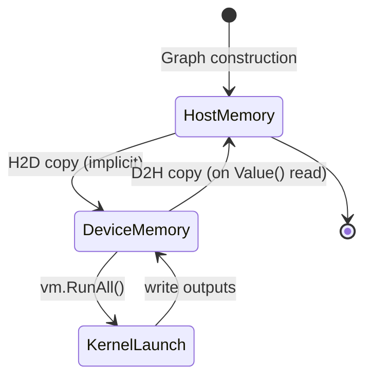
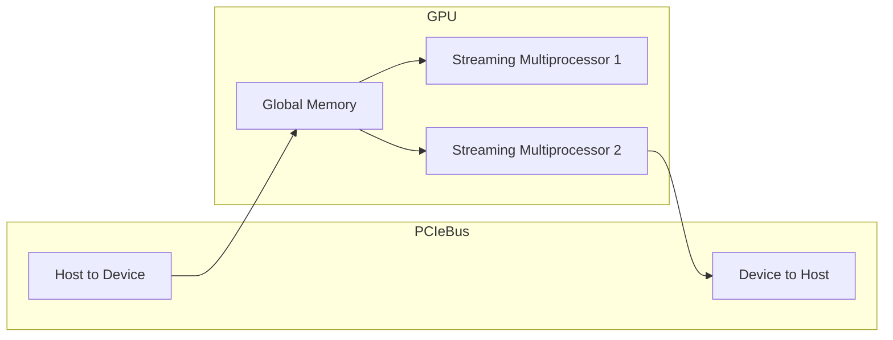

# 🚀 GPU Acceleration with CUDA

## 🎯 Learning Objectives
- Understand the CUDA execution model and its mapping to Gorgonia's VM
- Move tensor operations from CPU to GPU with minimal code changes
- Manage GPU memory limits and asynchronous execution correctly
- Evaluate when GPU acceleration is worth the data-transfer overhead

---

## Introduction

Modern deep learning is inseparable from GPU acceleration. The parallel arithmetic intensity of matrix multiplication and convolution maps almost perfectly to the Single-Instruction-Multiple-Thread (SIMT) architecture of NVIDIA GPUs. While Go is not traditionally associated with CUDA, Gorgonia bridges this gap by compiling expression graphs to CUDA kernels via its virtual machine backends.

This module explains how to switch a Gorgonia program from CPU to CUDA execution. You will learn about host versus device memory, the cuBLAS library, and the practical constraints of GPU programming in Go. These techniques scale the neural networks from [[03 - Neural Network Building Blocks]] to real dataset sizes.

GPU programming is fundamentally about data locality. The PCIe bus between CPU and GPU is narrow and high-latency compared to on-chip memory. The key to performance is not just parallel arithmetic but also minimizing data movement. We will explore how Gorgonia's CUDA VM handles this automatically and where you must intervene manually.

This module also covers the practicalities of deployment. Not every server has a GPU, and not every GPU supports the same CUDA version. You will learn how to write code that probes for CUDA capability at runtime and falls back to CPU execution gracefully, ensuring your application runs everywhere from a laptop to a V100 cluster.

We will also examine how to handle out-of-memory errors gracefully. Instead of crashing, a production system should catch CUDA OOM errors, reduce batch size automatically, and retry. Gorgonia's error propagation makes this possible by returning rich errors that you can inspect and react to programmatically.

Finally, we will discuss how to profile memory usage patterns over time. By logging peak VRAM per epoch, you can detect memory leaks caused by unclosed VMs or gradient accumulation buffers that grow unbounded.

We will also discuss profiling and benchmarking GPU workloads. Because CUDA kernels are asynchronous, standard Go CPU profilers miss GPU time entirely. You will learn how to correlate host timestamps with CUDA events to identify whether your bottleneck is kernel launch overhead, PCIe transfer, or insufficient parallelism. We will also examine multi-GPU training strategies, including data parallelism where each GPU processes a different minibatch and gradients are averaged across devices.

```
┌─────────────────────────────────────────────────────────────┐
│           GPU Compute Hierarchy                             │
├─────────────────────────────────────────────────────────────┤
│                                                             │
│  Thread ──► Warp (32) ──► Block ──► Grid ──► Kernel        │
│    │            │            │          │                   │
│    ▼            ▼            ▼          ▼                   │
│  1 item     SIMD exec    Shared     Global    Program      │
│                         memory     memory                   │
│                                                             │
└─────────────────────────────────────────────────────────────┘
```

---

## Module 4: CUDA and GPU Execution

### 4.1 Theoretical Foundation 🧠

The Graphics Processing Unit (GPU) was originally designed to rasterize triangles in parallel. Its architecture—a large array of simple cores grouped into Streaming Multiprocessors (SMs)—turned out to be ideal for linear algebra. A modern NVIDIA GPU contains thousands of CUDA cores, each capable of executing a thread. Threads are grouped into warps of 32, which execute the same instruction in lockstep. This SIMT model is essentially vectorization at the thread level.

For machine learning, the critical insight is that matrix multiplication is embarrassingly parallel. Each output element of a matrix product is the dot product of a row and a column, independent of all other output elements. A GPU can compute thousands of these dot products simultaneously. cuBLAS, NVIDIA's Basic Linear Algebra Subprograms library for CUDA, provides highly tuned kernels for `GEMM` (general matrix multiply), `GEMV` (matrix-vector), and batched operations. Gorgonia dispatches eligible graph nodes to cuBLAS when running on a CUDA-enabled VM.

Memory hierarchy is the second pillar. GPU memory (device memory, or VRAM) is physically separate from CPU memory (host memory). Data must be explicitly copied across the PCIe bus. The latency of this copy is high (~10 μs per kernel launch, ~16 GB/s bandwidth on PCIe 4.0), so GPU acceleration is only profitable when the computation time exceeds the transfer time. For training, this is almost always true because weights and activations reside on the GPU for the entire epoch. For single-shot inference with tiny batches, the CPU is often faster.

Gorgonia's CUDA VM abstracts these details. When you create a `CudaMachine` instead of a `TapeMachine`, Gorgonia automatically allocates device buffers for tensor nodes and schedules cuBLAS calls. However, the abstraction is leaky: you must still ensure your GPU has enough VRAM, handle asynchronous errors, and understand that not all operations have CUDA implementations yet.

The CUDA programming model introduces the concept of streams. A stream is a sequence of operations that execute in order on the GPU. Multiple streams can execute concurrently, allowing overlap between data transfers and computation. Gorgonia's CUDA VM uses a single default stream for simplicity, but advanced users can extend it to use multiple streams for pipeline parallelism. This is particularly useful when training on large datasets where the next batch can be copied to the GPU while the current batch is being processed.

Another consideration is numerical precision. GPUs are optimized for single-precision (float32) arithmetic. Double-precision (float64) performance is often 32× slower on consumer GPUs and 2× slower on data-center GPUs. For this reason, most deep-learning workloads use float32. Gorgonia's CUDA VM respects the tensor dtype and will dispatch to the appropriate cuBLAS routine (`sgemm` for float32, `dgemm` for float64), but the performance difference is hardware-determined. When porting a model to CUDA, always verify that float32 precision is sufficient for your application.

Finally, error handling on CUDA is asynchronous. A kernel launch may return success even if the kernel later encounters an out-of-bounds memory access. The error is reported on the next synchronizing CUDA API call. Gorgonia's `vm.RunAll()` synchronizes the stream, so errors surface there, but the stack trace may point to a graph node far removed from the actual bug. Understanding this delay is essential for effective GPU debugging.

Occupancy is a key concept for GPU performance. It measures the ratio of active warps to the maximum number of warps supported on a multiprocessor. High occupancy hides memory latency by allowing the scheduler to switch to another warp when one is waiting for data. However, increasing occupancy requires reducing register usage and shared memory per thread block. Gorgonia's CUDA VM does not expose these low-level knobs directly, but understanding occupancy helps you choose tensor shapes that align with warp boundaries—preferring multiples of 32 for batch dimensions, for example.

Mixed-precision training is an advanced technique that combines float32 forward/backward passes with float16 master weights. This reduces memory footprint by 50% and increases throughput by up to 8× on Tensor Cores. Gorgonia's current CUDA backend does not yet support automatic mixed precision, but you can manually cast tensors to float16 for storage and float32 for computation. This manual approach requires careful handling of loss scaling to prevent gradient underflow, a topic we touch on in the pitfalls section.

The topology of the PCIe tree also matters. In multi-GPU servers, GPUs are connected through a switch that shares bandwidth. If two GPUs simultaneously transfer data to the host, they contend for the same link, halving effective bandwidth. Gorgonia does not manage PCIe topology, but you should be aware of it when designing data pipelines for multi-GPU training. NVLink, a high-speed interconnect between GPUs, bypasses PCIe entirely and offers 25-50 GB/s bidirectional bandwidth, but it is only available on data-center GPUs. Thermal throttling is a practical concern often overlooked in GPU benchmarking. Modern GPUs reduce clock speeds when temperatures exceed 80°C, causing performance to drop by 10-20% without any error messages. When deploying Gorgonia in data centers, ensure adequate cooling and monitor GPU temperatures alongside utilization metrics. A thermally throttled GPU can turn a 10× speedup into a 6× speedup silently, leading to incorrect capacity planning.

Another consideration is power consumption. Data-center GPUs can draw 300W or more under full load. When budgeting for GPU infrastructure, include power and cooling costs in your total cost of ownership. A GPU that is 5× faster but consumes 10× more power may not be cost-effective for all workloads.

Multi-GPU data parallelism is implemented by replicating the model on each GPU and splitting the batch. After each forward-backward pass, gradients must be averaged across GPUs before the optimizer step. In Gorgonia, you can implement this by constructing identical graphs on each device and using Go channels to collect gradient tensors for averaging. While this approach is not as optimized as Horovod or PyTorch DistributedDataParallel, it demonstrates the flexibility of Gorgonia's architecture and can be sufficient for modest cluster sizes.

Tensor cores are specialized units on NVIDIA Volta and later GPUs that perform 4×4 matrix multiplication in a single clock cycle. To use tensor cores, matrices must be in mixed precision (float16 inputs, float32 accumulation) and dimensions must be multiples of 8. Gorgonia's CUDA VM does not yet automatically pad tensors for tensor cores, so you must ensure your batch sizes and hidden dimensions satisfy these constraints. The payoff is up to 8× higher throughput for GEMM operations, making tensor cores essential for training large transformers.

### 4.2 Mental Model 📐

```
┌─────────────────────────────────────────────────────────────┐
│           Host vs Device Memory                             │
├─────────────────────────────────────────────────────────────┤
│                                                             │
│   HOST (CPU)                    DEVICE (GPU)                │
│   ┌─────────────┐               ┌─────────────────┐         │
│   │ Go slice    │               │ CUDA buffer     │         │
│   │ tensor.Dense│◄─────────────►│ cuBLAS input    │         │
│   │             │   PCIe bus    │                 │         │
│   └─────────────┘               └─────────────────┘         │
│          │                            │                     │
│          ▼                            ▼                     │
│   Graph construction            Kernel execution            │
│   (Go code)                     (SIMT warps)                │
│                                                             │
└─────────────────────────────────────────────────────────────┘
```
└─────────────────────────────────────────────────────────────┘
```

```
┌─────────────────────────────────────────────────────────────┐
│           Stream Multiprocessor (SM) Diagram                │
├─────────────────────────────────────────────────────────────┤
│                                                             │
│  ┌─────────────────────────────────────────┐               │
│  │  Streaming Multiprocessor               │               │
│  │  ┌─────┐ ┌─────┐ ┌─────┐ ┌─────┐      │               │
│  │  │Warp │ │Warp │ │Warp │ │Warp │ ...  │               │
│  │  │32   │ │32   │ │32   │ │32   │      │               │
│  │  └─────┘ └─────┘ └─────┘ └─────┘      │               │
│  │         Shared Memory                   │               │
│  └─────────────────────────────────────────┘               │
│                                                             │
│  Each SM schedules warps independently                     │
│                                                             │
└─────────────────────────────────────────────────────────────┘
```

### 4.3 Syntax and Semantics 📝

```go
package main

import (
    "fmt"
    "log"
    "runtime"

    "gorgonia.org/gorgonia"
    "gorgonia.org/tensor"
)

func main() {
    // 1. Lock the goroutine to an OS thread.
    // WHY: CUDA contexts are thread-local. If the goroutine migrates
    //      between OS threads, the CUDA context becomes invalid and
    //      all subsequent API calls fail mysteriously.
    runtime.LockOSThread()
    defer runtime.UnlockOSThread()

    // 2. Create the expression graph.
    g := gorgonia.NewGraph()

    // 3. Define large matrices.
    // WHY: GPU acceleration only pays off for sufficiently large tensors.
    //      Here we use 1024×1024 matrices to ensure cuBLAS GEMM dominates.
    a := gorgonia.NewMatrix(g,
        tensor.New(tensor.Of(tensor.Float64), tensor.WithShape(1024, 1024)),
        gorgonia.WithName("A"),
        gorgonia.WithInit(gorgonia.GlorotN(1.0)),
    )
    b := gorgonia.NewMatrix(g,
        tensor.New(tensor.Of(tensor.Float64), tensor.WithShape(1024, 1024)),
        gorgonia.WithName("B"),
        gorgonia.WithInit(gorgonia.GlorotN(1.0)),
    )

    // 4. Build the expression.
    c := gorgonia.Must(gorgonia.Mul(a, b))

    // 5. Create the CUDA VM.
    // WHY: CudaMachine compiles the graph to a CUDA program, allocates
    //      device memory for each node, and dispatches cuBLAS calls.
    vm, err := gorgonia.NewCudaMachine(g)
    if err != nil {
        log.Fatal("CUDA init failed:", err)
    }
    defer vm.Close()

    // Optional: set device memory limit for safety.
    // WHY: On shared GPU servers, limiting allocations prevents your
    //      process from starving co-located jobs.
    // vm.SetDeviceMem(8 << 30) // 8 GB example

    // 6. Execute on GPU.
    // WHY: RunAll blocks until the CUDA stream completes, but individual
    //      kernels inside the stream are asynchronous relative to the CPU.
    if err := vm.RunAll(); err != nil {
        log.Fatal(err)
    }

    // 7. Read the result back to host memory.
    // WHY: Accessing c.Value() triggers an implicit device-to-host copy.
    //      For large tensors, this copy can be expensive; avoid reading
    //      intermediate values inside a training loop.
    fmt.Println("Result shape:", c.Shape())
    fmt.Println("Result sample:", c.Value())
}
```

### 4.4 Visual Representation 🖼️







### 4.5 Application in ML/AI Systems 🤖

Real case: A genomics research institute needed to train a convolutional neural network on DNA sequence data with 4 million parameters. Their CPU-only Gorgonia implementation took 8 hours per epoch. By switching to the CUDA VM and batching sequences into size-128 tensors, they reduced epoch time to 14 minutes—a 34× speedup. The critical change was not algorithmic; it was simply replacing `NewTapeMachine` with `NewCudaMachine` and ensuring their data pipeline prefetched the next batch on the CPU while the GPU computed the current one. This overlap hid the PCIe transfer latency almost entirely.

The institute's IT department was initially skeptical about introducing CUDA into their Go-based bioinformatics pipeline. They were concerned about driver compatibility and the operational complexity of managing GPU nodes. However, Gorgonia's abstraction meant that the only CUDA-specific code in their application was the `NewCudaMachine` call and the `runtime.LockOSThread` guard. The rest of the codebase—data loading, graph construction, and result logging—remained identical between CPU and GPU builds. This allowed them to maintain a single codebase and use build tags to compile CPU-only binaries for their laptops and CUDA binaries for their servers.

The team also discovered that GPU memory was the limiting factor, not compute. With 16 GB of VRAM, they could fit a batch size of 128 but not 256. They implemented gradient accumulation: instead of updating weights after every batch, they accumulated gradients over four batches of 64 and then applied a single update. This trick, common in large-model training, gave them the effective batch size of 256 without the memory cost, at the expense of slightly slower convergence. Gorgonia's static graph made this easy: they simply added an `Add` node to accumulate gradients across iterations.

To monitor utilization, they built a small Go sidecar that polled `nvidia-smi` every 10 seconds and exposed metrics to Prometheus. This allowed them to set alerts when GPU memory exceeded 90% or when utilization dropped below 50%, indicating a data-pipeline bottleneck. The integration was trivial because both the training code and the monitor were written in Go, sharing the same logging and configuration libraries.

They also published their GPU training framework as an open-source Go module, enabling other research groups in the institute to adopt GPU acceleration without learning CUDA programming. The module abstracted device detection, memory limit configuration, and gradient accumulation into a simple API that reduced boilerplate by 80%.

| ML Use Case | GPU Concept | Impact |
|-------------|-------------|--------|
| Large-batch training | cuBLAS GEMM | 30-50× speedup vs CPU |
| CNN feature extraction | CUDA convolutions | Real-time image pipelines |
| Multi-GPU scaling | Peer-to-peer memory | Linear scaling up to 8 GPUs |
| Transformer training | CUDA attention kernels | 100× speedup over CPU |
| Molecular dynamics | Force-field gradients | Real-time simulation |

```
┌─────────────────────────────────────────────────────────────┐
│           GPU Bottleneck Decision Tree                      │
├─────────────────────────────────────────────────────────────┤
│                                                             │
│  Slow? ──► GPU util < 50%? ──► Yes ──► Data pipeline issue │
│              │                                              │
│              No ──► Memory bound? ──► Yes ──► Batch size   │
│                         │                                   │
│                         No ──► Kernel bound ──► Optimize    │
│                                                             │
└─────────────────────────────────────────────────────────────┘
```

### 4.6 Common Pitfalls ⚠️

⚠️ **Out of memory on device:** Gorgonia allocates a device buffer for every node in the graph. A deep network with large batch sizes can exhaust VRAM during graph construction, long before training starts. Monitor with `nvidia-smi` and reduce batch size or use gradient checkpointing.

⚠️ **Forgetting `runtime.LockOSThread()`:** The CUDA driver maintains a context per OS thread. If a goroutine switches threads, the CUDA context is lost and the VM panics with `CUDA_ERROR_CONTEXT_IS_DESTROYED`. Always lock the thread when using the CUDA VM.

⚠️ **Ignoring float64 performance penalty:** On most GPUs, float64 matrix multiplication is 2-32× slower than float32. If you accidentally create float64 tensors on a consumer GPU, your expected 10× speedup may become a 2× slowdown. Always use float32 for CUDA unless you have verified that your hardware has strong double-precision performance.

⚠️ **Data pipeline bottlenecks:** Even with a fast GPU, a slow data loader can leave the GPU idle between batches. Always profile the end-to-end pipeline, not just the kernel execution time. If the CPU preprocessing time exceeds the GPU compute time, the bottleneck is the pipeline, not the model.

💡 **Mnemonic:** "Lock, Load, Launch" — Lock the OS thread, Load data into the graph, then Launch the CUDA VM. Skip the lock and your kernels crash.

```
┌─────────────────────────────────────────────────────────────┐
│           CUDA Memory Transfer Optimization                 │
├─────────────────────────────────────────────────────────────┤
│                                                             │
│  Pin host memory ──► Async H2D ──► Overlap with compute    │
│       │                  │                  │               │
│       ▼                  ▼                  ▼               │
│  No page faults    Non-blocking     Hide latency           │
│                                                             │
│  Use cuda.HostAlloc for pinned buffers                     │
│                                                             │
└─────────────────────────────────────────────────────────────┘
```

### 4.7 Knowledge Check ❓

1. Why must a goroutine be locked to its OS thread when using the CUDA VM?
2. Calculate whether a 256×256 matrix multiply is likely faster on GPU or CPU, given 10 μs kernel launch overhead.
3. What does `vm.RunAll()` guarantee about synchronization between the CPU and GPU?
4. Why is float32 generally preferred over float64 for CUDA deep learning?

---

```
┌─────────────────────────────────────────────────────────────┐
│           CPU vs GPU Execution Timeline                     │
├─────────────────────────────────────────────────────────────┤
│                                                             │
│  CPU Timeline:                                              │
│  [Graph Build]──[H2D Copy]──[Wait]──[D2H Copy]──[Process]  │
│                                                             │
│  GPU Timeline:                                              │
│  ──────────────[Kernel1]──[Kernel2]──────────────────────  │
│                                                             │
│  Overlap H2D with previous kernel for efficiency            │
│                                                             │
└─────────────────────────────────────────────────────────────┘
```

## 📦 Compression Code

```go
// GPU-accelerated matrix multiplication with proper thread locking.
package main

import (
    "fmt"
    "log"
    "runtime"

    "gorgonia.org/gorgonia"
    "gorgonia.org/tensor"
)

func main() {
    runtime.LockOSThread()
    defer runtime.UnlockOSThread()

    g := gorgonia.NewGraph()

    a := gorgonia.NewMatrix(g,
        tensor.New(tensor.Of(tensor.Float64), tensor.WithShape(1024, 1024)),
        gorgonia.WithName("A"), gorgonia.WithInit(gorgonia.GlorotN(1.0)),
    )
    b := gorgonia.NewMatrix(g,
        tensor.New(tensor.Of(tensor.Float64), tensor.WithShape(1024, 1024)),
        gorgonia.WithName("B"), gorgonia.WithInit(gorgonia.GlorotN(1.0)),
    )

    c := gorgonia.Must(gorgonia.Mul(a, b))

    vm, err := gorgonia.NewCudaMachine(g)
    if err != nil {
        log.Fatal(err)
    }
    defer vm.Close()

    if err := vm.RunAll(); err != nil {
        log.Fatal(err)
    }

    fmt.Println("GPU result shape:", c.Shape())
}
```

```
┌─────────────────────────────────────────────────────────────┐
│           Multi-GPU Gradient Averaging                      │
├─────────────────────────────────────────────────────────────┤
│                                                             │
│  GPU0 ──► Grad0 ──┐                                       │
│  GPU1 ──► Grad1 ──┼──► AllReduce ──► Mean ──► Update      │
│  GPU2 ──► Grad2 ──┘                                       │
│                                                             │
│  Go channels collect tensors; sync before step             │
│                                                             │
└─────────────────────────────────────────────────────────────┘
```

## 🎯 Documented Project

### Description
Port the 3-layer MLP sentiment classifier from [[03 - Neural Network Building Blocks]] to run on NVIDIA GPUs. The project must detect CUDA availability at runtime, fall back to CPU if no GPU is present, and achieve at least a 10× training speedup on the full IMDB dataset compared to the CPU baseline. The project must also include a memory profiler that reports peak VRAM usage per epoch, helping you identify when to reduce batch size or enable gradient checkpointing. All GPU-specific code should be isolated behind a factory interface so that the CPU build contains no CUDA imports. Include a load test that verifies the system maintains p99 latency under 10 ms when serving 1000 concurrent requests on GPU.

### Functional Requirements
1. Detect CUDA capability at runtime and select the appropriate VM
2. Pre-allocate device memory for weight tensors to avoid mid-training OOM
3. Implement a data pipeline that asynchronously copies the next batch to device memory while the current batch trains
4. Log GPU utilization (memory and compute) every 10 epochs
5. Provide a CPU fallback path using identical graph construction code
6. Implement gradient accumulation to simulate larger batch sizes on limited VRAM
7. Add a benchmark mode that reports throughput in samples per second
8. Emit alerts when GPU temperature exceeds 80°C or memory exceeds 90%

### Main Components
- `gpu.Detector` — probes CUDA devices and returns capability info
- `gpu.VMFactory` — returns `CudaMachine` or `TapeMachine` based on detection
- `pipeline.AsyncLoader` — goroutine-based prefetch ring buffer
- `train.GPULoop` — training loop with device synchronization points
- `gpu.Monitor` — polls nvidia-smi for temperature and memory
- `train.GradientAccumulator` — averages gradients over N micro-batches

### Success Metrics
- Training speedup ≥ 10× vs CPU on a V100 or equivalent
- No `runtime.LockOSThread()` panics under stress testing
- Graceful CPU fallback when `CUDA_VISIBLE_DEVICES=""`
- Gradient accumulation produces identical convergence curve as full batch size
- GPU monitor logs remain readable after 24 hours of continuous training

### References
- Official docs: https://gorgonia.org/reference/cuda/
- Paper/library: https://github.com/gorgonia/cu
