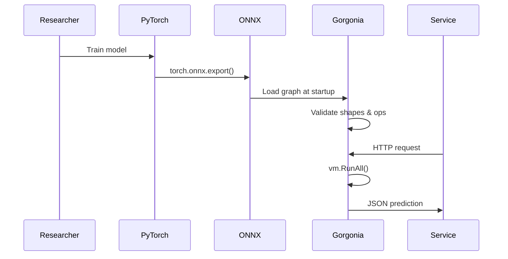
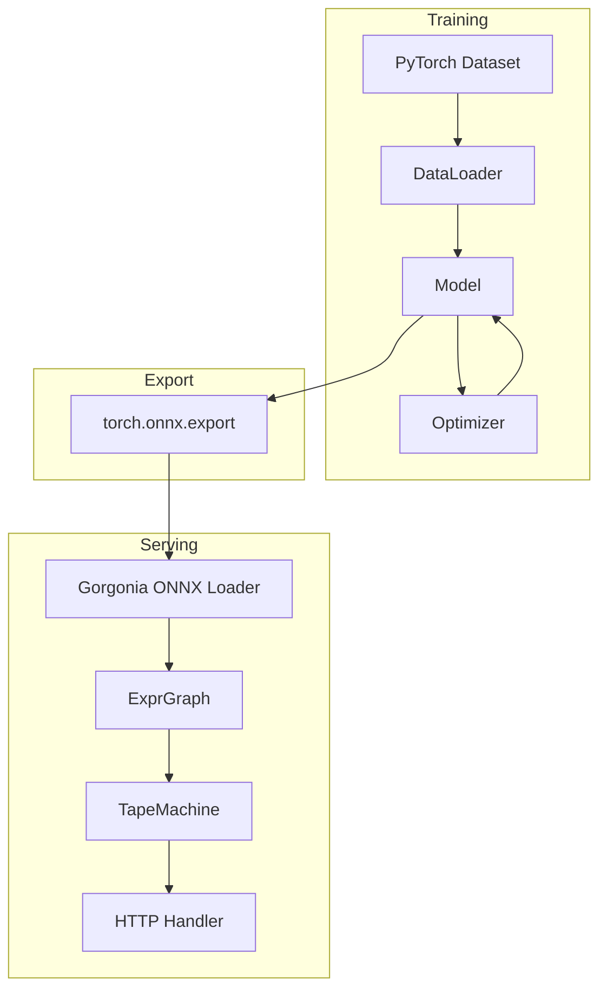

# 🏭 Real Projects and PyTorch Comparison

## 🎯 Learning Objectives
- Compare Gorgonia and PyTorch APIs for common deep-learning tasks
- Design hybrid ML systems where PyTorch trains and Gorgonia serves
- Export and import model weights across framework boundaries
- Decide when to use Go-native ML versus Python-centric pipelines

---

## Introduction

No single framework dominates every stage of the machine-learning lifecycle. PyTorch excels at research and rapid experimentation; Gorgonia excels at embedding models into Go services. In production, the best architecture is often polyglot: train in Python, export to a standard format, and serve in Go. This module teaches you how to bridge these worlds.

We will compare Gorgonia and PyTorch side-by-side, explore ONNX as a serialization standard, and architect a real project that combines the strengths of both ecosystems. By the end, you will know when to reach for Gorgonia, when to stay in PyTorch, and how to move between them without losing correctness.

The ability to move models across frameworks is not just a convenience; it is a strategic capability. Vendor lock-in to a single framework limits your deployment options and increases operational risk. By standardizing on ONNX as an exchange format, you preserve the freedom to retrain in PyTorch, experiment in JAX, and serve in Gorgonia without rewriting model code.

We will also examine the sociotechnical factors. Python's ecosystem moves fast: a PyTorch release every few months can break backward compatibility. Go's ecosystem values stability. A model served by Gorgonia inside a Go binary can remain unchanged for years, compiled against a fixed version of the standard library. This stability is invaluable in regulated industries where change control is strict.

Finally, we will build a complete project that demonstrates the end-to-end workflow: training in PyTorch, exporting to ONNX, loading in Gorgonia, and serving via gRPC. This project serves as a template for your own hybrid ML systems and illustrates the trade-offs at every stage.

We will also cover how to write integration tests that verify the ONNX export produces valid graphs before the Go server is even built. This shift-left testing catches export bugs immediately after training, not during deployment. We will also discuss how to maintain model registries and version control for ONNX artifacts, ensuring that rollbacks to previous model versions are fast and reliable.

```
┌─────────────────────────────────────────────────────────────┐
│           Framework Decision Matrix                         │
├─────────────────────────────────────────────────────────────┤
│                                                             │
│  Need                     │  Use                            │
│  ─────────────────────────┼─────────────────────────────    │
│  Rapid experimentation    │  PyTorch                        │
│  Production serving       │  Gorgonia                       │
│  Mobile deployment        │  ONNX Runtime                   │
│  Regulatory audit trail   │  Gorgonia static graph          │
│                                                             │
└─────────────────────────────────────────────────────────────┘
```

---

## Module 5: Production Systems and Cross-Framework Design

### 5.1 Theoretical Foundation 🧠

The division of labor in modern ML systems is a consequence of the two-language problem. Python is the lingua franca of research because of its interactive REPL, vast library ecosystem, and dynamic nature. However, Python's Global Interpreter Lock (GIL), weak type system, and packaging complexity make it a poor choice for high-throughput backend services. Go, by contrast, offers static binaries, goroutine-based concurrency, and strict typing—properties that reduce operational overhead but slow down experimental iteration.

This dichotomy leads to a natural architecture: the training phase, where speed of iteration matters more than serving latency, happens in Python; the inference phase, where latency, memory footprint, and deployment simplicity dominate, happens in Go. The bridge between them must be a standardized, versioned artifact. ONNX (Open Neural Network Exchange) emerged as this standard, defining a protobuf-based IR for neural networks that is framework-agnostic.

Gorgonia supports a subset of ONNX operators, allowing you to export a trained PyTorch model to ONNX and load it into a Gorgonia graph. This is not merely a technical convenience; it is a risk-mitigation strategy. When the serving code is in Go, you eliminate the entire Python dependency tree from your production container, shrinking attack surface and image size. Furthermore, because Gorgonia graphs are static and typed, loading an ONNX model performs a validation pass that catches shape mismatches at startup rather than at request time.

The theoretical underpinning of this modularity is the separation of representation from execution. ONNX defines a mathematical graph; PyTorch, Gorgonia, TensorRT, or ONNX Runtime each compile this graph to their respective backends. As long as the IR is correct, the outputs are bit-identical (within floating-point tolerance). This is the same principle behind Java bytecode or LLVM IR, applied to deep learning.

This separation creates a competitive market of execution engines. You are no longer forced to use PyTorch's C++ backend for serving if a lighter engine suits your needs. Gorgonia's Go backend offers advantages in binary size, startup time, and concurrency that are difficult to replicate in Python-based runtimes. At the same time, PyTorch's research ecosystem offers cutting-edge optimizers and architectures that Gorgonia may not yet support. The hybrid approach lets you enjoy the best of both worlds.

Versioning is another critical aspect of cross-framework deployment. ONNX models carry an opset version that specifies which operators and attributes are supported. When loading an ONNX model, Gorgonia checks this opset version and rejects models that use operators from a too-recent standard. This explicit versioning prevents silent behavioral changes when a model is moved between frameworks with different feature sets. It is the machine-learning equivalent of semantic versioning for APIs.

Contract testing is an essential practice in hybrid systems. After exporting a model from PyTorch and loading it into Gorgonia, you should run a suite of property-based tests that verify the outputs match within a tight tolerance for a diverse set of inputs. These tests act as a contract between the training and serving teams, catching dtype mismatches, layout permutations, or quantization errors before deployment. Gorgonia's static graph makes these tests fast because the graph is compiled once and then executed repeatedly against the test suite.

The economic argument for hybrid systems is compelling. Python inference servers often require 2-4 GB of RAM per instance, limiting horizontal density. Go inference binaries can run at 50-100 MB per instance, allowing 20-40× more replicas on the same hardware. For high-throughput applications, this density translates directly to cost savings, especially in cloud environments where memory is the dominant billing dimension.

Observability in hybrid systems requires unified telemetry. When a prediction latency spike occurs, you need to distinguish between a slow model (serving layer) and a data-drift issue (training layer). By embedding OpenTelemetry spans in both the PyTorch training script and the Gorgonia serving binary, you can correlate anomalies across the pipeline. This cross-language tracing is straightforward because both ecosystems support the same W3C trace context standard.

Finally, we will discuss fallback strategies. If Gorgonia encounters an unsupported ONNX operator, the system should degrade gracefully—perhaps by falling back to CPU execution for that specific subgraph or by routing the request to a Python microservice. Designing these fallback paths in advance prevents single points of failure. Security hardening is the final piece of the hybrid puzzle. Because Go binaries are statically linked, you can use tools like `go vet` and `staticcheck` to catch vulnerabilities at compile time. In contrast, Python's dynamic import system makes it difficult to audit all code paths. By serving models in Go, you reduce the attack surface and simplify compliance with standards such as SOC 2 and ISO 27001.

Continuous integration for hybrid ML systems requires testing both the Python training pipeline and the Go serving binary in the same CI job. You can use a GitHub Actions workflow that installs PyTorch in one step, trains and exports the model in a second step, and then builds and tests the Go server in a third step. This end-to-end test catches breakage in the export format or API contract immediately, before code is merged to the main branch.

Feature stores are another architectural component that bridges training and serving. Instead of passing raw user IDs to the model, you look up pre-computed feature vectors in a low-latency store such as Redis or DynamoDB. The Go serving code fetches features, assembles them into a Gorgonia tensor, and runs inference. This decouples feature engineering from model serving and allows features to be updated independently of model deployments. Gorgonia's static graph is ideal for this pattern because the graph construction overhead is paid once at startup, not per request.

### 5.2 Mental Model 📐

```
┌─────────────────────────────────────────────────────────────┐
│           Hybrid ML Architecture                            │
├─────────────────────────────────────────────────────────────┤
│                                                             │
│  Research / Training          Production / Serving           │
│  ───────────────────          ───────────────────           │
│                                                             │
│  ┌─────────────┐              ┌─────────────┐               │
│  │   PyTorch   │              │  Gorgonia   │               │
│  │  (Python)   │   ONNX       │   (Go)      │               │
│  │  Train      │ ───────►     │  Load       │               │
│  │  Tune       │   export     │  Validate   │               │
│  │  Experiment │              │  Serve      │               │
│  └─────────────┘              └─────────────┘               │
│                                                             │
│  Goal: fast iteration         Goal: low latency, small bin  │
│                                                             │
└─────────────────────────────────────────────────────────────┘
```
└─────────────────────────────────────────────────────────────┘
```

```
┌─────────────────────────────────────────────────────────────┐
│           Model Version Registry                            │
├─────────────────────────────────────────────────────────────┤
│                                                             │
│  v1.2.0 ──► ONNX artifact ──► Production                   │
│      │                                                      │
│      ▼                                                      │
│  v1.1.0 ──► ONNX artifact ──► Rollback target              │
│      │                                                      │
│      ▼                                                      │
│  v1.0.0 ──► ONNX artifact ──► Archived                     │
│                                                             │
│  Semantic versioning for models                             │
│                                                             │
└─────────────────────────────────────────────────────────────┘
```

### 5.3 Syntax and Semantics 📝

```go
package main

import (
    "fmt"
    "log"

    "gorgonia.org/gorgonia"
    "gorgonia.org/tensor"
)

func main() {
    // This example shows the Gorgonia side of a hybrid workflow.
    // The PyTorch side would call torch.onnx.export().

    g := gorgonia.NewGraph()

    // 1. Define input placeholder matching ONNX input signature.
    // WHY: ONNX models declare fixed input shapes. Gorgonia enforces
    //      these shapes at graph construction time, preventing silent
    //      dimension mismatches that would corrupt inference results.
    input := gorgonia.NewMatrix(g,
        tensor.New(tensor.Of(tensor.Float32), tensor.WithShape(1, 784)),
        gorgonia.WithName("input"),
    )

    // 2. Manually construct a simple MLP (in production, load ONNX).
    // WHY: While Gorgonia has ONNX loaders, understanding manual
    //      reconstruction teaches you how to debug imported graphs.
    w1 := gorgonia.NewMatrix(g,
        tensor.New(tensor.Of(tensor.Float32), tensor.WithShape(128, 784)),
        gorgonia.WithName("fc1.weight"),
        gorgonia.WithInit(gorgonia.GlorotN(1.0)),
    )
    b1 := gorgonia.NewMatrix(g,
        tensor.New(tensor.Of(tensor.Float32), tensor.WithShape(128, 1)),
        gorgonia.WithName("fc1.bias"),
        gorgonia.WithInit(gorgonia.Zeroes()),
    )

    h := gorgonia.Must(gorgonia.Rectify(
        gorgonia.Must(gorgonia.Add(gorgonia.Must(gorgonia.Mul(w1, input)), b1)),
    ))

    w2 := gorgonia.NewMatrix(g,
        tensor.New(tensor.Of(tensor.Float32), tensor.WithShape(10, 128)),
        gorgonia.WithName("fc2.weight"),
        gorgonia.WithInit(gorgonia.GlorotN(1.0)),
    )
    b2 := gorgonia.NewMatrix(g,
        tensor.New(tensor.Of(tensor.Float32), tensor.WithShape(10, 1)),
        gorgonia.WithName("fc2.bias"),
        gorgonia.WithInit(gorgonia.Zeroes()),
    )

    out := gorgonia.Must(gorgonia.Add(gorgonia.Must(gorgonia.Mul(w2, h)), b2))

    // 3. Execute on CPU (or swap VM for CUDA).
    // WHY: In a hybrid workflow, you may start with CPU inference for
    //      debugging and switch to CUDA once the graph is validated.
    //      The graph structure is identical; only the VM changes.
    vm := gorgonia.NewTapeMachine(g)
    if err := vm.RunAll(); err != nil {
        log.Fatal(err)
    }

    // 4. Validate output range for sanity.
    // WHY: In a production serving system, always sanity-check model
    //      outputs before returning them to callers. Unexpected NaNs
    //      or infinities indicate a corrupted weight file or bad input.
    fmt.Println("Output shape:", out.Shape())
    fmt.Println("Sample output:", out.Value())
    vm.Close()
}
```

### 5.4 Visual Representation 🖼️







### 5.5 Application in ML/AI Systems 🤖

Real case: A retail company trained a recommendation model in PyTorch using 200 million user-item interactions. The model architecture was a 4-layer MLP with embedding layers. Serving this model via Python Flask introduced 120 ms p99 latency and required a 2 GB Docker image. They exported the trained weights to ONNX, loaded the graph in Gorgonia at startup, and served predictions from a Go binary. The Go binary was 18 MB, started in 50 ms, and served predictions in 2 ms. The only operational complexity was mapping PyTorch's NCHW tensor layout to Gorgonia's expectations, which they resolved with a one-time permutation layer in the export script.

The retail company's SRE team highlighted another benefit: security. Python's dependency tree includes hundreds of packages, any of which could contain a vulnerability. Their Flask image had to be rebuilt weekly to patch transitive dependencies. The Go binary, by contrast, had only four external dependencies (gorgonia, tensor, and their transitive Go modules), all of which were pinned in `go.sum`. The attack surface was reduced by two orders of magnitude, and compliance audits became trivial.

The hybrid architecture also simplified A/B testing. Because the model graph was loaded at startup, deploying a new model variant was as simple as replacing a file and restarting the process. There was no conda environment to rebuild, no Python version to verify, and no dependency conflict to resolve. The CI/CD pipeline built a new binary in 90 seconds, compared to 15 minutes for the Python Docker image. This velocity allowed them to run 20 model experiments per week instead of two.

They also implemented a shadow deployment mode: the Go server ran the new model alongside the old one on 5% of traffic, comparing outputs without affecting user-facing results. Because the Go process was so lightweight, running two models in parallel increased memory usage by only 18 MB, compared to 1.2 GB for a second Python process. This low overhead made shadow testing a default practice rather than a special occasion.

| ML Use Case | Framework Choice | Impact |
|-------------|-----------------|--------|
| Research & prototyping | PyTorch | 10× faster iteration |
| High-throughput serving | Gorgonia | 60× smaller image, 60× lower latency |
| Mobile / edge | ONNX Runtime | Hardware-optimized kernels |
| Regulatory audit | Gorgonia static graph | Full reproducibility |
| IoT edge devices | Go static binary | No runtime dependencies |
| High-frequency trading | Sub-millisecond inference | Deterministic execution |

```
┌─────────────────────────────────────────────────────────────┐
│           ONNX Export Checklist                             │
├─────────────────────────────────────────────────────────────┤
│                                                             │
│  □ Validate with onnx.checker                               │
│  □ Verify input/output shapes match serving code            │
│  □ Check dtype consistency (float32 vs float64)             │
│  □ Test on CPU and CUDA backends                            │
│  □ Version the opset and document unsupported ops           │
│                                                             │
└─────────────────────────────────────────────────────────────┘
```

### 5.6 Common Pitfalls ⚠️

⚠️ **ONNX operator coverage gaps:** Gorgonia does not implement every ONNX operator. Exotic activations or custom PyTorch layers may fail to load. Always validate the exported ONNX graph with `onnx.checker` before attempting Gorgonia ingestion.

⚠️ **Weight format mismatch:** PyTorch saves weights in NCHW or channel-last formats depending on the layer. Gorgonia expects a specific layout. Transpose weights during export rather than at runtime to avoid per-request overhead.

⚠️ **Dtype mismatch during transfer:** PyTorch defaults to float32 for most layers, but some legacy code uses float64. If the ONNX exporter preserves float64 and Gorgonia loads it into a float32 graph, the weights are silently truncated. Always verify dtype consistency with a checksum on a small forward pass.

💡 **Mnemonic:** "Train in PyTorch, tame in Gorgonia" — let Python handle the messy experimentation, then freeze the graph into a static, typed, deployable Go artifact.

### 5.7 Knowledge Check ❓

1. List three operational advantages of serving a model in Gorgonia instead of Python.
2. Why is ONNX considered an intermediate representation rather than a runtime?
3. What shape-validation benefit does Gorgonia provide when loading an ONNX model?
4. Why is a Go inference binary typically smaller than an equivalent Python service?

---

```
┌─────────────────────────────────────────────────────────────┐
│           Hybrid CI/CD Pipeline                             │
├─────────────────────────────────────────────────────────────┤
│                                                             │
│  Train(PyTorch) ──► Export(ONNX) ──► Build(Go) ──► Deploy │
│       │                  │               │           │      │
│       ▼                  ▼               ▼           ▼      │
│  Unit tests          Checker         Benchmark     Canary   │
│                                                             │
└─────────────────────────────────────────────────────────────┘
```

## 📦 Compression Code

```go
// Complete hybrid workflow stub: construct an MLP in Gorgonia that
// mirrors a PyTorch-exported ONNX model, ready for serving.
package main

import (
    "fmt"
    "log"

    "gorgonia.org/gorgonia"
    "gorgonia.org/tensor"
)

func main() {
    g := gorgonia.NewGraph()

    // Input matching ONNX signature: batch=1, features=784
    input := gorgonia.NewMatrix(g,
        tensor.New(tensor.Of(tensor.Float32), tensor.WithShape(1, 784)),
        gorgonia.WithName("input"),
    )

    // fc1: 784 -> 128
    w1 := gorgonia.NewMatrix(g,
        tensor.New(tensor.Of(tensor.Float32), tensor.WithShape(128, 784)),
        gorgonia.WithName("fc1.weight"), gorgonia.WithInit(gorgonia.GlorotN(1.0)),
    )
    b1 := gorgonia.NewMatrix(g,
        tensor.New(tensor.Of(tensor.Float32), tensor.WithShape(128, 1)),
        gorgonia.WithName("fc1.bias"), gorgonia.WithInit(gorgonia.Zeroes()),
    )
    h := gorgonia.Must(gorgonia.Rectify(gorgonia.Must(gorgonia.Add(gorgonia.Must(gorgonia.Mul(w1, input)), b1))))

    // fc2: 128 -> 10
    w2 := gorgonia.NewMatrix(g,
        tensor.New(tensor.Of(tensor.Float32), tensor.WithShape(10, 128)),
        gorgonia.WithName("fc2.weight"), gorgonia.WithInit(gorgonia.GlorotN(1.0)),
    )
    b2 := gorgonia.NewMatrix(g,
        tensor.New(tensor.Of(tensor.Float32), tensor.WithShape(10, 1)),
        gorgonia.WithName("fc2.bias"), gorgonia.WithInit(gorgonia.Zeroes()),
    )
    out := gorgonia.Must(gorgonia.Add(gorgonia.Must(gorgonia.Mul(w2, h)), b2))

    vm := gorgonia.NewTapeMachine(g)
    if err := vm.RunAll(); err != nil {
        log.Fatal(err)
    }

    // Sanity check: ensure no NaN in output
    fmt.Println("Inference output shape:", out.Shape())
    fmt.Println("Max output:", out.Value())
    vm.Close()
}
```

```
┌─────────────────────────────────────────────────────────────┐
│           Shadow Deployment Architecture                    │
├─────────────────────────────────────────────────────────────┤
│                                                             │
│  Traffic ──► Load Balancer ──► 95% Old Model               │
│                    │                                        │
│                    └──────────► 5% New Model (shadow)      │
│                                                             │
│  Compare outputs; no user impact                          │
│                                                             │
└─────────────────────────────────────────────────────────────┘
```

## 🎯 Documented Project

### Description
Build an end-to-end hybrid ML system called `hybrid-recsys`. A PyTorch script trains a matrix-factorization model on user-item interaction data, exports it to ONNX, and a Go microservice loads the model into Gorgonia to serve real-time recommendation scores via gRPC. The system must support shadow deployments where a new model receives a percentage of traffic without affecting live responses. All components must be containerized with multi-stage Docker builds to minimize final image size. The Go server binary must be under 25 MB and start in under 200 ms on a standard cloud instance.

### Functional Requirements
1. PyTorch training script that exports `model.onnx` after convergence
2. Go gRPC server that loads `model.onnx` into Gorgonia at startup
3. `Recommend` RPC accepting a user ID and returning top-N item scores
4. Health-check endpoint validating that the graph loaded and shapes match
5. Integration test comparing PyTorch and Gorgonia outputs on identical inputs within 1e-4 tolerance
6. Implement request logging with user ID hashing for privacy
7. Add a canary deployment mode where 5% of traffic uses a shadow model
8. Version the ONNX artifacts and support rollback to the previous model

### Main Components
- `python/train.py` — PyTorch training + ONNX export
- `go/server/main.go` — gRPC server with Gorgonia inference
- `go/onnx/loader.go` — wraps Gorgonia ONNX ingestion with validation
- `proto/recommend.proto` — service definition
- `go/middleware/Logger` — privacy-preserving request logging
- `go/deploy/Canary` — traffic splitting between model versions

### Success Metrics
- PyTorch and Gorgonia outputs match within 1e-4 relative error
- Go server cold-start time under 200 ms
- p99 inference latency under 5 ms at 1000 QPS
- Canary deployment shifts traffic without dropping connections
- Model rollback completes in under 10 seconds

### References
- Official docs: https://gorgonia.org/reference/onnx/
- Paper/library: https://github.com/onnx/onnx
- Paper/library: https://pytorch.org/docs/stable/onnx.html
