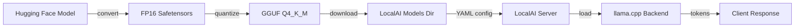
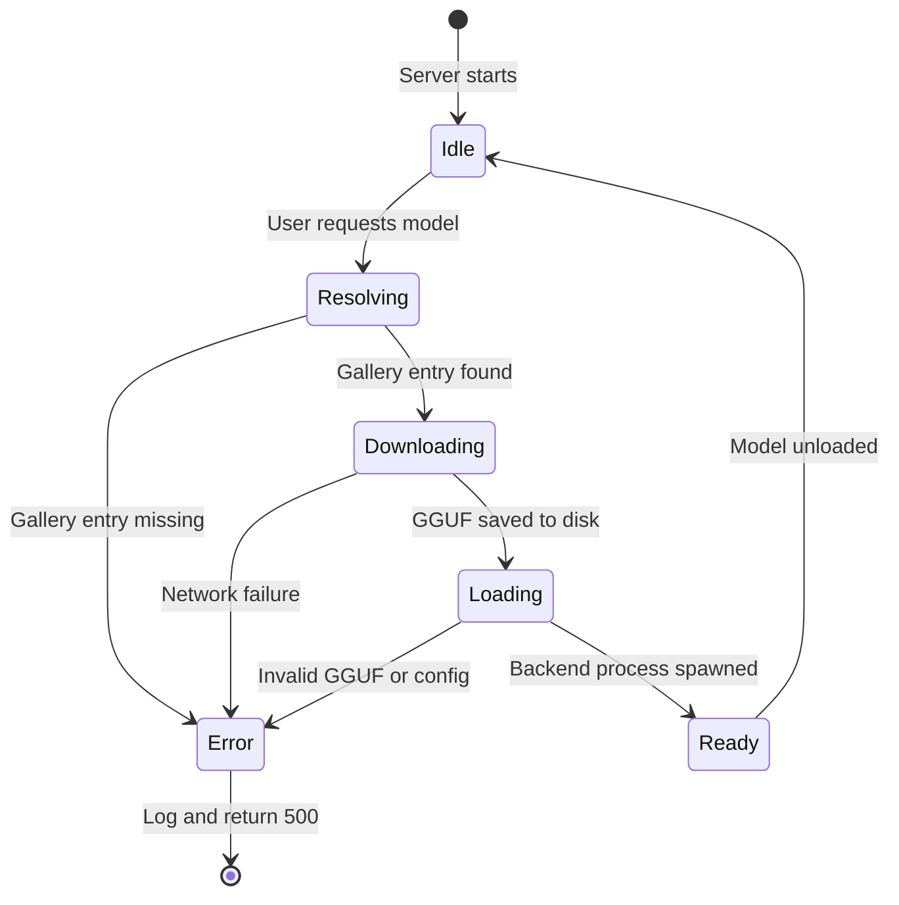

# Running LLMs Locally 🖥️🧠

## 🎯 Learning Objectives
- Master the complete workflow of downloading, configuring, and serving a local LLM via LocalAI
- Understand GGUF quantization formats and their trade-offs between size, speed, and accuracy
- Learn how LocalAI's Model Gallery automates model discovery and deployment
- Connect quantization theory to [[02 - Large Language Models]] and container deployment to [[Docker Profesional]]

---

## Introduction

Running a Large Language Model locally is no longer a novelty reserved for researchers with server farms. Thanks to quantization techniques and optimized inference engines like llama.cpp, a 7-billion-parameter model can now run interactively on a consumer laptop. LocalAI abstracts the mechanical complexity of this process—model downloading, format conversion, parameter tuning—into a declarative YAML-driven workflow. This module explains not just *how* to run LLMs locally, but *why* each step matters from a systems and ML perspective.

For ML engineers, local inference is a superpower. It eliminates network latency, removes token-pricing anxiety, and guarantees data sovereignty. However, it introduces new challenges: choosing the right quantization level, managing VRAM budgets, and balancing throughput against quality. If you have studied [[02 - Large Language Models]], you already understand transformer architecture. Here, we bridge theory to practice: how do you take a 32-bit floating-point model and compress it into a 4-bit integer format that fits inside 8GB of RAM without catastrophic quality loss? If you are fluent in [[Docker Profesional]], you will appreciate how LocalAI containerizes these heavy binaries so that "it works on my machine" becomes "it works on any machine with a GPU."

---

## Module 1: GGUF Quantization and Model Formats

### 1.1 Theoretical Foundation 🧠

Quantization is the process of reducing the numerical precision of model weights. A standard LLM is trained in 32-bit floating-point (FP32). At inference time, FP32 is overkill for most weights; research has shown that 4-bit integer representations (INT4) with carefully chosen scaling factors retain 95-99% of model capability. This matters because memory bandwidth—not compute—is often the bottleneck in inference. A 7B parameter model in FP32 requires 28GB of RAM, far beyond consumer hardware. Quantized to Q4_K_M, it shrinks to roughly 4.5GB, fitting comfortably on a modern laptop GPU.

The GGUF format (GGML Universal Format) is the successor to GGML. It is a single-file container that bundles metadata, vocabulary, and quantized tensors. Unlike ONNX or Safetensors, GGUF is designed specifically for llama.cpp and its descendants. The design motivation is **self-containment**: one file, one model, no external tokenizers or config JSONs. LocalAI consumes GGUF files directly, reading metadata such as context length and architecture type to auto-configure the backend.

```
┌─────────────────────────────────────────────┐
│  GGUF File Layout (ASCII)                   │
├─────────────────────────────────────────────┤
│                                             │
│   ┌─────────────────────────────────────┐   │
│   │  HEADER                             │   │
│   │  - magic number (GGUF)              │   │
│   │  - version (e.g., 3)                │   │
│   │  - tensor count                     │   │
│   │  - metadata kv map                  │   │
│   └─────────────────────────────────────┘   │
│   ┌─────────────────────────────────────┐   │
│   │  METADATA                           │   │
│   │  - general.architecture = "llama"   │   │
│   │  - llama.context_length = 8192      │   │
│   │  - llama.rope.freq_base = 10000     │   │
│   └─────────────────────────────────────┘   │
│   ┌─────────────────────────────────────┐   │
│   │  TENSOR DATA                        │   │
│   │  - token_embeddings (Q4_K_M)        │   │
│   │  - output_norm.weight (FP32)        │   │
│   │  - blk.0.attn_q.weight (Q4_K_M)     │   │
│   │  - blk.0.ffn_up.weight (Q5_K_M)     │   │
│   │  - ...                              │   │
│   └─────────────────────────────────────┘   │
│                                             │
│  WHY: all info needed to run the model is   │
│  inside one file, enabling one-click deploy │
│                                             │
└─────────────────────────────────────────────┘
```

### 1.2 Mental Model 📐

Think of quantization like converting a high-resolution photograph to a compressed JPEG. A 32-bit RAW image (FP32) contains every photon detail but is unwieldy. A 4-bit JPEG (Q4) discards imperceptible information, making it portable. The "K" and "M" suffixes in Q4_K_M are like choosing the JPEG quality slider: K means "K-quants" (improved 4-bit kernels), M means "medium" mixture (some layers get slightly higher precision to preserve quality).

```
┌─────────────────────────────────────────────┐
│  Quantization as Image Compression          │
├─────────────────────────────────────────────┤
│                                             │
│   FP32 model                                │
│   ┌─────────────┐                           │
│   │  RAW photo  │  28 GB                    │
│   │  (lossless) │                           │
│   └──────┬──────┘                           │
│          │                                  │
│          ▼                                  │
│   ┌─────────────┐                           │
│   │  Q4_K_M     │  4.5 GB                   │
│   │  (JPEG q80) │                           │
│   └──────┬──────┘                           │
│          │                                  │
│          ▼                                  │
│   ┌─────────────┐                           │
│   │  Q2_K       │  2.8 GB                   │
│   │  (JPEG q40) │  blocky, fast             │
│   └─────────────┘                           │
│                                             │
│   Trade-off: size & speed vs accuracy       │
│                                             │
└─────────────────────────────────────────────┘
```

### 1.3 Syntax and Semantics 📝

LocalAI uses a YAML file to describe each model. The YAML acts as a contract between the operator (you) and the Backend Manager.

```yaml
# models/llama-3-8b.yaml
name: llama-3-8b
# WHY: 'backend' tells the Manager which C++ binary to spawn.
# 'llama' maps to the llama.cpp grpc-server binary.
backend: llama
parameters:
  # WHY: 'model' is the relative path to the GGUF file inside MODELS_PATH.
  model: llama-3-8b-Q4_K_M.gguf
  # WHY: temperature controls sampling entropy.
  # 0.7 is a balanced default: creative but not chaotic.
  temperature: 0.7
  # WHY: max_tokens caps generation length to prevent runaway outputs.
  max_tokens: 2048
# WHY: context_size must match or be less than the model's training context.
# Exceeding it causes silent degradation (lost attention).
context_size: 8192
# WHY: f16 enables half-precision KV cache, saving VRAM during long contexts.
f16: true
# WHY: threads sets the number of CPU threads for tensor math.
# Rule of thumb: physical cores, not hyper-threads.
threads: 8
# WHY: gpu_layers offloads transformer layers to the GPU.
# 35 means the first 35 layers run on GPU; the rest on CPU.
# Increase until VRAM is ~90% utilized.
gpu_layers: 35
```

### 1.4 Visual Representation 🖼️




### 1.5 Application in ML/AI Systems 🤖

Real case: A clinical research group at a university hospital needed to run BioMistral-7B on an air-gapped workstation to summarize patient notes. The FP16 model required 14GB VRAM, exceeding their NVIDIA T4's 16GB once the OS overhead was accounted for. By converting to Q5_K_M (5.2GB), they retained medical terminology accuracy while freeing 10GB of VRAM for batch processing. LocalAI's YAML allowed them to set `gpu_layers: 30` and `context_size: 4096`, matching their average note length exactly.

| ML Use Case | This Concept | Impact |
|-------------|-------------|--------|
| Air-gapped healthcare | Q5_K_M GGUF | Runs on 16GB GPU with high accuracy |
| Raspberry Pi edge | Q2_K or Q3_K | Fits inside 4GB RAM |
| High-throughput API | Q4_K_M + gpu_layers=max | Maximum tokens/second per dollar |

### 1.6 Common Pitfalls ⚠️

⚠️ **Mismatching context_size** — Setting `context_size: 32768` on a model trained for 4096 does not magically extend its memory. It allocates more KV cache but the model was not trained to attend that far; quality degrades sharply beyond the native limit.

⚠️ **gpu_layers too high** — If `gpu_layers` exceeds available VRAM, llama.cpp falls back to CPU silently or crashes with CUDA out-of-memory. Monitor with `nvidia-smi` during load.

💡 **Mnemonic: "Q4 is the sweet door"** — Q4_K_M is the default recommendation for a reason: it is the front door most people should walk through. Only go to Q5 if quality is critical, Q2 if desperate.

### 1.7 Knowledge Check ❓

1. Why does GGUF bundle metadata and tensors in a single file instead of separate JSON + bin files?
2. If you increase `gpu_layers` from 20 to 40, what resource are you consuming more of, and what latency metric improves?
3. What happens to the KV cache when you set `f16: true` versus `f16: false`?

---

## Module 2: Model Gallery and Automated Deployment

### 2.1 Theoretical Foundation 🧠

The Model Gallery is LocalAI's answer to **model discoverability**. In the cloud era, switching models is as easy as changing an API string like `gpt-4` to `gpt-3.5-turbo`. Locally, switching models means downloading multi-gigabyte files, writing YAML configs, and restarting services. The gallery collapses this friction into a single command or API call. It is essentially a package manager (like `apt` or `brew`) but for neural network weights.

This concept draws from the "repository pattern" in software engineering. A gallery repository is a collection of YAML definitions hosted on GitHub. Each definition points to a GGUF download URL, specifies the backend, and includes default parameters. When you request a model by name, LocalAI resolves the name to a gallery entry, downloads the weights if missing, writes the local YAML, and loads the backend. This indirection layer means you can version-control your infrastructure: the gallery URL is the "source of truth," and your local server is the "deployment target."

```
┌─────────────────────────────────────────────┐
│  Model Gallery as Package Manager           │
├─────────────────────────────────────────────┤
│                                             │
│   User: "install llama-3-8b"                │
│         │                                   │
│         ▼                                   │
│   ┌──────────────┐                          │
│   │  LocalAI     │                          │
│   │  Gallery     │                          │
│   │  Resolver    │                          │
│   └──────┬───────┘                          │
│          │                                  │
│   ┌──────┴──────┐      ┌──────────────┐    │
│   │ Fetch YAML  │      │  Download    │    │
│   │ from GitHub │      │  GGUF file   │    │
│   └─────────────┘      └──────────────┘    │
│          │                    │             │
│          └────────┬───────────┘             │
│                   ▼                         │
│            ┌──────────┐                    │
│            │ Write    │                    │
│            │ local    │                    │
│            │ YAML     │                    │
│            └────┬─────┘                    │
│                 │                          │
│                 ▼                          │
│            ┌──────────┐                    │
│            │ Spawn    │                    │
│            │ Backend  │                    │
│            └──────────┘                    │
│                                             │
│  WHY: one command replaces manual steps     │
│                                             │
└─────────────────────────────────────────────┘
```

### 2.2 Mental Model 📐

Think of the Model Gallery as a **vending machine**. You press a button (model name), the machine looks up the slot (gallery YAML), retrieves the package (GGUF download), and dispenses it (loads the backend). You do not need to know where the warehouse is or how the delivery truck works.

```
┌─────────────────────────────────────────────┐
│  Vending Machine Analogy                    │
├─────────────────────────────────────────────┤
│                                             │
│   ┌─────────────────────────────────────┐   │
│   │         MODEL GALLERY               │   │
│   │   ┌───┐ ┌───┐ ┌───┐ ┌───┐        │   │
│   │   │ A │ │ B │ │ C │ │ D │  ...   │   │
│   │   └───┘ └───┘ └───┘ └───┘        │   │
│   │   llama  mistral  codellama  phi  │   │
│   └─────────────────────────────────────┘   │
│                                             │
│   User presses "B" (mistral-7b)             │
│         │                                   │
│         ▼                                   │
│   ┌──────────────┐                          │
│   │  Backend     │                          │
│   │  Loaded      │                          │
│   └──────────────┘                          │
│                                             │
│   WHY: abstraction hides download URLs,     │
│   checksums, and backend selection          │
│                                             │
└─────────────────────────────────────────────┘
```

### 2.3 Syntax and Semantics 📝

You can interact with the gallery via the LocalAI CLI or HTTP API.

```bash
# WHY: this command tells LocalAI to resolve 'llama-3-8b' against
# the default gallery repository, download the GGUF, and write the YAML.
local-ai models install llama-3-8b

# WHY: the HTTP endpoint allows programmatic model provisioning
# from CI/CD pipelines or admin dashboards.
curl http://localhost:8080/models/apply -H "Content-Type: application/json" \
  -d '{
    "url": "github:go-skynet/model-gallery/base.yaml",
    "name": "llama-3-8b"
  }'
```

```yaml
# Example gallery entry (simplified)
name: "llama-3-8b"
# WHY: 'overrides' merge with the base template so you only specify deltas.
overrides:
  parameters:
    model: llama-3-8b-Q4_K_M.gguf
  files:
    # WHY: 'uri' is the download source. LocalAI caches this in MODELS_PATH.
    - filename: "llama-3-8b-Q4_K_M.gguf"
      uri: "https://huggingface.co/TheBloke/Llama-3-8B-GGUF/resolve/main/llama-3-8b-Q4_K_M.gguf"
```

### 2.4 Visual Representation 🖼️




### 2.5 Application in ML/AI Systems 🤖

Real case: An AI devtools company runs a multi-tenant LocalAI cluster where each customer gets a different fine-tuned model. Their provisioning pipeline calls `POST /models/apply` with a customer-specific gallery URL. This allows them to version-control each customer's model config in a private GitHub repo. When a customer upgrades, they merge a PR to the gallery repo, and the CI pipeline triggers a rolling update across the LocalAI nodes. Deployment time for a new model dropped from 45 minutes of manual SCP and YAML editing to 3 minutes of automated gallery resolution.

| ML Use Case | This Concept | Impact |
|-------------|-------------|--------|
| Multi-tenant SaaS | Per-tenant gallery repos | GitOps for model weights |
| CI/CD staging | Gallery URL per branch | Automatic model promotion |
| Air-gapped mirror | Internal gallery server | Works without internet |

### 2.6 Common Pitfalls ⚠️

⚠️ **Gallery URL drift** — If the upstream Hugging Face URL changes, the gallery YAML breaks. Always pin to a specific commit or use a mirror you control.

⚠️ **Ignoring disk space** — A gallery with 20 models can consume 100GB. LocalAI does not auto-evict. Set up a cron job or volume monitoring.

💡 **Tip: Gallery as Infrastructure-as-Code** — Store your gallery overrides in the same Git repo as your Docker Compose files. This makes model configs reviewable and auditable.

### 2.7 Knowledge Check ❓

1. What is the difference between a gallery YAML and a local model YAML?
2. Why does LocalAI separate "gallery resolution" from "backend loading" into two distinct phases?
3. How would you automate model deployment in a Kubernetes environment using the gallery HTTP endpoint?

---

## 📦 Compression Code

```go
// Compression: running LLMs locally in one Go-ish narrative
package main

import "fmt"

// To run an LLM locally:
// 1. Quantize: FP32 -> Q4_K_M GGUF (save RAM)
// 2. Configure: YAML defines backend, threads, gpu_layers
// 3. Deploy: Gallery resolves name -> download -> load
// 4. Serve: OpenAI-compatible REST on port 8080

func main() {
	fmt.Println("LLM locally = Quantize + YAML + Gallery + Serve")
}
```

## 🎯 Documented Project

### Description

Build a local chat server that automatically provisions a Mistral-7B model via the LocalAI gallery, serves it through an OpenAI-compatible endpoint, and exposes a web UI for testing. This project ties together quantization awareness, YAML configuration, and gallery automation.

### Functional Requirements

1. On first startup, the server must automatically download Mistral-7B-Instruct-v0.2 Q4_K_M from the gallery if not present.
2. The YAML configuration must set `gpu_layers` dynamically based on available VRAM detected at runtime.
3. The `/v1/chat/completions` endpoint must stream tokens using Server-Sent Events (SSE).
4. A simple HTML page at `/` must allow users to chat with the model without installing any client SDK.
5. Logs must print per-request latency and tokens-per-second metrics.

### Main Components

- **Gallery Resolver** — Fetches model definitions from a remote repository
- **VRAM Detector** — Runs `nvidia-smi` or `rocm-smi` to set `gpu_layers`
- **YAML Generator** — Writes runtime config to `models/` directory
- **LocalAI Core** — Existing Go server binary
- **Web UI** — Single HTML file with vanilla JavaScript calling the API

### Success Metrics

- First startup completes model download and is ready for chat within 10 minutes on a 100Mbps connection
- `gpu_layers` is within 2 layers of the optimal value for the detected GPU
- Streaming latency under 50ms between tokens on an RTX 3060
- Web UI works in Chrome and Firefox without extensions

### References

- Official docs: https://localai.io/docs/getting-started/run-locally/
- Paper/library: https://github.com/ggerganov/llama.cpp/blob/master/gguf.md
- Docker guide: [[Docker Profesional]]
