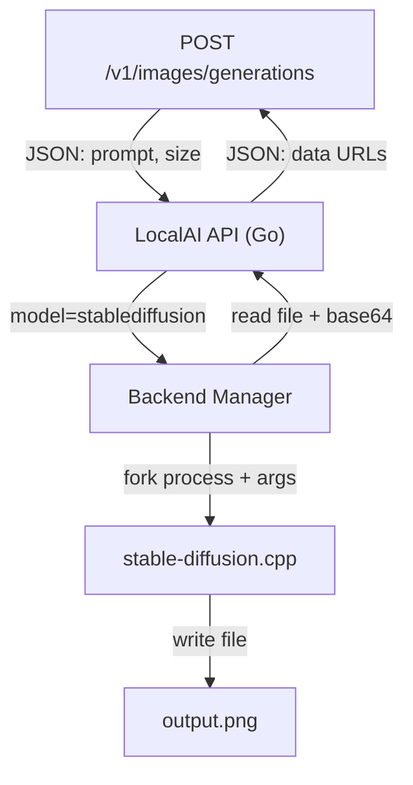
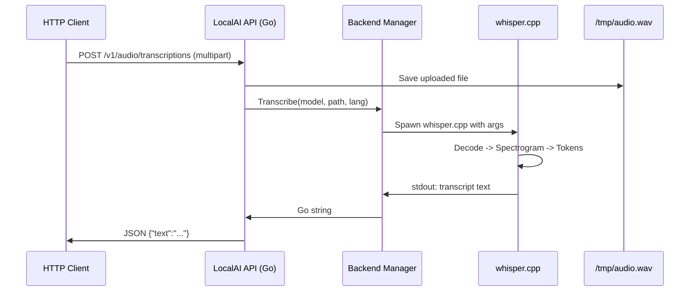

# Image Generation and Audio Transcription 🎨🎙️

## 🎯 Learning Objectives
- Understand how LocalAI extends beyond text to multimodal inference: images and audio
- Learn the architecture of stable-diffusion.cpp and whisper.cpp backends
- Master the OpenAI-compatible endpoints for `/v1/images/generations` and `/v1/audio/transcriptions`
- Connect multimodal pipelines to [[02 - Large Language Models]] vision/audio concepts and [[Docker Profesional]] for GPU scheduling

---

## Introduction

Modern AI applications are not limited to text. They generate marketing imagery from prompts, transcribe customer support calls, and synthesize narration for videos. LocalAI treats these modalities as first-class citizens by wrapping specialized C++ backends—stable-diffusion.cpp for images and whisper.cpp for audio—behind the same OpenAI-compatible REST surface. This module explains why multimodal local inference is harder than text-only inference, how LocalAI abstracts that complexity, and what you need to know to deploy these backends in production.

Multimodal models are fundamentally different from LLMs in their resource profiles. An image generation model performs iterative denoising across latent space, a process that is far more GPU-intensive than autoregressive token generation. An audio transcription model processes spectrograms through convolutional and transformer layers, demanding different batching strategies. If you have studied [[02 - Large Language Models]], you know that transformers generalize across modalities, but the inference engines and optimization kernels do not. LocalAI's value proposition is that you do not need to learn three separate server protocols; you learn one REST schema and let the Backend Manager handle the rest.

---

## Module 1: Image Generation with stable-diffusion.cpp

### 1.1 Theoretical Foundation 🧠

Diffusion models generate images by reversing a noise-corruption process. During training, Gaussian noise is progressively added to images; the model learns to predict the noise and subtract it. At inference time, the model starts from pure noise and iteratively denoises it into a coherent image guided by a text prompt (CLIP embeddings). This is computationally expensive: a single 512x512 image may require 20-50 denoising steps, each involving a full forward pass through a U-Net with billions of parameters.

stable-diffusion.cpp is a C++ reimplementation of Stable Diffusion optimized for CPU and GPU inference. It uses the GGML tensor library (the predecessor to GGUF's engine) to execute convolutions and attention layers efficiently. LocalAI wraps this binary so that a client calling `POST /v1/images/generations` with a prompt like "a futuristic city in neon colors" receives a PNG file in return—exactly as OpenAI's DALL-E would, but without leaving the local network. The design motivation is **modality parity**: the API consumer should not care whether the backend is an LLM or a diffusion model; the JSON schema is the same.

```
┌─────────────────────────────────────────────┐
│  Diffusion Inference Loop (ASCII)           │
├─────────────────────────────────────────────┤
│                                             │
│   Step 0: Random noise latent (64x64x4)     │
│         │                                   │
│         ▼                                   │
│   ┌──────────────┐                          │
│   │ U-Net predicts│  "subtract this noise"   │
│   │ noise amount  │                          │
│   └──────┬───────┘                          │
│          │                                  │
│         Step N (e.g., 20)                   │
│         │                                   │
│         ▼                                   │
│   ┌──────────────┐                          │
│   │ VAE Decoder  │  "convert latent to pixel│
│   │ (512x512x3)  │   space"                 │
│   └──────┬───────┘                          │
│          │                                  │
│         ▼                                   │
│      PNG image                              │
│                                             │
│   WHY: each step is a full neural net pass. │
│   Fewer steps = faster but lower quality.   │
│                                             │
└─────────────────────────────────────────────┘
```

### 1.2 Mental Model 📐

Think of image generation as **sculpting from marble**. You start with a block of noise (the raw stone). The diffusion model is the sculptor who, guided by your prompt (the blueprint), chips away noise step by step until the statue (image) emerges. The CFG scale (classifier-free guidance) is like how strictly the sculptor follows the blueprint: higher values mean stricter adherence but can look artificial.

```
┌─────────────────────────────────────────────┐
│  Sculpting from Noise                       │
├─────────────────────────────────────────────┤
│                                             │
│   Prompt: "cyberpunk cat"                   │
│         │                                   │
│         ▼                                   │
│   ┌──────────────┐                          │
│   │  Noise Block │  Step 0                  │
│   │  ██████████  │                          │
│   └──────┬───────┘                          │
│          │                                  │
│         ▼                                   │
│   ┌──────────────┐                          │
│   │  Rough Shape │  Step 5                  │
│   │  ▓▓░░▓▓░░▓▓  │                          │
│   └──────┬───────┘                          │
│          │                                  │
│         ▼                                   │
│   ┌──────────────┐                          │
│   │  Fine Detail │  Step 20                 │
│   │  🐱🌃💡       │                          │
│   └──────────────┘                          │
│                                             │
│   WHY: you cannot jump from noise to cat.   │
│   Iteration is inherent to diffusion.       │
│                                             │
└─────────────────────────────────────────────┘
```

### 1.3 Syntax and Semantics 📝

```yaml
# models/sd-xl.yaml
name: stablediffusion
# WHY: 'backend: diffusers' or 'backend: stablediffusion' tells LocalAI
# which binary to spawn. 'diffusers' is Python-based; 'stablediffusion' is C++.
backend: stablediffusion
parameters:
  model: sd-xl-base_1.0.safetensors
# WHY: diffusion models use a different YAML key 'diffusers' for scheduler
# and VAE settings because the parameter space is distinct from LLMs.
diffusers:
  # WHY: cfg_scale controls prompt adherence. 7-8 is the sweet spot.
  cfg_scale: 7
  # WHY: steps trades quality for speed. 20-25 is standard for SDXL.
  step: 25
  # WHY: seed ensures reproducibility. Omit for random.
  seed: 42
```

```go
// pkg/api/images.go (simplified)
package api

import "net/http"

// ImageGenerationRequest mirrors OpenAI's DALL-E request.
// WHY: same JSON shape so existing clients (LangChain, etc.) work unmodified.
type ImageGenerationRequest struct {
	Prompt string `json:"prompt"`
	N      int    `json:"n"`      // number of images
	Size   string `json:"size"`   // e.g., "1024x1024"
}

func (a *API) HandleImageGenerations(w http.ResponseWriter, r *http.Request) {
	var req ImageGenerationRequest
	// ... decode JSON ...

	// WHY: delegate to Backend Manager, which routes to stable-diffusion.cpp.
	// The Manager handles binary path, args, and output PNG collection.
	paths, err := a.BackendManager.GenerateImage(req.Prompt, req.Size)
	if err != nil {
		http.Error(w, err.Error(), http.StatusInternalServerError)
		return
	}

	// WHY: return JSON with base64 data URLs, identical to OpenAI format.
	// Clients decode these directly into  tags.
	writeImageJSON(w, paths)
}
```

### 1.4 Visual Representation 🖼️




### 1.5 Application in ML/AI Systems 🤖

Real case: A digital marketing agency built an internal tool that generates ad variants from product descriptions. Using LocalAI with stable-diffusion.cpp and a LoRA fine-tuned on their brand style, they generate 100 image candidates per campaign without paying DALL-E per-image fees. Each image costs only electricity and GPU amortization. Their creative team reviews the outputs in a shared folder, cutting asset production time from 3 days to 3 hours.

| ML Use Case | This Concept | Impact |
|-------------|-------------|--------|
| Ad creative generation | SDXL via LocalAI | 10x cost reduction vs cloud APIs |
| Game asset prototyping | img2img pipeline | Iterative art direction locally |
| Privacy-sensitive design | No image leaves premises | GDPR-compliant generative art |

### 1.6 Common Pitfalls ⚠️

⚠️ **VRAM exhaustion with high resolution** — A 1024x1024 SDXL image needs ~8GB VRAM. Running two parallel requests on an 8GB card causes silent fallback to CPU or OOM kills. Use `N: 1` and queue requests.

⚠️ **Wrong scheduler for the model** — SD 1.5 uses PNDM/DDIM; SDXL prefers Euler a. The scheduler name in YAML must match what the checkpoint was trained with, or colors will look washed out.

💡 **Mnemonic: "CFG 7, Steps 20, Seed 42"** — These are the "safe defaults" for almost any Stable Diffusion model. Memorize them as your starting point.

### 1.7 Knowledge Check ❓

1. Why does image generation require a VAE decoder step that LLM inference does not?
2. If you double the `step` count from 20 to 40, which resource consumption increases linearly and which increases sub-linearly?
3. How does LocalAI ensure that a Python client written for DALL-E works with stable-diffusion.cpp without code changes?

---

## Module 2: Audio Transcription with whisper.cpp

### 2.1 Theoretical Foundation 🧠

Automatic Speech Recognition (ASR) transforms raw audio waveforms into text. Whisper, developed by OpenAI, is an encoder-decoder transformer trained on 680,000 hours of multilingual audio. It processes audio by first converting the waveform into a log-Mel spectrogram—a 2D representation where the x-axis is time and the y-axis is frequency. This spectrogram is fed into a transformer encoder, and a decoder autoregressively predicts text tokens.

whisper.cpp is a C++ port by Georgi Gerganov (creator of llama.cpp) that optimizes Whisper for CPU and GPU inference. It uses the same GGML backend as llama.cpp, meaning quantized Whisper models run on modest hardware. LocalAI wraps whisper.cpp so that a client calling `POST /v1/audio/transcriptions` with an MP3 file receives a JSON transcript—identical to OpenAI's Whisper API. The design motivation is **unified modality access**: your application should not need a separate audio SDK; the same HTTP client that chats with an LLM should also transcribe podcasts.

```
┌─────────────────────────────────────────────┐
│  Whisper Inference Pipeline (ASCII)         │
├─────────────────────────────────────────────┤
│                                             │
│   Audio File (MP3/WAV)                      │
│         │                                   │
│         ▼                                   │
│   ┌──────────────┐                          │
│   │  Decode to   │                          │
│   │  PCM 16kHz   │                          │
│   └──────┬───────┘                          │
│          │                                  │
│         ▼                                   │
│   ┌──────────────┐                          │
│   │  Log-Mel     │  2D spectrogram          │
│   │  Spectrogram │  (time x freq bins)      │
│   └──────┬───────┘                          │
│          │                                  │
│         ▼                                   │
│   ┌──────────────┐                          │
│   │  Encoder     │  Transformer blocks      │
│   │  (CNN + Attn)│  extract audio features  │
│   └──────┬───────┘                          │
│          │                                  │
│         ▼                                   │
│   ┌──────────────┐                          │
│   │  Decoder     │  Autoregressive text     │
│   │  (tokens)    │  token prediction        │
│   └──────┬───────┘                          │
│          │                                  │
│         ▼                                   │
│   "The quick brown fox..."                  │
│                                             │
│   WHY: spectrogram acts as a bridge between │
│   continuous audio and discrete tokens.     │
│                                             │
└─────────────────────────────────────────────┘
```

### 2.2 Mental Model 📐

Think of whisper.cpp as a **stenographer who speaks every language**. You hand them an audio recording (the dictation). They first listen for the overall "shape" of the sound (spectrogram), then mentally translate that shape into words (encoder-decoder), and finally type it out (text tokens). The quantized model is like the stenographer using shorthand—they write faster and need less desk space, but occasionally mishear a word.

```
┌─────────────────────────────────────────────┐
│  Stenographer Analogy                       │
├─────────────────────────────────────────────┤
│                                             │
│   Audio File = Courtroom Dictation          │
│         │                                   │
│         ▼                                   │
│   ┌──────────────┐                          │
│   │  Spectrogram │  "I hear pitch changes"  │
│   └──────┬───────┘                          │
│          │                                  │
│         ▼                                   │
│   ┌──────────────┐                          │
│   │  Encoder     │  "This sounds like       │
│   │  (listening) │   English, technical"     │
│   └──────┬───────┘                          │
│          │                                  │
│         ▼                                   │
│   ┌──────────────┐                          │
│   │  Decoder     │  "The defendant said..." │
│   │  (typing)    │                          │
│   └──────┬───────┘                          │
│          │                                  │
│         ▼                                   │
│   Transcript.txt                            │
│                                             │
│   WHY: the encoder 'understands' audio;     │
│   the encoder 'understands' audio;          │
│   the decoder 'writes' text.                │
│                                             │
└─────────────────────────────────────────────┘
```

### 2.3 Syntax and Semantics 📝

```yaml
# models/whisper-base.yaml
name: whisper-base
# WHY: 'backend: whisper' maps to the whisper.cpp grpc-server binary.
backend: whisper
parameters:
  model: ggml-base.bin
  # WHY: 'language' hints the tokenizer; 'auto' detects from first 30s.
  language: auto
  # WHY: 'translate: true' outputs English even if input is Spanish.
  translate: false
```

```go
// pkg/api/audio.go (simplified)
package api

import (
	"io"
	"mime/multipart"
	"net/http"
)

// HandleAudioTranscriptions mirrors OpenAI's POST /v1/audio/transcriptions.
// WHY: multipart/form-data because audio files are binary and large.
func (a *API) HandleAudioTranscriptions(w http.ResponseWriter, r *http.Request) {
	// WHY: ParseMultipartForm with 32MB memory limit; rest goes to temp disk.
	err := r.ParseMultipartForm(32 << 20)
	if err != nil {
		http.Error(w, "file too large", http.StatusBadRequest)
		return
	}

	file, header, err := r.FormFile("file")
	if err != nil {
		http.Error(w, "missing file", http.StatusBadRequest)
		return
	}
	defer file.Close()

	// WHY: save to disk because whisper.cpp reads file paths, not stdin.
	tmpPath := "/tmp/" + header.Filename
	out, _ := os.Create(tmpPath)
	io.Copy(out, file)
	out.Close()

	model := r.FormValue("model") // "whisper-base"
	language := r.FormValue("language")

	// WHY: delegate to Backend Manager which spawns whisper.cpp process.
	text, err := a.BackendManager.Transcribe(model, tmpPath, language)
	if err != nil {
		http.Error(w, err.Error(), http.StatusInternalServerError)
		return
	}

	// WHY: return JSON identical to OpenAI: {"text": "..."}
	json.NewEncoder(w).Encode(map[string]string{"text": text})
}
```

### 2.4 Visual Representation 🖼️




### 2.5 Application in ML/AI Systems 🤖

Real case: A podcast production company receives 50 hours of raw interview audio per week. They built an internal pipeline where OBS Studio exports FLAC files to a Samba share watched by a LocalAI container running whisper.cpp. Transcripts appear in a shared Google Drive folder within minutes of upload. The company previously paid $0.006 per minute to a cloud ASR provider; their LocalAI instance on a used RTX 3090 paid for itself in 3 months. Language detection (`language: auto`) handles mixed English/Spanish interviews without configuration changes.

| ML Use Case | This Concept | Impact |
|-------------|-------------|--------|
| Podcast transcription | whisper.cpp via LocalAI | 90% cost reduction |
| Meeting minutes | Real-time transcription stream | Privacy-preserving notes |
| Call center analytics | Batch transcription + LLM summarization | End-to-end local pipeline |

### 2.6 Common Pitfalls ⚠️

⚠️ **Ignoring sample rate** — whisper.cpp expects 16kHz mono. If you send 44.1kHz stereo, transcription quality degrades. Always resample with `ffmpeg -ar 16000 -ac 1` before upload.

⚠️ **Long files without segmentation** — whisper.cpp processes audio in 30-second chunks. A 2-hour file works, but memory usage grows with total duration. Split into 10-minute segments for stability.

💡 **Tip: `ffmpeg` pre-processing** — Create a shell alias: `whisper-prep() { ffmpeg -i "$1" -ar 16000 -ac 1 -c:a pcm_s16le output.wav; }`. This fixes 90% of audio quality issues before they reach the model.

### 2.7 Knowledge Check ❓

1. Why does whisper.cpp read audio from a file path rather than stdin, unlike some text backends?
2. What is the role of the log-Mel spectrogram in the Whisper pipeline, and why is it 2D?
3. If you set `translate: true` on a French audio file, what language will the output text be in?

---

## 📦 Compression Code

```go
// Compression: multimodal LocalAI distilled
package main

import "fmt"

// LocalAI multimodal in one idea:
// 1. Images: POST /v1/images/generations -> stable-diffusion.cpp (diffusion)
// 2. Audio:  POST /v1/audio/transcriptions -> whisper.cpp (spectrogram + transformer)
// 3. Both return OpenAI-compatible JSON so clients need zero changes.

func main() {
	fmt.Println("Multimodal = diffusion for eyes + spectrograms for ears + one REST face")
}
```

## 🎯 Documented Project

### Description

Build a local media processing pipeline that accepts an audio file, transcribes it with whisper.cpp, uses the transcript as a prompt for stable-diffusion.cpp image generation, and returns both text and image in a single API response. This project demonstrates chaining multimodal backends through LocalAI's unified interface.

### Functional Requirements

1. `POST /v1/media/process` accepts a multipart upload of an audio file.
2. The server transcribes the audio using whisper.cpp via LocalAI's backend.
3. The first sentence of the transcript is sent as a prompt to stable-diffusion.cpp.
4. The response JSON contains both `transcript` and `image_url` (base64 PNG).
5. The entire pipeline must complete within 60 seconds for a 30-second audio clip on an RTX 3060.

### Main Components

- **HTTP Handler** — Accepts multipart, orchestrates the pipeline
- **Transcription Stage** — Calls Backend Manager -> whisper.cpp
- **Prompt Extraction** — Simple sentence tokenizer in Go
- **Image Generation Stage** — Calls Backend Manager -> stable-diffusion.cpp
- **Response Composer** — Merges text and base64 image into JSON

### Success Metrics

- Audio transcription WER (Word Error Rate) under 10% on clean English speech
- Generated image is semantically related to the transcript prompt
- Pipeline latency under 60s for 30s audio on consumer GPU
- Zero client-side dependencies beyond `curl`

### References

- Official docs: https://localai.io/docs/features/audio-to-text/
- Paper/library: https://github.com/ggerganov/whisper.cpp
- Stable Diffusion paper: https://arxiv.org/abs/2112.10752
- Docker GPU scheduling: [[Docker Profesional]]
