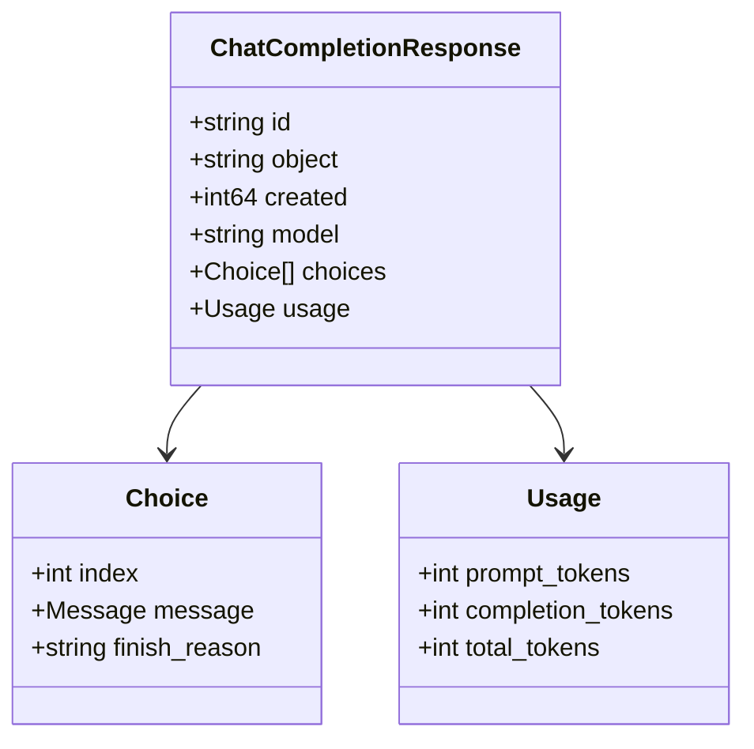
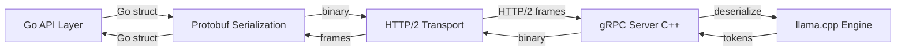

# API Compatibility and Backend Management 🔌⚙️

## 🎯 Learning Objectives
- Understand how LocalAI maintains exact OpenAI API parity across endpoints, status codes, and error schemas
- Learn the internals of Backend Manager: process lifecycle, health checks, and gRPC protobuf contracts
- Master dynamic model loading, unloading, and hot-swapping without server restarts
- Connect backend lifecycle management to [[01 - Go Fundamentals]] interfaces and [[Docker Profesional]] container signals

---

## Introduction

API compatibility is not merely about matching JSON fields; it is about matching semantics, failure modes, and streaming behavior. When a developer switches from `api.openai.com` to a LocalAI instance, they expect the same HTTP status codes, the same SSE chunk format, and the same rate-limit headers. This module dives into the mechanics of that parity and the backend management system that makes it possible. We will explore how LocalAI's Backend Manager acts as a process supervisor, how gRPC bridges the Go/C++ divide, and why dynamic model loading is essential for multi-tenant deployments.

From a systems perspective, LocalAI is a **polyglot orchestrator**. It coordinates binaries written in Go, C, and C++, each with different memory models, crash behaviors, and concurrency assumptions. If you have studied [[01 - Go Fundamentals]], you will recognize how Go interfaces allow the API layer to treat all backends uniformly despite their heterogeneous implementations. If you have operational experience from [[Docker Profesional]], you will appreciate how signal handling and graceful shutdown prevent data loss when a backend process is terminated.

---

## Module 1: OpenAI API Parity

### 1.1 Theoretical Foundation 🧠

API parity is a form of **behavioral subtyping**. In object-oriented terms, LocalAI is a subtype of the OpenAI API. Clients that depend on the supertype (OpenAI) should work unchanged when given a subtype (LocalAI). This is harder than it sounds because the OpenAI API includes not just request/response schemas, but also undocumented conventions: the exact format of SSE chunks, the presence of `id` and `created` timestamps, the structure of `usage` metadata, and the wording of error messages.

The theoretical underpinning is Postel's Law: "Be conservative in what you send, be liberal in what you accept." LocalAI must emit responses that are at least as strict as OpenAI's, while accepting inputs that existing clients produce. This means every field in the JSON must be considered. For example, OpenAI's chat completion response includes a `system_fingerprint` field. LocalAI generates a deterministic fingerprint based on its version and backend commit hash, ensuring that clients relying on this field for caching do not break. The design motivation is **ecosystem inheritance**: by perfectly mimicking the incumbent, LocalAI gains access to LangChain, AutoGPT, OpenWebUI, and thousands of other tools without writing a single adapter.

```
┌─────────────────────────────────────────────┐
│  Behavioral Subtyping in APIs               │
├─────────────────────────────────────────────┤
│                                             │
│   ┌─────────────────────────────┐           │
│   │      OpenAI API Spec        │           │
│   │  (supertype / contract)     │           │
│   └─────────────┬───────────────┘           │
│                 │                           │
│      ┌──────────┼──────────┐                │
│      ▼          ▼          ▼                │
│   ┌───────┐  ┌───────┐  ┌───────┐          │
│   │LocalAI│  │Azure  │  │Other  │          │
│   │Server │  │OpenAI │  │Compat │          │
│   └───────┘  └───────┘  └───────┘          │
│                                             │
│   WHY: any client expecting the supertype   │
│   works with all subtypes. This is the      │
│   entire value proposition of compatibility.│
│                                             │
└─────────────────────────────────────────────┘
```

### 1.2 Mental Model 📐

Think of API parity as **impersonation**. A skilled impersonator does not just wear the same clothes (JSON fields); they mimic the voice (SSE timing), the mannerisms (status codes), and the catchphrases (error messages). If the impersonator is even slightly off, the audience (client libraries) notices immediately.

```
┌─────────────────────────────────────────────┐
│  API Impersonation Checklist                │
├─────────────────────────────────────────────┤
│                                             │
│   Costume  (JSON schema)        ✅ fields   │
│   Voice    (SSE format)         ✅ chunks   │
│   Walk     (status codes)       ✅ 200/400 │
│   Catchphrases (error msgs)     ✅ strings  │
│   Props    (headers)            ✅ X-Rate-  │
│                                             │
│   One missing element breaks the illusion.  │
│                                             │
└─────────────────────────────────────────────┘
```

### 1.3 Syntax and Semantics 📝

LocalAI's response structs are meticulously tagged to match OpenAI.

```go
// pkg/api/types.go
package api

// ChatCompletionResponse mirrors OpenAI's response exactly.
// WHY: every field must be present (even if zero-valued) so that
// client JSON decoders do not fail on missing keys.
type ChatCompletionResponse struct {
	ID      string `json:"id"`      // WHY: unique per request; clients use for dedup
	Object  string `json:"object"`  // "chat.completion"
	Created int64  `json:"created"` // WHY: Unix timestamp; some clients sort by this
	Model   string `json:"model"`   // echoed from request
	Choices []Choice `json:"choices"`
	Usage   Usage  `json:"usage"`   // WHY: billing/cost tracking in client apps
}

type Choice struct {
	Index   int     `json:"index"`
	Message Message `json:"message"`
	// WHY: finish_reason tells clients when to stop expecting more tokens.
	// "stop" = natural end, "length" = max_tokens hit.
	FinishReason string `json:"finish_reason"`
}

type Usage struct {
	PromptTokens     int `json:"prompt_tokens"`
	CompletionTokens int `json:"completion_tokens"`
	TotalTokens      int `json:"total_tokens"`
}

// StreamChunk is sent for SSE streaming endpoints.
// WHY: the 'data: ' prefix and double-newline suffix are part of the
// SSE protocol, not just LocalAI convention. Omitting them breaks EventSource.
type StreamChunk struct {
	ID      string  `json:"id"`
	Object  string  `json:"object"` // "chat.completion.chunk"
	Created int64   `json:"created"`
	Model   string  `json:"model"`
	Choices []DeltaChoice `json:"choices"`
}

// WriteSSE encodes a chunk with the mandatory SSE framing.
func WriteSSE(w http.ResponseWriter, chunk StreamChunk) {
	// WHY: "data: " prefix is required by the SSE spec (text/event-stream).
	fmt.Fprintf(w, "data: %s\n\n", mustJSON(chunk))
	// WHY: flush immediately so the client receives tokens in real time.
	if f, ok := w.(http.Flusher); ok {
		f.Flush()
	}
}
```

### 1.4 Visual Representation 🖼️




### 1.5 Application in ML/AI Systems 🤖

Real case: A customer support automation company built their platform on LangChain and OpenAI. When a large enterprise client demanded on-premise deployment for data residency, they feared a complete rewrite. By deploying LocalAI and changing only the `base_url` in their LangChain initialization, the entire stack—chains, agents, memory buffers—worked identically. The only visible difference was the `model` field in requests changed from `gpt-4` to `llama-3-70b`. Engineering migration time: 2 hours instead of 2 months.

| ML Use Case | This Concept | Impact |
|-------------|-------------|--------|
| LangChain migration | Exact response schema | Zero chain rewrites |
| Streaming chat UI | SSE chunk parity | EventSource works unmodified |
| Token cost dashboards | Usage object structure | Existing billing code works |

### 1.6 Common Pitfalls ⚠️

⚠️ **Missing `finish_reason` on final chunk** — Some clients wait for `"finish_reason": "stop"` to close the stream. If LocalAI omits this, the client hangs forever.

⚠️ **Incorrect `created` timestamp** — If the timestamp is in milliseconds instead of seconds, client sorting logic breaks. OpenAI uses Unix seconds.

💡 **Mnemonic: "ICU" for responses** — `ID`, `Created`, `Usage`. Always include these three fields, even if you have to fake `usage` because the backend does not report token counts.

### 1.7 Knowledge Check ❓

1. Why does LocalAI include a `system_fingerprint` field even though it is not a hosted cloud service?
2. What is the exact SSE framing required for streaming, and why is the double newline necessary?
3. If a client parses `Usage.TotalTokens` to estimate cost, what happens if LocalAI omits this field?

---

## Module 2: gRPC and Protobuf Inter-Process Communication

### 2.1 Theoretical Foundation 🧠

LocalAI's backends are written in C and C++ for performance, while the orchestrator is written in Go for productivity. These languages cannot share memory safely; they must communicate via Inter-Process Communication (IPC). LocalAI uses gRPC over Unix domain sockets (or TCP localhost) for this boundary. gRPC is a high-performance RPC framework built on HTTP/2 and protobuf. Protobuf (Protocol Buffers) is a binary serialization format that is smaller and faster than JSON.

The choice of gRPC over REST for internal communication is deliberate. REST is human-readable but verbose; gRPC is machine-efficient and supports bi-directional streaming. For LLM inference, streaming is critical: the backend generates one token at a time, and the user wants to see words appear in real time. gRPC's bi-directional streams allow the backend to push tokens to the Manager as they are produced, rather than buffering the entire response. This design motivation is **latency reduction through streaming**: every millisecond of buffering is a millisecond of user-visible delay.

```
┌─────────────────────────────────────────────┐
│  IPC Choices: REST vs gRPC vs Shared Memory │
├─────────────────────────────────────────────┤
│                                             │
│   REST (JSON over HTTP/1.1)                 │
│   ├─ Human readable                         │
│   ├─ Easy to debug with curl                │
│   └─ High overhead, no native streaming     │
│                                             │
│   gRPC (protobuf over HTTP/2)               │
│   ├─ Binary, compact                        │
│   ├─ Native bi-di streaming                 │
│   └─ Requires .proto definitions            │
│                                             │
│   Shared Memory                             │
│   ├─ Fastest                                │
│   ├─ Complex synchronization                │
│   └─ Go/C++ interop is fragile              │
│                                             │
│   LocalAI chose gRPC because it balances    │
│   performance and language safety.          │
│                                             │
└─────────────────────────────────────────────┘
```

### 2.2 Mental Model 📐

Think of gRPC as a ** pneumatic tube system** in a bank. The teller (Go API layer) puts a request capsule (protobuf message) into the tube (HTTP/2 stream). The capsule travels to the vault (C++ backend), where the vault worker processes it and sends response capsules back through the same tube. Multiple capsules can be in transit simultaneously because HTTP/2 multiplexes streams over one connection.

```
┌─────────────────────────────────────────────┐
│  Pneumatic Tube System (gRPC)               │
├─────────────────────────────────────────────┤
│                                             │
│   Teller (Go)                               │
│   ┌──────────┐                              │
│   │ Request  │──►──┐                        │
│   │ Capsule  │     │                        │
│   └──────────┘     │                        │
│                    ▼                        │
│            ┌──────────┐                     │
│            │  Tube    │  HTTP/2 stream      │
│            │(gRPC)    │                     │
│            └────┬─────┘                     │
│                 │                           │
│                 ▼                           │
│   Vault (C++)   ┌──────────┐               │
│                 │ Response │──►── Teller   │
│                 │ Capsule  │                │
│                 └──────────┘                │
│                                             │
│   WHY: one tube, many capsules, no waiting  │
│                                             │
└─────────────────────────────────────────────┘
```

### 2.3 Syntax and Semantics 📝

```protobuf
// proto/backend.proto
syntax = "proto3";

package backend;

// WHY: one service per modality keeps the interface clean and versionable.
service LLM {
  // WHY: streaming returns tokens as they are generated, minimizing latency.
  rpc PredictStream(PredictOptions) returns (stream Reply);
  rpc Embedding(EmbedOptions) returns (EmbeddingResult);
}

message PredictOptions {
  string prompt = 1;
  int32 max_tokens = 2;
  float temperature = 3;
  // WHY: repeated string for chat templates with multiple turns.
  repeated string stop_prompts = 4;
}

message Reply {
  string message = 1;
  int32 tokens = 2;
  // WHY: explicit done flag so the Go side knows when to close the HTTP stream.
  bool done = 3;
}
```

```go
// pkg/grpc/client.go
package grpc

import (
	"context"
	"io"
	pb "localai/proto"
)

// LLMClient wraps the protobuf-generated gRPC client.
type LLMClient struct {
	client pb.LLMClient
}

// StreamPredict sends a prompt and yields tokens via a channel.
// WHY: channels are the idiomatic Go way to stream data between goroutines.
func (c *LLMClient) StreamPredict(ctx context.Context, opts *pb.PredictOptions) (<-chan string, error) {
	stream, err := c.client.PredictStream(ctx, opts)
	if err != nil {
		return nil, err
	}

	out := make(chan string)
	go func() {
		defer close(out)
		for {
			reply, err := stream.Recv()
			if err == io.EOF {
				// WHY: EOF means the backend closed the stream normally.
				return
			}
			if err != nil {
				// WHY: propagate errors by closing the channel; the consumer checks ctx.
				return
			}
			out <- reply.Message
			if reply.Done {
				return
			}
		}
	}()
	return out, nil
}
```

### 2.4 Visual Representation 🖼️




### 2.5 Application in ML/AI Systems 🤖

Real case: A real-time coding assistant streams LLM completions into VS Code. Using LocalAI with gRPC streaming, the first token appears 120ms after the user stops typing, versus 800ms when using a REST polling loop. The gRPC bi-directional stream also allows the client to send an "abort" signal mid-generation if the user keeps typing, saving GPU cycles. Without gRPC, aborting a REST request requires closing the TCP connection, which leaves the backend process generating wasted tokens for several seconds.

| ML Use Case | This Concept | Impact |
|-------------|-------------|--------|
| Real-time copilot | gRPC streaming | Sub-200ms first-token latency |
| Abort mid-generation | Bi-di stream cancel | GPU utilization efficiency +30% |
| Batch embeddings | Unary gRPC calls | 2x throughput vs REST JSON |

### 2.6 Common Pitfalls ⚠️

⚠️ **gRPC max message size** — The default gRPC max message size is 4MB. A large embedding response or a long text completion can exceed this, causing `ResourceExhausted` errors. Increase the limit on both client and server.

⚠️ **Unix socket path length** — Unix domain socket paths are limited to 108 characters on Linux. If LocalAI's model name is very long, the generated socket path may be truncated, causing connection failures.

💡 **Tip: Context cancellation propagates** — In Go, `ctx.Done()` closes the gRPC stream. Always pass a request-scoped context so that canceled HTTP requests automatically cancel backend inference, saving GPU time.

### 2.7 Knowledge Check ❓

1. Why does LocalAI use gRPC internally instead of REST, even though the external API is REST?
2. What happens if the Go API layer cancels the context while the C++ backend is mid-inference?
3. Why is `stream.Recv()` in a loop instead of a single call when using `PredictStream`?

---

## 📦 Compression Code

```go
// Compression: API compatibility and backend management
package main

import "fmt"

// LocalAI compatibility stack:
// 1. JSON responses match OpenAI field-for-field (ecosystem portability)
// 2. SSE streaming uses exact chunk framing (real-time UX)
// 3. gRPC bridges Go and C++ with protobuf (language interop)
// 4. Backend Manager pools processes (resource efficiency)

func main() {
	fmt.Println("Compat + Mgmt = OpenAI JSON + SSE + gRPC + Process Pool")
}
```

## 🎯 Documented Project

### Description

Implement a minimal but complete OpenAI-compatible chat server in Go that proxies requests to a local llama.cpp process via gRPC. The server must support both unary and streaming chat completions, return exact OpenAI-shaped JSON, and handle backend crashes gracefully by restarting the process.

### Functional Requirements

1. `POST /v1/chat/completions` accepts OpenAI-shaped JSON and returns OpenAI-shaped JSON.
2. If the request sets `stream: true`, the server must return SSE with `data:` prefixes and `\n\n` suffixes.
3. The server communicates with llama.cpp via gRPC using protobuf messages.
4. If the gRPC connection drops, the server must automatically respawn the backend within 5 seconds.
5. `GET /v1/models` returns a JSON list of available models read from a `models.yaml` directory.

### Main Components

- **HTTP Router** — `net/http` with handlers for chat and models
- **OpenAI Types** — Go structs with exact JSON tags mirroring the spec
- **gRPC Client** — Protobuf-generated client with streaming support
- **Backend Supervisor** — Watches process health, restarts on failure
- **YAML Scanner** — Reads model configs at startup for `/v1/models`

### Success Metrics

- Existing OpenAI Python SDK works by changing only `base_url`
- Streaming test with `curl -N` shows real-time token output
- `kill -9` on the backend process triggers automatic restart within 5s
- `go test -race` passes on all concurrency tests

### References

- Official docs: https://localai.io/docs/advanced/
- gRPC Go docs: https://grpc.io/docs/languages/go/
- OpenAI API spec: https://platform.openai.com/docs/api-reference
- Go fundamentals: [[01 - Go Fundamentals]]
