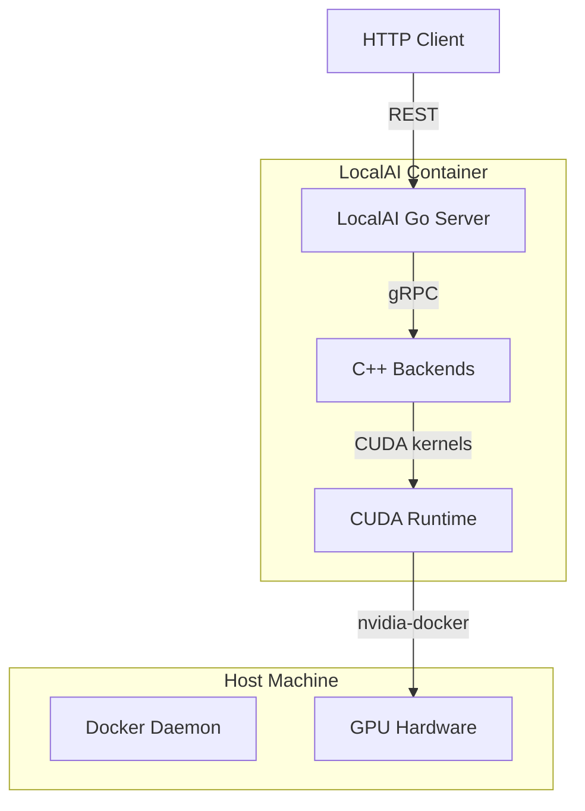
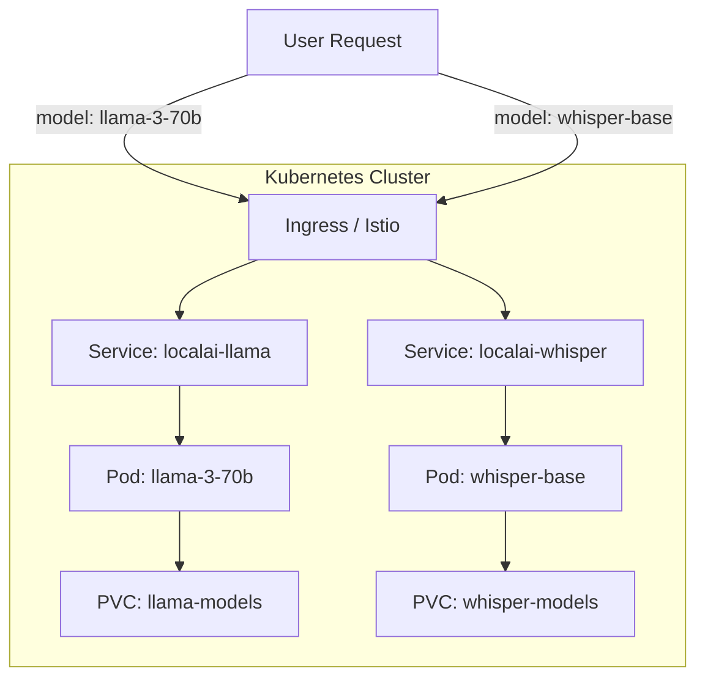
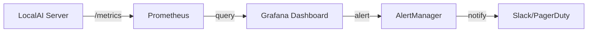

# Enterprise Deployment and Hardware Acceleration 🏢⚡

## 🎯 Learning Objectives
- Understand how to deploy LocalAI at scale using Docker, Kubernetes, and GPU scheduling
- Learn the differences between CUDA, Metal, and Vulkan backends and when to use each
- Master monitoring, logging, and health checks for production inference services
- Connect production deployment patterns to [[Docker Profesional]] orchestration and [[Go Engineering]] systems design

---

## Introduction

Running a model on your laptop is a proof of concept; running it in production for thousands of users is an engineering discipline. This module covers the operational aspects of LocalAI: containerization, GPU acceleration, cluster orchestration, and observability. Enterprises adopt LocalAI not just for cost savings, but for data sovereignty, compliance, and predictable latency. However, productionizing local inference introduces challenges that do not exist in cloud APIs: GPU driver compatibility, memory fragmentation, model weight distribution, and scaling strategies that differ fundamentally from stateless microservices.

If you have completed [[Docker Profesional]], you already know how to build images, manage volumes, and schedule GPU workloads. LocalAI extends these skills by adding model-specific concerns: multi-gigabyte image layers, CUDA version pinning, and the need for shared memory (shm) during backend initialization. If you are familiar with Kubernetes, you will recognize how LocalAI's StatefulSet semantics map to model loading: each pod is not interchangeable because it may be warming a specific set of weights into VRAM. This module provides the patterns to bridge DevOps expertise with ML inference requirements.

---

## Module 1: Hardware Acceleration Backends

### 1.1 Theoretical Foundation 🧠

Neural network inference is fundamentally a matrix multiplication problem. Transformers consist of billions of matrix operations, and CPUs are general-purpose engines ill-suited to the massive parallelism these operations demand. Hardware acceleration backends—CUDA (NVIDIA), Metal (Apple), Vulkan (cross-platform)—provide specialized kernels that execute these operations on GPUs or NPUs. The choice of backend determines not just speed, but portability, cost, and operational complexity.

CUDA is the incumbent. NVIDIA's proprietary API has the most mature ecosystem, the fastest kernels, and the best quantization support (cuBLAS, cuDNN). However, it locks you into NVIDIA hardware and creates licensing complexity in containerized environments. Metal is Apple's answer, optimized for the unified memory architecture of M-series chips where CPU and GPU share the same physical RAM. Vulkan is a cross-platform, open standard (via Kompute or llama.cpp's Vulkan backend) that promises vendor independence but historically lags CUDA in kernel optimization. LocalAI supports all three, allowing you to deploy on whatever hardware your organization owns. The design motivation is **hardware agnosticism**: the same YAML config should run on a cloud VM with an A100, a MacBook Pro, or a Linux workstation with an AMD GPU.

```
┌─────────────────────────────────────────────┐
│  Hardware Acceleration Landscape            │
├─────────────────────────────────────────────┤
│                                             │
│   CUDA (NVIDIA)                             │
│   ├─ Proprietary, fastest                   │
│   ├─ Best for data centers                  │
│   └─ Requires nvidia-docker runtime         │
│                                             │
│   Metal (Apple Silicon)                     │
│   ├─ Unified memory (CPU/GPU share RAM)     │
│   ├─ Best for laptops and edge              │
│   └─ No extra drivers needed on macOS       │
│                                             │
│   Vulkan (Cross-platform)                   │
│   ├─ Open standard, vendor-neutral          │
│   ├─ Best for AMD/Intel GPUs                │
│   └─ Ecosystem maturing rapidly             │
│                                             │
│   CPU (Fallback)                            │
│   ├─ Universal, slowest                     │
│   ├─ Best for testing and small models      │
│   └─ No drivers needed                      │
│                                             │
│   LocalAI abstracts all four via the same   │
│   YAML 'backend' and 'gpu_layers' keys.     │
│                                             │
└─────────────────────────────────────────────┘
```

### 1.2 Mental Model 📐

Think of hardware acceleration as **choosing a lane on a highway**. The CPU lane is a single-lane dirt road: everyone can use it, but traffic crawls. The CUDA lane is a 12-lane autobahn with no speed limit, but only NVIDIA cars are allowed. The Metal lane is a sleek magnetic levitation track built exclusively for Apple vehicles. The Vulkan lane is a modern toll road under construction: fewer lanes than CUDA, but any brand of car can drive on it.

```
┌─────────────────────────────────────────────┐
│  Highway Analogy for Acceleration           │
├─────────────────────────────────────────────┤
│                                             │
│   CPU     ══════════════════════  5 mph    │
│   (dirt road, all vehicles)                 │
│                                             │
│   CUDA    ══════════════════════ 120 mph   │
│   (autobahn, NVIDIA only)                   │
│                                             │
│   Metal   ══════════════════════ 100 mph   │
│   (maglev, Apple only)                      │
│                                             │
│   Vulkan  ══════════════════════  80 mph   │
│   (modern toll road, all brands)            │
│                                             │
│   Your task: pick the fastest lane for      │
│   the vehicle you actually own.             │
│                                             │
└─────────────────────────────────────────────┘
```

### 1.3 Syntax and Semantics 📝

LocalAI's Docker images are tagged by backend to minimize image size and driver conflicts.

```yaml
# docker-compose.cuda.yml
version: "3.9"
services:
  localai:
    # WHY: 'latest-cuda' includes NVIDIA CUDA runtime libraries.
    # 'latest-cpu' is smaller but lacks GPU support.
    # 'latest-ffmpeg-core' includes audio/video codecs.
    image: localai/localai:latest-cuda
    ports:
      - "8080:8080"
    volumes:
      - ./models:/build/models
    environment:
      - MODELS_PATH=/build/models
    deploy:
      resources:
        reservations:
          devices:
            - driver: nvidia
              count: all  # WHY: use all GPUs; 'count: 1' for single GPU
              capabilities: [gpu]
    # WHY: shm_size prevents "Bus error" during large model loads.
    # llama.cpp mmap uses shared memory for tensor mapping.
    shm_size: '8gb'
```

```yaml
# models/llama-3-8b.yaml
name: llama-3-8b
backend: llama
parameters:
  model: llama-3-8b-Q4_K_M.gguf
  temperature: 0.7
context_size: 8192
f16: true
threads: 8
# WHY: gpu_layers is the universal knob for offloading work to the GPU.
# It works for CUDA, Metal, and Vulkan backends.
gpu_layers: 35
# WHY: 'mmap: true' uses OS virtual memory to lazily load weights.
# This reduces startup RAM spike but may increase latency on first access.
mmap: true
# WHY: 'mmlock: false' allows the OS to swap model pages.
# Set true if you want to pin the entire model in RAM (requires enough memory).
mmlock: false
```

### 1.4 Visual Representation 🖼️




### 1.5 Application in ML/AI Systems 🤖

Real case: A European bank deployed LocalAI across three environments: data center NVIDIA A100s for high-frequency trading analysis, Apple Silicon Mac Studios in branch offices for private document summarization, and AMD EPYC servers with ROCm for disaster recovery. Because LocalAI abstracts the backend in YAML, their DevOps team uses the same Docker Compose templates with only the `image` tag and `gpu_layers` changing per environment. Training operations staff on three different inference stacks was unnecessary; they learned one YAML schema and one health check endpoint.

| ML Use Case | This Concept | Impact |
|-------------|-------------|--------|
| Data center inference | CUDA + high gpu_layers | Maximum throughput |
| Executive laptops | Metal + unified memory | No GPU memory management |
| Disaster recovery | Vulkan/ROCm | Vendor independence |

### 1.6 Common Pitfalls ⚠️

⚠️ **CUDA version mismatch** — If the host driver is 12.0 and the container expects 11.8, llama.cpp fails to initialize CUDA with cryptic errors. Always pin the image tag to a CUDA version matching your host driver (`nvidia-smi` shows driver CUDA version).

⚠️ **Forgetting shm_size** — Without adequate shared memory, mmap-backed model loading fails with "Bus error (core dumped)" or silent backend crashes. Set `shm_size` to at least the model file size.

💡 **Mnemonic: "CUDA 12, shm 8, layers all the way"** — Check driver CUDA version, set shm_size to 8GB minimum, and set gpu_layers as high as VRAM allows.

### 1.7 Knowledge Check ❓

1. Why does Metal not require `nvidia-docker` or `gpu_layers` configuration in the same way CUDA does?
2. If you see "Bus error" immediately after model loading, which Docker Compose field is most likely misconfigured?
3. Why might you choose Vulkan over CUDA even if you own NVIDIA hardware?

---

## Module 2: Kubernetes and Production Orchestration

### 2.1 Theoretical Foundation 🧠

Kubernetes is the de facto standard for container orchestration, but it was designed for stateless, horizontally scalable microservices. LLM inference is stateful (model weights pinned in VRAM) and vertically scalable (one big GPU is better than many small ones). This mismatch requires careful architectural choices. A LocalAI pod is more like a database pod than a web server pod: you cannot simply scale it by adding more replicas because each replica would need its own copy of the model weights, duplicating VRAM usage.

The solution is **model sharding** or **dedicated model pods**. In a sharded deployment, different pods serve different models, and an ingress controller routes requests based on the `model` field in the JSON body. This turns the cluster into a model mesh: Pod A runs llama-3-70b, Pod B runs whisper.cpp, Pod C runs stable-diffusion.cpp. Horizontal scaling is then per-model: if whisper requests spike, you scale the whisper pods. This design motivation is **specialization over generalization**: rather than every pod being a Swiss Army knife, each pod is a specialized tool, and the cluster is the toolbox.

```
┌─────────────────────────────────────────────┐
│  Kubernetes Model Mesh (ASCII)              │
├─────────────────────────────────────────────┤
│                                             │
│   Ingress Controller (Nginx/Traefik)        │
│         │                                   │
│    Route by model name                      │
│         │                                   │
│    ┌────┼────┬────────┐                    │
│    ▼    ▼    ▼        ▼                    │
│   ┌──┐ ┌──┐ ┌────┐  ┌────┐               │
│   │Ll│ │Co│ │Img │  │Aud │               │
│   │ama│ │de│ │Gen │  │Trn │               │
│   └──┘ └──┘ └────┘  └────┘               │
│    Pod  Pod   Pod     Pod                  │
│                                             │
│   WHY: each pod is a StatefulSet with      │
│   its own PVC for model weights.            │
│   Scaling whisper pods does not affect      │
│   LLM pod resources.                        │
│                                             │
└─────────────────────────────────────────────┘
```

### 2.2 Mental Model 📐

Think of a Kubernetes LocalAI cluster as a **specialized hospital**. The emergency room (LLM pod) handles urgent chat requests. The radiology department (image generation pod) processes imaging prompts. The audiology lab (whisper pod) transcribes dictation. You do not staff the audiology lab with ER doctors; each department has its own equipment (GPU memory), specialists (backends), and scheduling (HorizontalPodAutoscaler per model).

```
┌─────────────────────────────────────────────┐
│  Hospital Analogy for Model Mesh            │
├─────────────────────────────────────────────┤
│                                             │
│   Reception (Ingress)                       │
│         │                                   │
│    Triage by symptom (model field)          │
│         │                                   │
│    ┌────┼────┬────────┐                    │
│    ▼    ▼    ▼        ▼                    │
│   ┌──┐ ┌──┐ ┌────┐  ┌────┐               │
│   │ER │ │Rad│ │Audio│  │Lab │               │
│   │Pod│ │Pod│ │Pod │  │Pod │               │
│   └──┘ └──┘ └────┘  └────┘               │
│                                             │
│   ER Pod: llama-3-70b on A100             │
│   Rad Pod: stable-diffusion on A6000        │
│   Audio Pod: whisper on T4                  │
│                                             │
│   WHY: you do not X-ray a patient in the    │
│   ER. Each modality needs its own room.     │
│                                             │
└─────────────────────────────────────────────┘
```

### 2.3 Syntax and Semantics 📝

```yaml
# k8s/llama-deployment.yaml
apiVersion: apps/v1
kind: StatefulSet
metadata:
  name: localai-llama
spec:
  serviceName: localai-llama
  replicas: 1  # WHY: one replica per GPU node; scale vertically first.
  selector:
    matchLabels:
      app: localai-llama
  template:
    metadata:
      labels:
        app: localai-llama
    spec:
      containers:
      - name: localai
        image: localai/localai:latest-cuda
        ports:
        - containerPort: 8080
        resources:
          limits:
            # WHY: 'nvidia.com/gpu: 1' requests an entire GPU.
            # Fractional GPUs require NVIDIA MPS or vGPU.
            nvidia.com/gpu: 1
            memory: "32Gi"
          requests:
            memory: "16Gi"
        volumeMounts:
        - name: models
          mountPath: /build/models
        env:
        - name: MODELS_PATH
          value: "/build/models"
      volumes:
      - name: models
        persistentVolumeClaim:
          # WHY: PVC ensures model weights survive pod restarts.
          # Pre-populate this with a Job that downloads GGUF files.
          claimName: llama-models-pvc
```

```go
// pkg/health/health.go
package health

import (
	"net/http"
	"sync/atomic"
)

// HealthServer exposes a simple readiness probe for Kubernetes.
// WHY: K8s uses readiness to decide if the pod should receive traffic.
// It does not restart the pod; it just removes it from the Service.
type HealthServer struct {
	ready int32 // atomic
}

func (h *HealthServer) SetReady(v bool) {
	if v {
		atomic.StoreInt32(&h.ready, 1)
	} else {
		atomic.StoreInt32(&h.ready, 0)
	}
}

func (h *HealthServer) ServeHTTP(w http.ResponseWriter, r *http.Request) {
	if atomic.LoadInt32(&h.ready) == 1 {
		w.WriteHeader(http.StatusOK)
		w.Write([]byte("ok"))
	} else {
		// WHY: 503 tells Kubernetes to stop routing traffic here.
		w.WriteHeader(http.StatusServiceUnavailable)
		w.Write([]byte("not ready"))
	}
}
```

### 2.4 Visual Representation 🖼️




### 2.5 Application in ML/AI Systems 🤖

Real case: A global SaaS company runs LocalAI in Kubernetes across three regions. They use a custom ingress controller that inspects the `model` field in the request JSON and routes to the appropriate StatefulSet. When Whisper demand spikes during quarterly earnings call transcription, the HorizontalPodAutoscaler scales the whisper StatefulSet from 2 to 6 pods across their GPU nodes. Because each pod mounts a ReadOnlyMany PVC pre-seeded with model weights, startup time is under 30 seconds. Their Prometheus metrics track tokens-per-second per pod, and alerts fire if p99 latency exceeds 500ms.

| ML Use Case | This Concept | Impact |
|-------------|-------------|--------|
| Multi-region inference | K8s + PVC | Sub-30s cold start |
| Auto-scaling by modality | HPA per StatefulSet | Cost-elastic GPU usage |
| Zero-downtime updates | Rolling update on StatefulSet | Model hot-swaps without restarts |

### 2.6 Common Pitfalls ⚠️

⚠️ **Scaling replicas without more GPUs** — Setting `replicas: 3` on a StatefulSet with `nvidia.com/gpu: 1` when your node pool has only 2 GPUs causes pods to hang in `Pending` forever. Always ensure node pool GPU capacity exceeds replica count times GPUs per pod.

⚠️ **Writable model PVCs causing corruption** — If two pods mount the same ReadWriteOnce PVC and one is downloading a model while another is loading it, file corruption can occur. Use init containers to download models before the main container starts, or use ReadOnlyMany volumes.

💡 **Tip: Init containers for model pre-loading** — Use an `initContainer` that runs `wget` or `rsync` to populate an `emptyDir` volume. The main container then loads from `emptyDir`, eliminating PVC contention and allowing each pod to have its own copy without network bottlenecks.

### 2.7 Knowledge Check ❓

1. Why is a LocalAI pod more like a database StatefulSet than a stateless web Deployment?
2. What Kubernetes resource would you use to automatically scale whisper.cpp pods when transcription queue depth grows?
3. Why should you avoid using ReadWriteOnce PVCs shared across multiple LocalAI replicas?

---

## Module 3: Monitoring and Observability

### 3.1 Theoretical Foundation 🧠

Production systems are opaque without telemetry. For inference servers, the critical metrics are not just CPU and memory, but **tokens per second**, **time to first token (TTFT)**, **queue depth**, and **GPU memory utilization**. These are application-specific metrics that generic infrastructure monitoring (like `top` or `kubectl top`) cannot capture. LocalAI exposes these via logs and optional Prometheus endpoints, but the operator must know which metrics to collect and why.

The theory here is **Golden Signals** for ML inference: Latency, Traffic, Errors, and Saturation (the LETS model adapted for GPUs). Latency is TTFT and inter-token latency. Traffic is requests per second and tokens per second. Errors are backend crashes and gRPC status codes. Saturation is GPU VRAM usage and compute utilization (`nvidia-smi`). By tracking these four dimensions, you can predict failures before they happen: a rising TTFT often means queue congestion; a climbing GPU memory usage means you are approaching an OOM.

```
┌─────────────────────────────────────────────┐
│  Golden Signals for ML Inference            │
├─────────────────────────────────────────────┤
│                                             │
│   Latency                                   │
│   ├── Time to First Token (TTFT)            │
│   └── Inter-Token Latency (ITL)             │
│                                             │
│   Traffic                                   │
│   ├── Requests per Second (RPS)             │
│   └── Tokens per Second (TPS)               │
│                                             │
│   Errors                                    │
│   ├── Backend crash rate                    │
│   └── gRPC error codes                      │
│                                             │
│   Saturation                                │
│   ├── GPU VRAM usage                        │
│   └── GPU Compute utilization %             │
│                                             │
│   WHY: these four dimensions cover the      │
│   operational health of any inference node. │
│                                             │
└─────────────────────────────────────────────┘
```

### 3.2 Mental Model 📐

Think of observability as **instrumentation on a race car**. The speedometer (TPS) tells you how fast you are going. The tachometer (GPU utilization) tells you if the engine is redlining. The fuel gauge (VRAM) tells you how far you can go before a pit stop. The warning lights (error rate) tell you if something is about to break. A driver who ignores any of these instruments will crash.

```
┌─────────────────────────────────────────────┐
│  Race Car Dashboard                         │
├─────────────────────────────────────────────┤
│                                             │
│   TPS  ════════════════  45 tok/s          │
│   (speedometer)                             │
│                                             │
│   GPU  ════════════════  92%               │
│   (tachometer)                              │
│                                             │
│   VRAM ════════════════  14/16 GB          │
│   (fuel gauge)                              │
│                                             │
│   ERR  ⚠️  2 crashes/hour                  │
│   (check engine)                            │
│                                             │
│   WHY: each gauge answers a different       │
│   "what if" question about failure.         │
│                                             │
└─────────────────────────────────────────────┘
```

### 3.3 Syntax and Semantics 📝

```yaml
# prometheus/prometheus.yml (simplified scrape config)
scrape_configs:
  - job_name: 'localai'
    static_configs:
      - targets: ['localai:8080']
    # WHY: scrape every 15s to catch burst patterns.
    scrape_interval: 15s
    metrics_path: /metrics
```

```go
// pkg/metrics/metrics.go
package metrics

import (
	"github.com/prometheus/client_golang/prometheus"
	"github.com/prometheus/client_golang/prometheus/promhttp"
	"net/http"
)

// WHY: use a global registry so all packages can register counters.
var Registry = prometheus.NewRegistry()

var (
	TokensGenerated = prometheus.NewCounterVec(prometheus.CounterOpts{
		Name: "localai_tokens_generated_total",
		Help: "Total tokens generated by model and backend",
	}, []string{"model", "backend"})

	RequestLatency = prometheus.NewHistogramVec(prometheus.HistogramOpts{
		Name:    "localai_request_duration_seconds",
		Help:    "Latency of requests",
		Buckets: prometheus.DefBuckets,
	}, []string{"endpoint"})
)

func init() {
	Registry.MustRegister(TokensGenerated, RequestLatency)
}

// Handler exposes /metrics for Prometheus scraping.
func Handler() http.Handler {
	return promhttp.HandlerFor(Registry, promhttp.HandlerOpts{})
}
```

### 3.4 Visual Representation 🖼️




### 3.5 Application in ML/AI Systems 🤖

Real case: A telemedicine platform uses LocalAI to transcribe doctor-patient consultations. Their Grafana dashboard tracks `localai_request_duration_seconds` for the `/v1/audio/transcriptions` endpoint. During peak hours (mornings), they noticed TTFT spiking from 200ms to 4s. Investigation showed the whisper.cpp backend was CPU-bound because `threads` was set to 4 on an 8-core node. Doubling threads and adding a second whisper pod cut peak latency by 75%. Without Prometheus metrics, they would have blamed network latency.

| ML Use Case | This Concept | Impact |
|-------------|-------------|--------|
| Telemedicine transcription | Grafana + TPS metrics | 75% latency reduction |
| Capacity planning | VRAM saturation alerts | Prevent OOM before it happens |
| SLO enforcement | P99 latency SLO + AlertManager | Automatic incident response |

### 3.6 Common Pitfalls ⚠️

⚠️ **High cardinality labels** — Using `prompt` as a Prometheus label creates an unbounded cardinality explosion, crashing Prometheus. Only label by `model`, `backend`, and `endpoint`.

⚠️ **Ignoring counter resets** — Prometheus counters reset on pod restart. Use `rate()` or `increase()` functions in queries, not raw counter values.

💡 **Tip: "Alert on symptoms, not causes"** — Alert on `p99 latency > 1s` (symptom) rather than `GPU util > 95%` (cause). A symptom alert tells you users are suffering; a cause alert might fire during harmless batch jobs.

### 3.7 Knowledge Check ❓

1. Why is "tokens per second" a more useful throughput metric than "requests per second" for LLM inference?
2. What is the danger of using high-cardinality strings (like user IDs) as Prometheus label values?
3. If TTFT is rising but GPU utilization is low, what is the most likely bottleneck?

---

## 📦 Compression Code

```go
// Compression: enterprise LocalAI deployment
package main

import "fmt"

// Enterprise LocalAI in four ideas:
// 1. Hardware: CUDA for datacenter, Metal for Mac, Vulkan for freedom
// 2. Orchestration: K8s StatefulSets per model, not generic Deployments
// 3. Storage: PVCs for weights, init containers for pre-loading
// 4. Observability: Prometheus for TPS/TTFT, Grafana for dashboards

func main() {
	fmt.Println("Enterprise = GPU + K8s + PVC + Metrics")
}
```

## 🎯 Documented Project

### Description

Deploy a production-grade LocalAI cluster on Kubernetes that serves three models (llama-3-8b, whisper-base, stable-diffusion) across two GPU nodes. The deployment must include Prometheus monitoring, Grafana dashboards, and an ingress controller that routes by model name. This project consolidates all enterprise deployment concepts.

### Functional Requirements

1. Three StatefulSets, one per model, each with its own PVC for model weights.
2. An ingress rule that routes requests based on the `model` field in the JSON body to the correct StatefulSet.
3. Prometheus scraping of a `/metrics` endpoint exposing tokens-per-second and request latency.
4. A Grafana dashboard showing TTFT, GPU VRAM usage, and backend error rate.
5. A HorizontalPodAutoscaler on the whisper StatefulSet that scales based on custom metrics (queue depth).

### Main Components

- **Ingress Controller** — NGINX or Traefik with custom Lua/Go plugin for JSON body routing
- **StatefulSets** — One per model with GPU requests and PVC templates
- **Prometheus Stack** — Prometheus + Grafana + AlertManager
- **Custom Metrics Adapter** — Exposes queue depth for HPA
- **Init Containers** — Download GGUF and safetensors before main container starts

### Success Metrics

- Zero cross-traffic between models (whisper requests never hit LLM pods)
- Grafana shows p99 latency under 500ms for LLM and under 2s for image generation
- HPA scales whisper pods from 1 to 3 within 2 minutes of synthetic load
- Rolling update of a model version completes with zero downtime

### References

- Official docs: https://localai.io/docs/getting-started/run-other-models/
- Kubernetes GPU scheduling: https://kubernetes.io/docs/tasks/manage-gpus/
- Prometheus Go client: https://github.com/prometheus/client_golang
- Docker GPU: [[Docker Profesional]]
