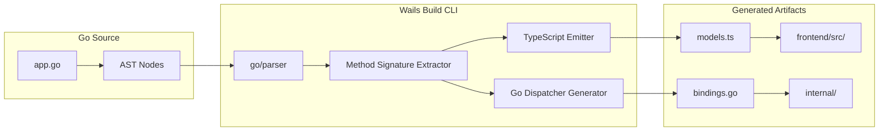
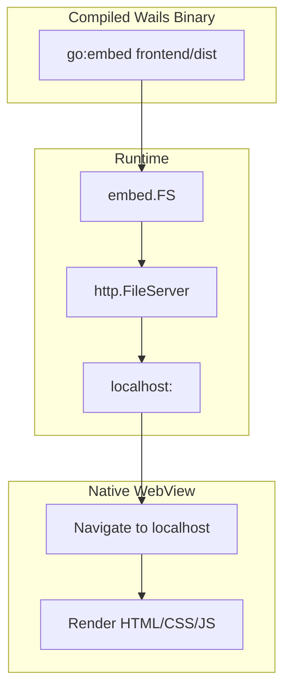

# 🔗 Frontend Integration and Bindings

## 🎯 Learning Objectives
- Explain why Wails generates TypeScript bindings at compile time rather than using runtime reflection.
- Analyze the `go:embed` directive as a virtual filesystem mechanism and its interaction with the asset server.
- Design type-safe Go APIs that map cleanly to idiomatic JavaScript consumption patterns.

Understanding these compile-time and embedding mechanisms will allow you to design APIs that feel native to both Go and TypeScript developers, eliminating the friction that typically plagues full-stack teams.

The skills developed here are directly transferable to API design in REST, gRPC, and GraphQL backends, as the principles of type safety and hermetic deployment are universal.

- Evaluate frontend bundle size and tree-shaking strategies to minimize binary bloat for resource-constrained ML environments.

---

## Introduction

The boundary between Go and JavaScript is the most critical interface in a Wails application. A poorly designed bridge forces frontend developers to fight against Go's type system, while a well-designed bridge makes the Go backend feel like a native TypeScript module. The key insight of Wails v2 is that this boundary can be *generated* rather than *discovered*. Instead of using Go's `reflect` package at runtime to inspect method signatures — an operation that incurs CPU overhead and offers no compile-time guarantees — Wails parses the Go AST during the build process and emits TypeScript definitions that mirror the Go API exactly. This module explores the compiler theory, the embed system, and the frontend build pipeline that makes this integration seamless. Understanding these mechanisms is prerequisite to [[03 - Building Cross-Platform Desktop Apps]], where platform differences complicate the build process.

The frontend build pipeline also deserves scrutiny. Modern JavaScript bundlers (Vite, Rollup, esbuild) perform tree-shaking to eliminate dead code. When Wails embeds the frontend/dist directory, it is critical that the bundler has already removed unused framework components, because embed.FS blindly includes every byte in the directory. A common mistake is importing an entire icon library rather than individual icons, resulting in a 2MB icons.js that bloats the binary. Profiling the embedded asset size with du -sh frontend/dist before each release is a simple but effective discipline. In the ML context, where models themselves are gigabytes, a few megabytes of JavaScript may seem trivial, but professional engineering demands frugality at every layer.

By the end of this module, you will possess the conceptual tools to debug bridge latency, justify technology choices to security auditors, and architect desktop ML utilities that respect both user memory and user privacy.

---

## Module 2: Compile-Time Bindings and Asset Embedding

### 2.1 Theoretical Foundation 🧠

Runtime reflection is the dynamic inspection of types and values during program execution. Go's `reflect` package is powerful, but it carries significant costs. A reflective method invocation requires: (1) allocating an `[]reflect.Value` slice for arguments, (2) boxing each argument into an interface{}, (3) looking up the method by name via string comparison in a hash map, and (4) unboxing the return values. In microbenchmarks, reflective calls are 10× to 100× slower than direct calls. In the context of a desktop bridge, where every button click and form submission may trigger a Go method, this overhead accumulates into perceptible UI latency.

Wails eliminates this overhead entirely through **static code generation**. During `wails build`, the Wails CLI invokes `go/parser` and `go/ast` to inspect the structs listed in the `Bind` array. For each exported method, it generates a TypeScript function that knows the exact parameter types and return types. The generated TypeScript constructs a JSON payload with the correct field names and dispatches it through the bridge using a generated method ID. On the Go side, Wails generates a dispatch table — typically a large `switch` statement — that maps method IDs to direct function pointers. The result is zero-reflection IPC: the method dispatch is as fast as a compiled function call, with type safety enforced by both the Go compiler and the TypeScript compiler.

The second theoretical pillar is **asset embedding**. Traditional desktop applications ship resource files alongside the executable, requiring fragile relative-path logic and installation wizards. Go 1.16 introduced `//go:embed`, which instructs the compiler to treat files as part of the binary's read-only data segment. At the linker level, `embed.FS` creates a virtual filesystem backed by a contiguous byte slice in the binary's `.rodata` section (ELF) or `__TEXT` segment (Mach-O). Wails layers an HTTP asset server on top of this `embed.FS`, meaning the frontend is served from an in-memory filesystem at `http://localhost:<random>` without ever touching the disk. This eliminates path-resolution bugs and ensures the application is a single, hermetic unit — a property essential for ML tooling that must run in air-gapped environments.

### 2.2 Mental Model 📐

Binding generation is a compiler pipeline:

```
┌─────────────────────────────────────────────────────────────┐
│  Wails Compile-Time Binding Pipeline                        │
├─────────────────────────────────────────────────────────────┤
│                                                             │
│   ┌───────────┐    ┌───────────┐    ┌───────────┐         │
│   │  Parse    │───►│ Generate  │───►│  Emit TS  │         │
│   │  Go AST   │    │ Dispatch  │    │  Stubs    │         │
│   └───────────┘    └───────────┘    └───────────┘         │
│        │                 │                 │               │
│        ▼                 ▼                 ▼               │
│   Bound Structs     Go Switch Table    frontend/           │
│   in main.go        (Zero Reflection)  wailsjs/go/         │
│                                                             │
└─────────────────────────────────────────────────────────────┘
```

Asset embedding creates a hermetic binary:

```
┌─────────────────────────────────────────────────────────────┐
│  Hermetic Binary Structure                                  │
├─────────────────────────────────────────────────────────────┤
│                                                             │
│  ┌─────────────────────────────────────────────────────┐   │
│  │                  Binary Header                      │   │
│  ├─────────────────────────────────────────────────────┤   │
│  │  Go Code Segment (.text / __TEXT)                   │   │
│  ├─────────────────────────────────────────────────────┤   │
│  │  Embedded Assets (.rodata / __TEXT)                 │   │
│  │  ┌────────────┐  ┌────────────┐  ┌────────────┐    │   │
│  │  │ index.html │  │ app.js     │  │ style.css  │    │   │
│  │  └────────────┘  └────────────┘  └────────────┘    │   │
│  ├─────────────────────────────────────────────────────┤   │
│  │  Read-Only Data (strings, constants)                │   │
│  └─────────────────────────────────────────────────────┘   │
│                                                             │
│  Result: Single file, zero external dependencies for assets │
└─────────────────────────────────────────────────────────────┘
```

The type mapping between Go and TypeScript:

```
┌─────────────────────────────────────────────────────────────┐
│  Type System Bridge Mapping                                 │
├─────────────────────────────────────────────────────────────┤
│                                                             │
│   Go Type          │    TypeScript Type    │    Notes      │
│   ─────────────────┼───────────────────────┼────────────── │
│   string           │    string             │  UTF-8        │
│   int, int64       │    number             │  53-bit safe  │
│   bool             │    boolean            │  exact match  │
│   struct{...}      │    interface{...}     │  generated    │
│   []T              │    Array<T>           │  generated    │
│   error            │    Promise rejection  │  automatic    │
│                                                             │
└─────────────────────────────────────────────────────────────┘
```

### 2.3 Syntax and Semantics 📝

The following code demonstrates a production-grade binding design with structs, slices, and error handling. The comments explain the design rationale for each API choice.

```go
// app.go
package main

import (
	"context"
	"fmt"

	"github.com/wailsapp/wails/v2/pkg/runtime"
)

// ModelConfig is a bound struct field; Wails generates a matching TS interface.
// Using exported fields ensures JSON marshaling works without custom tags.
type ModelConfig struct {
	Name      string  `json:"name"`      // Model identifier, e.g., "llama3:8b"
	Temp      float64 `json:"temp"`      // Sampling temperature; maps to TS number
	MaxTokens int     `json:"maxTokens"` // JS camelCase convention via json tag
}

// App is the root struct bound to JavaScript.
// All exported methods become callable from the frontend.
type App struct {
	ctx context.Context
}

func NewApp() *App { return &App{} }

// startup stores the Wails context; required for Dialogs, Events, and Window ops.
func (a *App) startup(ctx context.Context) { a.ctx = ctx }

// GetModels returns a slice of strings. Wails generates Promise<string[]>.
// Returning a slice of primitives avoids frontend parsing complexity.
func (a *App) GetModels() []string {
	// In production, this queries Ollama /api/tags via HTTP.
	return []string{"llama3:8b", "mistral:7b", "codellama:7b"}
}

// ConfigureModel accepts a struct and returns an error.
// Wails translates Go errors into Promise rejections automatically.
// Using a pointer receiver (*App) ensures consistent method set binding.
func (a *App) ConfigureModel(cfg ModelConfig) error {
	if cfg.Temp < 0.0 || cfg.Temp > 2.0 {
		return fmt.Errorf("temperature %f out of range [0,2]", cfg.Temp)
	}
	// Persist configuration to local storage or SQLite...
	return nil
}

// GeneratePrompt is a fire-and-forget method that spawns a goroutine.
// It returns immediately (no blocking) and streams results via EventsEmit.
// The frontend should listen to the "response" event.
func (a *App) GeneratePrompt(prompt string, cfg ModelConfig) {
	go func() {
		// Simulate LLM token generation and emit each token.
		for _, word := range []string{"Go", " powers", " local", " AI", "."} {
			runtime.EventsEmit(a.ctx, "response", word)
		}
		runtime.EventsEmit(a.ctx, "eof", true)
	}()
}
```

### 2.4 Visual Representation 🖼️

The binding generation process as a data flow:



Asset server layering over embedded filesystem:




### 2.5 Application in ML/AI Systems 🤖

**ModelForge** is an internal tool at a Fortune 500 retail company managing 200+ fine-tuned models across three data centers. The problem: data scientists were editing YAML configuration files by hand and running shell scripts to deploy models, causing frequent misconfigurations and production outages. The MLOps team built a Wails desktop application to provide a graphical interface for model management.

The Go backend exposes a rich API: `ListModels()`, `DeployModel(cfg ModelConfig)`, `GetMetrics(modelID string)`, and `Rollback(modelID string, version int)`. Because Wails generates TypeScript definitions at compile time, the frontend team caught three type mismatches at build time that would have caused runtime exceptions in a REST-based web app. The `ModelConfig` struct contains 18 fields — including nested slices for GPU affinity and environment variables — all mapped to strongly typed TypeScript interfaces. The application is distributed as a single 16MB binary with all frontend assets embedded, allowing data scientists to run it on bastion hosts without internet access.

| ML Use Case | This Concept | Impact |
|-------------|-------------|--------|
| Internal model management dashboard | Compile-time TS generation | 3 critical type bugs caught at build time |
| Air-gapped deployment | go:embed hermetic binary | Zero external asset dependencies |
| Rapid API iteration | Type-safe bridge | 50% reduction in frontend-backend integration time |

### 2.6 Common Pitfalls ⚠️

⚠️ **Using unexported struct fields in bound methods:** Wails only sees exported fields (capitalized). If you use `temp float64` instead of `Temp float64`, the generated TypeScript interface will omit the field, leading to silent data loss during JSON round-tripping.

⚠️ **Forgetting json struct tags:** Go's default JSON encoder uses the field name literally. A Go field `MaxTokens` becomes `MaxTokens` in JSON, but TypeScript convention demands `maxTokens`. Missing tags create an impedance mismatch that confuses frontend developers.

💡 **Mnemonic — CAPS for the Bridge:** *Capitalized fields Cross the bridge; lowercase stays in Go land.* If a field needs to reach JavaScript, it must start with a capital letter.

### 2.7 Knowledge Check ❓

1. **Reflection Cost Analysis:** Write a benchmark comparing a direct method call in Go to a `reflect.Value.Call()` invocation with three `string` arguments. What is the latency difference on your machine? Why does this matter for a bridge handling 100 UI events per second?
2. **Embedding Deep Dive:** Explain why `embed.FS` is read-only. What would happen if the Wails asset server attempted to write to the embedded filesystem at runtime? (Hint: consider the ELF `.rodata` segment permissions.)
3. **Type Mapping Edge Case:** Go's `int` type is either 32 or 64 bits depending on architecture. How does Wails handle this when generating TypeScript `number` types? What risk does this pose for very large integers (> 2^53) on a 64-bit build?

4. **Embedding and Memory Mapping:** `embed.FS` uses the operating system's memory mapping (`mmap`) when possible. Explain how `mmap` reduces RAM usage for large frontend assets. Why is this advantageous when the application is running alongside a 7B parameter LLM?

5. **TypeScript Union Types:** Go does not have union types, but TypeScript does. If your Go API returns `interface{}` (any), how does Wails represent this in TypeScript? What type-safety risks does this introduce for ML configuration objects?

---


### 2.8 Generated TypeScript Anatomy 🔬

To appreciate the compile-time binding system, one must examine the generated artifacts. When `wails dev` or `wails build` executes, the CLI scans the `Bind` array and produces two outputs: a Go dispatch file (internal) and a TypeScript definition file (exposed to the frontend). Consider the following Go method:

```go
func (a *App) DeployModel(cfg ModelConfig, dryRun bool) (DeploymentID string, err error)
```

Wails generates a TypeScript function resembling:

```typescript
// Generated by Wails CLI — do not edit manually
export function DeployModel(cfg: ModelConfig, dryRun: boolean): Promise<string> {
  return window.go.main.App.DeployModel(cfg, dryRun);
}
```

The `ModelConfig` interface is also generated:

```typescript
export interface ModelConfig {
  name: string;
  temp: number;
  maxTokens: number;
}
```

This generation process uses `go/types` to resolve type aliases, embedded structs, and named return values. If the Go method signature changes — for example, adding a `timeout int` parameter — the TypeScript compiler immediately flags all call sites in the frontend. This feedback loop, measured in milliseconds during `wails dev`, eliminates an entire category of integration bugs that plague REST API development, where type mismatches often surface only at runtime in production.

### 2.9 Asset Server Internals 🌐

The Wails asset server is not a generic HTTP server; it is a carefully tuned in-memory file server layered over `embed.FS`. At startup, Wails creates an `http.FileServer` using the embedded filesystem as its root. It then binds this server to `localhost:0`, where `:0` instructs the kernel to assign an ephemeral port. The WebView is navigated to this random port via `wails.Navigate`. Because the server only listens on the loopback interface (`127.0.0.1`), external machines cannot access the frontend assets, providing a primitive but effective security boundary. The server also injects CORS headers allowing the WebView origin to fetch resources without restriction, and it handles `Range` requests for streaming media — a feature essential if your ML dashboard includes video tutorials or model visualization clips.


### 2.10 Error Propagation Theory 📊

When a bound Go method returns an error, Wails does not merely stringify it; it marshals the error into a structured rejection object that the frontend Promise mechanism can inspect. This design choice aligns with Go's philosophy of explicit error handling while respecting JavaScript's async idioms. Consider a method that validates a model configuration:

```go
func (a *App) Validate(cfg ModelConfig) error {
    if cfg.Temp < 0 || cfg.Temp > 2 {
        return fmt.Errorf("temperature %f out of range [0,2]", cfg.Temp)
    }
    if cfg.MaxTokens > 32768 {
        return fmt.Errorf("maxTokens %d exceeds model context window", cfg.MaxTokens)
    }
    return nil
}
```

On the TypeScript side, the generated binding produces:

```typescript
Validate(cfg: ModelConfig): Promise<void>
```

If the Go method returns a non-nil error, the Promise rejects with an `Error` object whose `.message` field contains the formatted Go error string. The frontend can then display field-level validation messages without parsing JSON. This seamless error tunneling is possible because Wails generates a wrapper for every bound method that converts Go's multi-value returns `(T, error)` into JavaScript's `Promise<T>` or `Promise<rejection>`. Understanding this mapping is crucial for UX design: Go errors become user-visible strings, so they should be written in plain language, not stack traces.

## 📦 Compression Code

```go
// bindings_compression.go
// Production-ready compression of binding and embedding concepts.

package main

import (
	"context"
	"embed"
	"fmt"

	"github.com/wailsapp/wails/v2"
	"github.com/wailsapp/wails/v2/pkg/options"
	"github.com/wailsapp/wails/v2/pkg/options/assetserver"
	"github.com/wailsapp/wails/v2/pkg/runtime"
)

//go:embed all:frontend/dist
var assets embed.FS

// InferenceRequest demonstrates nested struct binding.
// All fields exported; json tags enforce camelCase for JS convention.
type InferenceRequest struct {
	Model   string   `json:"model"`
	Prompt  string   `json:"prompt"`
	History []string `json:"history"` // Slice generates Array<string> in TS
}

type App struct{ ctx context.Context }

func NewApp() *App { return &App{} }
func (a *App) startup(ctx context.Context) { a.ctx = ctx }

// Infer is bound to JS. Errors become Promise rejections.
// The method spawns a goroutine so the bridge returns instantly.
func (a *App) Infer(req InferenceRequest) error {
	if req.Model == "" {
		return fmt.Errorf("model is required")
	}
	go func() {
		for _, token := range []string{"Thinking", "...", " Done"} {
			runtime.EventsEmit(a.ctx, "token", token)
		}
		runtime.EventsEmit(a.ctx, "eof", true)
	}()
	return nil
}

func main() {
	app := NewApp()
	wails.Run(&options.App{
		Title:            "BindingDemo",
		Width:            900,
		Height:           700,
		AssetServer:      &assetserver.Options{Assets: assets},
		OnStartup:        app.startup,
		Bind:             []interface{}{app},
	})
}
```

## 🎯 Documented Project

### Description

**ModelForge Dashboard** is an enterprise desktop application for managing on-premise ML model registries. Data scientists use it to browse model versions, configure inference parameters, and trigger A/B test deployments — all through a type-safe Wails interface. The project demonstrates compile-time binding generation, complex struct mapping, and hermetic asset embedding for offline corporate networks.


The ModelForge Dashboard also serves as a teaching tool for onboarding new data scientists: every form field includes a tooltip bound to Go-generated documentation strings, and the TypeScript types are exported as a standalone npm package so that other internal web tools can reuse the same interfaces without duplication. This pattern — treating the Wails backend as the source of truth for domain types — mirrors GraphQL schema-first development but without the network overhead.

### Functional Requirements

1. Display a paginated table of models with columns for name, version, status, and last deployed timestamp.
2. Open a detail panel showing a model's full configuration as a form generated from the Go `ModelConfig` struct.
3. Validate configuration changes on the Go side and return granular error messages to the frontend.
4. Trigger a deployment simulation that emits progress events (0% to 100%) via the Wails event bridge.
5. Export model metadata to a JSON file using the native save dialog.

### Main Components

- **Registry Service:** Go struct querying an internal model registry REST API.
- **Config Validator:** Go module enforcing business rules on `ModelConfig` fields.
- **Deployment Simulator:** Goroutine emitting progress events to the Svelte frontend.
- **Svelte Form Engine:** Auto-generated form components based on Wails TypeScript models.

### Success Metrics

- TypeScript compilation catches 100% of API signature mismatches before runtime.
- Form submission-to-validation round-trip under 50ms.
- Deployment progress updates render at 60fps without UI jank.
- Application launches without network access after initial download.

### References

- Official docs: https://wails.io/docs/reference/runtime/intro
- Go embed package: https://pkg.go.dev/embed
- TypeScript Handbook: https://www.typescriptlang.org/docs/
