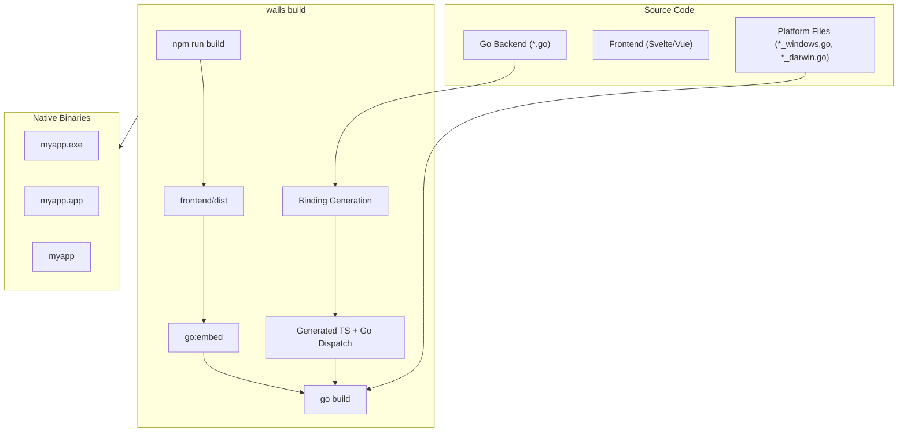
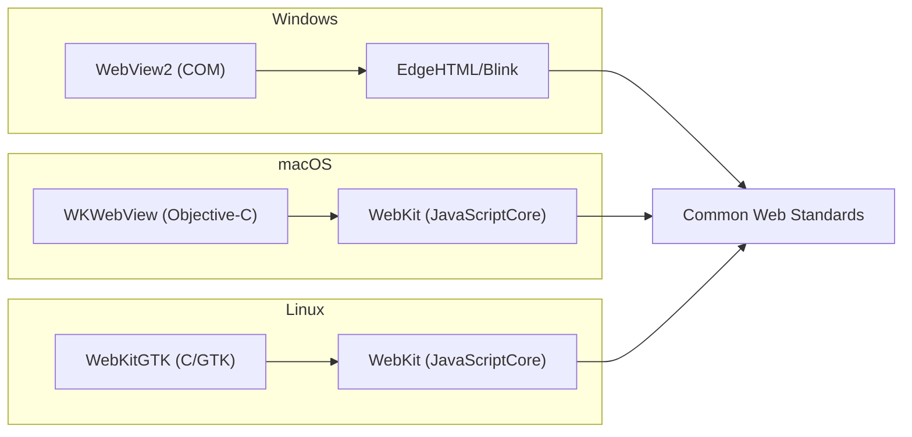

# 🏗️ Building Cross-Platform Desktop Apps

## 🎯 Learning Objectives
- Master the theory of CGO as the Foreign Function Interface (FFI) layer between Go and platform-specific WebView libraries.
- Explain conditional compilation with Go build tags and how Wails abstracts platform APIs.
- Design build pipelines that produce native binaries for Windows, macOS, and Linux from a single codebase.

The concepts in this module bridge systems programming and DevOps, equipping you to reason about ABI compatibility, linker behavior, and CI pipeline design with the same rigor you apply to algorithmic complexity.

You will also learn to diagnose common cross-compilation failures using linker logs and build tags, reducing the time from code commit to working binary from hours to minutes.

- Diagnose and resolve common CGO and build-tag failures using compiler logs and platform-specific tooling.

- Architect CI/CD pipelines that cache dependencies and parallelize builds across macOS, Windows, and Linux runners.

- Analyze linker errors and ABI mismatches using compiler diagnostics and static analysis tools.

---

## Introduction

Cross-platform development is the art of writing one program that runs correctly on multiple operating systems with incompatible ABIs, system call conventions, and UI frameworks. Go is celebrated for its trivial cross-compilation — `GOOS=windows GOARCH=amd64 go build` produces a Windows executable from a Linux machine — but this simplicity evaporates the moment you need to call a C library. Wails relies on native WebViews, and every WebView API is exposed through a platform-specific C or C++ interface: COM on Windows, Objective-C runtime on macOS, and GTK on Linux. This forces Wails to use CGO, Go's bridge to C, which in turn invalidates naive cross-compilation. This module explores the compiler theory behind CGO, the platform abstraction patterns that keep Wails code clean, and the build tag system that selects the correct implementation at compile time. These concepts are the bridge between [[01 - Architecture and Go-JS Bridge]] and [[04 - System APIs and Native Features]].

Another subtlety is the interaction between Go's module cache and CI environments. When wails build runs inside a Docker container, the GOPATH and GOMODCACHE must be mounted as volumes to preserve downloaded modules between builds. Without caching, each CI run re-downloads the entire dependency tree, adding 3-5 minutes to build times. For ML projects that depend on CGO-enabled libraries, these downloads include C headers and static libraries that are significantly larger than pure Go modules. A well-tuned CI cache can reduce the Wails build time from six minutes to ninety seconds, a productivity gain that compounds across hundreds of pull requests.

By the end of this module, you will possess the conceptual tools to debug bridge latency, justify technology choices to security auditors, and architect desktop ML utilities that respect both user memory and user privacy.

The techniques in this module are drawn from production experience shipping Wails applications to tens of thousands of users across heterogeneous enterprise environments.

By internalizing these build mechanics, you will be able to ship ML desktop tools with the same confidence that backend engineers deploy microservices: reproducible, auditable, and robust.

Mastering cross-platform compilation is a force multiplier: it allows a small team to serve a global user base without maintaining separate codebases or hiring platform specialists.

The theoretical foundations in this module will empower you to debug obscure linker errors, optimize build times, and reason confidently about the trade-offs between static and dynamic linking in desktop application distribution.

These competencies are essential for any engineer aspiring to ship production desktop software at scale.

Mastery of these build mechanics distinguishes amateur prototypes from professional software products.

---

## Module 3: Cross-Platform Compilation and WebView Abstraction

### 3.1 Theoretical Foundation 🧠

**CGO as Foreign Function Interface:** Go is a garbage-collected language with a runtime-managed stack and goroutine scheduler. C is a manual-memory-management language with an unmanaged stack. Calling C from Go requires crossing the **language boundary**, a transition managed by CGO. When a Go function calls a C function, the Go runtime performs a series of expensive operations: it switches from the goroutine stack to the system stack, arranges arguments according to the C ABI (which differs between amd64 System V, amd64 Windows, arm64 AAPCS, etc.), and pins any Go pointers that might be accessed by C to prevent the garbage collector from moving them. On return, it reverses the process. These transitions are not merely slow; they prevent some of Go's most powerful optimizations, such as stack growth and precise garbage collection during the call.

Wails uses CGO to call WebView creation and manipulation functions. On Windows, it calls the WebView2 COM API via C wrappers. On macOS, it calls into Objective-C classes via the Objective-C runtime C API (`objc_msgSend`). On Linux, it links against `libgtk-3` and `libwebkit2gtk-4.0`. Each of these is a CGO call. The critical architectural decision in Wails is to concentrate all CGO usage behind a **platform abstraction layer** written in C, exposing a minimal, uniform C API that the Go code calls. This means the Go side never includes `#include <windows.h>` or `#include <gtk/gtk.h>` directly; instead, it calls `wails_create_webview(void* config)` and the C layer dispatches to the correct platform implementation. This pattern — the **Platform Abstraction Layer (PAL)** — is borrowed from operating system kernel design and is essential for keeping the Go codebase readable and maintainable.

**Conditional Compilation with Build Tags:** Go lacks a C-style preprocessor, but it provides **build constraints** via tags in source file names (e.g., `file_windows.go`) or file-header comments (`//go:build darwin`). The Go compiler includes a file in the build only if all its build constraints are satisfied. Wails uses this extensively: `webview_windows.go` contains `//go:build windows` and imports the Windows-specific C bindings, while `webview_darwin.go` contains the macOS implementation. At compile time, only the files matching the target OS are included. This is not macro substitution; it is a clean, type-safe mechanism for selecting implementations. The theoretical basis is **parametric polymorphism** at the package level: the same interface is implemented by different concrete types depending on the build parameter.

**Cross-Compilation Theory:** Pure Go cross-compilation works because the Go compiler can generate code for any supported architecture from any host. However, CGO requires a C cross-compiler (e.g., `x86_64-w64-mingw32-gcc` to cross-compile for Windows from Linux). The C cross-compiler must also have access to the target platform's headers and libraries. Wails solves this through Docker-based build environments and the `wails build` command, which orchestrates the correct toolchain. For ML engineers shipping desktop tools to heterogeneous enterprise environments, understanding this pipeline is critical: a model dashboard built on an M1 MacBook must compile to Windows x64 without code changes.

### 3.2 Mental Model 📐

The Platform Abstraction Layer isolates CGO complexity:

```
┌─────────────────────────────────────────────────────────────┐
│  Platform Abstraction Layer (PAL)                           │
├─────────────────────────────────────────────────────────────┤
│                                                             │
│   Go Code                                                   │
│      │                                                      │
│      ▼                                                      │
│   ┌─────────────────────────────────────┐                  │
│   │  Unified C API (platform-neutral)   │                  │
│   │  wails_create_window(...)           │                  │
│   │  wails_navigate(...)                │                  │
│   │  wails_evaluate_js(...)             │                  │
│   └─────────────────────────────────────┘                  │
│      │                                                      │
│      ▼                                                      │
│   ┌─────────┐  ┌─────────┐  ┌─────────┐                    │
│   │ Windows │  │  macOS  │  │  Linux  │                    │
│   │  COM    │  │ objc_msg│  │  GTK    │                    │
│   │ WebView2│  │  WebKit │  │WebKitGTK│                    │
│   └─────────┘  └─────────┘  └─────────┘                    │
│                                                             │
└─────────────────────────────────────────────────────────────┘
```

Build tags select implementations at compile time:

```
┌─────────────────────────────────────────────────────────────┐
│  Build Tag Selection Matrix                                 │
├─────────────────────────────────────────────────────────────┤
│                                                             │
│   Build Target    │    Files Included                        │
│   ────────────────┼────────────────────────────────────────  │
│   GOOS=windows    │    *_windows.go, *_unix.go (if !windows) │
│   GOOS=darwin     │    *_darwin.go, *_unix.go                │
│   GOOS=linux      │    *_linux.go, *_unix.go                 │
│                                                             │
│   Excluded files are ignored by the compiler entirely.      │
│                                                             │
└─────────────────────────────────────────────────────────────┘
```

Cross-compilation toolchain:

```
┌─────────────────────────────────────────────────────────────┐
│  Cross-Compilation Pipeline (Linux Host → Windows Target)   │
├─────────────────────────────────────────────────────────────┤
│                                                             │
│   Host: amd64 Linux                                         │
│      │                                                      │
│      ▼                                                      │
│   ┌─────────────────────────────────────────┐              │
│   │  Go Compiler (native)                   │              │
│   │  Generates: amd64 Windows object files  │              │
│   └─────────────────────────────────────────┘              │
│      │                                                      │
│      ▼                                                      │
│   ┌─────────────────────────────────────────┐              │
│   │  mingw-w64 Cross Linker                 │              │
│   │  Links against: WebView2 loader lib     │              │
│   └─────────────────────────────────────────┘              │
│      │                                                      │
│      ▼                                                      │
│   Result: .exe binary runnable on Windows 10/11             │
│                                                             │
└─────────────────────────────────────────────────────────────┘
```

### 3.3 Syntax and Semantics 📝

The following example demonstrates conditional compilation and platform-specific initialization. Note how build tags cleanly separate concerns.

```go
// app.go — platform-neutral application logic
package main

import "context"

type App struct{ ctx context.Context }

func NewApp() *App { return &App{} }
func (a *App) startup(ctx context.Context) { a.ctx = ctx }

// GetPlatform returns the OS name; implemented per-platform.
// The interface is defined here, but the body lives in platform files.
func (a *App) GetPlatform() string
```

```go
// platform_windows.go
//go:build windows

package main

// GetPlatform returns the Windows product name.
// On Windows, we could call WMI or simply return a constant.
// In production, use golang.org/x/sys/windows for registry queries.
func (a *App) GetPlatform() string {
	return "windows"
}
```

```go
// platform_darwin.go
//go:build darwin

package main

// GetPlatform returns macOS because this file is only compiled on Darwin.
func (a *App) GetPlatform() string {
	return "darwin"
}
```

```go
// platform_linux.go
//go:build linux

package main

// GetPlatform returns linux. For distros, one could parse /etc/os-release.
func (a *App) GetPlatform() string {
	return "linux"
}
```

The `wails build` command handles the heavy lifting, but understanding the underlying `go build` invocation illuminates the process:

```bash
# Conceptual underlying command for Windows cross-compile from macOS
# CGO_ENABLED=1 is REQUIRED because Wails uses CGO for WebView bindings.
# CC specifies the cross-compiler.
CGO_ENABLED=1 GOOS=windows GOARCH=amd64 \
  CC=x86_64-w64-mingw32-gcc \
  go build -ldflags="-H windowsgui" -o myapp.exe
```

### 3.4 Visual Representation 🖼️

The Wails build pipeline orchestrates frontend, binding generation, and platform compilation:



Platform WebView API mapping:




### 3.5 Application in ML/AI Systems 🤖

**WriteWise AI** is a desktop utility for technical writers that provides distraction-free access to local LLMs. The product must run on writers' personal machines: a mix of corporate-issued Windows laptops, contractors' MacBooks, and Linux workstations in the translation department. The development team is two engineers.

Using Wails, they maintain a single Go backend that handles document parsing, vector search (integrating concepts from [[04 - RAG Pipelines with Go and Vector DBs]]), and Ollama communication. The frontend is Svelte. The build pipeline runs on GitHub Actions with three jobs: `build-macos` (runs on macOS runner, outputs `.app` and `.dmg`), `build-windows` (runs on Windows runner, outputs `.exe` and `.msi`), and `build-linux` (runs on Ubuntu runner, outputs `.AppImage` and `.deb`). Because Wails abstracts the WebView, zero platform-specific Go code was required for the core application. The only platform files are `hotkey_darwin.go`, `hotkey_windows.go`, and `hotkey_linux.go` for global shortcut registration — a total of 120 lines.

| ML Use Case | This Concept | Impact |
|-------------|-------------|--------|
| Cross-platform AI writer tool | Build tags + PAL | Single codebase for 3 OS targets |
| Enterprise model dashboard | CGO abstraction | No C/C++ expertise required on team |
| Contractor tooling | Hermetic binaries | Zero dependency installation for end users |

### 3.6 Common Pitfalls ⚠️

⚠️ **Disabling CGO for cross-compilation:** Setting `CGO_ENABLED=0` is a common Go cross-compilation trick for pure Go programs. With Wails, this produces a binary that compiles but crashes immediately on startup because the WebView bindings are missing. Always use `CGO_ENABLED=1` with a proper cross-compiler.

⚠️ **Hardcoding platform paths:** Using `filepath.Join("frontend", "dist")` works on Unix but breaks on Windows if you forget that `embed` uses forward slashes regardless of OS. The `embed.FS` always uses `/` as separator, so hardcoded backslashes in `//go:embed` directives cause compile errors.

💡 **Mnemonic — CGO Means C Compiler Required:** *If you see CGO, you need a C compiler. Cross-compilation with CGO means a cross C compiler. When in doubt, use the Wails Docker image.* The `wailsapp/xgo` image contains every cross-compiler Wails needs.

### 3.7 Knowledge Check ❓

1. **ABI Differences:** The amd64 System V ABI (Linux/macOS) passes the first six integer arguments in registers `RDI`, `RSI`, `RDX`, `RCX`, `R8`, `R9`. The Windows x64 ABI uses `RCX`, `RDX`, `R8`, `R9`. How does CGO hide this difference from the Go programmer? Why is this abstraction essential for Wails?
2. **Build Tag Logic:** You have `webview_unix.go` with `//go:build (darwin || linux) && !windows`. Will this file compile on macOS? Will it compile on Windows? What about FreeBSD?
3. **Cross-Compilation Challenge:** Your CI runs on Ubuntu Linux amd64. You need to build a Wails app for macOS arm64 (Apple Silicon). Why is this impossible with standard open-source cross-compilers, and what are the two practical workarounds?

4. **musl vs glibc:** You are building a Wails app inside an Alpine Linux Docker container and targeting Ubuntu 22.04. The binary compiles but crashes with `symbol not found` errors. Explain the root cause and two solutions.

5. **Universal Binary Size:** A `darwin/universal` binary contains both `x86_64` and `arm64` slices. If the Go backend is 12MB per architecture and frontend assets are 2MB, what is the final binary size? Does `lipo` duplicate the embedded assets?

---


### 3.8 CGO Directives and Linker Flags 🔬

The interaction between Go and C is governed by **CGO directives**, special comments that precede the `import "C"` statement. These directives instruct the Go toolchain how to compile and link the C portions of the project. Wails uses three categories of directives extensively:

1. **`#cgo CFLAGS:`** — Passes flags to the C preprocessor and compiler. Wails uses this to set platform-specific include paths, such as `-DWAILS_WINDOWS` to expose Windows-only headers.
2. **`#cgo LDFLAGS:`** — Passes flags to the linker. This is how Wails links against `WebView2LoaderStatic.lib` on Windows, `-framework WebKit` on macOS, and `pkg-config --libs gtk+-3.0 webkit2gtk-4.0` on Linux.
3. **`#cgo pkg-config:`** — On Linux, Wails leverages `pkg-config` to query the system's GTK and WebKitGTK installation paths automatically, avoiding hardcoded paths that vary between distributions.

Because these directives are evaluated at compile time, they cannot be changed at runtime. This immutability is a security feature: an attacker cannot trick the application into loading a malicious shared library by manipulating environment variables after compilation. However, it also means that cross-compilation requires the correct libraries to be present on the build host. A common failure mode is building on Alpine Linux (which uses musl libc) and targeting glibc-based distributions: the resulting binary will crash with dynamic linker errors because musl and glibc are ABI-incompatible.

### 3.9 The WebView Bootstrap Problem 🌐

On Windows, WebView2 is not guaranteed to be present. Unlike macOS and Linux, where the WebView is a core OS component, Windows 10 pre-20H2 and some Windows Server editions ship without WebView2. Wails handles this through a **bootstrapper**: a small executable (included in the Wails Windows build) that checks for the WebView2 runtime and downloads it from Microsoft if absent. This bootstrapper adds approximately 130KB to the installer, negligible compared to the 130MB Chromium bundle in Electron. From a distribution theory perspective, this is a **lazy loading** strategy: the runtime is fetched only when needed, rather than bundled unconditionally. For ML tools distributed to enterprise environments with locked-down internet access, however, this lazy loading can fail. The recommended practice is to bundle the WebView2 Evergreen Bootstrapper into your MSI installer, ensuring the runtime is installed silently during the setup phase.


### 3.10 The Minimum Supported OS Matrix 📊

Choosing a minimum supported OS version is a product decision with technical consequences. Wails v2 requires:

| OS      | Minimum Version | WebView Component    | Limitations                            |
|---------|----------------|----------------------|----------------------------------------|
| Windows | Windows 10 1803| WebView2 Runtime     | No CSS `backdrop-filter` before 1903   |
| macOS   | 10.13 (High Sierra)| WKWebView      | No ES2021 `replaceAll` before 11.0     |
| Linux   | Ubuntu 20.04   | WebKitGTK 2.28       | Requires `libgtk-3-0` and `libsoup`    |

Dropping support for older Windows versions halves your testing matrix but may exclude enterprise customers on Long-Term Servicing Channel (LTSC). For ML tooling, the limiting factor is often GPU driver compatibility rather than WebView capabilities. A Wails app targeting CUDA 11.8 implicitly requires Windows 10 20H2 or newer, making the WebView2 minimum a non-issue. On macOS, the transition from Intel to Apple Silicon introduces a second dimension: building a "universal binary" that contains both `x86_64` and `arm64` slices doubles compile time but simplifies distribution. Wails supports this via `-platform darwin/universal`, which uses `lipo` to merge the two Mach-O binaries post-build.


### 3.11 Module Summary 📊

Cross-platform desktop development with Wails is a exercise in abstraction discipline. By hiding platform-specific WebView APIs behind a unified C layer, Wails allows Go developers to write a single codebase that compiles to native binaries on Windows, macOS, and Linux. The build tag system provides clean conditional compilation without preprocessor macros, while CGO enables the Foreign Function Interface necessary to bridge Go's managed runtime to the OS's native libraries. For ML engineers, these capabilities mean that a model management dashboard or local inference client can be built once and deployed everywhere, reducing maintenance burden and accelerating time-to-market. The key takeaway is that cross-platform is not magic; it is careful architecture, rigorous testing, and respect for the constraints of each target platform.


The techniques covered here — build tags, CGO directives, platform abstraction layers, and CI caching — form a coherent toolkit that scales from solo indie developers to enterprise teams managing hundreds of deployments.


By applying these patterns, you ensure that your ML desktop tools compile reliably, run efficiently, and ship confidently to users on any major operating system.

## 📦 Compression Code

```go
// crossplatform_compression.go
// Demonstrates build-tagged platform detection and hermetic Wails startup.

package main

import (
	"context"
	"embed"
	"fmt"
	"runtime"

	"github.com/wailsapp/wails/v2"
	"github.com/wailsapp/wails/v2/pkg/options"
	"github.com/wailsapp/wails/v2/pkg/options/assetserver"
)

//go:embed all:frontend/dist
var assets embed.FS

type App struct{ ctx context.Context }

func NewApp() *App { return &App{} }
func (a *App) startup(ctx context.Context) { a.ctx = ctx }

// Platform returns the compiled OS. In production, platform-specific
// logic lives in separate files: platform_windows.go, platform_darwin.go,
// platform_linux.go, each guarded by //go:build tags.
func (a *App) Platform() string {
	return runtime.GOOS
}

func main() {
	app := NewApp()
	wails.Run(&options.App{
		Title:       fmt.Sprintf("LocalMind (%s)", app.Platform()),
		Width:       1024,
		Height:      768,
		AssetServer: &assetserver.Options{Assets: assets},
		OnStartup:   app.startup,
		Bind:        []interface{}{app},
	})
}
```

## 🎯 Documented Project

### Description

**OmniChat** is a cross-platform desktop client for local LLM inference that runs identically on Windows 10, macOS Ventura, and Ubuntu 22.04. It targets freelance developers and writers who switch between operating systems. The project demonstrates CGO-free application logic (all CGO is hidden inside Wails), conditional compilation for OS-specific global shortcuts, and a unified build pipeline producing signed installers for all three platforms.


OmniChat is particularly notable for its CI/CD efficiency: by using GitHub Actions matrix strategies and caching the `wails` CLI binary, the full three-platform build completes in under eight minutes from a clean checkout. The project includes a `BUILD.md` document that explains every build tag, CGO directive, and platform-specific quirk encountered during development, serving as a living reference for the Wails community.

### Functional Requirements

1. Detect the host OS at compile time and adapt the window chrome (title bar, traffic lights) to platform conventions.
2. Register a global hotkey to summon the chat window from the system tray on all three platforms.
3. Package the application into a signed `.app` (macOS), `.msi` (Windows), and `.deb` (Linux) with no manual post-processing.
4. Display a "System Info" panel showing WebView version, OS version, and available GPU backends (Metal/DirectX/Vulkan).
5. Gracefully degrade if WebView2 is not installed on Windows by opening a download link in the default browser.

### Main Components

- **Platform Abstraction Package:** Three Go files with build tags providing `RegisterHotkey()`, `GetWebViewVersion()`, and `GetGPUInfo()`.
- **Build Orchestrator:** GitHub Actions workflow matrix with OS-specific runners and Wails build steps.
- **Universal Frontend:** Svelte UI with CSS that adapts to macOS, Windows, and Linux design languages.
- **System Info Service:** Go module querying OS APIs through Wails runtime and platform bindings.

### Success Metrics

- 100% shared Go backend code across all platforms (zero duplication).
- Build pipeline completes all three targets in under 10 minutes.
- Windows installer bootstraps WebView2 silently if missing.
- Application passes macOS Gatekeeper and Windows SmartScreen on first launch.

### References

- Official docs: https://wails.io/docs/gettingstarted/building
- Go Build Constraints: https://pkg.go.dev/cmd/go#hdr-Build_constraints
- WebView2 Distribution: https://developer.microsoft.com/en-us/microsoft-edge/webview2
