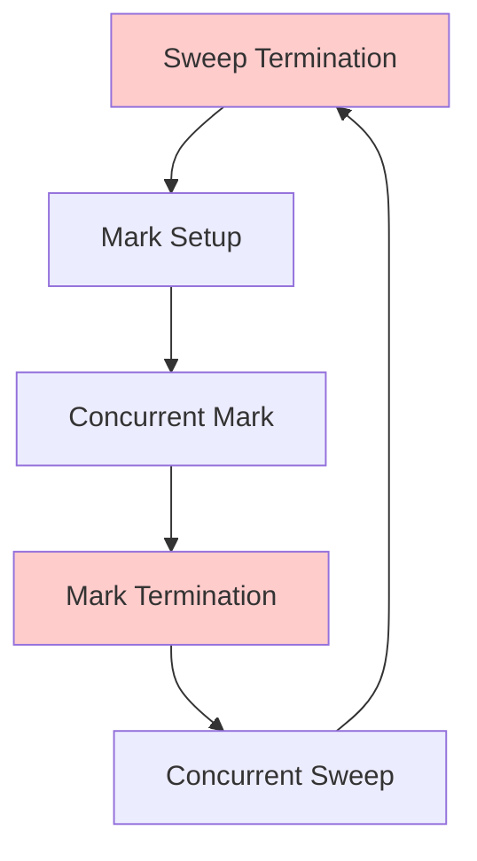

# 🧠 Go Memory Model and GC

## Introduction

Go's memory model defines how goroutines interact through memory and what guarantees the language provides about reads and writes. Understanding happens-before relationships is essential for writing correct concurrent code without data races. The model is formalized in the Go Memory Model document and enforced by the race detector, but reasoning about it manually is what separates senior engineers from those who merely avoid races by accident.

The garbage collector (GC) is a concurrent, tri-color mark-and-sweep collector designed to keep stop-the-world (STW) pauses sub-millisecond in most workloads. Unlike generational collectors in the JVM, Go's GC is non-generational and focuses on latency over throughput. Tuning it requires understanding the trade-off between CPU overhead and heap size, which is governed by the [[03 - Go Performance Tuning|pprof and benchmarking]] ecosystem as well as environment variables like `GOGC` and `GOMEMLIMIT`.

## 1. Go Memory Model and Happens-Before

Deep conceptual explanation:

- **Happens-before**: A partial order of memory operations. If event A happens-before event B, then A's memory writes are visible to B.
- **Synchronization**: Channel sends happen-before corresponding receives. Unlocking a `sync.Mutex` happens-before a later lock of the same mutex. The `sync/atomic` package provides happens-before edges for atomic operations.
- **Data races**: Two goroutines access the same memory location, at least one is a write, and there is no happens-before relationship between them.
- ⚠️ **Warning**: The Go race detector has a ~10x slowdown and 10x memory overhead. Never leave it enabled in production binaries.
- 💡 **Tip**: Use `go test -race` in CI for every commit, but gate it behind a short-timeout flag to prevent pipeline stalls.

Real case: Twitch tuned Go GC for sub-millisecond latency by profiling heap growth, adding a memory ballast, and setting `GOMEMLIMIT` to cap RSS usage during live-streaming ingestion spikes.

## 2. Garbage Collector Internals and Tuning

Go uses a **tri-color concurrent mark-and-sweep** algorithm:

| Phase | Description | STW? | Duration |
|---|---|---|---|
| Sweep Termination | Finish previous sweep, prepare for mark | Yes | ~10–100 µs |
| Mark Setup | Enable write barriers, scan stack roots | Yes | ~10–100 µs |
| Marking | Tri-color mark with mutator assistance | No | 25–50% of CPU |
| Mark Termination | Flush write barrier buffers, rescan roots | Yes | ~10–100 µs |
| Sweeping | Reclaim unreachable objects incrementally | No | Background |

GC strategies comparison:

| Strategy | Latency | Throughput | Use Case |
|---|---|---|---|
| Go GC (concurrent) | Low | Moderate | Microservices, real-time APIs |
| JVM G1 | Configurable | High | Big data, long-running batch |
| .NET Concurrent | Low | Moderate | Cloud-native backends |
| Manual (C/Rust) | Zero | Maximal | Systems, games, embedded |

Formula:

```
GC_Target = Live_Heap × (1 + GOGC / 100)
```

For example, if the live heap after a collection is 100 MB and `GOGC=100`, the next GC target is 200 MB total heap.

⚠️ **Warning**: Setting `GOGC=off` disables automatic GC. This is dangerous unless you pair it with `GOMEMLIMIT` and explicit `runtime.GC()` calls.

💡 **Tip**: For services with large steady-state heaps, set `GOMEMLIMIT` to ~80% of container memory limit and `GOGC=50` to trade CPU for stable RSS.

## 3. GC Cycle and Memory Layout

Mermaid diagram of the GC cycle:



Wikimedia Commons references:

- 
- 

## 4. Go Code: Memory Profiling and GC Tuning

```go
package main

import (
	"fmt"
	"os"
	"runtime"
	"runtime/pprof"
	"time"
)

func main() {
	// Enable memory profiling
	f, _ := os.Create("mem.prof")
	defer f.Close()

	// Ballast: allocate a large slice but do not use it
	// This tricks the GC into thinking the live heap is larger,
	// reducing relative allocation pressure.
	ballast := make([]byte, 1<<30) // 1 GB
	_ = ballast

	// Tuning environment variables (set before run):
	// GOGC=50
	// GOMEMLIMIT=1500MiB
	fmt.Println("GOGC:", os.Getenv("GOGC"))
	fmt.Println("GOMEMLIMIT:", os.Getenv("GOMEMLIMIT"))

	// Simulate load
	for i := 0; i < 5; i++ {
		_ = make([]byte, 100<<20) // 100 MB
		runtime.GC()
		time.Sleep(500 * time.Millisecond)
	}

	_ = pprof.WriteHeapProfile(f)
}
```

## 5. Runtime Observability

Deep conceptual explanation:

- `GODEBUG=gctrace=1` prints GC telemetry to stderr: heap size, CPU fraction, wall time, and forced collections.
- `runtime.ReadMemStats` exposes detailed counters: `HeapSys`, `HeapInuse`, `HeapIdle`, `NumGC`, `PauseNs`.
- Prometheus + `runtime/metrics` (Go 1.16+) is the modern way to export GC telemetry.

---

## 📦 Compression Code

Complete Go script for heap dump compression:

```go
package main

import (
	"compress/gzip"
	"fmt"
	"io"
	"os"
)

func main() {
	in, err := os.Open("mem.prof")
	if err != nil {
		fmt.Println("open:", err)
		return
	}
	defer in.Close()

	out, err := os.Create("mem.prof.gz")
	if err != nil {
		fmt.Println("create:", err)
		return
	}
	defer out.Close()

	gz := gzip.NewWriter(out)
	defer gz.Close()

	if _, err := io.Copy(gz, in); err != nil {
		fmt.Println("copy:", err)
		return
	}
	fmt.Println("Compressed mem.prof -> mem.prof.gz")
}
```

## 🎯 Documented Project

### Description

Build a Go microservice that ingests high-frequency event streams and enforces a sub-millisecond GC pause budget. The service must dynamically adjust `GOMEMLIMIT` based on container cgroup limits and emit GC telemetry to Prometheus.

### Functional Requirements

1. Expose an HTTP `/ingest` endpoint that accepts JSON events and buffers them in a bounded channel.
2. Read `GOMEMLIMIT` from environment; if unset, derive it from `/sys/fs/cgroup/memory/memory.limit_in_bytes` (fallback to 80% of total RAM).
3. Emit Prometheus metrics: `go_gc_duration_seconds`, `go_memstats_heap_inuse_bytes`, `go_gc_forced_count`.
4. Provide a `/debug/forcegc` endpoint to trigger `runtime.GC()` on demand for testing.
5. Include a `loadtest` CLI that sends 10k RPS for 60 seconds and validates p99 latency < 5ms.

### Main Components

- `cmd/server`: HTTP server with ingest handler and GC tuning.
- `internal/gctuner`: Reads cgroup limits and sets `GOMEMLIMIT`.
- `internal/metrics`: Prometheus exporter wrapper.
- `cmd/loadtest`: Vegeta-style HTTP load generator.

### Success Metrics

- p99 GC pause < 1ms under 10k RPS sustained load.
- RSS stays within 85% of container limit for 10 minutes.
- Zero data races under `go test -race`.

### References

- [The Go Memory Model](https://go.dev/ref/mem)
- [Go GC Guide](https://go.dev/doc/gc-guide)
- [Twitch: Go GC Tuning](https://blog.twitch.tv/en/2019/04/10/go-memory-ballast-how-i-learnt-to-stop-worrying-and-love-the-heap/)
