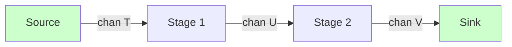
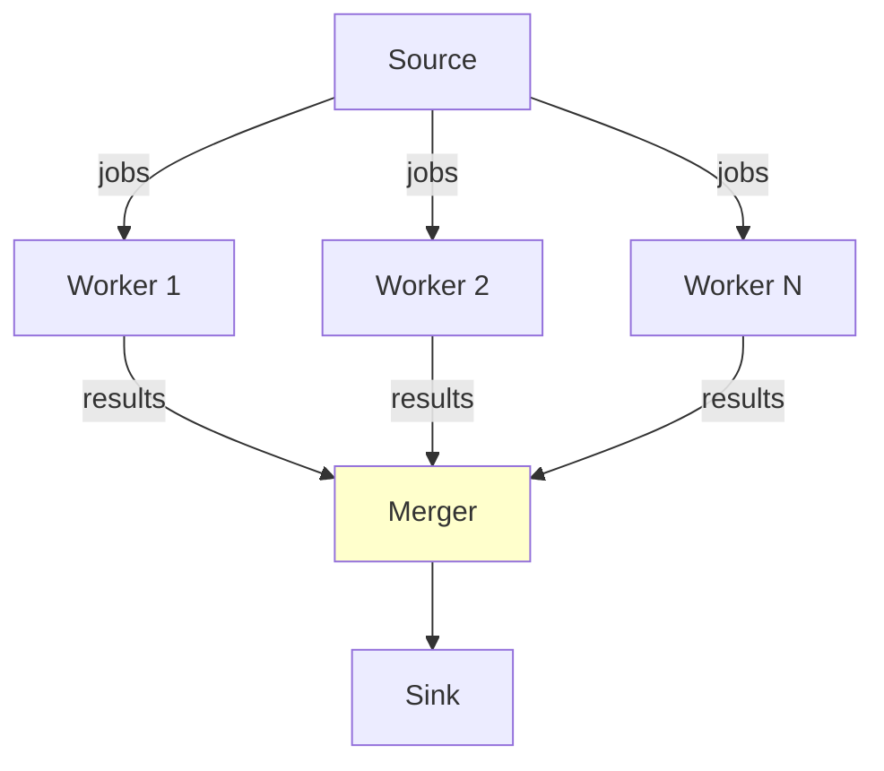

# 🧩 Advanced Concurrency Patterns

## Introduction

Go's concurrency primitives—goroutines and channels—are deceptively simple, yet building robust production systems requires patterns that handle cancellation, backpressure, error propagation, and resource pooling. The `context` package is the backbone of request-scoped values and deadlines in every modern Go service, while the `sync` package provides low-overhead building blocks for shared-state coordination without channels.

This course explores patterns such as pipelines, fan-out/fan-in, and worker pools that appear in large-scale systems like those at Google and Uber. Mastering these patterns enables you to replace fragile sequential code with composable, testable concurrent architectures. These topics naturally complement the [[01 - Go Memory Model and GC|memory model and GC]] because goroutine leaks and channel misuse directly impact heap growth and STW pause times.

## 1. Context, Cancellation, and Deadlines

Deep conceptual explanation:

- **context.Context**: An immutable tree of deadlines, cancellation signals, and request-scoped key-value pairs. Each derived context extends the parent.
- **Cancellation**: `ctx.Done()` closes when the parent cancels or the deadline expires. Always check `ctx.Err()` to distinguish `Canceled` from `DeadlineExceeded`.
- **Values**: Use `ctx.Value` only for request-scoped metadata (trace IDs, auth tokens), not for passing optional arguments. Abuse leads to hidden dependencies and brittle APIs.
- ⚠️ **Warning**: Never store a context inside a struct. Pass it as the first function argument explicitly.
- 💡 **Tip**: Use `context.WithTimeout` for RPC calls and `context.WithCancel` for background workers that need graceful shutdown.

Real case: Google uses `errgroup` (from `golang.org/x/sync/errgroup`) for parallel RPCs in monolithic search backends. A single failed RPC cancels the shared context, immediately aborting sibling in-flight requests and freeing goroutines.

## 2. Synchronization Primitives

The `sync` package offers several primitives for shared-state concurrency:

| Primitive | Use Case | Thread-Safe | Overhead |
|---|---|---|---|
| sync.Mutex | Exclusive access to shared state | Yes | Low |
| sync.RWMutex | Many readers, few writers | Yes | Moderate |
| sync.Pool | Object reuse, reduces GC pressure | Yes | Very low |
| sync.Map | Concurrent map with typed safety trade-offs | Yes | Higher than map+Mutex |
| sync.Once | Exactly-once initialization | Yes | Very low |
| sync.WaitGroup | Wait for a collection of goroutines | Yes | Low |

Concurrency primitives comparison for common patterns:

| Pattern | Recommended Primitive | Why |
|---|---|---|
| HTTP connection pool | `sync.Pool` | Reuse buffers, avoid allocations per request |
| Global config loader | `sync.Once` | Lazy init without double-check locking |
| Parallel stage aggregation | `sync.WaitGroup` | Block until all workers finish |
| Long-lived shared cache | `map + sync.RWMutex` | Better performance than `sync.Map` for typed keys |

Formula for CPU-bound worker pools:

```
Optimal Workers ≈ NumCPU
```

For I/O-bound tasks, workers can exceed `NumCPU` because goroutines yield during blocking syscalls.

⚠️ **Warning**: `sync.Map` is optimized for append-only caches with many CPUs. For most use cases, a regular `map` protected by a `sync.RWMutex` is faster and type-safe.

## 3. Pipeline and Fan-Out/Fan-In

Mermaid diagram of a pipeline pattern:



Mermaid diagram of fan-out/fan-in:



Wikimedia Commons reference:

- 

## 4. Go Code: Pipeline and Errgroup

```go
package main

import (
	"context"
	"fmt"
	"math/rand"
	"time"

	"golang.org/x/sync/errgroup"
)

// Pipeline stage: generator -> squarer -> printer
func generator(ctx context.Context, nums ...int) <-chan int {
	out := make(chan int)
	go func() {
		defer close(out)
		for _, n := range nums {
			select {
			case out <- n:
			case <-ctx.Done():
				return
			}
		}
	}()
	return out
}

func squarer(ctx context.Context, in <-chan int) <-chan int {
	out := make(chan int)
	go func() {
		defer close(out)
		for n := range in {
			select {
			case out <- n * n:
			case <-ctx.Done():
				return
			}
		}
	}()
	return out
}

func main() {
	ctx, cancel := context.WithTimeout(context.Background(), 2*time.Second)
	defer cancel()

	// Pipeline demo
	nums := generator(ctx, 1, 2, 3, 4, 5)
	squares := squarer(ctx, nums)
	for s := range squares {
		fmt.Println("square:", s)
	}

	// Errgroup: parallel workers with error propagation
	g, ctx := errgroup.WithContext(ctx)
	results := make(chan int, 10)

	for i := 0; i < 3; i++ {
		id := i
		g.Go(func() error {
			select {
			case <-ctx.Done():
				return ctx.Err()
			case results <- rand.Intn(100):
				if id == 2 {
					return fmt.Errorf("worker %d failed", id)
				}
				return nil
			}
		})
	}

	if err := g.Wait(); err != nil {
		fmt.Println("errgroup error:", err)
	}
	close(results)

	fmt.Println("results:")
	for r := range results {
		fmt.Println(r)
	}
}
```

## 5. Worker Pools and Backpressure

Deep conceptual explanation:

- **Worker pool**: A fixed set of goroutines reading from a shared job channel. Limits concurrency and prevents resource exhaustion.
- **Backpressure**: Use a buffered job channel with bounded capacity. When full, producers block or drop jobs rather than spawning unlimited goroutines.
- **Errgroup vs WaitGroup**: `errgroup.Group` wraps `sync.WaitGroup` and adds context cancellation plus first-error return. Prefer it when errors must short-circuit the group.
- ⚠️ **Warning**: Leaking goroutines by sending to a channel that is never read is the #1 cause of memory growth in concurrent Go programs. Always pair sends with `select` on `ctx.Done()`.
- 💡 **Tip**: Instrument your worker pools with `expvar` or Prometheus metrics for queue depth, active workers, and processed jobs per second.

---

## 📦 Compression Code

Complete Go script that compresses a channel of byte slices using gzip workers in a pool:

```go
package main

import (
	"bytes"
	"compress/gzip"
	"fmt"
	"sync"
)

func main() {
	jobs := make(chan []byte, 10)
	results := make(chan bytes.Buffer, 10)
	var wg sync.WaitGroup

	// Worker pool: 4 gzip workers
	for w := 0; w < 4; w++ {
		wg.Add(1)
		go func() {
			defer wg.Done()
			for data := range jobs {
				var buf bytes.Buffer
				gz := gzip.NewWriter(&buf)
				gz.Write(data)
				gz.Close()
				results <- buf
			}
		}()
	}

	// Producer
	go func() {
		for i := 0; i < 20; i++ {
			jobs <- []byte(fmt.Sprintf("payload-%d", i))
		}
		close(jobs)
	}()

	// Wait and close results
	go func() {
		wg.Wait()
		close(results)
	}()

	count := 0
	for range results {
		count++
	}
	fmt.Println("Compressed chunks:", count)
}
```

## 🎯 Documented Project

### Description

Build an image thumbnail generator service that accepts URLs via HTTP, downloads images in parallel, resizes them using a worker pool, and returns a ZIP archive. The service must support request cancellation and propagate the first resize error to the client.

### Functional Requirements

1. `POST /thumbnails` accepts a JSON list of image URLs and a `?max_width` query parameter.
2. Use `context.WithTimeout` to enforce a 30-second per-request deadline.
3. Download images concurrently with `errgroup`; cancel remaining downloads if any fails.
4. Resize images in a worker pool sized to `runtime.NumCPU()`.
5. Return a ZIP file or a JSON error body with the first failure reason.

### Main Components

- `cmd/api`: HTTP server with thumbnail handler.
- `internal/downloader`: `errgroup`-based parallel HTTP fetcher.
- `internal/resizer`: Worker pool using `image/draw` and `golang.org/x/image/draw`.
- `internal/zipper`: Streams ZIP into the HTTP response writer.

### Success Metrics

- p99 request latency < 10s for 50 images on a 4-core machine.
- Zero goroutine leaks under `go test -race` with 1k concurrent requests.
- Graceful cancellation: all goroutines exit within 1s of client disconnect.

### References

- [Go Concurrency Patterns: Pipelines and Cancellation](https://go.dev/blog/pipelines)
- [Errgroup package](https://pkg.go.dev/golang.org/x/sync/errgroup)
- [Go Memory Model](https://go.dev/ref/mem)
