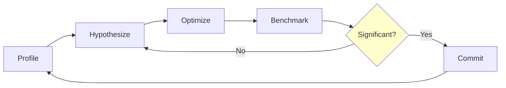

# ⚡ Go Performance Tuning

## Introduction

Performance tuning in Go is a systematic process of measuring, profiling, optimizing, and validating. The language ships with a world-class profiling toolchain via `pprof` and a benchmarking framework in the standard `testing` package. However, raw benchmarks can be misleading without statistical rigor; tools like `benchstat` help determine whether an optimization is real or noise. Understanding compiler behavior—such as escape analysis and inlining—is also critical because seemingly innocent code changes can disable optimizations and degrade performance.

This course ties directly into [[01 - Go Memory Model and GC|GC tuning]] and [[02 - Advanced Concurrency Patterns|concurrency patterns]] because allocation pressure and goroutine scheduling are often the dominant bottlenecks in Go programs. We will explore how to locate hot paths, interpret flame graphs, and apply compiler-friendly idioms that keep data on the stack and reduce CPU cache misses.

## 1. Profiling with pprof

Deep conceptual explanation:

- **CPU profiling**: Samples the call stack at a configurable frequency (default 100 Hz). Shows where the program spends time, not wall-clock latency blocked on I/O.
- **Memory profiling**: Samples heap allocations. Use `allocs` to see allocation sites or `heap` to see live objects.
- **Goroutine profiling**: Dumps all goroutine stacks. Essential for detecting leaks and contention.
- **Block/Mutex profiling**: Samples blocking operations on channels, mutexes, and selects. High mutex wait time indicates lock contention.
- ⚠️ **Warning**: Memory profiling has a sampling rate that can hide small, frequent allocations. Enable `runtime.MemProfileRate = 1` only in dev, never in production.
- 💡 **Tip**: Enable `net/http/pprof` in a sidecar or admin port, never on the public HTTP port. Use a firewall or mTLS to protect profiling endpoints.

Real case: CockroachDB optimizes Go query execution by combining CPU profiles from live clusters with block profiles to identify mutex contention in the SQL execution engine. They reduced query latency by 40% by replacing a coarse global mutex with a sharded lock array.

## 2. Benchmarking and Statistical Rigor

Profiling types mapped to use cases:

| Profile Type | Flag / Endpoint | Best For | Overhead |
|---|---|---|---|
| CPU | `?seconds=30` | Hot paths, algorithm choice | Low (~5%) |
| Heap (alloc) | `?debug=1` | Allocation sites, GC pressure | Very low |
| Heap (inuse) | `?debug=1` | Memory leaks, retention | Very low |
| Goroutine | `?debug=2` | Goroutine leaks, deadlocks | Near zero |
| Block | `runtime.SetBlockProfileRate` | Channel/mutex wait times | Low |
| Mutex | `runtime.SetMutexProfileFraction` | Lock contention | Low |

Benchmarking workflow:

- Use `testing.B` and `b.N` to run microbenchmarks.
- Run with `-count=10` and compare with `benchstat` for significance.
- Always benchmark on idle hardware; cloud VMs with noisy neighbors produce unreliable variance.
- Isolate the code under test; avoid side effects like logging or network I/O.

Formula for speedup:

```
Speedup = T_old / T_new
```

For example, if the old implementation takes 120ms and the new one takes 80ms, the speedup is 1.5x.

⚠️ **Warning**: A benchmark with `Speedup = 1.05x` and p-value > 0.05 is statistically indistinguishable from noise. Do not ship "optimizations" without `benchstat` validation.

## 3. Compiler Optimizations

Mermaid diagram of the performance tuning workflow:



Wikimedia Commons references:

- 
- 

## 4. Go Code: Benchmark and pprof Integration

```go
package main

import (
	"fmt"
	"os"
	"runtime/pprof"
	"testing"
)

// Example function to benchmark
func SumSquares(n int) int {
	sum := 0
	for i := 1; i <= n; i++ {
		sum += i * i
	}
	return sum
}

func BenchmarkSumSquares(b *testing.B) {
	for i := 0; i < b.N; i++ {
		_ = SumSquares(10000)
	}
}

func main() {
	// CPU profile
	f, _ := os.Create("cpu.prof")
	defer f.Close()
	_ = pprof.StartCPUProfile(f)
	defer pprof.StopCPUProfile()

	result := SumSquares(1000000)
	fmt.Println("Result:", result)
}
```

Run benchmarks:

```bash
go test -bench=. -benchmem -count=10 > old.txt
# apply optimization
go test -bench=. -benchmem -count=10 > new.txt
benchstat old.txt new.txt
```

Escape analysis inspection:

```bash
go build -gcflags="-m=2" ./...
```

## 5. Tuning Checklist

Deep conceptual explanation:

- **Stack vs heap**: Small values returned by value stay on the stack. Pointers and closures escape to the heap. Favor value semantics for hot paths.
- **Inlining**: Functions under ~40 inline cost units (dependent on architecture) are inlined. Keep hot functions small and avoid `defer` in tight loops if inlining is critical.
- **Bounds checks**: Access slices with known lengths or use `for i := range s` instead of `for i := 0; i < len(s); i++` when possible to help the compiler eliminate checks.
- 💡 **Tip**: Use `GOEXPERIMENT=loopvar` (Go 1.22+) to avoid accidental loop-variable capture, which can cause unexpected heap allocations.

---

## 📦 Compression Code

Complete Go script that benchmarks gzip compression levels and picks the fastest:

```go
package main

import (
	"bytes"
	"compress/gzip"
	"fmt"
	"testing"
)

var payload = bytes.Repeat([]byte("hello world "), 10000)

func benchmarkLevel(level int) testing.BenchmarkResult {
	return testing.Benchmark(func(b *testing.B) {
		for i := 0; i < b.N; i++ {
			var buf bytes.Buffer
			w, _ := gzip.NewWriterLevel(&buf, level)
			w.Write(payload)
			w.Close()
		}
	})
}

func main() {
	for _, lvl := range []int{gzip.BestSpeed, gzip.DefaultCompression, gzip.BestCompression} {
		res := benchmarkLevel(lvl)
		fmt.Printf("Level %d: %s\n", lvl, res.String())
	}
}
```

## 🎯 Documented Project

### Description

Build a high-throughput log aggregator that ingests structured logs, compresses them in batches, and exposes pprof endpoints. The service must include benchmarks for the compression pipeline and demonstrate a measurable speedup using `benchstat`.

### Functional Requirements

1. `POST /ingest` accepts NDJSON log lines and appends them to a ring buffer per tenant.
2. Every 5 seconds or 10k lines (whichever comes first), compress the batch with `gzip` and write to a rotated file on disk.
3. Expose `/debug/pprof/` endpoints on a separate admin port bound to localhost.
4. Include a `BenchmarkCompressBatch` test that benchmarks batch compression with `-count=10`.
5. Document a before/after optimization (e.g., `sync.Pool` for buffers) with `benchstat` output in `BENCHSTAT.md`.

### Main Components

- `cmd/aggregator`: HTTP server with ingest and pprof.
- `internal/buffer`: Ring buffer with per-tenant sharding.
- `internal/compressor`: Batched gzip writer with `sync.Pool`.
- `internal/rotator`: Time- and size-based file rotation.

### Success Metrics

- CPU profile shows < 30% time spent in `compress/flate` under 50k logs/sec.
- `benchstat` reports a statistically significant improvement (p < 0.05) after optimization.
- Goroutine profile shows no leaks after 1M requests in `go test -race`.

### References

- [Profiling Go Programs](https://go.dev/blog/pprof)
- [benchstat](https://pkg.go.dev/golang.org/x/perf/cmd/benchstat)
- [Go Compiler Optimizations](https://go.dev/src/cmd/compile/README.md)
- [CockroachDB Performance](https://www.cockroachlabs.com/blog/)
