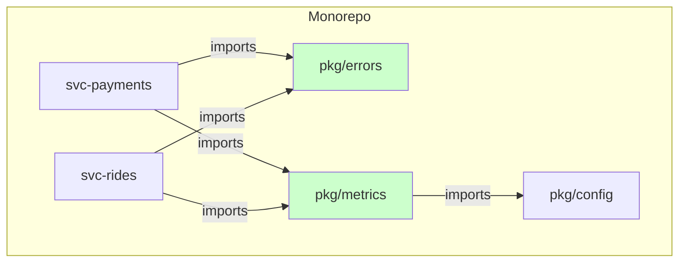
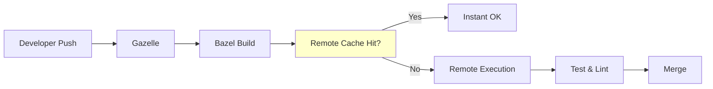

# 🏢 Go in Large Codebases (Uber, Stripe)

## Introduction

As Go adoption grows inside companies like Uber, Stripe, and Google, the challenges shift from language syntax to scale: millions of lines of code, thousands of engineers, and strict requirements for build reproducibility, code consistency, and fast CI. Large codebases demand discipline in module boundaries, dependency management, and linting. Monorepo strategies such as Bazel or custom tooling replace simple `go build` workflows to provide hermetic builds and remote caching.

This course explores domain-driven design (DDD) in Go, the mechanics of writing custom linters using the `go/analysis` framework, and the trade-offs of monorepo tooling. Understanding these topics connects to [[03 - Go Performance Tuning|performance tuning]] because build-system cache hits and linter speed directly impact developer velocity, and to [[02 - Advanced Concurrency Patterns|concurrency]] because large services are invariably highly concurrent.

## 1. Monorepo Strategies and Build Systems

Deep conceptual explanation:

- **Monorepo**: A single repository containing many projects, libraries, and services. Enables atomic cross-project refactors and unified versioning.
- **Bazel**: Google's build system that provides hermetic builds, sandboxing, and remote execution. Uses `BUILD` files with explicit dependency graphs.
- **Custom tooling**: Uber developed `go.uber.org/multierr`, `go.uber.org/zap`, and internal codegen tools to enforce patterns across millions of lines of Go.
- **Module proxy**: Large organizations run internal module proxies (Athens) and checksum databases to vet external dependencies.
- ⚠️ **Warning**: Do not mix Go modules with Bazel's `go_rules` haphazardly. Use `gazelle` to auto-generate `BUILD` files from `go.mod` to avoid divergence.
- 💡 **Tip**: Adopt a "one module per service, shared libraries in a top-level `pkg/`" layout only if your repo is under ~100k lines. Beyond that, multi-module or Bazel is usually necessary.

Real case: Uber manages millions of lines of Go across thousands of microservices inside a monorepo. They use a custom linter framework (`go/analysis` based) and a centralized dependency graph to prevent diamond-dependency version conflicts and ensure that every service compiles with the same Go compiler version.

## 2. Code Organization and Domain-Driven Design

Monorepo tools comparison:

| Tool | Build Language | Remote Cache | Go Native? | Learning Curve |
|---|---|---|---|---|
| Bazel | Starlark | Yes | Via rules_go | Steep |
| Buck2 | Starlark | Yes | Via buck2-prelude | Steep |
| Nx | JSON/TS | Yes | Limited | Moderate |
| go modules | Go | No (modcache) | Yes | Low |
| Please | Python-like | Yes | Via go rules | Moderate |

Domain-driven design layers in Go:

| Layer | Responsibility | Example Package |
|---|---|---|
| Domain | Entities, value objects, business rules | `domain/ride` |
| Use Case | Application services, orchestration | `usecase/billing` |
| Interface | HTTP handlers, gRPC servers, DTOs | `interface/http` |
| Infrastructure | DB, cache, message queue clients | `infra/postgres` |

⚠️ **Warning**: Do not let DDD layering introduce circular imports. Go forbids circular package dependencies, so always design interfaces in the domain layer and depend on abstractions, not concrete infrastructure packages.

## 3. Large Codebase Architecture

Mermaid diagram of a monorepo service architecture:



Mermaid diagram of the build pipeline:



Wikimedia Commons reference:

- 

## 4. Go Code: Custom Linter with go/analysis

```go
package main

import (
	"fmt"
	"go/ast"
	"go/parser"
	"go/token"
)

// Simple AST-based linter: flag os.Exit calls in main package
func main() {
	fset := token.NewFileSet()
	node, err := parser.ParseFile(fset, "example.go", src, 0)
	if err != nil {
		fmt.Println("parse error:", err)
		return
	}

	ast.Inspect(node, func(n ast.Node) bool {
		call, ok := n.(*ast.CallExpr)
		if !ok {
			return true
		}
		selector, ok := call.Fun.(*ast.SelectorExpr)
		if !ok {
			return true
		}
		ident, ok := selector.X.(*ast.Ident)
		if ok && ident.Name == "os" && selector.Sel.Name == "Exit" {
			fmt.Println("warning: direct os.Exit call detected")
		}
		return true
	})
}

var src = `
package main

import "os"

func main() {
	os.Exit(1)
}
`
```

For production use, wrap this logic in the `golang.org/x/tools/go/analysis` framework:

```go
package main

import (
	"go/ast"
	"golang.org/x/tools/go/analysis"
	"golang.org/x/tools/go/analysis/singlechecker"
)

var NoExitAnalyzer = &analysis.Analyzer{
	Name: "noexit",
	Doc:  "disallow os.Exit in main package",
	Run:  run,
}

func run(pass *analysis.Pass) (interface{}, error) {
	for _, f := range pass.Files {
		ast.Inspect(f, func(n ast.Node) bool {
			// ... same logic as above, using pass.Reportf
			return true
		})
	}
	return nil, nil
}

func main() {
	singlechecker.Main(NoExitAnalyzer)
}
```

## 5. Linting at Scale

Deep conceptual explanation:

- **AST analysis**: Parse source into an abstract syntax tree to detect patterns (e.g., forbidden imports, missing context propagation).
- **SSA analysis**: Static single-assignment form for dataflow and dead-code detection. Used by advanced linters like `nilaway`.
- **Custom rules**: Encode company-specific conventions (e.g., "always use `pkg/errors` instead of `fmt.Errorf`") as analyzers that run in CI.
- 💡 **Tip**: Run analyzers as a single multichecker binary to share parsing overhead. Uber's `nilaway` and `gopatch` are open-source examples of this approach.

---

## 📦 Compression Code

Complete Go script that compresses a monorepo's `.go` source files into a single tarball:

```go
package main

import (
	"archive/tar"
	"compress/gzip"
	"fmt"
	"io"
	"os"
	"path/filepath"
	"strings"
)

func main() {
	out, _ := os.Create("monorepo-go.tar.gz")
	defer out.Close()

	gz := gzip.NewWriter(out)
	defer gz.Close()
	 tw := tar.NewWriter(gz)
	defer tw.Close()

	filepath.Walk(".", func(path string, info os.FileInfo, err error) error {
		if err != nil || info.IsDir() || !strings.HasSuffix(path, ".go") {
			return err
		}
		hdr, _ := tar.FileInfoHeader(info, path)
		hdr.Name = path
		tw.WriteHeader(hdr)
		f, _ := os.Open(path)
		defer f.Close()
		io.Copy(tw, f)
		return nil
	})

	fmt.Println("Created monorepo-go.tar.gz")
}
```

## 🎯 Documented Project

### Description

Build a monorepo linting CLI that scans a large Go codebase for DDD layer violations (e.g., `domain` packages importing `infra`), forbidden `os.Exit` calls, and missing `context.Context` parameters in public APIs. The CLI must output SARIF for GitHub integration.

### Functional Requirements

1. `lintrepo --root=./` walks all Go packages and runs registered analyzers.
2. Analyzer: `domaininfra` fails if any package under `domain/` imports a package under `infra/`.
3. Analyzer: `nocontext` fails if exported functions with >=2 parameters lack `context.Context` as the first argument.
4. Output format: SARIF 2.1.0 JSON suitable for GitHub Advanced Security upload.
5. Include a `go/analysis` multichecker binary and a `Makefile` target for Bazel-compatible builds.

### Main Components

- `cmd/lintrepo`: CLI entrypoint with SARIF formatter.
- `pkg/analyzers/domaininfra`: DDD layer violation detector.
- `pkg/analyzers/nocontext`: Context parameter enforcer.
- `pkg/sarif`: SARIF report builder.

### Success Metrics

- Scans 1,000 packages in under 30 seconds on a laptop.
- Zero false positives on the standard library.
- CI integration passes with SARIF upload to GitHub.

### References

- [Uber Go Style Guide](https://github.com/uber-go/guide)
- [go/analysis](https://pkg.go.dev/golang.org/x/tools/go/analysis)
- [Bazel rules_go](https://github.com/bazelbuild/rules_go)
- [SARIF Specification](https://docs.oasis-open.org/sarif/sarif/v2.1.0/)
