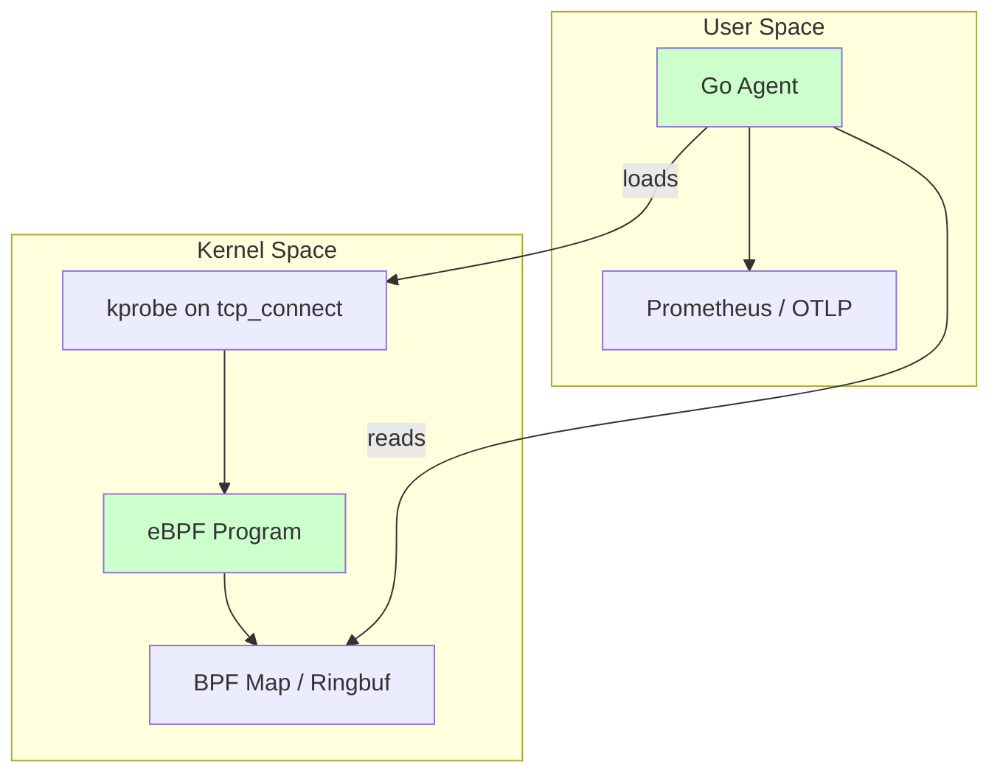
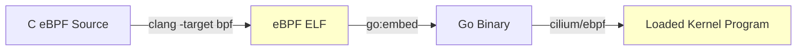

# 🔬 Go and eBPF for Observability

## Introduction

eBPF (extended Berkeley Packet Filter) is a revolutionary technology that allows running sandboxed programs inside the Linux kernel without changing kernel source code or loading kernel modules. It enables high-performance observability, networking, and security use cases. While eBPF programs are traditionally written in C and compiled via LLVM, the Go ecosystem—led by libraries like `cilium/ebpf`—has made it possible to write eBPF tooling entirely in Go, from loading and pinning programs to reading perf events and BPF maps.

This course connects to [[03 - Go Performance Tuning|performance tuning]] because eBPF provides zero-instrumentation profiling and to [[01 - Go Memory Model and GC|memory model]] because eBPF maps are shared-memory structures that require careful synchronization semantics. Mastering eBPF + Go opens the door to building custom observability agents that outperform traditional user-space polling.

## 1. eBPF Fundamentals

Deep conceptual explanation:

- **eBPF programs**: Sandboxed bytecode verified by the kernel for safety (no loops, no null dereferences, bounded execution). Attached to hooks such as kprobes, tracepoints, XDP, and cgroup BPF.
- **Maps**: Key-value stores shared between kernel eBPF programs and user-space Go applications. Types include `BPF_MAP_TYPE_HASH`, `BPF_MAP_TYPE_PERF_EVENT_ARRAY`, and `BPF_MAP_TYPE_RINGBUF`.
- **Probes**: `kprobe`/`kretprobe` intercept kernel functions. `uprobe`/`uretprobe` intercept user-space functions (e.g., Go runtime functions).
- **BTF**: BPF Type Format enables portable, CO-RE (Compile Once, Run Everywhere) programs by describing kernel data structures.
- ⚠️ **Warning**: eBPF verifier errors are cryptic. Common causes include unbounded loops, invalid map accesses, and stack size > 512 bytes. Use `bpftool prog load` with `-d` for detailed logs.
- 💡 **Tip**: Prefer `BPF_MAP_TYPE_RINGBUF` over `BPF_MAP_TYPE_PERF_EVENT_ARRAY` for new tools. It has better performance, fewer lost events, and a simpler API in Go.

Real case: Cilium uses eBPF + Go for networking in Kubernetes. Cilium's datapath is written in eBPF (C) and controlled by an agent written in Go. The Go side loads eBPF programs, maintains BPF maps for connection tracking, and exposes metrics without modifying the kernel.

## 2. eBPF Program Types and Use Cases

eBPF program types comparison:

| Type | Attach Point | Use Case | Overhead |
|---|---|---|---|
| kprobe / kretprobe | Kernel function entry/return | Tracing syscalls, scheduler events | Very low |
| tracepoint | Static kernel instrumentation points | Stable tracing (preferred over kprobes) | Very low |
| uprobe / uretprobe | User-space function entry/return | Tracing Go runtime, libc calls | Low |
| XDP | Network driver RX path | DDoS mitigation, load balancing | Near zero (driver level) |
| cgroup/skb | Cgroup socket buffer | Per-container network policy | Low |
| BPF_PROG_TYPE_KPROBE | Generic kernel probe | Custom observability tools | Low |

Formula for instrumentation overhead:

```
Overhead = (Instrumented_Latency - Baseline) / Baseline
```

For example, if a syscall takes 500 ns baseline and 550 ns with a kprobe attached, the overhead is 10%.

⚠️ **Warning**: Attaching uprobes to Go binaries requires accounting for Go's non-C ABI. Use `cilium/ebpf`'s uprobe helpers or `perf` with Go-specific offset calculation to avoid attaching to the wrong instruction.

## 3. eBPF Program Architecture

Mermaid diagram of eBPF program architecture:



Mermaid diagram of the Go + eBPF build flow:



Wikimedia Commons reference:

- 
- 

## 4. Go Code: eBPF Probe with cilium/ebpf

C source (`kprobe.c`) compiled to eBPF:

```c
#include "vmlinux.h"
#include <bpf/bpf_helpers.h>
#include <bpf/bpf_tracing.h>

struct event {
    u32 pid;
    u64 ts;
};

struct {
    __uint(type, BPF_MAP_TYPE_RINGBUF);
    __uint(max_entries, 1 << 20);
} rb SEC(".maps");

SEC("kprobe/tcp_connect")
int BPF_KPROBE(tcp_connect, struct sock *sk) {
    struct event *e = bpf_ringbuf_reserve(&rb, sizeof(*e), 0);
    if (!e)
        return 0;
    e->pid = bpf_get_current_pid_tgid() >> 32;
    e->ts = bpf_ktime_get_ns();
    bpf_ringbuf_submit(e, 0);
    return 0;
}

char LICENSE[] SEC("license") = "GPL";
```

Go loader (`main.go`):

```go
package main

import (
	"fmt"
	"log"
	"os"
	"os/signal"

	"github.com/cilium/ebpf/link"
	"github.com/cilium/ebpf/ringbuf"
	"github.com/cilium/ebpf/rlimit"
)

//go:generate go run github.com/cilium/ebpf/cmd/bpf2go -target bpfel -cc clang kprobe ./kprobe.c -- -I../headers

type kprobeEvent struct {
	PID uint32
	Ts  uint64
}

func main() {
	if err := rlimit.RemoveMemlock(); err != nil {
		log.Fatal(err)
	}

	objs := kprobeObjects{}
	if err := loadKprobeObjects(&objs, nil); err != nil {
		log.Fatalf("loading objects: %v", err)
	}
	defer objs.Close()

	kp, err := link.Kprobe("tcp_connect", objs.KprobeTcpConnect, nil)
	if err != nil {
		log.Fatalf("opening kprobe: %v", err)
	}
	defer kp.Close()

	reader, err := ringbuf.NewReader(objs.Rb)
	if err != nil {
		log.Fatalf("opening ringbuf reader: %v", err)
	}
	defer reader.Close()

	sig := make(chan os.Signal, 1)
	signal.Notify(sig, os.Interrupt)

	go func() {
		for {
			record, err := reader.Read()
			if err != nil {
				return
			}
			var event kprobeEvent
			_ = event // parse record.RawSample into event in real code
			fmt.Printf("tcp_connect event: %+v\n", event)
		}
	}()

	<-sig
	fmt.Println("Exiting...")
}
```

## 5. Building Observability Tools

Deep conceptual explanation:

- **CO-RE**: Compile Once, Run Everywhere. Use BTF and `vmlinux.h` to write eBPF programs that adapt to different kernel versions without recompilation.
- **Ringbuf vs Perfbuf**: Ringbuf is a newer, faster alternative to perf event arrays. It uses a shared memory ring buffer and supports variable-size records with fewer lost events.
- **Go runtime uprobes**: You can trace Go functions (e.g., `runtime.newproc`, `runtime.mallocgc`) using uprobes, but you must use the correct address offsets because Go binaries do not use the standard C calling convention.
- 💡 **Tip**: Use `bpftool btf dump file /sys/kernel/btf/vmlinux format c` to generate a portable `vmlinux.h` for CO-RE eBPF programs.

---

## 📦 Compression Code

Complete Go script that reads eBPF ringbuf records and compresses them to gzip before writing to disk:

```go
package main

import (
	"bytes"
	"compress/gzip"
	"fmt"
	"os"
)

func main() {
	// Simulated ringbuf payload
	payload := []byte("ebpf-event-data")

	var buf bytes.Buffer
	gz := gzip.NewWriter(&buf)
	gz.Write(payload)
	gz.Close()

	_ = os.WriteFile("events.gz", buf.Bytes(), 0644)
	fmt.Println("Wrote compressed events to events.gz")
}
```

## 🎯 Documented Project

### Description

Build a Go observability agent that attaches an eBPF kprobe to the `execve` system call, streams process execution events through a ringbuf, and exposes metrics via an HTTP `/metrics` endpoint in Prometheus format. The agent must run as a non-privileged binary using capabilities (`CAP_BPF`, `CAP_PERFMON`, `CAP_SYS_ADMIN` as fallback).

### Functional Requirements

1. Compile an eBPF C program that traces `__x64_sys_execve` and emits a struct with `pid`, `uid`, and `comm` (command name) to a `BPF_MAP_TYPE_RINGBUF`.
2. Use `cilium/ebpf` to load the program, attach the kprobe, and read the ringbuf from Go.
3. Maintain an in-memory counter map keyed by `comm` and expose it as `ebpf_execve_total{comm="..."}` on `/metrics`.
4. Gracefully handle `SIGINT` by detaching the kprobe and closing the ringbuf reader.
5. Include a `Makefile` with `generate`, `build`, and `run` targets that invoke `bpf2go` and set the required capabilities.

### Main Components

- `bpf/execve.c`: eBPF C source with CO-RE BTF usage.
- `cmd/agent`: Go agent with ringbuf reader and Prometheus HTTP server.
- `pkg/metrics`: Prometheus registry wrapper.
- `Makefile`: Build automation with `bpf2go` generation.

### Success Metrics

- < 1% CPU overhead on an idle 4-core VM.
- Zero missed events during a `for i in {1..1000}; do /bin/true; done` burst.
- `/metrics` responds with valid Prometheus text format within 100ms.

### References

- [cilium/ebpf](https://github.com/cilium/ebpf)
- [BPF and XDP Reference Guide](https://docs.cilium.io/en/stable/bpf/)
- [eBPF.io](https://ebpf.io/)
- [Cilium](https://cilium.io/)
