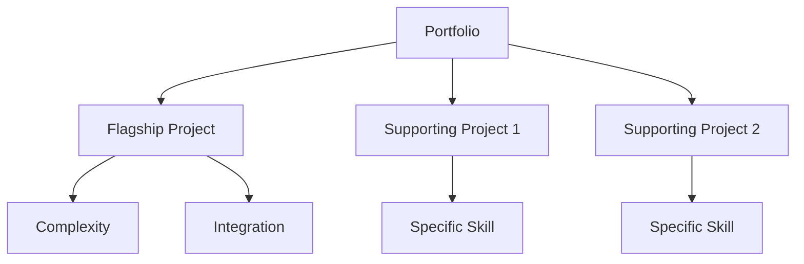
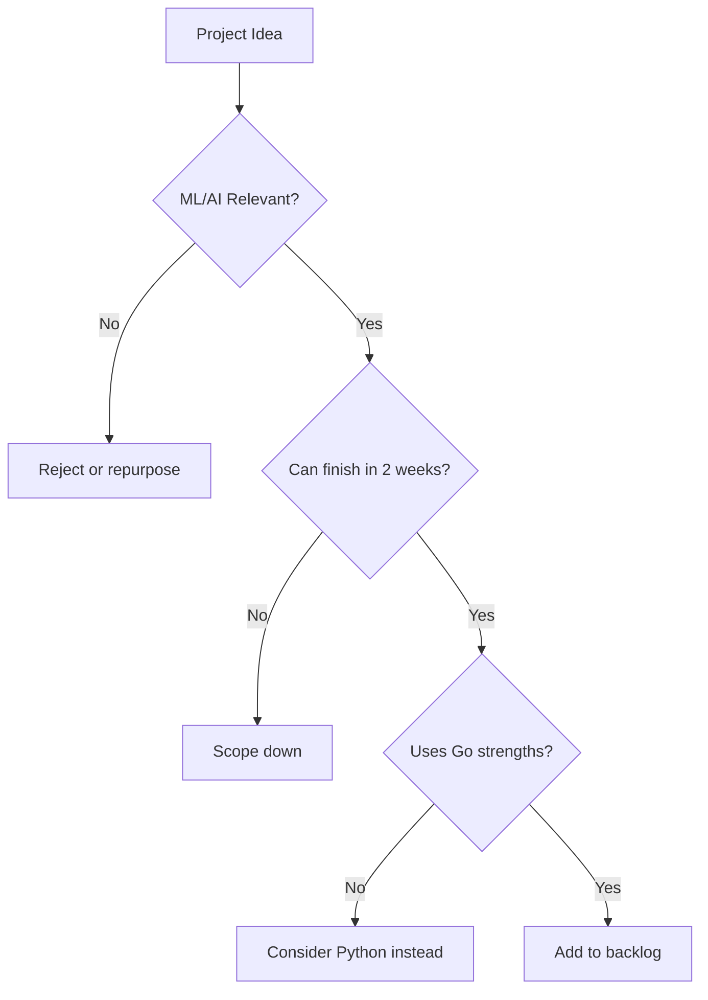

# 📋 Go Project Planning Guide

## Overview

This guide gives you a repeatable framework for choosing, scoping, and shipping Go projects that signal ML/AI engineering readiness to hiring managers. Recruiters scan portfolios in under 60 seconds. A clear narrative—one flagship project backed by two supporting projects—makes you memorable and demonstrates both depth and breadth.

## Prerequisites

- Basic Go syntax and module management
- Familiarity with Git and GitHub
- Docker installed locally
- A local Kubernetes cluster (kind or minikube)

## Learning Objectives

By the end of this guide you will be able to:

1. Evaluate project ideas through an ML/AI hiring lens
2. Scope work into 2-week sprints with clear deliverables
3. Structure a portfolio as a project pyramid
4. Choose tools that balance learning value and recruiter recognition

## Official Resources & Links

| Resource | Type | URL | Why It Matters |
|----------|------|-----|----------------|
| Go Documentation | Docs | https://go.dev/doc/ | Official language reference and best practices |
| GitHub Documentation | Docs | https://docs.github.com/ | Hosting, Actions, and portfolio presentation |
| Docker Documentation | Docs | https://docs.docker.com/ | Containerization is expected for modern ML roles |
| Kubernetes Documentation | Docs | https://kubernetes.io/docs/ | Orchestration skills differentiate juniors |
| Ollama Documentation | Docs | https://github.com/ollama/ollama | Local LLM inference is a practical ML/AI skill |

## Architecture & Planning

### Go Project Pyramid

Think of your portfolio as a pyramid:

- **1 Flagship Project:** Deep, complex, shows end-to-end ML system design
- **2 Supporting Projects:** Focused, demonstrate specific skills (APIs, CLI, DevOps)



### Project Selection Decision Tree



### Time-Boxing: 2-Week Sprints

Break every project into two-week sprints. Each sprint must end with a working artifact.

| Week | Focus | Deliverable |
|------|-------|-------------|
| 1 | Setup, core logic, unit tests | `go test` passes locally |
| 2 | Integration, containerization, README | Docker image + GitHub push |

## Step-by-Step Implementation Guide

1. **Audit your current skills.** List everything you know about Go, Docker, and ML concepts. Be honest—gaps become sprint goals.

2. **Pick your flagship project.** Choose the idea with the most moving parts that still fits in a month. [[04 - Local RAG System with Go]] is a strong candidate.

3. **Pick two supporting projects.** Select skills you want to highlight. [[01 - Gin API with Ollama Integration]] shows backend API design. [[02 - CLI Tool with Cobra]] shows developer tooling. [[03 - Microservice with gRPC and Kubernetes]] shows infrastructure. [[05 - ML Serving Gateway]] shows systems design.

4. **Define done for each project.** A clear Definition of Done prevents scope creep. Example: "Dockerized, tested, documented, and demo-ready."

5. **Create a GitHub repo per project.** Use consistent naming: `go-<project-name>`. Add a README with architecture diagrams and setup instructions.

6. **Set up a 2-week sprint board.** Use GitHub Projects or a simple markdown table. Move tasks from Todo to In Progress to Done daily.

7. **Build in public.** Tweet or blog about blockers and wins. Hiring managers value communication.

8. **Record a 2-minute demo.** Show the project running end-to-end. Host it on YouTube or as a GitHub repo GIF.

## Guide Class / Example

Below is a markdown sprint planner you can copy into each project repository.

```markdown
## Sprint Plan

### Sprint Goal
Ship a working [feature] by [date].

### Tasks
- [ ] Scaffold Go module
- [ ] Implement core handler
- [ ] Add unit tests
- [ ] Containerize with Docker
- [ ] Write README with setup steps

### Definition of Done
- `go test ./...` passes
- `docker build` succeeds
- README is copy-pasteable by a stranger
```

## Common Pitfalls & Checklist

⚠️ **Scope Creep:** Adding a frontend, auth, and payments to a CLI tool. If it is not on the sprint board, it does not exist.

⚠️ **Perfect over Done:** Refactoring for three weeks without a runnable binary. Recruiters cannot run refactorings.

⚠️ **No Narrative:** A repo with code but no README or diagram. The viewer has to reverse-engineer your intent.

✅ Checklist

| Checkpoint | Status |
|------------|--------|
| Project idea maps to an ML/AI job requirement | [ ] |
| Can be finished in 2 weeks of focused work | [ ] |
| Uses Go for its strengths (concurrency, binaries, speed) | [ ] |
| Has a runnable artifact by sprint end | [ ] |
| README explains what, why, and how in under 2 minutes | [ ] |

## Deployment & Portfolio Integration

Host your project pyramid on a simple GitHub profile README or a personal site. Order matters: flagship first, supporting projects below. Link directly to Docker images or live demos when possible. Use the repo descriptions to tag skills: "Go, gRPC, Kubernetes, LLMs."

## Next Steps

- [[01 - Gin API with Ollama Integration]]
- [[02 - CLI Tool with Cobra]]
- [[03 - Microservice with gRPC and Kubernetes]]
- [[04 - Local RAG System with Go]]
- [[05 - ML Serving Gateway]]
