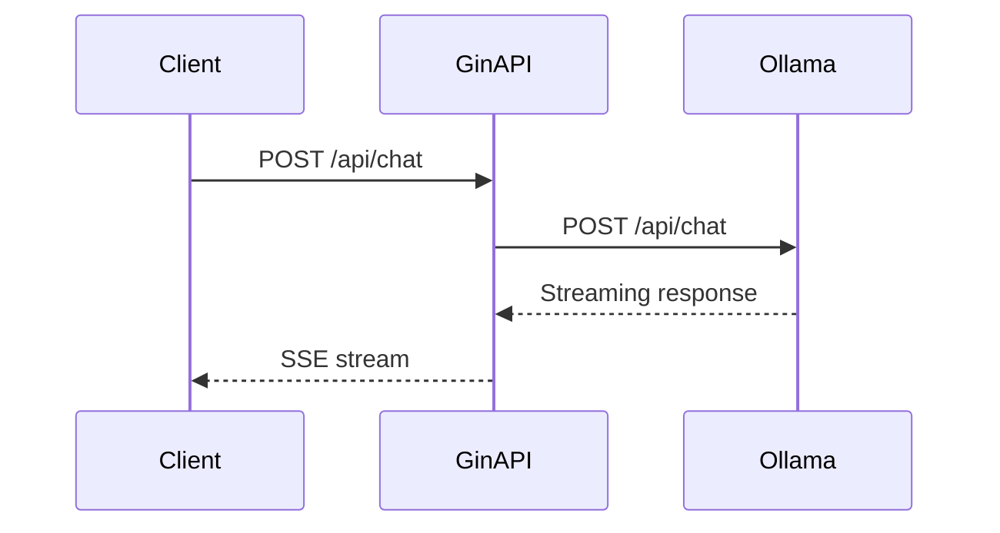

# 🚀 Gin API with Ollama Integration

## Overview

REST APIs are the backbone of production ML systems. This project proves you can build a production-ready Go backend that proxies requests to a local LLM via Ollama. It is a perfect supporting project because it combines HTTP design, JSON handling, and AI integration in one compact repo.

## Prerequisites

- Go 1.22 or later installed
- Ollama running locally (https://ollama.com)
- At least one model pulled (`ollama pull llama3`)
- Basic understanding of REST conventions

## Learning Objectives

1. Design REST endpoints using the Gin framework
2. Proxy requests to Ollama with proper error handling
3. Implement Server-Sent Events (SSE) for streaming responses
4. Write table-driven tests for HTTP handlers

## Official Resources & Links

| Resource | Type | URL | Why It Matters |
|----------|------|-----|----------------|
| Gin Web Framework | Docs | https://gin-gonic.com/docs/ | The most popular Go HTTP framework |
| Ollama REST API | Docs | https://github.com/ollama/ollama/blob/main/docs/api.md | Defines the endpoints you will proxy |
| godotenv | Repo | https://github.com/joho/godotenv | Manages environment configuration |
| testify | Repo | https://github.com/stretchr/testify | Industry-standard Go testing toolkit |
| Go net/http | Docs | https://pkg.go.dev/net/http | Foundation for all HTTP work in Go |

## Architecture & Planning

### API Request Flow



### Key Decisions

- Use Gin for routing and middleware
- Use a custom HTTP client with timeout for Ollama calls
- Use SSE headers for streaming so the frontend can render tokens as they arrive

## Step-by-Step Implementation Guide

1. **Initialize the module.** Run `go mod init github.com/yourusername/go-ollama-api`.

2. **Install dependencies.** Run `go get -u github.com/gin-gonic/gin github.com/joho/godotenv github.com/stretchr/testify`.

3. **Create a `.env` file.** Set `OLLAMA_HOST=http://localhost:11434` and `PORT=8080`.

4. **Build the chat handler.** Accept a JSON body, forward it to Ollama, and return the JSON response. This proves you can integrate external AI services.

5. **Build the streaming handler.** Set `Content-Type: text/event-stream` and flush the Ollama response chunk by chunk. This shows you understand real-time ML inference patterns.

6. **Add a model listing endpoint.** Proxy `GET /api/tags` to Ollama so clients know which models are available.

7. **Write table-driven tests.** Use `httptest` and `testify` to mock Ollama responses and assert status codes.

8. **Add middleware.** Log requests and recover from panics. These are expected in production code.

9. **Containerize.** Write a `Dockerfile` that compiles a static binary and exposes port 8080.

10. **Document.** Add a README with `curl` examples for every endpoint.

## Guide Class / Example

Below is a complete, copy-pasteable `main.go`.

```go
package main

import (
	"bytes"
	"encoding/json"
	"io"
	"log"
	"net/http"
	"net/http/httptest"
	"os"
	"time"

	"github.com/gin-gonic/gin"
	"github.com/joho/godotenv"
)

var ollamaHost string

func init() {
	_ = godotenv.Load()
	host := os.Getenv("OLLAMA_HOST")
	if host == "" {
		host = "http://localhost:11434"
	}
	ollamaHost = host
}

type ChatRequest struct {
	Model    string    `json:"model"`
	Messages []Message `json:"messages"`
	Stream   bool      `json:"stream"`
}

type Message struct {
	Role    string `json:"role"`
	Content string `json:"content"`
}

func chatHandler(c *gin.Context) {
	var req ChatRequest
	if err := c.ShouldBindJSON(&req); err != nil {
		c.JSON(http.StatusBadRequest, gin.H{"error": err.Error()})
		return
	}

	body, _ := json.Marshal(req)
	resp, err := http.Post(ollamaHost+"/api/chat", "application/json", bytes.NewReader(body))
	if err != nil {
		c.JSON(http.StatusInternalServerError, gin.H{"error": err.Error()})
		return
	}
	defer resp.Body.Close()

	if req.Stream {
		c.Header("Content-Type", "text/event-stream")
		c.Header("Cache-Control", "no-cache")
		c.Header("Connection", "keep-alive")
		io.Copy(c.Writer, resp.Body)
		return
	}

	c.DataFromReader(resp.StatusCode, resp.ContentLength, resp.Header.Get("Content-Type"), resp.Body, nil)
}

func listModelsHandler(c *gin.Context) {
	resp, err := http.Get(ollamaHost + "/api/tags")
	if err != nil {
		c.JSON(http.StatusInternalServerError, gin.H{"error": err.Error()})
		return
	}
	defer resp.Body.Close()

	c.DataFromReader(resp.StatusCode, resp.ContentLength, resp.Header.Get("Content-Type"), resp.Body, nil)
}

func main() {
	port := os.Getenv("PORT")
	if port == "" {
		port = "8080"
	}

	r := gin.Default()
	r.POST("/api/chat", chatHandler)
	r.GET("/api/models", listModelsHandler)

	log.Printf("Server running on :%s", port)
	if err := r.Run(":" + port); err != nil {
		log.Fatal(err)
	}
}
```

## Common Pitfalls & Checklist

⚠️ **Forgetting SSE headers:** Without `text/event-stream`, the client will buffer the entire response and the streaming UX will be broken.

⚠️ **No timeouts on Ollama calls:** Local LLMs can hang. Always set a `http.Client` timeout or use `context.WithTimeout`.

⚠️ **Leaking response bodies:** Every `http.Post` and `http.Get` must be paired with `defer resp.Body.Close()` to avoid goroutine leaks.

✅ Checklist

| Checkpoint | Status |
|------------|--------|
| `.env` file loads without errors | [ ] |
| Chat endpoint proxies to Ollama correctly | [ ] |
| Streaming endpoint sets SSE headers | [ ] |
| Model listing endpoint returns available models | [ ] |
| Table-driven tests cover success and error paths | [ ] |
| Dockerfile builds a static binary | [ ] |

## Deployment & Portfolio Integration

Deploy the container to a free tier like Fly.io or Render. Include a `curl` one-liner in your GitHub README so recruiters can test the API in seconds. Mention this project on your resume under "Backend & AI Integration."

## Next Steps

- [[00 - Go Project Planning Guide]]
- [[02 - CLI Tool with Cobra]]
- [[04 - Local RAG System with Go]]
