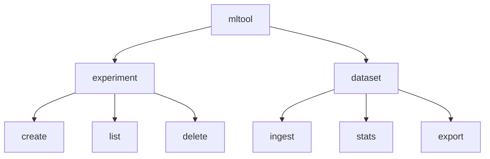

# ⌨️ CLI Tool with Cobra

## Overview

ML engineers spend as much time managing experiments and datasets as they do training models. A polished CLI tool shows you understand developer ergonomics, configuration management, and automation. This project is an ideal supporting piece because it proves you can ship tools that other engineers will actually use.

## Prerequisites

- Go 1.22 or later installed
- Familiarity with command-line interfaces
- A local folder of text or JSON files to use as sample datasets

## Learning Objectives

1. Scaffold a CLI using the Cobra framework
2. Manage configuration with Viper
3. Render progress and tables with terminal UI libraries
4. Parse flags and subcommands for ML workflow tasks

## Official Resources & Links

| Resource | Type | URL | Why It Matters |
|----------|------|-----|----------------|
| Cobra | Docs | https://github.com/spf13/cobra | The standard CLI library for Go |
| Viper | Docs | https://github.com/spf13/viper | Configuration management for Go apps |
| pterm | Repo | https://github.com/pterm/pterm | Rich terminal output (tables, spinners, panels) |
| progressbar | Repo | https://github.com/schollz/progressbar/v3 | Clean progress bars for long operations |
| Go flag package | Docs | https://pkg.go.dev/flag | Understand the standard library before adding dependencies |

## Architecture & Planning

### CLI Command Tree



### Key Decisions

- Use Cobra for command routing and help generation
- Use Viper to support flags, env vars, and config files
- Use pterm for user-friendly output instead of plain `fmt.Println`

## Step-by-Step Implementation Guide

1. **Initialize the module.** Run `go mod init github.com/yourusername/go-ml-cli`.

2. **Install dependencies.** Run `go get -u github.com/spf13/cobra github.com/spf13/viper github.com/pterm/pterm github.com/schollz/progressbar/v3`.

3. **Create the root command.** Define `mltool` with a short and long description. Attach a persistent `--config` flag.

4. **Add the `experiment` subcommand group.** Implement `create`, `list`, and `delete`. Store experiments as JSON files in a local directory.

5. **Add the `dataset` subcommand group.** Implement `ingest` to read files, `stats` to count rows and tokens, and `export` to write CSV.

6. **Integrate Viper.** Bind flags to Viper keys so users can set defaults in a `config.yaml` file.

7. **Add progress bars.** Wrap file ingestion loops with `progressbar` so the user gets visual feedback on large datasets.

8. **Style the output.** Use pterm tables for `list` and `stats` commands so results look professional.

9. **Write tests.** Test command execution with `cobra.Command.ExecuteC` and temporary directories.

10. **Cross-compile.** Build binaries for Linux, macOS, and Windows. Attach them to a GitHub release.

## Guide Class / Example

Below is a complete, copy-pasteable `main.go`.

```go
package main

import (
	"fmt"
	"os"
	"time"

	"github.com/pterm/pterm"
	"github.com/schollz/progressbar/v3"
	"github.com/spf13/cobra"
	"github.com/spf13/viper"
)

var cfgFile string

var rootCmd = &cobra.Command{
	Use:   "mltool",
	Short: "A CLI for managing ML experiments and datasets",
	Long:  `mltool helps you track experiments and manipulate datasets from the terminal.`,
}

var experimentCreateCmd = &cobra.Command{
	Use:   "create [name]",
	Short: "Create a new experiment",
	Args:  cobra.ExactArgs(1),
	Run: func(cmd *cobra.Command, args []string) {
		name := args[0]
		pterm.Success.Println("Created experiment:", name)
	},
}

var experimentListCmd = &cobra.Command{
	Use:   "list",
	Short: "List all experiments",
	Run: func(cmd *cobra.Command, args []string) {
		data := pterm.TableData{
			{"Name", "Created At"},
			{"exp-001", time.Now().Format(time.RFC3339)},
			{"exp-002", time.Now().Format(time.RFC3339)},
		}
		pterm.DefaultTable.WithHasHeader().WithData(data).Render()
	},
}

var datasetIngestCmd = &cobra.Command{
	Use:   "ingest [path]",
	Short: "Ingest a dataset",
	Args:  cobra.ExactArgs(1),
	Run: func(cmd *cobra.Command, args []string) {
		path := args[0]
		bar := progressbar.Default(100)
		for i := 0; i < 100; i++ {
			bar.Add(1)
			time.Sleep(10 * time.Millisecond)
		}
		pterm.Success.Println("Ingested dataset from", path)
	},
}

func init() {
	cobra.OnInitialize(initConfig)
	rootCmd.PersistentFlags().StringVar(&cfgFile, "config", "", "config file (default is $HOME/.mltool.yaml)")

	rootCmd.AddCommand(experimentCmd)
	experimentCmd.AddCommand(experimentCreateCmd)
	experimentCmd.AddCommand(experimentListCmd)

	rootCmd.AddCommand(datasetCmd)
	datasetCmd.AddCommand(datasetIngestCmd)
}

var experimentCmd = &cobra.Command{
	Use:   "experiment",
	Short: "Manage experiments",
}

var datasetCmd = &cobra.Command{
	Use:   "dataset",
	Short: "Manage datasets",
}

func initConfig() {
	if cfgFile != "" {
		viper.SetConfigFile(cfgFile)
	} else {
		home, err := os.UserHomeDir()
		cobra.CheckErr(err)
		viper.AddConfigPath(home)
		viper.SetConfigName(".mltool")
	}
	viper.AutomaticEnv()
	_ = viper.ReadInConfig()
}

func main() {
	if err := rootCmd.Execute(); err != nil {
		fmt.Println(err)
		os.Exit(1)
	}
}
```

## Common Pitfalls & Checklist

⚠️ **Not handling missing config files:** Viper returns an error when a config file is missing even if it is optional. Ignore the error with `_ = viper.ReadInConfig()` unless the file is mandatory.

⚠️ **Panicking instead of returning errors:** Use `cobra.CheckErr` only during initialization. In command `Run` functions, return errors through the function signature and let Cobra print them gracefully.

⚠️ **Ignoring Windows users:** Use `os.UserHomeDir()` instead of hardcoding Unix paths. Test cross-compilation with `GOOS=windows go build`.

✅ Checklist

| Checkpoint | Status |
|------------|--------|
| `mltool --help` prints usage | [ ] |
| Subcommands grouped logically | [ ] |
| Config file loads from home directory | [ ] |
| Progress bar renders during long operations | [ ] |
| Table output uses pterm for readability | [ ] |
| Cross-compiled binaries attached to release | [ ] |

## Deployment & Portfolio Integration

Publish releases with GoReleaser. Add installation instructions for `go install` and binary downloads. On your resume, list this under "Developer Tools" and mention the libraries used (Cobra, Viper).

## Next Steps

- [[00 - Go Project Planning Guide]]
- [[01 - Gin API with Ollama Integration]]
- [[03 - Microservice with gRPC and Kubernetes]]
